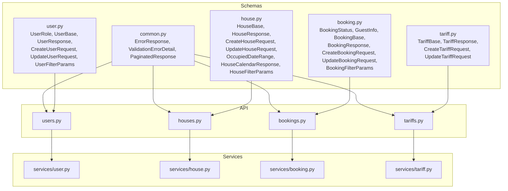
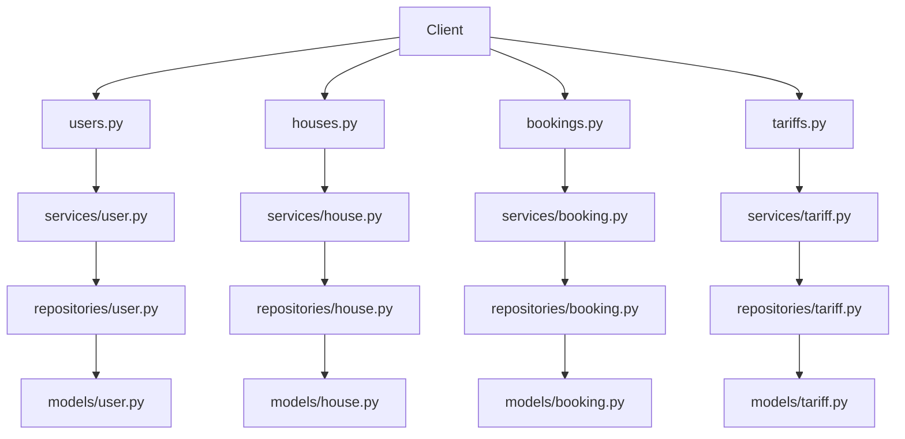
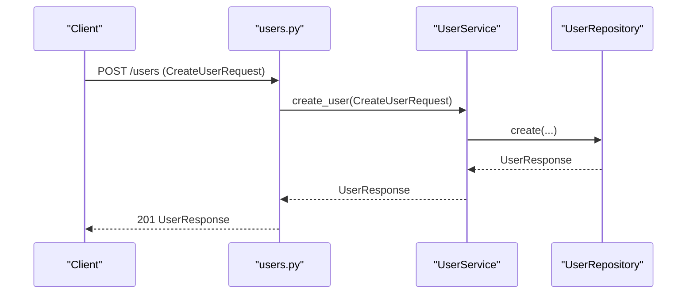
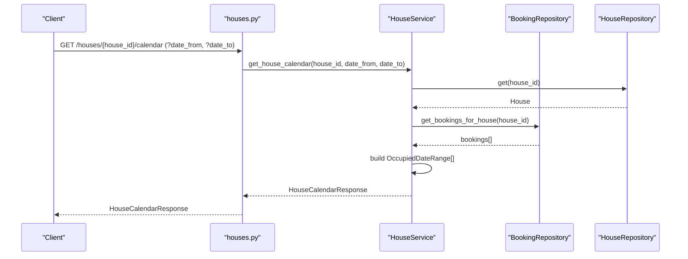
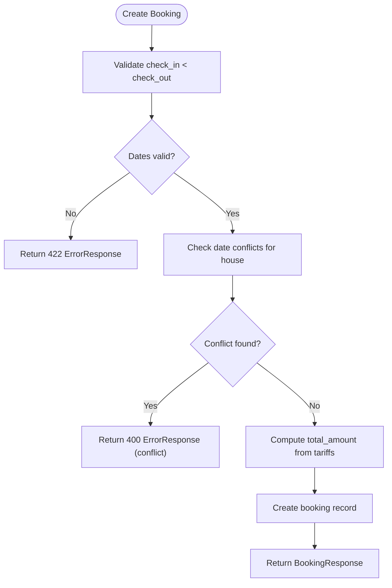
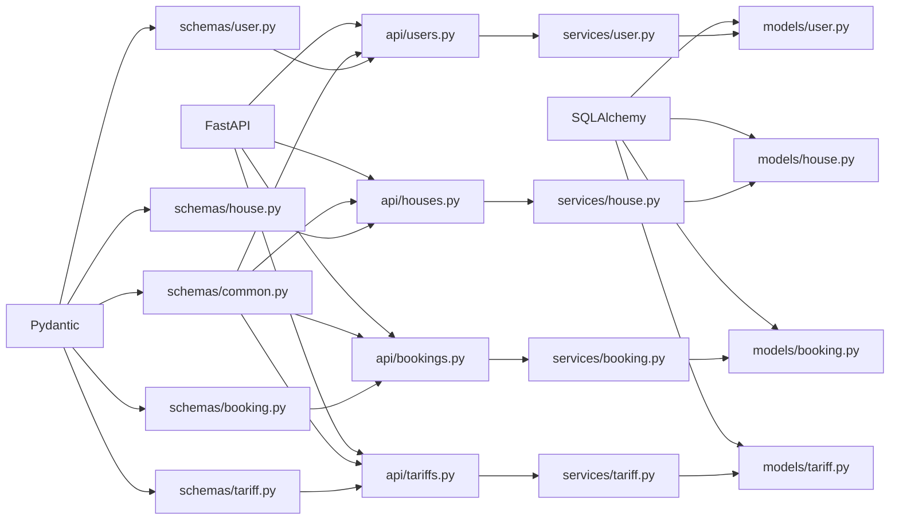

# API Contracts and Schemas

<cite>
**Referenced Files in This Document**
- [backend/schemas/__init__.py](file://backend/schemas/__init__.py)
- [backend/schemas/common.py](file://backend/schemas/common.py)
- [backend/schemas/user.py](file://backend/schemas/user.py)
- [backend/schemas/house.py](file://backend/schemas/house.py)
- [backend/schemas/booking.py](file://backend/schemas/booking.py)
- [backend/schemas/tariff.py](file://backend/schemas/tariff.py)
- [backend/api/users.py](file://backend/api/users.py)
- [backend/api/houses.py](file://backend/api/houses.py)
- [backend/api/bookings.py](file://backend/api/bookings.py)
- [backend/api/tariffs.py](file://backend/api/tariffs.py)
- [backend/services/user.py](file://backend/services/user.py)
- [backend/services/house.py](file://backend/services/house.py)
- [backend/services/booking.py](file://backend/services/booking.py)
- [backend/services/tariff.py](file://backend/services/tariff.py)
- [backend/models/user.py](file://backend/models/user.py)
- [backend/models/house.py](file://backend/models/house.py)
- [backend/models/booking.py](file://backend/models/booking.py)
- [backend/models/tariff.py](file://backend/models/tariff.py)
</cite>

## Table of Contents
1. [Introduction](#introduction)
2. [Project Structure](#project-structure)
3. [Core Components](#core-components)
4. [Architecture Overview](#architecture-overview)
5. [Detailed Component Analysis](#detailed-component-analysis)
6. [Dependency Analysis](#dependency-analysis)
7. [Performance Considerations](#performance-considerations)
8. [Troubleshooting Guide](#troubleshooting-guide)
9. [Conclusion](#conclusion)
10. [Appendices](#appendices)

## Introduction
This document explains the API contracts and schemas that define request/response validation and data transfer objects across the backend. It focuses on Pydantic models, schema validation, and serialization patterns used by FastAPI endpoints. You will learn the schema definitions for all entities, validation rules, error response formats, pagination wrappers, and how these schemas integrate with services and repositories to produce consistent, validated data transfers.

## Project Structure
The schemas are organized by domain resources and a shared module for common DTOs. Each resource module defines:
- Base schema(s) for shared fields
- Request schemas for creation/update
- Response schemas for retrieval
- Filter/query parameter schemas for list endpoints
- Supporting nested DTOs (e.g., guest composition, calendar ranges)

**Diagram sources**
- [backend/schemas/common.py:1-43](file://backend/schemas/common.py#L1-L43)
- [backend/schemas/user.py:1-72](file://backend/schemas/user.py#L1-L72)
- [backend/schemas/house.py:1-107](file://backend/schemas/house.py#L1-L107)
- [backend/schemas/booking.py:1-133](file://backend/schemas/booking.py#L1-L133)
- [backend/schemas/tariff.py:1-54](file://backend/schemas/tariff.py#L1-L54)
- [backend/api/users.py:1-223](file://backend/api/users.py#L1-L223)
- [backend/api/houses.py:1-266](file://backend/api/houses.py#L1-L266)
- [backend/api/bookings.py:1-223](file://backend/api/bookings.py#L1-L223)
- [backend/api/tariffs.py:1-187](file://backend/api/tariffs.py#L1-L187)
- [backend/services/user.py:1-183](file://backend/services/user.py#L1-L183)
- [backend/services/house.py:1-253](file://backend/services/house.py#L1-L253)
- [backend/services/booking.py:1-322](file://backend/services/booking.py#L1-L322)
- [backend/services/tariff.py:1-144](file://backend/services/tariff.py#L1-L144)

**Section sources**
- [backend/schemas/__init__.py:1-63](file://backend/schemas/__init__.py#L1-L63)

## Core Components
This section documents the shared and resource-specific schemas, their fields, validation rules, and serialization characteristics.

- Shared schemas
  - ErrorResponse: Standardized error envelope with error code, human-readable message, and optional validation details.
  - ValidationErrorDetail: Describes a single validation error with optional field, message, and type.
  - PaginatedResponse[T]: Generic wrapper for list endpoints with items, total, limit, and offset.

- User schemas
  - UserRole: Enumerated roles (tenant, owner, both).
  - UserBase: Common fields for user (name, role).
  - UserResponse: Extends base with identifiers and timestamps; configured for attribute-based serialization.
  - CreateUserRequest: Minimal creation payload (name, role, telegram_id).
  - UpdateUserRequest: Partial update with optional fields.
  - UserFilterParams: Pagination, sorting, and role filter for listing users.

- House schemas
  - HouseBase: Common fields (name, description, capacity, is_active).
  - HouseResponse: Extends base with identifiers and timestamps; attribute-based serialization.
  - CreateHouseRequest: Inherits base fields.
  - UpdateHouseRequest: Partial update with optional fields.
  - OccupiedDateRange: Nested DTO for calendar entries.
  - HouseCalendarResponse: Wrapper for house availability with list of occupied ranges.
  - HouseFilterParams: Pagination, sorting, and filters (owner_id, is_active, capacity bounds).

- Booking schemas
  - BookingStatus: Enumerated statuses (pending, confirmed, cancelled, completed).
  - GuestInfo: Nested DTO for planned guest composition (tariff_id, count).
  - BookingBase: Common fields (house_id, check_in, check_out).
  - BookingResponse: Extends base with identifiers, guest lists, totals, status, timestamps; attribute-based serialization.
  - CreateBookingRequest: Extends base with guests list; includes a post-validator ensuring check_in < check_out.
  - UpdateBookingRequest: Partial update with optional fields and a similar validator.
  - BookingFilterParams: Pagination, sorting, and filters (user_id, house_id, status, date ranges).

- Tariff schemas
  - TariffBase: Common fields (name, amount).
  - TariffResponse: Extends base with identifiers and timestamps; attribute-based serialization.
  - CreateTariffRequest: Inherits base fields.
  - UpdateTariffRequest: Partial update with optional fields.

Serialization and validation highlights:
- Attribute-based serialization: Response models set a configuration enabling conversion from ORM attributes.
- Range and length constraints: Strings and integers enforce min/max lengths and numeric bounds.
- Post-validation: Custom validators ensure logical constraints (e.g., date ordering) after initial field-level validation.
- Nested structures: GuestInfo and OccupiedDateRange enable complex, structured payloads.

**Section sources**
- [backend/schemas/common.py:1-43](file://backend/schemas/common.py#L1-L43)
- [backend/schemas/user.py:1-72](file://backend/schemas/user.py#L1-L72)
- [backend/schemas/house.py:1-107](file://backend/schemas/house.py#L1-L107)
- [backend/schemas/booking.py:1-133](file://backend/schemas/booking.py#L1-L133)
- [backend/schemas/tariff.py:1-54](file://backend/schemas/tariff.py#L1-L54)

## Architecture Overview
The API layer uses FastAPI route handlers that declare request/response models. Services encapsulate business logic and orchestrate repository calls. Schemas validate incoming requests and serialize outgoing responses. Shared schemas standardize error and pagination responses.

**Diagram sources**
- [backend/api/users.py:1-223](file://backend/api/users.py#L1-L223)
- [backend/api/houses.py:1-266](file://backend/api/houses.py#L1-L266)
- [backend/api/bookings.py:1-223](file://backend/api/bookings.py#L1-L223)
- [backend/api/tariffs.py:1-187](file://backend/api/tariffs.py#L1-L187)
- [backend/services/user.py:1-183](file://backend/services/user.py#L1-L183)
- [backend/services/house.py:1-253](file://backend/services/house.py#L1-L253)
- [backend/services/booking.py:1-322](file://backend/services/booking.py#L1-L322)
- [backend/services/tariff.py:1-144](file://backend/services/tariff.py#L1-L144)
- [backend/models/user.py:1-32](file://backend/models/user.py#L1-L32)
- [backend/models/house.py:1-24](file://backend/models/house.py#L1-L24)
- [backend/models/booking.py:1-41](file://backend/models/booking.py#L1-L41)
- [backend/models/tariff.py:1-21](file://backend/models/tariff.py#L1-L21)

## Detailed Component Analysis

### Shared Schemas: Error and Pagination
- ErrorResponse
  - Purpose: Standardized error envelopes for all endpoints.
  - Fields: error (code), message (human-readable), details (optional list of ValidationErrorDetail).
- ValidationErrorDetail
  - Purpose: Describe individual validation failures with optional field, msg, and type.
- PaginatedResponse[T]
  - Purpose: Wrap list responses with pagination metadata.
  - Fields: items (list of T), total (non-negative), limit (positive), offset (non-negative).

Usage pattern:
- API routes declare response_model=ErrorResponse for 422/4xx error cases.
- List endpoints return PaginatedResponse[ResourceResponse].

**Section sources**
- [backend/schemas/common.py:1-43](file://backend/schemas/common.py#L1-L43)

### User Resource
- Schemas
  - UserRole enum
  - UserBase: name (1–100), role (default tenant)
  - UserResponse: id, telegram_id, created_at; attribute-based serialization
  - CreateUserRequest: telegram_id plus base fields
  - UpdateUserRequest: optional name and role
  - UserFilterParams: limit (1–100), offset, sort, role
- API endpoints
  - GET /users: returns PaginatedResponse[UserResponse]
  - GET /users/{id}: returns UserResponse or ErrorResponse
  - POST /users: creates with CreateUserRequest; returns UserResponse or ErrorResponse
  - PUT /users/{id}: replaces with CreateUserRequest; returns UserResponse or ErrorResponse
  - PATCH /users/{id}: partial update with UpdateUserRequest; returns UserResponse or ErrorResponse
  - DELETE /users/{id}: deletes; returns 204 or ErrorResponse
- Service logic
  - Business logic for CRUD and pagination/filtering; raises domain-specific not-found errors.

**Diagram sources**
- [backend/api/users.py:85-116](file://backend/api/users.py#L85-L116)
- [backend/services/user.py:50-63](file://backend/services/user.py#L50-L63)

**Section sources**
- [backend/schemas/user.py:1-72](file://backend/schemas/user.py#L1-L72)
- [backend/api/users.py:1-223](file://backend/api/users.py#L1-L223)
- [backend/services/user.py:1-183](file://backend/services/user.py#L1-L183)

### House Resource
- Schemas
  - HouseBase: name (1–100), description (≤1000), capacity (≥1), is_active (bool)
  - HouseResponse: id, owner_id, created_at; attribute-based serialization
  - CreateHouseRequest: inherits base
  - UpdateHouseRequest: optional fields
  - OccupiedDateRange: check_in, check_out, booking_id
  - HouseCalendarResponse: house_id, occupied_dates
  - HouseFilterParams: limit (1–100), offset, sort, owner_id, is_active, capacity_min/max
- API endpoints
  - GET /houses: returns PaginatedResponse[HouseResponse]
  - GET /houses/{id}: returns HouseResponse or ErrorResponse
  - POST /houses: creates with CreateHouseRequest; returns HouseResponse or ErrorResponse
  - PUT /houses/{id}: replaces; returns HouseResponse or ErrorResponse
  - PATCH /houses/{id}: partial update; returns HouseResponse or ErrorResponse
  - DELETE /houses/{id}: deletes; returns 204 or ErrorResponse
  - GET /houses/{id}/calendar: returns HouseCalendarResponse or ErrorResponse
- Service logic
  - Calendar computation aggregates bookings for a house and filters by optional date range.

**Diagram sources**
- [backend/api/houses.py:229-266](file://backend/api/houses.py#L229-L266)
- [backend/services/house.py:207-253](file://backend/services/house.py#L207-L253)

**Section sources**
- [backend/schemas/house.py:1-107](file://backend/schemas/house.py#L1-L107)
- [backend/api/houses.py:1-266](file://backend/api/houses.py#L1-L266)
- [backend/services/house.py:1-253](file://backend/services/house.py#L1-L253)

### Booking Resource
- Schemas
  - BookingStatus enum
  - GuestInfo: tariff_id (≥1), count (≥1)
  - BookingBase: house_id (≥1), check_in, check_out
  - BookingResponse: id, tenant_id, guests_planned, guests_actual, total_amount (≥0), status, created_at; attribute-based serialization
  - CreateBookingRequest: extends base with guests; post-validator enforces check_in < check_out
  - UpdateBookingRequest: optional fields; post-validator enforces check_in < check_out when both provided
  - BookingFilterParams: limit (1–100), offset, sort, user_id, house_id, status, date range filters
- API endpoints
  - GET /bookings: returns PaginatedResponse[BookingResponse]
  - GET /bookings/{id}: returns BookingResponse or ErrorResponse
  - POST /bookings: creates with CreateBookingRequest; returns BookingResponse or ErrorResponse (400 for conflicts)
  - PATCH /bookings/{id}: updates; returns BookingResponse or ErrorResponse (403 for permission, 400 for invalid status)
  - DELETE /bookings/{id}: cancels; returns BookingResponse or ErrorResponse (403 for permission, 400 for invalid status)
- Service logic
  - Date conflict detection via overlap check.
  - Amount calculation by summing tariff rates × guest counts.
  - Authorization checks and status validations for updates/cancellations.

**Diagram sources**
- [backend/api/bookings.py:86-127](file://backend/api/bookings.py#L86-L127)
- [backend/services/booking.py:127-171](file://backend/services/booking.py#L127-L171)

**Section sources**
- [backend/schemas/booking.py:1-133](file://backend/schemas/booking.py#L1-L133)
- [backend/api/bookings.py:1-223](file://backend/api/bookings.py#L1-L223)
- [backend/services/booking.py:1-322](file://backend/services/booking.py#L1-L322)

### Tariff Resource
- Schemas
  - TariffBase: name (1–100), amount (≥0)
  - TariffResponse: id, created_at; attribute-based serialization
  - CreateTariffRequest: inherits base
  - UpdateTariffRequest: optional fields
- API endpoints
  - GET /tariffs: returns PaginatedResponse[TariffResponse]
  - GET /tariffs/{id}: returns TariffResponse or ErrorResponse
  - POST /tariffs: creates with CreateTariffRequest; returns TariffResponse or ErrorResponse
  - PATCH /tariffs/{id}: updates; returns TariffResponse or ErrorResponse
  - DELETE /tariffs/{id}: deletes; returns 204 or ErrorResponse

**Section sources**
- [backend/schemas/tariff.py:1-54](file://backend/schemas/tariff.py#L1-L54)
- [backend/api/tariffs.py:1-187](file://backend/api/tariffs.py#L1-L187)
- [backend/services/tariff.py:1-144](file://backend/services/tariff.py#L1-L144)

### Conceptual Overview
- Pydantic validation pipeline
  - Field-level validators apply constraints (lengths, ranges, types).
  - Post-validation (model_validator) enforces cross-field invariants (e.g., date ordering).
  - Serialization converts Pydantic models to JSON; attribute-based serialization bridges ORM models to DTOs.
- FastAPI integration
  - Route handlers declare request/response models; FastAPI auto-generates OpenAPI specs and validates payloads.
  - Error responses conform to ErrorResponse for consistent client handling.

[No sources needed since this section doesn't analyze specific source files]

## Dependency Analysis
- Cohesion and coupling
  - Schemas are cohesive per resource and reused across API and service layers.
  - APIs depend on schemas; services depend on schemas and repositories; repositories map to SQLAlchemy models.
- External dependencies
  - Pydantic for validation and serialization.
  - FastAPI for routing and automatic OpenAPI generation.
  - SQLAlchemy for persistence; models mirror schema fields and enums.

**Diagram sources**
- [backend/schemas/common.py:1-43](file://backend/schemas/common.py#L1-L43)
- [backend/schemas/user.py:1-72](file://backend/schemas/user.py#L1-L72)
- [backend/schemas/house.py:1-107](file://backend/schemas/house.py#L1-L107)
- [backend/schemas/booking.py:1-133](file://backend/schemas/booking.py#L1-L133)
- [backend/schemas/tariff.py:1-54](file://backend/schemas/tariff.py#L1-L54)
- [backend/api/users.py:1-223](file://backend/api/users.py#L1-L223)
- [backend/api/houses.py:1-266](file://backend/api/houses.py#L1-L266)
- [backend/api/bookings.py:1-223](file://backend/api/bookings.py#L1-L223)
- [backend/api/tariffs.py:1-187](file://backend/api/tariffs.py#L1-L187)
- [backend/services/user.py:1-183](file://backend/services/user.py#L1-L183)
- [backend/services/house.py:1-253](file://backend/services/house.py#L1-L253)
- [backend/services/booking.py:1-322](file://backend/services/booking.py#L1-L322)
- [backend/services/tariff.py:1-144](file://backend/services/tariff.py#L1-L144)
- [backend/models/user.py:1-32](file://backend/models/user.py#L1-L32)
- [backend/models/house.py:1-24](file://backend/models/house.py#L1-L24)
- [backend/models/booking.py:1-41](file://backend/models/booking.py#L1-L41)
- [backend/models/tariff.py:1-21](file://backend/models/tariff.py#L1-L21)

**Section sources**
- [backend/schemas/__init__.py:1-63](file://backend/schemas/__init__.py#L1-L63)

## Performance Considerations
- Validation cost
  - Field-level constraints are inexpensive; post-validators add minimal overhead.
  - Date conflict checks iterate existing bookings; keep queries efficient with proper indexing.
- Serialization
  - Attribute-based serialization avoids manual field mapping; ensure ORM queries select only needed columns.
- Pagination
  - Use limit/offset carefully; consider cursor-based pagination for very large datasets.
- Nested structures
  - GuestInfo and calendar ranges are small; avoid loading unnecessary related records.

[No sources needed since this section provides general guidance]

## Troubleshooting Guide
- Validation errors
  - ErrorResponse wraps ValidationErrorDetail for precise field-level diagnostics.
  - For 422 responses, inspect details for field names and messages.
- Common issues
  - Date ordering: Ensure check_in < check_out in CreateBookingRequest and UpdateBookingRequest.
  - Conflicting dates: If receiving conflict errors, adjust dates or check house availability via calendar endpoint.
  - Permissions: Update/cancel booking requires ownership; expect 403 if unauthorized.
  - Not found: Many endpoints return 404 with ErrorResponse when entities do not exist.
- Error response format
  - Always contains error (code), message (description), and optional details (field-specific errors).

**Section sources**
- [backend/schemas/common.py:16-28](file://backend/schemas/common.py#L16-L28)
- [backend/api/bookings.py:94-102](file://backend/api/bookings.py#L94-L102)
- [backend/services/booking.py:78-107](file://backend/services/booking.py#L78-L107)

## Conclusion
The API contracts and schemas establish a consistent, validated, and serializable interface across the backend. Pydantic models define strict request/response contracts, while shared schemas standardize error and pagination responses. FastAPI integrates these schemas to provide robust validation and OpenAPI documentation. Services encapsulate business logic and coordinate with repositories and models, ensuring reliable data transfer and predictable behavior.

[No sources needed since this section summarizes without analyzing specific files]

## Appendices

### Schema Design Patterns and Best Practices
- Use attribute-based serialization on response models to bridge ORM and DTO cleanly.
- Prefer optional fields for partial updates to reduce payload size and ambiguity.
- Enforce cross-field invariants with post-validation to maintain logical consistency.
- Keep shared error and pagination schemas centralized for uniform client experience.

[No sources needed since this section provides general guidance]

### API Versioning Strategy
- No explicit versioning is implemented in the current codebase. Consider adopting URL path versioning (/v1/users) or header-based versioning for future-proofing.

[No sources needed since this section provides general guidance]