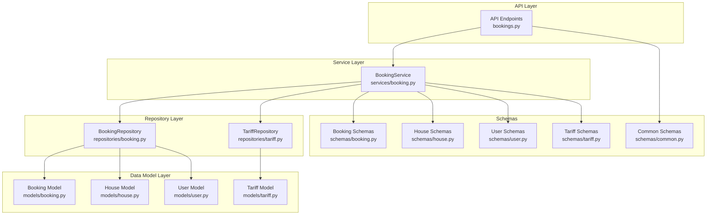
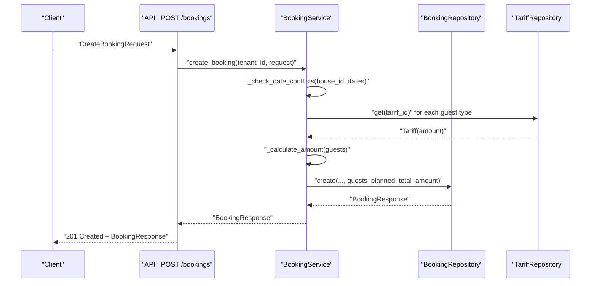
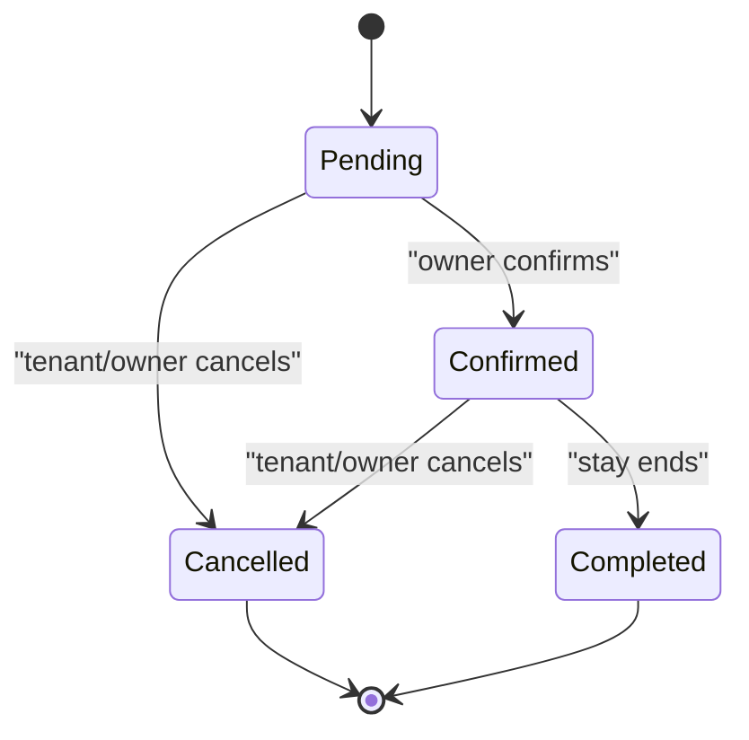
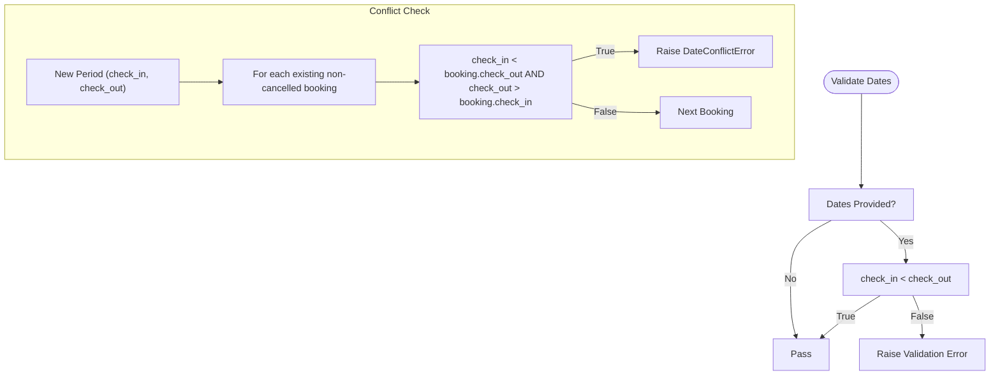
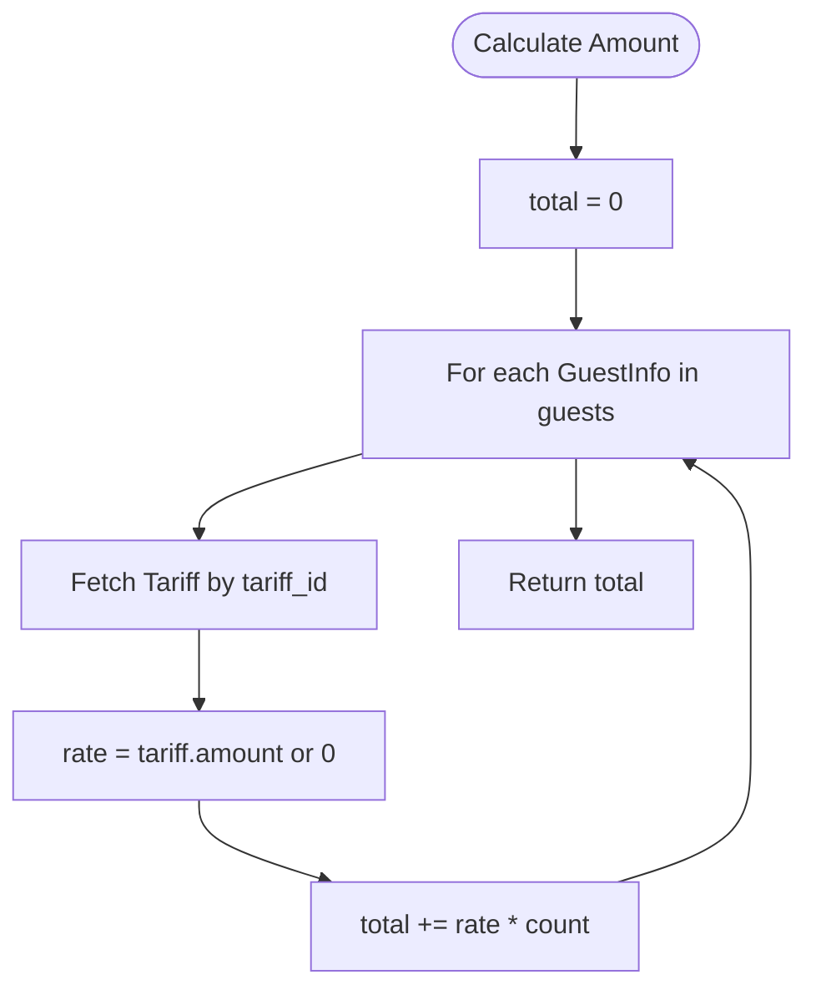
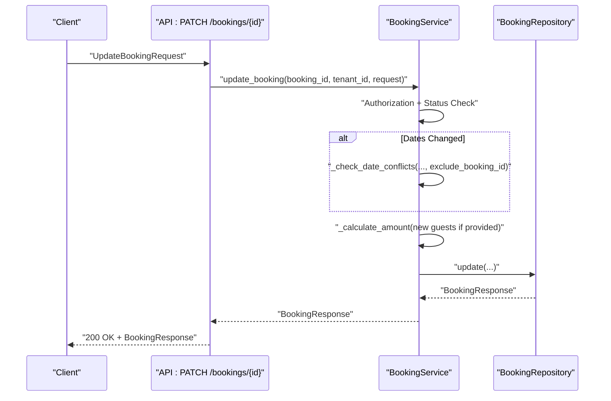
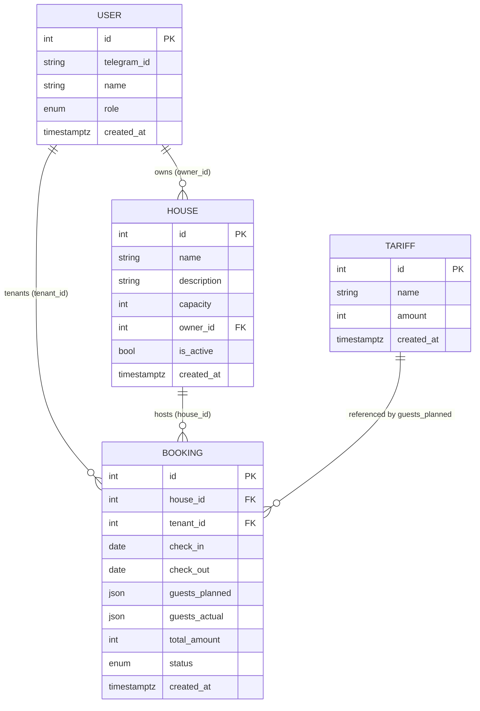
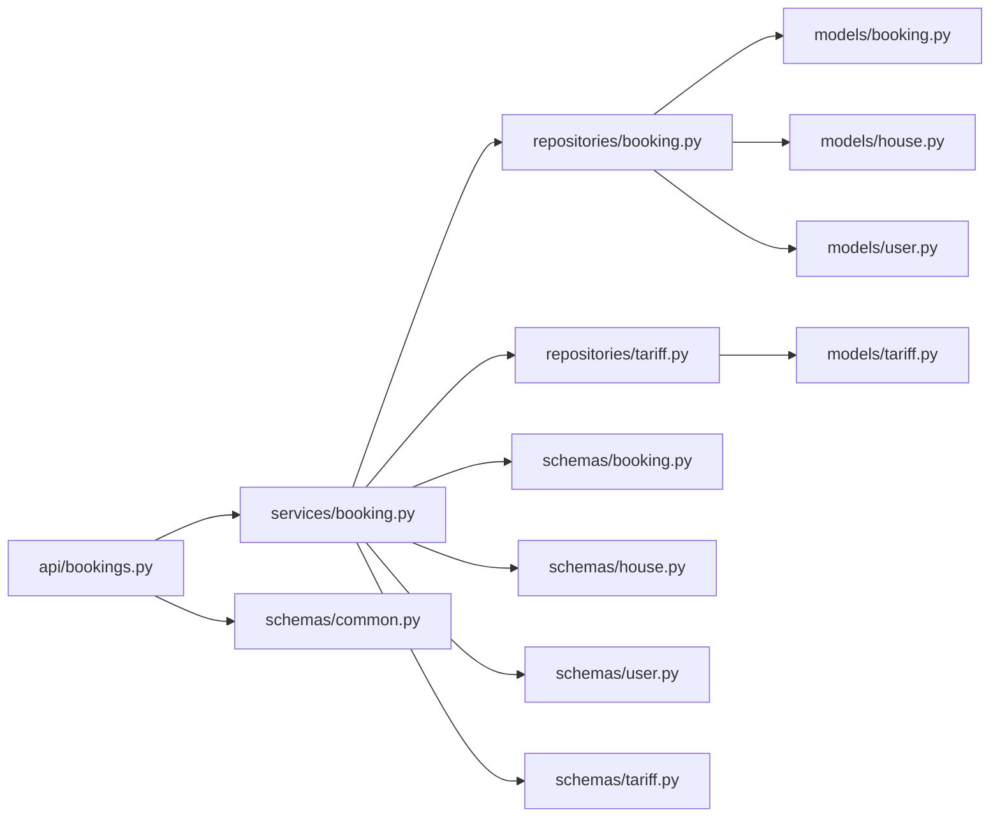

# Booking and Reservation Schemas

<cite>
**Referenced Files in This Document**
- [backend/schemas/booking.py](file://backend/schemas/booking.py)
- [backend/models/booking.py](file://backend/models/booking.py)
- [backend/services/booking.py](file://backend/services/booking.py)
- [backend/repositories/booking.py](file://backend/repositories/booking.py)
- [backend/api/bookings.py](file://backend/api/bookings.py)
- [backend/schemas/house.py](file://backend/schemas/house.py)
- [backend/models/house.py](file://backend/models/house.py)
- [backend/schemas/user.py](file://backend/schemas/user.py)
- [backend/models/user.py](file://backend/models/user.py)
- [backend/schemas/tariff.py](file://backend/schemas/tariff.py)
- [backend/models/tariff.py](file://backend/models/tariff.py)
- [backend/repositories/tariff.py](file://backend/repositories/tariff.py)
- [backend/schemas/common.py](file://backend/schemas/common.py)
- [backend/tests/test_bookings.py](file://backend/tests/test_bookings.py)
</cite>

## Table of Contents
1. [Introduction](#introduction)
2. [Project Structure](#project-structure)
3. [Core Components](#core-components)
4. [Architecture Overview](#architecture-overview)
5. [Detailed Component Analysis](#detailed-component-analysis)
6. [Dependency Analysis](#dependency-analysis)
7. [Performance Considerations](#performance-considerations)
8. [Troubleshooting Guide](#troubleshooting-guide)
9. [Conclusion](#conclusion)
10. [Appendices](#appendices)

## Introduction
This document explains the booking and reservation schema implementation in the project, focusing on Pydantic models and schemas used for managing reservations. It covers:
- Field definitions and validation rules for booking dates, guest composition, and status
- Booking lifecycle from creation to cancellation
- Conflict detection and date-range validation
- Relationships between bookings, users, houses, and tariffs
- Practical examples drawn from the test suite

The goal is to make the reservation system understandable for beginners while providing sufficient technical depth for experienced developers.

## Project Structure
The booking feature spans schemas, models, repositories, services, and API endpoints. The following diagram shows how these pieces fit together.

**Diagram sources**
- [backend/api/bookings.py:1-223](file://backend/api/bookings.py#L1-L223)
- [backend/services/booking.py:1-322](file://backend/services/booking.py#L1-L322)
- [backend/repositories/booking.py:1-224](file://backend/repositories/booking.py#L1-L224)
- [backend/repositories/tariff.py:1-151](file://backend/repositories/tariff.py#L1-L151)
- [backend/models/booking.py:1-41](file://backend/models/booking.py#L1-L41)
- [backend/models/house.py:1-24](file://backend/models/house.py#L1-L24)
- [backend/models/user.py:1-32](file://backend/models/user.py#L1-L32)
- [backend/models/tariff.py:1-21](file://backend/models/tariff.py#L1-L21)
- [backend/schemas/booking.py:1-133](file://backend/schemas/booking.py#L1-L133)
- [backend/schemas/house.py:1-107](file://backend/schemas/house.py#L1-L107)
- [backend/schemas/user.py:1-72](file://backend/schemas/user.py#L1-L72)
- [backend/schemas/tariff.py:1-54](file://backend/schemas/tariff.py#L1-L54)
- [backend/schemas/common.py:1-43](file://backend/schemas/common.py#L1-L43)

**Section sources**
- [backend/api/bookings.py:1-223](file://backend/api/bookings.py#L1-L223)
- [backend/services/booking.py:1-322](file://backend/services/booking.py#L1-L322)
- [backend/repositories/booking.py:1-224](file://backend/repositories/booking.py#L1-L224)
- [backend/repositories/tariff.py:1-151](file://backend/repositories/tariff.py#L1-L151)
- [backend/models/booking.py:1-41](file://backend/models/booking.py#L1-L41)
- [backend/models/house.py:1-24](file://backend/models/house.py#L1-L24)
- [backend/models/user.py:1-32](file://backend/models/user.py#L1-L32)
- [backend/models/tariff.py:1-21](file://backend/models/tariff.py#L1-L21)
- [backend/schemas/booking.py:1-133](file://backend/schemas/booking.py#L1-L133)
- [backend/schemas/house.py:1-107](file://backend/schemas/house.py#L1-L107)
- [backend/schemas/user.py:1-72](file://backend/schemas/user.py#L1-L72)
- [backend/schemas/tariff.py:1-54](file://backend/schemas/tariff.py#L1-L54)
- [backend/schemas/common.py:1-43](file://backend/schemas/common.py#L1-L43)

## Core Components
This section documents the Pydantic schemas and SQLAlchemy models that define the booking domain.

- BookingStatus enum
  - Values: pending, confirmed, cancelled, completed
  - Used consistently across schemas and models

- GuestInfo
  - tarif_id: integer ID of a tariff type
  - count: number of guests of that tariff type
  - Both fields are positive integers

- BookingBase
  - house_id: ID of the booked house
  - check_in: check-in date
  - check_out: check-out date

- BookingResponse
  - Extends BookingBase
  - Adds: id, tenant_id, guests_planned, guests_actual, total_amount, status, created_at
  - Uses from_attributes for ORM compatibility

- CreateBookingRequest
  - Extends BookingBase
  - guests: list of GuestInfo (required, non-empty)
  - Validation: check_in must be strictly before check_out

- UpdateBookingRequest
  - Optional fields: check_in, check_out, guests, status
  - Validation: if both dates provided, check_in must be strictly before check_out

- BookingFilterParams
  - Pagination: limit (1–100), offset
  - Sorting: field name, prefix with "-" for descending
  - Filters: user_id, house_id, status
  - Date range filters: check_in_from/to, check_out_from/to

- SQLAlchemy Booking model
  - Fields: id, house_id (FK), tenant_id (FK), check_in, check_out, guests_planned (JSON), guests_actual (JSON), total_amount, status, created_at
  - Status defaults to pending

- Related entities
  - House: owner_id (FK to users), capacity, is_active
  - User: roles (tenant, owner, both), telegram_id
  - Tariff: name, amount (price per night)

**Section sources**
- [backend/schemas/booking.py:10-133](file://backend/schemas/booking.py#L10-L133)
- [backend/models/booking.py:11-41](file://backend/models/booking.py#L11-L41)
- [backend/schemas/house.py:9-44](file://backend/schemas/house.py#L9-L44)
- [backend/models/house.py:9-24](file://backend/models/house.py#L9-L24)
- [backend/schemas/user.py:10-36](file://backend/schemas/user.py#L10-L36)
- [backend/models/user.py:11-32](file://backend/models/user.py#L11-L32)
- [backend/schemas/tariff.py:9-35](file://backend/schemas/tariff.py#L9-L35)
- [backend/models/tariff.py:9-21](file://backend/models/tariff.py#L9-L21)

## Architecture Overview
The booking lifecycle follows a layered architecture:
- API layer validates inputs and delegates to the service
- Service orchestrates business rules: conflict detection, amount calculation, and status transitions
- Repositories persist and query data
- Models represent persisted entities

**Diagram sources**
- [backend/api/bookings.py:104-127](file://backend/api/bookings.py#L104-L127)
- [backend/services/booking.py:127-170](file://backend/services/booking.py#L127-L170)
- [backend/repositories/booking.py:24-58](file://backend/repositories/booking.py#L24-L58)
- [backend/repositories/tariff.py:43-56](file://backend/repositories/tariff.py#L43-L56)

**Section sources**
- [backend/api/bookings.py:104-127](file://backend/api/bookings.py#L104-L127)
- [backend/services/booking.py:127-170](file://backend/services/booking.py#L127-L170)
- [backend/repositories/booking.py:24-58](file://backend/repositories/booking.py#L24-L58)
- [backend/repositories/tariff.py:43-56](file://backend/repositories/tariff.py#L43-L56)

## Detailed Component Analysis

### Booking Lifecycle and Status Management
- Initial state: pending
- Allowed transitions:
  - pending → confirmed (owner action)
  - pending → cancelled (tenant or owner)
  - confirmed → completed (after stay)
  - cancelled → none (final)
- Restrictions:
  - Updates allowed only for pending or confirmed
  - Cancelling already cancelled or completed is invalid

**Section sources**
- [backend/schemas/booking.py:10-23](file://backend/schemas/booking.py#L10-L23)
- [backend/models/booking.py:11-18](file://backend/models/booking.py#L11-L18)
- [backend/services/booking.py:238-243](file://backend/services/booking.py#L238-L243)
- [backend/services/booking.py:283-321](file://backend/services/booking.py#L283-L321)

### Date Range Validation and Conflict Detection
- Creation and update enforce check_in < check_out when both are present
- Overlap detection uses interval overlap formula: start_a < end_b AND end_a > start_b
- Excludes cancelled bookings from conflict checks

**Diagram sources**
- [backend/schemas/booking.py:82-107](file://backend/schemas/booking.py#L82-L107)
- [backend/services/booking.py:78-107](file://backend/services/booking.py#L78-L107)
- [backend/repositories/booking.py:199-223](file://backend/repositories/booking.py#L199-L223)

**Section sources**
- [backend/schemas/booking.py:82-107](file://backend/schemas/booking.py#L82-L107)
- [backend/services/booking.py:78-107](file://backend/services/booking.py#L78-L107)
- [backend/repositories/booking.py:199-223](file://backend/repositories/booking.py#L199-L223)

### Amount Calculation and Tariff Integration
- Guests are described by GuestInfo entries
- For each GuestInfo, fetch Tariff by tariff_id and multiply amount × count
- Sum totals to produce total_amount

**Diagram sources**
- [backend/services/booking.py:108-125](file://backend/services/booking.py#L108-L125)
- [backend/repositories/tariff.py:43-56](file://backend/repositories/tariff.py#L43-L56)

**Section sources**
- [backend/services/booking.py:108-125](file://backend/services/booking.py#L108-L125)
- [backend/repositories/tariff.py:43-56](file://backend/repositories/tariff.py#L43-L56)

### API Endpoints and Workflows
- POST /bookings
  - Validates request via CreateBookingRequest
  - Checks date conflicts and calculates amount
  - Returns 201 with BookingResponse
- GET /bookings
  - Lists bookings with pagination and filters
  - Supports sorting and date-range filters
- GET /bookings/{id}
  - Returns a single booking or 404
- PATCH /bookings/{id}
  - Updates dates, guests, or status with validation
  - Enforces ownership and status rules
- DELETE /bookings/{id}
  - Cancels a booking (sets status to cancelled)

**Diagram sources**
- [backend/api/bookings.py:154-177](file://backend/api/bookings.py#L154-L177)
- [backend/services/booking.py:210-281](file://backend/services/booking.py#L210-L281)
- [backend/repositories/booking.py:132-178](file://backend/repositories/booking.py#L132-L178)

**Section sources**
- [backend/api/bookings.py:104-127](file://backend/api/bookings.py#L104-L127)
- [backend/api/bookings.py:154-177](file://backend/api/bookings.py#L154-L177)
- [backend/api/bookings.py:180-222](file://backend/api/bookings.py#L180-L222)
- [backend/services/booking.py:210-281](file://backend/services/booking.py#L210-L281)
- [backend/repositories/booking.py:132-178](file://backend/repositories/booking.py#L132-L178)

### Relationship Between Entities
- Booking belongs to a House (house_id) and a User (tenant_id)
- Guest composition references Tariff entries (tariff_id)
- House owner is a User; House has capacity and is_active flag
- Tariff defines price per night

**Diagram sources**
- [backend/models/user.py:19-32](file://backend/models/user.py#L19-L32)
- [backend/models/house.py:9-24](file://backend/models/house.py#L9-L24)
- [backend/models/booking.py:20-41](file://backend/models/booking.py#L20-L41)
- [backend/models/tariff.py:9-21](file://backend/models/tariff.py#L9-L21)

**Section sources**
- [backend/models/user.py:19-32](file://backend/models/user.py#L19-L32)
- [backend/models/house.py:9-24](file://backend/models/house.py#L9-L24)
- [backend/models/booking.py:20-41](file://backend/models/booking.py#L20-L41)
- [backend/models/tariff.py:9-21](file://backend/models/tariff.py#L9-L21)

### Concrete Examples from Tests
- Successful booking creation
  - Creates user, house, tariff
  - Posts booking with valid dates and guests
  - Asserts status pending, calculated total_amount, and planned guests
  - Reference: [backend/tests/test_bookings.py:54-77](file://backend/tests/test_bookings.py#L54-L77)

- Invalid date validation (check_in >= check_out)
  - Attempts to create booking with invalid date range
  - Expects 422 validation error
  - Reference: [backend/tests/test_bookings.py:79-94](file://backend/tests/test_bookings.py#L79-L94)

- Same-day booking (invalid)
  - Same check_in and check_out
  - Expects 422 validation error
  - Reference: [backend/tests/test_bookings.py:96-111](file://backend/tests/test_bookings.py#L96-L111)

- Missing guests list
  - Omits guests field
  - Expects 422 validation error
  - Reference: [backend/tests/test_bookings.py:113-127](file://backend/tests/test_bookings.py#L113-L127)

- Empty guests list
  - Guests array is empty
  - Expects 422 validation error
  - Reference: [backend/tests/test_bookings.py:129-144](file://backend/tests/test_bookings.py#L129-L144)

- Date conflict during creation
  - Creates first booking, then tries overlapping second booking
  - Expects 400 conflict error
  - Reference: [backend/tests/test_bookings.py:146-175](file://backend/tests/test_bookings.py#L146-L175)

- No conflict across different houses
  - Same dates on different houses
  - Expects 201 success
  - Reference: [backend/tests/test_bookings.py:177-227](file://backend/tests/test_bookings.py#L177-L227)

- Amount calculation across multiple guest types
  - Mix of paid, free, and regular tariffs
  - Expects correct total_amount
  - Reference: [backend/tests/test_bookings.py:229-264](file://backend/tests/test_bookings.py#L229-L264)

- Updating dates without conflict
  - Changes check_in/check_out to non-overlapping dates
  - Expects 200 success
  - Reference: [backend/tests/test_bookings.py:606-635](file://backend/tests/test_bookings.py#L606-L635)

- Updating guests recalculates amount
  - Changes guest count for same tariff
  - Expects updated total_amount
  - Reference: [backend/tests/test_bookings.py:637-666](file://backend/tests/test_bookings.py#L637-L666)

- Invalid update dates
  - Sets check_in after check_out
  - Expects 422 validation error
  - Reference: [backend/tests/test_bookings.py:677-703](file://backend/tests/test_bookings.py#L677-L703)

- Date conflict during update
  - Overlaps with another booking
  - Expects 400 conflict error
  - Reference: [backend/tests/test_bookings.py:705-743](file://backend/tests/test_bookings.py#L705-L743)

- Cancel booking
  - Deletes booking endpoint sets status to cancelled
  - Expects 200 success
  - Reference: [backend/tests/test_bookings.py:793-815](file://backend/tests/test_bookings.py#L793-L815)

- Attempting to cancel already-cancelled booking
  - Second cancel attempt
  - Expects 400 error indicating already cancelled
  - Reference: [backend/tests/test_bookings.py:823-844](file://backend/tests/test_bookings.py#L823-L844)

- Cancelled booking does not block future bookings
  - After cancelling, same dates can be booked again
  - Expects 201 success
  - Reference: [backend/tests/test_bookings.py:847-876](file://backend/tests/test_bookings.py#L847-L876)

**Section sources**
- [backend/tests/test_bookings.py:54-77](file://backend/tests/test_bookings.py#L54-L77)
- [backend/tests/test_bookings.py:79-94](file://backend/tests/test_bookings.py#L79-L94)
- [backend/tests/test_bookings.py:96-111](file://backend/tests/test_bookings.py#L96-L111)
- [backend/tests/test_bookings.py:113-127](file://backend/tests/test_bookings.py#L113-L127)
- [backend/tests/test_bookings.py:129-144](file://backend/tests/test_bookings.py#L129-L144)
- [backend/tests/test_bookings.py:146-175](file://backend/tests/test_bookings.py#L146-L175)
- [backend/tests/test_bookings.py:177-227](file://backend/tests/test_bookings.py#L177-L227)
- [backend/tests/test_bookings.py:229-264](file://backend/tests/test_bookings.py#L229-L264)
- [backend/tests/test_bookings.py:606-635](file://backend/tests/test_bookings.py#L606-L635)
- [backend/tests/test_bookings.py:637-666](file://backend/tests/test_bookings.py#L637-L666)
- [backend/tests/test_bookings.py:677-703](file://backend/tests/test_bookings.py#L677-L703)
- [backend/tests/test_bookings.py:705-743](file://backend/tests/test_bookings.py#L705-L743)
- [backend/tests/test_bookings.py:793-815](file://backend/tests/test_bookings.py#L793-L815)
- [backend/tests/test_bookings.py:823-844](file://backend/tests/test_bookings.py#L823-L844)
- [backend/tests/test_bookings.py:847-876](file://backend/tests/test_bookings.py#L847-L876)

## Dependency Analysis
- API depends on BookingService and common schemas
- BookingService depends on BookingRepository and TariffRepository
- BookingRepository depends on Booking model and BookingResponse schema
- TariffRepository depends on Tariff model and TariffResponse schema
- Models are independent of schemas except for ORM mapping and enums

**Diagram sources**
- [backend/api/bookings.py:1-223](file://backend/api/bookings.py#L1-L223)
- [backend/services/booking.py:1-322](file://backend/services/booking.py#L1-L322)
- [backend/repositories/booking.py:1-224](file://backend/repositories/booking.py#L1-L224)
- [backend/repositories/tariff.py:1-151](file://backend/repositories/tariff.py#L1-L151)
- [backend/models/booking.py:1-41](file://backend/models/booking.py#L1-L41)
- [backend/models/house.py:1-24](file://backend/models/house.py#L1-L24)
- [backend/models/user.py:1-32](file://backend/models/user.py#L1-L32)
- [backend/models/tariff.py:1-21](file://backend/models/tariff.py#L1-L21)
- [backend/schemas/booking.py:1-133](file://backend/schemas/booking.py#L1-L133)
- [backend/schemas/house.py:1-107](file://backend/schemas/house.py#L1-L107)
- [backend/schemas/user.py:1-72](file://backend/schemas/user.py#L1-L72)
- [backend/schemas/tariff.py:1-54](file://backend/schemas/tariff.py#L1-L54)
- [backend/schemas/common.py:1-43](file://backend/schemas/common.py#L1-L43)

**Section sources**
- [backend/api/bookings.py:1-223](file://backend/api/bookings.py#L1-L223)
- [backend/services/booking.py:1-322](file://backend/services/booking.py#L1-L322)
- [backend/repositories/booking.py:1-224](file://backend/repositories/booking.py#L1-L224)
- [backend/repositories/tariff.py:1-151](file://backend/repositories/tariff.py#L1-L151)
- [backend/models/booking.py:1-41](file://backend/models/booking.py#L1-L41)
- [backend/models/house.py:1-24](file://backend/models/house.py#L1-L24)
- [backend/models/user.py:1-32](file://backend/models/user.py#L1-L32)
- [backend/models/tariff.py:1-21](file://backend/models/tariff.py#L1-L21)
- [backend/schemas/booking.py:1-133](file://backend/schemas/booking.py#L1-L133)
- [backend/schemas/house.py:1-107](file://backend/schemas/house.py#L1-L107)
- [backend/schemas/user.py:1-72](file://backend/schemas/user.py#L1-L72)
- [backend/schemas/tariff.py:1-54](file://backend/schemas/tariff.py#L1-L54)
- [backend/schemas/common.py:1-43](file://backend/schemas/common.py#L1-L43)

## Performance Considerations
- Conflict detection iterates over existing non-cancelled bookings for a house; complexity O(n)
  - Consider indexing and limiting the candidate set (e.g., by date range) for large datasets
- Amount calculation loops over guests; complexity O(g)
  - Tariff queries are O(1) per guest; batching or caching tariffs could help if guests span many distinct tariff types
- Pagination and sorting are supported at the list endpoint to avoid loading large lists
- Use of JSON fields for guests_planned/guests_actual enables flexible guest composition without joins

[No sources needed since this section provides general guidance]

## Troubleshooting Guide
Common validation and business rule errors:
- Validation errors (422)
  - Invalid date range: check_in must be before check_out
  - Missing or empty guests list
  - Reference: [backend/tests/test_bookings.py:79-144](file://backend/tests/test_bookings.py#L79-L144)

- Date conflict errors (400)
  - Overlapping dates with existing bookings
  - Reference: [backend/tests/test_bookings.py:146-175](file://backend/tests/test_bookings.py#L146-L175)

- Permission errors (403)
  - Attempting to update or cancel a booking owned by someone else
  - Reference: [backend/tests/test_bookings.py:669-675](file://backend/tests/test_bookings.py#L669-L675)

- Not found errors (404)
  - Accessing non-existent booking
  - Reference: [backend/tests/test_bookings.py:340-343](file://backend/tests/test_bookings.py#L340-L343)

- Invalid status transitions (400)
  - Cancelling already cancelled or completed bookings
  - Reference: [backend/tests/test_bookings.py:823-844](file://backend/tests/test_bookings.py#L823-L844)

- Standardized error response
  - ErrorResponse with error code, message, and optional details
  - Reference: [backend/schemas/common.py:16-28](file://backend/schemas/common.py#L16-L28)

**Section sources**
- [backend/tests/test_bookings.py:79-144](file://backend/tests/test_bookings.py#L79-L144)
- [backend/tests/test_bookings.py:146-175](file://backend/tests/test_bookings.py#L146-L175)
- [backend/tests/test_bookings.py:669-675](file://backend/tests/test_bookings.py#L669-L675)
- [backend/tests/test_bookings.py:340-343](file://backend/tests/test_bookings.py#L340-L343)
- [backend/tests/test_bookings.py:823-844](file://backend/tests/test_bookings.py#L823-L844)
- [backend/schemas/common.py:16-28](file://backend/schemas/common.py#L16-L28)

## Conclusion
The booking and reservation system is built around robust Pydantic schemas and SQLAlchemy models with clear validation rules and a well-defined lifecycle. The service layer centralizes business logic for conflict detection, amount calculation, and status management, while repositories encapsulate persistence concerns. The API exposes straightforward endpoints for creation, listing, retrieval, updates, and cancellation, with comprehensive tests validating common scenarios and edge cases.

[No sources needed since this section summarizes without analyzing specific files]

## Appendices

### API Contract Summary
- POST /bookings
  - Request: CreateBookingRequest
  - Response: BookingResponse
  - Status: 201 Created
  - Validation: dates, guests presence, conflict detection
- GET /bookings
  - Query: BookingFilterParams (pagination, sorting, filters)
  - Response: PaginatedResponse[BookingResponse]
- GET /bookings/{id}
  - Response: BookingResponse or 404
- PATCH /bookings/{id}
  - Request: UpdateBookingRequest
  - Response: BookingResponse or 404/403/400
- DELETE /bookings/{id}
  - Response: BookingResponse (status: cancelled) or 404/400

**Section sources**
- [backend/api/bookings.py:20-51](file://backend/api/bookings.py#L20-L51)
- [backend/api/bookings.py:54-83](file://backend/api/bookings.py#L54-L83)
- [backend/api/bookings.py:86-127](file://backend/api/bookings.py#L86-L127)
- [backend/api/bookings.py:129-177](file://backend/api/bookings.py#L129-L177)
- [backend/api/bookings.py:180-222](file://backend/api/bookings.py#L180-L222)
- [backend/schemas/booking.py:110-133](file://backend/schemas/booking.py#L110-L133)
- [backend/schemas/common.py:33-43](file://backend/schemas/common.py#L33-L43)