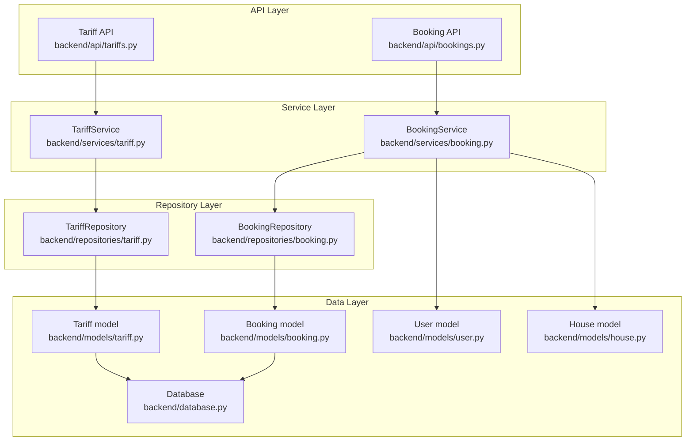
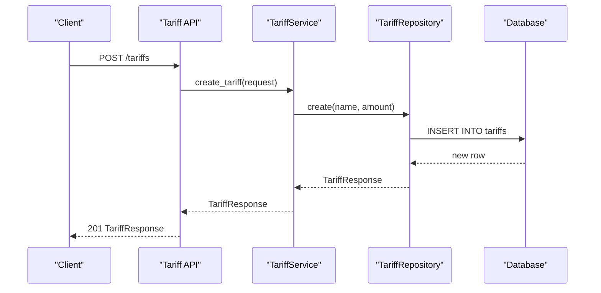
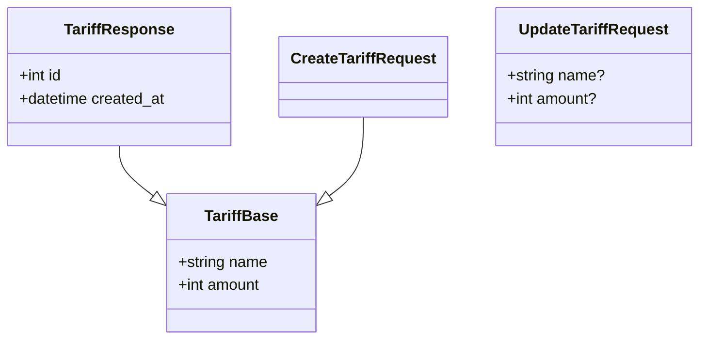
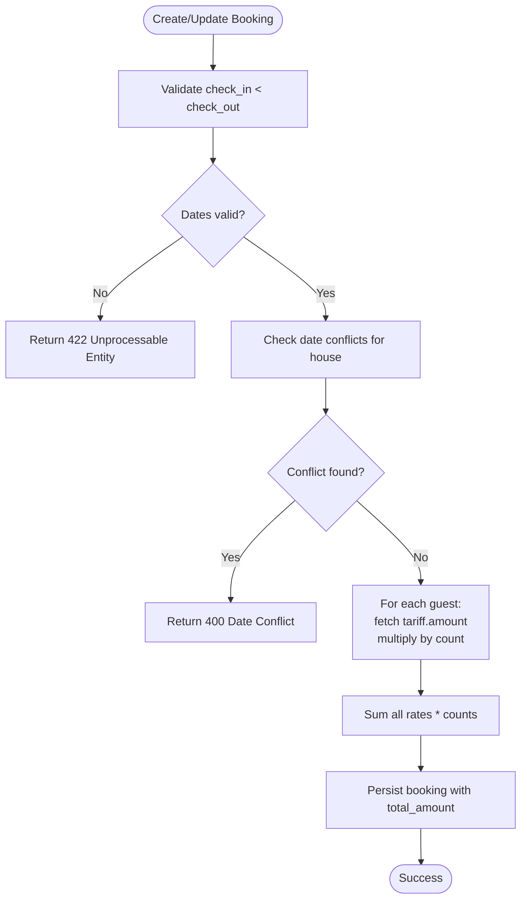
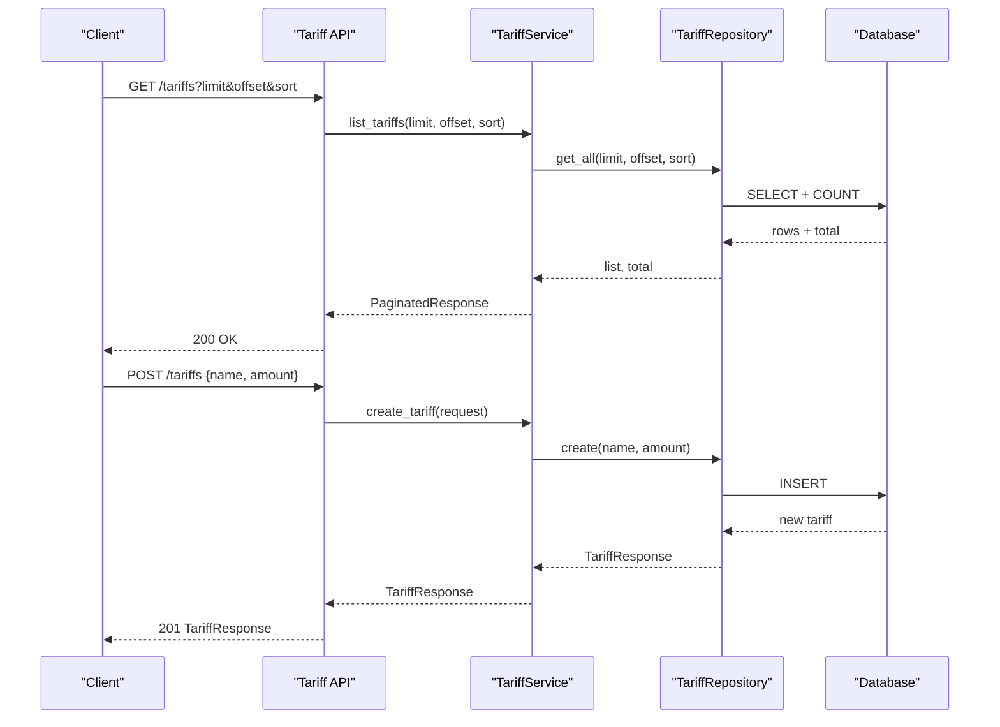
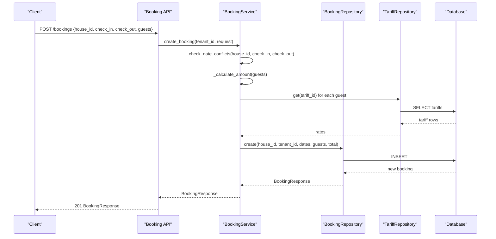
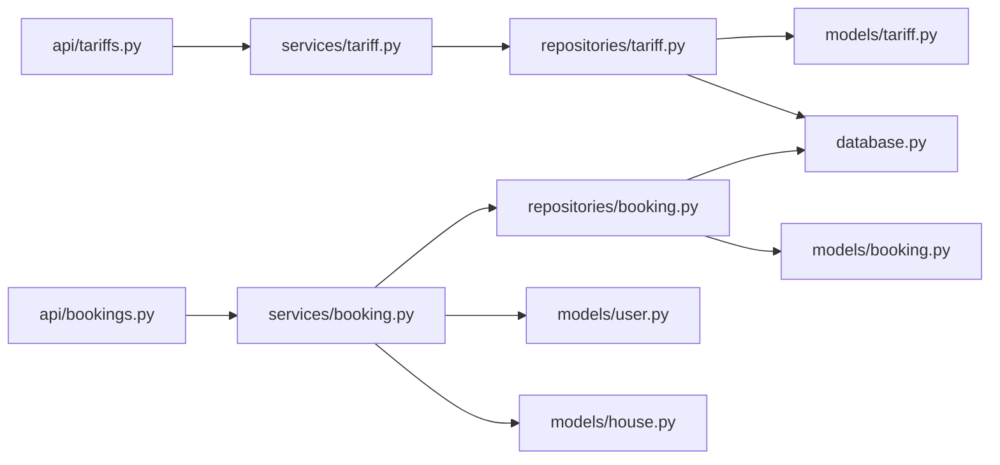

# Pricing and Tariff Schemas

<cite>
**Referenced Files in This Document**
- [backend/schemas/tariff.py](file://backend/schemas/tariff.py)
- [backend/models/tariff.py](file://backend/models/tariff.py)
- [backend/repositories/tariff.py](file://backend/repositories/tariff.py)
- [backend/services/tariff.py](file://backend/services/tariff.py)
- [backend/api/tariffs.py](file://backend/api/tariffs.py)
- [backend/schemas/booking.py](file://backend/schemas/booking.py)
- [backend/models/booking.py](file://backend/models/booking.py)
- [backend/repositories/booking.py](file://backend/repositories/booking.py)
- [backend/services/booking.py](file://backend/services/booking.py)
- [backend/api/bookings.py](file://backend/api/bookings.py)
- [backend/exceptions.py](file://backend/exceptions.py)
- [backend/database.py](file://backend/database.py)
- [backend/models/house.py](file://backend/models/house.py)
- [backend/models/user.py](file://backend/models/user.py)
- [backend/tests/test_tariffs.py](file://backend/tests/test_tariffs.py)
- [backend/tests/test_bookings.py](file://backend/tests/test_bookings.py)
</cite>

## Table of Contents
1. [Introduction](#introduction)
2. [Project Structure](#project-structure)
3. [Core Components](#core-components)
4. [Architecture Overview](#architecture-overview)
5. [Detailed Component Analysis](#detailed-component-analysis)
6. [Dependency Analysis](#dependency-analysis)
7. [Performance Considerations](#performance-considerations)
8. [Troubleshooting Guide](#troubleshooting-guide)
9. [Conclusion](#conclusion)

## Introduction
This document explains the pricing and tariff schema implementation used to manage guest pricing tiers and calculate booking totals. It covers Pydantic models and schemas for tariffs, validation rules for price amounts and names, and how tariffs integrate with booking operations to compute revenue. The content is designed for both beginners and experienced developers, providing clear definitions, validation scenarios, and practical examples drawn from the codebase.

## Project Structure
The pricing and tariff system spans four layers:
- API layer: FastAPI routers expose endpoints for tariffs and bookings.
- Service layer: Business logic orchestrates validation, calculations, and persistence.
- Repository layer: SQLAlchemy async repositories encapsulate database operations.
- Model and schema layers: SQLAlchemy ORM models and Pydantic schemas define data contracts and validation.

**Diagram sources**
- [backend/api/tariffs.py:1-187](file://backend/api/tariffs.py#L1-L187)
- [backend/services/tariff.py:1-144](file://backend/services/tariff.py#L1-L144)
- [backend/repositories/tariff.py:1-151](file://backend/repositories/tariff.py#L1-L151)
- [backend/models/tariff.py:1-21](file://backend/models/tariff.py#L1-L21)
- [backend/api/bookings.py:1-223](file://backend/api/bookings.py#L1-L223)
- [backend/services/booking.py:1-322](file://backend/services/booking.py#L1-L322)
- [backend/repositories/booking.py:1-224](file://backend/repositories/booking.py#L1-L224)
- [backend/models/booking.py:1-41](file://backend/models/booking.py#L1-L41)
- [backend/models/user.py:1-32](file://backend/models/user.py#L1-L32)
- [backend/models/house.py:1-24](file://backend/models/house.py#L1-L24)
- [backend/database.py:1-41](file://backend/database.py#L1-L41)

**Section sources**
- [backend/api/tariffs.py:1-187](file://backend/api/tariffs.py#L1-L187)
- [backend/services/tariff.py:1-144](file://backend/services/tariff.py#L1-L144)
- [backend/repositories/tariff.py:1-151](file://backend/repositories/tariff.py#L1-L151)
- [backend/models/tariff.py:1-21](file://backend/models/tariff.py#L1-L21)
- [backend/api/bookings.py:1-223](file://backend/api/bookings.py#L1-L223)
- [backend/services/booking.py:1-322](file://backend/services/booking.py#L1-L322)
- [backend/repositories/booking.py:1-224](file://backend/repositories/booking.py#L1-L224)
- [backend/models/booking.py:1-41](file://backend/models/booking.py#L1-L41)
- [backend/models/user.py:1-32](file://backend/models/user.py#L1-L32)
- [backend/models/house.py:1-24](file://backend/models/house.py#L1-L24)
- [backend/database.py:1-41](file://backend/database.py#L1-L41)

## Core Components
This section documents the Pydantic schemas and SQLAlchemy models that define pricing and tariff structures, along with their validation rules.

- Tariff schemas
  - Base schema defines name and amount with constraints.
  - Response schema adds identifiers and timestamps.
  - Create and update schemas define allowed fields for each operation.
- Booking schemas
  - GuestInfo links tariffs to guest counts.
  - Create and update requests validate date ranges and guest composition.
  - Response schema includes computed totals and status.

Key validation rules:
- Tariff name length and amount bounds.
- Amount must be non-negative.
- Booking check-in must be strictly before check-out.
- Guest composition must be non-empty for creation.
- Date conflict detection prevents overlapping stays for the same house.

Concrete examples from tests demonstrate:
- Creating tariffs with valid and invalid amounts.
- Listing and sorting tariffs.
- Partial updates to tariff attributes.
- Creating bookings with mixed guest types and computing totals.
- Updating booking dates and guest counts recalculates total amount.

**Section sources**
- [backend/schemas/tariff.py:1-54](file://backend/schemas/tariff.py#L1-L54)
- [backend/models/tariff.py:1-21](file://backend/models/tariff.py#L1-L21)
- [backend/schemas/booking.py:1-133](file://backend/schemas/booking.py#L1-L133)
- [backend/models/booking.py:1-41](file://backend/models/booking.py#L1-L41)
- [backend/tests/test_tariffs.py:1-271](file://backend/tests/test_tariffs.py#L1-L271)
- [backend/tests/test_bookings.py:1-800](file://backend/tests/test_bookings.py#L1-L800)

## Architecture Overview
The tariff and booking subsystems follow a layered architecture with clear separation of concerns:
- API routes accept requests and return standardized responses.
- Services encapsulate business logic, including validations and calculations.
- Repositories handle database operations with SQLAlchemy async sessions.
- Models represent persisted entities; schemas define request/response contracts.

**Diagram sources**
- [backend/api/tariffs.py:87-117](file://backend/api/tariffs.py#L87-L117)
- [backend/services/tariff.py:49-61](file://backend/services/tariff.py#L49-L61)
- [backend/repositories/tariff.py:23-41](file://backend/repositories/tariff.py#L23-L41)
- [backend/models/tariff.py:9-21](file://backend/models/tariff.py#L9-L21)

**Section sources**
- [backend/api/tariffs.py:1-187](file://backend/api/tariffs.py#L1-L187)
- [backend/services/tariff.py:1-144](file://backend/services/tariff.py#L1-L144)
- [backend/repositories/tariff.py:1-151](file://backend/repositories/tariff.py#L1-L151)
- [backend/models/tariff.py:1-21](file://backend/models/tariff.py#L1-L21)

## Detailed Component Analysis

### Tariff Schema and Validation
Tariff schemas define the contract for pricing tiers:
- TariffBase enforces name length and amount bounds.
- TariffResponse extends base with identifiers and timestamps.
- CreateTariffRequest mirrors base for creation.
- UpdateTariffRequest allows partial updates.

**Diagram sources**
- [backend/schemas/tariff.py:9-54](file://backend/schemas/tariff.py#L9-L54)

Validation highlights:
- Name length constraints ensure meaningful tier labels.
- Amount must be non-negative; negative values are rejected.
- Empty or missing name triggers validation errors.

Examples from tests:
- Creating a tariff with amount zero (free).
- Rejecting negative amount during creation.
- Partial updates to name and amount.

**Section sources**
- [backend/schemas/tariff.py:1-54](file://backend/schemas/tariff.py#L1-L54)
- [backend/tests/test_tariffs.py:10-63](file://backend/tests/test_tariffs.py#L10-L63)

### Booking Pricing Calculation and Integration
Bookings use tariff IDs and guest counts to compute total amounts:
- GuestInfo pairs tariff_id with count.
- BookingService._calculate_amount fetches current tariff rates and multiplies by counts.
- Create and update flows recalculate total_amount when guests change.

**Diagram sources**
- [backend/services/booking.py:108-125](file://backend/services/booking.py#L108-L125)
- [backend/schemas/booking.py:25-33](file://backend/schemas/booking.py#L25-L33)
- [backend/repositories/booking.py:24-58](file://backend/repositories/booking.py#L24-L58)

Integration points:
- TariffRepository.get retrieves current tariff rates for accurate pricing.
- BookingRepository persists planned guests and computed totals.

**Section sources**
- [backend/schemas/booking.py:25-33](file://backend/schemas/booking.py#L25-L33)
- [backend/services/booking.py:108-125](file://backend/services/booking.py#L108-L125)
- [backend/repositories/booking.py:24-58](file://backend/repositories/booking.py#L24-L58)
- [backend/repositories/tariff.py:43-56](file://backend/repositories/tariff.py#L43-L56)

### API Workflows: Tariff Management
Tariff endpoints support full CRUD with validation and pagination.

**Diagram sources**
- [backend/api/tariffs.py:18-52](file://backend/api/tariffs.py#L18-L52)
- [backend/api/tariffs.py:87-117](file://backend/api/tariffs.py#L87-L117)
- [backend/services/tariff.py:80-100](file://backend/services/tariff.py#L80-L100)
- [backend/repositories/tariff.py:58-99](file://backend/repositories/tariff.py#L58-L99)

**Section sources**
- [backend/api/tariffs.py:1-187](file://backend/api/tariffs.py#L1-L187)
- [backend/services/tariff.py:1-144](file://backend/services/tariff.py#L1-L144)
- [backend/repositories/tariff.py:1-151](file://backend/repositories/tariff.py#L1-L151)

### API Workflows: Booking Creation and Updates
Booking endpoints enforce validation and prevent conflicts.

**Diagram sources**
- [backend/api/bookings.py:104-126](file://backend/api/bookings.py#L104-L126)
- [backend/services/booking.py:127-170](file://backend/services/booking.py#L127-L170)
- [backend/services/booking.py:78-107](file://backend/services/booking.py#L78-L107)
- [backend/services/booking.py:108-125](file://backend/services/booking.py#L108-L125)
- [backend/repositories/booking.py:24-58](file://backend/repositories/booking.py#L24-L58)
- [backend/repositories/tariff.py:43-56](file://backend/repositories/tariff.py#L43-L56)

**Section sources**
- [backend/api/bookings.py:1-223](file://backend/api/bookings.py#L1-L223)
- [backend/services/booking.py:1-322](file://backend/services/booking.py#L1-L322)
- [backend/repositories/booking.py:1-224](file://backend/repositories/booking.py#L1-L224)
- [backend/repositories/tariff.py:1-151](file://backend/repositories/tariff.py#L1-L151)

## Dependency Analysis
The system exhibits clean layering with explicit dependencies:
- API depends on services.
- Services depend on repositories and schemas.
- Repositories depend on models and SQLAlchemy.
- Models depend on the shared declarative base and database engine.

**Diagram sources**
- [backend/api/tariffs.py:1-187](file://backend/api/tariffs.py#L1-L187)
- [backend/services/tariff.py:1-144](file://backend/services/tariff.py#L1-L144)
- [backend/repositories/tariff.py:1-151](file://backend/repositories/tariff.py#L1-L151)
- [backend/models/tariff.py:1-21](file://backend/models/tariff.py#L1-L21)
- [backend/api/bookings.py:1-223](file://backend/api/bookings.py#L1-L223)
- [backend/services/booking.py:1-322](file://backend/services/booking.py#L1-L322)
- [backend/repositories/booking.py:1-224](file://backend/repositories/booking.py#L1-L224)
- [backend/models/booking.py:1-41](file://backend/models/booking.py#L1-L41)
- [backend/models/user.py:1-32](file://backend/models/user.py#L1-L32)
- [backend/models/house.py:1-24](file://backend/models/house.py#L1-L24)
- [backend/database.py:1-41](file://backend/database.py#L1-L41)

**Section sources**
- [backend/api/tariffs.py:1-187](file://backend/api/tariffs.py#L1-L187)
- [backend/services/tariff.py:1-144](file://backend/services/tariff.py#L1-L144)
- [backend/repositories/tariff.py:1-151](file://backend/repositories/tariff.py#L1-L151)
- [backend/models/tariff.py:1-21](file://backend/models/tariff.py#L1-L21)
- [backend/api/bookings.py:1-223](file://backend/api/bookings.py#L1-L223)
- [backend/services/booking.py:1-322](file://backend/services/booking.py#L1-L322)
- [backend/repositories/booking.py:1-224](file://backend/repositories/booking.py#L1-L224)
- [backend/models/booking.py:1-41](file://backend/models/booking.py#L1-L41)
- [backend/models/user.py:1-32](file://backend/models/user.py#L1-L32)
- [backend/models/house.py:1-24](file://backend/models/house.py#L1-L24)
- [backend/database.py:1-41](file://backend/database.py#L1-L41)

## Performance Considerations
- Asynchronous repositories minimize blocking during database operations.
- Efficient queries with COUNT subqueries for pagination reduce overhead.
- Minimal round-trips: calculate totals in service layer after fetching tariffs.
- Consider caching tariff rates if the number of tariffs grows large and rates are relatively static.

## Troubleshooting Guide
Common validation and integration issues:
- Tariff creation/update rejects negative amounts or empty names.
- Booking creation fails if check_in >= check_out or if dates overlap with existing bookings for the same house.
- Unauthorized operations (non-owners) are blocked for booking updates and cancellations.
- Not found errors occur when accessing non-existent tariffs or bookings.

Resolution steps:
- Ensure amount is non-negative and name length is within limits for tariffs.
- Verify guest composition is present and counts are positive for bookings.
- Confirm date ranges satisfy check_in < check_out and no overlaps for the target house.
- Use proper authorization context before allowing updates or cancellations.

**Section sources**
- [backend/schemas/tariff.py:18-22](file://backend/schemas/tariff.py#L18-L22)
- [backend/schemas/booking.py:82-87](file://backend/schemas/booking.py#L82-L87)
- [backend/services/booking.py:78-107](file://backend/services/booking.py#L78-L107)
- [backend/exceptions.py:16-82](file://backend/exceptions.py#L16-L82)
- [backend/tests/test_tariffs.py:42-63](file://backend/tests/test_tariffs.py#L42-L63)
- [backend/tests/test_bookings.py:79-110](file://backend/tests/test_bookings.py#L79-L110)

## Conclusion
The pricing and tariff system provides a robust foundation for managing guest pricing tiers and calculating booking totals. Pydantic schemas enforce strong validation, while services encapsulate business logic and repositories handle persistence. Tariff and booking schemas integrate seamlessly to support revenue management, ensuring data integrity and predictable calculations. The included tests illustrate typical usage patterns and validation scenarios, serving as practical references for extending or integrating the system.