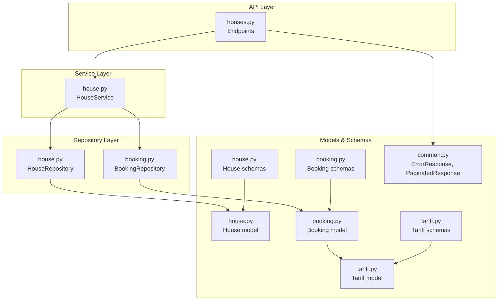
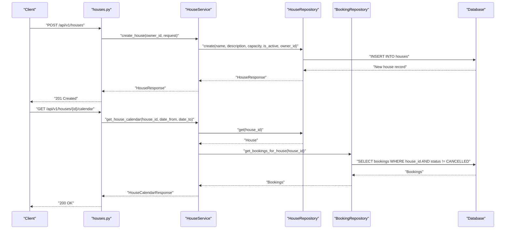
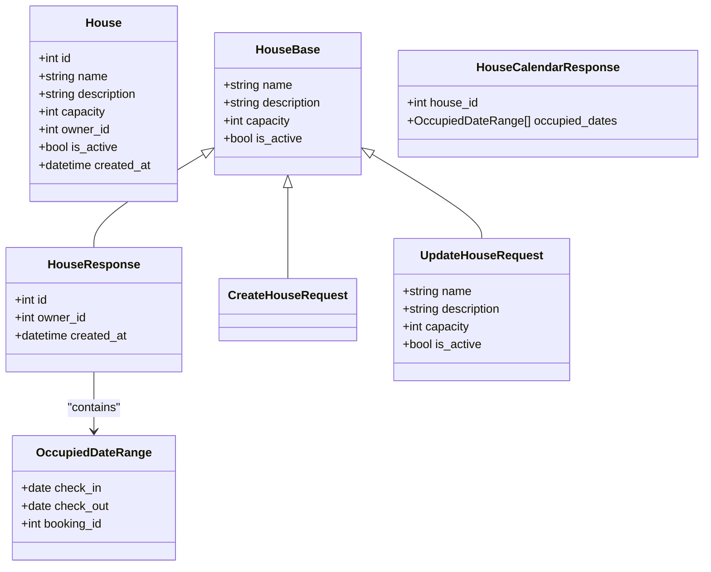
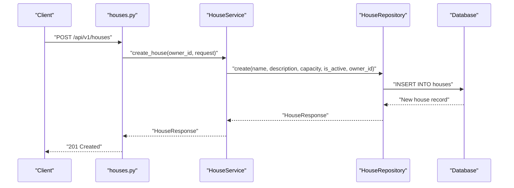
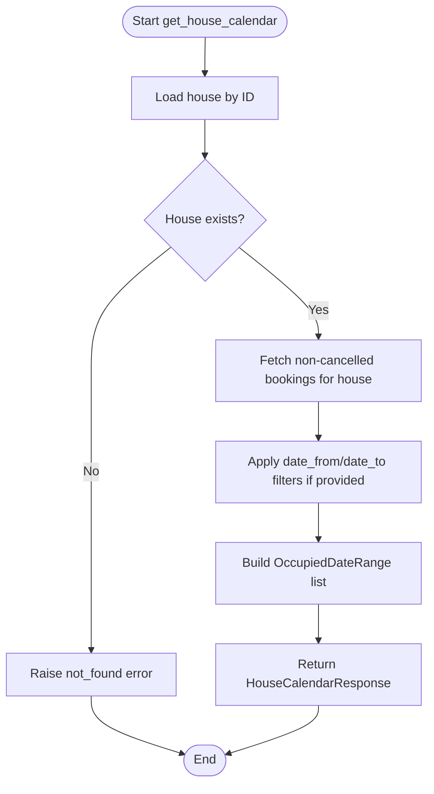
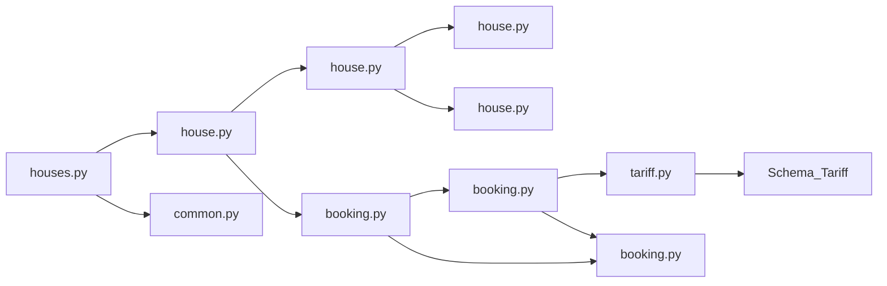

# Property and House Schemas

<cite>
**Referenced Files in This Document**
- [house.py](file://backend/schemas/house.py)
- [house.py](file://backend/models/house.py)
- [houses.py](file://backend/api/houses.py)
- [house.py](file://backend/services/house.py)
- [house.py](file://backend/repositories/house.py)
- [booking.py](file://backend/schemas/booking.py)
- [booking.py](file://backend/models/booking.py)
- [booking.py](file://backend/repositories/booking.py)
- [tariff.py](file://backend/schemas/tariff.py)
- [tariff.py](file://backend/models/tariff.py)
- [common.py](file://backend/schemas/common.py)
- [database.py](file://backend/database.py)
- [test_houses.py](file://backend/tests/test_houses.py)
</cite>

## Table of Contents
1. [Introduction](#introduction)
2. [Project Structure](#project-structure)
3. [Core Components](#core-components)
4. [Architecture Overview](#architecture-overview)
5. [Detailed Component Analysis](#detailed-component-analysis)
6. [Dependency Analysis](#dependency-analysis)
7. [Performance Considerations](#performance-considerations)
8. [Troubleshooting Guide](#troubleshooting-guide)
9. [Conclusion](#conclusion)

## Introduction
This document explains the property and house schema implementation for a property management system built with FastAPI, Pydantic, and SQLAlchemy. It focuses on the house listing, availability calendar, and property details schemas, detailing field definitions, validation rules, and relationships with related entities such as bookings and tariffs. The guide includes practical examples from the test suite and API endpoints to help both beginners and experienced developers understand how to create, update, and manage property listings and availability.

## Project Structure
The property management feature is organized around a layered architecture:
- Schemas: Pydantic models defining request/response contracts
- Services: Business logic orchestrating repositories and validations
- Repositories: Database access using SQLAlchemy async ORM
- Models: SQLAlchemy ORM mapped to database tables
- API: FastAPI endpoints exposing CRUD and calendar operations
- Tests: Behavioral examples validating schema constraints and workflows

**Diagram sources**
- [houses.py:1-266](file://backend/api/houses.py#L1-L266)
- [house.py:51-253](file://backend/services/house.py#L51-L253)
- [house.py:12-183](file://backend/repositories/house.py#L12-L183)
- [booking.py:13-224](file://backend/repositories/booking.py#L13-L224)
- [house.py:9-24](file://backend/models/house.py#L9-L24)
- [booking.py:20-41](file://backend/models/booking.py#L20-L41)
- [tariff.py:9-21](file://backend/models/tariff.py#L9-L21)
- [house.py:9-107](file://backend/schemas/house.py#L9-L107)
- [booking.py:35-133](file://backend/schemas/booking.py#L35-L133)
- [tariff.py:9-54](file://backend/schemas/tariff.py#L9-L54)
- [common.py:8-43](file://backend/schemas/common.py#L8-L43)

**Section sources**
- [houses.py:1-266](file://backend/api/houses.py#L1-L266)
- [house.py:51-253](file://backend/services/house.py#L51-L253)
- [house.py:12-183](file://backend/repositories/house.py#L12-L183)
- [booking.py:13-224](file://backend/repositories/booking.py#L13-L224)
- [house.py:9-24](file://backend/models/house.py#L9-L24)
- [booking.py:20-41](file://backend/models/booking.py#L20-L41)
- [tariff.py:9-21](file://backend/models/tariff.py#L9-L21)
- [house.py:9-107](file://backend/schemas/house.py#L9-L107)
- [booking.py:35-133](file://backend/schemas/booking.py#L35-L133)
- [tariff.py:9-54](file://backend/schemas/tariff.py#L9-L54)
- [common.py:8-43](file://backend/schemas/common.py#L8-L43)

## Core Components
This section documents the house-related schemas and their roles in property management.

- HouseBase: Shared fields for house creation and updates (name, description, capacity, is_active)
- HouseResponse: Output schema for house details including identifiers and timestamps
- CreateHouseRequest: Input schema for creating a new house listing
- UpdateHouseRequest: Partial update schema allowing selective field changes
- OccupiedDateRange: Represents a date range occupied by a booking
- HouseCalendarResponse: Availability calendar response containing occupied date ranges
- HouseFilterParams: Query parameters for listing houses with pagination, sorting, and filters

Validation rules enforced by Pydantic:
- name: required, length bounds
- description: optional, length bound
- capacity: required, integer ≥ 1
- is_active: optional boolean, defaults to True
- Pagination and sorting: limit/offset with bounds, sort field validation
- Filters: capacity_min/capacity_max with bounds

These schemas are used by the API endpoints and validated automatically during request/response serialization.

**Section sources**
- [house.py:9-107](file://backend/schemas/house.py#L9-L107)

## Architecture Overview
The house lifecycle spans API, service, repository, and model layers. The calendar feature integrates with bookings to compute occupied date ranges.

**Diagram sources**
- [houses.py:101-120](file://backend/api/houses.py#L101-L120)
- [house.py:71-91](file://backend/services/house.py#L71-L91)
- [house.py:23-53](file://backend/repositories/house.py#L23-L53)
- [house.py:207-252](file://backend/services/house.py#L207-L252)
- [booking.py:199-223](file://backend/repositories/booking.py#L199-L223)

**Section sources**
- [houses.py:101-120](file://backend/api/houses.py#L101-L120)
- [house.py:71-91](file://backend/services/house.py#L71-L91)
- [house.py:23-53](file://backend/repositories/house.py#L23-L53)
- [house.py:207-252](file://backend/services/house.py#L207-L252)
- [booking.py:199-223](file://backend/repositories/booking.py#L199-L223)

## Detailed Component Analysis

### House Schemas and Validation Rules
- HouseBase defines core attributes with Pydantic constraints:
  - name: required, min_length=1, max_length=100
  - description: optional, max_length=1000
  - capacity: required, ge=1
  - is_active: optional, default=True
- HouseResponse adds identifiers and timestamps for output
- CreateHouseRequest inherits base fields for creation
- UpdateHouseRequest allows partial updates with optional fields
- HouseFilterParams supports pagination (limit, offset), sorting (field, direction), and filters (owner_id, is_active, capacity_min, capacity_max)
- HouseCalendarResponse aggregates OccupiedDateRange entries for a house

Validation behavior:
- Requests are validated automatically when parsed by FastAPI
- Responses are validated against their respective schemas before serialization
- Errors are standardized using ErrorResponse

Practical examples from tests:
- Creating a house with minimal data validates defaults and required fields
- Updating capacity enforces integer bounds
- Listing houses supports filtering, pagination, and sorting

**Section sources**
- [house.py:9-107](file://backend/schemas/house.py#L9-L107)
- [common.py:16-27](file://backend/schemas/common.py#L16-L27)
- [test_houses.py:10-98](file://backend/tests/test_houses.py#L10-L98)
- [test_houses.py:362-466](file://backend/tests/test_houses.py#L362-L466)
- [test_houses.py:146-357](file://backend/tests/test_houses.py#L146-L357)

### API Endpoints for House Management
Key endpoints:
- GET /api/v1/houses: List houses with filtering, pagination, and sorting
- GET /api/v1/houses/{id}: Retrieve a specific house
- POST /api/v1/houses: Create a new house listing
- PUT /api/v1/houses/{id}: Replace house details (full update)
- PATCH /api/v1/houses/{id}: Partially update house details
- DELETE /api/v1/houses/{id}: Remove a house listing
- GET /api/v1/houses/{id}/calendar: Get availability calendar with occupied date ranges

Error handling:
- 404 Not Found for missing resources
- 422 Unprocessable Entity for validation failures
- Standardized ErrorResponse payload

Examples from tests:
- Successful creation, partial updates, full replacement, deletion
- Calendar retrieval with and without bookings
- Filtering by owner, activity status, and capacity ranges

**Section sources**
- [houses.py:21-52](file://backend/api/houses.py#L21-L52)
- [houses.py:55-84](file://backend/api/houses.py#L55-L84)
- [houses.py:87-120](file://backend/api/houses.py#L87-L120)
- [houses.py:122-198](file://backend/api/houses.py#L122-L198)
- [houses.py:200-227](file://backend/api/houses.py#L200-L227)
- [houses.py:229-266](file://backend/api/houses.py#L229-L266)
- [test_houses.py:6-760](file://backend/tests/test_houses.py#L6-L760)

### Service Layer: Business Logic Orchestration
HouseService coordinates repository operations:
- create_house: Delegates to HouseRepository.create
- get_house: Retrieves and validates existence
- list_houses: Applies filters, pagination, and sorting
- update_house: Validates existence and applies partial updates
- replace_house: Validates existence and replaces all fields
- delete_house: Validates existence and removes the record
- get_house_calendar: Aggregates occupied date ranges from bookings, excluding cancellations, and optionally filtering by date range

Integration with BookingRepository:
- Uses get_bookings_for_house to fetch active bookings
- Excludes cancelled bookings by default
- Builds OccupiedDateRange entries for the calendar response

**Section sources**
- [house.py:51-253](file://backend/services/house.py#L51-L253)
- [booking.py:199-223](file://backend/repositories/booking.py#L199-L223)

### Repository Layer: Database Access Patterns
HouseRepository:
- create: Inserts a new house and refreshes to return HouseResponse
- get: Fetches a single house by ID
- get_all: Applies filters, counts total, sorts, and paginates
- update: Conditionally updates provided fields
- delete: Removes a house by ID

BookingRepository:
- get_bookings_for_house: Returns non-cancelled bookings for a house, with optional exclusion of a specific booking

Database session management:
- AsyncSession is injected via dependency providers
- Transactions are committed or rolled back appropriately

**Section sources**
- [house.py:12-183](file://backend/repositories/house.py#L12-L183)
- [booking.py:13-224](file://backend/repositories/booking.py#L13-L224)
- [database.py:26-41](file://backend/database.py#L26-L41)

### Relationship with Bookings and Tariffs
Availability calendar:
- House calendar aggregates OccupiedDateRange entries derived from Booking records
- Bookings exclude cancelled status by default
- Optional date filters refine the returned ranges

Tariff integration:
- Tariff model and schema define pricing tiers used by bookings
- Booking schema includes guest composition referencing tariff types
- While not directly part of house schemas, tariffs influence booking composition and pricing

**Section sources**
- [house.py:207-252](file://backend/services/house.py#L207-L252)
- [booking.py:199-223](file://backend/repositories/booking.py#L199-L223)
- [tariff.py:9-21](file://backend/models/tariff.py#L9-L21)
- [tariff.py:9-54](file://backend/schemas/tariff.py#L9-L54)
- [booking.py:35-133](file://backend/schemas/booking.py#L35-L133)

### Class Diagram: House and Related Entities

**Diagram sources**
- [house.py:9-107](file://backend/schemas/house.py#L9-L107)
- [house.py:9-24](file://backend/models/house.py#L9-L24)

### Sequence Diagram: House Creation Workflow

**Diagram sources**
- [houses.py:101-120](file://backend/api/houses.py#L101-L120)
- [house.py:71-91](file://backend/services/house.py#L71-L91)
- [house.py:23-53](file://backend/repositories/house.py#L23-L53)

### Flowchart: Availability Calendar Computation

**Diagram sources**
- [house.py:207-252](file://backend/services/house.py#L207-L252)
- [booking.py:199-223](file://backend/repositories/booking.py#L199-L223)

## Dependency Analysis
- API depends on HouseService for business logic
- HouseService depends on HouseRepository and BookingRepository
- HouseRepository depends on House model and HouseResponse schema
- BookingRepository depends on Booking model and BookingResponse schema
- Models define table structures and relationships
- Schemas enforce validation and serialization contracts
- Common schemas standardize error and pagination responses

**Diagram sources**
- [houses.py:1-266](file://backend/api/houses.py#L1-L266)
- [house.py:51-253](file://backend/services/house.py#L51-L253)
- [house.py:12-183](file://backend/repositories/house.py#L12-L183)
- [booking.py:13-224](file://backend/repositories/booking.py#L13-L224)
- [house.py:9-24](file://backend/models/house.py#L9-L24)
- [booking.py:20-41](file://backend/models/booking.py#L20-L41)
- [tariff.py:9-21](file://backend/models/tariff.py#L9-L21)
- [common.py:8-43](file://backend/schemas/common.py#L8-L43)
- [house.py:9-107](file://backend/schemas/house.py#L9-L107)
- [booking.py:35-133](file://backend/schemas/booking.py#L35-L133)
- [tariff.py:9-54](file://backend/schemas/tariff.py#L9-L54)

**Section sources**
- [houses.py:1-266](file://backend/api/houses.py#L1-L266)
- [house.py:51-253](file://backend/services/house.py#L51-L253)
- [house.py:12-183](file://backend/repositories/house.py#L12-L183)
- [booking.py:13-224](file://backend/repositories/booking.py#L13-L224)
- [house.py:9-24](file://backend/models/house.py#L9-L24)
- [booking.py:20-41](file://backend/models/booking.py#L20-L41)
- [tariff.py:9-21](file://backend/models/tariff.py#L9-L21)
- [common.py:8-43](file://backend/schemas/common.py#L8-L43)
- [house.py:9-107](file://backend/schemas/house.py#L9-L107)
- [booking.py:35-133](file://backend/schemas/booking.py#L35-L133)
- [tariff.py:9-54](file://backend/schemas/tariff.py#L9-L54)

## Performance Considerations
- Pagination and sorting: Use limit/offset with reasonable bounds to prevent heavy queries
- Filtering: Apply filters early in repository queries to reduce result sets
- Counting: Use subqueries for accurate totals without loading full lists
- Asynchronous sessions: Ensure efficient session reuse and avoid long transactions
- Serialization: Leverage model_validate for schema-driven serialization to minimize overhead

[No sources needed since this section provides general guidance]

## Troubleshooting Guide
Common validation and operational issues:
- Validation errors: 422 responses with standardized error details
- Not found errors: 404 responses when accessing non-existent houses or calendars
- Capacity constraints: Ensure capacity is ≥ 1 for creation and updates
- Date validation: For related entities, ensure check_in < check_out

Diagnostic steps:
- Verify request payloads match CreateHouseRequest or UpdateHouseRequest
- Confirm house existence before update/delete operations
- Check booking statuses: cancelled bookings are excluded from calendars
- Use filters and pagination parameters correctly

**Section sources**
- [common.py:16-27](file://backend/schemas/common.py#L16-L27)
- [house.py:9-107](file://backend/schemas/house.py#L9-L107)
- [booking.py:82-107](file://backend/schemas/booking.py#L82-L107)
- [test_houses.py:76-98](file://backend/tests/test_houses.py#L76-L98)
- [test_houses.py:440-466](file://backend/tests/test_houses.py#L440-L466)

## Conclusion
The property and house schema implementation provides a robust foundation for property management with strong validation, flexible filtering, and integrated availability calendars. By leveraging Pydantic schemas, SQLAlchemy repositories, and FastAPI endpoints, the system ensures consistent data contracts, predictable error handling, and extensible business logic. The included tests demonstrate real-world usage patterns for creating, updating, listing, and managing house availability, serving as practical references for building and extending property management features.