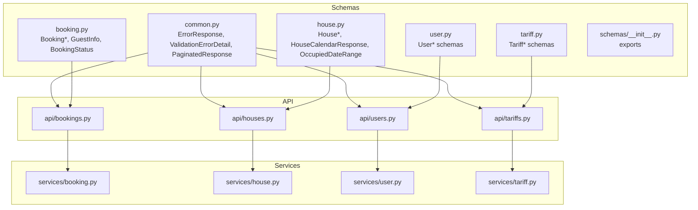
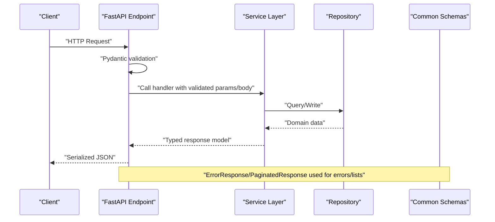
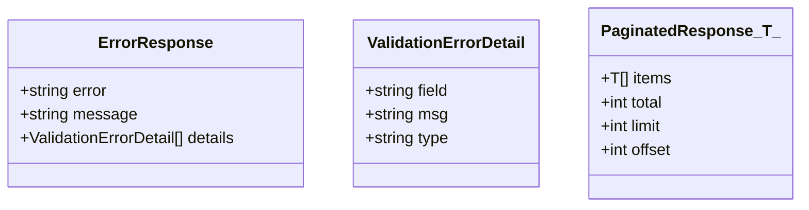
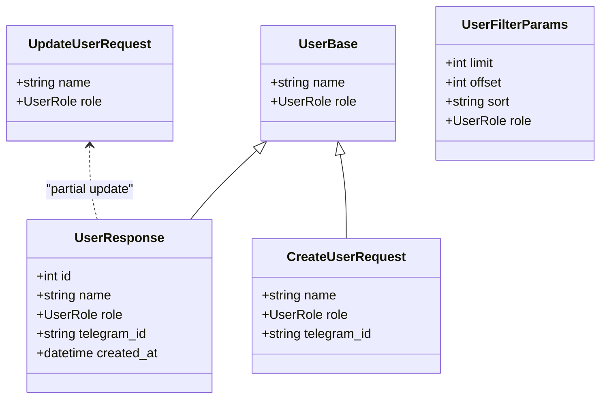
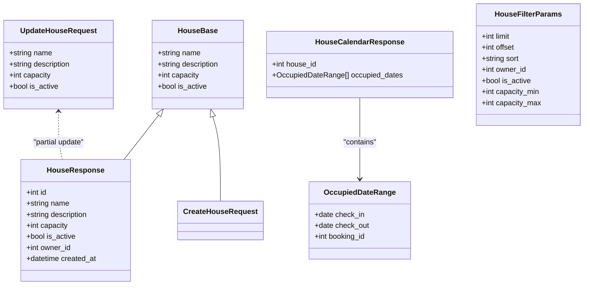
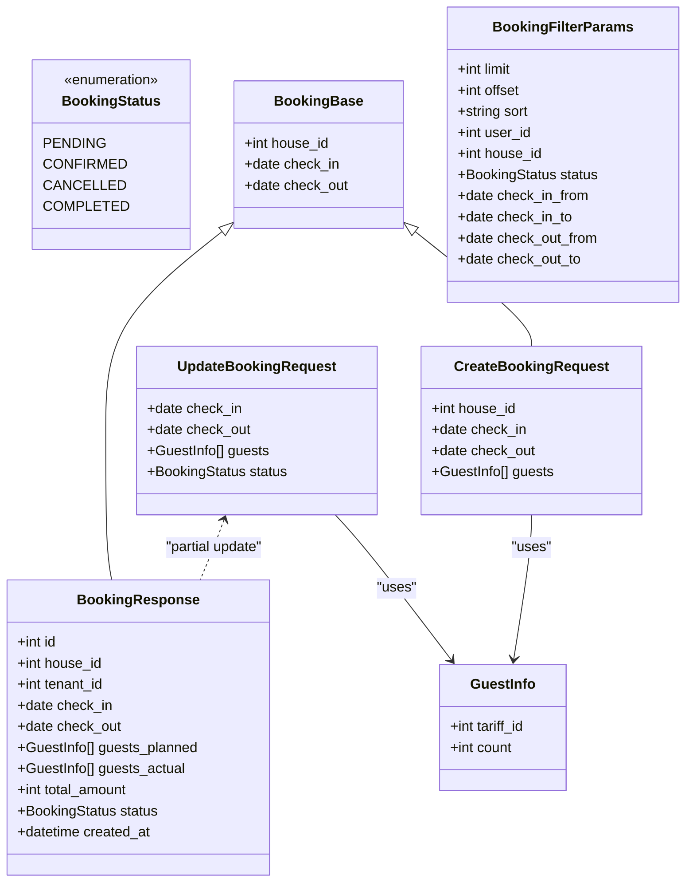
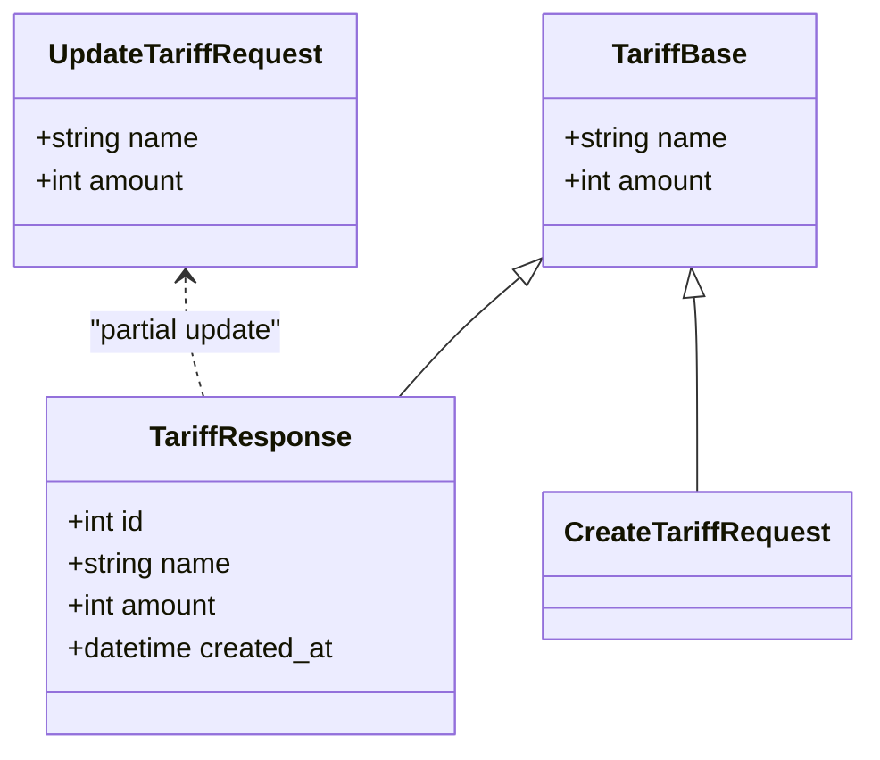
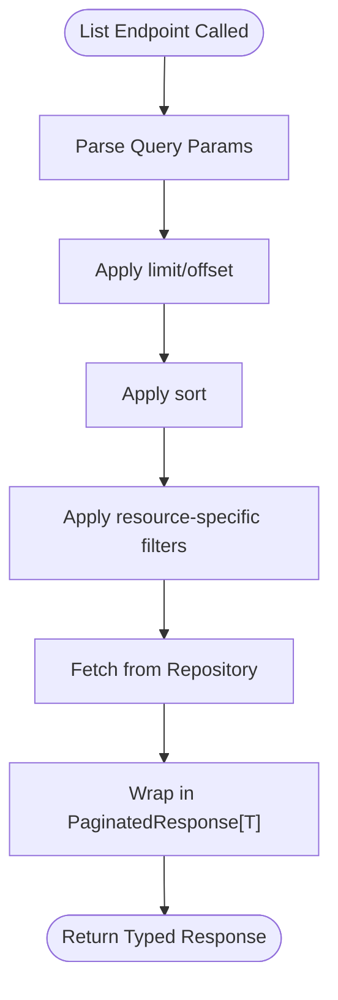
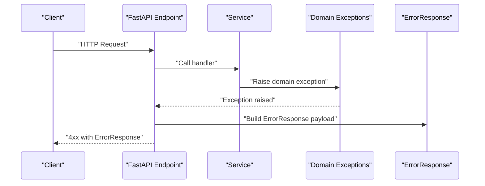
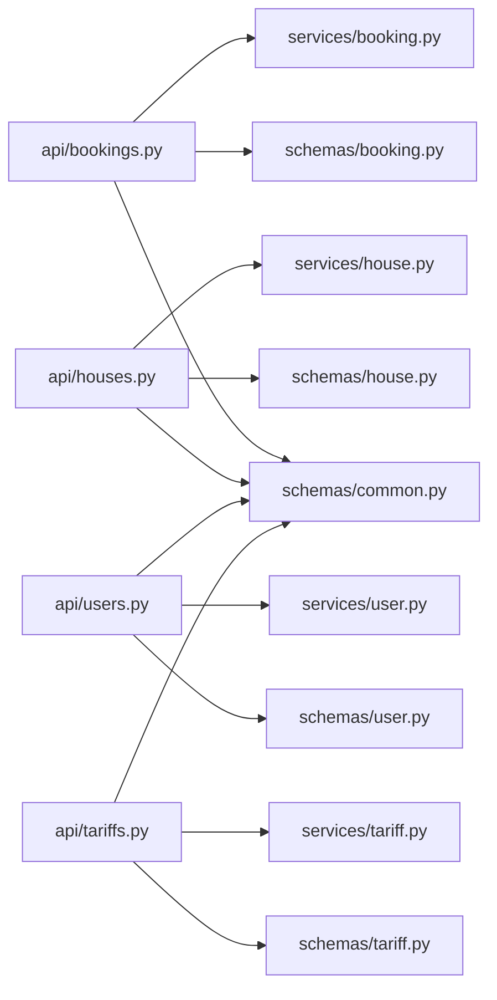

# Shared and Common Schemas

<cite>
**Referenced Files in This Document**
- [common.py](file://backend/schemas/common.py)
- [__init__.py](file://backend/schemas/__init__.py)
- [booking.py](file://backend/schemas/booking.py)
- [house.py](file://backend/schemas/house.py)
- [user.py](file://backend/schemas/user.py)
- [tariff.py](file://backend/schemas/tariff.py)
- [bookings.py](file://backend/api/bookings.py)
- [houses.py](file://backend/api/houses.py)
- [users.py](file://backend/api/users.py)
- [tariffs.py](file://backend/api/tariffs.py)
- [booking.py](file://backend/services/booking.py)
- [house.py](file://backend/services/house.py)
- [user.py](file://backend/services/user.py)
- [tariff.py](file://backend/services/tariff.py)
- [exceptions.py](file://backend/exceptions.py)
</cite>

## Table of Contents
1. [Introduction](#introduction)
2. [Project Structure](#project-structure)
3. [Core Components](#core-components)
4. [Architecture Overview](#architecture-overview)
5. [Detailed Component Analysis](#detailed-component-analysis)
6. [Dependency Analysis](#dependency-analysis)
7. [Performance Considerations](#performance-considerations)
8. [Troubleshooting Guide](#troubleshooting-guide)
9. [Conclusion](#conclusion)

## Introduction
This document explains the shared and common schema design used across the backend API. It focuses on reusable Pydantic models and validation utilities that ensure consistent request/response contracts, pagination, filtering, and standardized error responses. The goal is to help both beginners and experienced developers understand how schemas are composed, reused, and maintained consistently across endpoints.

## Project Structure
The schema layer is organized by resource (user, house, booking, tariff) plus a dedicated common module for shared constructs. The API routers import these schemas and return them from service-layer operations. Services encapsulate business logic and return typed Pydantic models, ensuring FastAPI automatically validates and serializes responses.

**Diagram sources**
- [common.py:1-43](file://backend/schemas/common.py#L1-L43)
- [user.py:1-72](file://backend/schemas/user.py#L1-L72)
- [house.py:1-107](file://backend/schemas/house.py#L1-L107)
- [booking.py:1-133](file://backend/schemas/booking.py#L1-L133)
- [tariff.py:1-54](file://backend/schemas/tariff.py#L1-L54)
- [bookings.py:1-223](file://backend/api/bookings.py#L1-L223)
- [houses.py:1-266](file://backend/api/houses.py#L1-L266)
- [users.py:1-223](file://backend/api/users.py#L1-L223)
- [tariffs.py:1-187](file://backend/api/tariffs.py#L1-L187)
- [booking.py:1-322](file://backend/services/booking.py#L1-L322)
- [house.py:1-253](file://backend/services/house.py#L1-L253)
- [user.py:1-183](file://backend/services/user.py#L1-L183)
- [tariff.py:1-144](file://backend/services/tariff.py#L1-L144)

**Section sources**
- [__init__.py:1-63](file://backend/schemas/__init__.py#L1-L63)

## Core Components
This section documents the shared building blocks and resource-specific schemas that compose the API contracts.

- Common error response and pagination
  - ErrorResponse: Standardized error envelope with code, human-readable message, and optional detailed validation errors.
  - ValidationErrorDetail: Individual validation error entries with optional field, message, and type.
  - PaginatedResponse[T]: Generic wrapper for list endpoints with items, total, limit, and offset.

- Resource schemas
  - User: Base fields, response, create/update requests, and filter parameters.
  - House: Base fields, response, create/update requests, calendar response, and occupied date range.
  - Booking: Status enum, guest composition, base and derived request/response schemas, and filter parameters.
  - Tariff: Base fields, response, create/update requests.

These schemas are re-exported via the schemas package init to centralize imports across the application.

**Section sources**
- [common.py:8-43](file://backend/schemas/common.py#L8-L43)
- [user.py:10-72](file://backend/schemas/user.py#L10-L72)
- [house.py:9-107](file://backend/schemas/house.py#L9-L107)
- [booking.py:10-133](file://backend/schemas/booking.py#L10-L133)
- [tariff.py:9-54](file://backend/schemas/tariff.py#L9-L54)
- [__init__.py:3-62](file://backend/schemas/__init__.py#L3-L62)

## Architecture Overview
The API layer defines endpoints with typed request/response models. Services implement business logic and return typed schemas. The common module ensures consistent error and pagination responses across resources.

**Diagram sources**
- [bookings.py:20-51](file://backend/api/bookings.py#L20-L51)
- [houses.py:21-52](file://backend/api/houses.py#L21-L52)
- [users.py:19-50](file://backend/api/users.py#L19-L50)
- [tariffs.py:18-52](file://backend/api/tariffs.py#L18-L52)
- [common.py:16-43](file://backend/schemas/common.py#L16-L43)

## Detailed Component Analysis

### Common Schemas: Error and Pagination
- ErrorResponse
  - Purpose: Unified error envelope for all endpoints.
  - Fields: error code, human-readable message, optional details array.
  - Usage: Returned in 4xx responses across all resources.
- ValidationErrorDetail
  - Purpose: Describes individual validation failures.
  - Fields: optional field name, message, optional type.
- PaginatedResponse[T]
  - Purpose: Standardized list wrapper for collection endpoints.
  - Fields: items (list of T), total, limit, offset.
  - Usage: Applied to list endpoints in all resources.

**Diagram sources**
- [common.py:8-43](file://backend/schemas/common.py#L8-L43)

**Section sources**
- [common.py:8-43](file://backend/schemas/common.py#L8-L43)

### User Resource: Composition Patterns
- Base pattern: UserBase -> UserResponse for read operations; CreateUserRequest and UpdateUserRequest for write operations.
- Filter parameters: UserFilterParams supports pagination, sorting, and role filtering.
- Validation: String length constraints and optional fields for partial updates.

**Diagram sources**
- [user.py:18-72](file://backend/schemas/user.py#L18-L72)

**Section sources**
- [user.py:18-72](file://backend/schemas/user.py#L18-L72)
- [users.py:19-50](file://backend/api/users.py#L19-L50)

### House Resource: Composition Patterns
- Base pattern: HouseBase -> HouseResponse; CreateHouseRequest and UpdateHouseRequest.
- Calendar aggregation: HouseCalendarResponse composed of OccupiedDateRange entries.
- Filter parameters: HouseFilterParams supports pagination, sorting, and capacity/active filters.

**Diagram sources**
- [house.py:9-107](file://backend/schemas/house.py#L9-L107)

**Section sources**
- [house.py:9-107](file://backend/schemas/house.py#L9-L107)
- [houses.py:21-52](file://backend/api/houses.py#L21-L52)

### Booking Resource: Composition and Validation
- Status enum: BookingStatus defines lifecycle states.
- Guest composition: GuestInfo groups guests by tariff type.
- Base pattern: BookingBase -> BookingResponse; CreateBookingRequest and UpdateBookingRequest.
- Validation utilities: model validators enforce date ordering; services check for date conflicts and compute totals.

**Diagram sources**
- [booking.py:10-133](file://backend/schemas/booking.py#L10-L133)

**Section sources**
- [booking.py:10-133](file://backend/schemas/booking.py#L10-L133)
- [bookings.py:20-51](file://backend/api/bookings.py#L20-L51)

### Tariff Resource: Composition Patterns
- Base pattern: TariffBase -> TariffResponse; CreateTariffRequest and UpdateTariffRequest.
- Filter parameters: Tariff endpoints accept limit/offset/sort directly in route handlers.

**Diagram sources**
- [tariff.py:9-54](file://backend/schemas/tariff.py#L9-L54)

**Section sources**
- [tariff.py:9-54](file://backend/schemas/tariff.py#L9-L54)
- [tariffs.py:18-52](file://backend/api/tariffs.py#L18-L52)

### Pagination and Filtering Across Resources
- Consistent pagination: All list endpoints use PaginatedResponse[T] with items, total, limit, offset.
- Filtering parameters:
  - Users: role filter, pagination, sort.
  - Houses: owner_id, is_active, capacity range, pagination, sort.
  - Bookings: user_id, house_id, status, date ranges, pagination, sort.
  - Tariffs: limit/offset/sort in route handlers.

**Diagram sources**
- [users.py:28-50](file://backend/api/users.py#L28-L50)
- [houses.py:30-52](file://backend/api/houses.py#L30-L52)
- [bookings.py:29-51](file://backend/api/bookings.py#L29-L51)
- [tariffs.py:27-52](file://backend/api/tariffs.py#L27-L52)

**Section sources**
- [users.py:28-50](file://backend/api/users.py#L28-L50)
- [houses.py:30-52](file://backend/api/houses.py#L30-L52)
- [bookings.py:29-51](file://backend/api/bookings.py#L29-L51)
- [tariffs.py:27-52](file://backend/api/tariffs.py#L27-L52)

### Error Handling and Consistency
- Domain exceptions: Custom exceptions are raised in services and converted to HTTP responses.
- Error response format: ErrorResponse is used across endpoints for consistent error payloads.
- Validation errors: Pydantic validation produces structured errors; services may raise domain-specific exceptions.

**Diagram sources**
- [exceptions.py:8-82](file://backend/exceptions.py#L8-L82)
- [common.py:16-27](file://backend/schemas/common.py#L16-L27)
- [bookings.py:86-126](file://backend/api/bookings.py#L86-L126)
- [users.py:85-115](file://backend/api/users.py#L85-L115)
- [houses.py:87-119](file://backend/api/houses.py#L87-L119)
- [tariffs.py:87-117](file://backend/api/tariffs.py#L87-L117)

**Section sources**
- [exceptions.py:8-82](file://backend/exceptions.py#L8-L82)
- [common.py:16-27](file://backend/schemas/common.py#L16-L27)
- [bookings.py:86-126](file://backend/api/bookings.py#L86-L126)
- [users.py:85-115](file://backend/api/users.py#L85-L115)
- [houses.py:87-119](file://backend/api/houses.py#L87-L119)
- [tariffs.py:87-117](file://backend/api/tariffs.py#L87-L117)

## Dependency Analysis
- API routers depend on schemas for request/response typing and on services for business logic.
- Services depend on repositories and typed schemas to return consistent models.
- Common schemas are imported by API routers and used for error and pagination responses.
- The schemas package init consolidates exports for centralized imports.

**Diagram sources**
- [bookings.py:7-15](file://backend/api/bookings.py#L7-L15)
- [houses.py:8-16](file://backend/api/houses.py#L8-L16)
- [users.py:7-14](file://backend/api/users.py#L7-L14)
- [tariffs.py:7-13](file://backend/api/tariffs.py#L7-L13)
- [booking.py:19-26](file://backend/services/booking.py#L19-L26)
- [house.py:13-20](file://backend/services/house.py#L13-L20)
- [user.py:11-16](file://backend/services/user.py#L11-L16)
- [tariff.py:11-15](file://backend/services/tariff.py#L11-L15)

**Section sources**
- [__init__.py:3-62](file://backend/schemas/__init__.py#L3-L62)

## Performance Considerations
- Prefer partial updates (Update*) to minimize payload size and reduce validation overhead.
- Use pagination limits to cap result sizes and reduce serialization costs.
- Leverage sorting and filtering early in repositories to avoid unnecessary data transfer.
- Keep validation logic minimal and deterministic; rely on Pydantic for fast input validation.

## Troubleshooting Guide
- Validation errors
  - Symptom: 422 Unprocessable Entity with ErrorResponse payload.
  - Action: Inspect error code/message and details for field-level diagnostics.
- Not found errors
  - Symptom: 404 Not Found with ErrorResponse payload.
  - Action: Verify resource identifiers and permissions.
- Business rule violations
  - Symptom: 400 Bad Request with ErrorResponse payload.
  - Action: Review domain exceptions and service validations (e.g., date conflicts, status constraints).

**Section sources**
- [exceptions.py:8-82](file://backend/exceptions.py#L8-L82)
- [common.py:16-27](file://backend/schemas/common.py#L16-L27)
- [bookings.py:86-126](file://backend/api/bookings.py#L86-L126)
- [users.py:85-115](file://backend/api/users.py#L85-L115)
- [houses.py:87-119](file://backend/api/houses.py#L87-L119)
- [tariffs.py:87-117](file://backend/api/tariffs.py#L87-L117)

## Conclusion
The shared schema design provides a consistent, maintainable API contract across resources. By composing base models, using generic pagination, and standardizing error responses, the system achieves clarity and reliability. Following the documented patterns ensures uniform validation, filtering, and error handling, enabling both beginners and experienced developers to extend and integrate new features confidently.