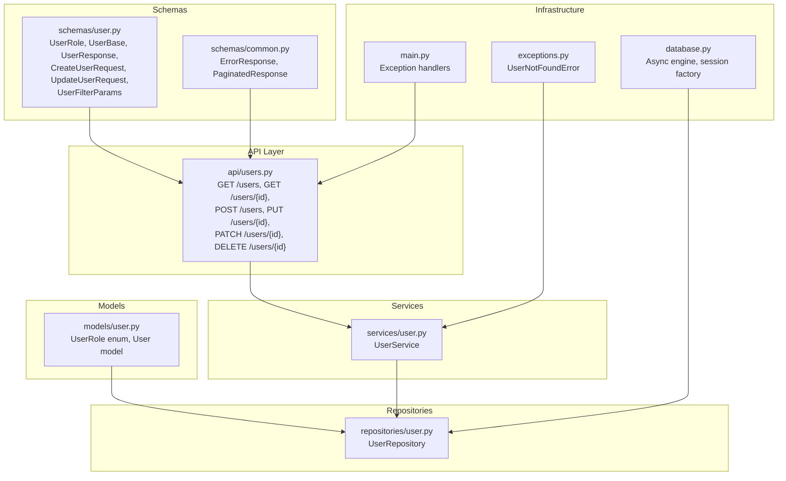
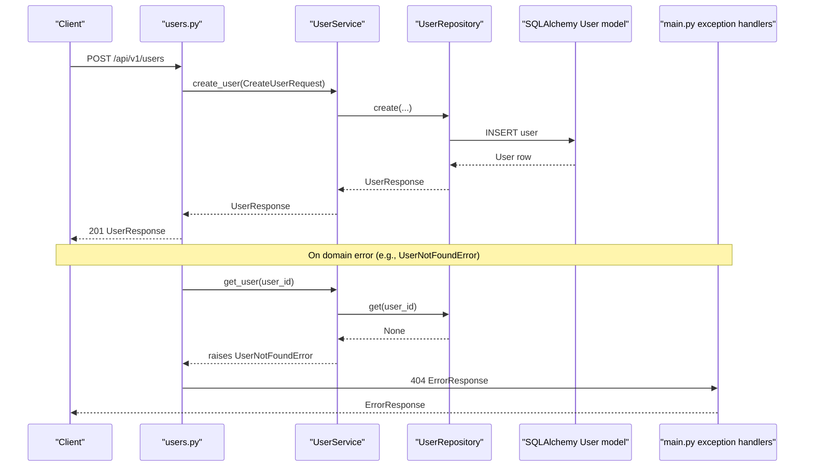
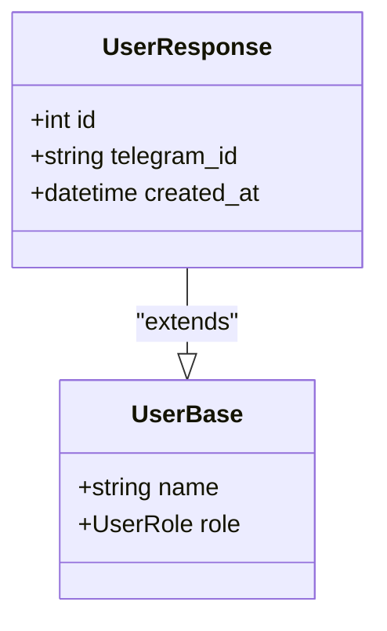
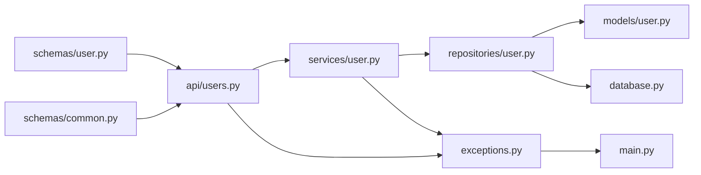
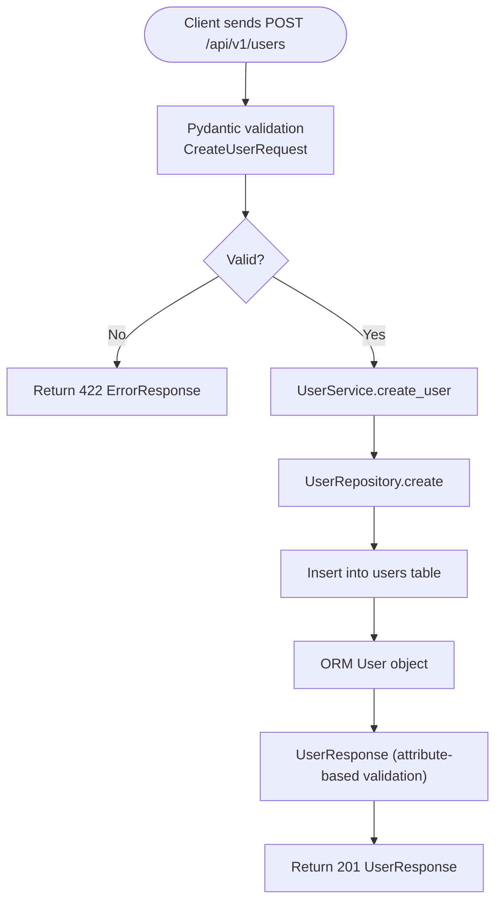

# User and Authentication Schemas

<cite>
**Referenced Files in This Document**
- [backend/schemas/user.py](file://backend/schemas/user.py)
- [backend/models/user.py](file://backend/models/user.py)
- [backend/api/users.py](file://backend/api/users.py)
- [backend/services/user.py](file://backend/services/user.py)
- [backend/repositories/user.py](file://backend/repositories/user.py)
- [backend/schemas/common.py](file://backend/schemas/common.py)
- [backend/exceptions.py](file://backend/exceptions.py)
- [backend/database.py](file://backend/database.py)
- [backend/main.py](file://backend/main.py)
- [backend/tests/test_users.py](file://backend/tests/test_users.py)
</cite>

## Table of Contents
1. [Introduction](#introduction)
2. [Project Structure](#project-structure)
3. [Core Components](#core-components)
4. [Architecture Overview](#architecture-overview)
5. [Detailed Component Analysis](#detailed-component-analysis)
6. [Dependency Analysis](#dependency-analysis)
7. [Performance Considerations](#performance-considerations)
8. [Troubleshooting Guide](#troubleshooting-guide)
9. [Conclusion](#conclusion)
10. [Appendices](#appendices)

## Introduction
This document explains the user and authentication schemas used in the backend. It focuses on the Pydantic models that define user data contracts, validation rules, and serialization patterns. It also documents how these schemas integrate with the API, service, and repository layers to implement user creation, updates, listing, and deletion. The content is designed to be accessible to beginners while providing sufficient technical depth for experienced developers.

## Project Structure
The user-related logic is organized across several layers:
- Schemas: Define request/response models and validation rules.
- Models: Define the persistent representation of users in the database.
- API: Exposes endpoints for user operations.
- Services: Encapsulates business logic and orchestrates operations.
- Repositories: Handles database interactions.
- Common schemas: Provide shared error and pagination models.
- Exceptions: Domain-specific exceptions mapped to HTTP responses.
- Database: Provides async SQLAlchemy configuration and dependency injection.

**Diagram sources**
- [backend/schemas/user.py:1-72](file://backend/schemas/user.py#L1-L72)
- [backend/models/user.py:1-32](file://backend/models/user.py#L1-L32)
- [backend/api/users.py:1-223](file://backend/api/users.py#L1-L223)
- [backend/services/user.py:1-183](file://backend/services/user.py#L1-L183)
- [backend/repositories/user.py:1-168](file://backend/repositories/user.py#L1-L168)
- [backend/schemas/common.py:1-43](file://backend/schemas/common.py#L1-L43)
- [backend/exceptions.py:1-82](file://backend/exceptions.py#L1-L82)
- [backend/database.py:1-41](file://backend/database.py#L1-L41)
- [backend/main.py:1-173](file://backend/main.py#L1-L173)

**Section sources**
- [backend/schemas/user.py:1-72](file://backend/schemas/user.py#L1-L72)
- [backend/models/user.py:1-32](file://backend/models/user.py#L1-L32)
- [backend/api/users.py:1-223](file://backend/api/users.py#L1-L223)
- [backend/services/user.py:1-183](file://backend/services/user.py#L1-L183)
- [backend/repositories/user.py:1-168](file://backend/repositories/user.py#L1-L168)
- [backend/schemas/common.py:1-43](file://backend/schemas/common.py#L1-L43)
- [backend/exceptions.py:1-82](file://backend/exceptions.py#L1-L82)
- [backend/database.py:1-41](file://backend/database.py#L1-L41)
- [backend/main.py:1-173](file://backend/main.py#L1-L173)

## Core Components
This section documents the Pydantic schemas used for user management and their roles.

- UserRole enumeration
  - Purpose: Defines allowed user roles.
  - Values: tenant, owner, both.
  - Usage: Enforced in both request/response models and database model.

- UserBase
  - Purpose: Shared base fields for user requests and responses.
  - Fields:
    - name: string, required, length limits.
    - role: enum, defaults to tenant.

- UserResponse
  - Purpose: Response model for returning user data.
  - Fields:
    - id: integer, required.
    - telegram_id: string or null, optional.
    - created_at: datetime, required.
    - Inherits name and role from UserBase.
  - Serialization: Uses attribute-based validation to convert ORM objects.

- CreateUserRequest
  - Purpose: Request model for creating a user.
  - Fields:
    - telegram_id: string, required, length limits.
    - Inherits name and role from UserBase.

- UpdateUserRequest
  - Purpose: Request model for partial updates.
  - Fields:
    - name: optional string with length limits.
    - role: optional enum.
  - Behavior: Only provided fields are updated.

- UserFilterParams
  - Purpose: Query parameters for listing users.
  - Fields:
    - limit: integer, default 20, bounded.
    - offset: integer, default 0.
    - sort: optional string, supports prefix "-" for descending.
    - role: optional enum filter.

Validation rules and serialization patterns:
- Length constraints and defaults are enforced by Pydantic Field definitions.
- UserResponse uses attribute-based validation to accept ORM objects directly.
- Enum values are validated strictly; invalid values cause validation errors.

**Section sources**
- [backend/schemas/user.py:10-72](file://backend/schemas/user.py#L10-L72)
- [backend/models/user.py:11-28](file://backend/models/user.py#L11-L28)

## Architecture Overview
The user feature follows a layered architecture:
- API layer validates incoming requests using CreateUserRequest and UpdateUserRequest.
- Service layer performs business logic and raises domain exceptions.
- Repository layer executes database operations and returns Pydantic models.
- Database layer provides async SQLAlchemy sessions.
- Exception handlers translate domain exceptions into standardized error responses.

**Diagram sources**
- [backend/api/users.py:85-116](file://backend/api/users.py#L85-L116)
- [backend/services/user.py:50-80](file://backend/services/user.py#L50-L80)
- [backend/repositories/user.py:23-43](file://backend/repositories/user.py#L23-L43)
- [backend/models/user.py:19-31](file://backend/models/user.py#L19-L31)
- [backend/main.py:134-142](file://backend/main.py#L134-L142)

## Detailed Component Analysis

### UserRole Enumeration
- Definition: Enumerated values tenant, owner, both.
- Validation: Strict enforcement in request/response schemas and database model.
- Usage: Applied consistently across CreateUserRequest, UserResponse, UpdateUserRequest, and UserFilterParams.

**Section sources**
- [backend/schemas/user.py:10-16](file://backend/schemas/user.py#L10-L16)
- [backend/models/user.py:11-16](file://backend/models/user.py#L11-L16)

### UserBase
- Purpose: Base schema for common fields.
- Fields:
  - name: required string with min/max length constraints.
  - role: required enum with default tenant.
- Usage: Extended by UserResponse, inherited by request schemas.

**Section sources**
- [backend/schemas/user.py:18-23](file://backend/schemas/user.py#L18-L23)

### UserResponse
- Purpose: Response model for user data.
- Fields:
  - id: required integer.
  - telegram_id: optional string.
  - created_at: required datetime.
  - Inherits name and role from UserBase.
- Serialization: Attribute-based validation enabled via model_config, allowing conversion from ORM objects.

**Diagram sources**
- [backend/schemas/user.py:18-36](file://backend/schemas/user.py#L18-L36)

**Section sources**
- [backend/schemas/user.py:25-36](file://backend/schemas/user.py#L25-L36)

### CreateUserRequest
- Purpose: Request model for user creation.
- Fields:
  - telegram_id: required string with length constraints.
  - Inherits name and role from UserBase.
- Validation: Ensures presence of telegram_id and enforces length constraints.

**Section sources**
- [backend/schemas/user.py:38-45](file://backend/schemas/user.py#L38-L45)

### UpdateUserRequest
- Purpose: Request model for partial updates.
- Fields:
  - name: optional string with length constraints.
  - role: optional enum.
- Behavior: Only provided fields are updated; others remain unchanged.

**Section sources**
- [backend/schemas/user.py:47-55](file://backend/schemas/user.py#L47-L55)

### UserFilterParams
- Purpose: Query parameters for listing users.
- Fields:
  - limit: integer with bounds.
  - offset: integer with lower bound.
  - sort: optional string supporting descending order via prefix.
  - role: optional enum filter.
- Implementation: Repository applies filters, sorting, and pagination.

**Section sources**
- [backend/schemas/user.py:57-72](file://backend/schemas/user.py#L57-L72)

### API Endpoints and Usage Contexts
Endpoints:
- GET /users: Lists users with pagination, sorting, and role filtering.
- GET /users/{id}: Retrieves a user by ID.
- POST /users: Creates a user (typically from Telegram bot).
- PUT /users/{id}: Replaces a user (full update).
- PATCH /users/{id}: Updates a user (partial update).
- DELETE /users/{id}: Deletes a user.

Response models:
- GET /users returns PaginatedResponse[UserResponse].
- Other endpoints return UserResponse.

Error handling:
- NotFound errors return ErrorResponse with error code "not_found".
- Validation errors return ErrorResponse with details.

**Section sources**
- [backend/api/users.py:19-223](file://backend/api/users.py#L19-L223)
- [backend/schemas/common.py:16-43](file://backend/schemas/common.py#L16-L43)
- [backend/main.py:134-142](file://backend/main.py#L134-L142)

### Service Layer: UserService
Responsibilities:
- Orchestrate user operations.
- Raise UserNotFoundError when entities are missing.
- Delegate persistence to UserRepository.

Key methods:
- create_user: Delegates to repository with telegram_id, name, role.
- get_user: Returns UserResponse or raises UserNotFoundError.
- list_users: Delegates to repository with filters.
- update_user: Validates existence, updates provided fields.
- replace_user: Validates existence, replaces with provided fields.
- delete_user: Validates existence, deletes.

**Section sources**
- [backend/services/user.py:33-183](file://backend/services/user.py#L33-L183)

### Repository Layer: UserRepository
Responsibilities:
- Execute database operations using SQLAlchemy async session.
- Convert ORM objects to Pydantic models using attribute-based validation.

Key methods:
- create: Inserts a new user and returns UserResponse.
- get/get_by_telegram_id: Fetches user and returns UserResponse or None.
- get_all: Applies filters, sorting, pagination, returns list and total.
- update: Updates provided fields and returns UserResponse or None.
- delete: Deletes user and returns boolean.

**Section sources**
- [backend/repositories/user.py:12-168](file://backend/repositories/user.py#L12-L168)

### Database Model: User
Fields:
- id: primary key.
- telegram_id: unique, indexed, non-null string.
- name: non-null string with length limit.
- role: enum with default tenant.
- created_at: timestamp with server default.

**Section sources**
- [backend/models/user.py:19-31](file://backend/models/user.py#L19-L31)

### Authentication and Bot Login Context
- telegram_id is used as the external identifier for bot-based login.
- The CreateUserRequest requires telegram_id, enabling registration from Telegram.
- The repository supports lookup by telegram_id.

**Section sources**
- [backend/schemas/user.py:38-45](file://backend/schemas/user.py#L38-L45)
- [backend/repositories/user.py:58-71](file://backend/repositories/user.py#L58-L71)

## Dependency Analysis
The schemas, models, API, service, and repository form a cohesive dependency chain:
- Schemas depend on Pydantic and enum definitions.
- Models depend on SQLAlchemy and the enum definition.
- API depends on schemas and services.
- Service depends on schemas and repository.
- Repository depends on models and schemas for validation.
- Database provides async session factory.
- Exception handlers depend on ErrorResponse.

**Diagram sources**
- [backend/schemas/user.py:1-72](file://backend/schemas/user.py#L1-L72)
- [backend/schemas/common.py:1-43](file://backend/schemas/common.py#L1-L43)
- [backend/api/users.py:1-223](file://backend/api/users.py#L1-L223)
- [backend/services/user.py:1-183](file://backend/services/user.py#L1-L183)
- [backend/repositories/user.py:1-168](file://backend/repositories/user.py#L1-L168)
- [backend/models/user.py:1-32](file://backend/models/user.py#L1-L32)
- [backend/database.py:1-41](file://backend/database.py#L1-L41)
- [backend/exceptions.py:1-82](file://backend/exceptions.py#L1-L82)
- [backend/main.py:1-173](file://backend/main.py#L1-L173)

**Section sources**
- [backend/schemas/user.py:1-72](file://backend/schemas/user.py#L1-L72)
- [backend/models/user.py:1-32](file://backend/models/user.py#L1-L32)
- [backend/api/users.py:1-223](file://backend/api/users.py#L1-L223)
- [backend/services/user.py:1-183](file://backend/services/user.py#L1-L183)
- [backend/repositories/user.py:1-168](file://backend/repositories/user.py#L1-L168)
- [backend/schemas/common.py:1-43](file://backend/schemas/common.py#L1-L43)
- [backend/exceptions.py:1-82](file://backend/exceptions.py#L1-L82)
- [backend/database.py:1-41](file://backend/database.py#L1-L41)
- [backend/main.py:1-173](file://backend/main.py#L1-L173)

## Performance Considerations
- Attribute-based validation in UserResponse avoids redundant conversions and improves serialization performance.
- Pagination and sorting are handled at the database level in the repository to minimize memory overhead.
- Asynchronous SQLAlchemy sessions enable efficient concurrent operations.
- Enum validation occurs at the schema level, preventing invalid values from reaching the database.

[No sources needed since this section provides general guidance]

## Troubleshooting Guide
Common validation scenarios and error handling patterns:
- Validation errors (HTTP 422): Occur when required fields are missing or values are out of range. The API responds with ErrorResponse containing details.
- Not found errors (HTTP 404): Occur when retrieving, updating, or deleting a non-existent user. The API responds with ErrorResponse using error code "not_found".
- Role validation: Invalid role values are rejected during request validation.
- Partial updates: Only provided fields are updated; unspecified fields remain unchanged.

Concrete examples from tests:
- Creating a user with valid data returns 201 and includes id, telegram_id, name, role, and created_at.
- Creating a user with invalid role returns 422.
- Getting a non-existent user returns 404 with error code "not_found".
- Listing users supports filtering by role, pagination, and sorting.

**Section sources**
- [backend/tests/test_users.py:6-93](file://backend/tests/test_users.py#L6-L93)
- [backend/tests/test_users.py:95-124](file://backend/tests/test_users.py#L95-L124)
- [backend/tests/test_users.py:126-237](file://backend/tests/test_users.py#L126-L237)
- [backend/tests/test_users.py:239-314](file://backend/tests/test_users.py#L239-L314)
- [backend/tests/test_users.py:316-358](file://backend/tests/test_users.py#L316-L358)
- [backend/tests/test_users.py:360-386](file://backend/tests/test_users.py#L360-L386)
- [backend/schemas/common.py:16-27](file://backend/schemas/common.py#L16-L27)
- [backend/main.py:134-142](file://backend/main.py#L134-L142)

## Conclusion
The user and authentication schemas provide a robust, validated, and serializable contract for user management. They integrate cleanly with the API, service, and repository layers, ensuring consistent validation, predictable responses, and clear error handling. The design supports both bot-based login via telegram_id and flexible update semantics through partial updates.

[No sources needed since this section summarizes without analyzing specific files]

## Appendices

### API Endpoints Summary
- GET /api/v1/users
  - Response: PaginatedResponse[UserResponse]
  - Query params: limit, offset, sort, role
- GET /api/v1/users/{id}
  - Response: UserResponse
- POST /api/v1/users
  - Request: CreateUserRequest
  - Response: UserResponse
- PUT /api/v1/users/{id}
  - Request: CreateUserRequest
  - Response: UserResponse
- PATCH /api/v1/users/{id}
  - Request: UpdateUserRequest
  - Response: UserResponse
- DELETE /api/v1/users/{id}
  - Response: No content (204)

**Section sources**
- [backend/api/users.py:19-223](file://backend/api/users.py#L19-L223)

### Data Flow for User Creation

**Diagram sources**
- [backend/api/users.py:85-116](file://backend/api/users.py#L85-L116)
- [backend/services/user.py:50-63](file://backend/services/user.py#L50-L63)
- [backend/repositories/user.py:23-43](file://backend/repositories/user.py#L23-L43)
- [backend/schemas/user.py:38-45](file://backend/schemas/user.py#L38-L45)