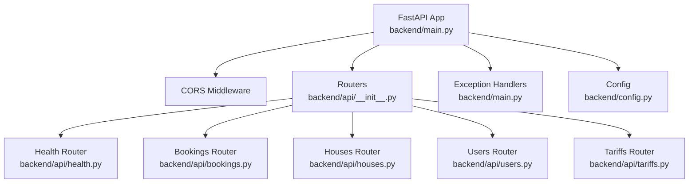
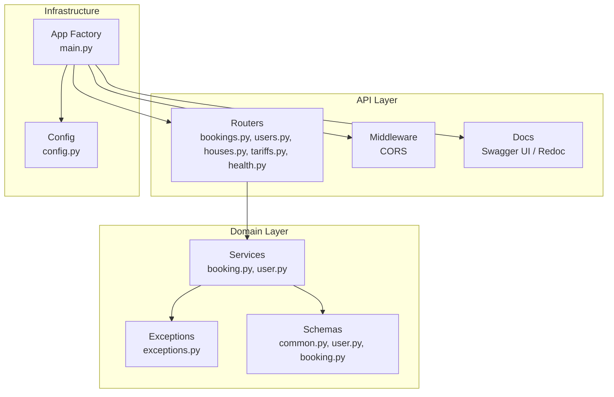
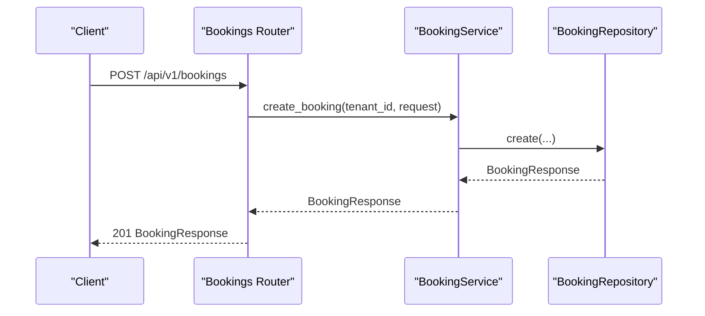
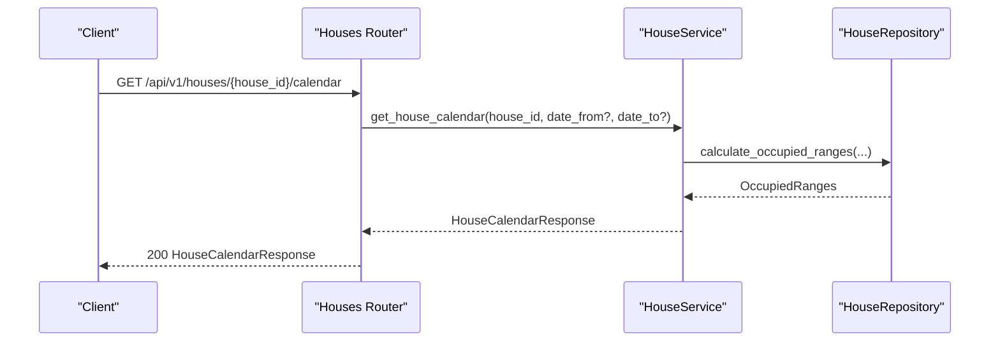
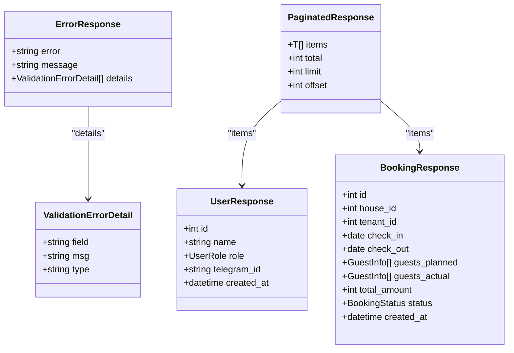
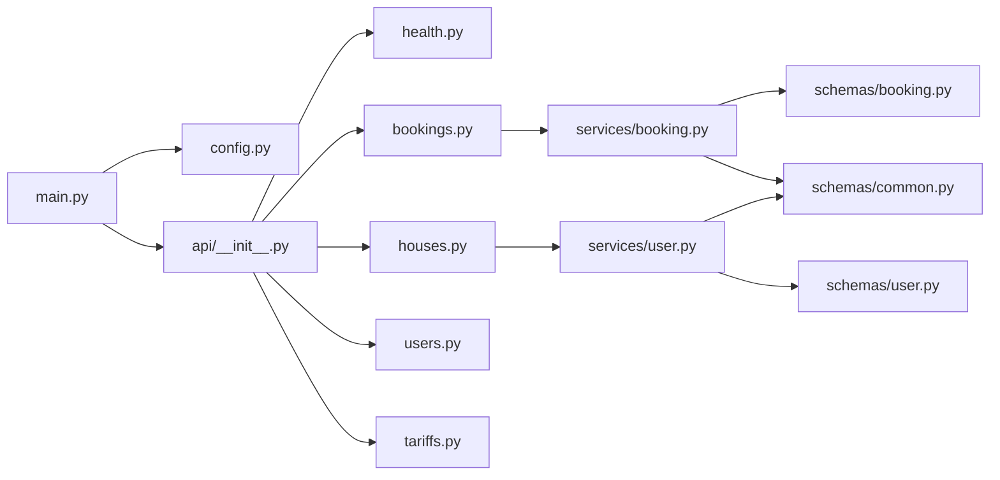

# API Overview and Authentication

<cite>
**Referenced Files in This Document**
- [backend/main.py](file://backend/main.py)
- [backend/config.py](file://backend/config.py)
- [backend/api/__init__.py](file://backend/api/__init__.py)
- [backend/api/health.py](file://backend/api/health.py)
- [backend/api/bookings.py](file://backend/api/bookings.py)
- [backend/api/users.py](file://backend/api/users.py)
- [backend/api/houses.py](file://backend/api/houses.py)
- [backend/api/tariffs.py](file://backend/api/tariffs.py)
- [backend/schemas/common.py](file://backend/schemas/common.py)
- [backend/schemas/user.py](file://backend/schemas/user.py)
- [backend/schemas/booking.py](file://backend/schemas/booking.py)
- [backend/exceptions.py](file://backend/exceptions.py)
- [backend/services/booking.py](file://backend/services/booking.py)
- [backend/services/user.py](file://backend/services/user.py)
</cite>

## Table of Contents
1. [Introduction](#introduction)
2. [Project Structure](#project-structure)
3. [Core Components](#core-components)
4. [Architecture Overview](#architecture-overview)
5. [Detailed Component Analysis](#detailed-component-analysis)
6. [Dependency Analysis](#dependency-analysis)
7. [Performance Considerations](#performance-considerations)
8. [Troubleshooting Guide](#troubleshooting-guide)
9. [Conclusion](#conclusion)
10. [Appendices](#appendices)

## Introduction
This document provides a comprehensive overview of the FastAPI backend architecture, base URL structure, and authentication mechanisms. It explains the API design principles, versioning strategy, common response patterns, error handling, rate limiting posture, CORS configuration, and API documentation generation. It also covers health checks, system monitoring capabilities, and practical guidance for testing, client implementation, and debugging.

## Project Structure
The backend is organized around a layered architecture:
- Application entrypoint initializes FastAPI, middleware, routers, and exception handlers.
- API routers define endpoints grouped by domain resources (bookings, houses, users, tariffs, health).
- Schemas define request/response models and shared patterns (pagination, error).
- Services encapsulate business logic and orchestrate repositories.
- Exceptions define domain-specific errors mapped to standardized HTTP responses.

**Diagram sources**
- [backend/main.py:41-59](file://backend/main.py#L41-L59)
- [backend/api/__init__.py:9-14](file://backend/api/__init__.py#L9-L14)

**Section sources**
- [backend/main.py:41-59](file://backend/main.py#L41-L59)
- [backend/api/__init__.py:1-15](file://backend/api/__init__.py#L1-L15)

## Core Components
- Base URL and Versioning: All routes are prefixed under /api/v1. The application exposes version metadata in the health endpoint.
- CORS: Enabled with broad allow-all settings for origins, methods, and headers.
- Documentation: Swagger UI and ReDoc are enabled.
- Health Endpoint: Provides system status and version.
- Standardized Responses: Pagination wrapper and error response model are used consistently.
- Exception Handling: Domain exceptions are mapped to appropriate HTTP statuses with a unified error envelope.

Key behaviors:
- Base URL pattern: /api/v1/{resource}
- Health endpoint: GET /api/v1/health
- Error envelope: { error, message, details? }
- Pagination envelope: { items, total, limit, offset }

**Section sources**
- [backend/main.py:41-47](file://backend/main.py#L41-L47)
- [backend/main.py:49-56](file://backend/main.py#L49-L56)
- [backend/api/health.py:6-8](file://backend/api/health.py#L6-L8)
- [backend/schemas/common.py:16-27](file://backend/schemas/common.py#L16-L27)
- [backend/schemas/common.py:33-43](file://backend/schemas/common.py#L33-L43)

## Architecture Overview
The API follows a clean architecture with clear separation of concerns:
- Routers handle HTTP routing and request/response modeling.
- Services encapsulate business logic and coordinate repositories.
- Repositories manage persistence.
- Schemas define data contracts.
- Centralized exception handlers convert domain exceptions into standardized error responses.

**Diagram sources**
- [backend/main.py:41-59](file://backend/main.py#L41-L59)
- [backend/api/bookings.py:17](file://backend/api/bookings.py#L17)
- [backend/api/users.py:16](file://backend/api/users.py#L16)
- [backend/api/houses.py:18](file://backend/api/houses.py#L18)
- [backend/api/tariffs.py:15](file://backend/api/tariffs.py#L15)
- [backend/api/health.py:3](file://backend/api/health.py#L3)
- [backend/services/booking.py:57](file://backend/services/booking.py#L57)
- [backend/services/user.py:33](file://backend/services/user.py#L33)
- [backend/schemas/common.py:16-43](file://backend/schemas/common.py#L16-L43)
- [backend/exceptions.py:8-82](file://backend/exceptions.py#L8-L82)
- [backend/config.py:4-24](file://backend/config.py#L4-L24)

## Detailed Component Analysis

### Base URL and Versioning
- All endpoints are mounted under /api/v1.
- Version metadata is exposed via the health endpoint.

Examples:
- GET /api/v1/health
- GET /api/v1/bookings
- GET /api/v1/users
- GET /api/v1/houses
- GET /api/v1/tariffs

**Section sources**
- [backend/main.py:59](file://backend/main.py#L59)
- [backend/api/health.py:6-8](file://backend/api/health.py#L6-L8)

### Authentication and Access Control
- Current implementation uses placeholder identifiers for tenant and owner contexts in endpoints.
- Ownership checks are enforced in service logic for bookings and houses.
- Future JWT-based authentication is noted in endpoint comments.

Guidelines:
- Replace placeholder tenant_id and owner_id with authenticated user context.
- Enforce ownership checks server-side before mutating resources.
- Add authentication middleware and dependency injectors for token validation.

**Section sources**
- [backend/api/bookings.py:123-126](file://backend/api/bookings.py#L123-L126)
- [backend/api/bookings.py:175-177](file://backend/api/bookings.py#L175-L177)
- [backend/api/bookings.py:220-222](file://backend/api/bookings.py#L220-L222)
- [backend/api/houses.py:117-119](file://backend/api/houses.py#L117-L119)
- [backend/services/booking.py:234-243](file://backend/services/booking.py#L234-L243)

### Error Handling and Response Patterns
- Standardized error envelope: { error, message, details? }.
- Pagination envelope: { items, total, limit, offset }.
- Domain exceptions are mapped to HTTP status codes in centralized handlers.

Common error envelopes:
- not_found
- forbidden
- invalid_status
- already_cancelled
- internal_error

**Section sources**
- [backend/schemas/common.py:16-27](file://backend/schemas/common.py#L16-L27)
- [backend/schemas/common.py:33-43](file://backend/schemas/common.py#L33-L43)
- [backend/main.py:67-166](file://backend/main.py#L67-L166)
- [backend/exceptions.py:8-82](file://backend/exceptions.py#L8-L82)

### Health Checks and Monitoring
- Health endpoint returns status and version.
- Application logs startup/shutdown lifecycle events.

Usage:
- GET /api/v1/health
- Monitor logs for operational insights.

**Section sources**
- [backend/api/health.py:6-8](file://backend/api/health.py#L6-L8)
- [backend/main.py:31-38](file://backend/main.py#L31-L38)

### API Documentation Generation
- Swagger UI and ReDoc are enabled.
- Endpoints declare summaries, descriptions, and response models.

Access:
- /docs (Swagger UI)
- /redoc (ReDoc)

**Section sources**
- [backend/main.py:42-46](file://backend/main.py#L42-L46)
- [backend/api/bookings.py:20-28](file://backend/api/bookings.py#L20-L28)
- [backend/api/users.py:19-27](file://backend/api/users.py#L19-L27)
- [backend/api/houses.py:21-29](file://backend/api/houses.py#L21-L29)
- [backend/api/tariffs.py:18-26](file://backend/api/tariffs.py#L18-L26)

### Rate Limiting
- No explicit rate limiting middleware is configured in the current implementation.
- Recommendation: Integrate rate limiting (e.g., via FastAPI middleware) to protect public endpoints.

[No sources needed since this section provides general guidance]

### CORS Configuration
- Broad allow-all policy is configured for development.
- Recommendation: Lock down origins, methods, and headers in production.

**Section sources**
- [backend/main.py:49-56](file://backend/main.py#L49-L56)

### Endpoints Overview

#### Bookings
- List, get, create, update, cancel bookings.
- Pagination supported via limit/offset.
- Ownership enforcement for updates and cancellations.

**Diagram sources**
- [backend/api/bookings.py:104-126](file://backend/api/bookings.py#L104-L126)
- [backend/services/booking.py:127-170](file://backend/services/booking.py#L127-L170)

**Section sources**
- [backend/api/bookings.py:17-223](file://backend/api/bookings.py#L17-L223)
- [backend/services/booking.py:57-322](file://backend/services/booking.py#L57-L322)

#### Houses
- List, get, create, update, delete houses.
- Calendar endpoint returns occupied date ranges.

**Diagram sources**
- [backend/api/houses.py:242-265](file://backend/api/houses.py#L242-L265)
- [backend/services/house.py:1-200](file://backend/services/house.py#L1-L200)

**Section sources**
- [backend/api/houses.py:18-266](file://backend/api/houses.py#L18-L266)

#### Users
- List, get, create, replace, update, delete users.
- Pagination and sorting supported.

**Section sources**
- [backend/api/users.py:16-223](file://backend/api/users.py#L16-L223)
- [backend/services/user.py:33-183](file://backend/services/user.py#L33-L183)

#### Tariffs
- List, get, create, update, delete tariffs.
- Pagination supported.

**Section sources**
- [backend/api/tariffs.py:15-187](file://backend/api/tariffs.py#L15-L187)

### Data Models Overview

**Diagram sources**
- [backend/schemas/common.py:16-43](file://backend/schemas/common.py#L16-L43)
- [backend/schemas/user.py:25-36](file://backend/schemas/user.py#L25-L36)
- [backend/schemas/booking.py:43-68](file://backend/schemas/booking.py#L43-L68)

## Dependency Analysis
- Routers depend on services for business logic.
- Services depend on repositories and schemas.
- App initialization wires routers, middleware, and exception handlers.
- Configuration drives server and logging behavior.

**Diagram sources**
- [backend/main.py:41-59](file://backend/main.py#L41-L59)
- [backend/config.py:4-24](file://backend/config.py#L4-L24)
- [backend/api/__init__.py:1-15](file://backend/api/__init__.py#L1-L15)
- [backend/api/health.py:1-9](file://backend/api/health.py#L1-L9)
- [backend/api/bookings.py:1-223](file://backend/api/bookings.py#L1-L223)
- [backend/api/houses.py:1-266](file://backend/api/houses.py#L1-L266)
- [backend/api/users.py:1-223](file://backend/api/users.py#L1-L223)
- [backend/api/tariffs.py:1-187](file://backend/api/tariffs.py#L1-L187)
- [backend/services/booking.py:1-322](file://backend/services/booking.py#L1-L322)
- [backend/services/user.py:1-183](file://backend/services/user.py#L1-L183)
- [backend/schemas/booking.py:1-133](file://backend/schemas/booking.py#L1-L133)
- [backend/schemas/user.py:1-72](file://backend/schemas/user.py#L1-L72)
- [backend/schemas/common.py:1-43](file://backend/schemas/common.py#L1-L43)

**Section sources**
- [backend/main.py:41-59](file://backend/main.py#L41-L59)
- [backend/api/__init__.py:1-15](file://backend/api/__init__.py#L1-L15)

## Performance Considerations
- Pagination: Use limit/offset to avoid large payloads.
- Validation: Leverage Pydantic validators to fail fast on malformed requests.
- Database queries: Ensure repository queries are indexed appropriately for filters and sorts.
- Logging: Tune log level to balance observability and overhead.

[No sources needed since this section provides general guidance]

## Troubleshooting Guide
Common scenarios and resolutions:
- 404 Not Found: Resource does not exist; verify IDs and filters.
- 403 Forbidden: Operation denied due to lack of permissions; ensure proper tenant/owner context.
- 400 Bad Request: Validation or business rule violation; review payload and constraints.
- 500 Internal Error: Unexpected server error; check logs for stack traces.

Debugging tips:
- Use /docs or /redoc to explore endpoints and test requests.
- Inspect logs during startup and runtime for lifecycle and error details.
- Validate schemas locally before sending requests.

**Section sources**
- [backend/main.py:67-166](file://backend/main.py#L67-L166)
- [backend/exceptions.py:8-82](file://backend/exceptions.py#L8-L82)

## Conclusion
The backend provides a well-structured FastAPI foundation with clear separation of concerns, standardized responses, and consistent error handling. The current implementation focuses on resource APIs with placeholder authentication and broad CORS settings suitable for development. Upgrades should include robust authentication, stricter CORS, rate limiting, and comprehensive API tests.

## Appendices

### Base URL Patterns
- Base: /api/v1
- Examples:
  - GET /api/v1/health
  - GET /api/v1/bookings
  - GET /api/v1/users
  - GET /api/v1/houses
  - GET /api/v1/tariffs

**Section sources**
- [backend/main.py:59](file://backend/main.py#L59)
- [backend/api/health.py:6-8](file://backend/api/health.py#L6-L8)

### Common Headers
- Content-Type: application/json
- Accept: application/json
- Additional headers may be required depending on client implementation.

[No sources needed since this section provides general guidance]

### Successful Response Examples
- GET /api/v1/health returns { status: "ok", version: "0.1.0" }.
- GET /api/v1/bookings returns PaginatedResponse[BookingResponse].
- GET /api/v1/users returns PaginatedResponse[UserResponse].

**Section sources**
- [backend/api/health.py:6-8](file://backend/api/health.py#L6-L8)
- [backend/schemas/common.py:33-43](file://backend/schemas/common.py#L33-L43)
- [backend/schemas/booking.py:43-68](file://backend/schemas/booking.py#L43-L68)
- [backend/schemas/user.py:25-36](file://backend/schemas/user.py#L25-L36)

### Standard Error Formats
- { error, message, details? }
- Typical error codes: not_found, forbidden, invalid_status, already_cancelled, internal_error

**Section sources**
- [backend/schemas/common.py:16-27](file://backend/schemas/common.py#L16-L27)
- [backend/main.py:67-166](file://backend/main.py#L67-L166)

### API Testing Strategies
- Unit tests for services and repositories.
- Integration tests for routers with mocked dependencies.
- Contract tests using OpenAPI specs.
- Load tests for paginated endpoints.

[No sources needed since this section provides general guidance]

### Client Implementation Guidelines
- Always send Content-Type: application/json.
- Parse standardized error responses and present user-friendly messages.
- Respect pagination parameters (limit, offset) for list endpoints.
- Implement retry/backoff for transient failures.

[No sources needed since this section provides general guidance]