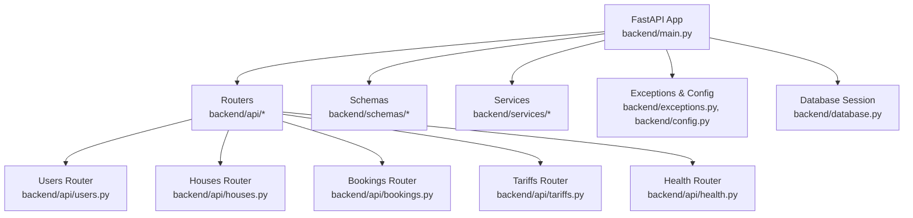
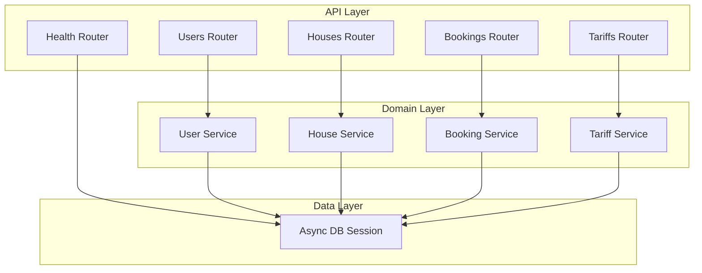
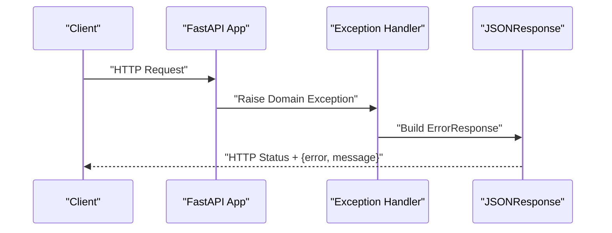
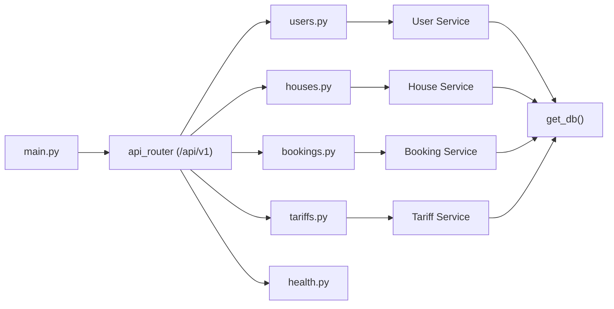

# Backend API Services

<cite>
**Referenced Files in This Document**
- [backend/main.py](file://backend/main.py)
- [backend/api/__init__.py](file://backend/api/__init__.py)
- [backend/api/users.py](file://backend/api/users.py)
- [backend/api/houses.py](file://backend/api/houses.py)
- [backend/api/bookings.py](file://backend/api/bookings.py)
- [backend/api/tariffs.py](file://backend/api/tariffs.py)
- [backend/api/health.py](file://backend/api/health.py)
- [backend/schemas/common.py](file://backend/schemas/common.py)
- [backend/schemas/user.py](file://backend/schemas/user.py)
- [backend/schemas/house.py](file://backend/schemas/house.py)
- [backend/schemas/booking.py](file://backend/schemas/booking.py)
- [backend/schemas/tariff.py](file://backend/schemas/tariff.py)
- [backend/exceptions.py](file://backend/exceptions.py)
- [backend/config.py](file://backend/config.py)
- [backend/database.py](file://backend/database.py)
- [docs/how-to-get-tokens.md](file://docs/how-to-get-tokens.md)
</cite>

## Table of Contents
1. [Introduction](#introduction)
2. [Project Structure](#project-structure)
3. [Core Components](#core-components)
4. [Architecture Overview](#architecture-overview)
5. [Detailed Component Analysis](#detailed-component-analysis)
6. [Dependency Analysis](#dependency-analysis)
7. [Performance Considerations](#performance-considerations)
8. [Troubleshooting Guide](#troubleshooting-guide)
9. [Conclusion](#conclusion)
10. [Appendices](#appendices)

## Introduction
This document describes the FastAPI backend services for the booking platform. It covers all RESTful endpoints for Users, Houses, Bookings, and Tariffs, including HTTP methods, URL patterns, request/response schemas, error handling, health checks, and operational guidance. It also outlines authentication considerations, rate limiting, API versioning, and practical usage examples.

## Project Structure
The backend is organized around a FastAPI application with modular routers for each domain resource, shared schemas for requests/responses, and services that encapsulate business logic. Configuration and database setup are centralized for easy deployment and maintenance.

**Diagram sources**
- [backend/main.py:41-64](file://backend/main.py#L41-L64)
- [backend/api/users.py:16](file://backend/api/users.py#L16)
- [backend/api/houses.py:18](file://backend/api/houses.py#L18)
- [backend/api/bookings.py:17](file://backend/api/bookings.py#L17)
- [backend/api/tariffs.py:15](file://backend/api/tariffs.py#L15)
- [backend/api/health.py:3](file://backend/api/health.py#L3)
- [backend/schemas/common.py:33](file://backend/schemas/common.py#L33)
- [backend/exceptions.py:8](file://backend/exceptions.py#L8)
- [backend/config.py:4](file://backend/config.py#L4)
- [backend/database.py:26](file://backend/database.py#L26)

**Section sources**
- [backend/main.py:41-64](file://backend/main.py#L41-L64)
- [backend/api/__init__.py](file://backend/api/__init__.py)

## Core Components
- Application lifecycle and exception handling are configured centrally, including a global health endpoint and standardized error responses.
- Routers expose CRUD endpoints for Users, Houses, Bookings, and Tariffs under a versioned base path.
- Shared schemas define request/response contracts and pagination wrappers.
- Services encapsulate domain logic and are injected via FastAPI Depends.
- Exceptions are mapped to consistent HTTP responses.

Key highlights:
- Versioning: All routes are prefixed with /api/v1.
- Health: A top-level /health endpoint returns service status.
- Error responses: Standardized ErrorResponse schema with error code and human-readable message.

**Section sources**
- [backend/main.py:41-64](file://backend/main.py#L41-L64)
- [backend/main.py:62-64](file://backend/main.py#L62-L64)
- [backend/schemas/common.py:16](file://backend/schemas/common.py#L16)

## Architecture Overview
The API follows a layered architecture:
- Controllers (routers) handle HTTP requests and responses.
- Services implement business logic and orchestrate repositories/models.
- Schemas validate and serialize data.
- Database sessions are managed via SQLAlchemy async engine.

**Diagram sources**
- [backend/api/users.py:16](file://backend/api/users.py#L16)
- [backend/api/houses.py:18](file://backend/api/houses.py#L18)
- [backend/api/bookings.py:17](file://backend/api/bookings.py#L17)
- [backend/api/tariffs.py:15](file://backend/api/tariffs.py#L15)
- [backend/api/health.py:3](file://backend/api/health.py#L3)
- [backend/database.py:26](file://backend/database.py#L26)

## Detailed Component Analysis

### Health Endpoint
- Method: GET
- Path: /health
- Description: Returns service status and version.
- Responses:
  - 200 OK: { "status": "ok", "version": "0.1.0" }

Operational notes:
- Use this endpoint for readiness/liveness probes.
- Version is exposed to track deployments.

**Section sources**
- [backend/api/health.py:6-8](file://backend/api/health.py#L6-L8)
- [backend/main.py:62-64](file://backend/main.py#L62-L64)

### Users API
Endpoints:
- GET /api/v1/users
  - Query params: limit, offset, sort, role
  - Response: PaginatedResponse<UserResponse>
- GET /api/v1/users/{user_id}
  - Path param: user_id (int)
  - Response: UserResponse
- POST /api/v1/users
  - Body: CreateUserRequest
  - Response: UserResponse (201)
- PUT /api/v1/users/{user_id}
  - Path param: user_id (int)
  - Body: CreateUserRequest (full replacement)
  - Response: UserResponse
- PATCH /api/v1/users/{user_id}
  - Path param: user_id (int)
  - Body: UpdateUserRequest (partial update)
  - Response: UserResponse
- DELETE /api/v1/users/{user_id}
  - Path param: user_id (int)
  - Response: 204 No Content

Schemas:
- UserResponse: id, name, role, telegram_id, created_at
- CreateUserRequest: name, role, telegram_id
- UpdateUserRequest: name?, role?
- UserFilterParams: limit, offset, sort?, role?

Notes:
- Filtering and pagination supported on list endpoint.
- Validation enforced by Pydantic models.

**Section sources**
- [backend/api/users.py:19-50](file://backend/api/users.py#L19-L50)
- [backend/api/users.py:53-82](file://backend/api/users.py#L53-L82)
- [backend/api/users.py:85-115](file://backend/api/users.py#L85-L115)
- [backend/api/users.py:118-153](file://backend/api/users.py#L118-L153)
- [backend/api/users.py:156-193](file://backend/api/users.py#L156-L193)
- [backend/api/users.py:196-222](file://backend/api/users.py#L196-L222)
- [backend/schemas/user.py:25](file://backend/schemas/user.py#L25)
- [backend/schemas/user.py:38](file://backend/schemas/user.py#L38)
- [backend/schemas/user.py:47](file://backend/schemas/user.py#L47)
- [backend/schemas/user.py:57](file://backend/schemas/user.py#L57)

### Houses API
Endpoints:
- GET /api/v1/houses
  - Query params: limit, offset, sort, owner_id?, is_active?, capacity_min?, capacity_max?
  - Response: PaginatedResponse<HouseResponse>
- GET /api/v1/houses/{house_id}
  - Path param: house_id (int)
  - Response: HouseResponse
- POST /api/v1/houses
  - Body: CreateHouseRequest
  - Response: HouseResponse (201)
- PUT /api/v1/houses/{house_id}
  - Path param: house_id (int)
  - Body: CreateHouseRequest (full replacement)
  - Response: HouseResponse
- PATCH /api/v1/houses/{house_id}
  - Path param: house_id (int)
  - Body: UpdateHouseRequest (partial update)
  - Response: HouseResponse
- DELETE /api/v1/houses/{house_id}
  - Path param: house_id (int)
  - Response: 204 No Content
- GET /api/v1/houses/{house_id}/calendar
  - Path param: house_id (int)
  - Query params: date_from?, date_to?
  - Response: HouseCalendarResponse

Schemas:
- HouseResponse: id, name, description, capacity, is_active, owner_id, created_at
- CreateHouseRequest: name, description, capacity, is_active
- UpdateHouseRequest: name?, description?, capacity?, is_active?
- HouseFilterParams: limit, offset, sort?, owner_id?, is_active?, capacity_min?, capacity_max?
- HouseCalendarResponse: house_id, occupied_dates: [{ check_in, check_out, booking_id }]

Notes:
- Calendar endpoint aggregates occupied date ranges for availability.

**Section sources**
- [backend/api/houses.py:21-52](file://backend/api/houses.py#L21-L52)
- [backend/api/houses.py:55-84](file://backend/api/houses.py#L55-L84)
- [backend/api/houses.py:87-119](file://backend/api/houses.py#L87-L119)
- [backend/api/houses.py:122-157](file://backend/api/houses.py#L122-L157)
- [backend/api/houses.py:160-197](file://backend/api/houses.py#L160-L197)
- [backend/api/houses.py:200-226](file://backend/api/houses.py#L200-L226)
- [backend/api/houses.py:229-265](file://backend/api/houses.py#L229-L265)
- [backend/schemas/house.py:34](file://backend/schemas/house.py#L34)
- [backend/schemas/house.py:47](file://backend/schemas/house.py#L47)
- [backend/schemas/house.py:56](file://backend/schemas/house.py#L56)
- [backend/schemas/house.py:76](file://backend/schemas/house.py#L76)
- [backend/schemas/house.py:96](file://backend/schemas/house.py#L96)

### Bookings API
Endpoints:
- GET /api/v1/bookings
  - Query params: limit, offset, sort, user_id?, house_id?, status?, check_in_from?, check_in_to?, check_out_from?, check_out_to?
  - Response: PaginatedResponse<BookingResponse>
- GET /api/v1/bookings/{booking_id}
  - Path param: booking_id (int)
  - Response: BookingResponse
- POST /api/v1/bookings
  - Body: CreateBookingRequest
  - Response: BookingResponse (201)
- PATCH /api/v1/bookings/{booking_id}
  - Path param: booking_id (int)
  - Body: UpdateBookingRequest (partial update)
  - Response: BookingResponse
- DELETE /api/v1/bookings/{booking_id}
  - Path param: booking_id (int)
  - Response: BookingResponse (cancellation)

Schemas:
- BookingResponse: id, house_id, tenant_id, check_in, check_out, guests_planned, guests_actual?, total_amount?, status, created_at
- CreateBookingRequest: house_id, check_in, check_out, guests: [{ tariff_id, count }]
- UpdateBookingRequest: check_in?, check_out?, guests?, status?
- BookingFilterParams: limit, offset, sort?, user_id?, house_id?, status?, check_in_from?, check_in_to?, check_out_from?, check_out_to?
- Enums: BookingStatus = pending | confirmed | cancelled | completed

Notes:
- Validation ensures check_in < check_out for both create and update.
- Ownership checks and status transitions are enforced by services.

**Section sources**
- [backend/api/bookings.py:20-51](file://backend/api/bookings.py#L20-L51)
- [backend/api/bookings.py:54-83](file://backend/api/bookings.py#L54-L83)
- [backend/api/bookings.py:86-126](file://backend/api/bookings.py#L86-L126)
- [backend/api/bookings.py:129-177](file://backend/api/bookings.py#L129-L177)
- [backend/api/bookings.py:180-222](file://backend/api/bookings.py#L180-L222)
- [backend/schemas/booking.py:43](file://backend/schemas/booking.py#L43)
- [backend/schemas/booking.py:70](file://backend/schemas/booking.py#L70)
- [backend/schemas/booking.py:90](file://backend/schemas/booking.py#L90)
- [backend/schemas/booking.py:110](file://backend/schemas/booking.py#L110)

### Tariffs API
Endpoints:
- GET /api/v1/tariffs
  - Query params: limit, offset, sort
  - Response: PaginatedResponse<TariffResponse>
- GET /api/v1/tariffs/{tariff_id}
  - Path param: tariff_id (int)
  - Response: TariffResponse
- POST /api/v1/tariffs
  - Body: CreateTariffRequest
  - Response: TariffResponse (201)
- PATCH /api/v1/tariffs/{tariff_id}
  - Path param: tariff_id (int)
  - Body: UpdateTariffRequest (partial update)
  - Response: TariffResponse
- DELETE /api/v1/tariffs/{tariff_id}
  - Path param: tariff_id (int)
  - Response: 204 No Content

Schemas:
- TariffResponse: id, name, amount, created_at
- CreateTariffRequest: name, amount
- UpdateTariffRequest: name?, amount?

Notes:
- Tariff amounts are stored in rubles.

**Section sources**
- [backend/api/tariffs.py:18-52](file://backend/api/tariffs.py#L18-L52)
- [backend/api/tariffs.py:55-84](file://backend/api/tariffs.py#L55-L84)
- [backend/api/tariffs.py:87-117](file://backend/api/tariffs.py#L87-L117)
- [backend/api/tariffs.py:120-157](file://backend/api/tariffs.py#L120-L157)
- [backend/api/tariffs.py:160-186](file://backend/api/tariffs.py#L160-L186)
- [backend/schemas/tariff.py:25](file://backend/schemas/tariff.py#L25)
- [backend/schemas/tariff.py:37](file://backend/schemas/tariff.py#L37)
- [backend/schemas/tariff.py:46](file://backend/schemas/tariff.py#L46)

### Authentication and Authorization
- Current implementation: Endpoints set placeholders for owner/tenant identity during create/update/cancel operations.
- Future integration: JWT tokens are anticipated for user authentication and authorization. Refer to task references noted in the code comments.
- Practical guidance:
  - Use the Users API to register and manage user profiles.
  - Implement token-based authentication to enforce ownership and permissions on sensitive operations.

**Section sources**
- [backend/api/houses.py:117-119](file://backend/api/houses.py#L117-L119)
- [backend/api/bookings.py:123-126](file://backend/api/bookings.py#L123-L126)
- [backend/api/bookings.py:175-177](file://backend/api/bookings.py#L175-L177)
- [backend/api/bookings.py:220-222](file://backend/api/bookings.py#L220-L222)

### Error Handling
- Standardized ErrorResponse schema: error, message, details (optional).
- Domain-specific exceptions mapped to appropriate HTTP statuses:
  - 404 Not Found: BookingNotFound, HouseNotFound, UserNotFound, TariffNotFound
  - 400 Bad Request: DateConflict, InvalidBookingStatus, AlreadyCancelled
  - 403 Forbidden: Permission errors
  - 500 Internal Server Error: Global handler logs and returns generic error

**Diagram sources**
- [backend/main.py:68-166](file://backend/main.py#L68-L166)
- [backend/schemas/common.py:16](file://backend/schemas/common.py#L16)
- [backend/exceptions.py:16](file://backend/exceptions.py#L16)

**Section sources**
- [backend/main.py:68-166](file://backend/main.py#L68-L166)
- [backend/schemas/common.py:16](file://backend/schemas/common.py#L16)
- [backend/exceptions.py:16](file://backend/exceptions.py#L16)

### Pagination and Filtering
- PaginatedResponse: items, total, limit, offset
- FilterParams are defined per resource:
  - Users: role
  - Houses: owner_id, is_active, capacity_min, capacity_max
  - Bookings: user_id, house_id, status, date ranges
- Sorting: sort accepts field names; prefix with "-" for descending.

**Section sources**
- [backend/schemas/common.py:33](file://backend/schemas/common.py#L33)
- [backend/schemas/user.py:57](file://backend/schemas/user.py#L57)
- [backend/schemas/house.py:76](file://backend/schemas/house.py#L76)
- [backend/schemas/booking.py:110](file://backend/schemas/booking.py#L110)

### Practical Examples
- Retrieve users with role filter and pagination:
  - GET /api/v1/users?role=tenant&limit=20&offset=0
- Create a booking:
  - POST /api/v1/bookings with body containing house_id, check_in, check_out, guests[]
- Get house calendar for a period:
  - GET /api/v1/houses/{house_id}/calendar?date_from=YYYY-MM-DD&date_to=YYYY-MM-DD
- Update tariff amount:
  - PATCH /api/v1/tariffs/{tariff_id} with amount

[No sources needed since this section provides usage examples without quoting specific files]

## Dependency Analysis
- Routers depend on services via FastAPI Depends.
- Services depend on database sessions from database.get_db().
- Exceptions are centralized and mapped to HTTP responses in main.py.
- Configuration is loaded via pydantic-settings.

**Diagram sources**
- [backend/main.py:59](file://backend/main.py#L59)
- [backend/api/users.py:30](file://backend/api/users.py#L30)
- [backend/api/houses.py:32](file://backend/api/houses.py#L32)
- [backend/api/bookings.py:31](file://backend/api/bookings.py#L31)
- [backend/api/tariffs.py:28](file://backend/api/tariffs.py#L28)
- [backend/database.py:26](file://backend/database.py#L26)

**Section sources**
- [backend/main.py:59](file://backend/main.py#L59)
- [backend/database.py:26](file://backend/database.py#L26)

## Performance Considerations
- Pagination: Use limit/offset to avoid large payloads.
- Sorting: Prefer indexed fields for sorting to reduce overhead.
- Validation: Pydantic validators prevent invalid requests early.
- Asynchronous database: SQLAlchemy async engine supports concurrent operations.
- Recommendations:
  - Add database indexes for frequently filtered fields (e.g., user_id, house_id, status).
  - Implement caching for tariff and house metadata where appropriate.
  - Monitor slow queries and consider query optimization.

[No sources needed since this section provides general guidance]

## Troubleshooting Guide
- Health check failures:
  - Verify /health responds with status ok and version.
- 404 Not Found:
  - Confirm entity IDs exist (user_id, house_id, booking_id, tariff_id).
- 400 Bad Request:
  - Check date ordering (check_in < check_out).
  - Resolve date conflicts for bookings.
- 403 Forbidden:
  - Ensure proper authentication and ownership for updates/cancellations.
- 500 Internal Server Error:
  - Inspect server logs for stack traces; global handler returns standardized error.

**Section sources**
- [backend/main.py:62-64](file://backend/main.py#L62-L64)
- [backend/main.py:157-166](file://backend/main.py#L157-L166)
- [backend/schemas/booking.py:82](file://backend/schemas/booking.py#L82)
- [backend/schemas/booking.py:102](file://backend/schemas/booking.py#L102)

## Conclusion
The backend provides a clean, versioned REST API with consistent error handling, pagination, and strong request/response schemas. While authentication is not yet integrated, the foundation is in place to add JWT-based authorization and improve operational observability.

[No sources needed since this section summarizes without analyzing specific files]

## Appendices

### API Versioning
- Base path: /api/v1
- Version exposed in health endpoint.

**Section sources**
- [backend/main.py:59](file://backend/main.py#L59)
- [backend/api/health.py:8](file://backend/api/health.py#L8)

### Rate Limiting
- Not implemented in the current codebase.
- Recommended approach: Integrate a rate-limiting middleware or gateway.

[No sources needed since this section provides general guidance]

### Migration and Backwards Compatibility
- Current version: 0.1.0.
- Maintain backward compatibility by adding new fields as optional and avoiding breaking changes to existing schemas.
- Use explicit versioning (/api/v1) to enable future major version bumps.

**Section sources**
- [backend/main.py:42-46](file://backend/main.py#L42-L46)
- [backend/api/health.py:8](file://backend/api/health.py#L8)

### Client Implementation Guidelines
- Use the standardized ErrorResponse for robust error handling.
- Respect pagination parameters and sort options.
- For calendar queries, pass optional date_from/date_to to limit payload size.

**Section sources**
- [backend/schemas/common.py:16](file://backend/schemas/common.py#L16)
- [backend/api/houses.py:245-246](file://backend/api/houses.py#L245-L246)

### Monitoring and Debugging
- Health endpoint for service checks.
- Logging configured via settings; adjust log_level as needed.
- Global exception handler centralizes error reporting.

**Section sources**
- [backend/main.py:24-28](file://backend/main.py#L24-L28)
- [backend/config.py:21](file://backend/config.py#L21)
- [backend/main.py:157-166](file://backend/main.py#L157-L166)

### Authentication Tokens (Reference)
- Telegram Bot token and OpenRouter API key are documented for related integrations.

**Section sources**
- [docs/how-to-get-tokens.md:1-37](file://docs/how-to-get-tokens.md#L1-L37)