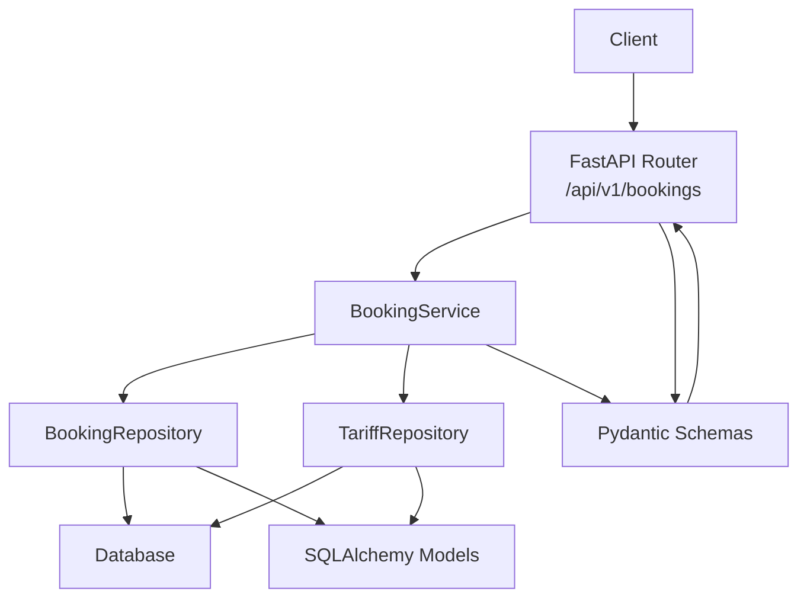
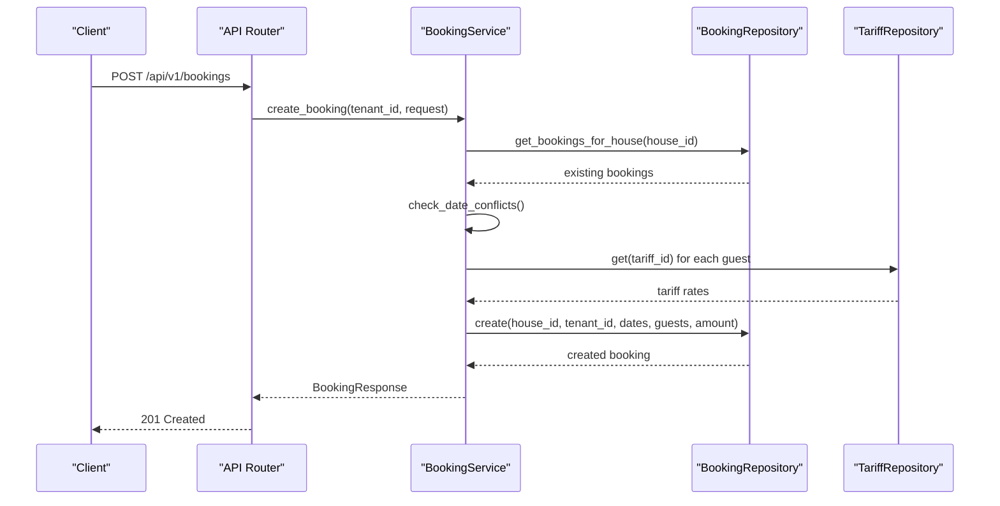
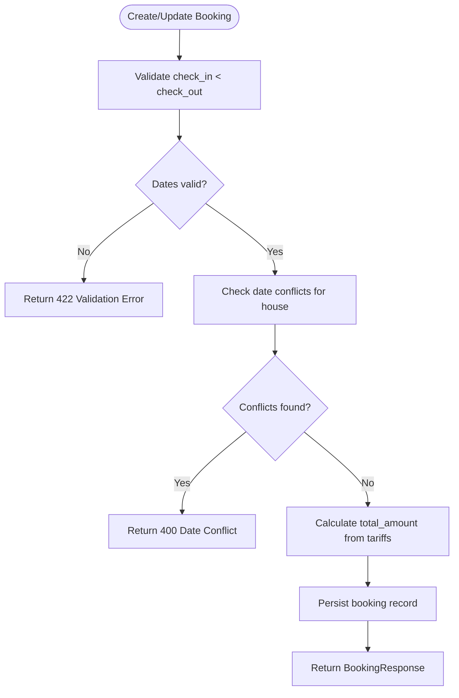
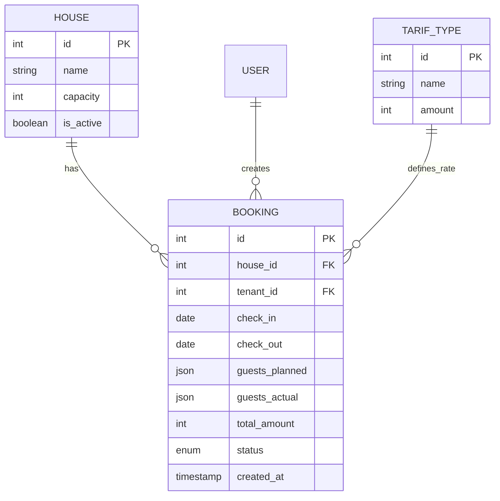
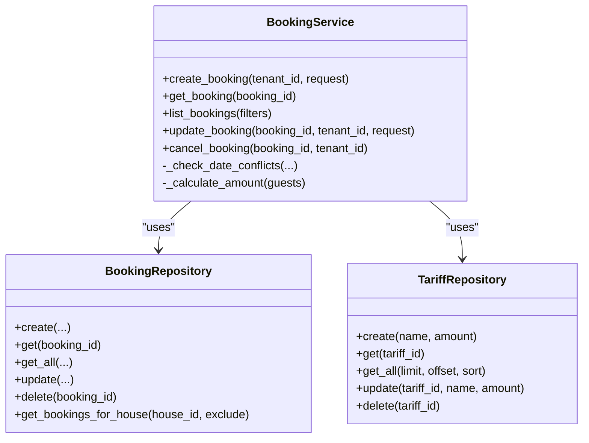

# Booking Management API

<cite>
**Referenced Files in This Document**
- [backend/api/bookings.py](file://backend/api/bookings.py)
- [backend/schemas/booking.py](file://backend/schemas/booking.py)
- [backend/models/booking.py](file://backend/models/booking.py)
- [backend/services/booking.py](file://backend/services/booking.py)
- [backend/repositories/booking.py](file://backend/repositories/booking.py)
- [backend/schemas/common.py](file://backend/schemas/common.py)
- [backend/exceptions.py](file://backend/exceptions.py)
- [backend/main.py](file://backend/main.py)
- [backend/schemas/tariff.py](file://backend/schemas/tariff.py)
- [backend/repositories/tariff.py](file://backend/repositories/tariff.py)
- [docs/tech/api-contracts.md](file://docs/tech/api-contracts.md)
- [docs/data-model.md](file://docs/data-model.md)
- [backend/tests/test_bookings.py](file://backend/tests/test_bookings.py)
</cite>

## Table of Contents
1. [Introduction](#introduction)
2. [Project Structure](#project-structure)
3. [Core Components](#core-components)
4. [Architecture Overview](#architecture-overview)
5. [Detailed Component Analysis](#detailed-component-analysis)
6. [Dependency Analysis](#dependency-analysis)
7. [Performance Considerations](#performance-considerations)
8. [Troubleshooting Guide](#troubleshooting-guide)
9. [Conclusion](#conclusion)
10. [Appendices](#appendices)

## Introduction
This document provides comprehensive API documentation for the booking management endpoints. It covers all booking operations: creating bookings, retrieving booking details, updating booking status, and canceling reservations. It also documents request/response schemas, validation rules, availability checks, conflict detection, error handling, status transitions, and calendar synchronization. Practical examples and test-driven insights are included to guide implementation and integration.

## Project Structure
The booking API is implemented using a layered architecture:
- API layer: FastAPI routes define endpoints and handle routing.
- Service layer: Business logic for validation, conflict detection, and pricing calculation.
- Repository layer: Data access and persistence using SQLAlchemy.
- Schema layer: Pydantic models for request/response validation and serialization.
- Model layer: SQLAlchemy ORM entities.
- Exceptions and error handling: Centralized exception handlers for consistent error responses.

**Diagram sources**
- [backend/api/bookings.py:17-223](file://backend/api/bookings.py#L17-L223)
- [backend/services/booking.py:57-322](file://backend/services/booking.py#L57-L322)
- [backend/repositories/booking.py:13-224](file://backend/repositories/booking.py#L13-L224)
- [backend/repositories/tariff.py:12-151](file://backend/repositories/tariff.py#L12-L151)
- [backend/schemas/booking.py:10-133](file://backend/schemas/booking.py#L10-L133)
- [backend/models/booking.py:20-41](file://backend/models/booking.py#L20-L41)

**Section sources**
- [backend/api/bookings.py:17-223](file://backend/api/bookings.py#L17-L223)
- [backend/services/booking.py:57-322](file://backend/services/booking.py#L57-L322)
- [backend/repositories/booking.py:13-224](file://backend/repositories/booking.py#L13-L224)
- [backend/schemas/booking.py:10-133](file://backend/schemas/booking.py#L10-L133)
- [backend/models/booking.py:20-41](file://backend/models/booking.py#L20-L41)

## Core Components
- Endpoints: List bookings, get booking by ID, create booking, update booking, cancel booking.
- Schemas: BookingResponse, CreateBookingRequest, UpdateBookingRequest, BookingFilterParams, GuestInfo, BookingStatus.
- Service: BookingService orchestrates validation, conflict checks, amount calculation, and status management.
- Repositories: BookingRepository and TariffRepository encapsulate data access.
- Exceptions: Domain-specific exceptions mapped to standardized error responses.

Key capabilities:
- Validation: check_in < check_out, guests list not empty, guest counts ≥ 1.
- Availability: date conflict detection across bookings for the same house.
- Pricing: total_amount computed from tariff rates and guest counts.
- Authorization: tenant-only operations enforced in service layer.
- Status lifecycle: pending → confirmed → completed; cancellations set status to cancelled.

**Section sources**
- [backend/api/bookings.py:20-223](file://backend/api/bookings.py#L20-L223)
- [backend/schemas/booking.py:10-133](file://backend/schemas/booking.py#L10-L133)
- [backend/services/booking.py:78-170](file://backend/services/booking.py#L78-L170)
- [backend/repositories/booking.py:132-224](file://backend/repositories/booking.py#L132-L224)
- [backend/exceptions.py:8-82](file://backend/exceptions.py#L8-L82)

## Architecture Overview
The booking API follows a clean architecture with clear separation of concerns:
- API layer defines routes and responses.
- Service layer enforces business rules and coordinates repositories.
- Repository layer abstracts database operations.
- Schema layer validates inputs and serializes outputs.
- Exception handlers convert domain exceptions to HTTP responses.

**Diagram sources**
- [backend/api/bookings.py:104-126](file://backend/api/bookings.py#L104-L126)
- [backend/services/booking.py:127-170](file://backend/services/booking.py#L127-L170)
- [backend/repositories/booking.py:24-58](file://backend/repositories/booking.py#L24-L58)
- [backend/repositories/tariff.py:43-56](file://backend/repositories/tariff.py#L43-L56)

**Section sources**
- [backend/api/bookings.py:104-126](file://backend/api/bookings.py#L104-L126)
- [backend/services/booking.py:127-170](file://backend/services/booking.py#L127-L170)
- [backend/repositories/booking.py:24-58](file://backend/repositories/booking.py#L24-L58)
- [backend/repositories/tariff.py:43-56](file://backend/repositories/tariff.py#L43-L56)

## Detailed Component Analysis

### Endpoints and Operations
- List bookings: GET /api/v1/bookings with pagination and filtering by user_id, house_id, status, and date ranges.
- Get booking by ID: GET /api/v1/bookings/{id}.
- Create booking: POST /api/v1/bookings with validation and conflict checks.
- Update booking: PATCH /api/v1/bookings/{id} for authorized tenants; supports partial updates of dates, guests, and status.
- Cancel booking: DELETE /api/v1/bookings/{id}; sets status to cancelled.

Authorization note: Tenant enforcement is currently stubbed and will be integrated with authentication in future tasks.

**Section sources**
- [backend/api/bookings.py:20-223](file://backend/api/bookings.py#L20-L223)
- [docs/tech/api-contracts.md:284-427](file://docs/tech/api-contracts.md#L284-L427)

### Request and Response Schemas
- BookingResponse: Includes identifiers, dates, planned/actual guests, total amount, status, and timestamps.
- CreateBookingRequest: Requires house_id, check_in, check_out, and guests list with tariff_id and count.
- UpdateBookingRequest: Optional fields for check_in, check_out, guests, and status.
- BookingFilterParams: Pagination, sorting, and filter fields for listing.
- GuestInfo: Associates tariff_id with guest count.

Validation rules:
- check_in < check_out for both create and update.
- guests list must be non-empty for creation.
- count ≥ 1 for each guest entry.

**Section sources**
- [backend/schemas/booking.py:43-133](file://backend/schemas/booking.py#L43-L133)
- [docs/tech/api-contracts.md:340-402](file://docs/tech/api-contracts.md#L340-L402)

### Business Logic and Pricing
- Conflict detection: Overlap check using interval comparison across existing bookings for the same house.
- Amount calculation: Sum of (tariff.amount × guest.count) for each guest type.
- Status transitions: Updates restricted to pending/confirmed; cancellation disallowed for already cancelled/completed.

**Diagram sources**
- [backend/services/booking.py:78-170](file://backend/services/booking.py#L78-L170)
- [backend/repositories/booking.py:199-224](file://backend/repositories/booking.py#L199-L224)
- [backend/repositories/tariff.py:43-56](file://backend/repositories/tariff.py#L43-L56)

**Section sources**
- [backend/services/booking.py:78-170](file://backend/services/booking.py#L78-L170)
- [backend/repositories/booking.py:199-224](file://backend/repositories/booking.py#L199-L224)
- [backend/repositories/tariff.py:43-56](file://backend/repositories/tariff.py#L43-L56)

### Calendar Synchronization
- The system maintains a house calendar derived from bookings. Occupied periods are represented as check_in to check_out intervals for non-cancelled bookings.
- This enables clients to render availability and detect conflicts before submission.

**Diagram sources**
- [docs/data-model.md:110-118](file://docs/data-model.md#L110-L118)
- [backend/models/booking.py:20-41](file://backend/models/booking.py#L20-L41)

**Section sources**
- [docs/data-model.md:110-118](file://docs/data-model.md#L110-L118)
- [backend/models/booking.py:20-41](file://backend/models/booking.py#L20-L41)

### Error Handling
Standardized ErrorResponse structure with error code, human-readable message, and optional details. Mapped exceptions:
- BookingNotFoundError → 404 Not Found
- DateConflictError → 400 Bad Request
- BookingPermissionError → 403 Forbidden
- InvalidBookingStatusError → 400 Bad Request
- BookingAlreadyCancelledError → 400 Bad Request
- TariffNotFoundError → 404 Not Found

**Section sources**
- [backend/main.py:67-166](file://backend/main.py#L67-L166)
- [backend/schemas/common.py:16-43](file://backend/schemas/common.py#L16-L43)
- [backend/exceptions.py:16-82](file://backend/exceptions.py#L16-L82)

### Practical Workflows

#### Creating a Booking
- Endpoint: POST /api/v1/bookings
- Steps: Validate dates, check conflicts, compute amount, persist booking.
- Expected responses: 201 Created with BookingResponse; 422 for validation errors; 400 for conflicts.

**Section sources**
- [backend/api/bookings.py:104-126](file://backend/api/bookings.py#L104-L126)
- [backend/tests/test_bookings.py:54-175](file://backend/tests/test_bookings.py#L54-L175)

#### Updating a Booking
- Endpoint: PATCH /api/v1/bookings/{id}
- Constraints: Only pending/confirmed bookings; tenant authorization; date validation and conflict checks when dates change; amount recalculated if guests change.
- Expected responses: 200 OK with updated BookingResponse; 404/403/400/422 depending on failure mode.

**Section sources**
- [backend/api/bookings.py:154-177](file://backend/api/bookings.py#L154-L177)
- [backend/tests/test_bookings.py:605-743](file://backend/tests/test_bookings.py#L605-L743)

#### Cancelling a Booking
- Endpoint: DELETE /api/v1/bookings/{id}
- Constraints: Only allowed for pending/confirmed; tenant authorization; cannot cancel already cancelled or completed.
- Expected responses: 200 OK with cancelled BookingResponse; 404/403/400 depending on failure mode.

**Section sources**
- [backend/api/bookings.py:201-222](file://backend/api/bookings.py#L201-L222)
- [backend/tests/test_bookings.py:792-876](file://backend/tests/test_bookings.py#L792-L876)

## Dependency Analysis
The service layer depends on repositories for data access and on tariff repository for pricing. The API router depends on the service layer. Schemas are shared across layers for validation and serialization.

**Diagram sources**
- [backend/services/booking.py:57-322](file://backend/services/booking.py#L57-L322)
- [backend/repositories/booking.py:13-224](file://backend/repositories/booking.py#L13-L224)
- [backend/repositories/tariff.py:12-151](file://backend/repositories/tariff.py#L12-L151)

**Section sources**
- [backend/services/booking.py:57-322](file://backend/services/booking.py#L57-L322)
- [backend/repositories/booking.py:13-224](file://backend/repositories/booking.py#L13-L224)
- [backend/repositories/tariff.py:12-151](file://backend/repositories/tariff.py#L12-L151)

## Performance Considerations
- Conflict detection scans existing bookings for a house; consider indexing check_in/check_out and status fields for improved query performance.
- Amount calculation iterates guest entries; caching tariff rates can reduce repeated lookups.
- Pagination and sorting are supported in listing endpoints; use limit/offset appropriately to avoid large result sets.

## Troubleshooting Guide
Common issues and resolutions:
- Validation errors (422): Ensure check_in < check_out and guests list is non-empty with count ≥ 1.
- Date conflicts (400): Adjust dates to avoid overlaps with existing bookings for the same house.
- Permission denied (403): Verify tenant ownership before attempting updates or cancellations.
- Not found (404): Confirm booking ID exists.
- Already cancelled (400): Cannot cancel an already cancelled booking.
- Completed status (400): Cannot cancel a completed booking.

**Section sources**
- [backend/main.py:67-166](file://backend/main.py#L67-L166)
- [backend/tests/test_bookings.py:79-175](file://backend/tests/test_bookings.py#L79-L175)
- [backend/tests/test_bookings.py:668-743](file://backend/tests/test_bookings.py#L668-L743)
- [backend/tests/test_bookings.py:817-876](file://backend/tests/test_bookings.py#L817-L876)

## Conclusion
The booking management API provides a robust foundation for managing reservations with strong validation, conflict detection, and pricing calculation. The layered architecture ensures maintainability and testability. Future enhancements should focus on integrating authentication for tenant enforcement, adding analytics endpoints, and expanding bulk operations.

## Appendices

### API Reference Summary
- Base URL: /api/v1
- Error format: ErrorResponse with error code, message, and optional details
- Pagination: limit (default 20, max 100), offset, sort (prefix with - for descending)

Endpoints:
- GET /bookings: List with filters and pagination
- GET /bookings/{id}: Retrieve booking details
- POST /bookings: Create booking
- PATCH /bookings/{id}: Update booking
- DELETE /bookings/{id}: Cancel booking

**Section sources**
- [docs/tech/api-contracts.md:64-427](file://docs/tech/api-contracts.md#L64-L427)
- [backend/schemas/common.py:16-43](file://backend/schemas/common.py#L16-L43)