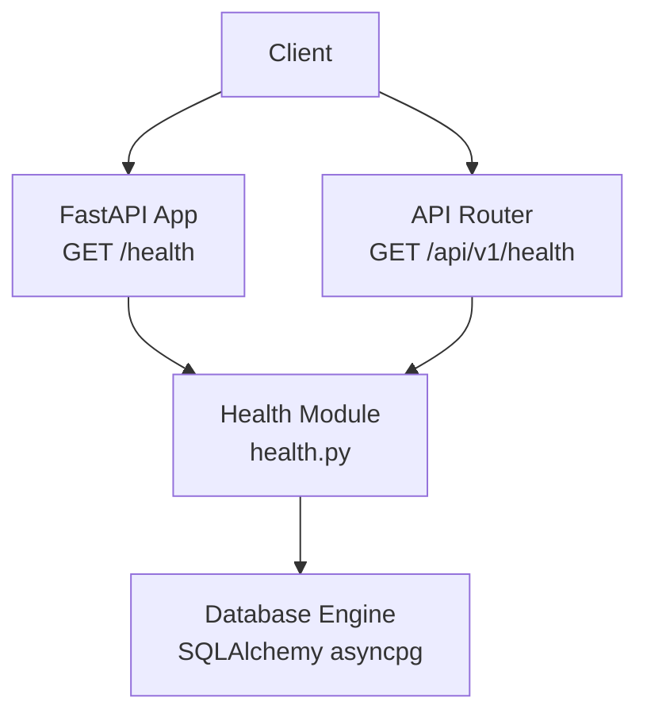
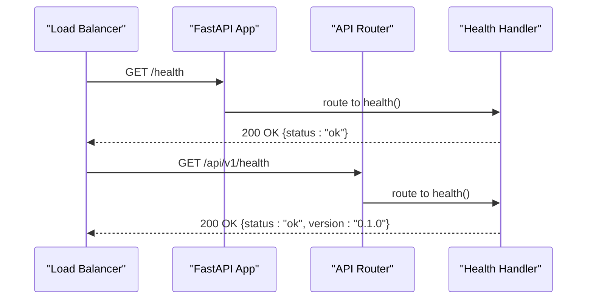
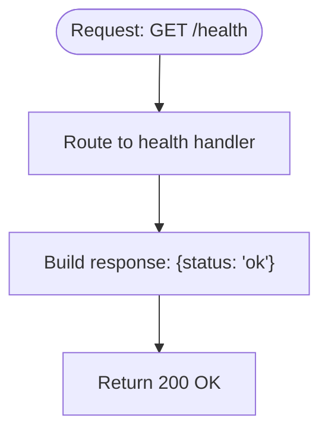
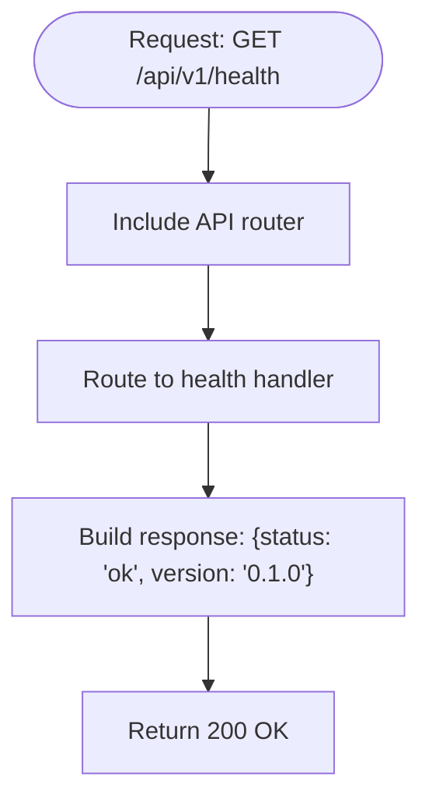
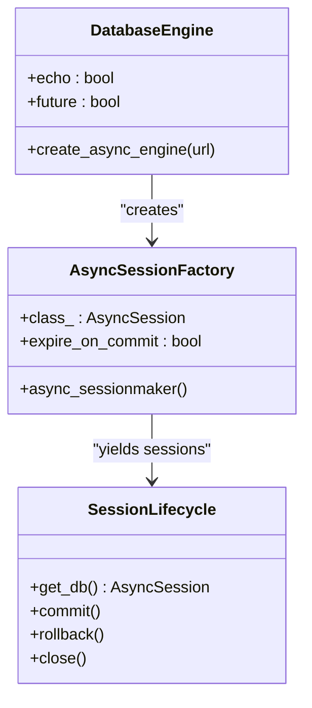
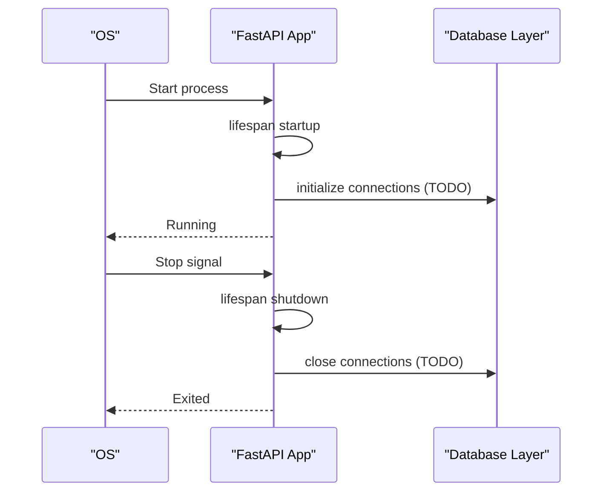
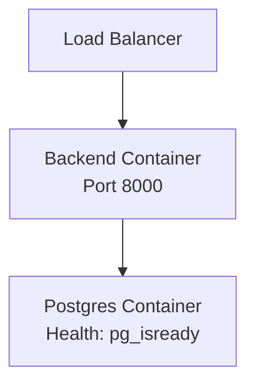
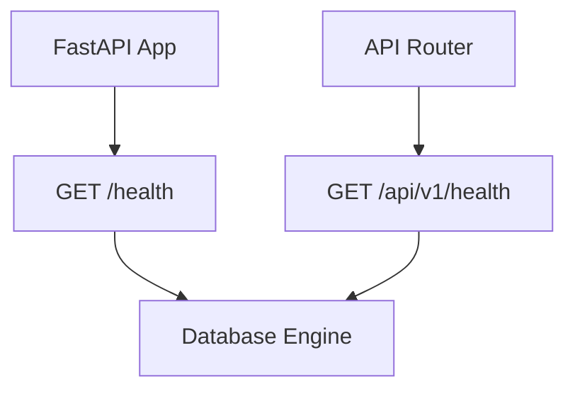

# Health Check and Monitoring API

<cite>
**Referenced Files in This Document**
- [backend/main.py](file://backend/main.py)
- [backend/api/health.py](file://backend/api/health.py)
- [backend/api/__init__.py](file://backend/api/__init__.py)
- [backend/database.py](file://backend/database.py)
- [backend/config.py](file://backend/config.py)
- [backend/tests/test_health.py](file://backend/tests/test_health.py)
- [docker-compose.yaml](file://docker-compose.yaml)
- [Dockerfile.backend](file://Dockerfile.backend)
- [docs/integrations.md](file://docs/integrations.md)
- [docs/tech/api-contracts.md](file://docs/tech/api-contracts.md)
</cite>

## Table of Contents
1. [Introduction](#introduction)
2. [Project Structure](#project-structure)
3. [Core Components](#core-components)
4. [Architecture Overview](#architecture-overview)
5. [Detailed Component Analysis](#detailed-component-analysis)
6. [Dependency Analysis](#dependency-analysis)
7. [Performance Considerations](#performance-considerations)
8. [Troubleshooting Guide](#troubleshooting-guide)
9. [Conclusion](#conclusion)
10. [Appendices](#appendices)

## Introduction
This document provides comprehensive API documentation for the health check and system monitoring endpoints. It covers the health status endpoint that reports system health indicators, database connectivity, and service availability. It also documents response schemas, examples, integration patterns, alerting thresholds, performance metrics collection, diagnostics, load balancing health checks, graceful shutdown procedures, maintenance mode indicators, and troubleshooting guidance.

## Project Structure
The health check endpoints are exposed at two locations:
- Root-level health: GET /health
- API v1 health: GET /api/v1/health

These endpoints are registered in the main application and the API router. The backend uses an async database engine and includes a lifespan manager for startup/shutdown hooks. Container orchestration defines a database health check for readiness.

**Diagram sources**
- [backend/main.py:62-64](file://backend/main.py#L62-L64)
- [backend/api/__init__.py:9-14](file://backend/api/__init__.py#L9-L14)
- [backend/api/health.py:6-8](file://backend/api/health.py#L6-L8)
- [backend/database.py:9-20](file://backend/database.py#L9-L20)

**Section sources**
- [backend/main.py:62-64](file://backend/main.py#L62-L64)
- [backend/api/__init__.py:9-14](file://backend/api/__init__.py#L9-L14)
- [backend/api/health.py:6-8](file://backend/api/health.py#L6-L8)
- [backend/database.py:9-20](file://backend/database.py#L9-L20)

## Core Components
- Health endpoint (root): GET /health returns a minimal health status payload.
- Health endpoint (API v1): GET /api/v1/health returns a health status payload with version metadata.
- Database connectivity: The application initializes an async SQLAlchemy engine and session factory; however, the current health endpoints do not explicitly validate database connectivity.
- Lifespan hooks: Startup and shutdown logs are emitted via the lifespan manager; database connection lifecycle is marked for initialization and cleanup.
- Container health: The database service includes a health check using pg_isready; the backend container exposes port 8000.

Key behaviors:
- Both health endpoints return a success status when reachable.
- The API v1 endpoint additionally includes a version field.
- Tests validate both endpoints’ responses and status codes.

**Section sources**
- [backend/main.py:62-64](file://backend/main.py#L62-L64)
- [backend/api/health.py:6-8](file://backend/api/health.py#L6-L8)
- [backend/tests/test_health.py:10-20](file://backend/tests/test_health.py#L10-L20)
- [backend/database.py:9-20](file://backend/database.py#L9-L20)
- [docker-compose.yaml:10-14](file://docker-compose.yaml#L10-L14)
- [Dockerfile.backend:17](file://Dockerfile.backend#L17)

## Architecture Overview
The health endpoints integrate with the FastAPI application and API router. They are designed to be lightweight and fast, suitable for load balancer and orchestrator health probes. The database layer is configured asynchronously but is not currently queried by the health endpoints.

**Diagram sources**
- [backend/main.py:62-64](file://backend/main.py#L62-L64)
- [backend/api/__init__.py:9-14](file://backend/api/__init__.py#L9-L14)
- [backend/api/health.py:6-8](file://backend/api/health.py#L6-L8)

## Detailed Component Analysis

### Health Endpoint (Root: GET /health)
- Purpose: Lightweight system health probe.
- Response: JSON object containing a status indicator.
- Typical response: {"status": "ok"}.
- HTTP status: 200 on success.
- Notes: Does not validate database connectivity.

**Diagram sources**
- [backend/main.py:62-64](file://backend/main.py#L62-L64)
- [backend/tests/test_health.py:10-13](file://backend/tests/test_health.py#L10-L13)

**Section sources**
- [backend/main.py:62-64](file://backend/main.py#L62-L64)
- [backend/tests/test_health.py:10-13](file://backend/tests/test_health.py#L10-L13)

### Health Endpoint (API v1: GET /api/v1/health)
- Purpose: API-scoped health probe with version metadata.
- Response: JSON object containing a status indicator and version.
- Typical response: {"status": "ok", "version": "0.1.0"}.
- HTTP status: 200 on success.
- Notes: Version aligns with the application’s declared version.

**Diagram sources**
- [backend/api/__init__.py:9-14](file://backend/api/__init__.py#L9-L14)
- [backend/api/health.py:6-8](file://backend/api/health.py#L6-L8)
- [backend/tests/test_health.py:16-20](file://backend/tests/test_health.py#L16-L20)

**Section sources**
- [backend/api/__init__.py:9-14](file://backend/api/__init__.py#L9-L14)
- [backend/api/health.py:6-8](file://backend/api/health.py#L6-L8)
- [backend/tests/test_health.py:16-20](file://backend/tests/test_health.py#L16-L20)

### Database Connectivity and Session Management
- Engine: Asynchronous SQLAlchemy engine configured with asyncpg.
- Session factory: Async session maker with commit/rollback semantics.
- Current health endpoints: Not explicitly validating database connectivity.
- Recommendations: Add a database ping or minimal query in a future enhanced health endpoint.

**Diagram sources**
- [backend/database.py:9-20](file://backend/database.py#L9-L20)
- [backend/database.py:26-40](file://backend/database.py#L26-L40)

**Section sources**
- [backend/database.py:9-20](file://backend/database.py#L9-L20)
- [backend/database.py:26-40](file://backend/database.py#L26-L40)

### Application Lifespan and Graceful Shutdown
- Lifespan events: Startup and shutdown hooks emit informational logs.
- Database lifecycle: Marked for initialization and cleanup in lifespan.
- Practical implication: Use lifespan for resource management during graceful shutdown.

**Diagram sources**
- [backend/main.py:31-38](file://backend/main.py#L31-L38)

**Section sources**
- [backend/main.py:31-38](file://backend/main.py#L31-L38)

### Load Balancing and Container Health Checks
- Backend container: Exposes port 8000.
- Database health: Uses pg_isready for readiness checks.
- Recommendation: Configure load balancers to probe GET /health or GET /api/v1/health.

**Diagram sources**
- [Dockerfile.backend:17](file://Dockerfile.backend#L17)
- [docker-compose.yaml:10-14](file://docker-compose.yaml#L10-L14)

**Section sources**
- [Dockerfile.backend:17](file://Dockerfile.backend#L17)
- [docker-compose.yaml:10-14](file://docker-compose.yaml#L10-L14)

## Dependency Analysis
- Health endpoints depend on the FastAPI application and API router registration.
- Database layer is decoupled from health endpoints but is part of the broader system dependencies.
- External dependencies include PostgreSQL and third-party services referenced in integration documentation.

**Diagram sources**
- [backend/main.py:62-64](file://backend/main.py#L62-L64)
- [backend/api/__init__.py:9-14](file://backend/api/__init__.py#L9-L14)
- [backend/api/health.py:6-8](file://backend/api/health.py#L6-L8)
- [backend/database.py:9-20](file://backend/database.py#L9-L20)

**Section sources**
- [backend/main.py:62-64](file://backend/main.py#L62-L64)
- [backend/api/__init__.py:9-14](file://backend/api/__init__.py#L9-L14)
- [backend/api/health.py:6-8](file://backend/api/health.py#L6-L8)
- [backend/database.py:9-20](file://backend/database.py#L9-L20)

## Performance Considerations
- Keep health endpoints lightweight: avoid heavy computations or external calls.
- Use minimal response payloads to reduce latency and bandwidth.
- For database-dependent health checks, consider caching or periodic checks to avoid impacting production traffic.
- Monitor response times and error rates to detect early degradation.

## Troubleshooting Guide
Common issues and resolutions:
- Endpoint returns non-200:
  - Verify service is running and listening on the expected port.
  - Confirm the correct base URL and path are used.
- Empty or missing version in API v1 health:
  - Ensure the API router is included and the endpoint is registered under /api/v1.
- Database connectivity concerns:
  - Confirm the database service is healthy and reachable.
  - Review container health checks and network configuration.
- Load balancer failures:
  - Ensure the load balancer probes use the correct path and protocol.
  - Validate that the backend container exposes the expected port.

Validation references:
- Root health endpoint behavior and status code expectations.
- API v1 health endpoint behavior, status code, and version field.

**Section sources**
- [backend/tests/test_health.py:10-20](file://backend/tests/test_health.py#L10-L20)
- [docker-compose.yaml:10-14](file://docker-compose.yaml#L10-L14)
- [Dockerfile.backend:17](file://Dockerfile.backend#L17)

## Conclusion
The health check endpoints provide essential system monitoring capabilities with minimal overhead. While they currently report basic status and version information, they serve as a foundation for broader monitoring and alerting. Future enhancements could include database connectivity verification, uptime statistics, dependency health checks, and richer diagnostic information.

## Appendices

### API Definitions
- GET /health
  - Description: Lightweight system health probe.
  - Response: JSON with status indicator.
  - Example response: {"status": "ok"}.
  - Status codes: 200 on success.
- GET /api/v1/health
  - Description: API-scoped health probe with version metadata.
  - Response: JSON with status indicator and version.
  - Example response: {"status": "ok", "version": "0.1.0"}.
  - Status codes: 200 on success.

**Section sources**
- [backend/main.py:62-64](file://backend/main.py#L62-L64)
- [backend/api/health.py:6-8](file://backend/api/health.py#L6-L8)
- [backend/tests/test_health.py:10-20](file://backend/tests/test_health.py#L10-L20)

### Monitoring Integration Patterns
- Load balancer health checks: Probe GET /health or GET /api/v1/health.
- Orchestration readiness: Use container health checks aligned with application readiness.
- Alerting thresholds:
  - Target: 99.9% uptime for health endpoints.
  - Tolerances: Allow brief transient failures during deployments.
  - SLOs: Define acceptable latency and error rate targets.

### Diagnostics and Maintenance Mode Indicators
- Lifespan logs: Use startup and shutdown logs for operational diagnostics.
- Maintenance mode: Implement a flag or header to indicate maintenance; adjust health endpoint behavior accordingly.
- Graceful shutdown: Use lifespan hooks to drain connections and finalize sessions.

**Section sources**
- [backend/main.py:31-38](file://backend/main.py#L31-L38)