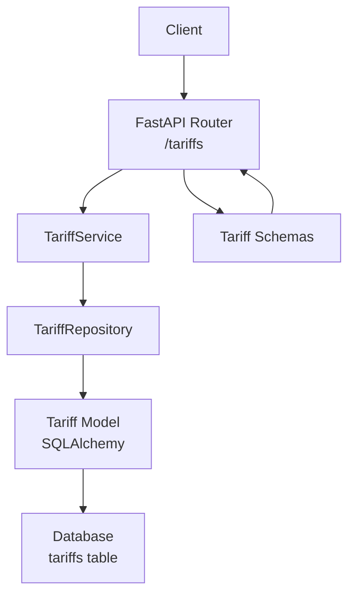
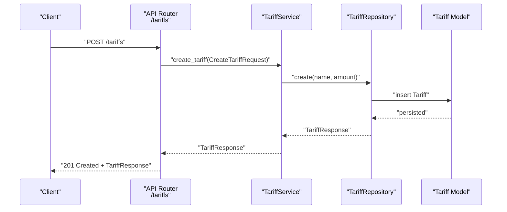
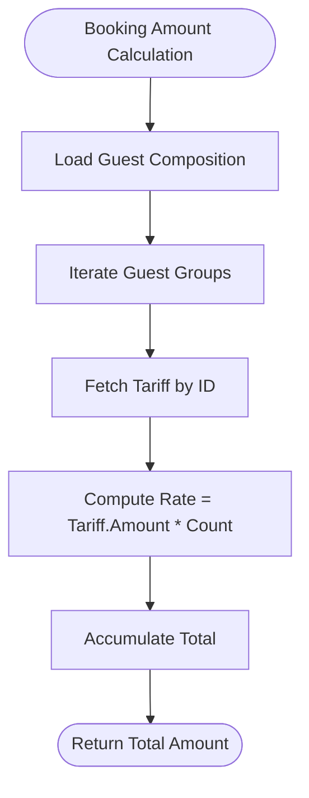
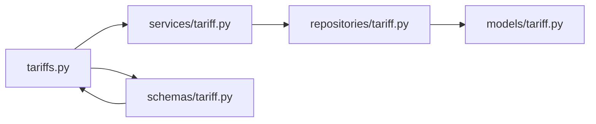

# Pricing and Tariff Management API

<cite>
**Referenced Files in This Document**
- [backend/api/tariffs.py](file://backend/api/tariffs.py)
- [backend/schemas/tariff.py](file://backend/schemas/tariff.py)
- [backend/services/tariff.py](file://backend/services/tariff.py)
- [backend/repositories/tariff.py](file://backend/repositories/tariff.py)
- [backend/models/tariff.py](file://backend/models/tariff.py)
- [backend/exceptions.py](file://backend/exceptions.py)
- [backend/schemas/common.py](file://backend/schemas/common.py)
- [backend/api/__init__.py](file://backend/api/__init__.py)
- [backend/main.py](file://backend/main.py)
- [alembic/versions/2a84cf51810b_initial_migration.py](file://alembic/versions/2a84cf51810b_initial_migration.py)
- [backend/tests/test_tariffs.py](file://backend/tests/test_tariffs.py)
- [backend/schemas/booking.py](file://backend/schemas/booking.py)
- [backend/services/booking.py](file://backend/services/booking.py)
- [backend/models/booking.py](file://backend/models/booking.py)
</cite>

## Table of Contents
1. [Introduction](#introduction)
2. [Project Structure](#project-structure)
3. [Core Components](#core-components)
4. [Architecture Overview](#architecture-overview)
5. [Detailed Component Analysis](#detailed-component-analysis)
6. [Dependency Analysis](#dependency-analysis)
7. [Performance Considerations](#performance-considerations)
8. [Troubleshooting Guide](#troubleshooting-guide)
9. [Conclusion](#conclusion)
10. [Appendices](#appendices)

## Introduction
This document describes the Pricing and Tariff Management API, focusing on tariff CRUD operations and how pricing is calculated in the broader booking system. Tariffs represent guest pricing tiers (for example, adult, child, or regular guest rates). The API supports listing, retrieving, creating, updating, and deleting tariffs. Pricing calculations for bookings are handled by the booking service, which fetches tariff amounts and computes totals based on guest compositions.

## Project Structure
The tariff feature follows a layered architecture:
- API layer: FastAPI routes define endpoints and responses.
- Service layer: Business logic orchestrates operations and validations.
- Repository layer: Database access via SQLAlchemy async ORM.
- Model layer: SQLAlchemy ORM mapped to the tariffs table.
- Schema layer: Pydantic models define request/response contracts.
- Tests: Behavioral tests validate CRUD operations and error handling.

**Diagram sources**
- [backend/api/tariffs.py:15](file://backend/api/tariffs.py#L15)
- [backend/services/tariff.py:32](file://backend/services/tariff.py#L32)
- [backend/repositories/tariff.py:12](file://backend/repositories/tariff.py#L12)
- [backend/models/tariff.py:9](file://backend/models/tariff.py#L9)
- [backend/schemas/tariff.py:9](file://backend/schemas/tariff.py#L9)

**Section sources**
- [backend/api/tariffs.py:15](file://backend/api/tariffs.py#L15)
- [backend/schemas/tariff.py:9](file://backend/schemas/tariff.py#L9)
- [backend/services/tariff.py:32](file://backend/services/tariff.py#L32)
- [backend/repositories/tariff.py:12](file://backend/repositories/tariff.py#L12)
- [backend/models/tariff.py:9](file://backend/models/tariff.py#L9)

## Core Components
- Tariff API endpoints: GET /tariffs, GET /tariffs/{id}, POST /tariffs, PATCH /tariffs/{id}, DELETE /tariffs/{id}.
- Tariff schemas: TariffBase, TariffResponse, CreateTariffRequest, UpdateTariffRequest.
- Tariff service: Implements create, get, list, update, delete with validation and error handling.
- Tariff repository: Performs CRUD operations against the tariffs table.
- Tariff model: SQLAlchemy ORM mapping to the tariffs table.
- Common error response and pagination schemas.

Key capabilities:
- Create pricing tiers with name and amount.
- Retrieve individual or paginated lists of tariffs.
- Partially update tariff attributes.
- Delete tariffs.
- Consistent error responses for not found and validation errors.

**Section sources**
- [backend/api/tariffs.py:18](file://backend/api/tariffs.py#L18)
- [backend/schemas/tariff.py:9](file://backend/schemas/tariff.py#L9)
- [backend/services/tariff.py:49](file://backend/services/tariff.py#L49)
- [backend/repositories/tariff.py:23](file://backend/repositories/tariff.py#L23)
- [backend/models/tariff.py:9](file://backend/models/tariff.py#L9)
- [backend/schemas/common.py:16](file://backend/schemas/common.py#L16)

## Architecture Overview
The tariff API adheres to clean architecture with clear separation of concerns. The API router delegates to the service, which uses the repository to interact with the database. Responses conform to standardized schemas, and exceptions are translated into consistent error responses.

**Diagram sources**
- [backend/api/tariffs.py:101](file://backend/api/tariffs.py#L101)
- [backend/services/tariff.py:49](file://backend/services/tariff.py#L49)
- [backend/repositories/tariff.py:23](file://backend/repositories/tariff.py#L23)
- [backend/models/tariff.py:9](file://backend/models/tariff.py#L9)

## Detailed Component Analysis

### Tariff API Endpoints
- List tariffs: GET /tariffs with pagination and sorting.
- Get tariff by ID: GET /tariffs/{id}.
- Create tariff: POST /tariffs with request body validated by CreateTariffRequest.
- Update tariff: PATCH /tariffs/{id} with partial updates via UpdateTariffRequest.
- Delete tariff: DELETE /tariffs/{id}.

Responses:
- Successful operations return appropriate status codes and TariffResponse.
- Errors return ErrorResponse with consistent structure.

Pagination and sorting:
- Query parameters: limit, offset, sort (prefix with "-" for descending).
- PaginatedResponse wraps items, total, limit, and offset.

**Section sources**
- [backend/api/tariffs.py:18](file://backend/api/tariffs.py#L18)
- [backend/api/tariffs.py:55](file://backend/api/tariffs.py#L55)
- [backend/api/tariffs.py:87](file://backend/api/tariffs.py#L87)
- [backend/api/tariffs.py:120](file://backend/api/tariffs.py#L120)
- [backend/api/tariffs.py:160](file://backend/api/tariffs.py#L160)
- [backend/schemas/common.py:33](file://backend/schemas/common.py#L33)

### Tariff Schemas
- TariffBase: Shared fields name and amount.
- TariffResponse: Extends TariffBase with id and created_at; supports ORM mapping.
- CreateTariffRequest: Inherits TariffBase for creation.
- UpdateTariffRequest: Optional fields name and amount for partial updates.

Validation:
- Name length constraints and amount non-negativity enforced by Pydantic.
- Update allows partial field updates.

**Section sources**
- [backend/schemas/tariff.py:9](file://backend/schemas/tariff.py#L9)
- [backend/schemas/tariff.py:25](file://backend/schemas/tariff.py#L25)
- [backend/schemas/tariff.py:37](file://backend/schemas/tariff.py#L37)
- [backend/schemas/tariff.py:46](file://backend/schemas/tariff.py#L46)

### Tariff Service
Responsibilities:
- Create: Delegates to repository with validated fields.
- Get: Retrieves by ID and raises TariffNotFoundError if missing.
- List: Returns paginated results with total count.
- Update: Validates existence, applies partial updates, and returns updated entity.
- Delete: Validates existence and removes the record.

Error handling:
- Uses TariffNotFoundError for missing resources.

**Section sources**
- [backend/services/tariff.py:49](file://backend/services/tariff.py#L49)
- [backend/services/tariff.py:63](file://backend/services/tariff.py#L63)
- [backend/services/tariff.py:80](file://backend/services/tariff.py#L80)
- [backend/services/tariff.py:102](file://backend/services/tariff.py#L102)
- [backend/services/tariff.py:130](file://backend/services/tariff.py#L130)
- [backend/exceptions.py:76](file://backend/exceptions.py#L76)

### Tariff Repository
Operations:
- Create: Instantiates model, flushes, refreshes, validates to response schema.
- Get: Loads by ID; returns validated response or None.
- Get_all: Counts total, applies sorting, paginates, returns list and total.
- Update: Partially updates name/amount if record exists; refreshes and validates.
- Delete: Removes record if found.

Sorting:
- Supports field names; prefix with "-" for descending order.

**Section sources**
- [backend/repositories/tariff.py:23](file://backend/repositories/tariff.py#L23)
- [backend/repositories/tariff.py:43](file://backend/repositories/tariff.py#L43)
- [backend/repositories/tariff.py:58](file://backend/repositories/tariff.py#L58)
- [backend/repositories/tariff.py:101](file://backend/repositories/tariff.py#L101)
- [backend/repositories/tariff.py:133](file://backend/repositories/tariff.py#L133)

### Tariff Model and Database
- Table: tariffs with columns id, name, amount, created_at.
- Index: id index.
- Model fields mirror schema constraints.

**Section sources**
- [backend/models/tariff.py:9](file://backend/models/tariff.py#L9)
- [alembic/versions/2a84cf51810b_initial_migration.py:23](file://alembic/versions/2a84cf51810b_initial_migration.py#L23)

### Pricing Calculation in Bookings
While not part of the tariff CRUD endpoints, pricing calculations rely on tariffs:
- Booking creation and updates compute total amount by summing tariff.amount multiplied by guest counts for each tariff type.
- The booking service fetches tariff amounts from the tariff repository and aggregates totals.

**Diagram sources**
- [backend/services/booking.py:108](file://backend/services/booking.py#L108)
- [backend/repositories/tariff.py:43](file://backend/repositories/tariff.py#L43)

**Section sources**
- [backend/services/booking.py:108](file://backend/services/booking.py#L108)
- [backend/repositories/tariff.py:43](file://backend/repositories/tariff.py#L43)

## Dependency Analysis
The tariff module depends on schemas, services, repositories, and models. The API router depends on the service, which depends on the repository, which operates on the model.

**Diagram sources**
- [backend/api/tariffs.py:13](file://backend/api/tariffs.py#L13)
- [backend/services/tariff.py:11](file://backend/services/tariff.py#L11)
- [backend/repositories/tariff.py:8](file://backend/repositories/tariff.py#L8)
- [backend/models/tariff.py:3](file://backend/models/tariff.py#L3)
- [backend/schemas/tariff.py:6](file://backend/schemas/tariff.py#L6)

**Section sources**
- [backend/api/__init__.py:7](file://backend/api/__init__.py#L7)
- [backend/api/tariffs.py:15](file://backend/api/tariffs.py#L15)

## Performance Considerations
- Pagination: Use limit and offset to avoid large result sets.
- Sorting: Limit sort fields to indexed columns (id currently indexed).
- Validation: Pydantic validation occurs at the API boundary; keep payloads minimal.
- Bulk updates: Not implemented; consider batch endpoints if needed.

[No sources needed since this section provides general guidance]

## Troubleshooting Guide
Common errors and resolutions:
- 404 Not Found: Occurs when retrieving/updating/deleting a non-existent tariff. The service raises TariffNotFoundError, which the main app converts to ErrorResponse with error code "not_found".
- 422 Unprocessable Entity: Validation failures for name length or amount constraints.
- 500 Internal Server Error: Unexpected exceptions are captured by the global handler and returned as ErrorResponse with error code "internal_error".

Operational tips:
- Verify tariff existence before updates/deletes.
- Ensure name and amount meet schema constraints.
- Use tests as references for expected behavior.

**Section sources**
- [backend/exceptions.py:76](file://backend/exceptions.py#L76)
- [backend/main.py:145](file://backend/main.py#L145)
- [backend/schemas/common.py:16](file://backend/schemas/common.py#L16)
- [backend/tests/test_tariffs.py:42](file://backend/tests/test_tariffs.py#L42)
- [backend/tests/test_tariffs.py:54](file://backend/tests/test_tariffs.py#L54)

## Conclusion
The Pricing and Tariff Management API provides a focused, robust interface for managing pricing tiers. It supports essential CRUD operations with strong validation and consistent error handling. Pricing calculations for bookings integrate seamlessly with tariffs, enabling accurate and flexible rate computations based on guest types and quantities.

[No sources needed since this section summarizes without analyzing specific files]

## Appendices

### API Reference: Tariff Endpoints
- List tariffs
  - Method and Path: GET /api/v1/tariffs
  - Query Parameters: limit, offset, sort
  - Response: PaginatedResponse[TariffResponse]
- Get tariff by ID
  - Method and Path: GET /api/v1/tariffs/{tariff_id}
  - Path Parameters: tariff_id
  - Response: TariffResponse
- Create tariff
  - Method and Path: POST /api/v1/tariffs
  - Request Body: CreateTariffRequest
  - Response: TariffResponse
- Update tariff
  - Method and Path: PATCH /api/v1/tariffs/{tariff_id}
  - Path Parameters: tariff_id
  - Request Body: UpdateTariffRequest
  - Response: TariffResponse
- Delete tariff
  - Method and Path: DELETE /api/v1/tariffs/{tariff_id}
  - Path Parameters: tariff_id
  - Response: No Content (204)

**Section sources**
- [backend/api/tariffs.py:18](file://backend/api/tariffs.py#L18)
- [backend/api/tariffs.py:55](file://backend/api/tariffs.py#L55)
- [backend/api/tariffs.py:87](file://backend/api/tariffs.py#L87)
- [backend/api/tariffs.py:120](file://backend/api/tariffs.py#L120)
- [backend/api/tariffs.py:160](file://backend/api/tariffs.py#L160)

### Request and Response Schemas
- CreateTariffRequest
  - Fields: name (string), amount (integer, ≥0)
- UpdateTariffRequest
  - Fields: name (optional string), amount (optional integer, ≥0)
- TariffResponse
  - Fields: id (integer), name (string), amount (integer), created_at (datetime)

**Section sources**
- [backend/schemas/tariff.py:37](file://backend/schemas/tariff.py#L37)
- [backend/schemas/tariff.py:46](file://backend/schemas/tariff.py#L46)
- [backend/schemas/tariff.py:25](file://backend/schemas/tariff.py#L25)

### Practical Examples
- Create a tariff
  - Endpoint: POST /api/v1/tariffs
  - Example request body: {"name": "Adult", "amount": 250}
  - Expected response: TariffResponse with id, name, amount, created_at
- Update a tariff
  - Endpoint: PATCH /api/v1/tariffs/{tariff_id}
  - Example request body: {"amount": 275}
  - Expected response: Updated TariffResponse
- Retrieve a tariff
  - Endpoint: GET /api/v1/tariffs/{tariff_id}
  - Expected response: TariffResponse
- List tariffs
  - Endpoint: GET /api/v1/tariffs?limit=20&offset=0&sort=id
  - Expected response: PaginatedResponse[TariffResponse]

**Section sources**
- [backend/tests/test_tariffs.py:10](file://backend/tests/test_tariffs.py#L10)
- [backend/tests/test_tariffs.py:179](file://backend/tests/test_tariffs.py#L179)
- [backend/tests/test_tariffs.py:69](file://backend/tests/test_tariffs.py#L69)
- [backend/tests/test_tariffs.py:98](file://backend/tests/test_tariffs.py#L98)

### Pricing Calculation Details
- Tariff-based rates: Each guest group contributes tariff.amount × count to the total.
- Free guests: Tariff with amount 0 yields zero contribution.
- Actual vs planned: Bookings store planned guest composition; total is recalculated upon stay completion.

**Section sources**
- [backend/services/booking.py:108](file://backend/services/booking.py#L108)
- [backend/tests/test_bookings.py:229](file://backend/tests/test_bookings.py#L229)