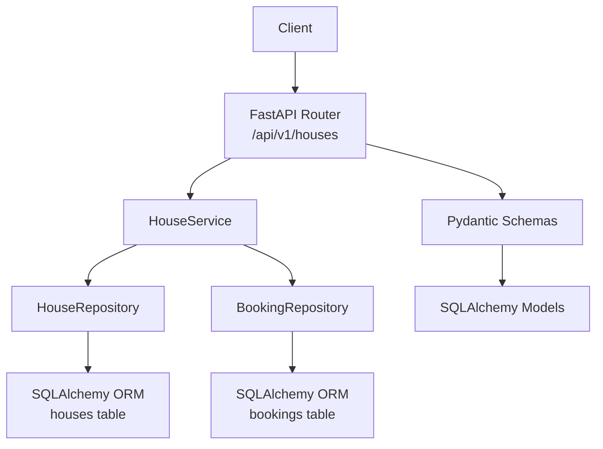
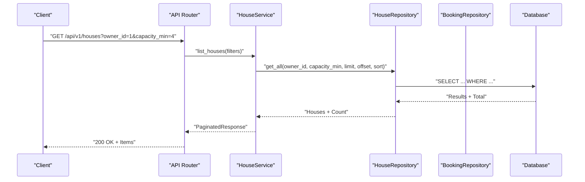
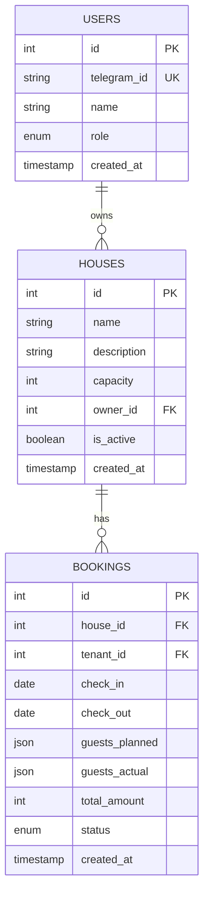
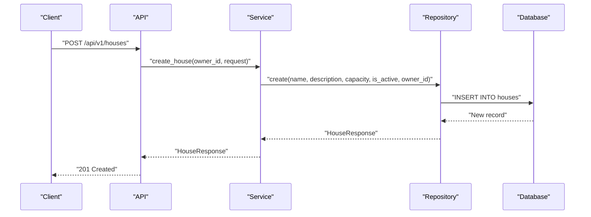
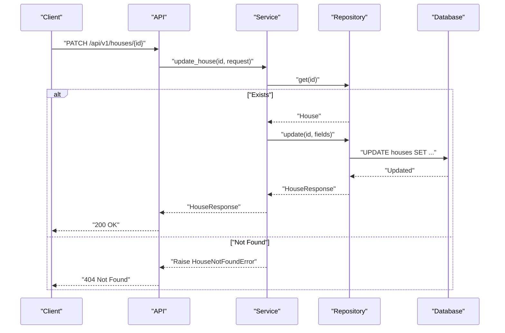
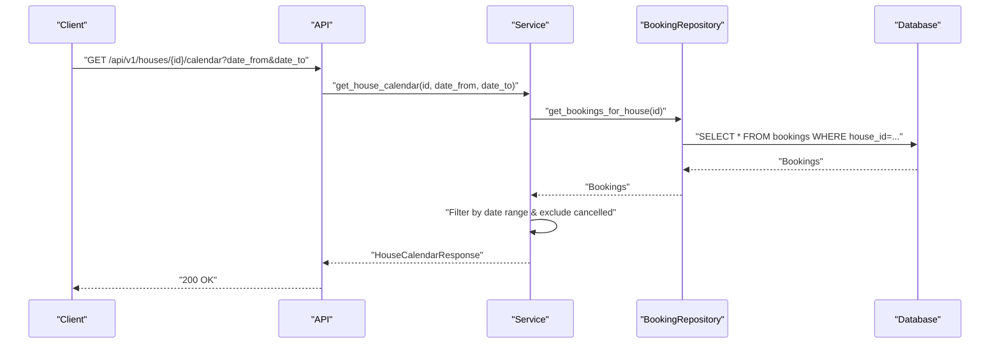
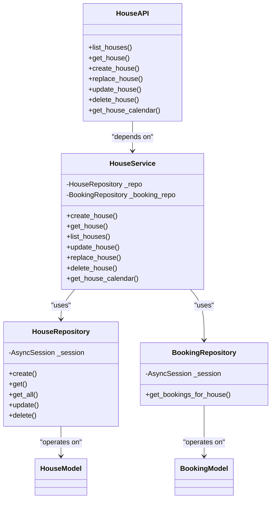

# Property Management API

<cite>
**Referenced Files in This Document**
- [houses.py](file://backend/api/houses.py)
- [house.py](file://backend/schemas/house.py)
- [house.py](file://backend/models/house.py)
- [house.py](file://backend/services/house.py)
- [house.py](file://backend/repositories/house.py)
- [common.py](file://backend/schemas/common.py)
- [exceptions.py](file://backend/exceptions.py)
- [__init__.py](file://backend/api/__init__.py)
- [main.py](file://backend/main.py)
- [2a84cf51810b_initial_migration.py](file://alembic/versions/2a84cf51810b_initial_migration.py)
- [test_houses.py](file://backend/tests/test_houses.py)
</cite>

## Table of Contents
1. [Introduction](#introduction)
2. [Project Structure](#project-structure)
3. [Core Components](#core-components)
4. [Architecture Overview](#architecture-overview)
5. [Detailed Component Analysis](#detailed-component-analysis)
6. [Dependency Analysis](#dependency-analysis)
7. [Performance Considerations](#performance-considerations)
8. [Troubleshooting Guide](#troubleshooting-guide)
9. [Conclusion](#conclusion)
10. [Appendices](#appendices)

## Introduction
This document provides comprehensive API documentation for property management endpoints focused on house CRUD operations. It covers listing properties with filtering, retrieving individual properties, creating new properties, updating property information, deleting properties, and accessing property availability calendars. It also documents request/response schemas, filtering parameters, practical examples, error handling, and integration points with the booking system for availability.

## Project Structure
The property management API is implemented using a layered architecture:
- API layer: FastAPI routes and endpoint definitions
- Service layer: Business logic orchestrating repositories
- Repository layer: Database access using SQLAlchemy async ORM
- Schema layer: Pydantic models for request/response validation
- Model layer: SQLAlchemy ORM models for persistence
- Tests: Behavioral tests validating endpoints and workflows

**Diagram sources**
- [houses.py:18-266](file://backend/api/houses.py#L18-L266)
- [house.py:51-253](file://backend/services/house.py#L51-L253)
- [house.py:12-183](file://backend/repositories/house.py#L12-L183)
- [house.py:9-24](file://backend/models/house.py#L9-L24)
- [2a84cf51810b_initial_migration.py:41-67](file://alembic/versions/2a84cf51810b_initial_migration.py#L41-L67)

**Section sources**
- [houses.py:1-266](file://backend/api/houses.py#L1-L266)
- [house.py:1-253](file://backend/services/house.py#L1-L253)
- [house.py:1-183](file://backend/repositories/house.py#L1-L183)
- [house.py:1-24](file://backend/models/house.py#L1-L24)
- [__init__.py:1-15](file://backend/api/__init__.py#L1-L15)
- [main.py:59-59](file://backend/main.py#L59-L59)

## Core Components
- House API endpoints: Listing, retrieving, creating, replacing, updating, deleting, and calendar retrieval
- House schemas: Base, response, creation, update, filters, and calendar response models
- House service: Implements business logic and coordinates repositories
- House repository: Performs database operations with filtering, pagination, and sorting
- Exception handling: Converts domain exceptions to standardized error responses

Key capabilities:
- Filtering by owner_id, is_active, and capacity range
- Pagination via limit/offset
- Sorting via sort parameter (prefix with "-" for descending)
- Availability calendar generation from bookings

**Section sources**
- [houses.py:21-266](file://backend/api/houses.py#L21-L266)
- [house.py:9-107](file://backend/schemas/house.py#L9-L107)
- [house.py:51-253](file://backend/services/house.py#L51-L253)
- [house.py:68-127](file://backend/repositories/house.py#L68-L127)
- [exceptions.py:60-66](file://backend/exceptions.py#L60-L66)

## Architecture Overview
The property management API follows a clean architecture with clear separation of concerns:
- API layer validates requests and delegates to service layer
- Service layer encapsulates business rules and orchestrates repositories
- Repository layer handles database queries and transformations
- Schema layer ensures strict input/output validation
- Exception handlers convert domain errors to HTTP responses

**Diagram sources**
- [houses.py:30-52](file://backend/api/houses.py#L30-L52)
- [house.py:110-130](file://backend/services/house.py#L110-L130)
- [house.py:68-127](file://backend/repositories/house.py#L68-L127)

**Section sources**
- [houses.py:1-266](file://backend/api/houses.py#L1-L266)
- [house.py:1-253](file://backend/services/house.py#L1-L253)
- [house.py:1-183](file://backend/repositories/house.py#L1-L183)

## Detailed Component Analysis

### API Endpoints

#### List Houses
- Method: GET
- Path: /api/v1/houses
- Query parameters:
  - limit: integer (default 20, min 1, max 100)
  - offset: integer (default 0, min 0)
  - sort: string (field name; prefix with "-" for descending)
  - owner_id: integer (optional)
  - is_active: boolean (optional)
  - capacity_min: integer (optional, ge 1)
  - capacity_max: integer (optional, ge 1)
- Responses:
  - 200: PaginatedResponse[HouseResponse]
  - 404: ErrorResponse (not found)

Implementation highlights:
- Uses HouseFilterParams dependency for validation
- Delegates to HouseService.list_houses
- Returns PaginatedResponse with items, total, limit, offset

**Section sources**
- [houses.py:21-52](file://backend/api/houses.py#L21-L52)
- [house.py:76-94](file://backend/schemas/house.py#L76-L94)
- [house.py:33-43](file://backend/schemas/common.py#L33-L43)

#### Get House by ID
- Method: GET
- Path: /api/v1/houses/{house_id}
- Path parameter: house_id (integer)
- Responses:
  - 200: HouseResponse
  - 404: ErrorResponse

Implementation highlights:
- Validates house existence via HouseService.get_house
- Raises HouseNotFoundError if not found

**Section sources**
- [houses.py:55-84](file://backend/api/houses.py#L55-L84)
- [house.py:93-108](file://backend/services/house.py#L93-L108)
- [exceptions.py:60-66](file://backend/exceptions.py#L60-L66)

#### Create House
- Method: POST
- Path: /api/v1/houses
- Request body: CreateHouseRequest
- Responses:
  - 201: HouseResponse
  - 422: ErrorResponse (validation error)

Implementation highlights:
- Currently hardcodes owner_id to 1 (placeholder)
- Delegates to HouseService.create_house
- Validation handled by CreateHouseRequest schema

**Section sources**
- [houses.py:87-119](file://backend/api/houses.py#L87-L119)
- [house.py:47-53](file://backend/schemas/house.py#L47-L53)
- [house.py:71-91](file://backend/services/house.py#L71-L91)

#### Replace House (Full Update)
- Method: PUT
- Path: /api/v1/houses/{house_id}
- Path parameter: house_id (integer)
- Request body: CreateHouseRequest
- Responses:
  - 200: HouseResponse
  - 404: ErrorResponse
  - 422: ErrorResponse

Implementation highlights:
- Full replacement semantics
- Validates existence before update
- Uses CreateHouseRequest for validation

**Section sources**
- [houses.py:122-157](file://backend/api/houses.py#L122-L157)
- [house.py:162-190](file://backend/services/house.py#L162-L190)
- [exceptions.py:60-66](file://backend/exceptions.py#L60-L66)

#### Update House (Partial Update)
- Method: PATCH
- Path: /api/v1/houses/{house_id}
- Path parameter: house_id (integer)
- Request body: UpdateHouseRequest
- Responses:
  - 200: HouseResponse
  - 404: ErrorResponse
  - 422: ErrorResponse

Implementation highlights:
- Partial update semantics
- Only provided fields are updated
- Validates existence before update

**Section sources**
- [houses.py:160-197](file://backend/api/houses.py#L160-L197)
- [house.py:56-66](file://backend/schemas/house.py#L56-L66)
- [house.py:132-160](file://backend/services/house.py#L132-L160)
- [exceptions.py:60-66](file://backend/exceptions.py#L60-L66)

#### Delete House
- Method: DELETE
- Path: /api/v1/houses/{house_id}
- Path parameter: house_id (integer)
- Responses:
  - 204: No Content
  - 404: ErrorResponse

Implementation highlights:
- Validates existence before deletion
- Returns 204 on successful deletion

**Section sources**
- [houses.py:200-226](file://backend/api/houses.py#L200-L226)
- [house.py:192-205](file://backend/services/house.py#L192-L205)
- [exceptions.py:60-66](file://backend/exceptions.py#L60-L66)

#### Get House Calendar
- Method: GET
- Path: /api/v1/houses/{house_id}/calendar
- Path parameter: house_id (integer)
- Query parameters:
  - date_from: date (optional)
  - date_to: date (optional)
- Responses:
  - 200: HouseCalendarResponse
  - 404: ErrorResponse

Implementation highlights:
- Aggregates occupied date ranges from bookings
- Excludes cancelled bookings
- Optionally filters by date range

**Section sources**
- [houses.py:229-265](file://backend/api/houses.py#L229-L265)
- [house.py:207-252](file://backend/services/house.py#L207-L252)
- [house.py:68-74](file://backend/schemas/house.py#L68-L74)

### Request/Response Schemas

#### HouseBase
- name: string (required, length 1-100)
- description: string (optional, length up to 1000)
- capacity: integer (required, ge 1)
- is_active: boolean (default true)

#### HouseResponse
- Extends HouseBase
- id: integer (required)
- owner_id: integer (required)
- created_at: datetime (required)

#### CreateHouseRequest
- Extends HouseBase
- Used for property creation

#### UpdateHouseRequest
- All fields optional
- Allows partial updates

#### HouseFilterParams
- limit: integer (1-100)
- offset: integer (ge 0)
- sort: string (optional)
- owner_id: integer (optional)
- is_active: boolean (optional)
- capacity_min: integer (ge 1, optional)
- capacity_max: integer (ge 1, optional)

#### HouseCalendarResponse
- house_id: integer
- occupied_dates: array of OccupiedDateRange
  - check_in: date
  - check_out: date
  - booking_id: integer

#### OccupiedDateRange
- Represents a continuous occupied period

#### PaginatedResponse
- items: array of T
- total: integer (ge 0)
- limit: integer (ge 1)
- offset: integer (ge 0)

#### ErrorResponse
- error: string
- message: string
- details: array of ValidationErrorDetail (optional)
  - field: string (optional)
  - msg: string
  - type: string (optional)

**Section sources**
- [house.py:9-107](file://backend/schemas/house.py#L9-L107)
- [common.py:8-43](file://backend/schemas/common.py#L8-L43)

### Data Models

**Diagram sources**
- [2a84cf51810b_initial_migration.py:41-67](file://alembic/versions/2a84cf51810b_initial_migration.py#L41-L67)

**Section sources**
- [house.py:9-24](file://backend/models/house.py#L9-L24)
- [2a84cf51810b_initial_migration.py:41-67](file://alembic/versions/2a84cf51810b_initial_migration.py#L41-L67)

### Processing Logic

#### House Creation Flow

**Diagram sources**
- [houses.py:101-119](file://backend/api/houses.py#L101-L119)
- [house.py:71-91](file://backend/services/house.py#L71-L91)
- [house.py:23-53](file://backend/repositories/house.py#L23-L53)

#### House Update Flow

**Diagram sources**
- [houses.py:177-197](file://backend/api/houses.py#L177-L197)
- [house.py:132-160](file://backend/services/house.py#L132-L160)
- [house.py:129-165](file://backend/repositories/house.py#L129-L165)

#### Calendar Generation Flow

**Diagram sources**
- [houses.py:242-265](file://backend/api/houses.py#L242-L265)
- [house.py:207-252](file://backend/services/house.py#L207-L252)

### Practical Examples

#### Create a House
- Endpoint: POST /api/v1/houses
- Request body:
  - name: "Старый дом"
  - description: "Уютный дом у озера"
  - capacity: 6
  - is_active: true
  - owner_id: 1
- Expected response: 201 Created with HouseResponse

#### Update a House (Partial)
- Endpoint: PATCH /api/v1/houses/{house_id}
- Request body:
  - name: "Новое название"
- Expected response: 200 OK with updated HouseResponse

#### List Houses with Filtering
- Endpoint: GET /api/v1/houses?owner_id=1&capacity_min=4&limit=20&offset=0&sort=-created_at
- Expected response: 200 OK with PaginatedResponse[HouseResponse]

#### Get House Calendar
- Endpoint: GET /api/v1/houses/{house_id}/calendar?date_from=YYYY-MM-DD&date_to=YYYY-MM-DD
- Expected response: 200 OK with HouseCalendarResponse containing occupied date ranges

**Section sources**
- [test_houses.py:24-43](file://backend/tests/test_houses.py#L24-L43)
- [test_houses.py:389-429](file://backend/tests/test_houses.py#L389-L429)
- [test_houses.py:146-184](file://backend/tests/test_houses.py#L146-L184)
- [test_houses.py:567-760](file://backend/tests/test_houses.py#L567-L760)

## Dependency Analysis

**Diagram sources**
- [houses.py:18-266](file://backend/api/houses.py#L18-L266)
- [house.py:51-253](file://backend/services/house.py#L51-L253)
- [house.py:12-183](file://backend/repositories/house.py#L12-L183)

**Section sources**
- [houses.py:1-266](file://backend/api/houses.py#L1-L266)
- [house.py:1-253](file://backend/services/house.py#L1-L253)
- [house.py:1-183](file://backend/repositories/house.py#L1-L183)

## Performance Considerations
- Pagination: Use limit and offset to control payload size
- Sorting: Limit sort fields to indexed columns (id, created_at)
- Filtering: Combine capacity_min/capacity_max for efficient range queries
- Calendar queries: Consider indexing bookings by house_id and date ranges
- Validation: Leverage Pydantic schemas to reduce runtime checks

## Troubleshooting Guide

### Common HTTP Status Codes
- 200 OK: Successful GET, PATCH, PUT
- 201 Created: Successful POST
- 204 No Content: Successful DELETE
- 404 Not Found: Entity not found
- 422 Unprocessable Entity: Validation error
- 500 Internal Server Error: Unexpected error

### Error Response Format
All errors use ErrorResponse:
- error: machine-readable error code
- message: human-readable description
- details: optional array of validation error details

### Domain-Specific Errors
- HouseNotFoundError: Raised when house does not exist
- ValidationErrorDetail: Provides field-level validation details

### Validation Rules
- name: required, length 1-100
- description: optional, length up to 1000
- capacity: required, integer ≥ 1
- is_active: boolean, defaults to true
- limit: integer 1-100
- offset: integer ≥ 0
- capacity_min/capacity_max: integers ≥ 1

**Section sources**
- [main.py:123-131](file://backend/main.py#L123-L131)
- [common.py:16-27](file://backend/schemas/common.py#L16-L27)
- [exceptions.py:60-66](file://backend/exceptions.py#L60-L66)
- [house.py:12-27](file://backend/schemas/house.py#L12-L27)
- [house.py:82-94](file://backend/schemas/house.py#L82-L94)

## Conclusion
The property management API provides a robust foundation for house CRUD operations with comprehensive filtering, pagination, sorting, and availability calendar integration. The layered architecture ensures maintainability, while strict schema validation and standardized error handling improve reliability and developer experience.

## Appendices

### API Reference Summary
- Base URL: /api/v1
- Authentication: Not implemented in current code
- Content-Type: application/json
- Error Format: ErrorResponse

### Filtering Parameters
- owner_id: Filter by property owner
- is_active: Filter by activation status
- capacity_min/capacity_max: Guest capacity range
- limit/offset: Pagination control
- sort: Field-based sorting (prefix with "-" for descending)

### Calendar Usage Notes
- Calendar excludes cancelled bookings
- Optional date range filtering
- Occupied date ranges represent continuous blocks