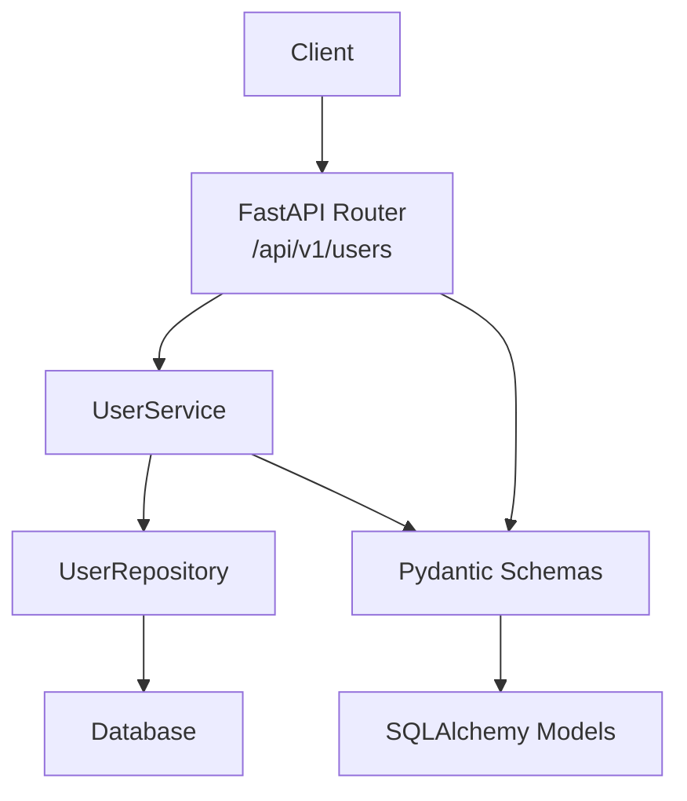
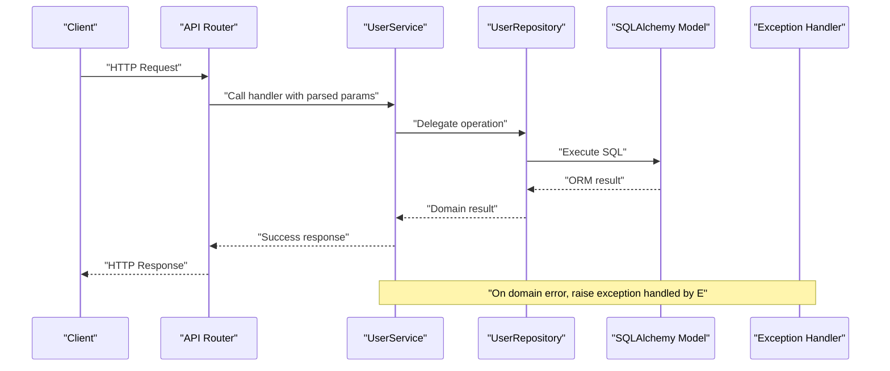

# User Management API

<cite>
**Referenced Files in This Document**
- [users.py](file://backend/api/users.py)
- [user.py](file://backend/schemas/user.py)
- [common.py](file://backend/schemas/common.py)
- [user.py](file://backend/models/user.py)
- [user.py](file://backend/repositories/user.py)
- [user.py](file://backend/services/user.py)
- [exceptions.py](file://backend/exceptions.py)
- [main.py](file://backend/main.py)
- [__init__.py](file://backend/api/__init__.py)
- [test_users.py](file://backend/tests/test_users.py)
</cite>

## Table of Contents
1. [Introduction](#introduction)
2. [Project Structure](#project-structure)
3. [Core Components](#core-components)
4. [Architecture Overview](#architecture-overview)
5. [Detailed Component Analysis](#detailed-component-analysis)
6. [Dependency Analysis](#dependency-analysis)
7. [Performance Considerations](#performance-considerations)
8. [Troubleshooting Guide](#troubleshooting-guide)
9. [Conclusion](#conclusion)

## Introduction
This document provides comprehensive API documentation for the user management endpoints. It covers all CRUD operations for users, including listing with filtering, retrieving individual users, creating users, full updates, partial updates, and deletion. It also documents request/response schemas, parameter descriptions, validation rules, filtering and pagination support, sorting options, error handling, HTTP status codes, and practical examples derived from the test suite.

## Project Structure
The user management API is implemented using a layered architecture:
- API Layer: FastAPI routes define endpoints under /api/v1/users.
- Service Layer: Business logic orchestrates operations and validates requests.
- Repository Layer: Database access abstraction using SQLAlchemy async sessions.
- Model Layer: SQLAlchemy ORM models for persistence.
- Schema Layer: Pydantic models for request/response validation and serialization.
- Exception Layer: Domain-specific exceptions mapped to standardized error responses.



**Diagram sources**
- [users.py:16-223](file://backend/api/users.py#L16-L223)
- [user.py:33-183](file://backend/services/user.py#L33-L183)
- [user.py:12-168](file://backend/repositories/user.py#L12-L168)
- [user.py:19-32](file://backend/models/user.py#L19-L32)
- [user.py:18-72](file://backend/schemas/user.py#L18-L72)

**Section sources**
- [users.py:1-223](file://backend/api/users.py#L1-L223)
- [__init__.py:1-15](file://backend/api/__init__.py#L1-L15)

## Core Components
- Endpoint Router: Defines all user endpoints under /api/v1/users.
- Schemas:
  - User roles enumeration.
  - Base user schema with common fields.
  - Response schema for user data.
  - Request schemas for creation and updates.
  - Filter parameters for list endpoint.
- Service: Implements business logic and coordinates repository operations.
- Repository: Encapsulates database queries and updates.
- Model: SQLAlchemy ORM representation of the users table.
- Exceptions: Domain-specific exceptions mapped to HTTP responses.

**Section sources**
- [user.py:10-72](file://backend/schemas/user.py#L10-L72)
- [user.py:11-32](file://backend/models/user.py#L11-L32)
- [user.py:33-183](file://backend/services/user.py#L33-L183)
- [user.py:12-168](file://backend/repositories/user.py#L12-L168)
- [exceptions.py:68-74](file://backend/exceptions.py#L68-L74)

## Architecture Overview
The user API follows a clean architecture with clear separation of concerns:
- API layer handles routing and response modeling.
- Service layer enforces business rules and validation.
- Repository layer abstracts database operations.
- Schema layer ensures strict input/output validation.
- Exception handlers convert domain exceptions to standardized error responses.



**Diagram sources**
- [users.py:19-223](file://backend/api/users.py#L19-L223)
- [user.py:50-183](file://backend/services/user.py#L50-L183)
- [user.py:23-168](file://backend/repositories/user.py#L23-L168)
- [exceptions.py:68-74](file://backend/exceptions.py#L68-L74)
- [main.py:134-142](file://backend/main.py#L134-L142)

## Detailed Component Analysis

### Endpoint Definitions and Behavior

#### GET /api/v1/users
- Purpose: List users with optional filtering, pagination, and sorting.
- Query Parameters:
  - limit: integer, default 20, min 1, max 100. Controls page size.
  - offset: integer, default 0, min 0. Controls pagination offset.
  - sort: string, optional. Sort field name; prefix with "-" for descending.
  - role: enum, optional. Filter by user role (tenant, owner, both).
- Responses:
  - 200 OK: PaginatedResponse containing items, total, limit, offset.
  - 422 Unprocessable Entity: Validation error for invalid parameters.
- Behavior:
  - Applies role filter if provided.
  - Calculates total count before applying pagination.
  - Supports sorting by any model field; prefix with "-" for descending.

Example request:
- GET /api/v1/users?role=tenant&limit=20&offset=0&sort=-created_at

Example response:
- {
  "items": [
    {"id": 1, "telegram_id": "123456789", "name": "Иван Петров", "role": "tenant", "created_at": "2024-01-01T10:00:00Z"}
  ],
  "total": 1,
  "limit": 20,
  "offset": 0
}

**Section sources**
- [users.py:19-50](file://backend/api/users.py#L19-L50)
- [user.py:57-72](file://backend/schemas/user.py#L57-L72)
- [user.py:73-120](file://backend/repositories/user.py#L73-L120)

#### GET /api/v1/users/{id}
- Purpose: Retrieve a user by numeric ID.
- Path Parameters:
  - id: integer, required. User identifier.
- Responses:
  - 200 OK: UserResponse with user details.
  - 404 Not Found: Standard error response when user does not exist.
- Behavior:
  - Returns full user details including generated fields.

Example request:
- GET /api/v1/users/1

Example response:
- {
  "id": 1,
  "telegram_id": "123456789",
  "name": "Иван Петров",
  "role": "tenant",
  "created_at": "2024-01-01T10:00:00Z"
}

**Section sources**
- [users.py:53-82](file://backend/api/users.py#L53-L82)
- [user.py:65-80](file://backend/services/user.py#L65-L80)
- [exceptions.py:68-74](file://backend/exceptions.py#L68-L74)

#### POST /api/v1/users
- Purpose: Create a new user (typically from Telegram bot).
- Request Body: CreateUserRequest
  - telegram_id: string, required, min length 1. Unique identifier for bot login.
  - name: string, required, min length 1, max length 100. Display name.
  - role: enum, optional, default tenant. User role (tenant, owner, both).
- Responses:
  - 201 Created: UserResponse with created user details.
  - 422 Unprocessable Entity: Validation error for invalid input.
- Behavior:
  - Creates user with provided or default role.
  - Returns created user with generated fields.

Example request:
- POST /api/v1/users
- Body: {"telegram_id": "123456789", "name": "Иван Петров", "role": "tenant"}

Example response:
- {
  "id": 1,
  "telegram_id": "123456789",
  "name": "Иван Петров",
  "role": "tenant",
  "created_at": "2024-01-01T10:00:00Z"
}

**Section sources**
- [users.py:85-115](file://backend/api/users.py#L85-L115)
- [user.py:38-45](file://backend/schemas/user.py#L38-L45)
- [user.py:50-63](file://backend/services/user.py#L50-L63)

#### PUT /api/v1/users/{id}
- Purpose: Replace all user profile information (full update).
- Path Parameters:
  - id: integer, required. User identifier.
- Request Body: CreateUserRequest (all fields required for replacement).
  - telegram_id: string, required, min length 1.
  - name: string, required, min length 1, max length 100.
  - role: enum, required. User role (tenant, owner, both).
- Responses:
  - 200 OK: UserResponse with updated user details.
  - 404 Not Found: Standard error response when user does not exist.
  - 422 Unprocessable Entity: Validation error for invalid input.
- Behavior:
  - Replaces all user fields with provided values.
  - Requires complete payload for replacement semantics.

Example request:
- PUT /api/v1/users/1
- Body: {"telegram_id": "new_id", "name": "Новое имя", "role": "owner"}

Example response:
- {
  "id": 1,
  "telegram_id": "new_id",
  "name": "Новое имя",
  "role": "owner",
  "created_at": "2024-01-01T10:00:00Z"
}

**Section sources**
- [users.py:118-153](file://backend/api/users.py#L118-L153)
- [user.py:140-167](file://backend/services/user.py#L140-L167)

#### PATCH /api/v1/users/{id}
- Purpose: Update user profile (partial update).
- Path Parameters:
  - id: integer, required. User identifier.
- Request Body: UpdateUserRequest (only provided fields are updated).
  - name: string, optional, min length 1, max length 100.
  - role: enum, optional. User role (tenant, owner, both).
- Responses:
  - 200 OK: UserResponse with updated user details.
  - 404 Not Found: Standard error response when user does not exist.
  - 422 Unprocessable Entity: Validation error for invalid input.
- Behavior:
  - Updates only provided fields; others remain unchanged.
  - Supports partial updates for flexible editing.

Example request:
- PATCH /api/v1/users/1
- Body: {"name": "Частично обновленное имя"}

Example response:
- {
  "id": 1,
  "telegram_id": "new_id",
  "name": "Частично обновленное имя",
  "role": "owner",
  "created_at": "2024-01-01T10:00:00Z"
}

**Section sources**
- [users.py:156-193](file://backend/api/users.py#L156-L193)
- [user.py:47-55](file://backend/schemas/user.py#L47-L55)
- [user.py:112-138](file://backend/services/user.py#L112-L138)

#### DELETE /api/v1/users/{id}
- Purpose: Delete a user account.
- Path Parameters:
  - id: integer, required. User identifier.
- Responses:
  - 204 No Content: Successful deletion.
  - 404 Not Found: Standard error response when user does not exist.
- Behavior:
  - Removes user from database.
  - Returns no content on success.

Example request:
- DELETE /api/v1/users/1

Example response:
- 204 No Content

**Section sources**
- [users.py:196-222](file://backend/api/users.py#L196-L222)
- [user.py:169-182](file://backend/services/user.py#L169-L182)

### Request/Response Schemas

#### User Role Enumeration
- Values: tenant, owner, both.
- Default: tenant for creation.

**Section sources**
- [user.py:10-16](file://backend/schemas/user.py#L10-L16)
- [user.py:11-16](file://backend/models/user.py#L11-L16)

#### UserResponse
- Fields:
  - id: integer. Unique user identifier.
  - telegram_id: string or null. Telegram ID for bot login.
  - name: string. Display name.
  - role: enum. User role.
  - created_at: datetime. Registration timestamp.

**Section sources**
- [user.py:25-36](file://backend/schemas/user.py#L25-L36)

#### CreateUserRequest
- Fields:
  - telegram_id: string, required. Telegram ID.
  - name: string, required. Display name.
  - role: enum, optional. User role.

**Section sources**
- [user.py:38-45](file://backend/schemas/user.py#L38-L45)

#### UpdateUserRequest
- Fields:
  - name: string, optional. Display name.
  - role: enum, optional. User role.

**Section sources**
- [user.py:47-55](file://backend/schemas/user.py#L47-L55)

#### UserFilterParams
- Fields:
  - limit: integer, default 20, min 1, max 100.
  - offset: integer, default 0, min 0.
  - sort: string, optional. Sort field; prefix with "-" for descending.
  - role: enum, optional. Filter by role.

**Section sources**
- [user.py:57-72](file://backend/schemas/user.py#L57-L72)

#### PaginatedResponse
- Fields:
  - items: array. List of items for current page.
  - total: integer. Total number of items.
  - limit: integer. Items per page.
  - offset: integer. Number of items skipped.

**Section sources**
- [common.py:33-43](file://backend/schemas/common.py#L33-L43)

#### ErrorResponse
- Fields:
  - error: string. Error code (e.g., not_found).
  - message: string. Human-readable error message.
  - details: array or null. Detailed validation errors if applicable.

**Section sources**
- [common.py:16-27](file://backend/schemas/common.py#L16-L27)

### Filtering, Pagination, and Sorting
- Filtering:
  - role: Filters users by role (tenant, owner, both).
- Pagination:
  - limit: Controls page size (default 20, min 1, max 100).
  - offset: Controls pagination offset (default 0).
- Sorting:
  - sort: Sort field name; prefix with "-" for descending order.
  - Supports any model field (e.g., created_at, name).

Implementation details:
- Repository applies filters, calculates total count, applies sorting, and then pagination.
- Sorting logic checks for "-" prefix and reverses direction accordingly.

**Section sources**
- [user.py:73-120](file://backend/repositories/user.py#L73-L120)
- [user.py:57-72](file://backend/schemas/user.py#L57-L72)

### Error Handling and Status Codes
- 200 OK: Successful GET/PATCH/PUT requests.
- 201 Created: Successful POST request.
- 204 No Content: Successful DELETE request.
- 404 Not Found: Resource not found (GET/PATCH/PUT/DELETE).
- 422 Unprocessable Entity: Validation errors (POST/PUT/PATCH).
- 500 Internal Server Error: Unexpected errors (global handler).

Error response format:
- Standardized ErrorResponse with error code, message, and optional details.

Exception mapping:
- UserNotFoundError mapped to 404 Not Found.

**Section sources**
- [users.py:24-26](file://backend/api/users.py#L24-L26)
- [users.py:58-64](file://backend/api/users.py#L58-L64)
- [users.py:91-97](file://backend/api/users.py#L91-L97)
- [users.py:123-133](file://backend/api/users.py#L123-L133)
- [users.py:161-171](file://backend/api/users.py#L161-L171)
- [users.py:199-207](file://backend/api/users.py#L199-L207)
- [main.py:134-142](file://backend/main.py#L134-L142)
- [common.py:16-27](file://backend/schemas/common.py#L16-L27)

### Practical Examples
Examples are derived from the test suite and demonstrate typical usage patterns.

- Create User
  - Request: POST /api/v1/users with JSON body containing telegram_id, name, and optional role.
  - Response: 201 Created with UserResponse.

- Get User
  - Request: GET /api/v1/users/{id}.
  - Response: 200 OK with UserResponse.

- List Users with Filtering and Pagination
  - Request: GET /api/v1/users?role=tenant&limit=20&offset=0&sort=-created_at.
  - Response: 200 OK with PaginatedResponse.

- Partial Update User
  - Request: PATCH /api/v1/users/{id} with JSON body containing fields to update.
  - Response: 200 OK with updated UserResponse.

- Full Replace User
  - Request: PUT /api/v1/users/{id} with complete payload.
  - Response: 200 OK with replaced UserResponse.

- Delete User
  - Request: DELETE /api/v1/users/{id}.
  - Response: 204 No Content.

**Section sources**
- [test_users.py:10-93](file://backend/tests/test_users.py#L10-L93)
- [test_users.py:98-124](file://backend/tests/test_users.py#L98-L124)
- [test_users.py:129-237](file://backend/tests/test_users.py#L129-L237)
- [test_users.py:242-314](file://backend/tests/test_users.py#L242-L314)
- [test_users.py:319-358](file://backend/tests/test_users.py#L319-L358)
- [test_users.py:363-386](file://backend/tests/test_users.py#L363-L386)

## Dependency Analysis
The user API follows a layered dependency structure with clear boundaries:

```mermaid
classDiagram
class UserAPI {
+GET /users
+GET /users/{id}
+POST /users
+PUT /users/{id}
+PATCH /users/{id}
+DELETE /users/{id}
}
class UserService {
+create_user()
+get_user()
+list_users()
+update_user()
+replace_user()
+delete_user()
}
class UserRepository {
+create()
+get()
+get_by_telegram_id()
+get_all()
+update()
+delete()
}
class UserModel {
+id
+telegram_id
+name
+role
+created_at
}
class UserSchemas {
+UserResponse
+CreateUserRequest
+UpdateUserRequest
+UserFilterParams
}
UserAPI --> UserService : "calls"
UserService --> UserRepository : "delegates"
UserRepository --> UserModel : "persists"
UserService --> UserSchemas : "validates"
UserAPI --> UserSchemas : "models"
```

**Diagram sources**
- [users.py:19-223](file://backend/api/users.py#L19-L223)
- [user.py:33-183](file://backend/services/user.py#L33-L183)
- [user.py:12-168](file://backend/repositories/user.py#L12-L168)
- [user.py:19-32](file://backend/models/user.py#L19-L32)
- [user.py:18-72](file://backend/schemas/user.py#L18-L72)

Key observations:
- API layer depends on service layer for business logic.
- Service layer encapsulates repository usage and validation.
- Repository layer abstracts database operations.
- Schemas enforce strict input/output validation.
- Exception handlers centralize error response formatting.

**Section sources**
- [users.py:1-223](file://backend/api/users.py#L1-L223)
- [user.py:1-183](file://backend/services/user.py#L1-L183)
- [user.py:1-168](file://backend/repositories/user.py#L1-L168)
- [user.py:1-72](file://backend/schemas/user.py#L1-L72)

## Performance Considerations
- Pagination limits: The default limit is 20 with a maximum of 100 per page to prevent excessive load.
- Sorting: Sorting is applied after filtering and before pagination, ensuring efficient query execution.
- Count calculation: Total count is computed before pagination to support accurate pagination metadata.
- Asynchronous operations: Repository methods use async SQLAlchemy for non-blocking database access.

[No sources needed since this section provides general guidance]

## Troubleshooting Guide
Common issues and resolutions:
- 404 Not Found:
  - Occurs when accessing non-existent user resources.
  - Verify user ID exists or was created successfully.
- 422 Unprocessable Entity:
  - Validation errors for invalid input data.
  - Check field types, lengths, and enum values against schemas.
- 500 Internal Server Error:
  - Unexpected errors not handled by domain-specific handlers.
  - Review server logs for stack traces.

Validation rules:
- Name: required, min length 1, max length 100.
- Role: enum values tenant, owner, both.
- Telegram ID: required, min length 1.
- Limit: min 1, max 100.
- Offset: min 0.

**Section sources**
- [user.py:21-22](file://backend/schemas/user.py#L21-L22)
- [user.py:44-45](file://backend/schemas/user.py#L44-L45)
- [user.py:64-65](file://backend/schemas/user.py#L64-L65)
- [user.py:67-68](file://backend/schemas/user.py#L67-L68)
- [user.py:71-72](file://backend/schemas/user.py#L71-L72)
- [main.py:156-166](file://backend/main.py#L156-L166)

## Conclusion
The user management API provides a robust, well-structured set of endpoints for user CRUD operations. It enforces strict validation, supports filtering, pagination, and sorting, and delivers standardized error responses. The layered architecture ensures maintainability and scalability while the test suite demonstrates practical usage patterns and expected behaviors.