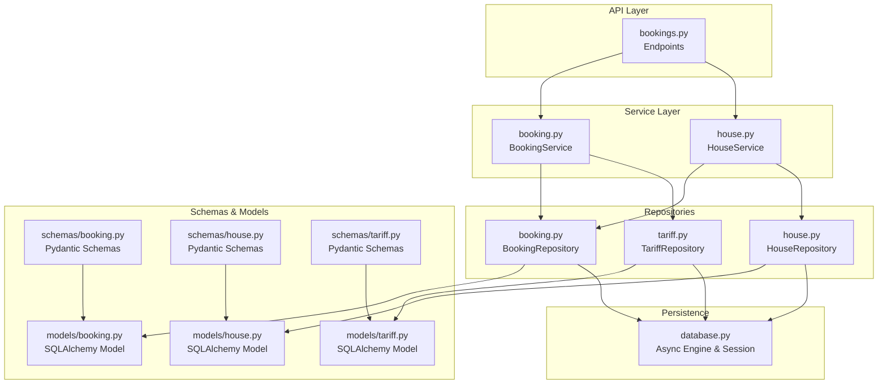
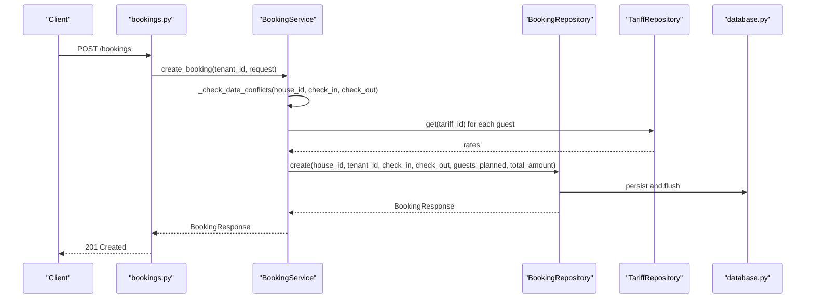
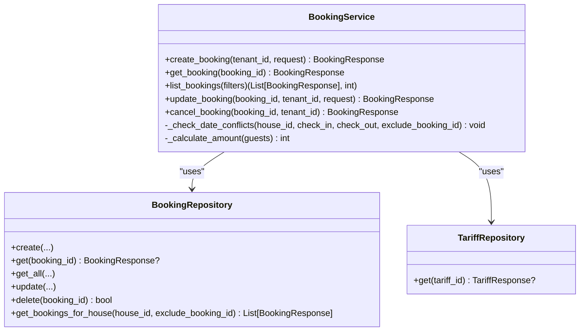
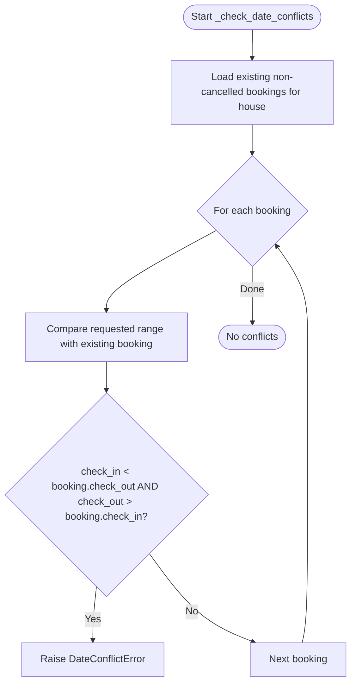
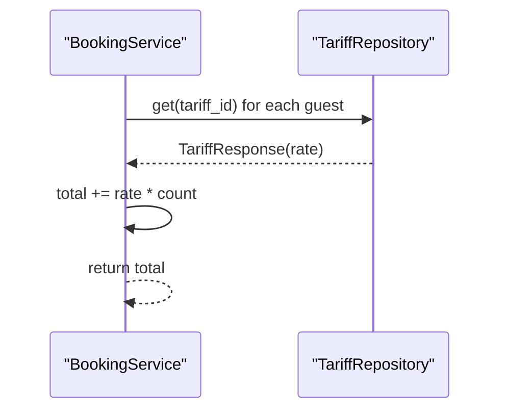
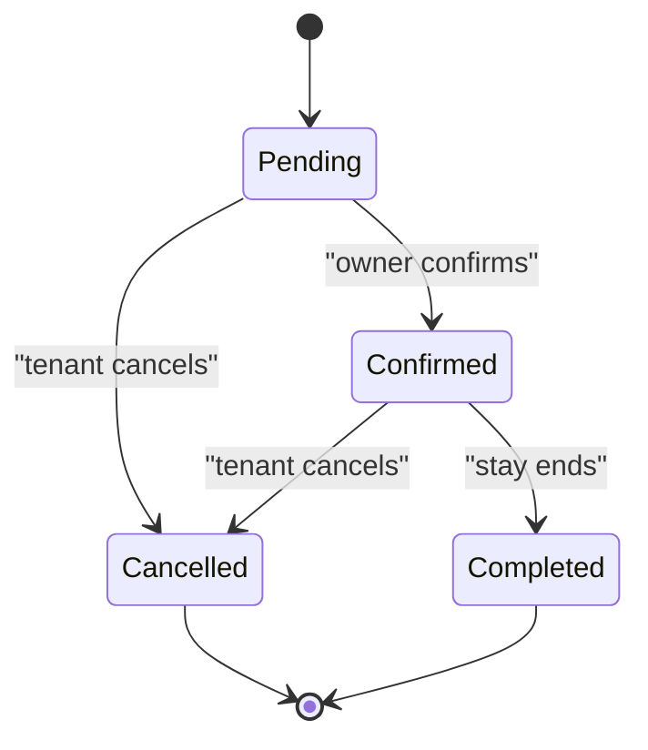
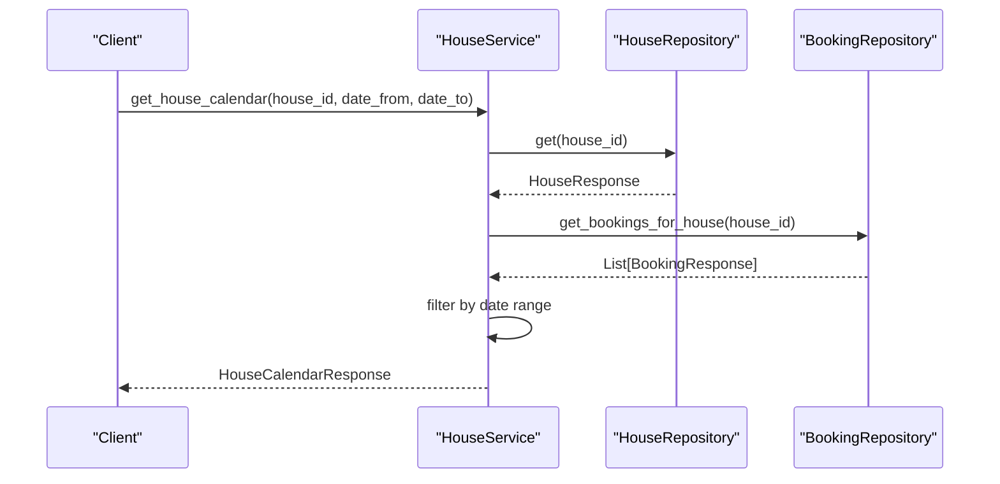
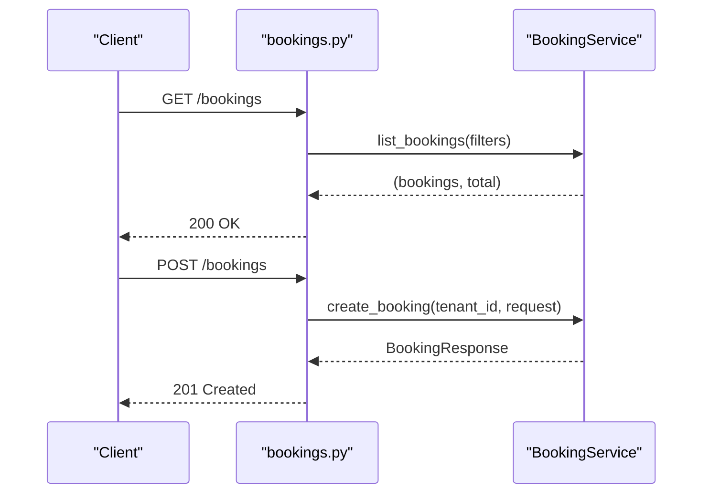
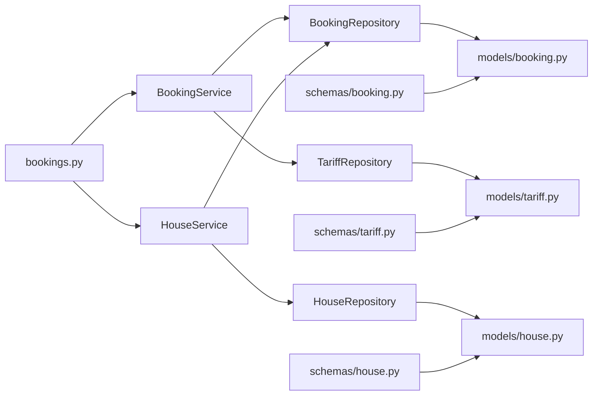

# Booking Service Operations

<cite>
**Referenced Files in This Document**
- [backend/services/booking.py](file://backend/services/booking.py)
- [backend/api/bookings.py](file://backend/api/bookings.py)
- [backend/repositories/booking.py](file://backend/repositories/booking.py)
- [backend/schemas/booking.py](file://backend/schemas/booking.py)
- [backend/models/booking.py](file://backend/models/booking.py)
- [backend/exceptions.py](file://backend/exceptions.py)
- [backend/services/house.py](file://backend/services/house.py)
- [backend/repositories/house.py](file://backend/repositories/house.py)
- [backend/schemas/house.py](file://backend/schemas/house.py)
- [backend/models/house.py](file://backend/models/house.py)
- [backend/repositories/tariff.py](file://backend/repositories/tariff.py)
- [backend/models/tariff.py](file://backend/models/tariff.py)
- [backend/schemas/tariff.py](file://backend/schemas/tariff.py)
- [backend/database.py](file://backend/database.py)
- [backend/tests/test_bookings.py](file://backend/tests/test_bookings.py)
</cite>

## Table of Contents
1. [Introduction](#introduction)
2. [Project Structure](#project-structure)
3. [Core Components](#core-components)
4. [Architecture Overview](#architecture-overview)
5. [Detailed Component Analysis](#detailed-component-analysis)
6. [Dependency Analysis](#dependency-analysis)
7. [Performance Considerations](#performance-considerations)
8. [Troubleshooting Guide](#troubleshooting-guide)
9. [Conclusion](#conclusion)

## Introduction
This document explains the booking service operations and business logic implemented in the backend. It covers booking creation, status management, conflict detection, and guest planning workflows. It also documents the complex business rules for validation, date range checking, capacity constraints, and status transitions. The relationship with HouseService for availability verification and pricing calculation integration is clarified, along with concrete examples from the codebase and tests. Error handling patterns for conflicts, invalid date ranges, and permission-based access control are included.

## Project Structure
The booking feature spans API endpoints, service layer, repositories, schemas, and models. The service orchestrates business logic, repositories handle persistence, schemas define validation and serialization, and models represent the database schema. HouseService integrates with the booking system to compute availability calendars.

**Diagram sources**
- [backend/api/bookings.py:1-223](file://backend/api/bookings.py#L1-L223)
- [backend/services/booking.py:57-322](file://backend/services/booking.py#L57-L322)
- [backend/services/house.py:51-253](file://backend/services/house.py#L51-L253)
- [backend/repositories/booking.py:13-224](file://backend/repositories/booking.py#L13-L224)
- [backend/repositories/house.py:12-183](file://backend/repositories/house.py#L12-L183)
- [backend/repositories/tariff.py:12-151](file://backend/repositories/tariff.py#L12-L151)
- [backend/schemas/booking.py:1-133](file://backend/schemas/booking.py#L1-L133)
- [backend/models/booking.py:20-41](file://backend/models/booking.py#L20-L41)
- [backend/schemas/house.py:9-107](file://backend/schemas/house.py#L9-L107)
- [backend/models/house.py:9-24](file://backend/models/house.py#L9-L24)
- [backend/schemas/tariff.py:9-54](file://backend/schemas/tariff.py#L9-L54)
- [backend/models/tariff.py:9-21](file://backend/models/tariff.py#L9-L21)
- [backend/database.py:1-41](file://backend/database.py#L1-L41)

**Section sources**
- [backend/api/bookings.py:1-223](file://backend/api/bookings.py#L1-L223)
- [backend/services/booking.py:57-322](file://backend/services/booking.py#L57-L322)
- [backend/services/house.py:51-253](file://backend/services/house.py#L51-L253)
- [backend/repositories/booking.py:13-224](file://backend/repositories/booking.py#L13-L224)
- [backend/repositories/house.py:12-183](file://backend/repositories/house.py#L12-L183)
- [backend/repositories/tariff.py:12-151](file://backend/repositories/tariff.py#L12-L151)
- [backend/schemas/booking.py:1-133](file://backend/schemas/booking.py#L1-L133)
- [backend/models/booking.py:20-41](file://backend/models/booking.py#L20-L41)
- [backend/schemas/house.py:9-107](file://backend/schemas/house.py#L9-L107)
- [backend/models/house.py:9-24](file://backend/models/house.py#L9-L24)
- [backend/schemas/tariff.py:9-54](file://backend/schemas/tariff.py#L9-L54)
- [backend/models/tariff.py:9-21](file://backend/models/tariff.py#L9-L21)
- [backend/database.py:1-41](file://backend/database.py#L1-L41)

## Core Components
- BookingService: Implements business logic for booking creation, updates, cancellations, conflict detection, and amount calculation using tariffs.
- HouseService: Provides house availability calendar by aggregating non-cancelled bookings for a given house.
- Repositories: Encapsulate persistence operations for bookings, houses, tariffs, and expose typed responses validated by schemas.
- Schemas: Define validation rules, request/response contracts, and enums for statuses and filters.
- Models: Represent database entities and relationships.

Key responsibilities:
- Validation: Pydantic validators ensure check-in precedes check-out and guests list is non-empty.
- Conflict detection: Overlap checks compare requested range against existing non-cancelled bookings for the same house.
- Pricing calculation: TariffRepository supplies rates; BookingService computes total amount from guest groups.
- Status management: Controlled transitions from pending to confirmed (owner action), with cancellation and completion states.

**Section sources**
- [backend/services/booking.py:57-322](file://backend/services/booking.py#L57-L322)
- [backend/services/house.py:51-253](file://backend/services/house.py#L51-L253)
- [backend/repositories/booking.py:13-224](file://backend/repositories/booking.py#L13-L224)
- [backend/repositories/house.py:12-183](file://backend/repositories/house.py#L12-L183)
- [backend/repositories/tariff.py:12-151](file://backend/repositories/tariff.py#L12-L151)
- [backend/schemas/booking.py:70-133](file://backend/schemas/booking.py#L70-L133)
- [backend/models/booking.py:11-41](file://backend/models/booking.py#L11-L41)
- [backend/schemas/house.py:9-107](file://backend/schemas/house.py#L9-L107)
- [backend/models/house.py:9-24](file://backend/models/house.py#L9-L24)
- [backend/schemas/tariff.py:9-54](file://backend/schemas/tariff.py#L9-L54)
- [backend/models/tariff.py:9-21](file://backend/models/tariff.py#L9-L21)

## Architecture Overview
The booking system follows layered architecture:
- API layer exposes endpoints for listing, retrieving, creating, updating, and cancelling bookings.
- Service layer enforces business rules and orchestrates repositories and schemas.
- Repository layer abstracts SQL operations and returns validated Pydantic models.
- Models define the persistent schema and relationships.

**Diagram sources**
- [backend/api/bookings.py:104-127](file://backend/api/bookings.py#L104-L127)
- [backend/services/booking.py:127-170](file://backend/services/booking.py#L127-L170)
- [backend/repositories/booking.py:24-58](file://backend/repositories/booking.py#L24-L58)
- [backend/repositories/tariff.py:43-56](file://backend/repositories/tariff.py#L43-L56)
- [backend/database.py:26-41](file://backend/database.py#L26-L41)

## Detailed Component Analysis

### BookingService: Business Logic and Workflows
BookingService centralizes all booking operations and enforces business rules:
- Conflict detection: Iterates existing non-cancelled bookings for the same house and applies interval overlap logic.
- Amount calculation: Aggregates tariff rates multiplied by guest counts.
- Access control: Verifies tenant ownership for updates and cancellations.
- Status transitions: Restricts updates to pending or confirmed; prevents cancellation of already cancelled or completed bookings.

**Diagram sources**
- [backend/services/booking.py:57-322](file://backend/services/booking.py#L57-L322)
- [backend/repositories/booking.py:13-224](file://backend/repositories/booking.py#L13-L224)
- [backend/repositories/tariff.py:12-151](file://backend/repositories/tariff.py#L12-L151)

**Section sources**
- [backend/services/booking.py:78-126](file://backend/services/booking.py#L78-L126)
- [backend/services/booking.py:127-170](file://backend/services/booking.py#L127-L170)
- [backend/services/booking.py:210-281](file://backend/services/booking.py#L210-L281)
- [backend/services/booking.py:283-321](file://backend/services/booking.py#L283-L321)

### Conflict Detection and Overlap Logic
Overlap detection uses standard interval overlap formula. The service fetches non-cancelled bookings for the target house and compares each with the requested range. Tests demonstrate:
- Overlapping date ranges trigger conflict errors.
- Bookings for different houses do not conflict.
- Cancelled bookings are excluded from conflict checks.

**Diagram sources**
- [backend/services/booking.py:78-107](file://backend/services/booking.py#L78-L107)
- [backend/repositories/booking.py:199-224](file://backend/repositories/booking.py#L199-L224)

**Section sources**
- [backend/services/booking.py:78-107](file://backend/services/booking.py#L78-L107)
- [backend/tests/test_bookings.py:146-175](file://backend/tests/test_bookings.py#L146-L175)
- [backend/tests/test_bookings.py:177-227](file://backend/tests/test_bookings.py#L177-L227)
- [backend/tests/test_bookings.py:847-876](file://backend/tests/test_bookings.py#L847-L876)

### Pricing Calculation and Tariff Integration
Amount calculation aggregates tariff rates from TariffRepository. Each guest group contributes rate × count. Tests verify:
- Mixed tariffs produce correct totals.
- Free tariffs (amount 0) do not contribute to total.

**Diagram sources**
- [backend/services/booking.py:108-125](file://backend/services/booking.py#L108-L125)
- [backend/repositories/tariff.py:43-56](file://backend/repositories/tariff.py#L43-L56)

**Section sources**
- [backend/services/booking.py:108-125](file://backend/services/booking.py#L108-L125)
- [backend/tests/test_bookings.py:229-264](file://backend/tests/test_bookings.py#L229-L264)

### Status Management and Transitions
BookingStatus supports four states: pending, confirmed, cancelled, completed. Business rules:
- Updates allowed only for pending or confirmed.
- Cancellations disallowed for already cancelled or completed.
- Tests confirm successful transitions and error conditions.

**Diagram sources**
- [backend/models/booking.py:11-18](file://backend/models/booking.py#L11-L18)
- [backend/schemas/booking.py:10-23](file://backend/schemas/booking.py#L10-L23)
- [backend/services/booking.py:210-281](file://backend/services/booking.py#L210-L281)
- [backend/services/booking.py:283-321](file://backend/services/booking.py#L283-L321)

**Section sources**
- [backend/models/booking.py:11-18](file://backend/models/booking.py#L11-L18)
- [backend/schemas/booking.py:10-23](file://backend/schemas/booking.py#L10-L23)
- [backend/tests/test_bookings.py:558-743](file://backend/tests/test_bookings.py#L558-L743)
- [backend/tests/test_bookings.py:745-876](file://backend/tests/test_bookings.py#L745-L876)

### HouseService Availability and Relationship to BookingService
HouseService provides availability calendars by enumerating non-cancelled bookings for a house and optionally filtering by date range. This complements BookingService by enabling clients to discover available periods before creating bookings.

**Diagram sources**
- [backend/services/house.py:207-253](file://backend/services/house.py#L207-L253)
- [backend/repositories/house.py:55-66](file://backend/repositories/house.py#L55-L66)
- [backend/repositories/booking.py:199-224](file://backend/repositories/booking.py#L199-L224)

**Section sources**
- [backend/services/house.py:207-253](file://backend/services/house.py#L207-L253)
- [backend/repositories/house.py:55-66](file://backend/repositories/house.py#L55-L66)
- [backend/repositories/booking.py:199-224](file://backend/repositories/booking.py#L199-L224)

### API Endpoints and Authorization Notes
The API layer defines endpoints for listing, retrieving, creating, updating, and cancelling bookings. Authorization is currently stubbed with a fixed tenant_id placeholder and should be replaced with proper authentication middleware.

**Diagram sources**
- [backend/api/bookings.py:20-51](file://backend/api/bookings.py#L20-L51)
- [backend/api/bookings.py:86-127](file://backend/api/bookings.py#L86-L127)

**Section sources**
- [backend/api/bookings.py:20-51](file://backend/api/bookings.py#L20-L51)
- [backend/api/bookings.py:86-127](file://backend/api/bookings.py#L86-L127)
- [backend/api/bookings.py:129-178](file://backend/api/bookings.py#L129-L178)
- [backend/api/bookings.py:180-223](file://backend/api/bookings.py#L180-L223)

## Dependency Analysis
- BookingService depends on BookingRepository and TariffRepository for persistence and pricing.
- HouseService depends on HouseRepository and BookingRepository to build availability calendars.
- API layer depends on BookingService and HouseService for orchestration.
- Schemas validate inputs and outputs; models define persistence.

**Diagram sources**
- [backend/api/bookings.py:1-223](file://backend/api/bookings.py#L1-L223)
- [backend/services/booking.py:57-322](file://backend/services/booking.py#L57-L322)
- [backend/services/house.py:51-253](file://backend/services/house.py#L51-L253)
- [backend/repositories/booking.py:13-224](file://backend/repositories/booking.py#L13-L224)
- [backend/repositories/house.py:12-183](file://backend/repositories/house.py#L12-L183)
- [backend/repositories/tariff.py:12-151](file://backend/repositories/tariff.py#L12-L151)
- [backend/schemas/booking.py:1-133](file://backend/schemas/booking.py#L1-L133)
- [backend/models/booking.py:20-41](file://backend/models/booking.py#L20-L41)
- [backend/schemas/house.py:9-107](file://backend/schemas/house.py#L9-L107)
- [backend/models/house.py:9-24](file://backend/models/house.py#L9-L24)
- [backend/schemas/tariff.py:9-54](file://backend/schemas/tariff.py#L9-L54)
- [backend/models/tariff.py:9-21](file://backend/models/tariff.py#L9-L21)

**Section sources**
- [backend/api/bookings.py:1-223](file://backend/api/bookings.py#L1-L223)
- [backend/services/booking.py:57-322](file://backend/services/booking.py#L57-L322)
- [backend/services/house.py:51-253](file://backend/services/house.py#L51-L253)
- [backend/repositories/booking.py:13-224](file://backend/repositories/booking.py#L13-L224)
- [backend/repositories/house.py:12-183](file://backend/repositories/house.py#L12-L183)
- [backend/repositories/tariff.py:12-151](file://backend/repositories/tariff.py#L12-L151)
- [backend/schemas/booking.py:1-133](file://backend/schemas/booking.py#L1-L133)
- [backend/models/booking.py:20-41](file://backend/models/booking.py#L20-L41)
- [backend/schemas/house.py:9-107](file://backend/schemas/house.py#L9-L107)
- [backend/models/house.py:9-24](file://backend/models/house.py#L9-L24)
- [backend/schemas/tariff.py:9-54](file://backend/schemas/tariff.py#L9-L54)
- [backend/models/tariff.py:9-21](file://backend/models/tariff.py#L9-L21)

## Performance Considerations
- Conflict detection iterates existing bookings for a house; for large datasets, consider indexing check_in/check_out and status fields to optimize overlap queries.
- Amount calculation loops over guest groups; complexity is O(n_guests). Keep guest lists small and avoid redundant recalculations when guests are unchanged.
- Pagination and filtering in list endpoints reduce payload sizes and improve responsiveness.
- Asynchronous repositories minimize blocking during I/O-bound operations.

## Troubleshooting Guide
Common issues and resolutions:
- Date conflict errors: Adjust requested dates to avoid overlaps with non-cancelled bookings for the same house.
- Invalid date ranges: Ensure check-in precedes check-out; validation rejects equal or inverted ranges.
- Permission errors: Only the booking tenant can update or cancel; verify tenant ownership.
- Already cancelled or completed bookings: Cancellations are disallowed for these states; re-check current status.
- Not found errors: Verify booking IDs and that resources exist before performing operations.

**Section sources**
- [backend/exceptions.py:16-82](file://backend/exceptions.py#L16-L82)
- [backend/services/booking.py:184-187](file://backend/services/booking.py#L184-L187)
- [backend/services/booking.py:234-243](file://backend/services/booking.py#L234-L243)
- [backend/services/booking.py:296-313](file://backend/services/booking.py#L296-L313)
- [backend/tests/test_bookings.py:79-111](file://backend/tests/test_bookings.py#L79-L111)
- [backend/tests/test_bookings.py:668-703](file://backend/tests/test_bookings.py#L668-L703)
- [backend/tests/test_bookings.py:817-844](file://backend/tests/test_bookings.py#L817-L844)

## Conclusion
The booking service implements robust business logic for reservations, including conflict detection, pricing calculation, and strict status management. Integration with HouseService enables availability discovery, while the layered architecture ensures maintainability and testability. The provided tests illustrate typical scenarios and error conditions, guiding both development and operational troubleshooting.