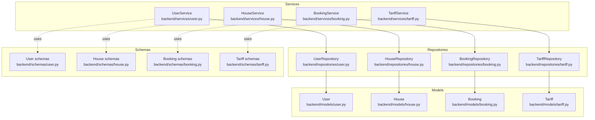
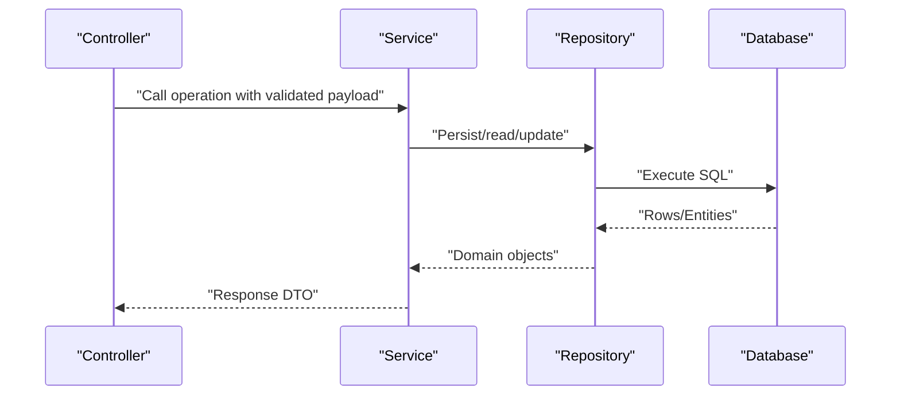
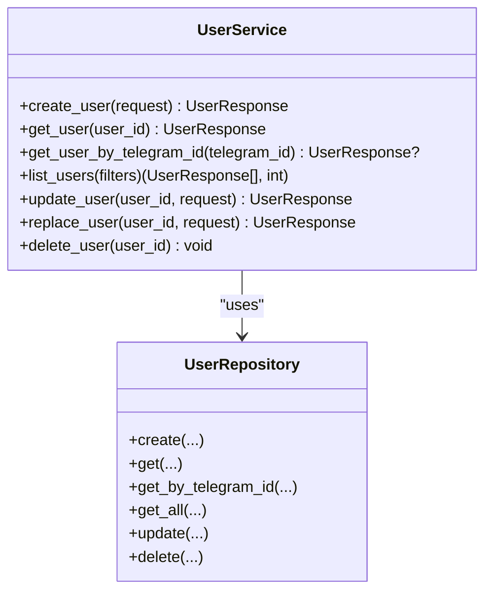
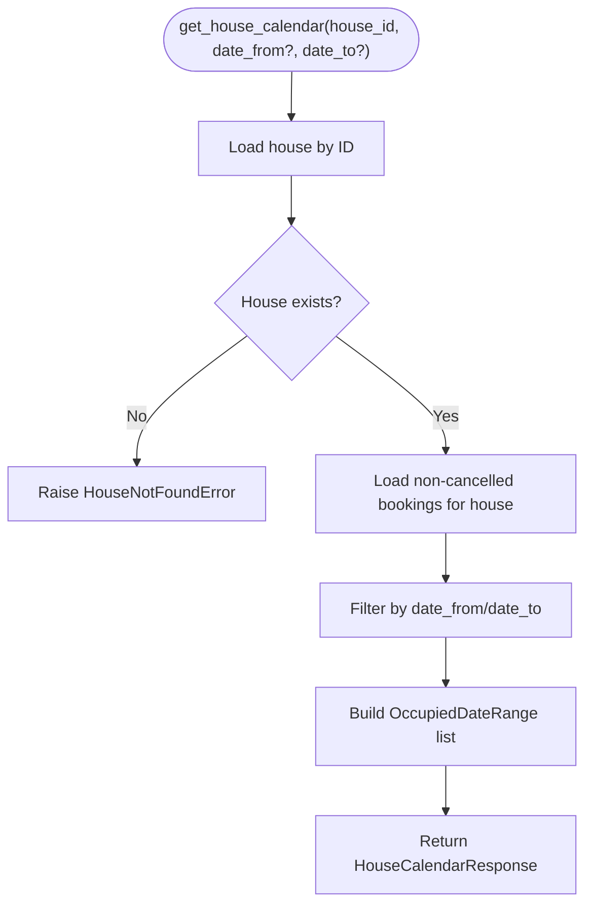
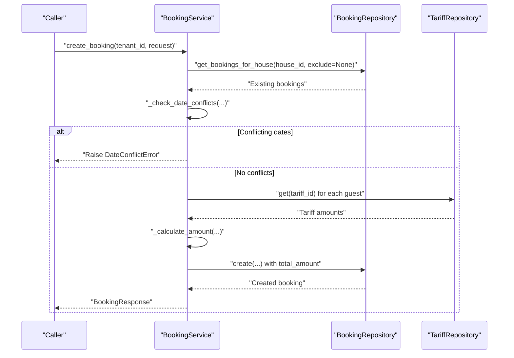
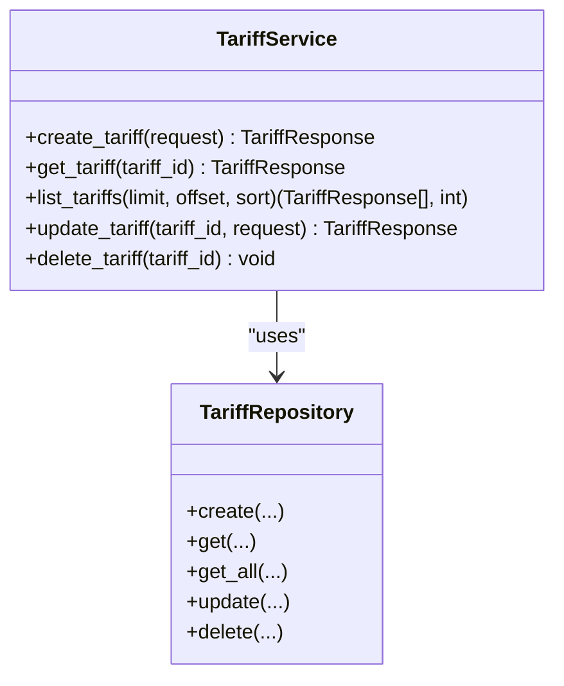
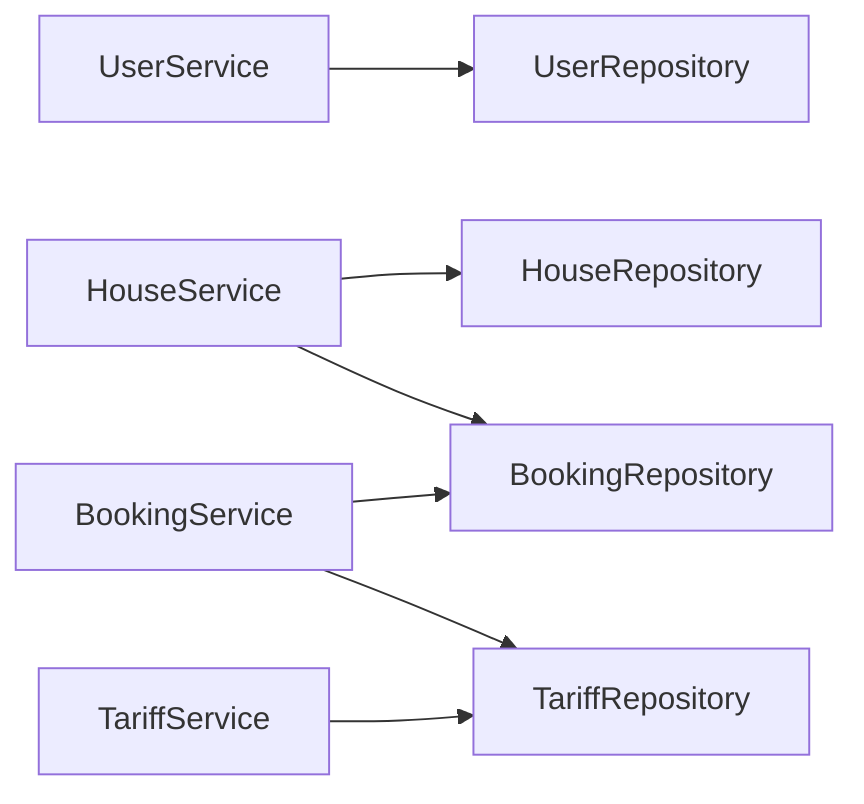

# Business Logic Layer

<cite>
**Referenced Files in This Document**
- [backend/services/user.py](file://backend/services/user.py)
- [backend/services/house.py](file://backend/services/house.py)
- [backend/services/booking.py](file://backend/services/booking.py)
- [backend/services/tariff.py](file://backend/services/tariff.py)
- [backend/repositories/user.py](file://backend/repositories/user.py)
- [backend/repositories/house.py](file://backend/repositories/house.py)
- [backend/repositories/booking.py](file://backend/repositories/booking.py)
- [backend/repositories/tariff.py](file://backend/repositories/tariff.py)
- [backend/models/user.py](file://backend/models/user.py)
- [backend/models/house.py](file://backend/models/house.py)
- [backend/models/booking.py](file://backend/models/booking.py)
- [backend/models/tariff.py](file://backend/models/tariff.py)
- [backend/schemas/user.py](file://backend/schemas/user.py)
- [backend/schemas/house.py](file://backend/schemas/house.py)
- [backend/schemas/booking.py](file://backend/schemas/booking.py)
- [backend/schemas/tariff.py](file://backend/schemas/tariff.py)
- [backend/exceptions.py](file://backend/exceptions.py)
</cite>

## Table of Contents
1. [Introduction](#introduction)
2. [Project Structure](#project-structure)
3. [Core Components](#core-components)
4. [Architecture Overview](#architecture-overview)
5. [Detailed Component Analysis](#detailed-component-analysis)
6. [Dependency Analysis](#dependency-analysis)
7. [Performance Considerations](#performance-considerations)
8. [Troubleshooting Guide](#troubleshooting-guide)
9. [Conclusion](#conclusion)

## Introduction
This document explains the business logic layer of the backend system. It focuses on how services orchestrate domain rules for user management, property (house) management, booking operations, and pricing calculations. It also documents service interfaces, dependency injection patterns, error handling strategies, and the relationships with the repository and data models. Practical examples are referenced from the codebase to illustrate complex scenarios such as booking conflict detection, availability checks, and price calculations.

## Project Structure
The business logic layer is organized by feature under backend/services, backed by repositories under backend/repositories, and grounded in SQLAlchemy models under backend/models. Pydantic schemas in backend/schemas define request/response contracts and validation rules.

**Diagram sources**
- [backend/services/user.py:33-183](file://backend/services/user.py#L33-L183)
- [backend/services/house.py:51-253](file://backend/services/house.py#L51-L253)
- [backend/services/booking.py:57-322](file://backend/services/booking.py#L57-L322)
- [backend/services/tariff.py:32-144](file://backend/services/tariff.py#L32-L144)
- [backend/repositories/user.py:12-168](file://backend/repositories/user.py#L12-L168)
- [backend/repositories/house.py:12-183](file://backend/repositories/house.py#L12-L183)
- [backend/repositories/booking.py:13-224](file://backend/repositories/booking.py#L13-L224)
- [backend/repositories/tariff.py:12-151](file://backend/repositories/tariff.py#L12-L151)
- [backend/models/user.py:19-32](file://backend/models/user.py#L19-L32)
- [backend/models/house.py:9-24](file://backend/models/house.py#L9-L24)
- [backend/models/booking.py:20-41](file://backend/models/booking.py#L20-L41)
- [backend/models/tariff.py:9-21](file://backend/models/tariff.py#L9-L21)
- [backend/schemas/user.py:18-72](file://backend/schemas/user.py#L18-L72)
- [backend/schemas/house.py:9-107](file://backend/schemas/house.py#L9-L107)
- [backend/schemas/booking.py:10-133](file://backend/schemas/booking.py#L10-L133)
- [backend/schemas/tariff.py:9-54](file://backend/schemas/tariff.py#L9-L54)

**Section sources**
- [backend/services/user.py:1-183](file://backend/services/user.py#L1-L183)
- [backend/services/house.py:1-253](file://backend/services/house.py#L1-L253)
- [backend/services/booking.py:1-322](file://backend/services/booking.py#L1-L322)
- [backend/services/tariff.py:1-144](file://backend/services/tariff.py#L1-L144)

## Core Components
- UserService: Manages user lifecycle (create, read, list, update, replace, delete) with role-aware operations and Telegram ID lookup.
- HouseService: Manages house lifecycle and exposes availability calendars derived from bookings.
- BookingService: Enforces booking validation, conflict detection, amount calculation via tariffs, and status transitions with authorization checks.
- TariffService: Manages pricing tiers used by bookings.

Each service depends on repositories for persistence and uses schemas for validation and transport. Services centralize business rules and raise domain-specific exceptions.

**Section sources**
- [backend/services/user.py:33-183](file://backend/services/user.py#L33-L183)
- [backend/services/house.py:51-253](file://backend/services/house.py#L51-L253)
- [backend/services/booking.py:57-322](file://backend/services/booking.py#L57-L322)
- [backend/services/tariff.py:32-144](file://backend/services/tariff.py#L32-L144)

## Architecture Overview
The business logic layer follows a layered architecture:
- Controllers (in backend/api) receive requests and call services.
- Services encapsulate business rules and coordinate repositories.
- Repositories translate service requests into SQL queries.
- Models define persistence schema and enums.
- Schemas define validation and serialization contracts.

**Diagram sources**
- [backend/services/user.py:33-183](file://backend/services/user.py#L33-L183)
- [backend/services/house.py:51-253](file://backend/services/house.py#L51-L253)
- [backend/services/booking.py:57-322](file://backend/services/booking.py#L57-L322)
- [backend/services/tariff.py:32-144](file://backend/services/tariff.py#L32-L144)
- [backend/repositories/user.py:12-168](file://backend/repositories/user.py#L12-L168)
- [backend/repositories/house.py:12-183](file://backend/repositories/house.py#L12-L183)
- [backend/repositories/booking.py:13-224](file://backend/repositories/booking.py#L13-L224)
- [backend/repositories/tariff.py:12-151](file://backend/repositories/tariff.py#L12-L151)

## Detailed Component Analysis

### User Management Service
- Responsibilities:
  - Create users with Telegram ID, name, and role.
  - Retrieve users by ID or Telegram ID.
  - List users with role filter, pagination, and sorting.
  - Update/replace users with validation and existence checks.
  - Delete users with existence checks.
- Validation and errors:
  - Uses CreateUserRequest and UpdateUserRequest schemas for validation.
  - Raises UserNotFoundError when attempting operations on missing users.
- Dependency injection:
  - Provides get_user_repository dependency and injects UserRepository into UserService.

**Diagram sources**
- [backend/services/user.py:33-183](file://backend/services/user.py#L33-L183)
- [backend/repositories/user.py:12-168](file://backend/repositories/user.py#L12-L168)

**Section sources**
- [backend/services/user.py:33-183](file://backend/services/user.py#L33-L183)
- [backend/repositories/user.py:12-168](file://backend/repositories/user.py#L12-L168)
- [backend/schemas/user.py:18-72](file://backend/schemas/user.py#L18-L72)
- [backend/models/user.py:19-32](file://backend/models/user.py#L19-L32)
- [backend/exceptions.py](file://backend/exceptions.py)

### Property (House) Management Service
- Responsibilities:
  - Create, read, list, update, replace, and delete houses.
  - Build availability calendar for a house within an optional date range.
- Availability calendar logic:
  - Queries non-cancelled bookings for the house.
  - Filters by optional date window.
  - Returns OccupiedDateRange entries with booking_id for UI/API consumption.
- Validation and errors:
  - Uses HouseFilterParams and house schemas for validation.
  - Raises HouseNotFoundError for missing houses.
- Dependencies:
  - HouseRepository for persistence.
  - BookingRepository for calendar computation.

**Diagram sources**
- [backend/services/house.py:207-253](file://backend/services/house.py#L207-L253)
- [backend/repositories/booking.py:199-224](file://backend/repositories/booking.py#L199-L224)

**Section sources**
- [backend/services/house.py:51-253](file://backend/services/house.py#L51-L253)
- [backend/repositories/house.py:12-183](file://backend/repositories/house.py#L12-L183)
- [backend/repositories/booking.py:199-224](file://backend/repositories/booking.py#L199-L224)
- [backend/schemas/house.py:68-107](file://backend/schemas/house.py#L68-L107)
- [backend/models/house.py:9-24](file://backend/models/house.py#L9-L24)
- [backend/models/booking.py:20-41](file://backend/models/booking.py#L20-L41)
- [backend/exceptions.py](file://backend/exceptions.py)

### Booking Operations Service
- Responsibilities:
  - Create bookings with conflict checks and amount calculation.
  - Retrieve, list, update, and cancel bookings.
  - Enforce authorization and status constraints.
- Conflict detection:
  - Overlap check uses standard interval overlap formula: start_a < end_b AND end_a > start_b.
  - Optionally excludes an existing booking during updates.
- Pricing calculation:
  - Iterates planned guests, fetches tariff rates, computes total amount.
- Authorization and status:
  - Tenant-only operations verified via tenant_id.
  - Updates allowed only for PENDING or CONFIRMED; cancellation disallowed for CANCELLED or COMPLETED.
- Validation:
  - Uses CreateBookingRequest and UpdateBookingRequest schemas; includes Pydantic validators for date ordering.

**Diagram sources**
- [backend/services/booking.py:78-170](file://backend/services/booking.py#L78-L170)
- [backend/repositories/booking.py:199-224](file://backend/repositories/booking.py#L199-L224)
- [backend/repositories/tariff.py:43-56](file://backend/repositories/tariff.py#L43-L56)

**Section sources**
- [backend/services/booking.py:57-322](file://backend/services/booking.py#L57-L322)
- [backend/repositories/booking.py:13-224](file://backend/repositories/booking.py#L13-L224)
- [backend/repositories/tariff.py:12-151](file://backend/repositories/tariff.py#L12-L151)
- [backend/schemas/booking.py:25-133](file://backend/schemas/booking.py#L25-L133)
- [backend/models/booking.py:11-41](file://backend/models/booking.py#L11-L41)
- [backend/exceptions.py](file://backend/exceptions.py)

### Tariff Management Service
- Responsibilities:
  - Create, read, list, update, and delete tariffs.
  - Uses TariffResponse/TariffBase schemas for validation and transport.
- Validation:
  - TariffBase enforces name length and non-negative amount.

**Diagram sources**
- [backend/services/tariff.py:32-144](file://backend/services/tariff.py#L32-L144)
- [backend/repositories/tariff.py:12-151](file://backend/repositories/tariff.py#L12-L151)

**Section sources**
- [backend/services/tariff.py:32-144](file://backend/services/tariff.py#L32-L144)
- [backend/repositories/tariff.py:12-151](file://backend/repositories/tariff.py#L12-L151)
- [backend/schemas/tariff.py:9-54](file://backend/schemas/tariff.py#L9-L54)
- [backend/models/tariff.py:9-21](file://backend/models/tariff.py#L9-L21)

## Dependency Analysis
- Service-layer dependencies:
  - UserService depends on UserRepository.
  - HouseService depends on HouseRepository and BookingRepository.
  - BookingService depends on BookingRepository and TariffRepository.
  - TariffService depends on TariffRepository.
- Injection pattern:
  - Each service defines an async dependency provider that constructs the repository with the current database session.
  - Services accept repositories via FastAPI Depends, enabling testability and inversion of control.
- Coupling and cohesion:
  - Services are cohesive around business capabilities and decoupled from persistence via repositories.
  - Repositories are thin wrappers around SQLAlchemy, minimizing duplication.

**Diagram sources**
- [backend/services/user.py:19-31](file://backend/services/user.py#L19-L31)
- [backend/services/house.py:23-48](file://backend/services/house.py#L23-L48)
- [backend/services/booking.py:29-54](file://backend/services/booking.py#L29-L54)
- [backend/services/tariff.py:18-29](file://backend/services/tariff.py#L18-L29)

**Section sources**
- [backend/services/user.py:19-31](file://backend/services/user.py#L19-L31)
- [backend/services/house.py:23-48](file://backend/services/house.py#L23-L48)
- [backend/services/booking.py:29-54](file://backend/services/booking.py#L29-L54)
- [backend/services/tariff.py:18-29](file://backend/services/tariff.py#L18-L29)

## Performance Considerations
- Query efficiency:
  - Filtering, sorting, and pagination are applied at the SQL level in repositories to avoid loading unnecessary rows.
- Conflict detection:
  - get_bookings_for_house retrieves only non-cancelled bookings for a house; updates can optionally exclude the current booking to support self-conflict exclusion.
- Amount calculation:
  - Tariff lookups are performed per guest group; consider batching or caching if guest compositions grow large.
- Serialization:
  - Pydantic model_validate is used to convert ORM rows to response models, ensuring validation and consistent serialization.

[No sources needed since this section provides general guidance]

## Troubleshooting Guide
Common issues and resolutions:
- Booking date conflicts:
  - Symptom: Attempting to create or update a booking overlapping existing dates.
  - Resolution: Ensure the requested interval does not overlap with any non-cancelled booking for the same house. The service raises a domain-specific error when conflicts are detected.
  - Reference: [backend/services/booking.py:78-107](file://backend/services/booking.py#L78-L107)
- Unauthorized operations:
  - Symptom: Non-tenant users attempting to update or cancel bookings.
  - Resolution: Verify tenant_id matches the booking’s tenant_id before allowing updates or cancellations.
  - Reference: [backend/services/booking.py:234-304](file://backend/services/booking.py#L234-L304)
- Invalid status transitions:
  - Symptom: Updating or cancelling a booking in CANCELLED or COMPLETED state.
  - Resolution: Only PENDING and CONFIRMED bookings can be modified; CANCELLED bookings cannot be re-cancelled.
  - Reference: [backend/services/booking.py:238-314](file://backend/services/booking.py#L238-L314)
- Missing entities:
  - Symptom: Looking up non-existent user, house, booking, or tariff.
  - Resolution: Services raise specific not-found exceptions; callers should handle them gracefully.
  - References:
    - [backend/services/user.py:77-80](file://backend/services/user.py#L77-L80)
    - [backend/services/house.py:105-108](file://backend/services/house.py#L105-L108)
    - [backend/services/booking.py:184-187](file://backend/services/booking.py#L184-L187)
    - [backend/services/tariff.py:75-78](file://backend/services/tariff.py#L75-L78)
- Invalid date ranges:
  - Symptom: check_in not before check_out.
  - Resolution: Pydantic validators enforce date ordering in request schemas.
  - References:
    - [backend/schemas/booking.py:82-87](file://backend/schemas/booking.py#L82-L87)
    - [backend/schemas/booking.py:102-107](file://backend/schemas/booking.py#L102-L107)

**Section sources**
- [backend/services/booking.py:78-107](file://backend/services/booking.py#L78-L107)
- [backend/services/booking.py:234-314](file://backend/services/booking.py#L234-L314)
- [backend/services/user.py:77-80](file://backend/services/user.py#L77-L80)
- [backend/services/house.py:105-108](file://backend/services/house.py#L105-L108)
- [backend/services/tariff.py:75-78](file://backend/services/tariff.py#L75-L78)
- [backend/schemas/booking.py:82-87](file://backend/schemas/booking.py#L82-L87)
- [backend/schemas/booking.py:102-107](file://backend/schemas/booking.py#L102-L107)

## Conclusion
The business logic layer cleanly separates domain rules from persistence and data transfer concerns. Services encapsulate complex workflows—such as booking conflict detection, availability computation, and pricing aggregation—while repositories remain focused on data access. Dependency injection enables testable, maintainable code. Adhering to the established patterns and validation contracts ensures robust behavior across user, property, booking, and pricing domains.