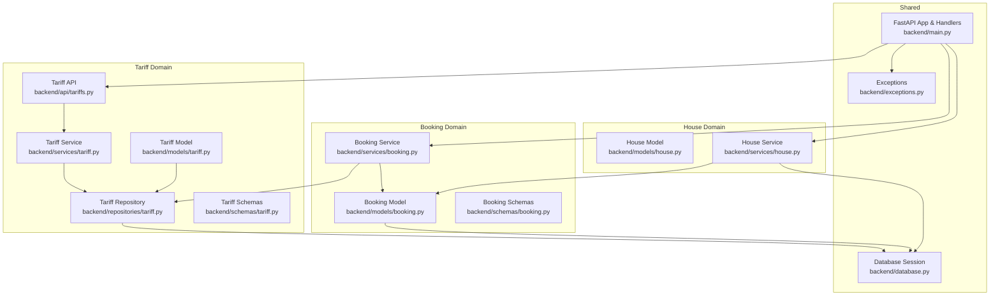
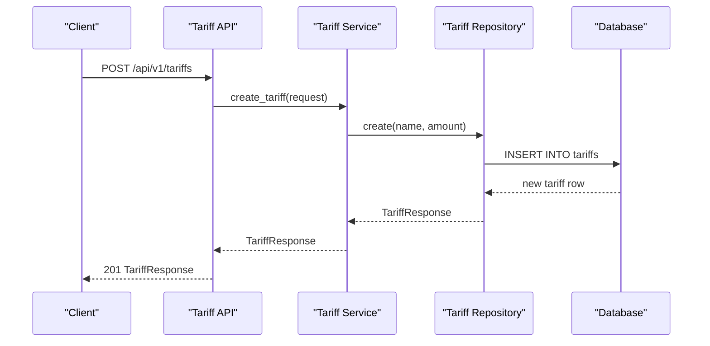
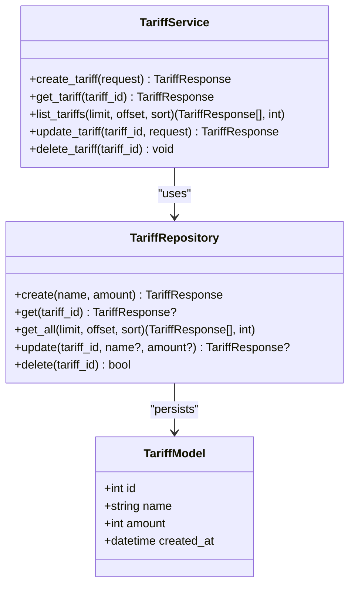
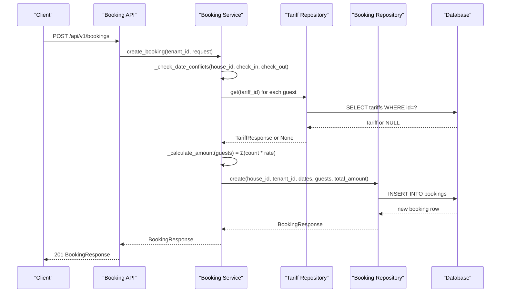
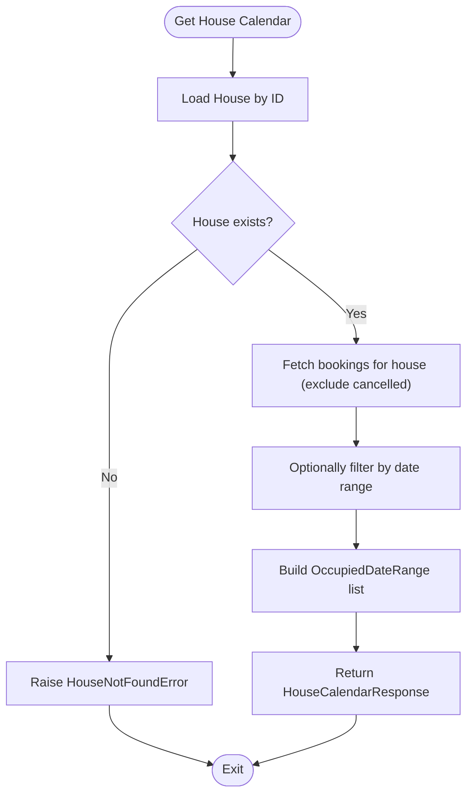
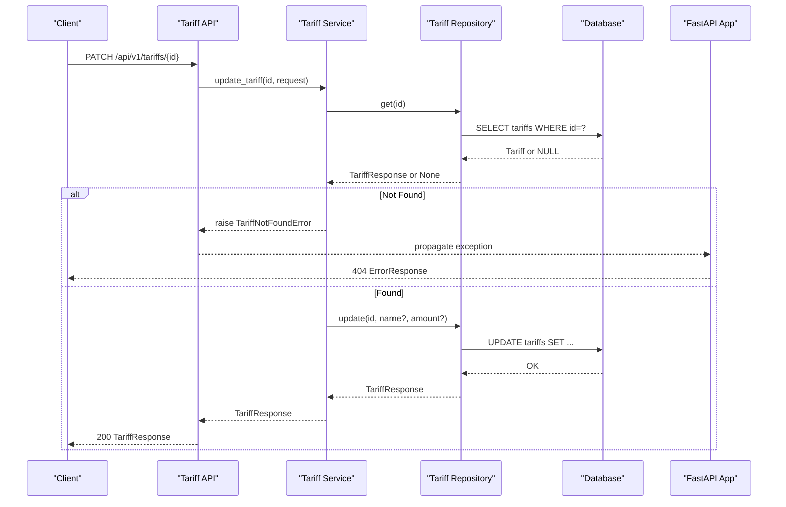
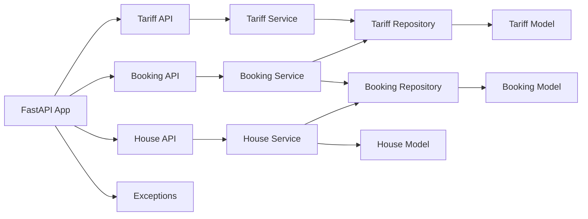

# Pricing and Tariff Business Logic

<cite>
**Referenced Files in This Document**
- [tariff.py](file://backend/models/tariff.py)
- [tariff.py](file://backend/services/tariff.py)
- [tariff.py](file://backend/repositories/tariff.py)
- [tariff.py](file://backend/schemas/tariff.py)
- [tariffs.py](file://backend/api/tariffs.py)
- [booking.py](file://backend/models/booking.py)
- [booking.py](file://backend/services/booking.py)
- [booking.py](file://backend/schemas/booking.py)
- [house.py](file://backend/models/house.py)
- [house.py](file://backend/services/house.py)
- [exceptions.py](file://backend/exceptions.py)
- [test_tariffs.py](file://backend/tests/test_tariffs.py)
- [test_bookings.py](file://backend/tests/test_bookings.py)
- [database.py](file://backend/database.py)
- [main.py](file://backend/main.py)
</cite>

## Table of Contents
1. [Introduction](#introduction)
2. [Project Structure](#project-structure)
3. [Core Components](#core-components)
4. [Architecture Overview](#architecture-overview)
5. [Detailed Component Analysis](#detailed-component-analysis)
6. [Dependency Analysis](#dependency-analysis)
7. [Performance Considerations](#performance-considerations)
8. [Troubleshooting Guide](#troubleshooting-guide)
9. [Conclusion](#conclusion)

## Introduction
This document explains the pricing and tariff business logic implemented in the system. It focuses on how tariffs are managed, how prices are calculated for bookings, and how the system integrates with houses for availability and with users for authorization. It also documents business rules, validation constraints, and error handling for pricing scenarios such as free tariffs, multiple guest categories, and date conflicts.

## Project Structure
The pricing and tariff logic spans models, repositories, services, schemas, and API endpoints for tariffs and bookings, plus house availability and shared exceptions.

**Diagram sources**
- [tariff.py:9-21](file://backend/models/tariff.py#L9-L21)
- [tariff.py:32-144](file://backend/services/tariff.py#L32-L144)
- [tariff.py:12-151](file://backend/repositories/tariff.py#L12-L151)
- [tariff.py:9-54](file://backend/schemas/tariff.py#L9-L54)
- [tariffs.py:1-187](file://backend/api/tariffs.py#L1-L187)
- [booking.py:20-41](file://backend/models/booking.py#L20-L41)
- [booking.py:57-322](file://backend/services/booking.py#L57-L322)
- [booking.py:25-133](file://backend/schemas/booking.py#L25-L133)
- [house.py:9-24](file://backend/models/house.py#L9-L24)
- [house.py:51-253](file://backend/services/house.py#L51-L253)
- [database.py:26-41](file://backend/database.py#L26-L41)
- [main.py:59-173](file://backend/main.py#L59-L173)

**Section sources**
- [tariff.py:1-21](file://backend/models/tariff.py#L1-L21)
- [tariff.py:1-144](file://backend/services/tariff.py#L1-L144)
- [tariff.py:1-151](file://backend/repositories/tariff.py#L1-L151)
- [tariff.py:1-54](file://backend/schemas/tariff.py#L1-L54)
- [tariffs.py:1-187](file://backend/api/tariffs.py#L1-L187)
- [booking.py:1-41](file://backend/models/booking.py#L1-L41)
- [booking.py:1-322](file://backend/services/booking.py#L1-L322)
- [booking.py:1-133](file://backend/schemas/booking.py#L1-L133)
- [house.py:1-24](file://backend/models/house.py#L1-L24)
- [house.py:1-253](file://backend/services/house.py#L1-L253)
- [database.py:1-41](file://backend/database.py#L1-L41)
- [main.py:1-173](file://backend/main.py#L1-L173)

## Core Components
- Tariff model and repository: Store and manage pricing tiers (name and amount per night).
- Tariff service: Implements CRUD operations with validation and error handling.
- Booking service: Calculates total price from guest composition using tariff rates and enforces date conflict checks.
- House service: Provides availability calendars based on bookings.
- Shared exceptions: Centralized domain errors surfaced to clients.

Key business rules:
- Tariff amount is stored as integer “rubles per night,” with zero enabling free pricing.
- Booking total amount equals sum over guests of (tariff.amount × count).
- Date validation ensures check-in precedes check-out.
- Date conflict validation prevents overlapping stays for the same house.

**Section sources**
- [tariff.py:9-21](file://backend/models/tariff.py#L9-L21)
- [tariff.py:23-41](file://backend/repositories/tariff.py#L23-L41)
- [tariff.py:49-144](file://backend/services/tariff.py#L49-L144)
- [tariff.py:9-54](file://backend/schemas/tariff.py#L9-L54)
- [booking.py:108-170](file://backend/services/booking.py#L108-L170)
- [booking.py:70-108](file://backend/schemas/booking.py#L70-L108)
- [house.py:207-253](file://backend/services/house.py#L207-L253)
- [exceptions.py:76-82](file://backend/exceptions.py#L76-L82)

## Architecture Overview
The system separates concerns across layers:
- API layer exposes endpoints for tariffs and bookings.
- Service layer encapsulates business logic and orchestrates repositories.
- Repository layer handles persistence with SQLAlchemy async sessions.
- Models define the schema and relationships.
- Exceptions unify error responses.

**Diagram sources**
- [tariffs.py:101-117](file://backend/api/tariffs.py#L101-L117)
- [tariff.py:49-61](file://backend/services/tariff.py#L49-L61)
- [tariff.py:23-41](file://backend/repositories/tariff.py#L23-L41)

**Section sources**
- [tariffs.py:1-187](file://backend/api/tariffs.py#L1-L187)
- [tariff.py:1-144](file://backend/services/tariff.py#L1-L144)
- [tariff.py:1-151](file://backend/repositories/tariff.py#L1-L151)
- [database.py:26-41](file://backend/database.py#L26-L41)

## Detailed Component Analysis

### Tariff Management
Tariff management covers creation, retrieval, listing, updates, and deletion. The service validates presence before updates/deletes and raises a domain-specific error if missing.

**Diagram sources**
- [tariff.py:9-21](file://backend/models/tariff.py#L9-L21)
- [tariff.py:12-151](file://backend/repositories/tariff.py#L12-L151)
- [tariff.py:32-144](file://backend/services/tariff.py#L32-L144)

Business rules and validations:
- Name length and amount constraints enforced by Pydantic schemas.
- Amount must be non-negative; free tariffs are supported by amount=0.
- Listing supports pagination and sorting by any model field.

**Section sources**
- [tariff.py:9-54](file://backend/schemas/tariff.py#L9-L54)
- [tariff.py:49-144](file://backend/services/tariff.py#L49-L144)
- [tariff.py:23-151](file://backend/repositories/tariff.py#L23-L151)
- [tariffs.py:18-187](file://backend/api/tariffs.py#L18-L187)

### Booking Price Calculation Workflow
The booking service calculates the total amount by summing the product of each guest group’s tariff rate and count. It fetches the current tariff amount from the database for accuracy.

**Diagram sources**
- [booking.py:127-170](file://backend/services/booking.py#L127-L170)
- [booking.py:78-126](file://backend/services/booking.py#L78-L126)
- [booking.py:43-56](file://backend/repositories/tariff.py#L43-L56)
- [booking.py:20-41](file://backend/models/booking.py#L20-L41)

Pricing calculation logic:
- For each guest group, fetch the tariff by ID and multiply by the count.
- If a tariff is missing, its contribution is treated as zero in the current implementation.
- Duration is not part of the calculation; total amount reflects nightly rates multiplied by guest counts.

**Section sources**
- [booking.py:108-170](file://backend/services/booking.py#L108-L170)
- [booking.py:25-88](file://backend/schemas/booking.py#L25-L88)
- [booking.py:20-41](file://backend/models/booking.py#L20-L41)

### House Availability and Tariff Relationship
House availability is derived from bookings. While house pricing is not modeled in the current schema, the house service aggregates occupied date ranges for a given property, which indirectly informs pricing decisions by preventing double-booking.

**Diagram sources**
- [house.py:207-253](file://backend/services/house.py#L207-L253)
- [exceptions.py:60-66](file://backend/exceptions.py#L60-L66)

**Section sources**
- [house.py:9-24](file://backend/models/house.py#L9-L24)
- [house.py:207-253](file://backend/services/house.py#L207-L253)
- [exceptions.py:60-66](file://backend/exceptions.py#L60-L66)

### API Endpoints and Error Handling
Endpoints expose CRUD operations for tariffs and integrate with centralized exception handlers that convert domain errors into standardized JSON responses.

**Diagram sources**
- [tariffs.py:137-157](file://backend/api/tariffs.py#L137-L157)
- [tariff.py:102-128](file://backend/services/tariff.py#L102-L128)
- [tariff.py:101-131](file://backend/repositories/tariff.py#L101-L131)
- [exceptions.py:76-82](file://backend/exceptions.py#L76-L82)
- [main.py:145-153](file://backend/main.py#L145-L153)

**Section sources**
- [tariffs.py:1-187](file://backend/api/tariffs.py#L1-L187)
- [tariff.py:102-128](file://backend/services/tariff.py#L102-L128)
- [tariff.py:101-131](file://backend/repositories/tariff.py#L101-L131)
- [exceptions.py:76-82](file://backend/exceptions.py#L76-L82)
- [main.py:145-153](file://backend/main.py#L145-L153)

## Dependency Analysis
- Tariff API depends on Tariff Service.
- Tariff Service depends on Tariff Repository and Pydantic schemas.
- Booking Service depends on Tariff Repository and Booking Repository; it orchestrates price calculation.
- House Service depends on Booking Repository to build availability calendars.
- FastAPI app registers routers and exception handlers globally.

**Diagram sources**
- [tariffs.py:1-187](file://backend/api/tariffs.py#L1-L187)
- [tariff.py:32-144](file://backend/services/tariff.py#L32-L144)
- [tariff.py:12-151](file://backend/repositories/tariff.py#L12-L151)
- [tariff.py:9-21](file://backend/models/tariff.py#L9-L21)
- [booking.py:57-322](file://backend/services/booking.py#L57-L322)
- [booking.py:20-41](file://backend/models/booking.py#L20-L41)
- [house.py:51-253](file://backend/services/house.py#L51-L253)
- [house.py:9-24](file://backend/models/house.py#L9-L24)
- [main.py:59-173](file://backend/main.py#L59-L173)

**Section sources**
- [tariffs.py:1-187](file://backend/api/tariffs.py#L1-L187)
- [tariff.py:32-144](file://backend/services/tariff.py#L32-L144)
- [tariff.py:12-151](file://backend/repositories/tariff.py#L12-L151)
- [booking.py:57-322](file://backend/services/booking.py#L57-L322)
- [house.py:51-253](file://backend/services/house.py#L51-L253)
- [main.py:59-173](file://backend/main.py#L59-L173)

## Performance Considerations
- Tariff lookups in price calculation are O(n) over guest groups; batching or caching could reduce N+1 queries if guest lists grow large.
- Sorting and pagination in tariff listing are handled at the database level, minimizing memory overhead.
- Booking date conflict checks iterate over existing bookings for a house; consider indexing or limiting the search window for very busy properties.

[No sources needed since this section provides general guidance]

## Troubleshooting Guide
Common issues and resolutions:
- Tariff not found during booking: The service raises a domain error; ensure the tariff exists and the ID is correct.
- Invalid amount on tariff creation/update: Amount must be non-negative; adjust payload accordingly.
- Invalid booking dates: Ensure check-in is strictly before check-out.
- Date conflicts: Overlapping stays for the same house are rejected; adjust dates or house selection.

Validation and error mapping:
- Tariff not found: 404 ErrorResponse with “not_found”.
- Date conflict: 400 ErrorResponse with “date_conflict”.
- Permission errors: 403 ErrorResponse with “forbidden”.
- General internal errors: 500 ErrorResponse with “internal_error”.

**Section sources**
- [exceptions.py:76-82](file://backend/exceptions.py#L76-L82)
- [booking.py:82-107](file://backend/schemas/booking.py#L82-L107)
- [booking.py:78-107](file://backend/services/booking.py#L78-L107)
- [main.py:145-153](file://backend/main.py#L145-L153)

## Conclusion
The system implements a straightforward yet robust tariff and pricing model:
- Tariffs are simple, immutable pricing tiers with non-negative amounts.
- Bookings calculate totals by multiplying nightly rates by guest counts.
- Availability is enforced via date conflict checks.
- Extensibility points exist for richer pricing features (e.g., seasonality, occupancy tiers) by augmenting schemas and services while preserving current validation and error semantics.

[No sources needed since this section summarizes without analyzing specific files]