# Property Management Business Logic

<cite>
**Referenced Files in This Document**
- [house.py](file://backend/services/house.py)
- [house.py](file://backend/repositories/house.py)
- [house.py](file://backend/models/house.py)
- [house.py](file://backend/schemas/house.py)
- [houses.py](file://backend/api/houses.py)
- [booking.py](file://backend/repositories/booking.py)
- [booking.py](file://backend/models/booking.py)
- [exceptions.py](file://backend/exceptions.py)
- [database.py](file://backend/database.py)
- [config.py](file://backend/config.py)
- [test_houses.py](file://backend/tests/test_houses.py)
</cite>

## Table of Contents
1. [Introduction](#introduction)
2. [Project Structure](#project-structure)
3. [Core Components](#core-components)
4. [Architecture Overview](#architecture-overview)
5. [Detailed Component Analysis](#detailed-component-analysis)
6. [Dependency Analysis](#dependency-analysis)
7. [Performance Considerations](#performance-considerations)
8. [Troubleshooting Guide](#troubleshooting-guide)
9. [Conclusion](#conclusion)
10. [Appendices](#appendices)

## Introduction
This document explains the property management business logic implemented in the backend. It focuses on the HouseService and its integration with HouseRepository, data models, and schemas. It covers property listing, availability calendar computation, capacity management, owner-specific operations, validation rules, and error handling patterns. It also documents owner filtering, search algorithms, and how the system manages property lifecycle from creation to deletion.

## Project Structure
The property management feature spans the following layers:
- API layer: HTTP endpoints for property operations and calendar retrieval
- Service layer: Business logic orchestrating repositories and enforcing rules
- Repository layer: Data access with SQLAlchemy async ORM
- Model layer: SQLAlchemy ORM entities
- Schema layer: Pydantic models for request/response validation
- Tests: Behavioral coverage for property operations and calendar behavior

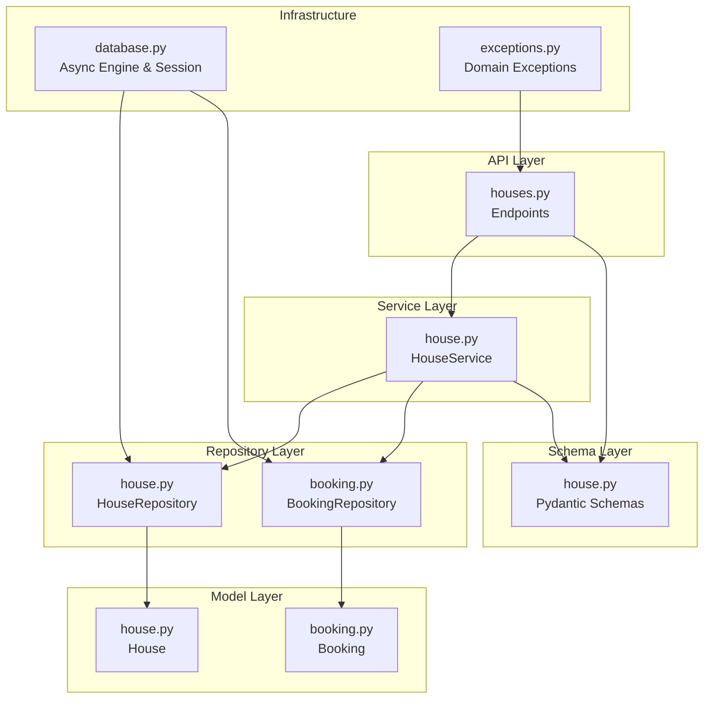

**Diagram sources**
- [houses.py:1-266](file://backend/api/houses.py#L1-L266)
- [house.py:51-253](file://backend/services/house.py#L51-L253)
- [house.py:12-183](file://backend/repositories/house.py#L12-L183)
- [booking.py:13-224](file://backend/repositories/booking.py#L13-L224)
- [house.py:9-24](file://backend/models/house.py#L9-L24)
- [booking.py:20-41](file://backend/models/booking.py#L20-L41)
- [house.py:1-107](file://backend/schemas/house.py#L1-L107)
- [database.py:1-41](file://backend/database.py#L1-L41)
- [exceptions.py:1-82](file://backend/exceptions.py#L1-L82)

**Section sources**
- [houses.py:1-266](file://backend/api/houses.py#L1-L266)
- [house.py:51-253](file://backend/services/house.py#L51-L253)
- [house.py:12-183](file://backend/repositories/house.py#L12-L183)
- [booking.py:13-224](file://backend/repositories/booking.py#L13-L224)
- [house.py:9-24](file://backend/models/house.py#L9-L24)
- [booking.py:20-41](file://backend/models/booking.py#L20-L41)
- [house.py:1-107](file://backend/schemas/house.py#L1-L107)
- [database.py:1-41](file://backend/database.py#L1-L41)
- [exceptions.py:1-82](file://backend/exceptions.py#L1-L82)

## Core Components
- HouseService: Implements property lifecycle operations (create, read, update, replace, delete), owner-specific filtering, and availability calendar computation. It depends on HouseRepository and BookingRepository.
- HouseRepository: Provides CRUD and filtering/pagination over the House model.
- BookingRepository: Supplies booking data for calendar computation and enforces cancellation exclusion.
- House model and schemas: Define persisted attributes and validated request/response shapes.
- API endpoints: Expose property operations and calendar retrieval with pagination, filtering, and sorting.

Key business rules:
- Validation: Name length limits, capacity minimum, is_active default true.
- Owner verification: API currently hardcodes owner_id for demo; production would enforce ownership.
- Availability calendar: Aggregates non-cancelled bookings for a house within an optional date range.
- Capacity management: Capacity is validated and stored; no explicit per-night capacity checks are enforced in the service.
- Property lifecycle: Creation, listing with filters, partial/full updates, deletion.

**Section sources**
- [house.py:51-253](file://backend/services/house.py#L51-L253)
- [house.py:12-183](file://backend/repositories/house.py#L12-L183)
- [house.py:1-107](file://backend/schemas/house.py#L1-L107)
- [house.py:9-24](file://backend/models/house.py#L9-L24)
- [booking.py:13-224](file://backend/repositories/booking.py#L13-L224)
- [houses.py:1-266](file://backend/api/houses.py#L1-L266)

## Architecture Overview
The property management flow integrates API, service, repository, and model layers. The service layer encapsulates business logic while delegating persistence to repositories.

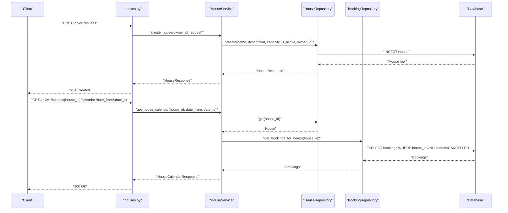

**Diagram sources**
- [houses.py:101-120](file://backend/api/houses.py#L101-L120)
- [houses.py:242-265](file://backend/api/houses.py#L242-L265)
- [house.py:71-91](file://backend/services/house.py#L71-L91)
- [house.py:207-252](file://backend/services/house.py#L207-L252)
- [house.py:23-53](file://backend/repositories/house.py#L23-L53)
- [booking.py:199-223](file://backend/repositories/booking.py#L199-L223)

## Detailed Component Analysis

### HouseService: Business Logic and Operations
HouseService centralizes property operations and calendar computation:
- Creation: Delegates to HouseRepository with owner_id and validated fields.
- Retrieval: Validates existence and raises HouseNotFoundError if missing.
- Listing: Applies owner_id, is_active, capacity_min/capacity_max filters, pagination, and sorting.
- Updates: Partial and full updates with validation; raises HouseNotFoundError if not found.
- Deletion: Validates existence and deletes via repository.
- Availability calendar: Fetches non-cancelled bookings for a house, optionally filtered by date range, and returns OccupiedDateRange entries.

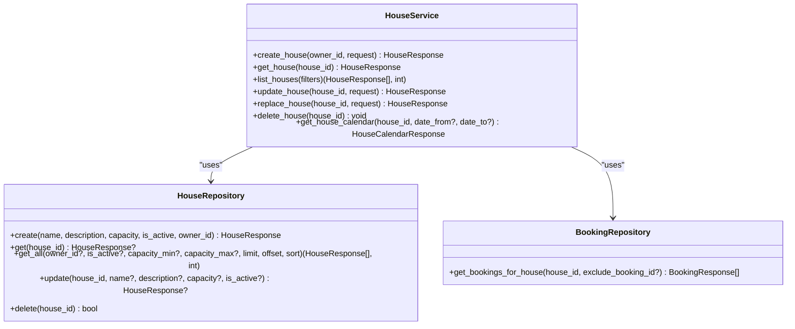

**Diagram sources**
- [house.py:51-253](file://backend/services/house.py#L51-L253)
- [house.py:12-183](file://backend/repositories/house.py#L12-L183)
- [booking.py:13-224](file://backend/repositories/booking.py#L13-L224)

**Section sources**
- [house.py:51-253](file://backend/services/house.py#L51-L253)

### HouseRepository: Filtering, Pagination, and Sorting
HouseRepository implements:
- Filtering: owner_id, is_active, capacity_min, capacity_max.
- Counting: total count via subquery aggregation.
- Sorting: supports ascending/descending by provided field names.
- Pagination: limit and offset.
- Update: partial updates with flush and refresh.

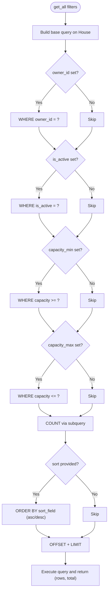

**Diagram sources**
- [house.py:68-127](file://backend/repositories/house.py#L68-L127)

**Section sources**
- [house.py:68-127](file://backend/repositories/house.py#L68-L127)

### Availability Calendar Management
HouseService.get_house_calendar computes the availability calendar:
- Retrieves house existence and raises HouseNotFoundError if absent.
- Fetches all non-cancelled bookings for the house.
- Optionally filters by date_from and date_to.
- Builds OccupiedDateRange entries with check_in, check_out, and booking_id.

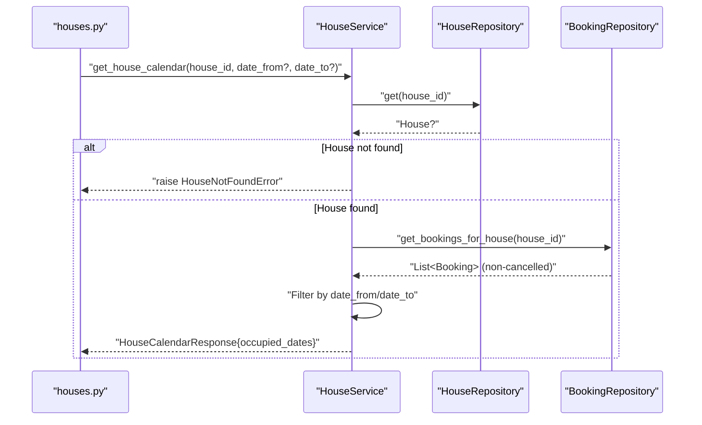

**Diagram sources**
- [house.py:207-252](file://backend/services/house.py#L207-L252)
- [booking.py:199-223](file://backend/repositories/booking.py#L199-L223)

**Section sources**
- [house.py:207-252](file://backend/services/house.py#L207-L252)
- [booking.py:199-223](file://backend/repositories/booking.py#L199-L223)

### Data Models and Schemas
- House model: id, name, description, capacity, owner_id, is_active, created_at.
- Booking model: house_id, tenant_id, check_in, check_out, guests_planned, guests_actual, total_amount, status, created_at.
- Pydantic schemas: validation for CreateHouseRequest, UpdateHouseRequest, HouseResponse, HouseFilterParams, HouseCalendarResponse, OccupiedDateRange.

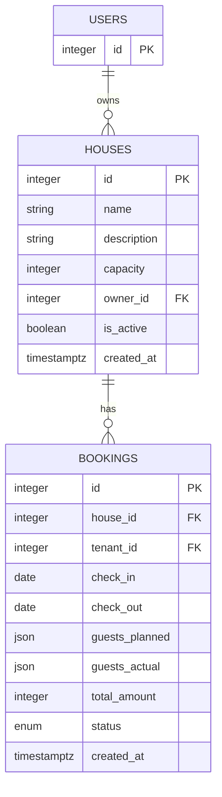

**Diagram sources**
- [house.py:9-24](file://backend/models/house.py#L9-L24)
- [booking.py:20-41](file://backend/models/booking.py#L20-L41)

**Section sources**
- [house.py:9-24](file://backend/models/house.py#L9-L24)
- [booking.py:20-41](file://backend/models/booking.py#L20-L41)
- [house.py:1-107](file://backend/schemas/house.py#L1-L107)

### API Endpoints and Workflows
- POST /api/v1/houses: Creates a house with validation and returns 201.
- GET /api/v1/houses: Lists houses with pagination, filtering, and sorting.
- GET /api/v1/houses/{house_id}: Retrieves a house by ID.
- PUT /api/v1/houses/{house_id}: Full replacement.
- PATCH /api/v1/houses/{house_id}: Partial update.
- DELETE /api/v1/houses/{house_id}: Deletes a house.
- GET /api/v1/houses/{house_id}/calendar: Returns occupied date ranges.

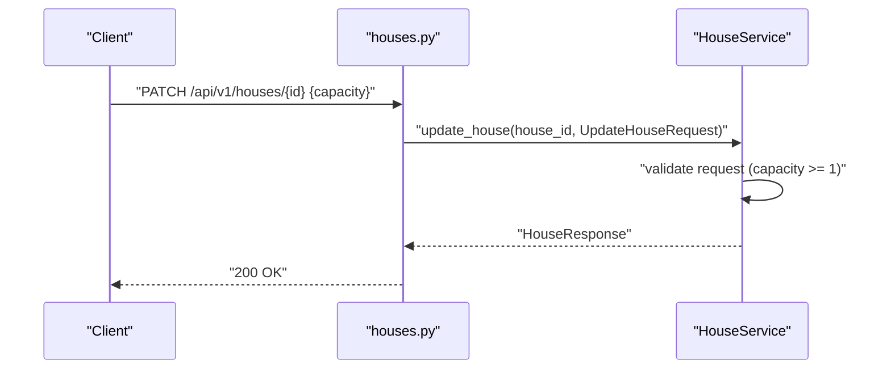

**Diagram sources**
- [houses.py:177-197](file://backend/api/houses.py#L177-L197)
- [house.py:132-160](file://backend/services/house.py#L132-L160)

**Section sources**
- [houses.py:1-266](file://backend/api/houses.py#L1-L266)

### Property Lifecycle Management
- Creation: Validates name length and capacity, sets defaults (e.g., is_active true).
- Listing: Supports owner-specific filtering, capacity ranges, pagination, and sorting.
- Updates: Partial updates preserve unspecified fields; full replacement replaces all fields.
- Deletion: Removes the house if it exists.

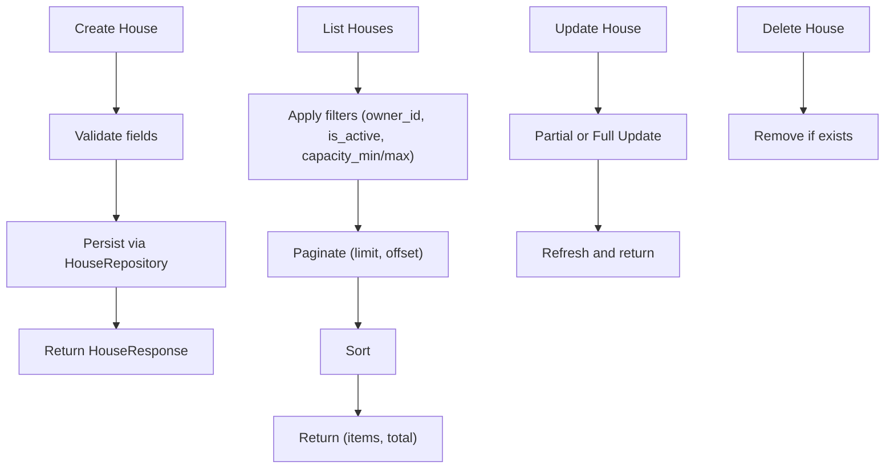

**Diagram sources**
- [house.py:71-91](file://backend/services/house.py#L71-L91)
- [house.py:110-130](file://backend/services/house.py#L110-L130)
- [house.py:132-190](file://backend/services/house.py#L132-L190)
- [house.py:167-182](file://backend/repositories/house.py#L167-L182)

**Section sources**
- [house.py:71-91](file://backend/services/house.py#L71-L91)
- [house.py:110-130](file://backend/services/house.py#L110-L130)
- [house.py:132-190](file://backend/services/house.py#L132-L190)
- [house.py:167-182](file://backend/repositories/house.py#L167-L182)

### Owner-Specific Property Operations
- API currently hardcodes owner_id for demonstration.
- Service accepts owner_id and passes it to repository during creation.
- Listing supports owner_id filter to restrict results to a specific owner.

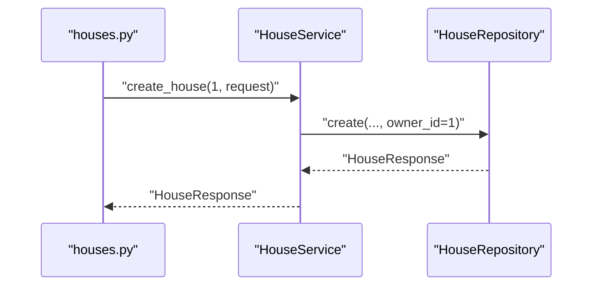

**Diagram sources**
- [houses.py:117-119](file://backend/api/houses.py#L117-L119)
- [house.py:71-91](file://backend/services/house.py#L71-L91)

**Section sources**
- [houses.py:117-119](file://backend/api/houses.py#L117-L119)
- [house.py:110-130](file://backend/services/house.py#L110-L130)

### Property Search Algorithms
- Filtering: Exact match on owner_id; equality on is_active; range filters on capacity_min/capacity_max.
- Sorting: Field-based sorting with optional descending order.
- Pagination: Standard limit/offset.

These are implemented in HouseRepository.get_all with SQL query construction and ordering.

**Section sources**
- [house.py:68-127](file://backend/repositories/house.py#L68-L127)
- [house.py:76-94](file://backend/schemas/house.py#L76-L94)

### Availability Conflict Detection and Capacity Constraint Enforcement
- Availability conflicts: The service does not compute date overlap conflicts among bookings; it only aggregates existing non-cancelled bookings for the calendar view. Conflict detection is handled in the booking service.
- Capacity constraints: The service validates capacity >= 1 during creation/update; it does not enforce per-stay occupancy against house capacity.

**Section sources**
- [house.py:207-252](file://backend/services/house.py#L207-L252)
- [house.py:23-53](file://backend/repositories/house.py#L23-L53)
- [house.py:62-65](file://backend/schemas/house.py#L62-L65)

## Dependency Analysis
- HouseService depends on HouseRepository and BookingRepository.
- HouseRepository depends on House model and HouseResponse schema.
- BookingRepository depends on Booking model and BookingStatus enum.
- API layer depends on HouseService and schemas.
- Exceptions are centralized and mapped to HTTP responses in main.py.

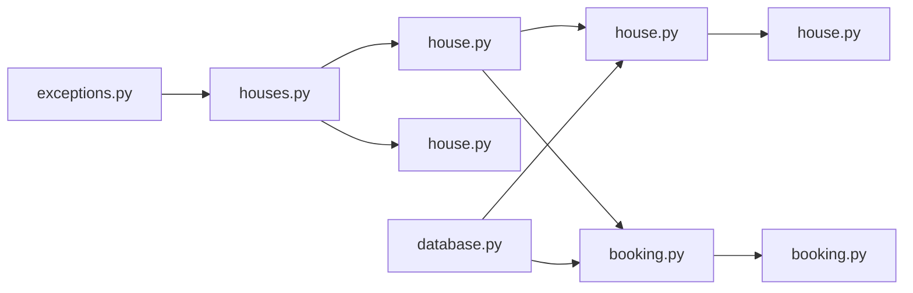

**Diagram sources**
- [houses.py:1-266](file://backend/api/houses.py#L1-L266)
- [house.py:51-253](file://backend/services/house.py#L51-L253)
- [house.py:12-183](file://backend/repositories/house.py#L12-L183)
- [booking.py:13-224](file://backend/repositories/booking.py#L13-L224)
- [house.py:9-24](file://backend/models/house.py#L9-L24)
- [booking.py:20-41](file://backend/models/booking.py#L20-L41)
- [house.py:1-107](file://backend/schemas/house.py#L1-L107)
- [exceptions.py:1-82](file://backend/exceptions.py#L1-L82)
- [database.py:1-41](file://backend/database.py#L1-L41)

**Section sources**
- [house.py:51-253](file://backend/services/house.py#L51-L253)
- [house.py:12-183](file://backend/repositories/house.py#L12-L183)
- [booking.py:13-224](file://backend/repositories/booking.py#L13-L224)
- [house.py:9-24](file://backend/models/house.py#L9-L24)
- [booking.py:20-41](file://backend/models/booking.py#L20-L41)
- [house.py:1-107](file://backend/schemas/house.py#L1-L107)
- [exceptions.py:1-82](file://backend/exceptions.py#L1-L82)
- [database.py:1-41](file://backend/database.py#L1-L41)

## Performance Considerations
- Query construction: HouseRepository builds dynamic queries with filters and sorts; ensure appropriate indexes on frequently filtered/sorted columns (e.g., owner_id, capacity).
- Counting: Total counts use a subquery; consider indexing for large datasets.
- Calendar computation: Non-cancelled bookings are fetched and filtered in Python; for large booking volumes, consider adding database-side filtering and aggregation.
- Pagination: Limit and offset are straightforward; consider cursor-based pagination for deep paging scenarios.

[No sources needed since this section provides general guidance]

## Troubleshooting Guide
Common errors and handling patterns:
- House not found: API raises 404 with error type "not_found".
- Validation failures: Pydantic validation produces 422 responses with field-specific errors.
- Capacity validation: Capacity must be >= 1; otherwise 422.
- Owner verification: Current API demo hardcodes owner_id; production should enforce ownership checks.

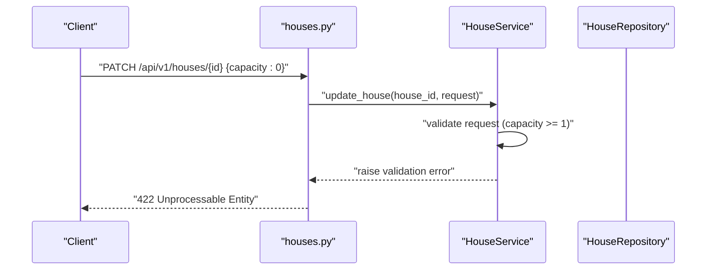

**Diagram sources**
- [houses.py:177-197](file://backend/api/houses.py#L177-L197)
- [house.py:132-160](file://backend/services/house.py#L132-L160)
- [house.py:62-65](file://backend/schemas/house.py#L62-L65)

**Section sources**
- [exceptions.py:60-66](file://backend/exceptions.py#L60-L66)
- [test_houses.py:76-98](file://backend/tests/test_houses.py#L76-L98)
- [house.py:132-160](file://backend/services/house.py#L132-L160)

## Conclusion
The property management feature provides a clean separation of concerns: API handles HTTP, Service encapsulates business logic, Repositories manage persistence, and Schemas enforce validation. HouseService supports robust property lifecycle operations, owner-specific filtering, and calendar computation. While capacity and conflict enforcement are validated at the schema level, deeper constraints (e.g., per-stay occupancy vs. house capacity, date overlap conflicts) are managed elsewhere in the system. The architecture is extensible for production-grade enhancements such as ownership enforcement, advanced search, and performance optimizations.

[No sources needed since this section summarizes without analyzing specific files]

## Appendices

### Concrete Examples from the Codebase
- Property creation workflow: POST /api/v1/houses with name, capacity, and optional description; returns 201 with HouseResponse.
- Owner property filtering: GET /api/v1/houses?owner_id={id} returns only properties owned by the specified user.
- Property search algorithms: GET /api/v1/houses with capacity_min/capacity_max, pagination (limit/offset), and sorting (name, -created_at).
- Availability calendar management: GET /api/v1/houses/{id}/calendar returns OccupiedDateRange entries for non-cancelled bookings; optional date_from/date_to filters.

**Section sources**
- [test_houses.py:10-43](file://backend/tests/test_houses.py#L10-L43)
- [test_houses.py:186-214](file://backend/tests/test_houses.py#L186-L214)
- [test_houses.py:247-291](file://backend/tests/test_houses.py#L247-L291)
- [test_houses.py:294-320](file://backend/tests/test_houses.py#L294-L320)
- [test_houses.py:567-760](file://backend/tests/test_houses.py#L567-L760)