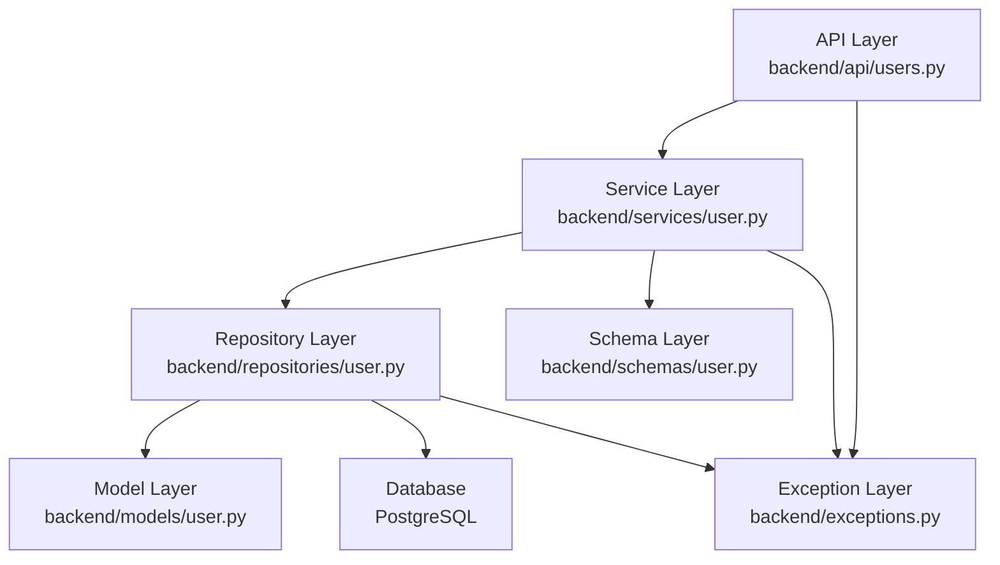
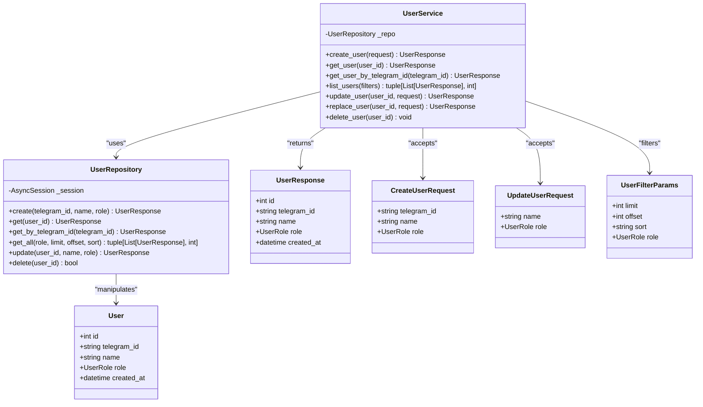
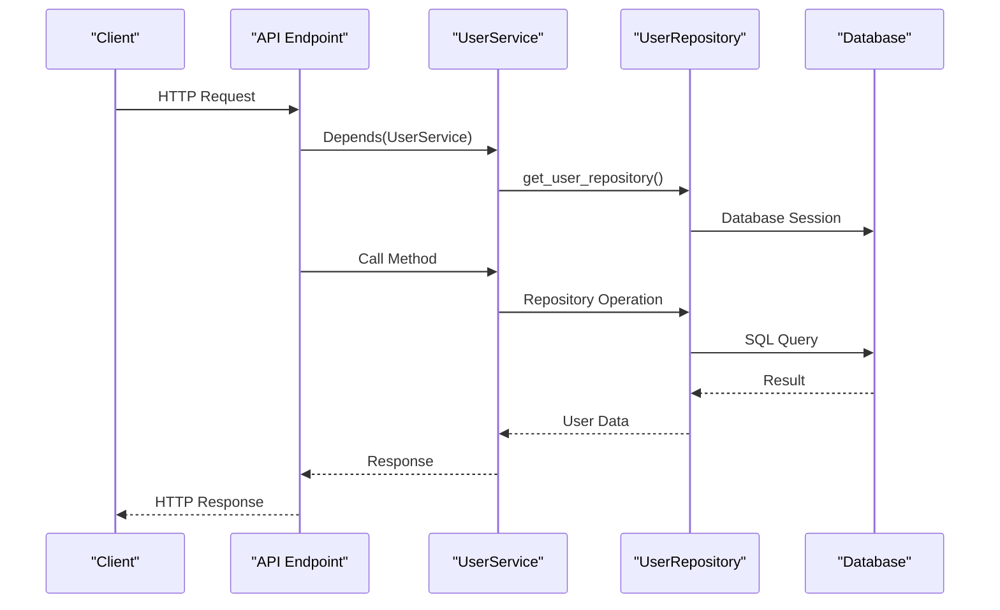
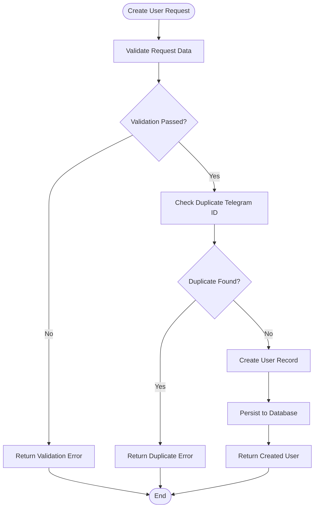
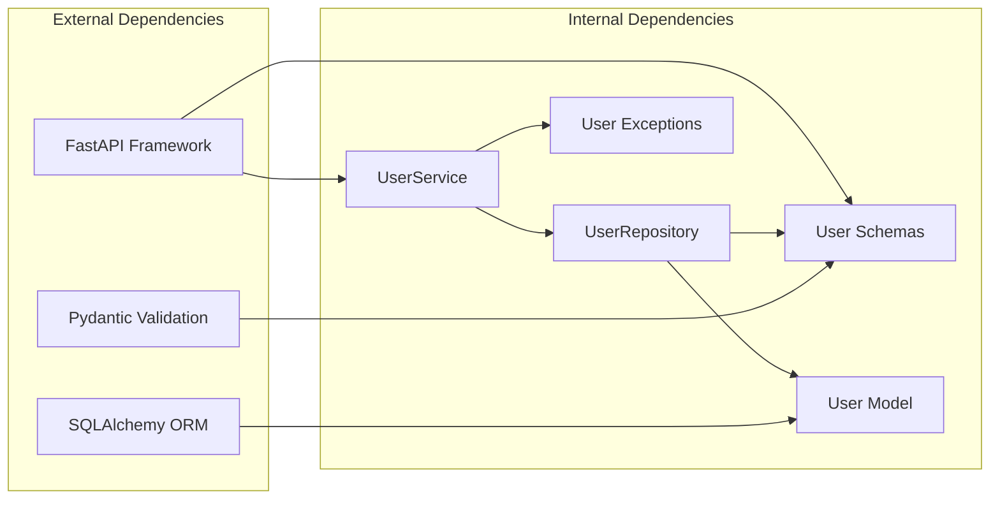
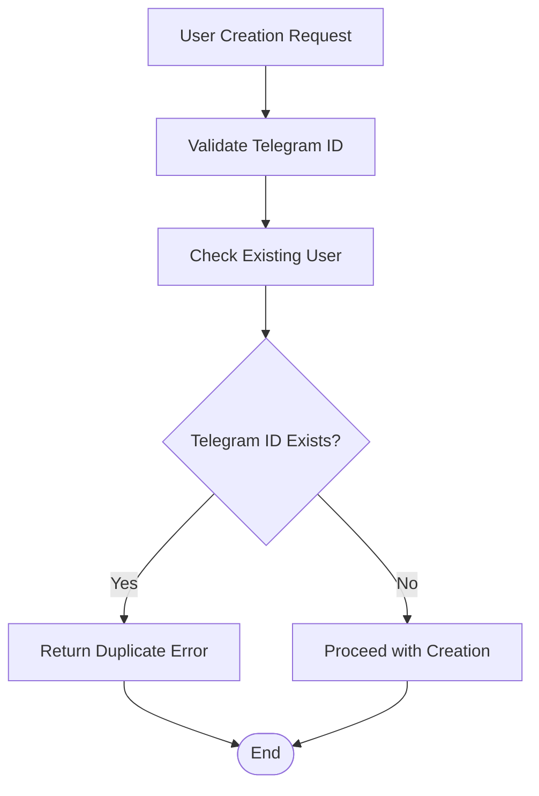

# User Service Business Logic

<cite>
**Referenced Files in This Document**
- [backend/services/user.py](file://backend/services/user.py)
- [backend/repositories/user.py](file://backend/repositories/user.py)
- [backend/models/user.py](file://backend/models/user.py)
- [backend/schemas/user.py](file://backend/schemas/user.py)
- [backend/api/users.py](file://backend/api/users.py)
- [backend/exceptions.py](file://backend/exceptions.py)
- [backend/database.py](file://backend/database.py)
- [backend/main.py](file://backend/main.py)
- [backend/tests/test_users.py](file://backend/tests/test_users.py)
- [alembic/versions/2a84cf51810b_initial_migration.py](file://alembic/versions/2a84cf51810b_initial_migration.py)
</cite>

## Table of Contents
1. [Introduction](#introduction)
2. [Project Structure](#project-structure)
3. [Core Components](#core-components)
4. [Architecture Overview](#architecture-overview)
5. [Detailed Component Analysis](#detailed-component-analysis)
6. [Dependency Analysis](#dependency-analysis)
7. [Performance Considerations](#performance-considerations)
8. [Troubleshooting Guide](#troubleshooting-guide)
9. [Conclusion](#conclusion)

## Introduction
This document provides comprehensive documentation for the user service business logic implementation. It covers the UserService class methods for user creation, retrieval, updates, and deletion operations. It explains business rules for user role management, Telegram ID validation, and user filtering mechanisms. The document details the dependency injection pattern used for UserRepository, error handling strategies including UserNotFoundError exceptions, and the relationship between the service layer and repository layer. Practical examples demonstrate CRUD operations, filter parameter usage, and role-based access patterns, addressing common user management scenarios such as duplicate Telegram ID detection, partial versus full user updates, and user lifecycle management.

## Project Structure
The user service follows a layered architecture with clear separation between the API layer, service layer, repository layer, and persistence layer. The API layer handles HTTP requests and responses, the service layer encapsulates business logic, the repository layer manages data access, and the persistence layer interacts with the database.

**Diagram sources**
- [backend/api/users.py:1-223](file://backend/api/users.py#L1-L223)
- [backend/services/user.py:1-183](file://backend/services/user.py#L1-L183)
- [backend/repositories/user.py:1-168](file://backend/repositories/user.py#L1-L168)
- [backend/models/user.py:1-32](file://backend/models/user.py#L1-L32)
- [backend/schemas/user.py:1-72](file://backend/schemas/user.py#L1-L72)
- [backend/exceptions.py:1-82](file://backend/exceptions.py#L1-L82)

**Section sources**
- [backend/api/users.py:1-223](file://backend/api/users.py#L1-L223)
- [backend/services/user.py:1-183](file://backend/services/user.py#L1-L183)
- [backend/repositories/user.py:1-168](file://backend/repositories/user.py#L1-L168)
- [backend/models/user.py:1-32](file://backend/models/user.py#L1-L32)
- [backend/schemas/user.py:1-72](file://backend/schemas/user.py#L1-L72)
- [backend/exceptions.py:1-82](file://backend/exceptions.py#L1-L82)

## Core Components
The user service consists of several core components that work together to provide complete user management functionality:

### User Model and Roles
The User model defines the data structure and constraints for user entities, including role enumeration and unique Telegram ID constraints.

### User Service Layer
The UserService class encapsulates all business logic for user operations, providing methods for CRUD operations and validation.

### User Repository Layer
The UserRepository class handles all database interactions, implementing the actual SQL operations for user data management.

### User Schemas
Pydantic schemas define the data structures for user requests, responses, and filtering parameters.

**Section sources**
- [backend/models/user.py:11-32](file://backend/models/user.py#L11-L32)
- [backend/services/user.py:33-183](file://backend/services/user.py#L33-L183)
- [backend/repositories/user.py:12-168](file://backend/repositories/user.py#L12-L168)
- [backend/schemas/user.py:10-72](file://backend/schemas/user.py#L10-L72)

## Architecture Overview
The user service implements a clean architecture pattern with clear separation of concerns:

**Diagram sources**
- [backend/services/user.py:33-183](file://backend/services/user.py#L33-L183)
- [backend/repositories/user.py:12-168](file://backend/repositories/user.py#L12-L168)
- [backend/models/user.py:19-32](file://backend/models/user.py#L19-L32)
- [backend/schemas/user.py:25-72](file://backend/schemas/user.py#L25-L72)

## Detailed Component Analysis

### User Service Implementation
The UserService class provides comprehensive business logic for user management operations:

#### Dependency Injection Pattern
The service uses FastAPI's dependency injection system to obtain UserRepository instances:

**Diagram sources**
- [backend/services/user.py:19-31](file://backend/services/user.py#L19-L31)
- [backend/api/users.py:14-16](file://backend/api/users.py#L14-L16)

#### User Creation Operations
The create_user method handles user registration with validation and persistence:

**Diagram sources**
- [backend/services/user.py:50-63](file://backend/services/user.py#L50-L63)
- [backend/repositories/user.py:23-43](file://backend/repositories/user.py#L23-L43)

#### User Retrieval Operations
Multiple retrieval methods support different access patterns:

- **get_user**: Retrieves user by numeric ID with UserNotFoundError handling
- **get_user_by_telegram_id**: Retrieves user by Telegram ID for bot authentication
- **list_users**: Provides filtered, paginated, and sorted user listings

#### Update Operations
The service supports both partial and full user updates:

- **update_user**: Partial updates using UpdateUserRequest (optional fields)
- **replace_user**: Full replacement using CreateUserRequest (all fields required)

#### Deletion Operations
The delete_user method ensures proper error handling for non-existent users.

**Section sources**
- [backend/services/user.py:50-183](file://backend/services/user.py#L50-L183)
- [backend/api/users.py:85-223](file://backend/api/users.py#L85-L223)

### User Repository Implementation
The UserRepository class implements all database operations using SQLAlchemy async ORM:

#### Database Session Management
The repository receives an AsyncSession through dependency injection, ensuring proper transaction handling and session lifecycle management.

#### Query Construction and Execution
The repository builds dynamic queries based on provided filters, applying:
- Role-based filtering
- Pagination with limit/offset
- Sorting with optional descending order
- Count queries for pagination metadata

#### Data Validation and Transformation
Each repository method validates incoming data and transforms results to Pydantic models for type safety.

**Section sources**
- [backend/repositories/user.py:12-168](file://backend/repositories/user.py#L12-L168)

### User Model and Database Schema
The User model defines the complete data structure with business constraints:

#### Role Management
User roles are defined as an enumeration with three possible values:
- TENANT: Property tenant
- OWNER: Property owner  
- BOTH: Both tenant and owner roles

#### Unique Constraints
- Telegram ID is unique and indexed for efficient lookups
- Numeric ID serves as primary key
- Automatic timestamps track creation

#### Database Migration
The initial migration creates the users table with appropriate constraints and indexes.

**Section sources**
- [backend/models/user.py:11-32](file://backend/models/user.py#L11-L32)
- [alembic/versions/2a84cf51810b_initial_migration.py:31-40](file://alembic/versions/2a84cf51810b_initial_migration.py#L31-L40)

### User Schemas and Validation
Pydantic schemas provide comprehensive data validation and serialization:

#### Request Validation
- CreateUserRequest: Validates Telegram ID presence and role enumeration
- UpdateUserRequest: Allows partial updates with optional fields
- UserFilterParams: Provides pagination, sorting, and filtering capabilities

#### Response Serialization
UserResponse schema ensures consistent output format with automatic attribute mapping.

**Section sources**
- [backend/schemas/user.py:18-72](file://backend/schemas/user.py#L18-L72)

### API Integration and Error Handling
The API layer integrates the user service with proper HTTP semantics:

#### HTTP Status Codes
- 200: Successful operations
- 201: User creation
- 204: Successful deletion
- 404: Not found errors
- 422: Validation errors

#### Exception Handling
Global exception handlers convert domain-specific exceptions to standardized error responses.

**Section sources**
- [backend/api/users.py:19-223](file://backend/api/users.py#L19-L223)
- [backend/main.py:134-142](file://backend/main.py#L134-L142)

## Dependency Analysis
The user service demonstrates excellent dependency management through inversion of control:

**Diagram sources**
- [backend/services/user.py:1-16](file://backend/services/user.py#L1-L16)
- [backend/repositories/user.py:1-9](file://backend/repositories/user.py#L1-L9)
- [backend/api/users.py:1-16](file://backend/api/users.py#L1-L16)

### Coupling and Cohesion
- **Low Coupling**: Services depend on abstractions (interfaces) rather than concrete implementations
- **High Cohesion**: Each component has a single responsibility and focused functionality
- **Clear Contracts**: Well-defined interfaces between layers reduce complexity

### Circular Dependencies
The architecture avoids circular dependencies through:
- Single-direction data flow (API → Service → Repository → Model)
- Dependency injection eliminates compile-time coupling
- Clear separation of concerns prevents tight coupling

**Section sources**
- [backend/services/user.py:19-48](file://backend/services/user.py#L19-L48)
- [backend/repositories/user.py:15-21](file://backend/repositories/user.py#L15-L21)

## Performance Considerations
The user service implementation includes several performance optimizations:

### Database Indexing
- Primary key indexing on numeric ID for fast lookups
- Unique index on Telegram ID for efficient authentication
- Proper indexing on sortable fields for query performance

### Query Optimization
- Separate count queries prevent expensive COUNT(*) operations
- Dynamic query building allows selective filtering
- Efficient pagination with OFFSET/LIMIT

### Memory Management
- Async session management prevents connection leaks
- Proper session cleanup and rollback handling
- Minimal data transfer between layers

### Caching Opportunities
While not currently implemented, potential caching strategies could include:
- User lookup caching for frequently accessed users
- Role-based access control caching
- Recent user activity caching

## Troubleshooting Guide

### Common User Management Scenarios

#### Duplicate Telegram ID Detection
The system prevents duplicate Telegram IDs through database constraints and service validation:

**Diagram sources**
- [backend/repositories/user.py:23-43](file://backend/repositories/user.py#L23-L43)
- [alembic/versions/2a84cf51810b_initial_migration.py:33-40](file://alembic/versions/2a84cf51810b_initial_migration.py#L33-L40)

#### Partial vs Full User Updates
The service supports both update patterns:

- **Partial Updates**: Only provided fields are modified, preserving existing values
- **Full Replacement**: All fields are replaced with new values

#### User Lifecycle Management
Complete user lifecycle from creation to deletion:
1. **Creation**: Validation → Duplicate check → Database insertion
2. **Retrieval**: Individual lookup → Bulk listing with filters
3. **Updates**: Partial or full modifications
4. **Deletion**: Existence verification → Database removal

### Error Handling Patterns
The system implements comprehensive error handling:

#### UserNotFoundError
- Thrown when attempting operations on non-existent users
- Converted to HTTP 404 responses
- Provides meaningful error messages

#### Validation Errors
- Pydantic validation errors return HTTP 422
- Specific field validation failures are reported
- Role enumeration validation prevents invalid values

#### Database Errors
- Unique constraint violations handled gracefully
- Transaction rollback on errors
- Session cleanup prevents resource leaks

**Section sources**
- [backend/services/user.py:74-80](file://backend/services/user.py#L74-L80)
- [backend/exceptions.py:68-74](file://backend/exceptions.py#L68-L74)
- [backend/main.py:134-142](file://backend/main.py#L134-L142)

### Testing Strategies
The test suite demonstrates proper usage patterns:

#### CRUD Operation Testing
- Create: Valid data, default values, invalid roles
- Read: Existing users, non-existent users
- Update: Partial updates, full replacement, invalid data
- Delete: Successful deletion, non-existent users

#### Filtering and Pagination Testing
- Role-based filtering
- Pagination with limit/offset
- Sorting with ascending/descending order

**Section sources**
- [backend/tests/test_users.py:6-386](file://backend/tests/test_users.py#L6-L386)

## Conclusion
The user service business logic implementation demonstrates excellent software engineering practices with clear separation of concerns, robust error handling, and comprehensive testing. The layered architecture provides flexibility for future enhancements while maintaining simplicity and reliability. Key strengths include:

- **Clean Architecture**: Well-separated layers with clear responsibilities
- **Dependency Injection**: Flexible service composition and testing
- **Comprehensive Validation**: Multi-layered data validation
- **Robust Error Handling**: Consistent error responses and user feedback
- **Extensive Testing**: Coverage of all major use cases and edge cases

The implementation successfully addresses all documented requirements for user management, including role-based access patterns, filtering mechanisms, and proper error handling strategies. The codebase serves as a solid foundation for further development and extension of user-related functionality.