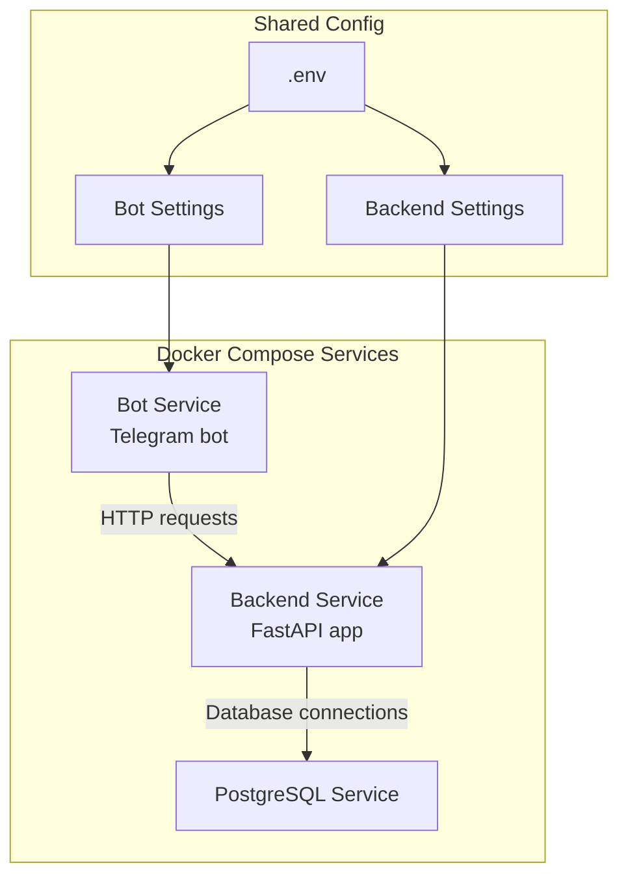
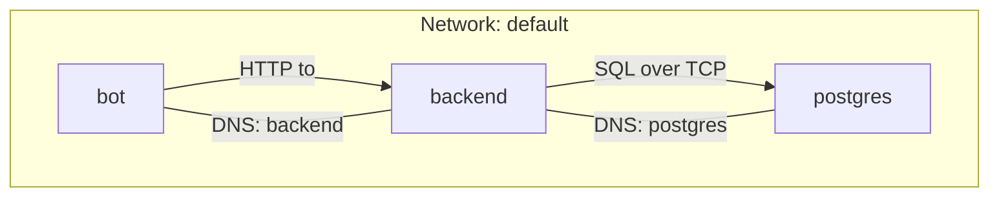
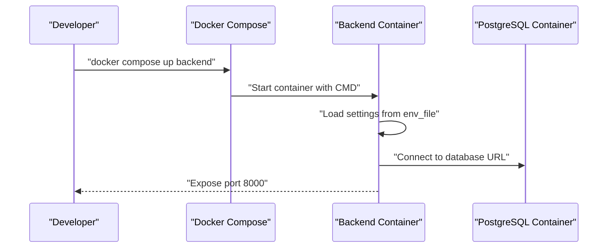
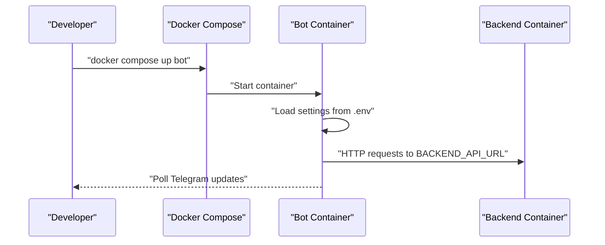
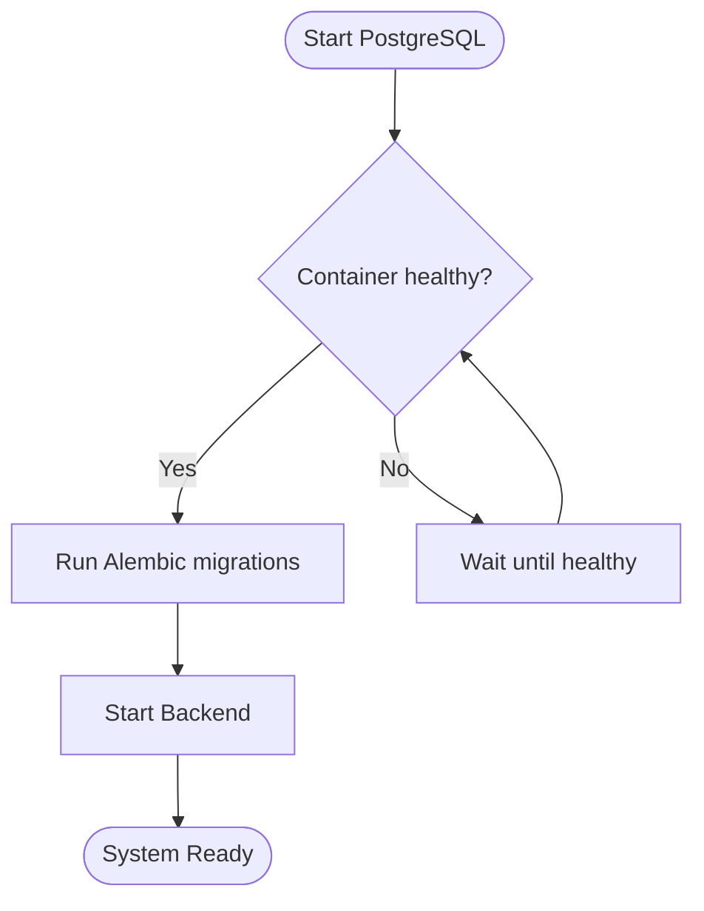
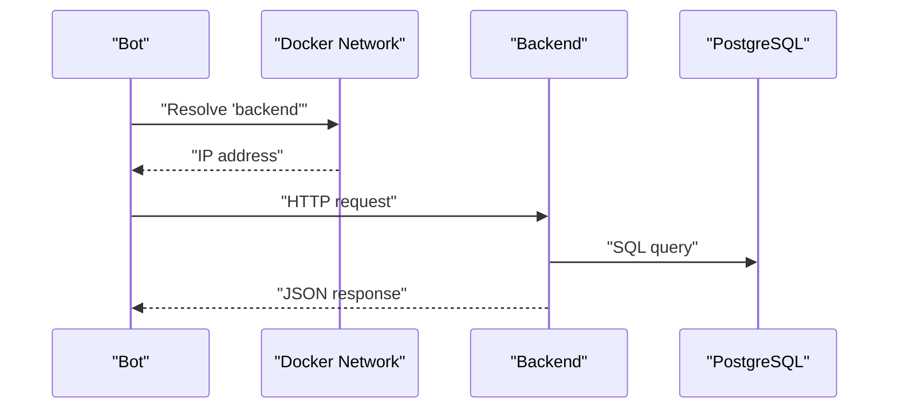
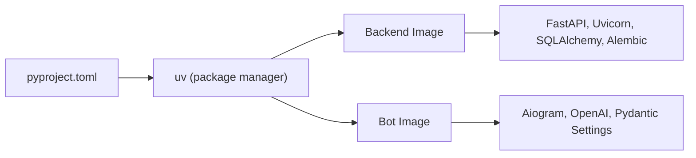

# Configuration and Deployment

<cite>
**Referenced Files in This Document**
- [Dockerfile](file://Dockerfile)
- [Dockerfile.backend](file://Dockerfile.backend)
- [docker-compose.yaml](file://docker-compose.yaml)
- [docker-compose.override.yml](file://docker-compose.override.yml)
- [backend/config.py](file://backend/config.py)
- [bot/config.py](file://bot/config.py)
- [.env](file://.env)
- [backend/main.py](file://backend/main.py)
- [bot/main.py](file://bot/main.py)
- [Makefile](file://Makefile)
- [pyproject.toml](file://pyproject.toml)
- [backend/database.py](file://backend/database.py)
- [README.md](file://README.md)
</cite>

## Table of Contents
1. [Introduction](#introduction)
2. [Project Structure](#project-structure)
3. [Core Components](#core-components)
4. [Architecture Overview](#architecture-overview)
5. [Detailed Component Analysis](#detailed-component-analysis)
6. [Dependency Analysis](#dependency-analysis)
7. [Performance Considerations](#performance-considerations)
8. [Troubleshooting Guide](#troubleshooting-guide)
9. [Conclusion](#conclusion)
10. [Appendices](#appendices)

## Introduction
This document explains how to configure and deploy the multi-service Docker-based architecture for the booking platform. It covers environment setup, configuration management, and deployment strategies for both development and production. It documents Docker containerization, service orchestration with Docker Compose, inter-service communication, and operational practices such as scaling, networking, and volume management. Practical examples demonstrate local development and production deployment flows, along with security considerations and common issues.

## Project Structure
The repository organizes the system into:
- A backend service exposing a FastAPI application and managing an asynchronous database connection.
- A Telegram bot service that communicates with the backend via HTTP and integrates with an LLM provider.
- A shared environment configuration managed via .env and Pydantic Settings.
- Docker images built from dedicated Dockerfiles and orchestrated by Docker Compose with an override for development.

**Diagram sources**
- [docker-compose.yaml:1-43](file://docker-compose.yaml#L1-L43)
- [docker-compose.override.yml:1-13](file://docker-compose.override.yml#L1-L13)
- [backend/config.py:1-25](file://backend/config.py#L1-L25)
- [bot/config.py:1-67](file://bot/config.py#L1-L67)
- [.env:1-13](file://.env#L1-L13)

**Section sources**
- [docker-compose.yaml:1-43](file://docker-compose.yaml#L1-L43)
- [docker-compose.override.yml:1-13](file://docker-compose.override.yml#L1-L13)
- [backend/config.py:1-25](file://backend/config.py#L1-L25)
- [bot/config.py:1-67](file://bot/config.py#L1-L67)
- [.env:1-13](file://.env#L1-L13)

## Core Components
- Backend service
  - Exposes a FastAPI application with health checks and CORS.
  - Loads configuration from environment variables via Pydantic Settings with a prefix.
  - Manages an asynchronous database engine and session factory.
- Bot service
  - Initializes a Telegram Bot and Dispatcher, sets up logging and optional proxy.
  - Integrates with a BackendClient and an LLM service using settings loaded from .env.
- Orchestration
  - Docker Compose defines services, volumes, healthchecks, and environment propagation.
  - An override file maps ports and adjusts bot networking for development scenarios.
- Environment configuration
  - .env centralizes secrets and runtime settings for both services.
  - Pydantic Settings classes define typed configuration with defaults and prefixes.

Key configuration surfaces:
- Backend settings keys prefixed with BACKEND_.
- Bot settings keys without prefix, loaded from .env.
- Environment variables injected via Docker Compose and env_file.

**Section sources**
- [backend/main.py:1-173](file://backend/main.py#L1-L173)
- [backend/config.py:1-25](file://backend/config.py#L1-L25)
- [backend/database.py:1-41](file://backend/database.py#L1-L41)
- [bot/main.py:1-46](file://bot/main.py#L1-L46)
- [bot/config.py:1-67](file://bot/config.py#L1-L67)
- [docker-compose.yaml:1-43](file://docker-compose.yaml#L1-L43)
- [docker-compose.override.yml:1-13](file://docker-compose.override.yml#L1-L13)
- [.env:1-13](file://.env#L1-L13)

## Architecture Overview
The system comprises three primary containers:
- PostgreSQL: persistent relational storage for the booking domain.
- Backend: FastAPI application serving the booking API, with health checks and database connectivity.
- Bot: Telegram bot communicating with the backend and an LLM provider.

Inter-service communication:
- Bot invokes Backend API endpoints over HTTP.
- Backend connects to PostgreSQL using a configured database URL.
- Docker Compose networks services together by default, enabling service-to-service DNS resolution.

**Diagram sources**
- [docker-compose.yaml:1-43](file://docker-compose.yaml#L1-L43)
- [backend/config.py:17-18](file://backend/config.py#L17-L18)
- [bot/config.py:56](file://bot/config.py#L56)

**Section sources**
- [docker-compose.yaml:1-43](file://docker-compose.yaml#L1-L43)
- [backend/config.py:17-18](file://backend/config.py#L17-L18)
- [bot/config.py:56](file://bot/config.py#L56)

## Detailed Component Analysis

### Backend Service Configuration and Containerization
- Containerization
  - Built from Dockerfile.backend, installs dependencies with uv, copies backend code, exposes port 8000, and runs the FastAPI module.
- Configuration
  - Settings class defines server host/port, database URL, and log level with BACKEND_ prefix and env_file binding.
  - Database engine uses the configured URL and provides an async session factory.
- Runtime
  - FastAPI app initializes logging, CORS, routes, and health endpoint.
  - Uvicorn can run the app directly when executed locally; Docker Compose runs via uv run.

**Diagram sources**
- [Dockerfile.backend:1-20](file://Dockerfile.backend#L1-L20)
- [backend/config.py:1-25](file://backend/config.py#L1-L25)
- [backend/database.py:1-41](file://backend/database.py#L1-L41)
- [docker-compose.yaml:21-39](file://docker-compose.yaml#L21-L39)

**Section sources**
- [Dockerfile.backend:1-20](file://Dockerfile.backend#L1-L20)
- [backend/config.py:1-25](file://backend/config.py#L1-L25)
- [backend/database.py:1-41](file://backend/database.py#L1-L41)
- [backend/main.py:1-173](file://backend/main.py#L1-L173)
- [docker-compose.yaml:21-39](file://docker-compose.yaml#L21-L39)

### Bot Service Configuration and Containerization
- Containerization
  - Built from the root Dockerfile, installs dependencies with uv, copies project files, and runs the bot module.
- Configuration
  - Settings class loads tokens, LLM provider details, system prompt, logging level, and backend API URL from .env.
  - Optional proxy support is available via an environment variable.
- Runtime
  - Initializes logging, optional proxy session, Telegram Bot and Dispatcher, and wires BackendClient and LLMService.

**Diagram sources**
- [Dockerfile:1-13](file://Dockerfile#L1-L13)
- [bot/config.py:1-67](file://bot/config.py#L1-L67)
- [bot/main.py:1-46](file://bot/main.py#L1-L46)
- [docker-compose.yaml:16-19](file://docker-compose.yaml#L16-L19)

**Section sources**
- [Dockerfile:1-13](file://Dockerfile#L1-L13)
- [bot/config.py:1-67](file://bot/config.py#L1-L67)
- [bot/main.py:1-46](file://bot/main.py#L1-L46)
- [docker-compose.yaml:16-19](file://docker-compose.yaml#L16-L19)

### Environment Management and Secrets
- Centralized configuration
  - .env holds tokens, provider URLs, logging level, and backend API URL.
  - Backend reads settings with BACKEND_ prefix; Bot reads settings directly from .env.
- Docker Compose integration
  - Both services reference .env via env_file.
  - Backend injects explicit environment variables for host, port, log level, and database URL.
- Security considerations
  - Store .env in a secure location and restrict filesystem permissions.
  - Avoid committing secrets to version control; use secrets management in production.
  - Prefer short-lived tokens and least-privilege credentials.

**Section sources**
- [.env:1-13](file://.env#L1-L13)
- [backend/config.py:7-11](file://backend/config.py#L7-L11)
- [bot/config.py:47](file://bot/config.py#L47)
- [docker-compose.yaml:18-31](file://docker-compose.yaml#L18-L31)

### Database Service and Migrations
- PostgreSQL service
  - Uses official postgres:16-alpine image with healthcheck and named volume for persistence.
- Migrations
  - Alembic commands are invoked inside the backend container via Docker Compose exec.
  - Migrations are applied after the database is ready and backend is started.

**Diagram sources**
- [docker-compose.yaml:2-14](file://docker-compose.yaml#L2-L14)
- [Makefile:57-64](file://Makefile#L57-L64)

**Section sources**
- [docker-compose.yaml:2-14](file://docker-compose.yaml#L2-L14)
- [Makefile:57-64](file://Makefile#L57-L64)

### Inter-Service Communication
- DNS-based service discovery
  - Bot resolves backend via service name "backend" on port 8000.
  - Backend resolves postgres via service name "postgres".
- Port exposure and mapping
  - Backend exposes 8000; development override maps 8001:8000 for local access.
- Network mode for development
  - Bot uses network_mode: container:<name> to share a VPN container’s network stack for outbound access.

**Diagram sources**
- [docker-compose.yaml:30](file://docker-compose.yaml#L30)
- [docker-compose.override.yml:8](file://docker-compose.override.yml#L8)

**Section sources**
- [docker-compose.yaml:30](file://docker-compose.yaml#L30)
- [docker-compose.override.yml:8](file://docker-compose.override.yml#L8)

### Development vs Production Strategies
- Local development
  - Run PostgreSQL, apply migrations, start backend, then start the bot in separate terminals.
  - Use docker-compose.override.yml to map ports and adjust bot networking.
- Production deployment
  - Replace local overrides with production networking and secrets management.
  - Use external load balancers, reverse proxies, and secrets stores.
  - Scale backend replicas behind a load balancer; keep one bot replica or scale as needed.

**Section sources**
- [README.md:59-80](file://README.md#L59-L80)
- [docker-compose.override.yml:1-13](file://docker-compose.override.yml#L1-13)

## Dependency Analysis
- Python dependencies are declared in pyproject.toml with dev groups for linting and testing.
- uv is used for deterministic dependency installation in containers.
- Backend depends on FastAPI, Uvicorn, SQLAlchemy asyncio, Alembic, and others.
- Bot depends on Aiogram, OpenAI, and Pydantic Settings.

**Diagram sources**
- [pyproject.toml:1-32](file://pyproject.toml#L1-L32)
- [Dockerfile.backend:6-12](file://Dockerfile.backend#L6-L12)
- [Dockerfile:5](file://Dockerfile#L5)

**Section sources**
- [pyproject.toml:1-32](file://pyproject.toml#L1-L32)
- [Dockerfile.backend:6-12](file://Dockerfile.backend#L6-L12)
- [Dockerfile:5](file://Dockerfile#L5)

## Performance Considerations
- Container startup order
  - Use depends_on with service_healthy to ensure PostgreSQL is ready before starting backend.
- Resource limits
  - Define CPU/memory limits in production to prevent resource contention.
- Database tuning
  - Adjust pool size and timeouts in the backend database configuration for concurrent load.
- Caching and concurrency
  - Consider adding caching layers (e.g., Redis) and rate limiting for bot traffic.
- Logging
  - Set appropriate log levels in .env to balance observability and overhead.

[No sources needed since this section provides general guidance]

## Troubleshooting Guide
Common issues and resolutions:
- Backend fails to connect to database
  - Verify DATABASE_URL in backend environment variables and that PostgreSQL is healthy.
  - Confirm the database URL format and credentials match the .env and docker-compose configuration.
- Port conflicts during local development
  - Use the override mapping 8001:8000 for backend and ensure no other process binds to 8001.
- Bot cannot reach backend
  - Ensure BACKEND_API_URL points to the backend service name and port.
  - Confirm network_mode settings in the override file if using a shared VPN container.
- Health checks fail
  - Review PostgreSQL healthcheck and retry intervals; ensure the database is reachable.
- Running migrations
  - Apply migrations after PostgreSQL is healthy and backend is running; use the provided Makefile targets.

**Section sources**
- [docker-compose.yaml:29](file://docker-compose.yaml#L29)
- [docker-compose.override.yml:3-12](file://docker-compose.override.yml#L3-L12)
- [Makefile:57-64](file://Makefile#L57-L64)

## Conclusion
The repository provides a robust, container-first foundation for the booking platform. Docker Compose orchestrates PostgreSQL, the backend API, and the Telegram bot, while .env and Pydantic Settings manage configuration consistently across services. By following the documented environment setup, deployment steps, and operational practices, teams can confidently run local development and production-grade deployments, scale services, and troubleshoot common issues.

[No sources needed since this section summarizes without analyzing specific files]

## Appendices

### Environment Variables Reference
- Backend (BACKEND_ prefix)
  - BACKEND_HOST: server host binding
  - BACKEND_PORT: server port
  - BACKEND_LOG_LEVEL: logging verbosity
  - BACKEND_DATABASE_URL: SQLAlchemy async database URL
- Bot
  - TELEGRAM_BOT_TOKEN: Telegram bot token
  - BOT_USERNAME: bot username
  - ROUTERAI_API_KEY: LLM provider API key
  - ROUTERAI_BASE_URL: LLM base URL
  - LLM_MODEL: model identifier
  - LOG_LEVEL: logging verbosity
  - BACKEND_API_URL: backend HTTP endpoint
  - PROXY_URL: optional proxy URL for outbound requests

**Section sources**
- [backend/config.py:14-21](file://backend/config.py#L14-L21)
- [bot/config.py:49-60](file://bot/config.py#L49-L60)
- [.env:1-8](file://.env#L1-L8)

### Docker Compose Commands Quick Reference
- Build and start services
  - docker compose build
  - docker compose up -d
- Backend lifecycle
  - make run-backend
  - make run-backend-logs
  - make stop-backend
  - make build-backend
- Testing and linting
  - make test-backend
  - make lint-backend
  - make format-backend
- Database migrations
  - make migrate
  - make migrate-create
  - make migrate-down
- PostgreSQL management
  - make postgres-up
  - make postgres-logs

**Section sources**
- [Makefile:16-71](file://Makefile#L16-L71)