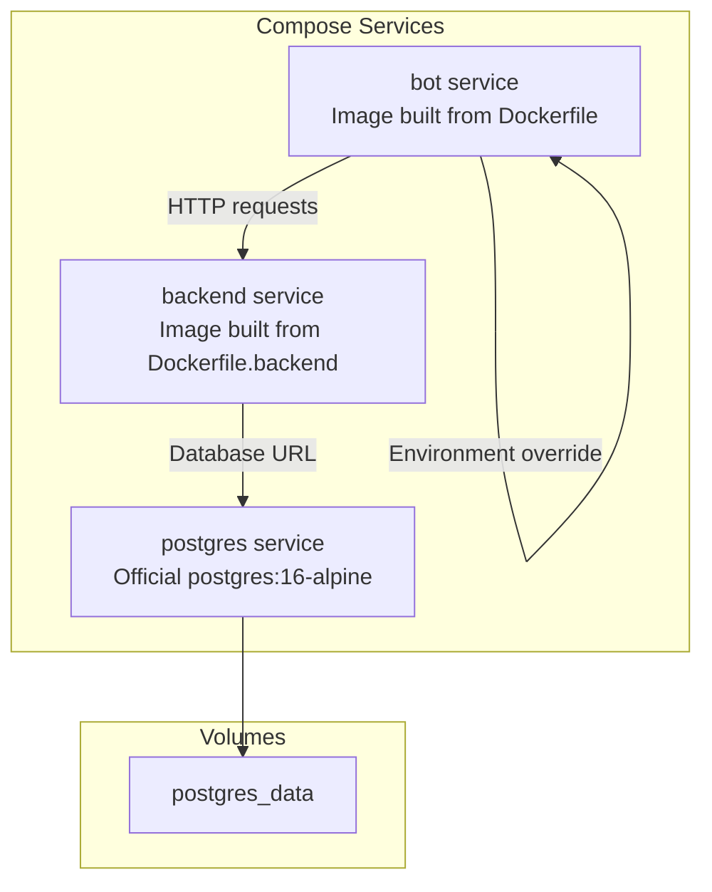
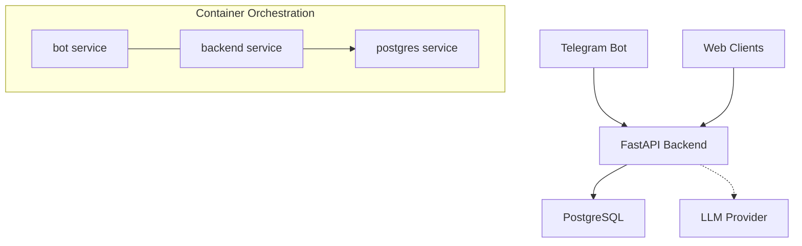
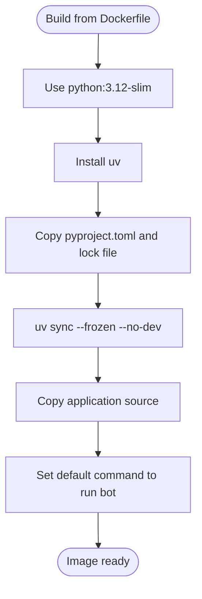
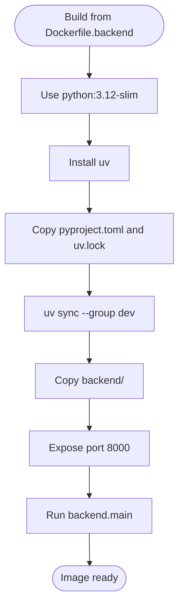
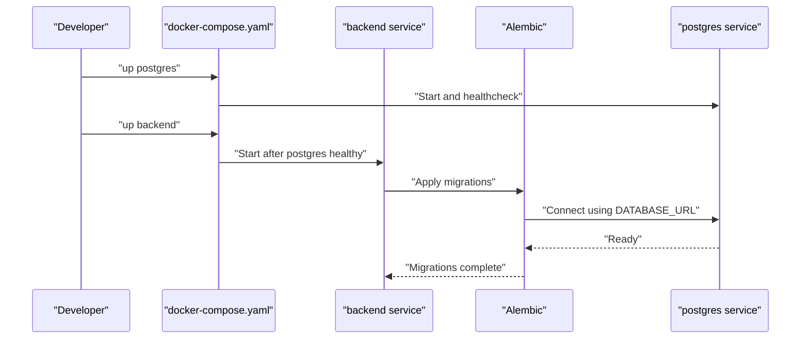
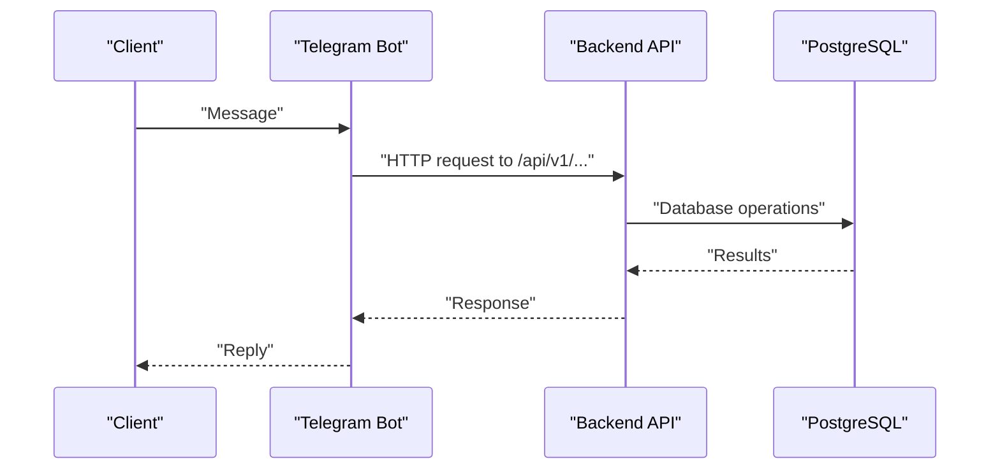
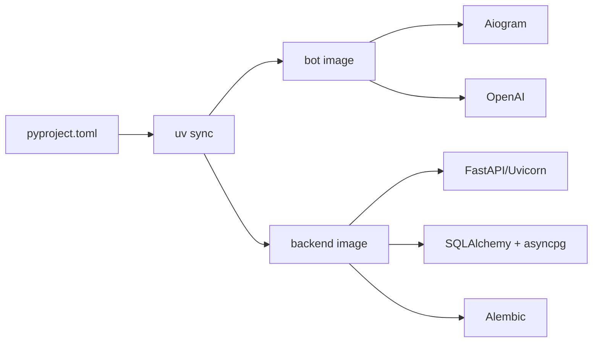

# Docker and Containerization

<cite>
**Referenced Files in This Document**
- [Dockerfile](file://Dockerfile)
- [Dockerfile.backend](file://Dockerfile.backend)
- [docker-compose.yaml](file://docker-compose.yaml)
- [docker-compose.override.yml](file://docker-compose.override.yml)
- [Makefile](file://Makefile)
- [README.md](file://README.md)
- [pyproject.toml](file://pyproject.toml)
- [backend/main.py](file://backend/main.py)
- [backend/config.py](file://backend/config.py)
- [backend/database.py](file://backend/database.py)
- [alembic/env.py](file://alembic/env.py)
- [bot/main.py](file://bot/main.py)
- [bot/config.py](file://bot/config.py)
</cite>

## Table of Contents
1. [Introduction](#introduction)
2. [Project Structure](#project-structure)
3. [Core Components](#core-components)
4. [Architecture Overview](#architecture-overview)
5. [Detailed Component Analysis](#detailed-component-analysis)
6. [Dependency Analysis](#dependency-analysis)
7. [Performance Considerations](#performance-considerations)
8. [Troubleshooting Guide](#troubleshooting-guide)
9. [Conclusion](#conclusion)
10. [Appendices](#appendices)

## Introduction
This document explains how Docker and containerization are used to build, orchestrate, and operate the multi-service architecture of the booking platform. It covers image building strategies, multi-stage considerations, service dependencies, networking, volumes, health checks, and operational workflows for both local development and production-like deployments. The guide balances beginner-friendly concepts with advanced optimization tips for experienced developers.

## Project Structure
The repository defines two primary container images and a Compose-based orchestration:
- A base image for the Telegram bot service built from the root Dockerfile.
- A dedicated backend image built from Dockerfile.backend.
- A Postgres relational database container.
- Orchestration managed via docker-compose.yaml with optional overrides.

**Diagram sources**
- [docker-compose.yaml:1-43](file://docker-compose.yaml#L1-L43)
- [docker-compose.override.yml:1-13](file://docker-compose.override.yml#L1-L13)
- [Dockerfile:1-13](file://Dockerfile#L1-L13)
- [Dockerfile.backend:1-20](file://Dockerfile.backend#L1-L20)

**Section sources**
- [docker-compose.yaml:1-43](file://docker-compose.yaml#L1-L43)
- [docker-compose.override.yml:1-13](file://docker-compose.override.yml#L1-L13)
- [Dockerfile:1-13](file://Dockerfile#L1-L13)
- [Dockerfile.backend:1-20](file://Dockerfile.backend#L1-L20)

## Core Components
- Bot service
  - Built from the root Dockerfile, runs the Telegram bot entrypoint.
  - Uses environment variables from .env via Compose.
  - Communicates with the backend service using a backend API URL configured in bot settings.
- Backend service
  - Built from Dockerfile.backend, exposes port 8000, and runs the FastAPI application.
  - Reads configuration from environment variables prefixed with BACKEND_.
  - Connects to the Postgres database using a URL provided by Compose.
- Postgres service
  - Official postgres:16-alpine image with a named volume for persistence.
  - Includes a health check using pg_isready.
- Orchestration and developer workflows
  - docker-compose.yaml defines services, environment, volumes, and dependencies.
  - docker-compose.override.yml adds local development overrides (port mapping and network_mode).
  - Makefile wraps Docker Compose commands for convenience.

**Section sources**
- [bot/main.py:1-46](file://bot/main.py#L1-L46)
- [bot/config.py:44-67](file://bot/config.py#L44-L67)
- [backend/main.py:62-64](file://backend/main.py#L62-L64)
- [backend/config.py:4-25](file://backend/config.py#L4-L25)
- [backend/database.py:1-41](file://backend/database.py#L1-L41)
- [docker-compose.yaml:16-42](file://docker-compose.yaml#L16-L42)
- [docker-compose.override.yml:1-13](file://docker-compose.override.yml#L1-L13)
- [Makefile:16-71](file://Makefile#L16-L71)

## Architecture Overview
The system follows a classic three-tier pattern: a Telegram bot front-end, a FastAPI backend, and a PostgreSQL database. Containers communicate over Compose networks, with explicit dependency ordering and health checks to ensure reliable startup sequences.

**Diagram sources**
- [README.md:11-20](file://README.md#L11-L20)
- [docker-compose.yaml:16-39](file://docker-compose.yaml#L16-L39)
- [backend/main.py:59-64](file://backend/main.py#L59-L64)

## Detailed Component Analysis

### Bot Service Image and Runtime
- Base image and toolchain
  - Starts from python:3.12-slim.
  - Installs uv for fast dependency resolution and deterministic installs.
- Dependencies and runtime
  - Copies project configuration and lock file, resolves dependencies with uv, then copies the rest of the repository.
  - Sets the bot’s module as the default command.
- Environment and networking
  - Loads environment from .env.
  - Network override allows sharing the network stack with another container for outbound connectivity.

**Diagram sources**
- [Dockerfile:1-13](file://Dockerfile#L1-L13)

**Section sources**
- [Dockerfile:1-13](file://Dockerfile#L1-L13)
- [docker-compose.override.yml:6-12](file://docker-compose.override.yml#L6-L12)
- [bot/main.py:15-41](file://bot/main.py#L15-L41)

### Backend Service Image and Runtime
- Base image and toolchain
  - Starts from python:3.12-slim.
  - Installs uv and resolves dependencies including dev groups for testing.
- Application packaging
  - Copies backend-specific code into the image.
  - Exposes port 8000 and runs the FastAPI application module.
- Configuration and volumes
  - Reads BACKEND_* environment variables.
  - Mounts backend and alembic directories for live development and migration updates.

**Diagram sources**
- [Dockerfile.backend:1-20](file://Dockerfile.backend#L1-L20)

**Section sources**
- [Dockerfile.backend:1-20](file://Dockerfile.backend#L1-L20)
- [backend/main.py:169-173](file://backend/main.py#L169-L173)
- [backend/config.py:13-21](file://backend/config.py#L13-L21)
- [docker-compose.yaml:21-39](file://docker-compose.yaml#L21-L39)

### Database Orchestration and Migrations
- Postgres service
  - Uses postgres:16-alpine with a named volume for durability.
  - Health check ensures readiness before dependent services start.
- Migrations
  - Alembic configuration reads the database URL from backend settings and applies migrations inside the backend container.

**Diagram sources**
- [docker-compose.yaml:2-14](file://docker-compose.yaml#L2-L14)
- [docker-compose.yaml:37-39](file://docker-compose.yaml#L37-L39)
- [alembic/env.py:20-21](file://alembic/env.py#L20-L21)
- [backend/config.py:17-18](file://backend/config.py#L17-L18)

**Section sources**
- [docker-compose.yaml:2-14](file://docker-compose.yaml#L2-L14)
- [docker-compose.yaml:37-39](file://docker-compose.yaml#L37-L39)
- [alembic/env.py:20-21](file://alembic/env.py#L20-L21)
- [backend/config.py:17-18](file://backend/config.py#L17-L18)

### Service Communication Patterns
- Backend health endpoint
  - The backend exposes a /health endpoint for quick status checks.
- Bot-to-backend communication
  - The bot is configured to call the backend API at a URL defined in settings, with an override in Compose for local development.
- Internal DNS and networking
  - Services share a Compose-defined network; the bot can reach the backend via backend:8000 internally, while the override maps host port 8001 to backend port 8000 for local access.

**Diagram sources**
- [backend/main.py:59-64](file://backend/main.py#L59-L64)
- [bot/config.py:56](file://bot/config.py#L56)
- [docker-compose.override.yml:10-12](file://docker-compose.override.yml#L10-L12)

**Section sources**
- [backend/main.py:62-64](file://backend/main.py#L62-L64)
- [bot/config.py:56](file://bot/config.py#L56)
- [docker-compose.override.yml:10-12](file://docker-compose.override.yml#L10-L12)

## Dependency Analysis
- Python dependency management
  - pyproject.toml defines project dependencies and dev groups.
  - uv is used for deterministic installation in both images.
- Backend runtime dependencies
  - FastAPI, Uvicorn, SQLAlchemy asyncio, asyncpg, Alembic, and related packages.
- Bot runtime dependencies
  - Aiogram, OpenAI, Pydantic, python-dotenv, HTTPX.
- Compose service relationships
  - backend depends_on postgres with service_healthy.
  - bot uses network_mode override and environment overrides to reach backend and external APIs.

**Diagram sources**
- [pyproject.toml:1-32](file://pyproject.toml#L1-L32)
- [Dockerfile:7-8](file://Dockerfile#L7-L8)
- [Dockerfile.backend:9-12](file://Dockerfile.backend#L9-L12)

**Section sources**
- [pyproject.toml:1-32](file://pyproject.toml#L1-L32)
- [Dockerfile:7-8](file://Dockerfile#L7-L8)
- [Dockerfile.backend:9-12](file://Dockerfile.backend#L9-L12)

## Performance Considerations
- Build-time caching
  - Separate dependency installation steps reduce rebuild times when only application code changes.
- Minimal base images
  - python:3.12-slim reduces image size and attack surface.
- Deterministic installs
  - Using uv with lock files ensures reproducible builds across environments.
- Volume mounts for development
  - Mounting backend and alembic directories enables rapid iteration without rebuilding the image.
- Health checks and startup ordering
  - Health checks prevent premature traffic to backend until Postgres is ready.
- Port exposure and mapping
  - Exposing 8000 in the backend image and mapping to 8001 locally simplifies local development without conflicting with host services.

[No sources needed since this section provides general guidance]

## Troubleshooting Guide
- Backend health check fails
  - Verify Postgres is healthy and reachable; confirm the DATABASE_URL environment variable matches the Compose service name and credentials.
- Database migrations fail
  - Ensure migrations are executed inside the backend container after Postgres is healthy; check Alembic configuration and database URL.
- Bot cannot reach backend
  - Confirm the backend URL setting in bot configuration and the Compose override for local port mapping.
- Slow rebuilds
  - Keep dependency files unchanged when only app code changes; leverage uv’s lock file caching.
- Port conflicts
  - Adjust host port mapping in the Compose override if port 8001 is unavailable.

**Section sources**
- [docker-compose.yaml:10-14](file://docker-compose.yaml#L10-L14)
- [docker-compose.yaml:29](file://docker-compose.yaml#L29)
- [docker-compose.override.yml:3-4](file://docker-compose.override.yml#L3-L4)
- [alembic/env.py:20-21](file://alembic/env.py#L20-L21)
- [backend/config.py:17-18](file://backend/config.py#L17-L18)

## Conclusion
The project employs a clean, layered approach to containerization:
- Two distinct images isolate concerns between the Telegram bot and the backend.
- Compose orchestrates services with health checks, volumes, and environment-driven configuration.
- Development workflows emphasize fast iteration via volume mounts and deterministic dependency resolution.
- Production readiness is supported by health checks, explicit dependency ordering, and configurable networking.

[No sources needed since this section summarizes without analyzing specific files]

## Appendices

### Local Development Workflow
- Prepare environment variables from the example file.
- Bring up Postgres, apply migrations, start backend, and verify the health endpoint.
- Run the bot in a separate terminal or container.

**Section sources**
- [README.md:61-80](file://README.md#L61-L80)
- [Makefile:57-70](file://Makefile#L57-L70)

### Production Deployment Strategies
- Use Compose to define services, environment, and volumes.
- Add secrets management for tokens and keys.
- Scale backend replicas behind a load balancer if needed.
- Monitor health endpoints and configure resource limits per service.

[No sources needed since this section provides general guidance]

### Service Scaling Patterns
- Backend can be scaled horizontally; ensure shared state remains external (Postgres).
- Bot instances can be scaled independently; consider rate limits for Telegram API.

[No sources needed since this section provides general guidance]

### Container Networking and Volumes
- Services communicate over Compose networks; internal DNS resolves service names.
- Named volumes persist Postgres data across container restarts.

**Section sources**
- [docker-compose.yaml:41-42](file://docker-compose.yaml#L41-L42)
- [docker-compose.yaml:32-35](file://docker-compose.yaml#L32-L35)

### Resource Allocation
- Tune CPU/memory limits and restart policies in Compose for production.
- Use health checks to avoid sending traffic to unhealthy containers.

**Section sources**
- [docker-compose.yaml:10-14](file://docker-compose.yaml#L10-L14)
- [docker-compose.yaml:19](file://docker-compose.yaml#L19)