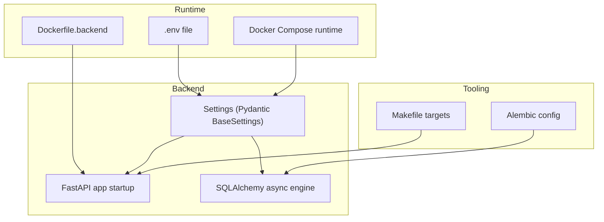
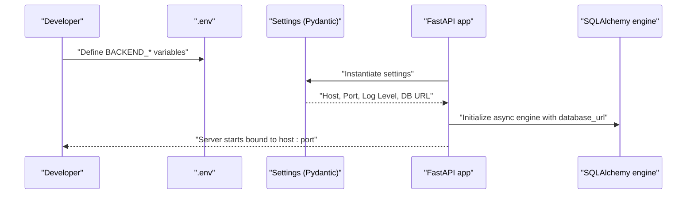
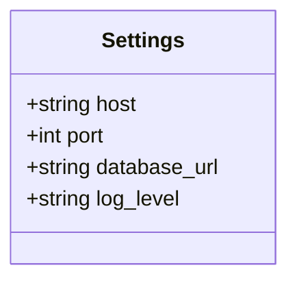
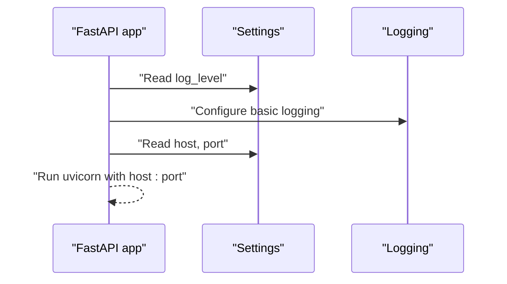
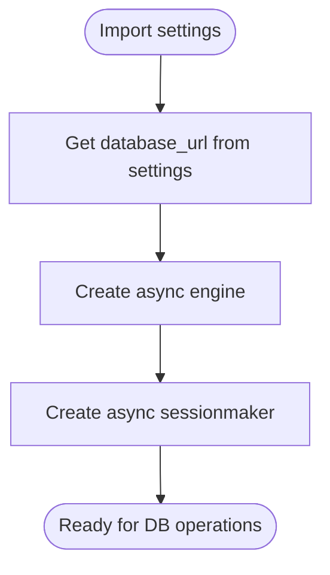
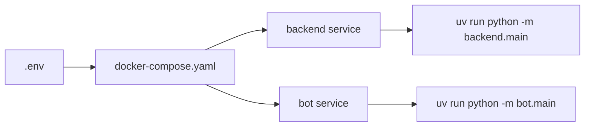
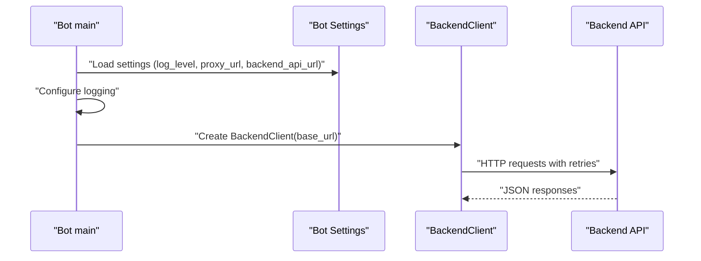
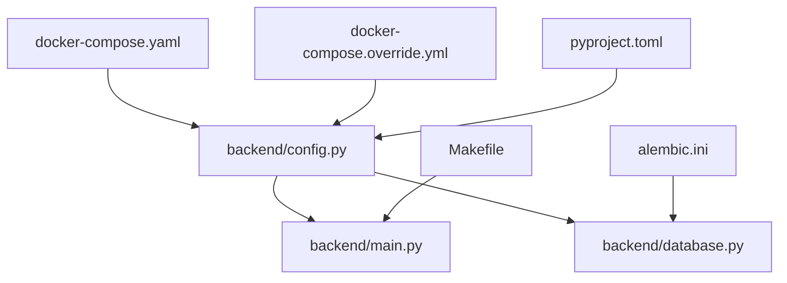

# Environment Setup and Configuration

<cite>
**Referenced Files in This Document**
- [backend/config.py](file://backend/config.py)
- [backend/main.py](file://backend/main.py)
- [backend/database.py](file://backend/database.py)
- [docker-compose.yaml](file://docker-compose.yaml)
- [docker-compose.override.yml](file://docker-compose.override.yml)
- [Dockerfile.backend](file://Dockerfile.backend)
- [pyproject.toml](file://pyproject.toml)
- [alembic.ini](file://alembic.ini)
- [Makefile](file://Makefile)
- [bot/main.py](file://bot/main.py)
- [bot/services/backend_client.py](file://bot/services/backend_client.py)
- [docs/how-to-get-tokens.md](file://docs/how-to-get-tokens.md)
</cite>

## Table of Contents
1. [Introduction](#introduction)
2. [Project Structure](#project-structure)
3. [Core Components](#core-components)
4. [Architecture Overview](#architecture-overview)
5. [Detailed Component Analysis](#detailed-component-analysis)
6. [Dependency Analysis](#dependency-analysis)
7. [Performance Considerations](#performance-considerations)
8. [Troubleshooting Guide](#troubleshooting-guide)
9. [Conclusion](#conclusion)
10. [Appendices](#appendices)

## Introduction
This document explains how the project manages configuration across environments using environment variables and Pydantic Settings. It covers environment variable prefixes, configuration loading from .env files, default value handling, and security considerations for sensitive data. Practical examples demonstrate local development setup, staging configuration, and production hardening. Configuration options for server binding, ports, logging levels, database URLs, and service endpoints are documented alongside common pitfalls such as missing variables, type conversion errors, and environment-specific overrides.

## Project Structure
The configuration system spans several layers:
- Backend FastAPI application loads settings from environment variables via Pydantic Settings.
- Docker Compose defines environment variables for services and mounts .env for secrets.
- Alembic reads a database URL from its configuration file for migrations.
- Bot services consume settings for logging, proxy configuration, and backend API base URL.
- Makefile orchestrates local runs, migrations, and testing.

**Diagram sources**
- [backend/config.py:1-24](file://backend/config.py#L1-L24)
- [backend/main.py:23-28](file://backend/main.py#L23-L28)
- [backend/database.py:8-20](file://backend/database.py#L8-L20)
- [docker-compose.yaml:25-31](file://docker-compose.yaml#L25-L31)
- [Dockerfile.backend:1-20](file://Dockerfile.backend#L1-L20)
- [alembic.ini:61](file://alembic.ini#L61)
- [Makefile:16-29](file://Makefile#L16-L29)

**Section sources**
- [backend/config.py:1-24](file://backend/config.py#L1-L24)
- [docker-compose.yaml:1-43](file://docker-compose.yaml#L1-L43)
- [Dockerfile.backend:1-20](file://Dockerfile.backend#L1-L20)
- [alembic.ini:61](file://alembic.ini#L61)
- [Makefile:1-71](file://Makefile#L1-L71)

## Core Components
- Settings model with environment prefix and .env loading:
  - Prefix: BACKEND_
  - .env file: .env
  - Extra fields: ignored
  - Defaults: host, port, database_url, log_level
- FastAPI app consumes settings for logging and server binding.
- SQLAlchemy engine uses settings.database_url.
- Docker Compose sets BACKEND_* variables and mounts .env.
- Alembic ini contains a database URL for migrations.
- Bot services rely on separate settings for logging, proxy, and backend base URL.

Key configuration options:
- Server binding: host, port
- Database: database_url
- Logging: log_level
- Backend API base URL for bot: BACKEND_API_URL (via override compose)

Security and defaults:
- Sensitive tokens and keys are stored in .env and loaded via python-dotenv.
- Default database URL is included but intended to be overridden in environments.
- Logging level defaults to INFO.

**Section sources**
- [backend/config.py:4-24](file://backend/config.py#L4-L24)
- [backend/main.py:23-28](file://backend/main.py#L23-L28)
- [backend/database.py:8-20](file://backend/database.py#L8-L20)
- [docker-compose.yaml:25-31](file://docker-compose.yaml#L25-L31)
- [docker-compose.override.yml:8-12](file://docker-compose.override.yml#L8-L12)
- [alembic.ini:61](file://alembic.ini#L61)
- [pyproject.toml:9-11](file://pyproject.toml#L9-L11)

## Architecture Overview
The configuration architecture integrates environment-driven settings, containerized runtime, and tooling automation.

**Diagram sources**
- [backend/config.py:7-11](file://backend/config.py#L7-L11)
- [backend/main.py:23-28](file://backend/main.py#L23-L28)
- [backend/database.py:8-20](file://backend/database.py#L8-L20)

## Detailed Component Analysis

### Backend Settings Model
The Settings class encapsulates environment-driven configuration with:
- Environment prefix: BACKEND_
- .env file loading
- Extra fields ignored
- Defaults for host, port, database_url, log_level

**Diagram sources**
- [backend/config.py:4-24](file://backend/config.py#L4-L24)

**Section sources**
- [backend/config.py:4-24](file://backend/config.py#L4-L24)

### FastAPI Application Configuration
- Logging is configured using the log_level setting.
- Server host and port are taken from settings.
- Lifespan hooks log startup and shutdown.

**Diagram sources**
- [backend/main.py:23-28](file://backend/main.py#L23-L28)
- [backend/main.py:169-173](file://backend/main.py#L169-L173)

**Section sources**
- [backend/main.py:23-28](file://backend/main.py#L23-L28)
- [backend/main.py:169-173](file://backend/main.py#L169-L173)

### Database Engine Configuration
- The async engine is created using settings.database_url.
- Echo is enabled for debugging; can be disabled in production.
- Session factory and declarative base are initialized accordingly.

**Diagram sources**
- [backend/database.py:8-20](file://backend/database.py#L8-L20)

**Section sources**
- [backend/database.py:8-20](file://backend/database.py#L8-L20)

### Docker Runtime and Environment Variables
- Docker Compose sets BACKEND_HOST, BACKEND_PORT, BACKEND_LOG_LEVEL, BACKEND_DATABASE_URL.
- .env is mounted to load secrets.
- Override compose exposes backend port and sets bot’s backend API URL.

**Diagram sources**
- [docker-compose.yaml:25-31](file://docker-compose.yaml#L25-L31)
- [docker-compose.override.yml:3-12](file://docker-compose.override.yml#L3-L12)

**Section sources**
- [docker-compose.yaml:25-31](file://docker-compose.yaml#L25-L31)
- [docker-compose.override.yml:3-12](file://docker-compose.override.yml#L3-L12)
- [Dockerfile.backend:17-19](file://Dockerfile.backend#L17-L19)

### Alembic Migration Configuration
- Alembic ini contains a hardcoded database URL for migrations.
- This supports local development and CI migration runs.

**Section sources**
- [alembic.ini:61](file://alembic.ini#L61)

### Bot Services Configuration
- Bot main initializes logging from settings and constructs a proxy session if configured.
- BackendClient uses a base URL derived from settings and performs HTTP requests with retry logic.

**Diagram sources**
- [bot/main.py:15-41](file://bot/main.py#L15-L41)
- [bot/services/backend_client.py:26-50](file://bot/services/backend_client.py#L26-L50)

**Section sources**
- [bot/main.py:15-41](file://bot/main.py#L15-L41)
- [bot/services/backend_client.py:26-50](file://bot/services/backend_client.py#L26-L50)

## Dependency Analysis
- backend/config.py defines the Settings model and settings instance.
- backend/main.py depends on settings for logging and server binding.
- backend/database.py depends on settings.database_url.
- docker-compose.yaml and docker-compose.override.yml supply environment variables and .env mounting.
- pyproject.toml declares pydantic-settings and python-dotenv as dependencies.
- alembic.ini provides a fallback database URL for migrations.
- Makefile targets orchestrate backend runs, migrations, and tests.

**Diagram sources**
- [backend/config.py:1-24](file://backend/config.py#L1-L24)
- [backend/main.py:8](file://backend/main.py#L8)
- [backend/database.py:6](file://backend/database.py#L6)
- [docker-compose.yaml:25-31](file://docker-compose.yaml#L25-L31)
- [docker-compose.override.yml:8-12](file://docker-compose.override.yml#L8-L12)
- [pyproject.toml:9-11](file://pyproject.toml#L9-L11)
- [alembic.ini:61](file://alembic.ini#L61)
- [Makefile:16-29](file://Makefile#L16-L29)

**Section sources**
- [backend/config.py:1-24](file://backend/config.py#L1-L24)
- [backend/main.py:8](file://backend/main.py#L8)
- [backend/database.py:6](file://backend/database.py#L6)
- [docker-compose.yaml:25-31](file://docker-compose.yaml#L25-L31)
- [docker-compose.override.yml:8-12](file://docker-compose.override.yml#L8-L12)
- [pyproject.toml:9-11](file://pyproject.toml#L9-L11)
- [alembic.ini:61](file://alembic.ini#L61)
- [Makefile:16-29](file://Makefile#L16-L29)

## Performance Considerations
- Keep logging level appropriate for environment: DEBUG for development, INFO/WARN for production.
- Disable SQLAlchemy echo in production to reduce overhead.
- Use containerized databases and avoid heavy synchronous operations in request handlers.
- Prefer environment overrides for ports and URLs to minimize hot-reload cycles during development.

## Troubleshooting Guide
Common configuration issues and resolutions:
- Missing environment variables
  - Symptom: Type conversion errors or validation failures when instantiating settings.
  - Resolution: Ensure .env exists and includes required BACKEND_* variables. Confirm docker-compose env_file and environment blocks.
  - Sources
    - [backend/config.py:7-11](file://backend/config.py#L7-L11)
    - [docker-compose.yaml:25-31](file://docker-compose.yaml#L25-L31)
    - [docker-compose.override.yml:8-12](file://docker-compose.override.yml#L8-L12)
- Type conversion errors
  - Symptom: port or log_level parsing errors.
  - Resolution: Verify BACKEND_PORT is numeric and BACKEND_LOG_LEVEL matches supported levels.
  - Sources
    - [backend/config.py:14-21](file://backend/config.py#L14-L21)
- Environment-specific overrides
  - Symptom: Local changes not applied.
  - Resolution: Use docker-compose.override.yml to remap ports and set BACKEND_API_URL for the bot.
  - Sources
    - [docker-compose.override.yml:3-12](file://docker-compose.override.yml#L3-L12)
- Sensitive data exposure
  - Symptom: Secrets committed or visible in logs.
  - Resolution: Never commit .env; confirm it is in .gitignore and loaded via python-dotenv. Restrict permissions on .env.
  - Sources
    - [docs/how-to-get-tokens.md:27-36](file://docs/how-to-get-tokens.md#L27-L36)
    - [pyproject.toml:9-11](file://pyproject.toml#L9-L11)
- Database connectivity
  - Symptom: Connection refused or authentication failure.
  - Resolution: Verify BACKEND_DATABASE_URL and Alembic database URL match. Confirm Postgres service health and credentials.
  - Sources
    - [backend/config.py:18](file://backend/config.py#L18)
    - [alembic.ini:61](file://alembic.ini#L61)
    - [docker-compose.yaml:29](file://docker-compose.yaml#L29)

## Conclusion
The project employs a clean separation of concerns for configuration: environment variables drive settings, .env stores secrets, Docker Compose injects environment overrides, and Pydantic Settings provide type-safe defaults. By following the patterns outlined here—prefixing variables, using .env, validating types, and applying environment-specific overrides—you can reliably manage configuration across local development, staging, and production while keeping sensitive data secure.

## Appendices

### Practical Examples

- Local development setup
  - Create .env with BACKEND_* variables and run the stack with Docker Compose.
  - References
    - [docker-compose.yaml:25-31](file://docker-compose.yaml#L25-L31)
    - [Makefile:16-29](file://Makefile#L16-L29)
- Staging configuration
  - Override ports and backend API URL via docker-compose.override.yml.
  - References
    - [docker-compose.override.yml:3-12](file://docker-compose.override.yml#L3-L12)
- Production security measures
  - Ensure .env is excluded from version control and restrict file permissions.
  - References
    - [docs/how-to-get-tokens.md:27-36](file://docs/how-to-get-tokens.md#L27-L36)

### Configuration Options Reference
- Server binding
  - host: BACKEND_HOST
  - port: BACKEND_PORT
  - References
    - [backend/config.py:14-15](file://backend/config.py#L14-L15)
    - [backend/main.py:169-173](file://backend/main.py#L169-L173)
- Database
  - database_url: BACKEND_DATABASE_URL
  - References
    - [backend/config.py:18](file://backend/config.py#L18)
    - [backend/database.py:8-20](file://backend/database.py#L8-L20)
    - [alembic.ini:61](file://alembic.ini#L61)
- Logging
  - log_level: BACKEND_LOG_LEVEL
  - References
    - [backend/config.py:21](file://backend/config.py#L21)
    - [backend/main.py:23-28](file://backend/main.py#L23-L28)
- Service endpoints
  - Backend API base URL for bot: BACKEND_API_URL (override compose)
  - References
    - [docker-compose.override.yml:10-12](file://docker-compose.override.yml#L10-L12)