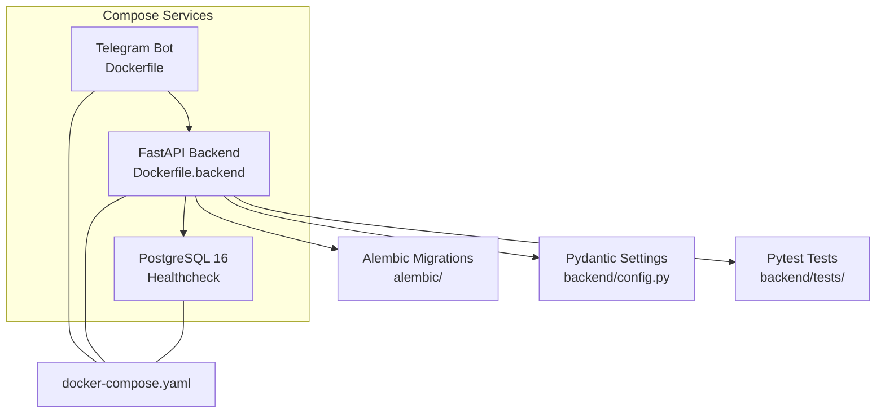
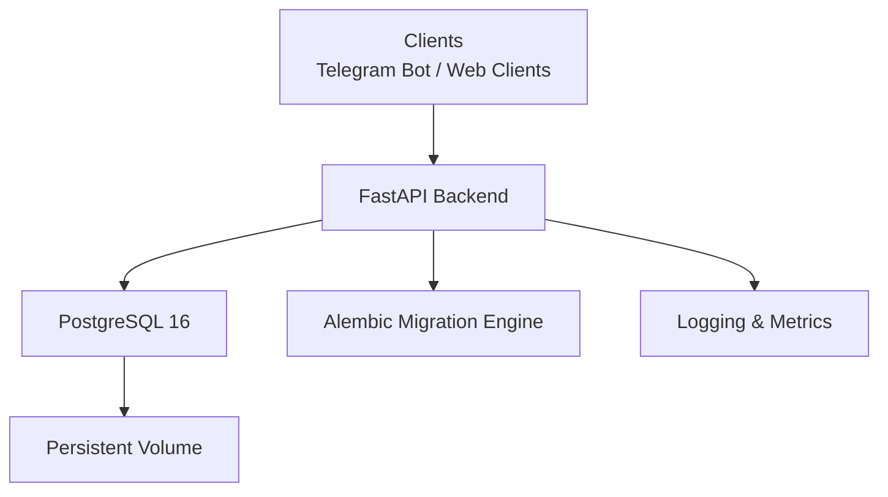
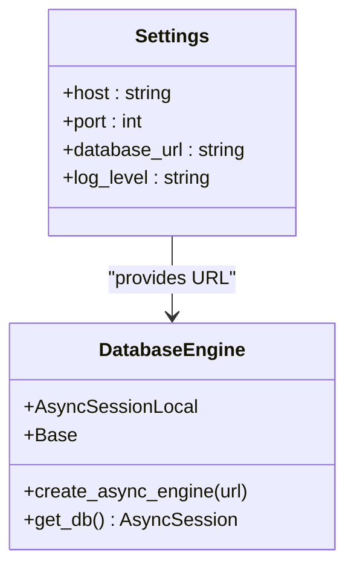
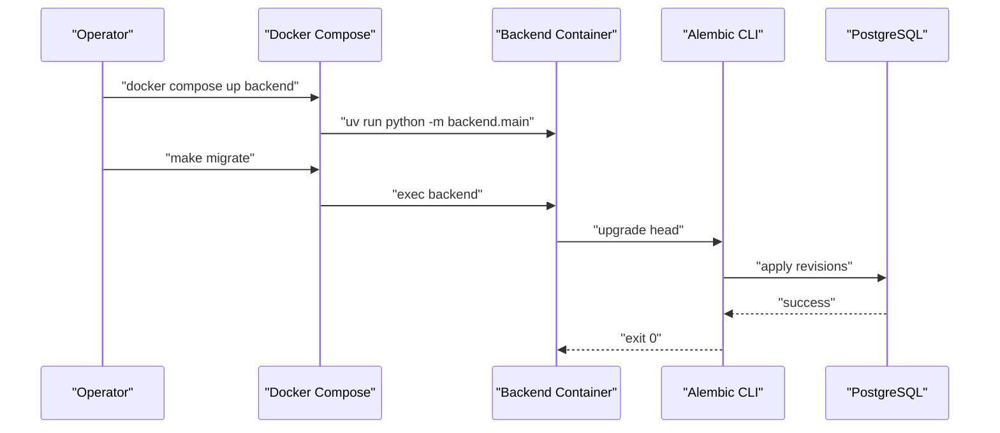
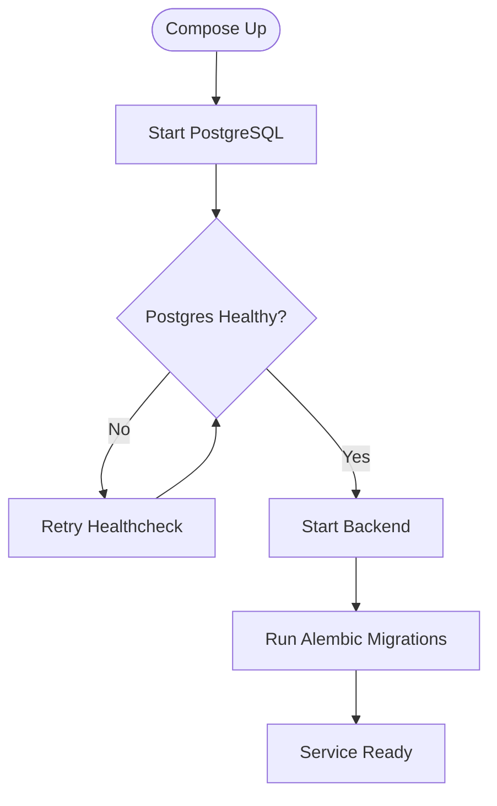
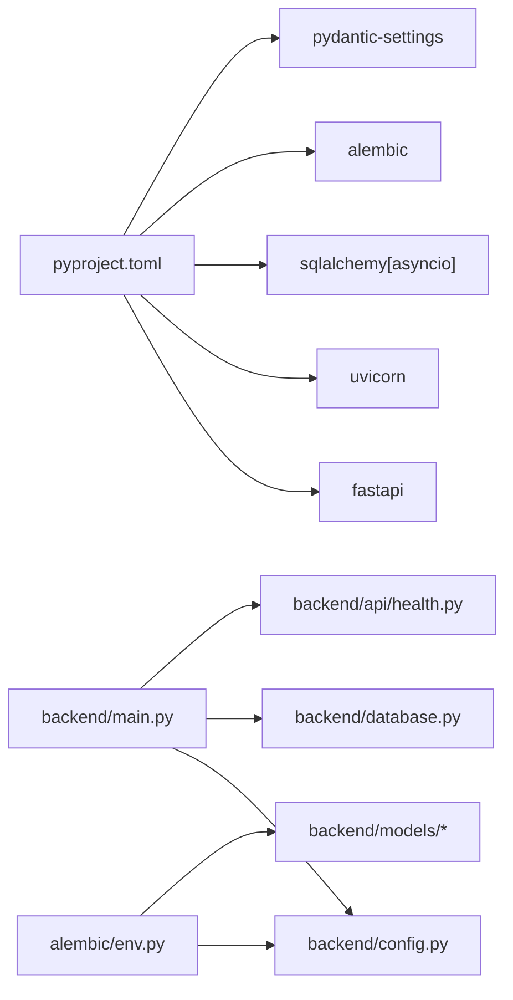

# Production Deployment Strategies

<cite>
**Referenced Files in This Document**
- [README.md](file://README.md)
- [docker-compose.yaml](file://docker-compose.yaml)
- [docker-compose.override.yml](file://docker-compose.override.yml)
- [Dockerfile](file://Dockerfile)
- [Dockerfile.backend](file://Dockerfile.backend)
- [pyproject.toml](file://pyproject.toml)
- [Makefile](file://Makefile)
- [backend/config.py](file://backend/config.py)
- [backend/database.py](file://backend/database.py)
- [backend/main.py](file://backend/main.py)
- [backend/api/health.py](file://backend/api/health.py)
- [backend/tests/conftest.py](file://backend/tests/conftest.py)
- [alembic.ini](file://alembic.ini)
- [alembic/env.py](file://alembic/env.py)
- [alembic/versions/2a84cf51810b_initial_migration.py](file://alembic/versions/2a84cf51810b_initial_migration.py)
</cite>

## Table of Contents
1. [Introduction](#introduction)
2. [Project Structure](#project-structure)
3. [Core Components](#core-components)
4. [Architecture Overview](#architecture-overview)
5. [Detailed Component Analysis](#detailed-component-analysis)
6. [Dependency Analysis](#dependency-analysis)
7. [Performance Considerations](#performance-considerations)
8. [Troubleshooting Guide](#troubleshooting-guide)
9. [Conclusion](#conclusion)
10. [Appendices](#appendices)

## Introduction
This document provides enterprise-grade production deployment strategies for the booking platform, focusing on secure, reliable, observable, and maintainable operations. It covers production environment setup, security hardening, monitoring, database migration management, backup strategies, and disaster recovery. It also includes practical CI/CD integration patterns, automated testing, deployment verification, performance optimization, and operational procedures for common production issues such as migration failures, performance bottlenecks, and emergencies.

## Project Structure
The repository follows a layered, service-oriented structure with clear separation between the Telegram bot, backend API, database models, and migrations. Docker Compose orchestrates services, while Make targets streamline local development and CI/CD integration. Alembic manages asynchronous PostgreSQL migrations, and Pydantic settings centralize configuration.

**Diagram sources**
- [docker-compose.yaml:1-43](file://docker-compose.yaml#L1-L43)
- [Dockerfile:1-13](file://Dockerfile#L1-L13)
- [Dockerfile.backend](file://Dockerfile.backend)
- [backend/main.py:1-173](file://backend/main.py#L1-L173)
- [backend/config.py:1-25](file://backend/config.py#L1-L25)
- [backend/tests/conftest.py:1-150](file://backend/tests/conftest.py#L1-L150)
- [alembic/env.py:1-95](file://alembic/env.py#L1-L95)

**Section sources**
- [README.md:1-133](file://README.md#L1-L133)
- [docker-compose.yaml:1-43](file://docker-compose.yaml#L1-L43)
- [docker-compose.override.yml:1-13](file://docker-compose.override.yml#L1-L13)
- [Dockerfile:1-13](file://Dockerfile#L1-L13)
- [pyproject.toml:1-32](file://pyproject.toml#L1-L32)

## Core Components
- Backend API: FastAPI application with health endpoint, CORS, and centralized exception handling. It exposes REST endpoints under /api/v1 and integrates with Alembic for migrations.
- Database Layer: SQLAlchemy 2.x async engine and session factory configured via Pydantic settings. Includes dependency injection for sessions and automatic commit/rollback semantics.
- Migrations: Alembic configuration supports offline and online async migrations, reading the database URL from settings.
- Orchestration: Docker Compose defines services for PostgreSQL, backend, and bot, with health checks and volume mounts for persistence.
- Testing: Pytest fixtures manage an isolated test database, table lifecycle, and dependency overrides for API tests.

**Section sources**
- [backend/main.py:1-173](file://backend/main.py#L1-L173)
- [backend/database.py:1-41](file://backend/database.py#L1-L41)
- [backend/config.py:1-25](file://backend/config.py#L1-L25)
- [alembic/env.py:1-95](file://alembic/env.py#L1-L95)
- [alembic.ini:1-115](file://alembic.ini#L1-L115)
- [docker-compose.yaml:1-43](file://docker-compose.yaml#L1-L43)
- [backend/tests/conftest.py:1-150](file://backend/tests/conftest.py#L1-L150)

## Architecture Overview
The production architecture centers on a FastAPI backend serving clients (Telegram bot and web clients), backed by PostgreSQL with Alembic-managed migrations. Docker Compose provisions services with health checks, persistent volumes, and environment-driven configuration.

**Diagram sources**
- [backend/main.py:41-65](file://backend/main.py#L41-L65)
- [backend/database.py:8-23](file://backend/database.py#L8-L23)
- [alembic/env.py:70-84](file://alembic/env.py#L70-L84)
- [docker-compose.yaml:2-14](file://docker-compose.yaml#L2-L14)

## Detailed Component Analysis

### Backend API: Production Readiness
- Health Endpoint: Exposes a lightweight /health endpoint for readiness/liveness probes.
- CORS: Broad CORS configuration suitable for development; tighten origins in production.
- Exception Handling: Centralized handlers for domain-specific errors and a global fallback.
- Logging: Configured via settings with level derived from environment.
- Lifespan Hooks: Placeholder for database initialization and teardown.

Recommended production enhancements:
- Add readiness probe hitting /health with version metadata.
- Enforce strict CORS origins and credentials policies.
- Integrate structured logging with external log aggregation.
- Add OpenTelemetry tracing and metrics export.
- Implement graceful shutdown hooks to drain connections.

**Section sources**
- [backend/main.py:62-65](file://backend/main.py#L62-L65)
- [backend/main.py:49-56](file://backend/main.py#L49-L56)
- [backend/main.py:156-166](file://backend/main.py#L156-L166)
- [backend/main.py:23-28](file://backend/main.py#L23-L28)
- [backend/main.py:31-38](file://backend/main.py#L31-L38)

### Database Layer: Async Engine and Session Management
- Async Engine: Created from settings.database_url with echo enabled for diagnostics.
- Session Factory: Async session maker with expire_on_commit disabled and proper close/commit/rollback semantics.
- Dependency Injection: get_db yields a session per request with transaction safety.

Production considerations:
- Disable echo in production.
- Tune engine pool parameters (pool_size, max_overflow, pool_recycle).
- Add retry/backoff for transient failures.
- Monitor slow queries and long transactions.

**Diagram sources**
- [backend/config.py:4-24](file://backend/config.py#L4-L24)
- [backend/database.py:8-41](file://backend/database.py#L8-L41)

**Section sources**
- [backend/database.py:8-41](file://backend/database.py#L8-L41)
- [backend/config.py:17-18](file://backend/config.py#L17-L18)

### Alembic Migrations: Async Environment and Versioning
- Async Migration Runner: env.py configures Alembic to use async engine and runs migrations asynchronously.
- Configuration: Reads database URL from settings and applies target metadata from models.
- Version Script: Initial migration script resides under alembic/versions.

Production migration strategy:
- Always run migrations inside a controlled deployment window.
- Use offline mode for dry-run validation before online upgrades.
- Keep migrations reversible and idempotent where possible.
- Back up database before major schema changes.

**Diagram sources**
- [docker-compose.yaml:21-39](file://docker-compose.yaml#L21-L39)
- [Makefile:57-58](file://Makefile#L57-L58)
- [alembic/env.py:70-94](file://alembic/env.py#L70-L94)
- [alembic/versions/2a84cf51810b_initial_migration.py](file://alembic/versions/2a84cf51810b_initial_migration.py)

**Section sources**
- [alembic/env.py:20-21](file://alembic/env.py#L20-L21)
- [alembic/env.py:70-94](file://alembic/env.py#L70-L94)
- [alembic.ini:61-61](file://alembic.ini#L61-L61)
- [alembic/versions/2a84cf51810b_initial_migration.py](file://alembic/versions/2a84cf51810b_initial_migration.py)

### Orchestration and Runtime: Docker Compose
- Services: postgres, bot, backend.
- Health Checks: PostgreSQL healthcheck ensures readiness before backend starts.
- Volumes: Persistent storage for PostgreSQL data.
- Environment: Backend reads database URL and other settings from .env and environment variables.

Production hardening:
- Pin images to digests.
- Limit resource usage (CPU/memory).
- Use secrets for sensitive configuration.
- Enable restart policies and monitor restart counts.

**Diagram sources**
- [docker-compose.yaml:10-14](file://docker-compose.yaml#L10-L14)
- [docker-compose.yaml:37-39](file://docker-compose.yaml#L37-L39)
- [Makefile:57-58](file://Makefile#L57-L58)

**Section sources**
- [docker-compose.yaml:1-43](file://docker-compose.yaml#L1-L43)
- [docker-compose.override.yml:1-13](file://docker-compose.override.yml#L1-L13)

### Testing and CI/CD Integration
- Test Database Lifecycle: Pytest fixtures create/drop test database and tables, truncate on each test.
- Dependency Overrides: API tests inject a test database session.
- Coverage Reports: Makefile target supports coverage reporting.

CI/CD pipeline pattern:
- Build images (bot/backend).
- Run linters and formatters.
- Execute backend tests with coverage.
- Apply migrations in a staging environment.
- Deploy and verify health endpoint.
- Rollback on failure using immutable tags and blue/green deployments.

**Section sources**
- [backend/tests/conftest.py:23-59](file://backend/tests/conftest.py#L23-L59)
- [backend/tests/conftest.py:63-92](file://backend/tests/conftest.py#L63-L92)
- [Makefile:44-54](file://Makefile#L44-L54)
- [pyproject.toml:20-27](file://pyproject.toml#L20-L27)

## Dependency Analysis
Runtime dependencies include FastAPI, Uvicorn, SQLAlchemy async, Alembic, and Pydantic settings. Development dependencies include Ruff, Pytest, and coverage tools. The backend imports configuration and database modules, while Alembic imports settings and models.

**Diagram sources**
- [pyproject.toml:6-18](file://pyproject.toml#L6-L18)
- [backend/main.py:8-9](file://backend/main.py#L8-L9)
- [backend/config.py:1-25](file://backend/config.py#L1-L25)
- [backend/database.py:1-41](file://backend/database.py#L1-L41)
- [alembic/env.py:12-14](file://alembic/env.py#L12-L14)

**Section sources**
- [pyproject.toml:1-32](file://pyproject.toml#L1-L32)
- [backend/main.py:8-9](file://backend/main.py#L8-L9)
- [alembic/env.py:12-14](file://alembic/env.py#L12-L14)

## Performance Considerations
- Database Engine Tuning: Adjust pool size and timeouts; enable connection recycling.
- Async I/O: Maintain async-only design to minimize blocking.
- Caching: Introduce Redis for hot data and rate limiting.
- Observability: Add metrics (request latency, error rates) and distributed tracing.
- CDN and Load Balancing: Place a reverse proxy/load balancer in front of the backend.
- Background Tasks: Offload heavy work to queues (e.g., Celery) with dead-letter exchanges.

[No sources needed since this section provides general guidance]

## Troubleshooting Guide
Common production issues and remediation steps:

- Migration Failures
  - Symptom: Upgrade fails mid-flight.
  - Actions: Downgrade to previous revision, inspect migration script, fix schema inconsistencies, re-run upgrade.
  - Verification: Confirm /health endpoint responds and database connectivity.

- Performance Bottlenecks
  - Symptom: Slow queries or increased latency.
  - Actions: Profile slow endpoints, analyze query plans, add indexes, scale read replicas, review connection pooling.

- Operational Emergencies
  - Symptom: Database unresponsive or disk full.
  - Actions: Trigger disaster recovery drills, restore from backups, failover to standby, alert on-call.

- Health and Readiness
  - Verify /health endpoint and database connectivity.
  - Use readiness probes to prevent traffic routing until services are healthy.

**Section sources**
- [Makefile:63-64](file://Makefile#L63-L64)
- [backend/api/health.py:6-8](file://backend/api/health.py#L6-L8)
- [docker-compose.yaml:10-14](file://docker-compose.yaml#L10-L14)

## Conclusion
This guide outlines a production-ready deployment strategy for the booking platform, emphasizing secure configuration, robust migrations, observability, and resilient operations. By adopting the recommended practices—tightened CORS, structured logging, Alembic-controlled schema evolution, CI/CD automation, and disaster recovery—you can achieve reliable, scalable, and maintainable operations in enterprise environments.

[No sources needed since this section summarizes without analyzing specific files]

## Appendices

### A. Production Security Hardening Checklist
- Secrets Management: Store tokens and passwords in a secret manager; mount as environment variables/secrets.
- Network Policies: Restrict inbound/outbound traffic; enforce TLS termination at the edge.
- Least Privilege: Run containers as non-root; limit capabilities.
- Audit Logging: Enable database and application audit logs; ship to SIEM.
- Vulnerability Scanning: Scan images and dependencies regularly.

[No sources needed since this section provides general guidance]

### B. Monitoring and Alerting
- Metrics: Track request rate, latency, error rate, database connections, and queue depth.
- Logs: Structured JSON logs with correlation IDs; centralized collection.
- Alerts: Threshold-based alerts for error spikes, latency p95, and downtime.

[No sources needed since this section provides general guidance]

### C. Backup and Disaster Recovery
- Backup Strategy: Regular logical backups (e.g., pg_dump) and continuous archiving.
- Recovery Drills: Schedule periodic restores to validate backup integrity.
- DR Site: Maintain a secondary region with replicated PostgreSQL and application stack.

[No sources needed since this section provides general guidance]

### D. CI/CD Pipeline Integration Examples
- Build Stage: Build backend and bot images with pinned digests.
- Test Stage: Run backend tests with coverage; lint and format checks.
- Deploy Stage: Deploy to staging, run smoke tests, promote to production with rollback tag.
- Post-deploy: Verify /health endpoint and run synthetic tests.

**Section sources**
- [Makefile:44-54](file://Makefile#L44-L54)
- [Makefile:57-64](file://Makefile#L57-L64)
- [backend/api/health.py:6-8](file://backend/api/health.py#L6-L8)