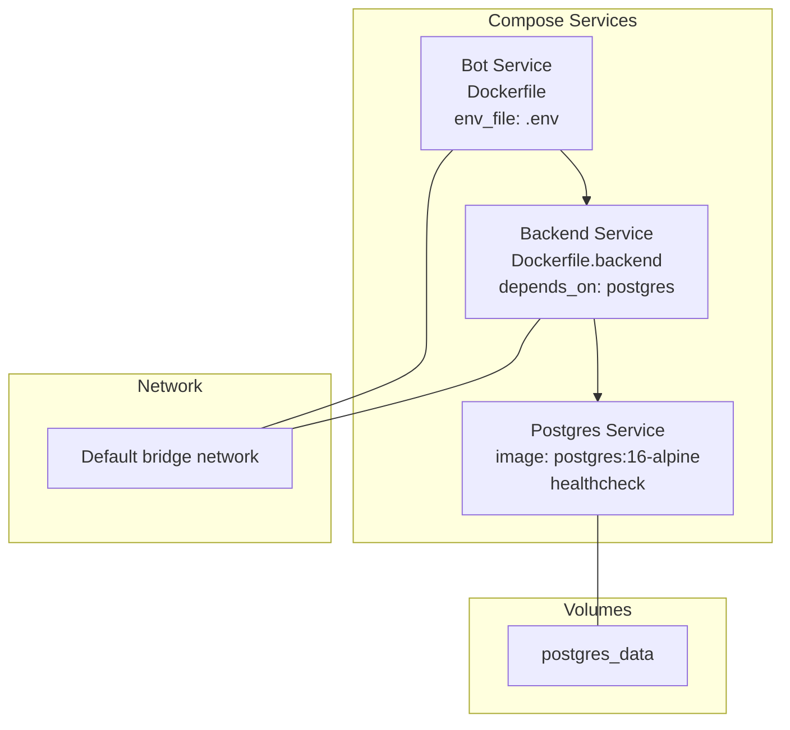
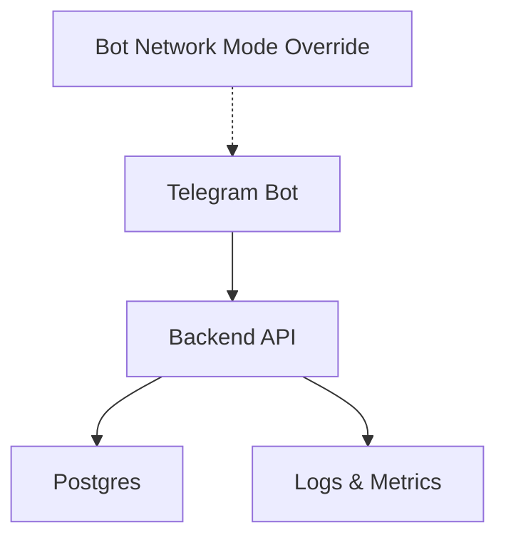
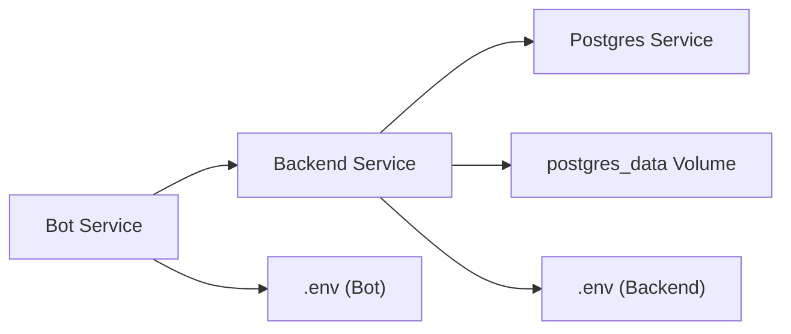
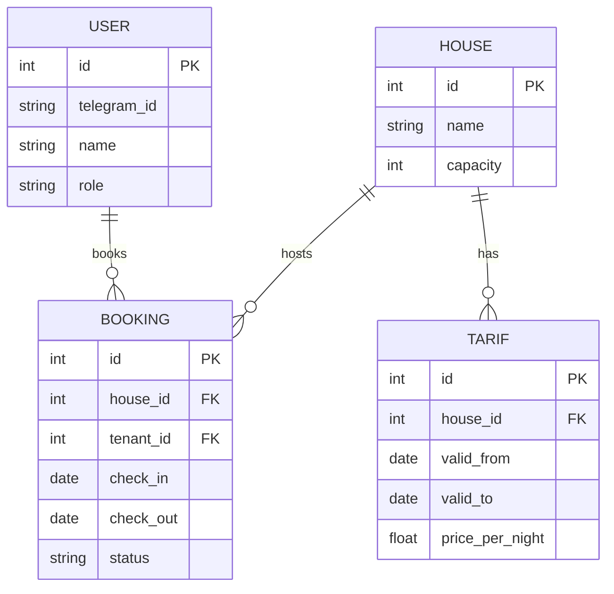

# Service Deployment and Orchestration

<cite>
**Referenced Files in This Document**
- [docker-compose.yaml](file://docker-compose.yaml)
- [docker-compose.override.yml](file://docker-compose.override.yml)
- [Dockerfile](file://Dockerfile)
- [Dockerfile.backend](file://Dockerfile.backend)
- [Makefile](file://Makefile)
- [backend/main.py](file://backend/main.py)
- [backend/config.py](file://backend/config.py)
- [backend/database.py](file://backend/database.py)
- [bot/main.py](file://bot/main.py)
- [bot/config.py](file://bot/config.py)
- [bot/services/backend_client.py](file://bot/services/backend_client.py)
- [pyproject.toml](file://pyproject.toml)
- [README.md](file://README.md)
</cite>

## Table of Contents
1. [Introduction](#introduction)
2. [Project Structure](#project-structure)
3. [Core Components](#core-components)
4. [Architecture Overview](#architecture-overview)
5. [Detailed Component Analysis](#detailed-component-analysis)
6. [Dependency Analysis](#dependency-analysis)
7. [Performance Considerations](#performance-considerations)
8. [Troubleshooting Guide](#troubleshooting-guide)
9. [Conclusion](#conclusion)
10. [Appendices](#appendices)

## Introduction
This document explains how to deploy and orchestrate the system using Docker Compose. It covers service definitions, dependency management, lifecycle control, health checks, and environment-specific overrides. It also provides practical examples for local development and production-like deployment, along with guidance on scaling, networking, volumes, and common operational issues such as startup ordering and configuration conflicts.

## Project Structure
The deployment is orchestrated by Docker Compose with two primary services:
- Postgres relational database with a named volume for persistence
- Backend API service built from a dedicated Dockerfile and configured to depend on Postgres
- Bot service built from the root Dockerfile and configured to communicate with the backend

Environment-specific overrides are provided via an override file that remaps ports and adjusts bot networking for development scenarios.

**Diagram sources**
- [docker-compose.yaml:1-43](file://docker-compose.yaml#L1-L43)
- [docker-compose.override.yml:1-13](file://docker-compose.override.yml#L1-L13)

**Section sources**
- [docker-compose.yaml:1-43](file://docker-compose.yaml#L1-L43)
- [docker-compose.override.yml:1-13](file://docker-compose.override.yml#L1-L13)
- [Dockerfile.backend:1-20](file://Dockerfile.backend#L1-L20)
- [Dockerfile:1-13](file://Dockerfile#L1-L13)

## Core Components
- Postgres service
  - Uses a lightweight Alpine image and exposes a health check using a readiness probe.
  - Persists data via a named volume mapped to the container’s data directory.
  - Environment variables define credentials and database name.
- Backend service
  - Built from a dedicated Dockerfile that installs dependencies and runs the FastAPI app.
  - Exposes port 8000 and mounts backend and alembic directories for development iteration.
  - Depends on Postgres with a health condition to ensure the database is ready before starting.
  - Reads configuration from environment variables and an env file.
- Bot service
  - Built from the root Dockerfile and runs the Telegram bot entrypoint.
  - Uses an env file for configuration and can be networked differently in development via the override file.

Key orchestration features:
- Health checks for Postgres enable safe startup ordering.
- Named volumes ensure persistent storage across restarts.
- Environment-specific overrides allow local port mapping and network mode adjustments.

**Section sources**
- [docker-compose.yaml:1-43](file://docker-compose.yaml#L1-L43)
- [docker-compose.override.yml:1-13](file://docker-compose.override.yml#L1-L13)
- [Dockerfile.backend:1-20](file://Dockerfile.backend#L1-L20)
- [Dockerfile:1-13](file://Dockerfile#L1-L13)
- [backend/config.py:1-25](file://backend/config.py#L1-L25)

## Architecture Overview
The system consists of three main runtime units orchestrated together:
- Postgres for persistence
- Backend API exposing REST endpoints and health checks
- Telegram Bot consuming the Backend API

**Diagram sources**
- [docker-compose.yaml:1-43](file://docker-compose.yaml#L1-L43)
- [docker-compose.override.yml:1-13](file://docker-compose.override.yml#L1-L13)
- [backend/main.py:62-64](file://backend/main.py#L62-L64)

## Detailed Component Analysis

### Postgres Service
- Image and environment: pinned to a specific version and configured with user, password, and database name.
- Health check: uses a readiness probe to confirm database availability before downstream services start.
- Persistence: named volume ensures data survives container recreation.

Operational implications:
- Use the named volume for backups and migrations.
- Adjust credentials and database name via environment variables for different environments.

**Section sources**
- [docker-compose.yaml:2-14](file://docker-compose.yaml#L2-L14)

### Backend Service
- Build context and Dockerfile: builds a Python 3.12 slim image, installs dependencies, and runs the FastAPI app.
- Ports and exposure: exposes port 8000 inside the container; in development, the override maps it to 8001 on the host.
- Dependencies: depends_on Postgres with a health condition to guarantee readiness.
- Mounts: development-time mounts for backend and alembic directories enable iterative development.
- Environment: reads server host/port, log level, and database URL from environment variables and an env file.

Lifecycle and health:
- The backend exposes a health endpoint for external probes.
- The compose file does not define a health check for the backend; rely on the health endpoint for readiness.

**Section sources**
- [docker-compose.yaml:21-40](file://docker-compose.yaml#L21-L40)
- [Dockerfile.backend:1-20](file://Dockerfile.backend#L1-L20)
- [backend/main.py:62-64](file://backend/main.py#L62-L64)
- [backend/config.py:13-21](file://backend/config.py#L13-L21)

### Bot Service
- Build and entrypoint: built from the root Dockerfile and runs the Telegram bot entrypoint.
- Networking: in development, the override sets a network mode to reuse another container’s network stack and routes traffic to the backend via the host’s docker0 interface.
- Environment: loads configuration from an env file, including the backend API URL.

Operational notes:
- The bot’s backend URL defaults to a service name; in development, it is overridden to reach the host-bound port.
- Proxy support is configurable via environment variables.

**Section sources**
- [docker-compose.yaml:16-19](file://docker-compose.yaml#L16-L19)
- [docker-compose.override.yml:6-12](file://docker-compose.override.yml#L6-L12)
- [bot/config.py:44-61](file://bot/config.py#L44-L61)
- [bot/main.py:15-41](file://bot/main.py#L15-L41)

### Configuration Management and Overrides
- Environment files: both services load configuration from an env file.
- Override file: selectively modifies backend port mapping and bot network mode for development convenience.
- Environment-specific variables: database URL, server host/port, logging level, and bot backend URL are environment-driven.

Best practices:
- Keep secrets in the env file and do not commit sensitive values.
- Use the override file for local development; keep production overrides minimal and explicit.

**Section sources**
- [docker-compose.yaml:30-31](file://docker-compose.yaml#L30-L31)
- [docker-compose.override.yml:18-12](file://docker-compose.override.yml#L18-L12)
- [backend/config.py:7-11](file://backend/config.py#L7-L11)
- [bot/config.py:47-61](file://bot/config.py#L47-L61)

### Database Connectivity and Initialization
- Backend configuration: defines a database URL that points to the Postgres service.
- Session management: async SQLAlchemy sessions are created from the configured URL.
- Migration workflow: the Makefile provides commands to apply and manage Alembic migrations inside the backend container.

Operational guidance:
- Ensure the backend starts only after Postgres is healthy.
- Apply migrations before running the backend in a fresh environment.

**Section sources**
- [backend/config.py:17-18](file://backend/config.py#L17-L18)
- [backend/database.py:8-20](file://backend/database.py#L8-L20)
- [Makefile:57-64](file://Makefile#L57-L64)

### Health Checks and Readiness
- Postgres health check: readiness probe confirms database availability.
- Backend health endpoint: exposes a simple health check endpoint for external monitoring.
- Startup ordering: depends_on with a health condition ensures the backend waits for Postgres readiness.

Recommendations:
- For production, consider adding a health check to the backend service in Compose.
- Use the health endpoint for Kubernetes-style readiness gates or external monitoring systems.

**Section sources**
- [docker-compose.yaml:10-14](file://docker-compose.yaml#L10-L14)
- [backend/main.py:62-64](file://backend/main.py#L62-L64)
- [docker-compose.yaml:37-39](file://docker-compose.yaml#L37-L39)

### Volume Mounting and Persistence
- Postgres data volume: a named volume persists database files across container restarts.
- Backend development mounts: bind-mounts for backend and alembic directories enable live iteration without rebuilding.

Guidance:
- For production, prefer managed volumes or persistent disks depending on your platform.
- Avoid mounting development directories in production; use build artifacts instead.

**Section sources**
- [docker-compose.yaml:8-9](file://docker-compose.yaml#L8-L9)
- [docker-compose.yaml:32-35](file://docker-compose.yaml#L32-L35)

### Service Scaling and Load Distribution
- Current setup: single instances of each service.
- Scaling approach: scale the backend service horizontally behind a reverse proxy or load balancer.
- Considerations:
  - Ensure database connections are managed appropriately.
  - Use sticky sessions if required by the application logic.

[No sources needed since this section provides general guidance]

### Rollback Strategies
- Compose-based rollback: redeploy previous images by updating service images or tags.
- Database migrations: use downgrade commands to roll back schema changes if needed.
- Canary deployments: introduce a subset of older backend instances alongside new ones.

**Section sources**
- [Makefile:63-64](file://Makefile#L63-L64)

## Dependency Analysis
The following diagram shows how services depend on each other and on shared resources.

**Diagram sources**
- [docker-compose.yaml:16-40](file://docker-compose.yaml#L16-L40)
- [docker-compose.override.yml:6-12](file://docker-compose.override.yml#L6-L12)

**Section sources**
- [docker-compose.yaml:16-40](file://docker-compose.yaml#L16-L40)
- [docker-compose.override.yml:6-12](file://docker-compose.override.yml#L6-L12)

## Performance Considerations
- Resource limits: set CPU and memory limits for services in production to prevent resource contention.
- Database tuning: configure Postgres parameters for workload characteristics.
- Backend concurrency: tune Uvicorn workers and threads based on CPU cores and I/O patterns.
- Caching: integrate application-level caching for frequently accessed data.
- Monitoring: add metrics and logging to track latency and throughput.

[No sources needed since this section provides general guidance]

## Troubleshooting Guide
Common deployment issues and resolutions:

- Service startup order
  - Symptom: Backend fails to connect to Postgres on first boot.
  - Resolution: Ensure depends_on with a health condition is present; verify Postgres health check passes.
  - Related references:
    - [docker-compose.yaml:37-39](file://docker-compose.yaml#L37-L39)
    - [docker-compose.yaml:10-14](file://docker-compose.yaml#L10-L14)

- Dependency resolution
  - Symptom: Backend cannot resolve the Postgres hostname.
  - Resolution: Use the service name as the hostname; Compose provides DNS resolution for service names.
  - Related references:
    - [docker-compose.yaml:29](file://docker-compose.yaml#L29)
    - [backend/config.py:17-18](file://backend/config.py#L17-L18)

- Configuration conflicts
  - Symptom: Backend connects to wrong database or port.
  - Resolution: Verify environment variables and env file contents; ensure the backend URL points to the Postgres service.
  - Related references:
    - [backend/config.py:17-18](file://backend/config.py#L17-L18)
    - [docker-compose.yaml:29](file://docker-compose.yaml#L29)

- Port conflicts in development
  - Symptom: Port 8000 already in use.
  - Resolution: Use the override file to map backend to a different host port.
  - Related references:
    - [docker-compose.override.yml:3-4](file://docker-compose.override.yml#L3-L4)

- Bot connectivity to backend
  - Symptom: Bot cannot reach the backend API.
  - Resolution: Confirm backend API URL in the bot’s env file; in development, ensure the override maps the backend port and that the bot’s network mode allows access to the host.
  - Related references:
    - [bot/config.py:56](file://bot/config.py#L56)
    - [docker-compose.override.yml:10-12](file://docker-compose.override.yml#L10-L12)

- Database migration errors
  - Symptom: Migrations fail or hang.
  - Resolution: Run migrations inside the backend container and inspect logs; ensure Postgres is healthy before applying migrations.
  - Related references:
    - [Makefile:57-64](file://Makefile#L57-L64)
    - [docker-compose.yaml:10-14](file://docker-compose.yaml#L10-L14)

- Health check failures
  - Symptom: Backend appears unhealthy despite running.
  - Resolution: Add a health check to the backend service in Compose or rely on the health endpoint for external probes.
  - Related references:
    - [backend/main.py:62-64](file://backend/main.py#L62-L64)

## Conclusion
This deployment configuration provides a robust foundation for local development and production-like environments. By leveraging Compose services, health checks, named volumes, and environment-specific overrides, teams can reliably orchestrate the system, manage dependencies, and iterate quickly. For production, augment health checks, add resource limits, and integrate monitoring and CI/CD pipelines.

## Appendices

### Practical Examples

- Local development setup
  - Prepare environment variables and run services in detached mode.
  - Apply database migrations and start the backend.
  - Verify the health endpoint and run the bot in a separate terminal.
  - References:
    - [README.md:59-80](file://README.md#L59-L80)
    - [Makefile:16-29](file://Makefile#L16-L29)

- Production deployment procedure
  - Define environment variables for production secrets.
  - Use a reverse proxy or load balancer for the backend.
  - Ensure database connectivity and apply migrations.
  - Monitor health and logs.
  - References:
    - [backend/config.py:17-18](file://backend/config.py#L17-L18)
    - [Makefile:57-64](file://Makefile#L57-L64)

- Service scaling techniques
  - Scale the backend service horizontally behind a load balancer.
  - Ensure database connection pooling and session management are tuned.
  - References:
    - [Dockerfile.backend:17](file://Dockerfile.backend#L17)

### API Definitions
- Health check endpoint
  - Path: GET /health
  - Purpose: Readiness probe for monitoring systems.
  - References:
    - [backend/main.py:62-64](file://backend/main.py#L62-L64)

- API documentation
  - Path: /docs
  - Purpose: OpenAPI/Swagger UI for exploring endpoints.
  - References:
    - [backend/main.py:41-47](file://backend/main.py#L41-L47)
    - [README.md:132](file://README.md#L132)

### Data Models

[No sources needed since this diagram shows conceptual data relationships]