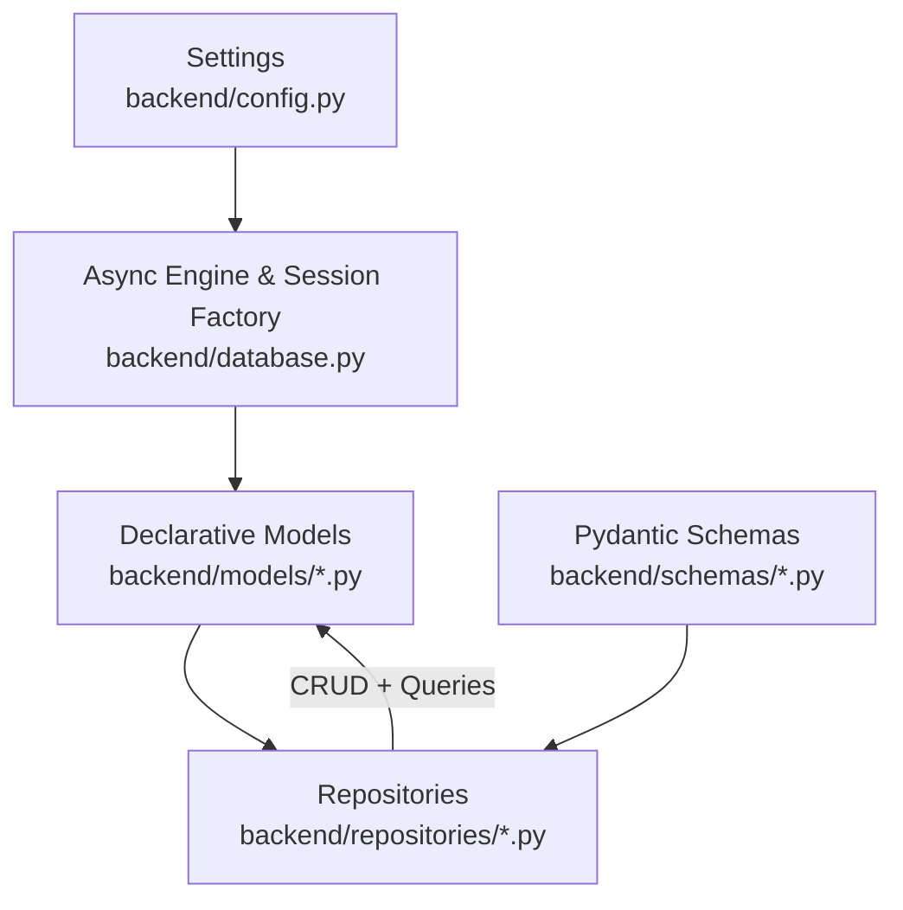
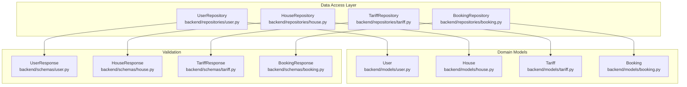
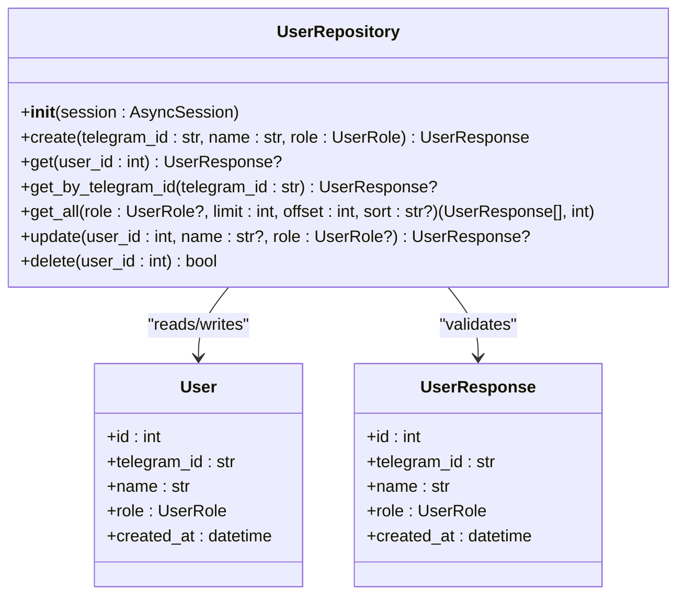
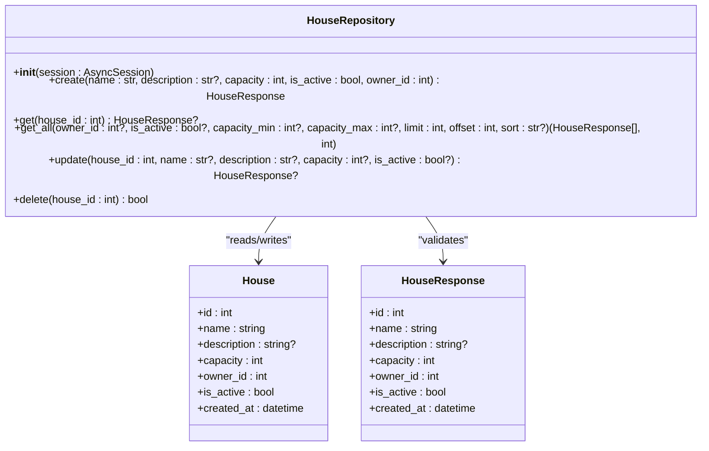
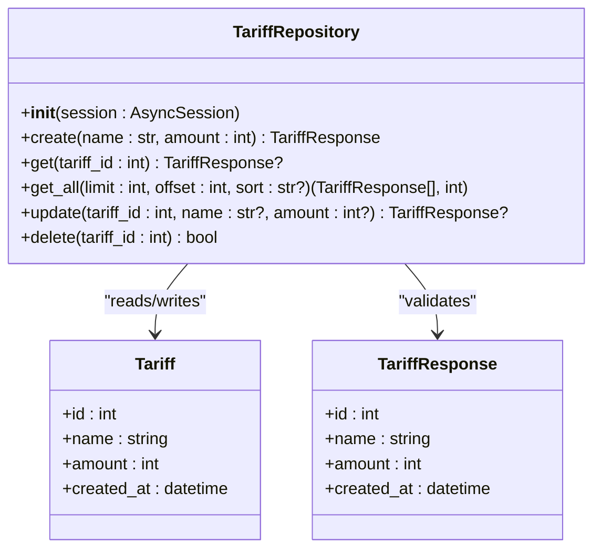
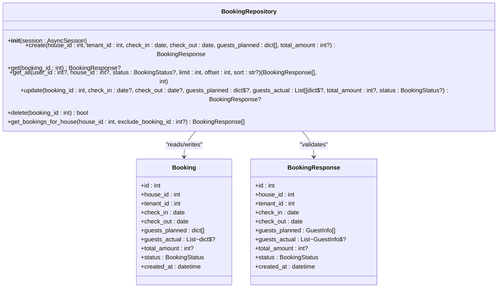
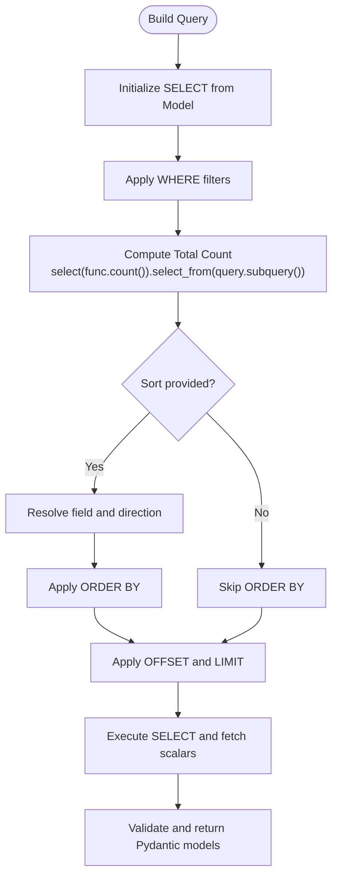
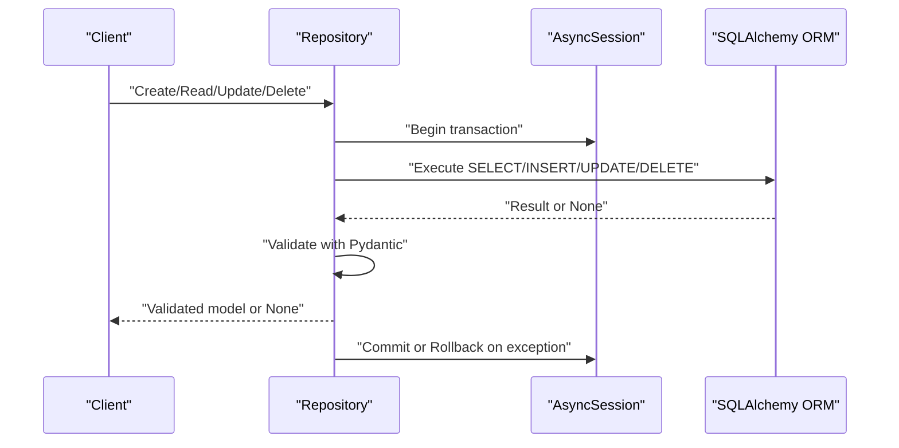
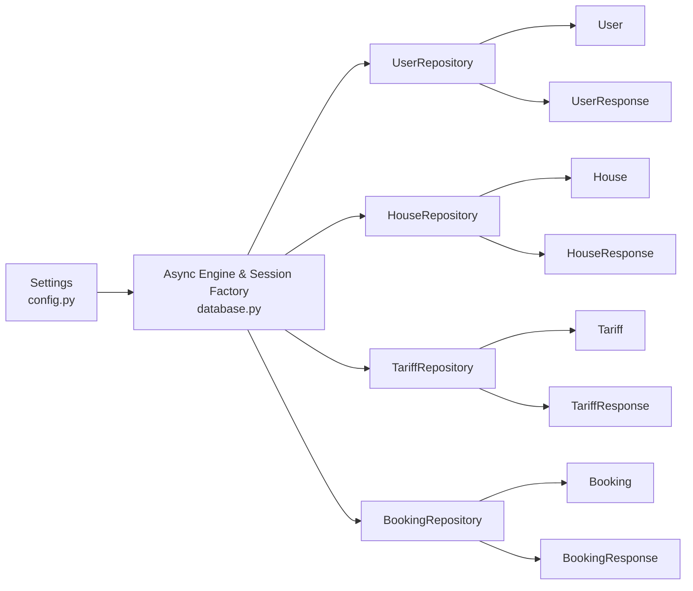

# CRUD Operations and Query Methods

<cite>
**Referenced Files in This Document**
- [backend/database.py](file://backend/database.py)
- [backend/config.py](file://backend/config.py)
- [backend/models/__init__.py](file://backend/models/__init__.py)
- [backend/models/user.py](file://backend/models/user.py)
- [backend/models/house.py](file://backend/models/house.py)
- [backend/models/tariff.py](file://backend/models/tariff.py)
- [backend/models/booking.py](file://backend/models/booking.py)
- [backend/schemas/__init__.py](file://backend/schemas/__init__.py)
- [backend/schemas/common.py](file://backend/schemas/common.py)
- [backend/schemas/user.py](file://backend/schemas/user.py)
- [backend/schemas/house.py](file://backend/schemas/house.py)
- [backend/schemas/tariff.py](file://backend/schemas/tariff.py)
- [backend/schemas/booking.py](file://backend/schemas/booking.py)
- [backend/repositories/__init__.py](file://backend/repositories/__init__.py)
- [backend/repositories/user.py](file://backend/repositories/user.py)
- [backend/repositories/house.py](file://backend/repositories/house.py)
- [backend/repositories/tariff.py](file://backend/repositories/tariff.py)
- [backend/repositories/booking.py](file://backend/repositories/booking.py)
</cite>

## Table of Contents
1. [Introduction](#introduction)
2. [Project Structure](#project-structure)
3. [Core Components](#core-components)
4. [Architecture Overview](#architecture-overview)
5. [Detailed Component Analysis](#detailed-component-analysis)
6. [Dependency Analysis](#dependency-analysis)
7. [Performance Considerations](#performance-considerations)
8. [Troubleshooting Guide](#troubleshooting-guide)
9. [Conclusion](#conclusion)
10. [Appendices](#appendices)

## Introduction
This document explains the CRUD operations and query methods implemented across the repositories, focusing on create, read, update, and delete patterns. It also documents query building with SQLAlchemy’s async capabilities, including filtering, sorting, pagination, and aggregation. Practical examples demonstrate complex queries with joins, subqueries, and aggregate functions. Guidance is provided for performance optimization (eager loading, query tuning, indexing) and extending repositories with custom query methods. Finally, it covers Pydantic validation for request/response formatting and error handling patterns.

## Project Structure
The backend follows a layered architecture:
- Configuration and database initialization
- SQLAlchemy models with declarative base
- Pydantic schemas for validation and serialization
- Repositories encapsulating async CRUD and query logic
- Services orchestrate business logic and coordinate repositories
- API endpoints expose resources and delegate to services

**Diagram sources**
- [backend/config.py:1-25](file://backend/config.py#L1-L25)
- [backend/database.py:1-41](file://backend/database.py#L1-L41)
- [backend/models/__init__.py:1-16](file://backend/models/__init__.py#L1-L16)
- [backend/schemas/__init__.py:1-63](file://backend/schemas/__init__.py#L1-L63)
- [backend/repositories/__init__.py:1-6](file://backend/repositories/__init__.py#L1-L6)

**Section sources**
- [backend/config.py:1-25](file://backend/config.py#L1-L25)
- [backend/database.py:1-41](file://backend/database.py#L1-L41)
- [backend/models/__init__.py:1-16](file://backend/models/__init__.py#L1-L16)
- [backend/schemas/__init__.py:1-63](file://backend/schemas/__init__.py#L1-L63)
- [backend/repositories/__init__.py:1-6](file://backend/repositories/__init__.py#L1-L6)

## Core Components
- Database configuration initializes an async engine and session factory, and provides a dependency to supply sessions to repositories.
- SQLAlchemy models define entities and relationships with indices and foreign keys.
- Pydantic schemas define request/response shapes, validation rules, and serialization behavior.
- Repositories implement CRUD and query methods with async SQLAlchemy, returning validated Pydantic models.

Key implementation patterns:
- Create: Instantiate model, add to session, flush to persist, refresh to load defaults, return validated response.
- Read: Fetch by primary key or filtered lists with pagination and sorting; return validated models.
- Update: Select existing record, conditionally set fields, flush and refresh, return validated model or None.
- Delete: Select and delete, return boolean presence indicator.
- Query building: Compose select statements with filters, subqueries for counts, ordering, and pagination.

**Section sources**
- [backend/database.py:26-41](file://backend/database.py#L26-L41)
- [backend/models/user.py:19-32](file://backend/models/user.py#L19-L32)
- [backend/models/house.py:9-24](file://backend/models/house.py#L9-L24)
- [backend/models/tariff.py:9-21](file://backend/models/tariff.py#L9-L21)
- [backend/models/booking.py:20-41](file://backend/models/booking.py#L20-L41)
- [backend/schemas/user.py:25-36](file://backend/schemas/user.py#L25-L36)
- [backend/schemas/house.py:34-45](file://backend/schemas/house.py#L34-L45)
- [backend/schemas/tariff.py:15-21](file://backend/schemas/tariff.py#L15-L21)
- [backend/schemas/booking.py:43-68](file://backend/schemas/booking.py#L43-L68)
- [backend/repositories/user.py:23-44](file://backend/repositories/user.py#L23-L44)
- [backend/repositories/house.py:23-54](file://backend/repositories/house.py#L23-L54)
- [backend/repositories/tariff.py:23-42](file://backend/repositories/tariff.py#L23-L42)
- [backend/repositories/booking.py:24-59](file://backend/repositories/booking.py#L24-L59)

## Architecture Overview
The repositories depend on async sessions to execute SQLAlchemy select statements. They convert ORM rows to Pydantic models via model validation. Pagination and counts are computed using subqueries. Validation and error responses are standardized via Pydantic schemas.

**Diagram sources**
- [backend/repositories/user.py:12-168](file://backend/repositories/user.py#L12-L168)
- [backend/repositories/house.py:12-183](file://backend/repositories/house.py#L12-L183)
- [backend/repositories/tariff.py:12-151](file://backend/repositories/tariff.py#L12-L151)
- [backend/repositories/booking.py:13-224](file://backend/repositories/booking.py#L13-L224)
- [backend/models/user.py:19-32](file://backend/models/user.py#L19-L32)
- [backend/models/house.py:9-24](file://backend/models/house.py#L9-L24)
- [backend/models/tariff.py:9-21](file://backend/models/tariff.py#L9-L21)
- [backend/models/booking.py:20-41](file://backend/models/booking.py#L20-L41)
- [backend/schemas/user.py:25-36](file://backend/schemas/user.py#L25-L36)
- [backend/schemas/house.py:34-45](file://backend/schemas/house.py#L34-L45)
- [backend/schemas/tariff.py:15-21](file://backend/schemas/tariff.py#L15-L21)
- [backend/schemas/booking.py:43-68](file://backend/schemas/booking.py#L43-L68)

## Detailed Component Analysis

### User Repository CRUD and Queries
- Create: Adds a new User, flushes, refreshes, validates, and returns UserResponse.
- Read: Fetch by id or Telegram id; returns validated UserResponse or None.
- Read list: Supports filtering by role, pagination, sorting; computes total via subquery.
- Update: Conditionally sets name or role; returns validated UserResponse or None.
- Delete: Removes by id; returns boolean presence.

**Diagram sources**
- [backend/repositories/user.py:12-168](file://backend/repositories/user.py#L12-L168)
- [backend/models/user.py:19-32](file://backend/models/user.py#L19-L32)
- [backend/schemas/user.py:25-36](file://backend/schemas/user.py#L25-L36)

**Section sources**
- [backend/repositories/user.py:23-44](file://backend/repositories/user.py#L23-L44)
- [backend/repositories/user.py:58-71](file://backend/repositories/user.py#L58-L71)
- [backend/repositories/user.py:73-120](file://backend/repositories/user.py#L73-L120)
- [backend/repositories/user.py:122-150](file://backend/repositories/user.py#L122-L150)
- [backend/repositories/user.py:152-167](file://backend/repositories/user.py#L152-L167)

### House Repository CRUD and Queries
- Create: Adds House, flushes, refreshes, validates, returns HouseResponse.
- Read: Fetch by id; returns validated HouseResponse or None.
- Read list: Filters by owner, activity, capacity bounds; computes total via subquery; supports sorting and pagination.
- Update: Conditionally sets name/description/capacity/is_active; returns validated HouseResponse or None.
- Delete: Removes by id; returns boolean presence.

**Diagram sources**
- [backend/repositories/house.py:12-183](file://backend/repositories/house.py#L12-L183)
- [backend/models/house.py:9-24](file://backend/models/house.py#L9-L24)
- [backend/schemas/house.py:34-45](file://backend/schemas/house.py#L34-L45)

**Section sources**
- [backend/repositories/house.py:23-54](file://backend/repositories/house.py#L23-L54)
- [backend/repositories/house.py:55-67](file://backend/repositories/house.py#L55-L67)
- [backend/repositories/house.py:68-127](file://backend/repositories/house.py#L68-L127)
- [backend/repositories/house.py:129-166](file://backend/repositories/house.py#L129-L166)
- [backend/repositories/house.py:167-182](file://backend/repositories/house.py#L167-L182)

### Tariff Repository CRUD and Queries
- Create: Adds Tariff, flushes, refreshes, validates, returns TariffResponse.
- Read: Fetch by id; returns validated TariffResponse or None.
- Read list: Computes total via subquery; supports sorting and pagination.
- Update: Conditionally sets name or amount; returns validated TariffResponse or None.
- Delete: Removes by id; returns boolean presence.

**Diagram sources**
- [backend/repositories/tariff.py:12-151](file://backend/repositories/tariff.py#L12-L151)
- [backend/models/tariff.py:9-21](file://backend/models/tariff.py#L9-L21)
- [backend/schemas/tariff.py:15-21](file://backend/schemas/tariff.py#L15-L21)

**Section sources**
- [backend/repositories/tariff.py:23-42](file://backend/repositories/tariff.py#L23-L42)
- [backend/repositories/tariff.py:43-57](file://backend/repositories/tariff.py#L43-L57)
- [backend/repositories/tariff.py:58-99](file://backend/repositories/tariff.py#L58-L99)
- [backend/repositories/tariff.py:101-131](file://backend/repositories/tariff.py#L101-L131)
- [backend/repositories/tariff.py:133-150](file://backend/repositories/tariff.py#L133-L150)

### Booking Repository CRUD and Queries
- Create: Adds Booking with default status, flushes, refreshes, validates, returns BookingResponse.
- Read: Fetch by id; returns validated BookingResponse or None.
- Read list: Filters by user_id, house_id, status; supports date-range filters in schema; computes total via subquery; applies sorting and pagination.
- Update: Conditionally sets check-in/out, planned/actual guests, total amount, status; returns validated BookingResponse or None.
- Delete: Removes by id; returns boolean presence.
- Specialized query: Retrieves bookings for a house excluding a specific booking id.

**Diagram sources**
- [backend/repositories/booking.py:13-224](file://backend/repositories/booking.py#L13-L224)
- [backend/models/booking.py:20-41](file://backend/models/booking.py#L20-L41)
- [backend/schemas/booking.py:43-68](file://backend/schemas/booking.py#L43-L68)

**Section sources**
- [backend/repositories/booking.py:24-59](file://backend/repositories/booking.py#L24-L59)
- [backend/repositories/booking.py:60-74](file://backend/repositories/booking.py#L60-L74)
- [backend/repositories/booking.py:75-131](file://backend/repositories/booking.py#L75-L131)
- [backend/repositories/booking.py:132-179](file://backend/repositories/booking.py#L132-L179)
- [backend/repositories/booking.py:180-198](file://backend/repositories/booking.py#L180-L198)
- [backend/repositories/booking.py:199-224](file://backend/repositories/booking.py#L199-L224)

### Query Building Patterns with SQLAlchemy Async
- Filtering: Chain where clauses for equality and range conditions.
- Aggregation and Counting: Use func.count with a subquery derived from the filtered query to compute total without re-executing the full list.
- Sorting: Dynamically resolve attribute names and apply asc/desc ordering; guard against invalid field names.
- Pagination: Apply offset and limit to the final query.
- Subqueries and Joins: While the current repositories primarily use straightforward selects, the pattern supports adding joins and correlated subqueries for advanced analytics.

**Diagram sources**
- [backend/repositories/house.py:92-127](file://backend/repositories/house.py#L92-L127)
- [backend/repositories/user.py:91-120](file://backend/repositories/user.py#L91-L120)
- [backend/repositories/tariff.py:74-99](file://backend/repositories/tariff.py#L74-L99)
- [backend/repositories/booking.py:97-131](file://backend/repositories/booking.py#L97-L131)

**Section sources**
- [backend/repositories/house.py:92-127](file://backend/repositories/house.py#L92-L127)
- [backend/repositories/user.py:91-120](file://backend/repositories/user.py#L91-L120)
- [backend/repositories/tariff.py:74-99](file://backend/repositories/tariff.py#L74-L99)
- [backend/repositories/booking.py:97-131](file://backend/repositories/booking.py#L97-L131)

### Practical Examples: Complex Queries
- Subquery-based counting: Repositories compute totals using a subquery derived from the filtered query to avoid double-counting or redundant scans.
- Sorting by dynamic field: Sorting resolves attribute names and toggles ascending/descending based on a leading minus sign; invalid fields are ignored safely.
- Pagination: Offset and limit applied after filters and ordering.
- Advanced analytics (conceptual): To implement aggregate functions or joins, extend repositories by adding select statements that join related models and apply func.sum, func.avg, or group-by patterns. Use subqueries for correlated computations (e.g., per-house occupancy metrics).

Note: The current repositories focus on straightforward CRUD and list endpoints. Extending them with joins and aggregates follows the established pattern of composing select statements and validating results.

**Section sources**
- [backend/repositories/house.py:105-108](file://backend/repositories/house.py#L105-L108)
- [backend/repositories/user.py:98-101](file://backend/repositories/user.py#L98-L101)
- [backend/repositories/tariff.py:77-80](file://backend/repositories/tariff.py#L77-L80)
- [backend/repositories/booking.py:108-111](file://backend/repositories/booking.py#L108-L111)

### Parameter Validation, Error Handling, and Return Formatting
- Pydantic validation:
  - Request schemas enforce field constraints and cross-field validators (e.g., date ordering).
  - Response schemas enable from_attributes validation to convert ORM rows to Pydantic models.
- Error handling:
  - Database session dependency commits on success, rolls back on exceptions, and closes the session.
  - Repository methods return None for missing records (e.g., update/get/delete) or validated models for success.
- Standardized error responses:
  - ErrorResponse and PaginatedResponse provide consistent API error and list wrappers.

**Diagram sources**
- [backend/database.py:26-41](file://backend/database.py#L26-L41)
- [backend/repositories/user.py:23-44](file://backend/repositories/user.py#L23-L44)
- [backend/repositories/house.py:23-54](file://backend/repositories/house.py#L23-L54)
- [backend/repositories/tariff.py:23-42](file://backend/repositories/tariff.py#L23-L42)
- [backend/repositories/booking.py:24-59](file://backend/repositories/booking.py#L24-L59)

**Section sources**
- [backend/schemas/booking.py:82-88](file://backend/schemas/booking.py#L82-L88)
- [backend/schemas/booking.py:102-107](file://backend/schemas/booking.py#L102-L107)
- [backend/schemas/common.py:16-28](file://backend/schemas/common.py#L16-L28)
- [backend/schemas/common.py:33-43](file://backend/schemas/common.py#L33-L43)
- [backend/database.py:26-41](file://backend/database.py#L26-L41)

## Dependency Analysis
Repositories depend on:
- AsyncSession for database operations
- SQLAlchemy models for ORM mapping
- Pydantic schemas for validation and serialization

**Diagram sources**
- [backend/config.py:1-25](file://backend/config.py#L1-L25)
- [backend/database.py:1-41](file://backend/database.py#L1-L41)
- [backend/repositories/user.py:12-168](file://backend/repositories/user.py#L12-L168)
- [backend/repositories/house.py:12-183](file://backend/repositories/house.py#L12-L183)
- [backend/repositories/tariff.py:12-151](file://backend/repositories/tariff.py#L12-L151)
- [backend/repositories/booking.py:13-224](file://backend/repositories/booking.py#L13-L224)
- [backend/models/user.py:19-32](file://backend/models/user.py#L19-L32)
- [backend/models/house.py:9-24](file://backend/models/house.py#L9-L24)
- [backend/models/tariff.py:9-21](file://backend/models/tariff.py#L9-L21)
- [backend/models/booking.py:20-41](file://backend/models/booking.py#L20-L41)
- [backend/schemas/user.py:25-36](file://backend/schemas/user.py#L25-L36)
- [backend/schemas/house.py:34-45](file://backend/schemas/house.py#L34-L45)
- [backend/schemas/tariff.py:15-21](file://backend/schemas/tariff.py#L15-L21)
- [backend/schemas/booking.py:43-68](file://backend/schemas/booking.py#L43-L68)

**Section sources**
- [backend/config.py:1-25](file://backend/config.py#L1-L25)
- [backend/database.py:1-41](file://backend/database.py#L1-L41)
- [backend/repositories/__init__.py:1-6](file://backend/repositories/__init__.py#L1-L6)
- [backend/models/__init__.py:1-16](file://backend/models/__init__.py#L1-L16)
- [backend/schemas/__init__.py:1-63](file://backend/schemas/__init__.py#L1-L63)

## Performance Considerations
- Eager loading: Use joinedload or selectinload when retrieving related entities to reduce N+1 queries. Apply to frequently accessed relationships in repositories.
- Query optimization:
  - Prefer filtering early to minimize result sets.
  - Use indexes on frequently filtered/sorted columns (e.g., foreign keys, telegram_id, timestamps).
  - Limit selected columns for list endpoints to reduce payload size.
- Pagination:
  - Always use offset/limit for large datasets.
  - Compute counts with subqueries to avoid scanning the full result set twice.
- Aggregations:
  - For per-entity aggregates, add select expressions with func.sum, func.avg, and group-by patterns.
  - For correlated subqueries, derive totals per row efficiently using scalar selects.
- Index usage:
  - Ensure unique and composite indexes for lookups (e.g., telegram_id, house owner_id).
  - Add range indexes for date columns used in availability checks.

[No sources needed since this section provides general guidance]

## Troubleshooting Guide
- Validation errors:
  - Ensure request schemas are used to validate inputs before calling repositories.
  - Cross-field validators (e.g., date ordering) will raise validation errors; catch and map to ErrorResponse.
- Not found scenarios:
  - Repositories return None for missing records; callers should handle None and return appropriate NotFound responses.
- Database errors:
  - Session dependency handles commit/rollback; unexpected exceptions trigger rollback and re-raise.
- Consistent error responses:
  - Use ErrorResponse and PaginatedResponse to maintain uniform API error and list wrappers.

**Section sources**
- [backend/schemas/booking.py:82-88](file://backend/schemas/booking.py#L82-L88)
- [backend/schemas/booking.py:102-107](file://backend/schemas/booking.py#L102-L107)
- [backend/schemas/common.py:16-28](file://backend/schemas/common.py#L16-L28)
- [backend/schemas/common.py:33-43](file://backend/schemas/common.py#L33-L43)
- [backend/database.py:26-41](file://backend/database.py#L26-L41)

## Conclusion
The repositories implement robust, consistent CRUD and query patterns using SQLAlchemy’s async capabilities. Filtering, sorting, pagination, and counting are handled uniformly across entities. Pydantic schemas ensure strong validation and serialization. Extending repositories with joins, subqueries, and aggregations follows the established patterns. Adopting eager loading, optimizing queries, and indexing improves performance. Standardized error handling and response formatting enhance API reliability.

[No sources needed since this section summarizes without analyzing specific files]

## Appendices

### Implementing Custom Query Methods
- Extend repositories with new async methods that:
  - Build select statements with filters and ordering
  - Compute totals with subqueries
  - Paginate results
  - Validate and return Pydantic models
- For complex analytics:
  - Join related models
  - Use aggregate functions and group-by
  - Employ correlated subqueries for per-row metrics

[No sources needed since this section provides general guidance]