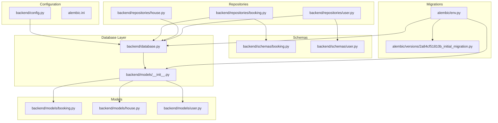
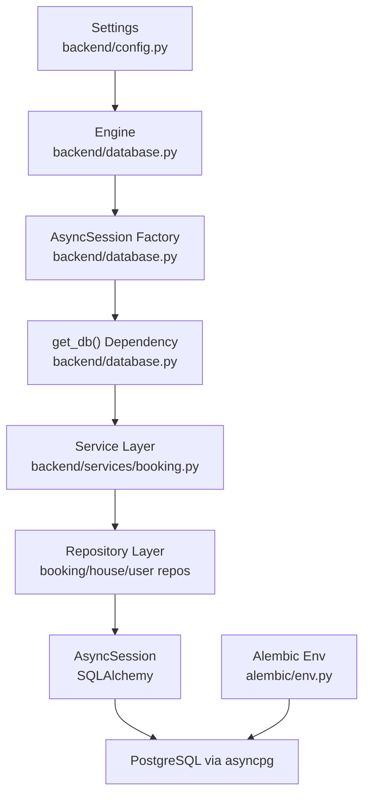
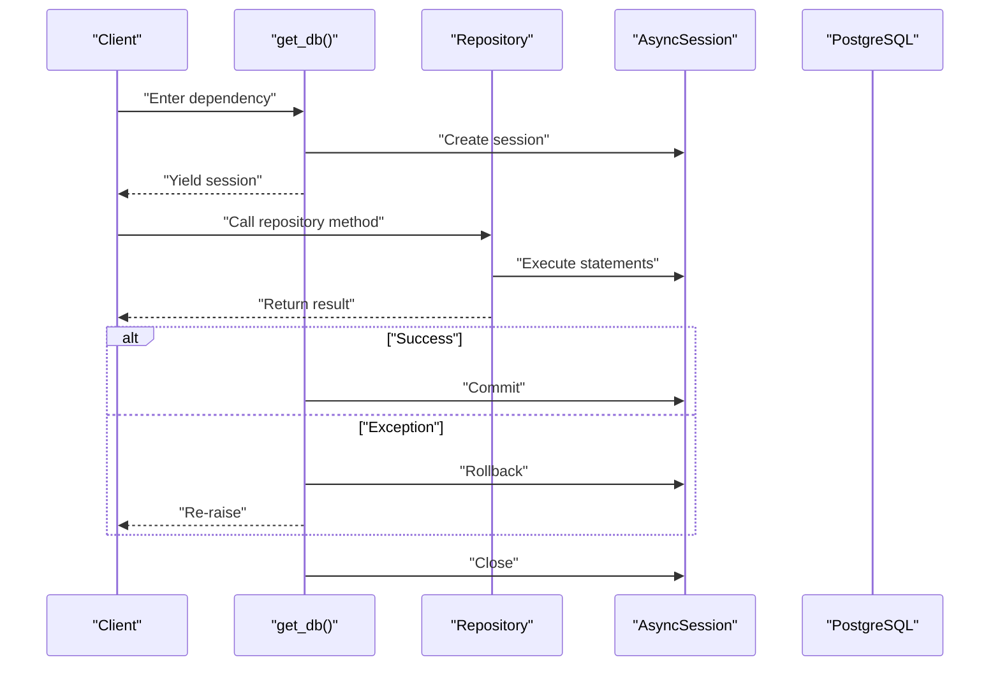
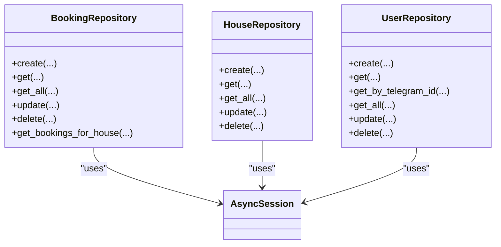
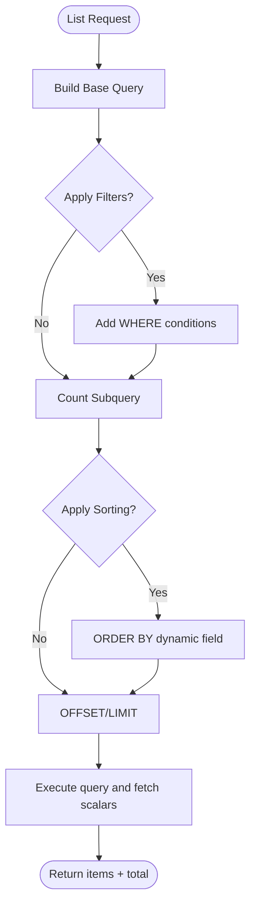
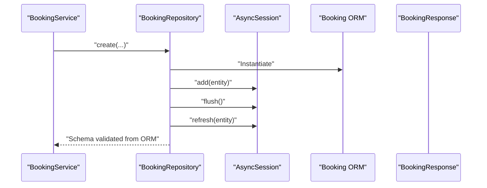
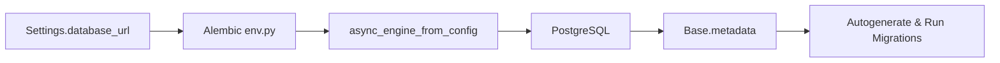
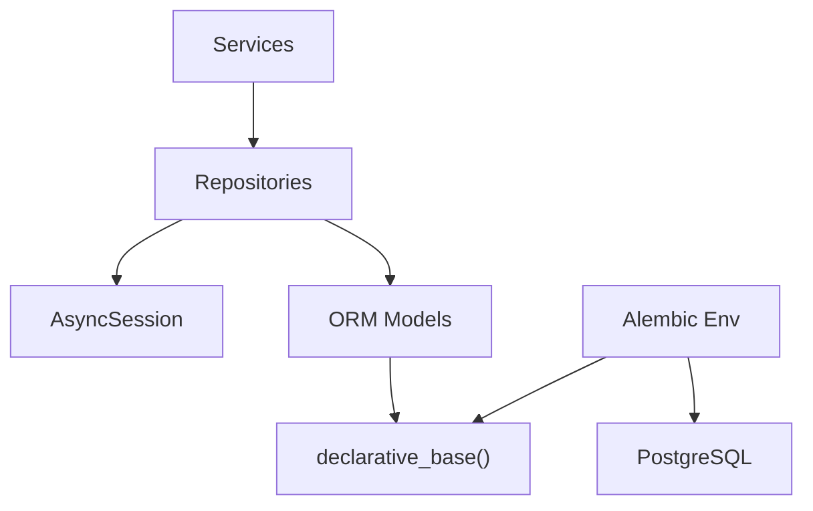

# Data Access Layer

<cite>
**Referenced Files in This Document**
- [backend/database.py](file://backend/database.py)
- [backend/config.py](file://backend/config.py)
- [backend/repositories/booking.py](file://backend/repositories/booking.py)
- [backend/repositories/house.py](file://backend/repositories/house.py)
- [backend/repositories/user.py](file://backend/repositories/user.py)
- [backend/repositories/__init__.py](file://backend/repositories/__init__.py)
- [backend/models/booking.py](file://backend/models/booking.py)
- [backend/models/house.py](file://backend/models/house.py)
- [backend/models/user.py](file://backend/models/user.py)
- [backend/models/__init__.py](file://backend/models/__init__.py)
- [backend/schemas/booking.py](file://backend/schemas/booking.py)
- [backend/schemas/user.py](file://backend/schemas/user.py)
- [backend/services/booking.py](file://backend/services/booking.py)
- [alembic/env.py](file://alembic/env.py)
- [alembic/versions/2a84cf51810b_initial_migration.py](file://alembic/versions/2a84cf51810b_initial_migration.py)
- [alembic.ini](file://alembic.ini)
</cite>

## Table of Contents
1. [Introduction](#introduction)
2. [Project Structure](#project-structure)
3. [Core Components](#core-components)
4. [Architecture Overview](#architecture-overview)
5. [Detailed Component Analysis](#detailed-component-analysis)
6. [Dependency Analysis](#dependency-analysis)
7. [Performance Considerations](#performance-considerations)
8. [Troubleshooting Guide](#troubleshooting-guide)
9. [Conclusion](#conclusion)
10. [Appendices](#appendices)

## Introduction
This document explains the data access layer built on SQLAlchemy 2.x with async SQLAlchemy sessions and the repository pattern. It covers database session management, connection handling, transaction lifecycle, CRUD operations, query optimization, and data persistence patterns. It also documents database configuration, connection pooling, and migration management via Alembic. Practical examples illustrate common data access scenarios, error handling, and performance optimization techniques, including handling connection timeouts and transaction failures.

## Project Structure
The data access layer is organized around:
- Configuration and engine/session factory
- SQLAlchemy declarative base and models
- Repository classes per domain entity
- Pydantic schemas for request/response validation
- Alembic migrations for schema evolution

**Diagram sources**
- [backend/config.py:1-25](file://backend/config.py#L1-L25)
- [backend/database.py:1-41](file://backend/database.py#L1-L41)
- [backend/models/__init__.py:1-16](file://backend/models/__init__.py#L1-L16)
- [backend/repositories/booking.py:1-224](file://backend/repositories/booking.py#L1-L224)
- [backend/repositories/house.py:1-183](file://backend/repositories/house.py#L1-L183)
- [backend/repositories/user.py:1-168](file://backend/repositories/user.py#L1-L168)
- [backend/models/booking.py:1-41](file://backend/models/booking.py#L1-L41)
- [backend/models/house.py:1-24](file://backend/models/house.py#L1-L24)
- [backend/models/user.py:1-32](file://backend/models/user.py#L1-L32)
- [backend/schemas/booking.py:1-133](file://backend/schemas/booking.py#L1-L133)
- [backend/schemas/user.py:1-72](file://backend/schemas/user.py#L1-L72)
- [alembic/env.py:1-95](file://alembic/env.py#L1-L95)
- [alembic/versions/2a84cf51810b_initial_migration.py](file://alembic/versions/2a84cf51810b_initial_migration.py)

**Section sources**
- [backend/config.py:1-25](file://backend/config.py#L1-L25)
- [backend/database.py:1-41](file://backend/database.py#L1-L41)
- [backend/models/__init__.py:1-16](file://backend/models/__init__.py#L1-L16)
- [backend/repositories/__init__.py:1-6](file://backend/repositories/__init__.py#L1-L6)

## Core Components
- Database configuration and session factory
  - Asynchronous engine configured from settings
  - Async session factory with explicit AsyncSession class and commit behavior
  - Global declarative base for models
  - Dependency-provided session with automatic commit/rollback/close lifecycle

- Repositories
  - Per-entity repositories encapsulate CRUD and query logic
  - Use SQLAlchemy select constructs and scalar queries
  - Return Pydantic schemas validated from ORM instances

- Models and Schemas
  - SQLAlchemy models define tables and relationships
  - Pydantic schemas define request/response contracts and validation

- Alembic migrations
  - Async-aware environment
  - Uses settings for database URL and metadata for autogenerate

**Section sources**
- [backend/database.py:1-41](file://backend/database.py#L1-L41)
- [backend/config.py:17-18](file://backend/config.py#L17-L18)
- [backend/repositories/booking.py:13-224](file://backend/repositories/booking.py#L13-L224)
- [backend/repositories/house.py:12-183](file://backend/repositories/house.py#L12-L183)
- [backend/repositories/user.py:12-168](file://backend/repositories/user.py#L12-L168)
- [backend/models/booking.py:20-41](file://backend/models/booking.py#L20-L41)
- [backend/models/house.py:9-24](file://backend/models/house.py#L9-L24)
- [backend/models/user.py:19-32](file://backend/models/user.py#L19-L32)
- [backend/schemas/booking.py:43-68](file://backend/schemas/booking.py#L43-L68)
- [backend/schemas/user.py:25-36](file://backend/schemas/user.py#L25-L36)
- [alembic/env.py:12-31](file://alembic/env.py#L12-L31)

## Architecture Overview
The data access layer follows a layered architecture:
- Configuration supplies the database URL
- The engine and session factory are created once
- FastAPI dependency injection provides an AsyncSession per request
- Repositories operate within the session’s transaction boundary
- Services orchestrate business logic and coordinate multiple repositories
- Alembic manages schema evolution

**Diagram sources**
- [backend/config.py:17-18](file://backend/config.py#L17-L18)
- [backend/database.py:9-23](file://backend/database.py#L9-L23)
- [backend/database.py:26-41](file://backend/database.py#L26-L41)
- [backend/services/booking.py:29-54](file://backend/services/booking.py#L29-L54)
- [alembic/env.py:12-31](file://alembic/env.py#L12-L31)

## Detailed Component Analysis

### Database Session Management and Transaction Lifecycle
- Engine and session factory
  - Asynchronous engine created from settings.database_url
  - AsyncSessionLocal configured with explicit AsyncSession class and expire_on_commit disabled
- Session dependency
  - get_db() yields a scoped AsyncSession
  - Commits on success, rolls back on exceptions, and closes the session in finally
- Transaction semantics
  - Each request operates within a single transaction
  - flush() ensures immediate persistence of newly added objects
  - refresh() re-fetches attributes after flush/commit

**Diagram sources**
- [backend/database.py:26-41](file://backend/database.py#L26-L41)
- [backend/repositories/booking.py:46-58](file://backend/repositories/booking.py#L46-L58)

**Section sources**
- [backend/database.py:9-23](file://backend/database.py#L9-L23)
- [backend/database.py:26-41](file://backend/database.py#L26-L41)

### Repository Pattern Implementation
- BookingRepository
  - Implements create, get, get_all, update, delete, and a specialized query for house bookings
  - Uses select() and func.count() with subqueries for pagination and counts
  - Applies dynamic filters and sorting based on parameters
- HouseRepository
  - Similar CRUD and query patterns with owner and capacity filters
- UserRepository
  - Supports get_by_telegram_id and role-based filtering

**Diagram sources**
- [backend/repositories/booking.py:13-224](file://backend/repositories/booking.py#L13-L224)
- [backend/repositories/house.py:12-183](file://backend/repositories/house.py#L12-L183)
- [backend/repositories/user.py:12-168](file://backend/repositories/user.py#L12-L168)

**Section sources**
- [backend/repositories/booking.py:24-130](file://backend/repositories/booking.py#L24-L130)
- [backend/repositories/house.py:23-127](file://backend/repositories/house.py#L23-L127)
- [backend/repositories/user.py:23-150](file://backend/repositories/user.py#L23-L150)

### CRUD Operations and Query Patterns
- Create
  - Instantiate ORM entity, add to session, flush to persist, refresh to load defaults, return validated schema
- Read
  - Scalar queries by primary key; optional specialized queries (e.g., house bookings excluding a specific ID)
- Update
  - Load entity, set provided fields, flush and refresh
- Delete
  - Load entity and delete it
- List with Filtering, Sorting, and Pagination
  - Build query with optional WHERE clauses
  - Compute total count using a subquery of the filtered base query
  - Apply ORDER BY dynamically by field name and direction
  - Apply OFFSET/LIMIT for pagination

**Diagram sources**
- [backend/repositories/booking.py:75-130](file://backend/repositories/booking.py#L75-L130)
- [backend/repositories/house.py:68-127](file://backend/repositories/house.py#L68-L127)
- [backend/repositories/user.py:73-120](file://backend/repositories/user.py#L73-L120)

**Section sources**
- [backend/repositories/booking.py:75-130](file://backend/repositories/booking.py#L75-L130)
- [backend/repositories/house.py:68-127](file://backend/repositories/house.py#L68-L127)
- [backend/repositories/user.py:73-120](file://backend/repositories/user.py#L73-L120)

### Data Persistence Patterns and Validation
- Persistence
  - flush() ensures immediate persistence for subsequent operations
  - refresh() reloads attributes after flush/commit
- Schema validation
  - Repository methods return Pydantic schemas validated from ORM instances
  - Service layer composes business logic and delegates persistence to repositories
- Model relationships
  - Foreign keys enforce referential integrity (e.g., house owner references users, booking references users and houses)

**Diagram sources**
- [backend/services/booking.py:127-170](file://backend/services/booking.py#L127-L170)
- [backend/repositories/booking.py:46-58](file://backend/repositories/booking.py#L46-L58)
- [backend/schemas/booking.py:43-68](file://backend/schemas/booking.py#L43-L68)

**Section sources**
- [backend/repositories/booking.py:46-58](file://backend/repositories/booking.py#L46-L58)
- [backend/schemas/booking.py:43-68](file://backend/schemas/booking.py#L43-L68)
- [backend/models/booking.py:20-41](file://backend/models/booking.py#L20-L41)

### Database Configuration, Connection Pooling, and Alembic
- Configuration
  - Settings class defines database_url and other backend settings
- Engine and Pooling
  - Engine created with echo enabled and future=True
  - No explicit pool arguments shown; defaults apply
- Alembic Environment
  - Reads database_url from settings
  - Uses async_engine_from_config for online migrations
  - Sets target_metadata from declarative Base
  - Supports offline and online modes

**Diagram sources**
- [backend/config.py:17-18](file://backend/config.py#L17-L18)
- [alembic/env.py:20-31](file://alembic/env.py#L20-L31)
- [alembic/env.py:70-84](file://alembic/env.py#L70-L84)

**Section sources**
- [backend/config.py:17-18](file://backend/config.py#L17-L18)
- [backend/database.py:9-23](file://backend/database.py#L9-L23)
- [alembic/env.py:20-31](file://alembic/env.py#L20-L31)
- [alembic/env.py:70-84](file://alembic/env.py#L70-L84)

## Dependency Analysis
- Cohesion and Coupling
  - Repositories depend on AsyncSession and SQLAlchemy select constructs
  - Models are decoupled from repositories via Base
  - Services depend on repositories, not on sessions directly
- External Dependencies
  - SQLAlchemy 2.x async core
  - Alembic for migrations
  - FastAPI dependency injection for session provisioning

**Diagram sources**
- [backend/services/booking.py:57-77](file://backend/services/booking.py#L57-L77)
- [backend/repositories/booking.py:16-22](file://backend/repositories/booking.py#L16-L22)
- [backend/models/__init__.py:3-6](file://backend/models/__init__.py#L3-L6)
- [alembic/env.py:12-31](file://alembic/env.py#L12-L31)

**Section sources**
- [backend/services/booking.py:57-77](file://backend/services/booking.py#L57-L77)
- [backend/repositories/booking.py:16-22](file://backend/repositories/booking.py#L16-L22)
- [backend/models/__init__.py:3-6](file://backend/models/__init__.py#L3-L6)
- [alembic/env.py:12-31](file://alembic/env.py#L12-L31)

## Performance Considerations
- Query optimization
  - Use scalar_one_or_none() for single-row reads to avoid unnecessary overhead
  - Compute total count with a subquery of the filtered base query to avoid double-counting
  - Apply ORDER BY dynamically by field name; ensure appropriate indexes exist on sorted columns
  - Limit and offset for pagination; validate bounds to prevent excessive scans
- Persistence patterns
  - Prefer flush() when you need to read generated values before commit
  - Use refresh() after flush/commit to ensure latest state
- Connection and pooling
  - Configure engine pool parameters (e.g., pool_size, max_overflow, pool_recycle) as needed
  - Keep database_url secure and avoid exposing credentials
- Indexes and constraints
  - Ensure primary keys and foreign keys are indexed
  - Add indexes on frequently filtered/sorted columns (e.g., user_id, house_id, status)
- Transactions
  - Keep transactions short; release sessions promptly
  - Avoid long-running transactions to reduce contention

[No sources needed since this section provides general guidance]

## Troubleshooting Guide
- Connection timeouts
  - Verify database_url correctness and network connectivity
  - Increase connection timeouts and pool timeouts if necessary
  - Ensure the database is reachable and accepting connections
- Transaction failures
  - Inspect rollback behavior in get_db(); ensure exceptions propagate correctly
  - Confirm that flush() and refresh() are called appropriately after writes
- Migration errors
  - Use Alembic offline mode to inspect generated SQL
  - Run online migrations with proper database URL from settings
  - Check Alembic env configuration and target metadata alignment
- Validation and serialization
  - Ensure Pydantic schemas are validated from ORM instances using from_attributes-compatible configurations
  - Confirm that repository methods return validated schemas consistently

**Section sources**
- [backend/database.py:26-41](file://backend/database.py#L26-L41)
- [alembic/env.py:38-94](file://alembic/env.py#L38-L94)

## Conclusion
The data access layer leverages SQLAlchemy 2.x async capabilities with a clean repository pattern. Sessions are managed centrally with automatic commit/rollback semantics, while repositories encapsulate CRUD and query logic. Alembic supports asynchronous migrations aligned with the declarative base and settings-driven configuration. Following the outlined patterns and performance considerations helps maintain robust, scalable, and maintainable data access.

## Appendices

### Practical Examples and Scenarios
- Create a booking
  - Service validates guests and calculates amount, then delegates to repository create
  - Repository persists and returns validated schema
- List bookings with filters and pagination
  - Repository builds query, computes total via subquery, applies sorting and pagination
- Update booking dates and guests
  - Service checks authorization and date conflicts, recalculates amount if guests change, updates via repository
- Soft cancellation
  - Service enforces status rules and updates status via repository

**Section sources**
- [backend/services/booking.py:127-170](file://backend/services/booking.py#L127-L170)
- [backend/repositories/booking.py:75-130](file://backend/repositories/booking.py#L75-L130)
- [backend/services/booking.py:210-281](file://backend/services/booking.py#L210-L281)
- [backend/services/booking.py:283-321](file://backend/services/booking.py#L283-L321)