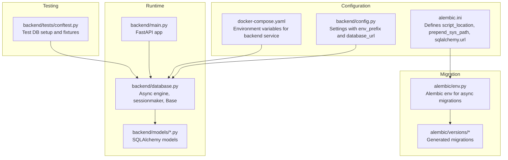
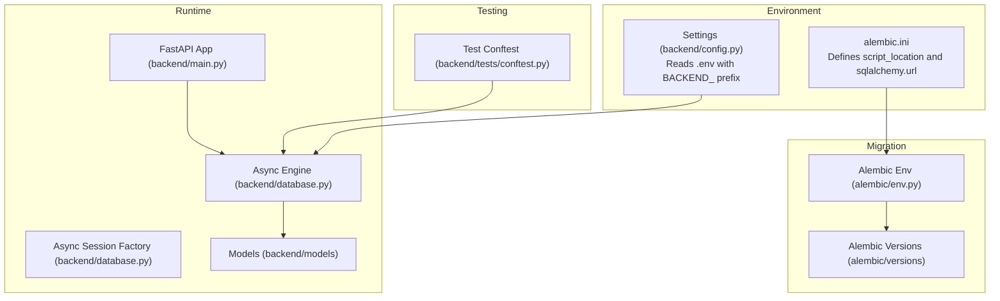
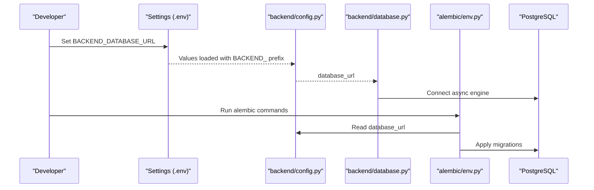
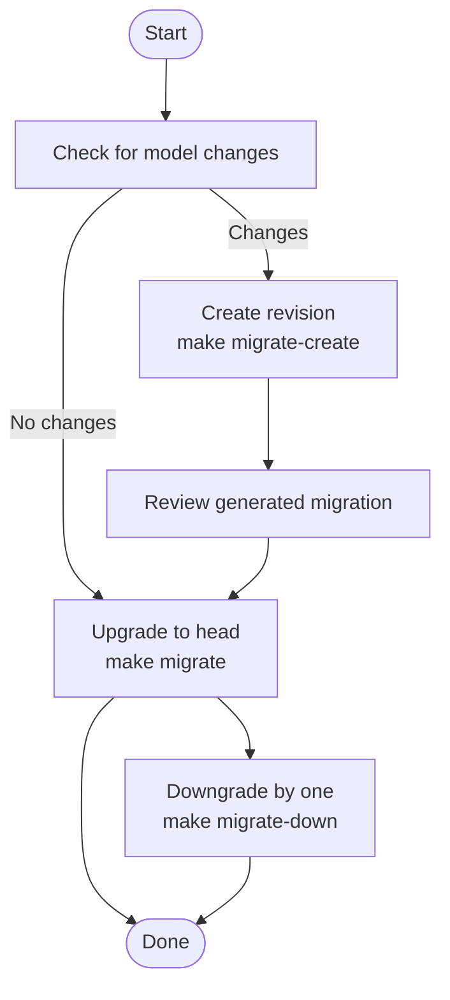
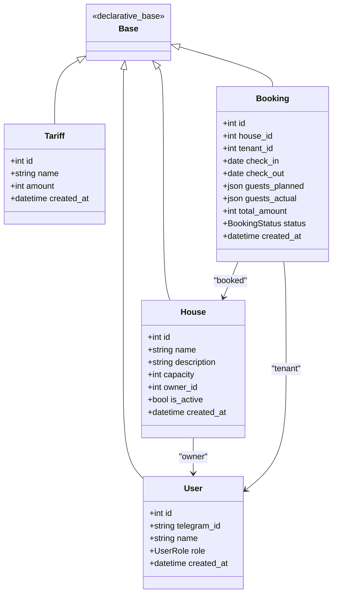
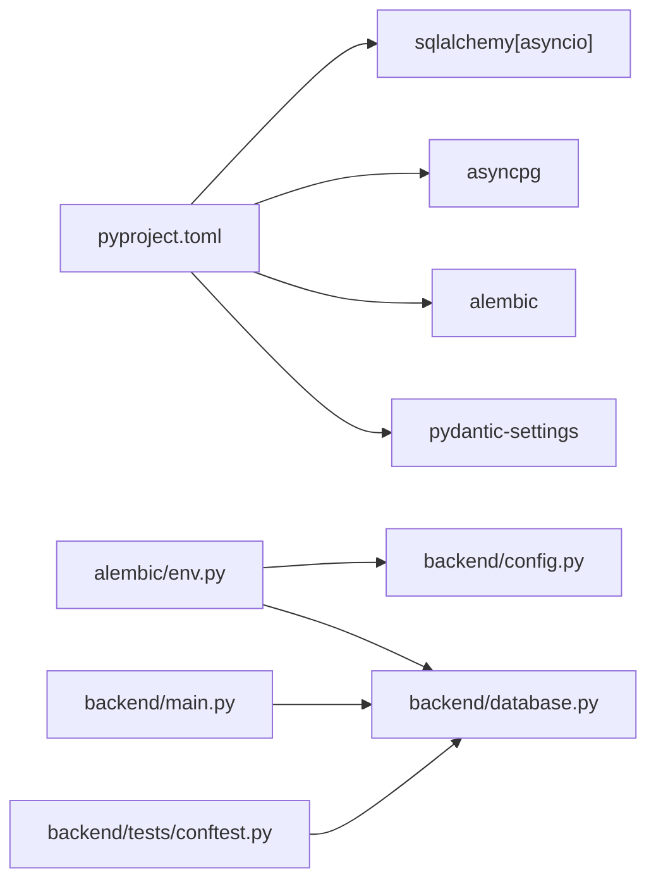

# Database Configuration and Migrations

<cite>
**Referenced Files in This Document**
- [alembic.ini](file://alembic.ini)
- [env.py](file://alembic/env.py)
- [2a84cf51810b_initial_migration.py](file://alembic/versions/2a84cf51810b_initial_migration.py)
- [config.py](file://backend/config.py)
- [database.py](file://backend/database.py)
- [user.py](file://backend/models/user.py)
- [house.py](file://backend/models/house.py)
- [tariff.py](file://backend/models/tariff.py)
- [booking.py](file://backend/models/booking.py)
- [__init__.py](file://backend/models/__init__.py)
- [conftest.py](file://backend/tests/conftest.py)
- [docker-compose.yaml](file://docker-compose.yaml)
- [Makefile](file://Makefile)
- [main.py](file://backend/main.py)
- [pyproject.toml](file://pyproject.toml)
</cite>

## Table of Contents
1. [Introduction](#introduction)
2. [Project Structure](#project-structure)
3. [Core Components](#core-components)
4. [Architecture Overview](#architecture-overview)
5. [Detailed Component Analysis](#detailed-component-analysis)
6. [Dependency Analysis](#dependency-analysis)
7. [Performance Considerations](#performance-considerations)
8. [Troubleshooting Guide](#troubleshooting-guide)
9. [Conclusion](#conclusion)
10. [Appendices](#appendices)

## Introduction
This document explains how the project configures and manages its database using SQLAlchemy and Alembic. It covers connection configuration, environment variable management, connection string handling, and the Alembic migration workflow. It also documents how SQLAlchemy models integrate with Alembic, practical examples of migration scripts, schema and data change strategies, initialization and seeding approaches, environment-specific configurations, best practices for reversible migrations, and troubleshooting common migration issues.

## Project Structure
The database and migration setup spans several areas:
- Alembic configuration and runtime environment
- SQLAlchemy engine and session factory
- Pydantic-based settings for environment variables
- SQL models that define the schema
- Test configuration for isolated database runs
- Docker Compose and Makefile targets for lifecycle operations

**Diagram sources**
- [alembic.ini:1-115](file://alembic.ini#L1-L115)
- [config.py:1-25](file://backend/config.py#L1-L25)
- [docker-compose.yaml:1-43](file://docker-compose.yaml#L1-L43)
- [database.py:1-41](file://backend/database.py#L1-L41)
- [env.py:1-95](file://alembic/env.py#L1-L95)
- [2a84cf51810b_initial_migration.py:1-84](file://alembic/versions/2a84cf51810b_initial_migration.py#L1-L84)
- [conftest.py:1-150](file://backend/tests/conftest.py#L1-L150)
- [main.py:1-173](file://backend/main.py#L1-L173)

**Section sources**
- [alembic.ini:1-115](file://alembic.ini#L1-L115)
- [config.py:1-25](file://backend/config.py#L1-L25)
- [docker-compose.yaml:1-43](file://docker-compose.yaml#L1-L43)
- [database.py:1-41](file://backend/database.py#L1-L41)
- [env.py:1-95](file://alembic/env.py#L1-L95)
- [2a84cf51810b_initial_migration.py:1-84](file://alembic/versions/2a84cf51810b_initial_migration.py#L1-L84)
- [conftest.py:1-150](file://backend/tests/conftest.py#L1-L150)
- [main.py:1-173](file://backend/main.py#L1-L173)

## Core Components
- Alembic configuration and environment
  - alembic.ini defines script_location, prepend_sys_path, and sqlalchemy.url.
  - env.py sets the Alembic configuration from backend.settings and loads metadata from backend.database.Base.
  - The env supports offline and online (async) modes and wires Alembic to the same database URL used by the app.

- SQLAlchemy configuration
  - backend/database.py creates an async engine using settings.database_url and an async session factory.
  - Base is the declarative base used by models.

- Settings and environment variables
  - backend/config.py defines Settings with env_prefix "BACKEND_" and reads from .env via env_file=".env".
  - The default database_url is a placeholder; production/local values are supplied via environment variables.

- Models
  - backend/models define the schema: users, houses, tariffs, and bookings, including indexes and foreign keys.

- Testing
  - backend/tests/conftest.py sets up a separate test database, ensures it exists, creates/drops tables per test, and truncates data between tests.

**Section sources**
- [alembic.ini:1-115](file://alembic.ini#L1-L115)
- [env.py:1-95](file://alembic/env.py#L1-L95)
- [database.py:1-41](file://backend/database.py#L1-L41)
- [config.py:1-25](file://backend/config.py#L1-L25)
- [user.py:1-32](file://backend/models/user.py#L1-L32)
- [house.py:1-24](file://backend/models/house.py#L1-L24)
- [tariff.py:1-21](file://backend/models/tariff.py#L1-L21)
- [booking.py:1-41](file://backend/models/booking.py#L1-L41)
- [conftest.py:1-150](file://backend/tests/conftest.py#L1-L150)

## Architecture Overview
The migration and runtime architecture integrates environment-driven configuration, async SQLAlchemy, and Alembic’s async environment.

**Diagram sources**
- [config.py:1-25](file://backend/config.py#L1-L25)
- [alembic.ini:1-115](file://alembic.ini#L1-L115)
- [database.py:1-41](file://backend/database.py#L1-L41)
- [env.py:1-95](file://alembic/env.py#L1-L95)
- [2a84cf51810b_initial_migration.py:1-84](file://alembic/versions/2a84cf51810b_initial_migration.py#L1-L84)
- [conftest.py:1-150](file://backend/tests/conftest.py#L1-L150)
- [main.py:1-173](file://backend/main.py#L1-L173)

## Detailed Component Analysis

### Database Connection Configuration and Environment Variables
- Settings and .env
  - Settings loads environment variables with BACKEND_ prefix and reads from .env.
  - The database_url setting is consumed by both the runtime engine and Alembic.

- Alembic configuration
  - alembic.ini sets script_location and prepend_sys_path and includes a default sqlalchemy.url.
  - env.py overrides sqlalchemy.url from backend.settings and loads target metadata from backend.database.Base.

- Docker Compose
  - The backend service passes BACKEND_DATABASE_URL via environment variables and mounts alembic and alembic.ini for migration commands.

- Runtime engine
  - backend/database.py creates an async engine using settings.database_url and an async session factory.

**Diagram sources**
- [config.py:1-25](file://backend/config.py#L1-L25)
- [database.py:1-41](file://backend/database.py#L1-L41)
- [env.py:1-95](file://alembic/env.py#L1-L95)
- [docker-compose.yaml:1-43](file://docker-compose.yaml#L1-L43)

**Section sources**
- [config.py:1-25](file://backend/config.py#L1-L25)
- [alembic.ini:1-115](file://alembic.ini#L1-L115)
- [env.py:1-95](file://alembic/env.py#L1-L95)
- [database.py:1-41](file://backend/database.py#L1-L41)
- [docker-compose.yaml:1-43](file://docker-compose.yaml#L1-L43)

### Alembic Migration Workflow
- Initial setup
  - The repository includes an initial migration under alembic/versions.
  - Alembic configuration is defined in alembic.ini and the runtime environment in alembic/env.py.

- Creating new migrations
  - Use the Makefile target to autogenerate a revision based on model changes.
  - The target invokes alembic revision with --autogenerate and a custom message.

- Applying migrations
  - Use the Makefile migrate target to upgrade to head.

- Rolling back migrations
  - Use the Makefile migrate-down target to downgrade by one revision.

- Offline vs online modes
  - env.py supports offline mode (no engine) and online mode using async engines.

**Diagram sources**
- [Makefile:56-65](file://Makefile#L56-L65)
- [env.py:1-95](file://alembic/env.py#L1-L95)
- [2a84cf51810b_initial_migration.py:1-84](file://alembic/versions/2a84cf51810b_initial_migration.py#L1-L84)

**Section sources**
- [Makefile:56-65](file://Makefile#L56-L65)
- [env.py:1-95](file://alembic/env.py#L1-L95)
- [2a84cf51810b_initial_migration.py:1-84](file://alembic/versions/2a84cf51810b_initial_migration.py#L1-L84)

### Schema Changes and Model Integration
- Target metadata
  - env.py sets target_metadata to backend.database.Base.metadata so Alembic detects schema changes from models.

- Model definitions
  - Users, Houses, Tariffs, and Bookings define tables, indexes, enums, and foreign keys.
  - The initial migration reflects these definitions.

**Diagram sources**
- [database.py:1-41](file://backend/database.py#L1-L41)
- [user.py:1-32](file://backend/models/user.py#L1-L32)
- [house.py:1-24](file://backend/models/house.py#L1-L24)
- [tariff.py:1-21](file://backend/models/tariff.py#L1-L21)
- [booking.py:1-41](file://backend/models/booking.py#L1-L41)
- [__init__.py:1-16](file://backend/models/__init__.py#L1-L16)

**Section sources**
- [env.py:28-35](file://alembic/env.py#L28-L35)
- [user.py:1-32](file://backend/models/user.py#L1-L32)
- [house.py:1-24](file://backend/models/house.py#L1-L24)
- [tariff.py:1-21](file://backend/models/tariff.py#L1-L21)
- [booking.py:1-41](file://backend/models/booking.py#L1-L41)
- [__init__.py:1-16](file://backend/models/__init__.py#L1-L16)

### Practical Examples of Migration Scripts
- Initial migration
  - Creates tariffs, users, houses, and bookings tables with indexes and foreign keys.
  - Includes upgrade and downgrade steps to revert schema changes.

- Example migration steps
  - Use Alembic ops to create/drop tables, indexes, and constraints.
  - Keep migrations reversible by implementing both upgrade and downgrade functions.

**Section sources**
- [2a84cf51810b_initial_migration.py:21-84](file://alembic/versions/2a84cf51810b_initial_migration.py#L21-L84)

### Data Migration Strategies
- Test database and fixtures
  - Tests ensure a dedicated test database exists, create tables, and truncate/cleanup between tests.
  - This pattern can be adapted for data seeding or controlled data resets in development.

- Recommendations
  - Use Alembic data migrations for controlled inserts/updates/deletes.
  - Preserve referential integrity by ordering data operations and using downgrade steps.

**Section sources**
- [conftest.py:23-59](file://backend/tests/conftest.py#L23-L59)
- [conftest.py:95-107](file://backend/tests/conftest.py#L95-L107)

### Environment-Specific Configurations
- Local development
  - Use .env with BACKEND_DATABASE_URL to point to a local or Dockerized Postgres.
  - alembic.ini can be used for local CLI commands; env.py aligns Alembic with backend.settings.

- Docker Compose
  - The backend service exposes BACKEND_DATABASE_URL and mounts alembic directories for migration commands.

**Section sources**
- [config.py:1-25](file://backend/config.py#L1-L25)
- [alembic.ini:1-115](file://alembic.ini#L1-L115)
- [docker-compose.yaml:25-35](file://docker-compose.yaml#L25-L35)

### Best Practices for Migrations
- Reversible migrations
  - Always implement both upgrade and downgrade functions in Alembic scripts.

- Data preservation
  - Use explicit ALTER TABLE statements and data copy operations when renaming columns or changing types.
  - Avoid destructive operations without safe fallbacks.

- Testing migration scripts
  - Run migrations in a disposable test database and verify schema correctness.
  - Use truncate/cleanup fixtures to isolate test state.

- Version control and review
  - Keep migrations small and atomic; review both upgrade and downgrade logic.

[No sources needed since this section provides general guidance]

### Integration Between SQLAlchemy Models and Alembic
- Metadata exposure
  - env.py sets target_metadata to backend.database.Base.metadata so Alembic can introspect models.

- Automatic detection
  - With --autogenerate, Alembic compares target_metadata against the live database to propose schema changes.

**Section sources**
- [env.py:28-35](file://alembic/env.py#L28-L35)

## Dependency Analysis
- External dependencies
  - SQLAlchemy 2.x with asyncio, asyncpg, Alembic, and Pydantic Settings are declared in pyproject.toml.

- Internal dependencies
  - Alembic env depends on backend.settings and backend.database.Base.
  - Runtime engine depends on backend.settings.
  - Tests depend on backend.database.Base and create/drop tables per session.

**Diagram sources**
- [pyproject.toml:1-32](file://pyproject.toml#L1-L32)
- [env.py:12-14](file://alembic/env.py#L12-L14)
- [config.py:1-25](file://backend/config.py#L1-L25)
- [database.py:1-41](file://backend/database.py#L1-L41)
- [main.py:1-173](file://backend/main.py#L1-L173)
- [conftest.py:1-150](file://backend/tests/conftest.py#L1-L150)

**Section sources**
- [pyproject.toml:1-32](file://pyproject.toml#L1-L32)
- [env.py:12-14](file://alembic/env.py#L12-L14)
- [config.py:1-25](file://backend/config.py#L1-L25)
- [database.py:1-41](file://backend/database.py#L1-L41)
- [main.py:1-173](file://backend/main.py#L1-L173)
- [conftest.py:1-150](file://backend/tests/conftest.py#L1-L150)

## Performance Considerations
- Async I/O
  - Using asyncpg and SQLAlchemy asyncio reduces blocking and improves throughput under concurrent load.

- Migration performance
  - Prefer lightweight migrations; avoid long-running operations inside migrations.
  - Batch index creation and use efficient data transfer methods for large datasets.

- Test isolation
  - Per-test database creation and table drops minimize contention and improve reliability.

[No sources needed since this section provides general guidance]

## Troubleshooting Guide
- Circular dependencies
  - Alembic may fail if models reference each other without proper ordering. Ensure foreign keys and indexes are defined consistently and avoid forward references.

- Failed migrations
  - Check logs from Alembic and SQLAlchemy engines. Verify database connectivity and credentials.
  - Confirm the target database matches the configured sqlalchemy.url.

- Version conflicts
  - If migrations are out of sync, use downgrade to a known good version, then re-apply missing revisions.
  - Ensure the alembic_version table reflects the correct head.

- Environment mismatches
  - Ensure BACKEND_DATABASE_URL is set consistently across .env, Docker Compose, and Alembic configuration.

**Section sources**
- [alembic.ini:61](file://alembic.ini#L61)
- [env.py:20-21](file://alembic/env.py#L20-L21)
- [docker-compose.yaml:29](file://docker-compose.yaml#L29)

## Conclusion
The project integrates Alembic and SQLAlchemy with environment-driven configuration, enabling robust database migrations and runtime operations. By centralizing connection configuration in settings, aligning Alembic with the same metadata and URL, and leveraging Docker and Make targets, teams can reliably manage schema changes, test migrations, and operate across environments. Following reversible migration practices and careful testing ensures safe evolution of the database schema.

## Appendices

### Appendix A: Environment Variable Reference
- BACKEND_DATABASE_URL
  - Purpose: Database connection string for both runtime and Alembic.
  - Source: .env with BACKEND_ prefix; Docker Compose environment; alembic.ini default.

**Section sources**
- [config.py:17-18](file://backend/config.py#L17-L18)
- [docker-compose.yaml:29](file://docker-compose.yaml#L29)
- [alembic.ini:61](file://alembic.ini#L61)

### Appendix B: Migration Commands
- Upgrade to head
  - make migrate
- Create new migration
  - make migrate-create name="..."
- Downgrade by one
  - make migrate-down

**Section sources**
- [Makefile:57-64](file://Makefile#L57-L64)