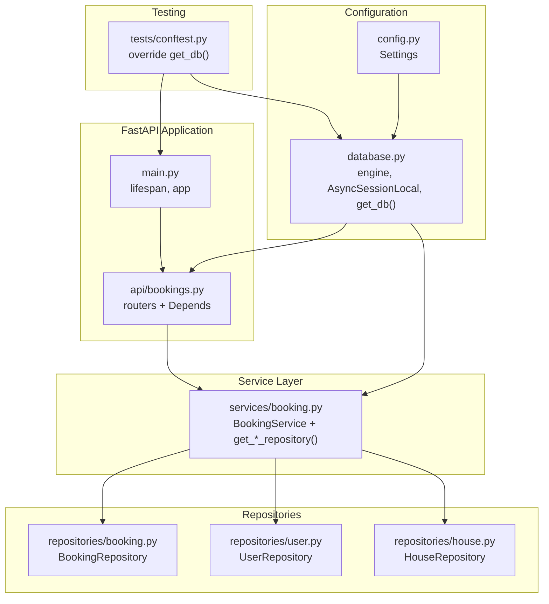
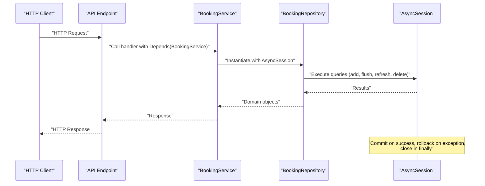
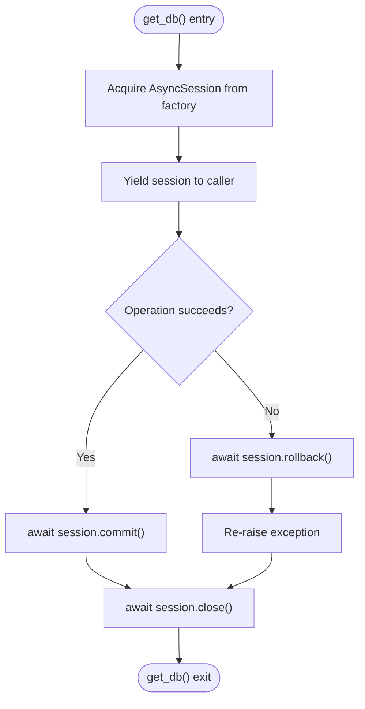
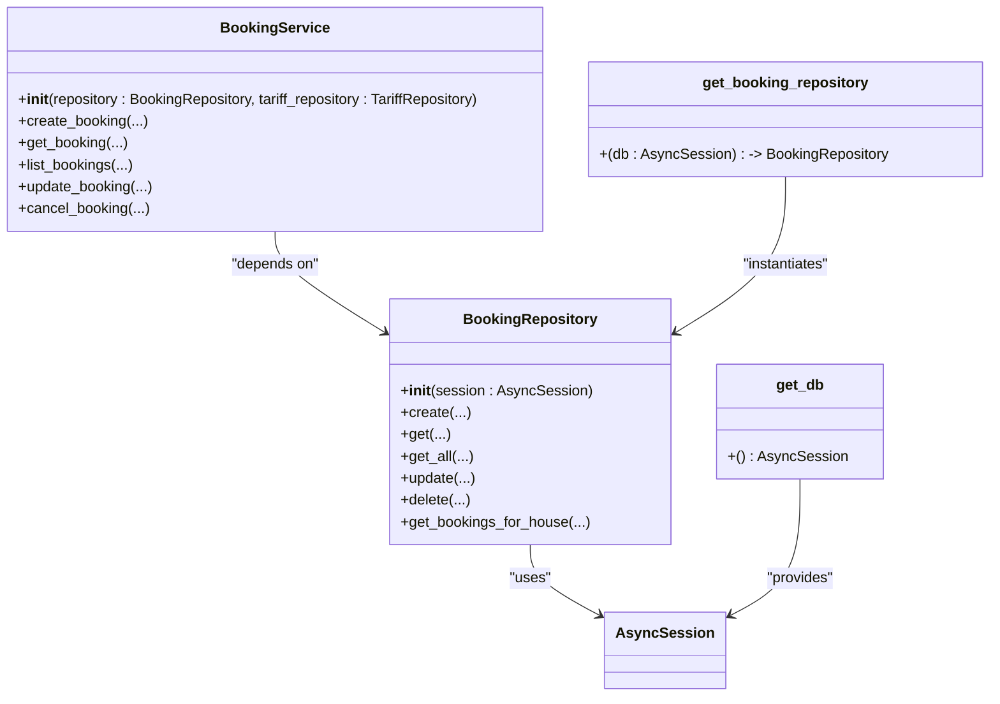
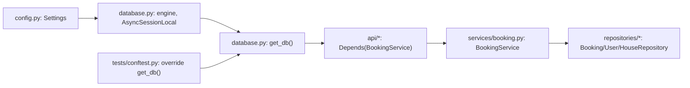

# Database Session Management

<cite>
**Referenced Files in This Document**
- [database.py](file://backend/database.py)
- [config.py](file://backend/config.py)
- [main.py](file://backend/main.py)
- [bookings.py](file://backend/api/bookings.py)
- [booking.py](file://backend/services/booking.py)
- [booking.py](file://backend/repositories/booking.py)
- [user.py](file://backend/repositories/user.py)
- [house.py](file://backend/repositories/house.py)
- [conftest.py](file://backend/tests/conftest.py)
- [env.py](file://alembic/env.py)
</cite>

## Table of Contents
1. [Introduction](#introduction)
2. [Project Structure](#project-structure)
3. [Core Components](#core-components)
4. [Architecture Overview](#architecture-overview)
5. [Detailed Component Analysis](#detailed-component-analysis)
6. [Dependency Analysis](#dependency-analysis)
7. [Performance Considerations](#performance-considerations)
8. [Troubleshooting Guide](#troubleshooting-guide)
9. [Conclusion](#conclusion)

## Introduction
This document explains the asynchronous database session management in the backend, focusing on the async database session configuration, connection pooling strategies, and transaction lifecycle. It documents the session factory implementation, FastAPI dependency injection mechanisms, and proper session cleanup procedures. Practical examples demonstrate session usage in repository methods, error handling for connection failures, and best practices for managing async database operations. Performance considerations and troubleshooting guidance for common session-related issues such as connection leaks, deadlocks, and transaction rollback scenarios are included.

## Project Structure
The database session management spans several layers:
- Configuration and engine/session factory
- FastAPI application and dependency injection
- API endpoints that depend on services
- Services that depend on repositories
- Repositories that operate on AsyncSession
- Tests that override dependencies for isolation

**Diagram sources**
- [config.py:1-25](file://backend/config.py#L1-L25)
- [database.py:1-41](file://backend/database.py#L1-L41)
- [main.py:1-173](file://backend/main.py#L1-L173)
- [bookings.py:1-223](file://backend/api/bookings.py#L1-L223)
- [booking.py:1-322](file://backend/services/booking.py#L1-L322)
- [booking.py:1-224](file://backend/repositories/booking.py#L1-L224)
- [user.py:1-168](file://backend/repositories/user.py#L1-L168)
- [house.py:1-183](file://backend/repositories/house.py#L1-L183)
- [conftest.py:1-150](file://backend/tests/conftest.py#L1-L150)

**Section sources**
- [database.py:1-41](file://backend/database.py#L1-L41)
- [config.py:1-25](file://backend/config.py#L1-L25)
- [main.py:1-173](file://backend/main.py#L1-L173)
- [bookings.py:1-223](file://backend/api/bookings.py#L1-L223)
- [booking.py:1-322](file://backend/services/booking.py#L1-L322)
- [booking.py:1-224](file://backend/repositories/booking.py#L1-L224)
- [user.py:1-168](file://backend/repositories/user.py#L1-L168)
- [house.py:1-183](file://backend/repositories/house.py#L1-L183)
- [conftest.py:1-150](file://backend/tests/conftest.py#L1-L150)

## Core Components
- Async engine and session factory
  - The async engine is created from the configured database URL and future=True for SQLAlchemy 2.x compatibility.
  - An async session factory is created with expire_on_commit=False to keep ORM objects usable after commit.
- Session dependency provider
  - A dependency generator yields a session within an async context manager, committing on success, rolling back on exceptions, and closing the session in the finally block.
- Configuration
  - Settings include database_url and log_level, loaded via pydantic-settings with environment variable support.
- Alembic environment
  - Alembic is configured to use async SQLAlchemy and reads the database URL from settings.

Key implementation references:
- Engine and session factory: [database.py:8-20](file://backend/database.py#L8-L20)
- Session dependency provider: [database.py:26-40](file://backend/database.py#L26-L40)
- Configuration: [config.py:4-24](file://backend/config.py#L4-L24)
- Alembic environment: [env.py:1-47](file://alembic/env.py#L1-L47)

**Section sources**
- [database.py:1-41](file://backend/database.py#L1-L41)
- [config.py:1-25](file://backend/config.py#L1-L25)
- [env.py:1-47](file://alembic/env.py#L1-L47)

## Architecture Overview
The session lifecycle is tightly integrated with FastAPI’s dependency injection system. Each request obtains a session from the dependency provider, which ensures commit/rollback/close semantics. Services depend on repositories, which depend on AsyncSession instances supplied by the dependency provider.

**Diagram sources**
- [bookings.py:1-223](file://backend/api/bookings.py#L1-L223)
- [booking.py:1-322](file://backend/services/booking.py#L1-L322)
- [booking.py:1-224](file://backend/repositories/booking.py#L1-L224)
- [database.py:26-40](file://backend/database.py#L26-L40)

**Section sources**
- [bookings.py:1-223](file://backend/api/bookings.py#L1-L223)
- [booking.py:1-322](file://backend/services/booking.py#L1-L322)
- [booking.py:1-224](file://backend/repositories/booking.py#L1-L224)
- [database.py:26-40](file://backend/database.py#L26-L40)

## Detailed Component Analysis

### AsyncSession Initialization and Factory
- Engine creation
  - Uses the asyncpg dialect and the configured database URL.
  - future=True enables SQLAlchemy 2.x behavior.
- Session factory
  - async_sessionmaker produces AsyncSession instances bound to the engine.
  - expire_on_commit=False prevents object expiration after commit, simplifying post-commit access.
- Base class
  - declarative_base() is used for ORM model declarations.

References:
- Engine and factory: [database.py:8-20](file://backend/database.py#L8-L20)
- Base class: [database.py:22-23](file://backend/database.py#L22-L23)

**Section sources**
- [database.py:1-41](file://backend/database.py#L1-L41)

### Session Dependency Provider and Lifecycle
- Dependency generator
  - get_db() is an async context manager that yields a session from the factory.
  - On successful exit, commits the session.
  - On any exception, rolls back and re-raises.
  - Ensures close() is called in finally.
- Lifespan hooks
  - FastAPI lifespan currently logs startup/shutdown; database connection initialization and teardown are marked as TODO.

References:
- Dependency provider: [database.py:26-40](file://backend/database.py#L26-L40)
- Lifespan: [main.py:31-39](file://backend/main.py#L31-L39)

**Diagram sources**
- [database.py:26-40](file://backend/database.py#L26-L40)

**Section sources**
- [database.py:26-40](file://backend/database.py#L26-L40)
- [main.py:31-39](file://backend/main.py#L31-L39)

### FastAPI Dependency Injection Integration
- API endpoints
  - Endpoints depend on BookingService, which depends on repositories.
  - Repositories receive AsyncSession via dependency providers.
- Service-level dependency providers
  - get_booking_repository() and get_tariff_repository() depend on get_db() to supply AsyncSession.
- Request-scoped session
  - Each request gets a new session from the dependency provider, ensuring per-request isolation.

References:
- Endpoints: [bookings.py:17-223](file://backend/api/bookings.py#L17-L223)
- Service dependency providers: [booking.py:29-54](file://backend/services/booking.py#L29-L54)
- Repository constructors: [booking.py:16](file://backend/repositories/booking.py#L16), [user.py:15](file://backend/repositories/user.py#L15), [house.py:15](file://backend/repositories/house.py#L15)

**Diagram sources**
- [booking.py:13-224](file://backend/repositories/booking.py#L13-L224)
- [user.py:12-168](file://backend/repositories/user.py#L12-L168)
- [house.py:12-183](file://backend/repositories/house.py#L12-L183)
- [booking.py:57-77](file://backend/services/booking.py#L57-L77)
- [booking.py:29-54](file://backend/services/booking.py#L29-L54)
- [database.py:26-40](file://backend/database.py#L26-L40)

**Section sources**
- [bookings.py:17-223](file://backend/api/bookings.py#L17-L223)
- [booking.py:29-54](file://backend/services/booking.py#L29-L54)
- [booking.py:13-224](file://backend/repositories/booking.py#L13-L224)
- [user.py:12-168](file://backend/repositories/user.py#L12-L168)
- [house.py:12-183](file://backend/repositories/house.py#L12-L183)
- [database.py:26-40](file://backend/database.py#L26-L40)

### Repository Methods Using AsyncSession
- Typical patterns
  - Add entities, flush to persist, refresh to load generated values, and return validated responses.
  - Queries use select() with scalar_one_or_none(), scalars().all(), and count subqueries.
- Examples by file:
  - BookingRepository.create/get/get_all/update/delete: [booking.py:24-198](file://backend/repositories/booking.py#L24-L198)
  - HouseRepository.create/get/get_all/update/delete: [house.py:23-182](file://backend/repositories/house.py#L23-L182)
  - UserRepository.create/get/get_all/update/delete/get_by_telegram_id: [user.py:23-167](file://backend/repositories/user.py#L23-L167)

References:
- Booking repository: [booking.py:24-198](file://backend/repositories/booking.py#L24-L198)
- House repository: [house.py:23-182](file://backend/repositories/house.py#L23-L182)
- User repository: [user.py:23-167](file://backend/repositories/user.py#L23-L167)

**Section sources**
- [booking.py:24-198](file://backend/repositories/booking.py#L24-L198)
- [house.py:23-182](file://backend/repositories/house.py#L23-L182)
- [user.py:23-167](file://backend/repositories/user.py#L23-L167)

### Transaction Management Patterns
- Automatic commit/rollback/close
  - The dependency provider commits on success, rolls back on exceptions, and closes the session in finally.
- Service-level orchestration
  - Business logic executes within the same session scope; exceptions propagate to trigger rollback.
- Repository-level persistence
  - Repositories call flush() to synchronize state and refresh() to reload generated values.

References:
- Dependency provider: [database.py:26-40](file://backend/database.py#L26-L40)
- Service methods: [booking.py:127-170](file://backend/services/booking.py#L127-L170), [booking.py:210-281](file://backend/services/booking.py#L210-L281), [booking.py:283-321](file://backend/services/booking.py#L283-L321)

**Section sources**
- [database.py:26-40](file://backend/database.py#L26-L40)
- [booking.py:127-170](file://backend/services/booking.py#L127-L170)
- [booking.py:210-281](file://backend/services/booking.py#L210-L281)
- [booking.py:283-321](file://backend/services/booking.py#L283-L321)

### Testing and Dependency Overrides
- Test database setup
  - Creates a separate test database and initializes/drops tables per test.
- Session override
  - Tests override get_db() to inject a shared test session, ensuring deterministic state and rollback after each test.
- Cleanup
  - Tables are truncated between tests; sessions roll back after each fixture.

References:
- Test engine and tables: [conftest.py:41-61](file://backend/tests/conftest.py#L41-L61)
- Test session fixture: [conftest.py:63-74](file://backend/tests/conftest.py#L63-L74)
- Client override: [conftest.py:76-93](file://backend/tests/conftest.py#L76-L93)
- Cleanup fixture: [conftest.py:95-107](file://backend/tests/conftest.py#L95-L107)

**Section sources**
- [conftest.py:1-150](file://backend/tests/conftest.py#L1-L150)

## Dependency Analysis
- External dependencies
  - SQLAlchemy 2.x async with asyncpg
  - Pydantic settings for configuration
  - Alembic for migrations
- Internal dependencies
  - database.py defines engine, factory, and dependency provider
  - services depend on repositories and database.get_db()
  - repositories depend on AsyncSession
  - tests override get_db() for isolation

**Diagram sources**
- [config.py:4-24](file://backend/config.py#L4-L24)
- [database.py:8-40](file://backend/database.py#L8-L40)
- [bookings.py:17-223](file://backend/api/bookings.py#L17-L223)
- [booking.py:57-77](file://backend/services/booking.py#L57-L77)
- [booking.py:13-224](file://backend/repositories/booking.py#L13-L224)
- [conftest.py:76-93](file://backend/tests/conftest.py#L76-L93)

**Section sources**
- [config.py:1-25](file://backend/config.py#L1-L25)
- [database.py:1-41](file://backend/database.py#L1-L41)
- [bookings.py:17-223](file://backend/api/bookings.py#L17-L223)
- [booking.py:57-77](file://backend/services/booking.py#L57-L77)
- [booking.py:13-224](file://backend/repositories/booking.py#L13-L224)
- [conftest.py:76-93](file://backend/tests/conftest.py#L76-L93)

## Performance Considerations
- Connection pooling
  - The async session factory does not set explicit pool parameters; SQLAlchemy defaults apply. Consider tuning pool_size, max_overflow, pool_recycle, and pool_pre_ping for production workloads.
- Session timeout settings
  - No explicit statement_timeout is configured in the provided code. Configure per-operation timeouts if needed to prevent long-running queries.
- Memory management
  - expire_on_commit=False keeps ORM objects alive after commit; monitor for large object retention. Use refresh() selectively and avoid caching large query results unnecessarily.
- Query efficiency
  - Repositories use count subqueries and pagination; ensure appropriate indexes on filter/sort columns (e.g., foreign keys, status, dates).
- Alembic async engine
  - Alembic uses async engine_from_config; ensure migration scripts align with async patterns.

[No sources needed since this section provides general guidance]

## Troubleshooting Guide
- Connection leaks
  - Symptoms: increasing memory, connection errors under load.
  - Checks: ensure get_db() finally closes sessions; avoid holding references to AsyncSession beyond request scope.
  - References: [database.py:26-40](file://backend/database.py#L26-L40)
- Deadlocks
  - Symptoms: TransactionRollbackError, OperationalError indicating deadlock.
  - Mitigations: reduce transaction duration, avoid long-held locks, retry transient failures with backoff.
  - References: [database.py:36-38](file://backend/database.py#L36-L38)
- Transaction rollback scenarios
  - The dependency provider automatically rolls back on exceptions; verify exceptions are not swallowed upstream.
  - References: [database.py:36-38](file://backend/database.py#L36-L38)
- Session not committed
  - Symptoms: data appears missing after request completion.
  - Checks: confirm get_db() exits normally; ensure no unhandled exceptions suppress commit.
  - References: [database.py:34-35](file://backend/database.py#L34-L35)
- Test isolation failures
  - Symptoms: tests interfering with each other.
  - Checks: verify dependency overrides and rollback in test fixtures.
  - References: [conftest.py:76-93](file://backend/tests/conftest.py#L76-L93), [conftest.py:70-74](file://backend/tests/conftest.py#L70-L74)

**Section sources**
- [database.py:26-40](file://backend/database.py#L26-L40)
- [conftest.py:70-93](file://backend/tests/conftest.py#L70-L93)

## Conclusion
The backend implements robust async database session management using SQLAlchemy 2.x with asyncpg and FastAPI dependency injection. The session factory and dependency provider ensure automatic commit/rollback/close semantics per request. Repositories encapsulate data access patterns, while services orchestrate business logic within the same session scope. For production, tune connection pooling, configure timeouts, and monitor session lifecycle to prevent leaks and deadlocks. The testing suite demonstrates how to override dependencies for isolated, deterministic tests.