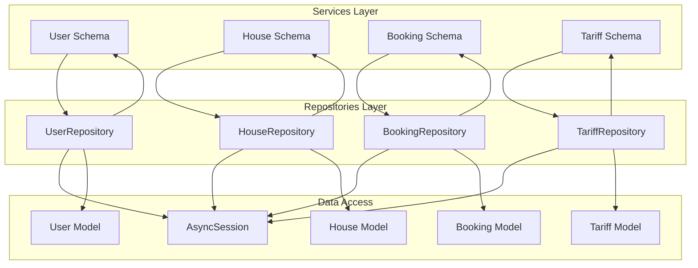
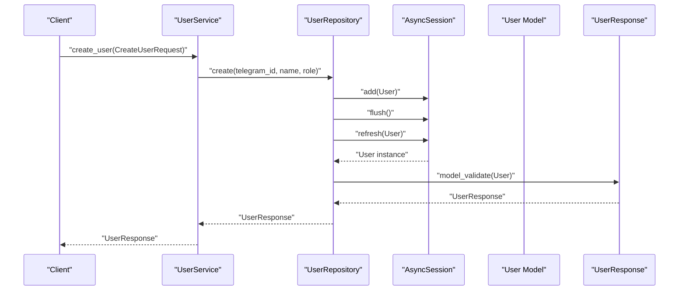
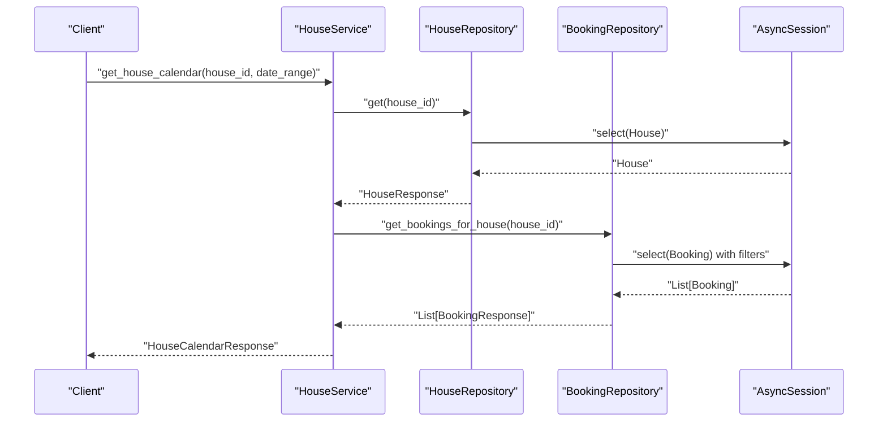
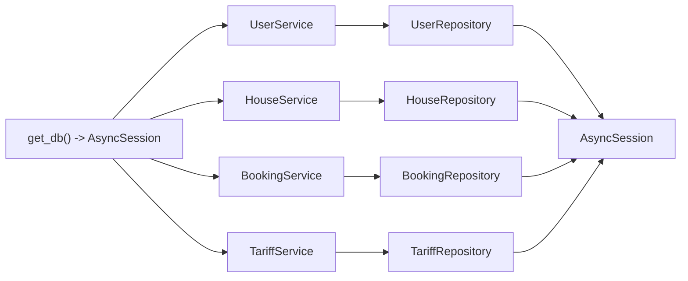

# Repository Pattern Implementation

<cite>
**Referenced Files in This Document**
- [backend/repositories/user.py](file://backend/repositories/user.py)
- [backend/repositories/house.py](file://backend/repositories/house.py)
- [backend/repositories/booking.py](file://backend/repositories/booking.py)
- [backend/repositories/tariff.py](file://backend/repositories/tariff.py)
- [backend/services/user.py](file://backend/services/user.py)
- [backend/services/house.py](file://backend/services/house.py)
- [backend/services/booking.py](file://backend/services/booking.py)
- [backend/services/tariff.py](file://backend/services/tariff.py)
- [backend/database.py](file://backend/database.py)
- [backend/models/user.py](file://backend/models/user.py)
- [backend/models/house.py](file://backend/models/house.py)
- [backend/models/booking.py](file://backend/models/booking.py)
- [backend/models/tariff.py](file://backend/models/tariff.py)
- [backend/schemas/user.py](file://backend/schemas/user.py)
</cite>

## Table of Contents
1. [Introduction](#introduction)
2. [Project Structure](#project-structure)
3. [Core Components](#core-components)
4. [Architecture Overview](#architecture-overview)
5. [Detailed Component Analysis](#detailed-component-analysis)
6. [Dependency Analysis](#dependency-analysis)
7. [Performance Considerations](#performance-considerations)
8. [Troubleshooting Guide](#troubleshooting-guide)
9. [Conclusion](#conclusion)

## Introduction
This document explains the repository pattern implementation in the backend, focusing on the four core repositories: UserRepository, HouseRepository, BookingRepository, and TariffRepository. It describes how the abstraction layer separates business logic from data access, documents the consistent CRUD operations across repositories, and demonstrates how dependency injection manages sessions. It also covers data transformation between SQLAlchemy models and Pydantic schemas, and provides guidance for extending repositories with new entities while maintaining consistency.

## Project Structure
The repository pattern is implemented under backend/repositories with corresponding services under backend/services. Each repository encapsulates SQLAlchemy operations against a single domain model and returns Pydantic schemas. Services orchestrate business logic and depend on repositories via FastAPI dependency injection.

**Diagram sources**
- [backend/services/user.py:33-48](file://backend/services/user.py#L33-L48)
- [backend/services/house.py:51-69](file://backend/services/house.py#L51-L69)
- [backend/services/booking.py:57-76](file://backend/services/booking.py#L57-L76)
- [backend/services/tariff.py:32-47](file://backend/services/tariff.py#L32-L47)
- [backend/repositories/user.py:12-21](file://backend/repositories/user.py#L12-L21)
- [backend/repositories/house.py:12-21](file://backend/repositories/house.py#L12-L21)
- [backend/repositories/booking.py:13-22](file://backend/repositories/booking.py#L13-L22)
- [backend/repositories/tariff.py:12-21](file://backend/repositories/tariff.py#L12-L21)
- [backend/database.py:26-41](file://backend/database.py#L26-L41)
- [backend/models/user.py:19-32](file://backend/models/user.py#L19-L32)
- [backend/models/house.py:9-24](file://backend/models/house.py#L9-L24)
- [backend/models/booking.py:20-41](file://backend/models/booking.py#L20-L41)
- [backend/models/tariff.py:9-21](file://backend/models/tariff.py#L9-L21)
- [backend/schemas/user.py:18-72](file://backend/schemas/user.py#L18-L72)

**Section sources**
- [backend/repositories/user.py:12-168](file://backend/repositories/user.py#L12-L168)
- [backend/repositories/house.py:12-183](file://backend/repositories/house.py#L12-L183)
- [backend/repositories/booking.py:13-224](file://backend/repositories/booking.py#L13-L224)
- [backend/repositories/tariff.py:12-151](file://backend/repositories/tariff.py#L12-L151)
- [backend/services/user.py:33-183](file://backend/services/user.py#L33-L183)
- [backend/services/house.py:51-253](file://backend/services/house.py#L51-L253)
- [backend/services/booking.py:57-322](file://backend/services/booking.py#L57-L322)
- [backend/services/tariff.py:32-144](file://backend/services/tariff.py#L32-L144)
- [backend/database.py:26-41](file://backend/database.py#L26-L41)

## Core Components
Each repository follows a consistent interface:
- Constructor accepts an AsyncSession
- Methods for create, get, get_all, update, delete
- Return Pydantic schemas validated from SQLAlchemy ORM instances
- Use SQLAlchemy select queries with optional filters, sorting, and pagination
- Transform SQLAlchemy results to Pydantic schemas via model_validate

Key patterns:
- Session lifecycle managed by get_db dependency
- CRUD methods return Optional types when an entity is not found
- get_all returns a tuple of (results list, total count) for pagination
- Data transformation uses Pydantic model_config(from_attributes=True) for seamless conversion

**Section sources**
- [backend/repositories/user.py:15-168](file://backend/repositories/user.py#L15-L168)
- [backend/repositories/house.py:15-183](file://backend/repositories/house.py#L15-L183)
- [backend/repositories/booking.py:16-224](file://backend/repositories/booking.py#L16-L224)
- [backend/repositories/tariff.py:15-151](file://backend/repositories/tariff.py#L15-L151)
- [backend/schemas/user.py:25-36](file://backend/schemas/user.py#L25-L36)

## Architecture Overview
The dependency injection pattern ties services to repositories and repositories to the database session. Services expose business APIs and delegate persistence to repositories. Repositories encapsulate SQLAlchemy operations and convert results to Pydantic schemas.

**Diagram sources**
- [backend/services/user.py:50-63](file://backend/services/user.py#L50-L63)
- [backend/repositories/user.py:23-43](file://backend/repositories/user.py#L23-L43)
- [backend/schemas/user.py:25-36](file://backend/schemas/user.py#L25-L36)
- [backend/models/user.py:19-32](file://backend/models/user.py#L19-L32)

**Section sources**
- [backend/services/user.py:19-30](file://backend/services/user.py#L19-L30)
- [backend/database.py:26-41](file://backend/database.py#L26-L41)

## Detailed Component Analysis

### UserRepository
Responsibilities:
- Create users with telegram_id, name, and role
- Retrieve by ID or Telegram ID
- List with role filter, pagination, and sorting
- Update selective fields (name, role)
- Delete by ID

Method signatures and behavior:
- create: Accepts telegram_id, name, role; returns UserResponse
- get: Accepts user_id; returns Optional UserResponse
- get_by_telegram_id: Accepts telegram_id; returns Optional UserResponse
- get_all: Accepts role, limit, offset, sort; returns tuple of (List[UserResponse], int)
- update: Accepts user_id and optional fields; returns Optional UserResponse
- delete: Accepts user_id; returns bool

Data transformation:
- SQLAlchemy User mapped to Pydantic UserResponse via model_validate

Consistent error handling:
- Methods return None or False when not found; higher layers raise appropriate exceptions

**Section sources**
- [backend/repositories/user.py:23-168](file://backend/repositories/user.py#L23-L168)
- [backend/models/user.py:19-32](file://backend/models/user.py#L19-L32)
- [backend/schemas/user.py:25-36](file://backend/schemas/user.py#L25-L36)

### HouseRepository
Responsibilities:
- Create houses with name, description, capacity, is_active, owner_id
- Retrieve by ID
- List with owner_id, is_active, capacity_min, capacity_max filters, pagination, and sorting
- Update selective fields (name, description, capacity, is_active)
- Delete by ID

Method signatures and behavior:
- create: Accepts name, description, capacity, is_active, owner_id; returns HouseResponse
- get: Accepts house_id; returns Optional HouseResponse
- get_all: Accepts filters, limit, offset, sort; returns tuple of (List[HouseResponse], int)
- update: Accepts house_id and optional fields; returns Optional HouseResponse
- delete: Accepts house_id; returns bool

Data transformation:
- SQLAlchemy House mapped to Pydantic HouseResponse via model_validate

Consistent error handling:
- Methods return None or False when not found; higher layers raise exceptions

**Section sources**
- [backend/repositories/house.py:23-183](file://backend/repositories/house.py#L23-L183)
- [backend/models/house.py:9-24](file://backend/models/house.py#L9-L24)
- [backend/schemas/house.py:1-200](file://backend/schemas/house.py#L1-L200)

### BookingRepository
Responsibilities:
- Create bookings with house_id, tenant_id, check_in, check_out, guests_planned, optional total_amount
- Retrieve by ID
- List with user_id, house_id, status filters, pagination, and sorting
- Update selective fields (check_in, check_out, guests_planned, guests_actual, total_amount, status)
- Delete by ID
- Specialized query: get_bookings_for_house with optional exclusion

Method signatures and behavior:
- create: Accepts booking details; returns BookingResponse
- get: Accepts booking_id; returns Optional BookingResponse
- get_all: Accepts filters, limit, offset, sort; returns tuple of (List[BookingResponse], int)
- update: Accepts booking_id and optional fields; returns Optional BookingResponse
- delete: Accepts booking_id; returns bool
- get_bookings_for_house: Accepts house_id and optional exclude_booking_id; returns List[BookingResponse]

Data transformation:
- SQLAlchemy Booking mapped to Pydantic BookingResponse via model_validate

Consistent error handling:
- Methods return None or False when not found; higher layers raise exceptions

**Section sources**
- [backend/repositories/booking.py:24-224](file://backend/repositories/booking.py#L24-L224)
- [backend/models/booking.py:20-41](file://backend/models/booking.py#L20-L41)
- [backend/schemas/booking.py:1-200](file://backend/schemas/booking.py#L1-L200)

### TariffRepository
Responsibilities:
- Create tariffs with name and amount
- Retrieve by ID
- List with pagination and sorting
- Update selective fields (name, amount)
- Delete by ID

Method signatures and behavior:
- create: Accepts name, amount; returns TariffResponse
- get: Accepts tariff_id; returns Optional TariffResponse
- get_all: Accepts limit, offset, sort; returns tuple of (List[TariffResponse], int)
- update: Accepts tariff_id and optional fields; returns Optional TariffResponse
- delete: Accepts tariff_id; returns bool

Data transformation:
- SQLAlchemy Tariff mapped to Pydantic TariffResponse via model_validate

Consistent error handling:
- Methods return None or False when not found; higher layers raise exceptions

**Section sources**
- [backend/repositories/tariff.py:23-151](file://backend/repositories/tariff.py#L23-L151)
- [backend/models/tariff.py:9-21](file://backend/models/tariff.py#L9-L21)
- [backend/schemas/tariff.py:1-200](file://backend/schemas/tariff.py#L1-L200)

### Service Layer Integration Examples
- UserService delegates to UserRepository for all user operations and raises domain-specific errors when entities are missing
- HouseService depends on both HouseRepository and BookingRepository to compute availability calendars
- BookingService orchestrates date conflict checks, amount calculation, and status transitions using BookingRepository and TariffRepository
- TariffService delegates to TariffRepository for tariff operations

**Diagram sources**
- [backend/services/house.py:207-252](file://backend/services/house.py#L207-L252)
- [backend/repositories/house.py:64-66](file://backend/repositories/house.py#L64-L66)
- [backend/repositories/booking.py:199-223](file://backend/repositories/booking.py#L199-L223)

**Section sources**
- [backend/services/user.py:50-183](file://backend/services/user.py#L50-L183)
- [backend/services/house.py:71-253](file://backend/services/house.py#L71-L253)
- [backend/services/booking.py:127-322](file://backend/services/booking.py#L127-L322)
- [backend/services/tariff.py:49-144](file://backend/services/tariff.py#L49-L144)

## Dependency Analysis
Repositories depend on AsyncSession for database operations and on SQLAlchemy models for queries. They return Pydantic schemas for serialization. Services depend on repositories and orchestrate business logic. The dependency injection chain is:
- get_db provides AsyncSession
- Service dependency providers construct repositories with the session
- Repositories encapsulate ORM operations and schema conversion

**Diagram sources**
- [backend/database.py:26-41](file://backend/database.py#L26-L41)
- [backend/services/user.py:19-30](file://backend/services/user.py#L19-L30)
- [backend/services/house.py:23-48](file://backend/services/house.py#L23-L48)
- [backend/services/booking.py:29-54](file://backend/services/booking.py#L29-L54)
- [backend/services/tariff.py:18-29](file://backend/services/tariff.py#L18-L29)

**Section sources**
- [backend/database.py:26-41](file://backend/database.py#L26-L41)
- [backend/services/user.py:19-30](file://backend/services/user.py#L19-L30)
- [backend/services/house.py:23-48](file://backend/services/house.py#L23-L48)
- [backend/services/booking.py:29-54](file://backend/services/booking.py#L29-L54)
- [backend/services/tariff.py:18-29](file://backend/services/tariff.py#L18-L29)

## Performance Considerations
- Efficient pagination: get_all applies OFFSET/LIMIT after aggregating total count
- Selective updates: update methods set only provided fields to minimize writes
- Query construction: repositories build queries incrementally with filters and sorting
- Asynchronous I/O: AsyncSession leverages non-blocking database operations

[No sources needed since this section provides general guidance]

## Troubleshooting Guide
Common issues and resolutions:
- Entity not found: Repositories return None/False; services raise domain-specific exceptions (e.g., UserNotFoundError, HouseNotFoundError)
- Validation failures: Services validate inputs and raise HTTP-compatible exceptions before calling repositories
- Transaction handling: get_db ensures commit/rollback semantics around each request

**Section sources**
- [backend/services/user.py:77-80](file://backend/services/user.py#L77-L80)
- [backend/services/house.py:105-108](file://backend/services/house.py#L105-L108)
- [backend/services/booking.py:184-187](file://backend/services/booking.py#L184-L187)
- [backend/services/tariff.py:75-78](file://backend/services/tariff.py#L75-L78)
- [backend/database.py:32-40](file://backend/database.py#L32-L40)

## Conclusion
The repository pattern cleanly separates business logic from data access across the four core repositories. Consistent CRUD interfaces, dependency injection for session management, and uniform data transformation between SQLAlchemy models and Pydantic schemas enable maintainable and testable code. Extending repositories for new entities follows established patterns: define a model, a response schema, implement CRUD methods, and wire them into services via dependency providers.