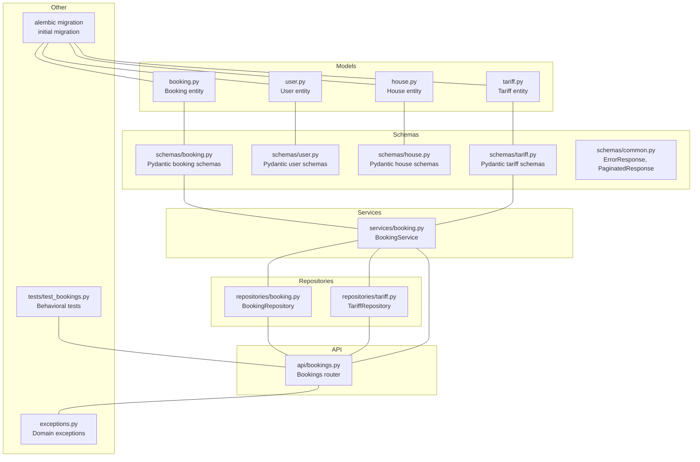
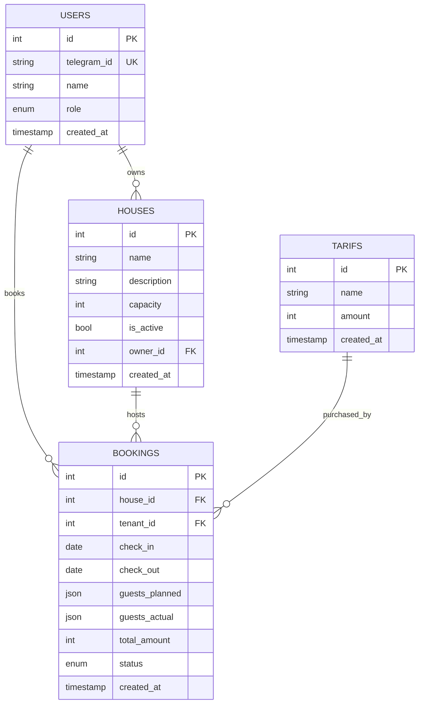
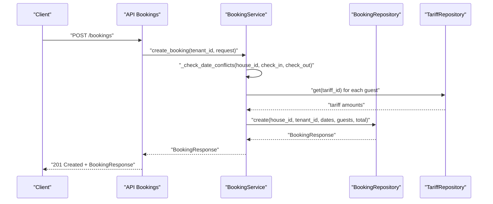
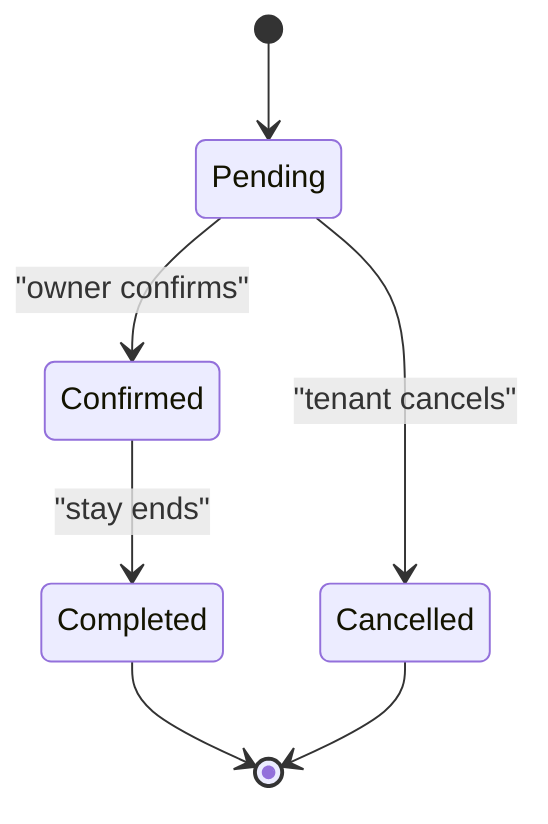
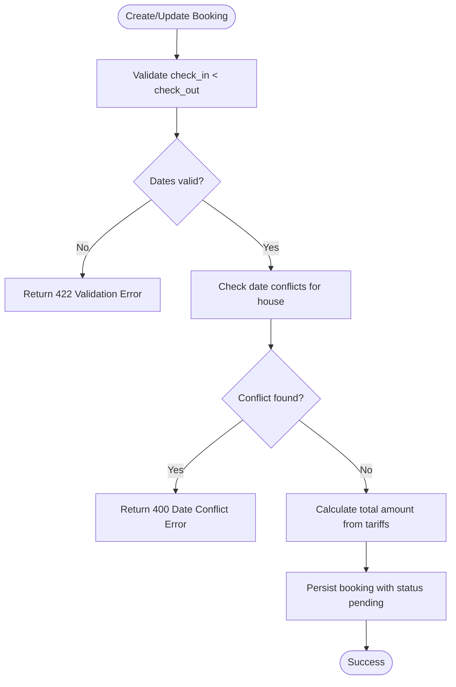
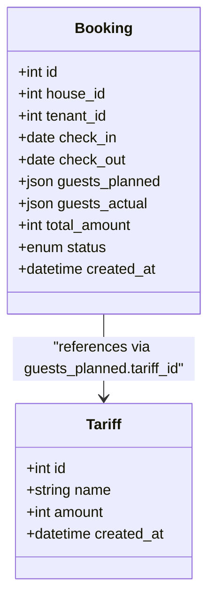
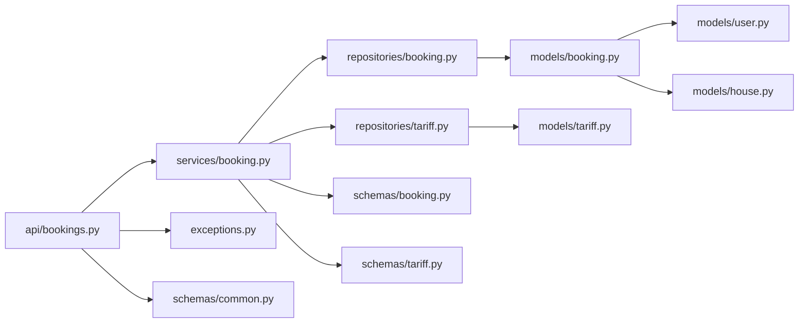

# Booking and Reservation Models

<cite>
**Referenced Files in This Document**
- [backend/models/booking.py](file://backend/models/booking.py)
- [backend/models/user.py](file://backend/models/user.py)
- [backend/models/house.py](file://backend/models/house.py)
- [backend/models/tariff.py](file://backend/models/tariff.py)
- [backend/schemas/booking.py](file://backend/schemas/booking.py)
- [backend/schemas/user.py](file://backend/schemas/user.py)
- [backend/schemas/house.py](file://backend/schemas/house.py)
- [backend/schemas/tariff.py](file://backend/schemas/tariff.py)
- [backend/schemas/common.py](file://backend/schemas/common.py)
- [backend/services/booking.py](file://backend/services/booking.py)
- [backend/repositories/booking.py](file://backend/repositories/booking.py)
- [backend/repositories/tariff.py](file://backend/repositories/tariff.py)
- [backend/api/bookings.py](file://backend/api/bookings.py)
- [backend/exceptions.py](file://backend/exceptions.py)
- [alembic/versions/2a84cf51810b_initial_migration.py](file://alembic/versions/2a84cf51810b_initial_migration.py)
- [backend/tests/test_bookings.py](file://backend/tests/test_bookings.py)
</cite>

## Table of Contents
1. [Introduction](#introduction)
2. [Project Structure](#project-structure)
3. [Core Components](#core-components)
4. [Architecture Overview](#architecture-overview)
5. [Detailed Component Analysis](#detailed-component-analysis)
6. [Dependency Analysis](#dependency-analysis)
7. [Performance Considerations](#performance-considerations)
8. [Troubleshooting Guide](#troubleshooting-guide)
9. [Conclusion](#conclusion)
10. [Appendices](#appendices)

## Introduction
This document provides comprehensive data model documentation for the Booking entity that manages property reservations. It covers the booking lifecycle, status management (pending, confirmed, cancelled, completed), date ranges, guest associations, and payment tracking. It also explains the relationships between bookings, users (tenants), and houses, documents validation rules, conflict detection, capacity management, and availability constraints. Finally, it includes field definitions, state transitions, automated status updates, cancellation policies, and practical examples for creation, updates, conflict resolution, and reporting queries.

## Project Structure
The booking system is implemented using a layered architecture:
- Data models define the persistent entities and their attributes.
- Schemas define request/response validation and serialization.
- Services encapsulate business logic such as validation, conflict detection, and amount calculation.
- Repositories handle persistence operations against the database.
- APIs expose endpoints for clients to interact with the system.
- Tests validate behavior including conflict detection, amount calculation, and lifecycle transitions.

**Diagram sources**
- [backend/models/booking.py:20-41](file://backend/models/booking.py#L20-L41)
- [backend/models/user.py:19-32](file://backend/models/user.py#L19-L32)
- [backend/models/house.py:9-24](file://backend/models/house.py#L9-L24)
- [backend/models/tariff.py:9-21](file://backend/models/tariff.py#L9-L21)
- [backend/schemas/booking.py:10-133](file://backend/schemas/booking.py#L10-L133)
- [backend/schemas/user.py:10-72](file://backend/schemas/user.py#L10-L72)
- [backend/schemas/house.py:9-107](file://backend/schemas/house.py#L9-L107)
- [backend/schemas/tariff.py:9-54](file://backend/schemas/tariff.py#L9-L54)
- [backend/schemas/common.py:8-43](file://backend/schemas/common.py#L8-L43)
- [backend/services/booking.py:57-322](file://backend/services/booking.py#L57-L322)
- [backend/repositories/booking.py:13-224](file://backend/repositories/booking.py#L13-L224)
- [backend/repositories/tariff.py:12-151](file://backend/repositories/tariff.py#L12-L151)
- [backend/api/bookings.py:1-223](file://backend/api/bookings.py#L1-L223)
- [backend/exceptions.py:8-82](file://backend/exceptions.py#L8-L82)
- [alembic/versions/2a84cf51810b_initial_migration.py:21-84](file://alembic/versions/2a84cf51810b_initial_migration.py#L21-L84)
- [backend/tests/test_bookings.py:1-876](file://backend/tests/test_bookings.py#L1-L876)

**Section sources**
- [backend/models/booking.py:1-41](file://backend/models/booking.py#L1-L41)
- [backend/models/user.py:1-32](file://backend/models/user.py#L1-L32)
- [backend/models/house.py:1-24](file://backend/models/house.py#L1-L24)
- [backend/models/tariff.py:1-21](file://backend/models/tariff.py#L1-L21)
- [backend/schemas/booking.py:1-133](file://backend/schemas/booking.py#L1-L133)
- [backend/schemas/user.py:1-72](file://backend/schemas/user.py#L1-L72)
- [backend/schemas/house.py:1-107](file://backend/schemas/house.py#L1-L107)
- [backend/schemas/tariff.py:1-54](file://backend/schemas/tariff.py#L1-L54)
- [backend/schemas/common.py:1-43](file://backend/schemas/common.py#L1-L43)
- [backend/services/booking.py:1-322](file://backend/services/booking.py#L1-L322)
- [backend/repositories/booking.py:1-224](file://backend/repositories/booking.py#L1-L224)
- [backend/repositories/tariff.py:1-151](file://backend/repositories/tariff.py#L1-L151)
- [backend/api/bookings.py:1-223](file://backend/api/bookings.py#L1-L223)
- [backend/exceptions.py:1-82](file://backend/exceptions.py#L1-L82)
- [alembic/versions/2a84cf51810b_initial_migration.py:1-84](file://alembic/versions/2a84cf51810b_initial_migration.py#L1-L84)
- [backend/tests/test_bookings.py:1-876](file://backend/tests/test_bookings.py#L1-L876)

## Core Components
This section defines the core data structures and their relationships, focusing on the Booking entity and its connections to Users, Houses, and Tariffs.

- Booking entity
  - Identity: integer id
  - Dates: check-in and check-out dates
  - Guest composition: planned guests stored as JSON; actual guests after stay also supported
  - Amount: total amount in rubles
  - Status: enum with values pending, confirmed, cancelled, completed
  - Timestamp: created_at
  - Associations: house_id (foreign key to houses), tenant_id (foreign key to users)

- User entity
  - Identity: integer id
  - Authentication: telegram_id (unique)
  - Profile: name
  - Role: enum tenant, owner, both
  - Timestamp: created_at

- House entity
  - Identity: integer id
  - Details: name, description
  - Capacity: maximum number of guests
  - Availability: is_active flag
  - Ownership: owner_id (foreign key to users)
  - Timestamp: created_at

- Tariff entity
  - Identity: integer id
  - Pricing: name, amount per night in rubles
  - Timestamp: created_at

Relationships
- A Booking belongs to one House and one Tenant (User).
- A House belongs to one Owner (User).
- Guest composition references Tariff entries to compute amounts.

**Diagram sources**
- [backend/models/booking.py:20-41](file://backend/models/booking.py#L20-L41)
- [backend/models/user.py:19-32](file://backend/models/user.py#L19-L32)
- [backend/models/house.py:9-24](file://backend/models/house.py#L9-L24)
- [backend/models/tariff.py:9-21](file://backend/models/tariff.py#L9-L21)
- [alembic/versions/2a84cf51810b_initial_migration.py:21-84](file://alembic/versions/2a84cf51810b_initial_migration.py#L21-L84)

**Section sources**
- [backend/models/booking.py:11-41](file://backend/models/booking.py#L11-L41)
- [backend/models/user.py:11-32](file://backend/models/user.py#L11-L32)
- [backend/models/house.py:9-24](file://backend/models/house.py#L9-L24)
- [backend/models/tariff.py:9-21](file://backend/models/tariff.py#L9-L21)
- [alembic/versions/2a84cf51810b_initial_migration.py:21-84](file://alembic/versions/2a84cf51810b_initial_migration.py#L21-L84)

## Architecture Overview
The booking lifecycle is orchestrated by the API layer, validated by schemas, enforced by the service layer, persisted by repositories, and represented by models. Validation rules, conflict detection, and amount calculation are implemented in the service layer. The API layer handles authentication placeholders and delegates to the service layer.

**Diagram sources**
- [backend/api/bookings.py:104-127](file://backend/api/bookings.py#L104-L127)
- [backend/services/booking.py:127-171](file://backend/services/booking.py#L127-L171)
- [backend/repositories/booking.py:24-58](file://backend/repositories/booking.py#L24-L58)
- [backend/repositories/tariff.py:43-56](file://backend/repositories/tariff.py#L43-L56)

**Section sources**
- [backend/api/bookings.py:1-223](file://backend/api/bookings.py#L1-L223)
- [backend/services/booking.py:1-322](file://backend/services/booking.py#L1-L322)
- [backend/repositories/booking.py:1-224](file://backend/repositories/booking.py#L1-L224)
- [backend/repositories/tariff.py:1-151](file://backend/repositories/tariff.py#L1-L151)

## Detailed Component Analysis

### Booking Entity and Lifecycle
- Status management
  - Initial status is pending upon creation.
  - Confirmed, cancelled, and completed statuses are supported.
  - Cancelled bookings cannot be re-cancelled or cancelled from completed state.
- Date ranges
  - Check-in must be strictly before check-out.
  - Overlaps are prevented across bookings for the same house.
- Guest associations
  - Planned guests stored as JSON with tariff_id and count.
  - Actual guests can be recorded post-stay.
- Payment tracking
  - Total amount calculated from tariff rates and guest counts.
  - Amount recalculated when guest composition changes.

**Diagram sources**
- [backend/models/booking.py:11-18](file://backend/models/booking.py#L11-L18)
- [backend/services/booking.py:283-322](file://backend/services/booking.py#L283-L322)

**Section sources**
- [backend/models/booking.py:11-41](file://backend/models/booking.py#L11-L41)
- [backend/schemas/booking.py:10-133](file://backend/schemas/booking.py#L10-L133)
- [backend/services/booking.py:78-126](file://backend/services/booking.py#L78-L126)
- [backend/repositories/booking.py:132-178](file://backend/repositories/booking.py#L132-L178)

### Validation Rules and Conflict Detection
- Schema-level validation
  - Create and update requests enforce check_in < check_out when both are provided.
  - Guests list is mandatory for creation and must be non-empty.
- Service-level validation
  - Date conflict detection compares proposed range against existing bookings for the same house (excluding the current booking during updates).
  - Amount calculation aggregates tariff costs for planned guests.
- Authorization
  - Updates and cancellations require ownership of the booking.

**Diagram sources**
- [backend/schemas/booking.py:82-107](file://backend/schemas/booking.py#L82-L107)
- [backend/services/booking.py:78-126](file://backend/services/booking.py#L78-L126)
- [backend/repositories/booking.py:199-224](file://backend/repositories/booking.py#L199-L224)

**Section sources**
- [backend/schemas/booking.py:70-107](file://backend/schemas/booking.py#L70-L107)
- [backend/services/booking.py:78-126](file://backend/services/booking.py#L78-L126)
- [backend/repositories/booking.py:199-224](file://backend/repositories/booking.py#L199-L224)
- [backend/exceptions.py:24-50](file://backend/exceptions.py#L24-L50)

### Capacity Management and Availability Constraints
- House capacity is defined in the House model.
- The current implementation does not enforce guest count versus house capacity at the booking level. Capacity-related fields exist in the House schema but are not validated against planned guests in the booking service.
- Availability constraints are enforced by date overlap checks and house activity status (is_active) at the house level.

Recommendation
- Enforce capacity validation during booking creation/update by comparing planned guest totals against house capacity and adding a service-level check similar to date conflicts.

**Section sources**
- [backend/models/house.py:17-17](file://backend/models/house.py#L17-L17)
- [backend/schemas/house.py:23-27](file://backend/schemas/house.py#L23-L27)
- [backend/services/booking.py:108-126](file://backend/services/booking.py#L108-L126)

### Payment Tracking and Tariff Integration
- Tariff entities define per-night rates.
- Amount calculation aggregates tariff costs for planned guests.
- Actual guests can be recorded post-stay; total amount can be recalculated if needed.

**Diagram sources**
- [backend/models/tariff.py:9-21](file://backend/models/tariff.py#L9-L21)
- [backend/models/booking.py:20-41](file://backend/models/booking.py#L20-L41)
- [backend/schemas/booking.py:25-32](file://backend/schemas/booking.py#L25-L32)

**Section sources**
- [backend/models/tariff.py:1-21](file://backend/models/tariff.py#L1-L21)
- [backend/schemas/tariff.py:9-54](file://backend/schemas/tariff.py#L9-L54)
- [backend/services/booking.py:108-126](file://backend/services/booking.py#L108-L126)
- [backend/repositories/tariff.py:43-56](file://backend/repositories/tariff.py#L43-L56)

### API Endpoints and Examples
- Create booking
  - Endpoint: POST /bookings
  - Payload: house_id, check_in, check_out, guests (list of tariff_id and count)
  - Behavior: validates dates, detects conflicts, calculates amount, creates booking with pending status
- Get booking
  - Endpoint: GET /bookings/{booking_id}
  - Behavior: returns booking details
- List bookings
  - Endpoint: GET /bookings
  - Query params: limit, offset, sort, user_id, house_id, status, check_in_from/to, check_out_from/to
  - Behavior: paginated list with filtering and sorting
- Update booking
  - Endpoint: PATCH /bookings/{booking_id}
  - Payload: optional check_in, check_out, guests, status
  - Behavior: validates ownership, status constraints, dates, and conflicts; recalculates amount if guests change
- Cancel booking
  - Endpoint: DELETE /bookings/{booking_id}
  - Behavior: sets status to cancelled if eligible

Examples
- Creating a booking with two adult guests:
  - POST /bookings with house_id, check_in, check_out, guests=[{tariff_id: adult_id, count: 2}]
  - Expected: total_amount = 2 × adult_rate, status=pending
- Updating guest composition:
  - PATCH /bookings/{id} with guests=[{tariff_id: adult_id, count: 3}]
  - Expected: total_amount updated accordingly
- Conflict resolution:
  - Attempting to book overlapping dates for the same house raises a conflict error
- Reporting queries:
  - GET /bookings?house_id={id}&status=pending to list pending bookings for a house

**Section sources**
- [backend/api/bookings.py:20-223](file://backend/api/bookings.py#L20-L223)
- [backend/schemas/booking.py:43-133](file://backend/schemas/booking.py#L43-L133)
- [backend/tests/test_bookings.py:54-264](file://backend/tests/test_bookings.py#L54-L264)

## Dependency Analysis
The service layer depends on repositories for persistence and on tariff repositories for pricing calculations. The API layer depends on the service layer for business logic. Exceptions are centralized for consistent error responses.

**Diagram sources**
- [backend/api/bookings.py:1-223](file://backend/api/bookings.py#L1-L223)
- [backend/services/booking.py:1-322](file://backend/services/booking.py#L1-L322)
- [backend/repositories/booking.py:1-224](file://backend/repositories/booking.py#L1-L224)
- [backend/repositories/tariff.py:1-151](file://backend/repositories/tariff.py#L1-L151)
- [backend/schemas/booking.py:1-133](file://backend/schemas/booking.py#L1-L133)
- [backend/schemas/tariff.py:1-54](file://backend/schemas/tariff.py#L1-L54)
- [backend/schemas/common.py:1-43](file://backend/schemas/common.py#L1-L43)
- [backend/exceptions.py:1-82](file://backend/exceptions.py#L1-L82)
- [backend/models/booking.py:1-41](file://backend/models/booking.py#L1-L41)
- [backend/models/user.py:1-32](file://backend/models/user.py#L1-L32)
- [backend/models/house.py:1-24](file://backend/models/house.py#L1-L24)
- [backend/models/tariff.py:1-21](file://backend/models/tariff.py#L1-L21)

**Section sources**
- [backend/services/booking.py:1-322](file://backend/services/booking.py#L1-L322)
- [backend/repositories/booking.py:1-224](file://backend/repositories/booking.py#L1-L224)
- [backend/repositories/tariff.py:1-151](file://backend/repositories/tariff.py#L1-L151)
- [backend/api/bookings.py:1-223](file://backend/api/bookings.py#L1-L223)
- [backend/exceptions.py:1-82](file://backend/exceptions.py#L1-L82)

## Performance Considerations
- Conflict detection scans existing bookings for a house; consider indexing and limiting the scan window for large datasets.
- Amount calculation iterates planned guests; caching tariff lookups could reduce repeated database queries.
- Pagination and sorting are supported in list endpoints; use appropriate limits and sort fields to avoid heavy queries.
- Consider adding database constraints for check_in < check_out and non-null guest lists to prevent invalid rows.

## Troubleshooting Guide
Common issues and resolutions
- Validation errors (422)
  - Cause: invalid dates or missing guests
  - Resolution: ensure check_in < check_out and provide a non-empty guests list
- Date conflict errors (400)
  - Cause: overlapping dates for the same house
  - Resolution: adjust dates or choose another house
- Permission errors (403)
  - Cause: attempting to update or cancel a booking owned by another tenant
  - Resolution: ensure tenant_id matches the booking’s tenant_id
- Invalid status errors (400)
  - Cause: attempting to cancel a cancelled or completed booking
  - Resolution: only pending or confirmed bookings can be cancelled
- Not found errors (404)
  - Cause: accessing a non-existent booking
  - Resolution: verify booking_id

**Section sources**
- [backend/exceptions.py:16-82](file://backend/exceptions.py#L16-L82)
- [backend/api/bookings.py:120-223](file://backend/api/bookings.py#L120-L223)
- [backend/tests/test_bookings.py:79-175](file://backend/tests/test_bookings.py#L79-L175)

## Conclusion
The booking system provides a robust foundation for managing property reservations with clear status management, validation, and conflict detection. While guest capacity enforcement is not currently implemented, the architecture supports easy extension. The separation of concerns across models, schemas, services, repositories, and APIs ensures maintainability and testability. The included tests demonstrate key behaviors such as amount calculation, conflict detection, and lifecycle transitions.

## Appendices

### Field Definitions and Metadata
- Booking
  - id: integer, primary key
  - house_id: integer, foreign key to houses
  - tenant_id: integer, foreign key to users
  - check_in: date
  - check_out: date
  - guests_planned: JSON array of {tariff_id, count}
  - guests_actual: JSON array of {tariff_id, count} (optional)
  - total_amount: integer (rubles)
  - status: enum {pending, confirmed, cancelled, completed}
  - created_at: timestamp
- User
  - id: integer, primary key
  - telegram_id: string, unique
  - name: string
  - role: enum {tenant, owner, both}
  - created_at: timestamp
- House
  - id: integer, primary key
  - name: string
  - description: string
  - capacity: integer
  - owner_id: integer, foreign key to users
  - is_active: boolean
  - created_at: timestamp
- Tariff
  - id: integer, primary key
  - name: string
  - amount: integer (rubles per night)
  - created_at: timestamp

**Section sources**
- [backend/models/booking.py:20-41](file://backend/models/booking.py#L20-L41)
- [backend/models/user.py:19-32](file://backend/models/user.py#L19-L32)
- [backend/models/house.py:9-24](file://backend/models/house.py#L9-L24)
- [backend/models/tariff.py:9-21](file://backend/models/tariff.py#L9-L21)
- [alembic/versions/2a84cf51810b_initial_migration.py:21-84](file://alembic/versions/2a84cf51810b_initial_migration.py#L21-L84)

### Automated Status Updates and Cancellation Policies
- Automated status updates
  - Creation: status defaults to pending
  - Completion: set to completed after stay (requires explicit update)
- Cancellation policy
  - Eligible: pending or confirmed
  - Prohibited: already cancelled or completed
  - Soft delete: status set to cancelled

**Section sources**
- [backend/services/booking.py:283-322](file://backend/services/booking.py#L283-L322)
- [backend/models/booking.py:11-18](file://backend/models/booking.py#L11-L18)

### Examples Index
- Booking creation with two adult guests
  - [backend/tests/test_bookings.py:54-77](file://backend/tests/test_bookings.py#L54-L77)
- Amount calculation across multiple tariff types
  - [backend/tests/test_bookings.py:229-264](file://backend/tests/test_bookings.py#L229-L264)
- Conflict detection and resolution
  - [backend/tests/test_bookings.py:146-175](file://backend/tests/test_bookings.py#L146-L175)
- Listing and filtering bookings
  - [backend/tests/test_bookings.py:417-556](file://backend/tests/test_bookings.py#L417-L556)
- Updating dates and guest composition
  - [backend/tests/test_bookings.py:606-743](file://backend/tests/test_bookings.py#L606-L743)
- Cancel booking and idempotent cancellation
  - [backend/tests/test_bookings.py:793-876](file://backend/tests/test_bookings.py#L793-L876)