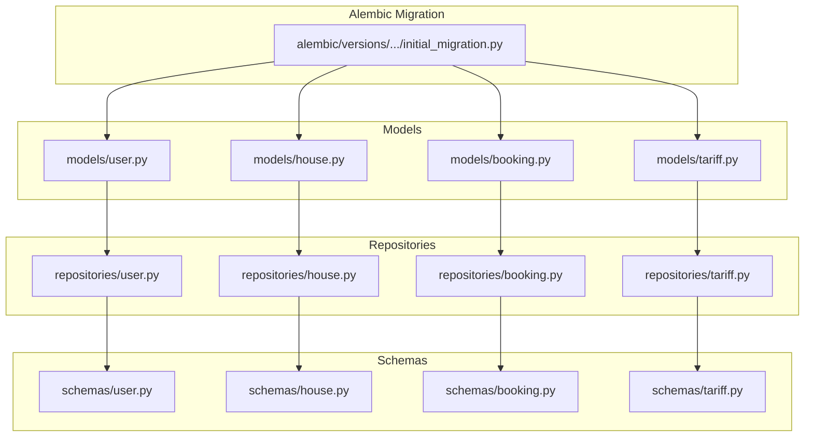
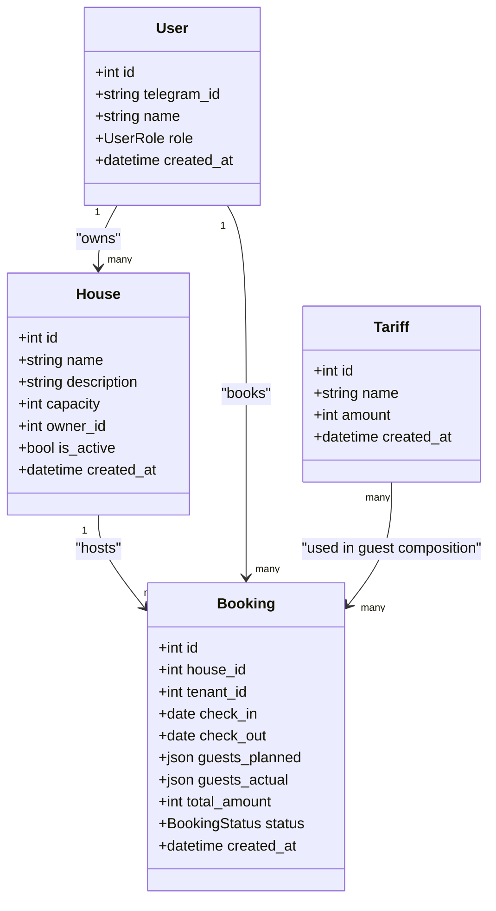
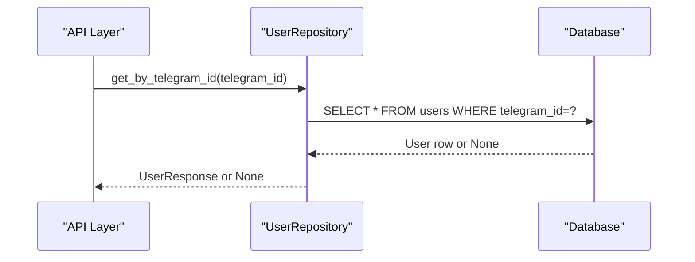
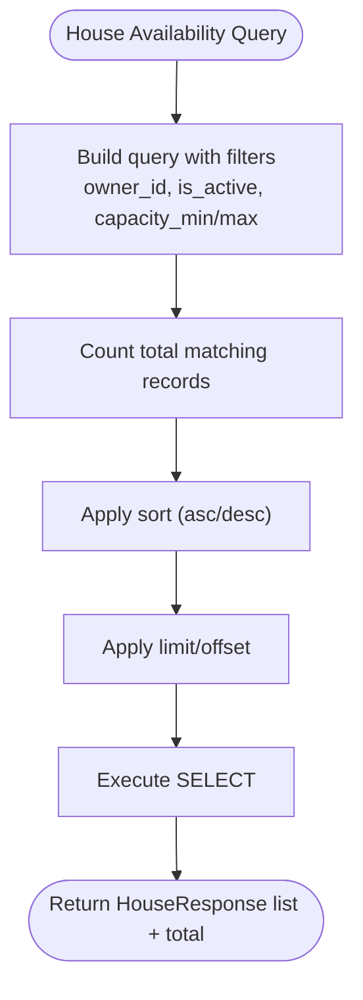
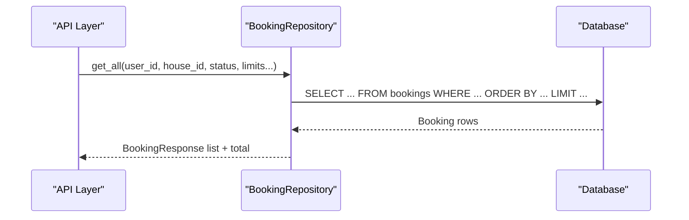
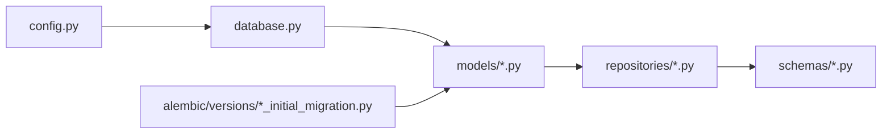
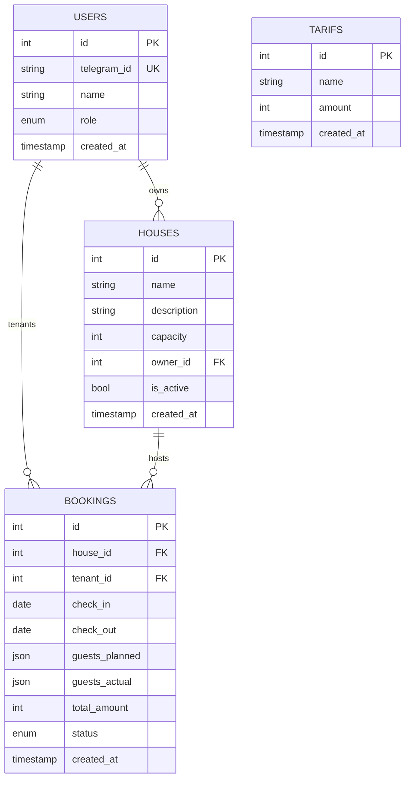

# Data Models and Database Design

<cite>
**Referenced Files in This Document**
- [backend/models/user.py](file://backend/models/user.py)
- [backend/models/house.py](file://backend/models/house.py)
- [backend/models/booking.py](file://backend/models/booking.py)
- [backend/models/tariff.py](file://backend/models/tariff.py)
- [backend/models/__init__.py](file://backend/models/__init__.py)
- [backend/schemas/user.py](file://backend/schemas/user.py)
- [backend/schemas/house.py](file://backend/schemas/house.py)
- [backend/schemas/booking.py](file://backend/schemas/booking.py)
- [backend/schemas/tariff.py](file://backend/schemas/tariff.py)
- [backend/repositories/user.py](file://backend/repositories/user.py)
- [backend/repositories/house.py](file://backend/repositories/house.py)
- [backend/repositories/booking.py](file://backend/repositories/booking.py)
- [backend/repositories/tariff.py](file://backend/repositories/tariff.py)
- [backend/database.py](file://backend/database.py)
- [alembic/versions/2a84cf51810b_initial_migration.py](file://alembic/versions/2a84cf51810b_initial_migration.py)
- [backend/main.py](file://backend/main.py)
- [backend/config.py](file://backend/config.py)
</cite>

## Table of Contents
1. [Introduction](#introduction)
2. [Project Structure](#project-structure)
3. [Core Components](#core-components)
4. [Architecture Overview](#architecture-overview)
5. [Detailed Component Analysis](#detailed-component-analysis)
6. [Dependency Analysis](#dependency-analysis)
7. [Performance Considerations](#performance-considerations)
8. [Troubleshooting Guide](#troubleshooting-guide)
9. [Conclusion](#conclusion)
10. [Appendices](#appendices)

## Introduction
This document provides comprehensive data model documentation for the booking system. It covers the User, House, Booking, and Tariff entities, detailing their fields, data types, constraints, and relationships. It also documents the initial database schema, indexes, foreign keys, and the Alembic migration that establishes the schema. Business rules and validation enforced by models and Pydantic schemas are explained, along with data access patterns via repositories, query optimization strategies, and operational considerations such as data lifecycle and retention. Security and privacy considerations are addressed alongside current and planned schema evolution.

## Project Structure
The data model layer is organized around SQLAlchemy declarative models, Pydantic schemas for validation and serialization, and repositories implementing CRUD and filtered queries. Alembic manages schema migrations.

**Diagram sources**
- [backend/models/user.py:1-32](file://backend/models/user.py#L1-L32)
- [backend/models/house.py:1-24](file://backend/models/house.py#L1-L24)
- [backend/models/booking.py:1-41](file://backend/models/booking.py#L1-L41)
- [backend/models/tariff.py:1-21](file://backend/models/tariff.py#L1-L21)
- [backend/schemas/user.py:1-72](file://backend/schemas/user.py#L1-L72)
- [backend/schemas/house.py:1-107](file://backend/schemas/house.py#L1-L107)
- [backend/schemas/booking.py:1-133](file://backend/schemas/booking.py#L1-L133)
- [backend/schemas/tariff.py:1-54](file://backend/schemas/tariff.py#L1-L54)
- [backend/repositories/user.py:1-168](file://backend/repositories/user.py#L1-L168)
- [backend/repositories/house.py:1-183](file://backend/repositories/house.py#L1-L183)
- [backend/repositories/booking.py:1-224](file://backend/repositories/booking.py#L1-L224)
- [backend/repositories/tariff.py:1-151](file://backend/repositories/tariff.py#L1-L151)
- [alembic/versions/2a84cf51810b_initial_migration.py:1-84](file://alembic/versions/2a84cf51810b_initial_migration.py#L1-L84)

**Section sources**
- [backend/models/__init__.py:1-16](file://backend/models/__init__.py#L1-L16)
- [backend/database.py:1-41](file://backend/database.py#L1-L41)
- [alembic/versions/2a84cf51810b_initial_migration.py:1-84](file://alembic/versions/2a84cf51810b_initial_migration.py#L1-L84)

## Core Components
This section defines each entity’s fields, data types, constraints, and relationships.

- User
  - Fields: id (Integer, PK, indexed), telegram_id (String, unique, indexed), name (String(100)), role (Enum: TENANT, OWNER, BOTH), created_at (DateTime with timezone, server default now())
  - Constraints: telegram_id is unique and not null; role defaults to TENANT; name not null
  - Indexes: id, telegram_id
  - Relationships: owns zero or more Houses via owner_id

- House
  - Fields: id (Integer, PK, indexed), name (String(100)), description (String(1000)), capacity (Integer), owner_id (Integer, FK to users.id), is_active (Boolean), created_at (DateTime with timezone, server default now())
  - Constraints: capacity not null; owner_id not null; is_active not null; defaults to true
  - Indexes: id
  - Relationships: belongs to one User (owner); hosts zero or more Bookings

- Booking
  - Fields: id (Integer, PK, indexed), house_id (Integer, FK to houses.id), tenant_id (Integer, FK to users.id), check_in (Date), check_out (Date), guests_planned (JSON), guests_actual (JSON), total_amount (Integer), status (Enum: PENDING, CONFIRMED, CANCELLED, COMPLETED), created_at (DateTime with timezone, server default now())
  - Constraints: dates not null; guests_planned not null; status defaults to PENDING
  - Indexes: id
  - Relationships: belongs to one House and one User (tenant)

- Tariff
  - Fields: id (Integer, PK, indexed), name (String(100)), amount (Integer, default 0), created_at (DateTime with timezone, server default now())
  - Constraints: amount not null; defaults to 0
  - Indexes: id
  - Relationships: used by Booking via guests_planned/guests_actual (JSON arrays of tariff_id + count)

Notes:
- The initial migration creates tables and indexes but does not include explicit named indexes for foreign keys beyond primary keys and the unique index on users.telegram_id.
- The models define enums for roles and statuses; these are reflected in the migration as enumerated types.

**Section sources**
- [backend/models/user.py:1-32](file://backend/models/user.py#L1-L32)
- [backend/models/house.py:1-24](file://backend/models/house.py#L1-L24)
- [backend/models/booking.py:1-41](file://backend/models/booking.py#L1-L41)
- [backend/models/tariff.py:1-21](file://backend/models/tariff.py#L1-L21)
- [alembic/versions/2a84cf51810b_initial_migration.py:21-69](file://alembic/versions/2a84cf51810b_initial_migration.py#L21-L69)

## Architecture Overview
The data layer follows a layered architecture:
- Models define persistence entities and relationships.
- Repositories encapsulate data access and query logic.
- Schemas define validation, serialization, and business rules at the API boundary.
- Alembic manages schema evolution.

**Diagram sources**
- [backend/models/user.py:19-31](file://backend/models/user.py#L19-L31)
- [backend/models/house.py:9-23](file://backend/models/house.py#L9-L23)
- [backend/models/booking.py:20-40](file://backend/models/booking.py#L20-L40)
- [backend/models/tariff.py:9-20](file://backend/models/tariff.py#L9-L20)

## Detailed Component Analysis

### User Model and Schema
- Model highlights:
  - Enum UserRole supports TENANT, OWNER, BOTH.
  - Unique constraint on telegram_id; indexed for fast lookup.
  - Default role is TENANT.
- Validation rules:
  - Pydantic schema enforces name length and role enum.
  - Optional fields in update requests; partial updates supported.
- Access patterns:
  - Retrieve by id or telegram_id.
  - Paginated listing with role filter and sort.

**Diagram sources**
- [backend/repositories/user.py:58-71](file://backend/repositories/user.py#L58-L71)
- [backend/schemas/user.py:1-72](file://backend/schemas/user.py#L1-L72)

**Section sources**
- [backend/models/user.py:11-31](file://backend/models/user.py#L11-L31)
- [backend/schemas/user.py:10-72](file://backend/schemas/user.py#L10-L72)
- [backend/repositories/user.py:12-168](file://backend/repositories/user.py#L12-L168)

### House Model and Schema
- Model highlights:
  - FK owner_id to users.id; defaults is_active to true.
  - Capacity constrained to positive integers.
- Validation rules:
  - Pydantic schema enforces name length, capacity bounds, and optional description.
  - Calendar response aggregates occupied date ranges.
- Access patterns:
  - Listing with owner_id, is_active, and capacity filters; pagination and sort.

**Diagram sources**
- [backend/repositories/house.py:68-127](file://backend/repositories/house.py#L68-L127)
- [backend/schemas/house.py:76-107](file://backend/schemas/house.py#L76-L107)

**Section sources**
- [backend/models/house.py:9-23](file://backend/models/house.py#L9-L23)
- [backend/schemas/house.py:9-107](file://backend/schemas/house.py#L9-L107)
- [backend/repositories/house.py:12-183](file://backend/repositories/house.py#L12-L183)

### Booking Model and Schema
- Model highlights:
  - Composite guest composition stored as JSON; actual composition recorded after stay.
  - Status enum governs lifecycle transitions.
- Validation rules:
  - Pydantic validators enforce check_in < check_out for create/update.
  - GuestInfo requires positive counts and valid tariff_id.
- Access patterns:
  - Listing by user_id, house_id, status; date-range filters; pagination and sort.
  - Utility to fetch existing bookings for a house excluding a specific booking.

**Diagram sources**
- [backend/repositories/booking.py:75-130](file://backend/repositories/booking.py#L75-L130)
- [backend/schemas/booking.py:110-133](file://backend/schemas/booking.py#L110-L133)

**Section sources**
- [backend/models/booking.py:11-40](file://backend/models/booking.py#L11-L40)
- [backend/schemas/booking.py:10-133](file://backend/schemas/booking.py#L10-L133)
- [backend/repositories/booking.py:13-224](file://backend/repositories/booking.py#L13-L224)

### Tariff Model and Schema
- Model highlights:
  - Tariff tiers define price per night; amount defaults to 0 (free).
- Validation rules:
  - Name length constraints; amount must be non-negative.
- Access patterns:
  - CRUD with optional sort and pagination.

**Section sources**
- [backend/models/tariff.py:9-20](file://backend/models/tariff.py#L9-L20)
- [backend/schemas/tariff.py:9-54](file://backend/schemas/tariff.py#L9-L54)
- [backend/repositories/tariff.py:12-151](file://backend/repositories/tariff.py#L12-L151)

## Dependency Analysis
- Models depend on the shared declarative Base and SQLAlchemy types.
- Repositories depend on models and Pydantic schemas for validation and response mapping.
- Alembic migration defines the initial schema and indexes.
- The application wiring ties together configuration, engine, sessions, and dependency injection.

**Diagram sources**
- [backend/config.py](file://backend/config.py)
- [backend/database.py:1-41](file://backend/database.py#L1-L41)
- [backend/models/user.py:1-32](file://backend/models/user.py#L1-L32)
- [backend/models/house.py:1-24](file://backend/models/house.py#L1-L24)
- [backend/models/booking.py:1-41](file://backend/models/booking.py#L1-L41)
- [backend/models/tariff.py:1-21](file://backend/models/tariff.py#L1-L21)
- [backend/repositories/user.py:1-168](file://backend/repositories/user.py#L1-L168)
- [backend/repositories/house.py:1-183](file://backend/repositories/house.py#L1-L183)
- [backend/repositories/booking.py:1-224](file://backend/repositories/booking.py#L1-L224)
- [backend/repositories/tariff.py:1-151](file://backend/repositories/tariff.py#L1-L151)
- [alembic/versions/2a84cf51810b_initial_migration.py:1-84](file://alembic/versions/2a84cf51810b_initial_migration.py#L1-L84)

**Section sources**
- [backend/database.py:1-41](file://backend/database.py#L1-L41)
- [backend/models/__init__.py:1-16](file://backend/models/__init__.py#L1-L16)
- [alembic/versions/2a84cf51810b_initial_migration.py:1-84](file://alembic/versions/2a84cf51810b_initial_migration.py#L1-L84)

## Performance Considerations
- Indexes
  - Primary key indexes on id are implicit for all tables.
  - Initial migration adds a unique index on users.telegram_id and indexes on users.id, houses.id, bookings.id.
  - Consider adding composite indexes for frequent queries:
    - bookings(tenant_id, status, created_at)
    - bookings(house_id, status, check_in, check_out)
    - houses(owner_id, is_active, capacity)
- Query patterns
  - Use filtered, sorted, and paginated queries in repositories to avoid scanning entire tables.
  - Prefer existence checks and count queries for paged lists.
- Data types
  - JSON fields (guests_planned, guests_actual) enable flexible guest composition but limit index-based filtering; consider normalized guest tables in future iterations.
- Asynchronous I/O
  - Async engine and sessions minimize contention under load.

[No sources needed since this section provides general guidance]

## Troubleshooting Guide
- Common validation errors
  - Booking date validation failures when check_in >= check_out.
  - Negative or missing amount in Tariff.
  - Invalid enum values for role/status.
- Operational checks
  - Ensure unique telegram_id when creating users.
  - Verify foreign key constraints before inserting into houses/bookings.
- Session lifecycle
  - Sessions are committed on success, rolled back on exceptions, and closed in all cases.

**Section sources**
- [backend/schemas/booking.py:82-107](file://backend/schemas/booking.py#L82-L107)
- [backend/schemas/tariff.py:18-22](file://backend/schemas/tariff.py#L18-L22)
- [backend/database.py:26-41](file://backend/database.py#L26-L41)

## Conclusion
The booking system employs a clean separation of concerns: models define entities and constraints, schemas enforce validation and API contracts, repositories encapsulate queries, and Alembic manages schema evolution. The initial migration establishes a solid foundation with appropriate indexes and foreign keys. Future enhancements may include normalized guest composition, additional indexes for hot queries, and expanded audit/trail capabilities.

[No sources needed since this section summarizes without analyzing specific files]

## Appendices

### Database Schema Diagram

**Diagram sources**
- [alembic/versions/2a84cf51810b_initial_migration.py:23-66](file://alembic/versions/2a84cf51810b_initial_migration.py#L23-L66)

### Sample Data Structures
- User
  - id: integer
  - telegram_id: string
  - name: string
  - role: enum value
  - created_at: timestamp
- House
  - id: integer
  - name: string
  - description: string
  - capacity: integer
  - owner_id: integer
  - is_active: boolean
  - created_at: timestamp
- Booking
  - id: integer
  - house_id: integer
  - tenant_id: integer
  - check_in: date
  - check_out: date
  - guests_planned: array of objects with tariff_id and count
  - guests_actual: array of objects with tariff_id and count
  - total_amount: integer
  - status: enum value
  - created_at: timestamp
- Tariff
  - id: integer
  - name: string
  - amount: integer
  - created_at: timestamp

[No sources needed since this section provides general guidance]

### Data Lifecycle, Retention, and Archival
- Current state
  - No explicit retention or archival policies are defined in the models or migrations.
- Recommended practices
  - Define retention windows for historical bookings and logs.
  - Archive completed bookings older than N days/months to separate storage.
  - Implement soft deletion or status flags for recoverability.

[No sources needed since this section provides general guidance]

### Data Security and Privacy
- Data exposure
  - User profiles expose telegram_id; consider masking or hashing for external APIs.
- Access control
  - Enforce ownership checks in repositories/services (e.g., only owner can manage house; only tenant can manage own bookings).
- Transport and secrets
  - Ensure database connection URLs are managed via environment variables and TLS.

[No sources needed since this section provides general guidance]

### Alembic Migration and Version Management
- Initial migration
  - Creates tables: tariffs, users, houses, bookings.
  - Adds indexes: ix_users_telegram_id (unique), ix_users_id, ix_houses_id, ix_bookings_id.
  - Defines foreign keys: houses.owner_id -> users.id, bookings.house_id -> houses.id, bookings.tenant_id -> users.id.
- Downgrade
  - Drops indexes and tables in reverse dependency order.
- Version management
  - Use Alembic autogenerate cautiously; prefer explicit migrations for production safety.

**Section sources**
- [alembic/versions/2a84cf51810b_initial_migration.py:21-84](file://alembic/versions/2a84cf51810b_initial_migration.py#L21-L84)

### Future Schema Evolution Plans
- Normalized guest composition
  - Introduce a guest_composition table linking to Booking and Tariff.
- Enhanced audit trail
  - Add created_by, updated_at, updated_by fields; maintain change logs.
- Search and analytics
  - Add GIN indexes on JSON fields if JSON queries become frequent.
  - Add materialized views or summaries for reporting.

[No sources needed since this section provides general guidance]