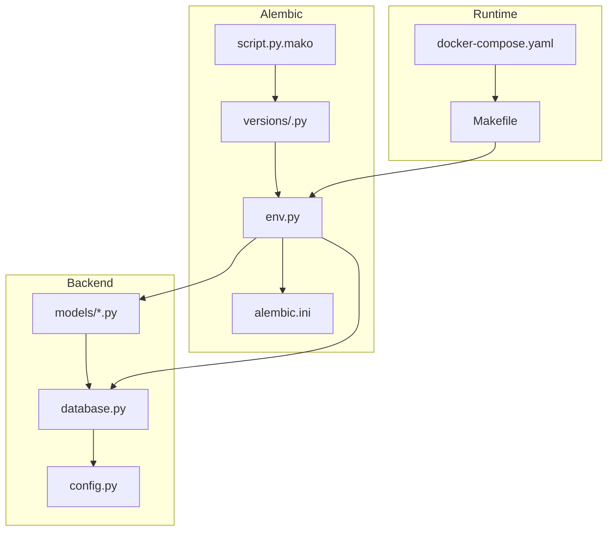
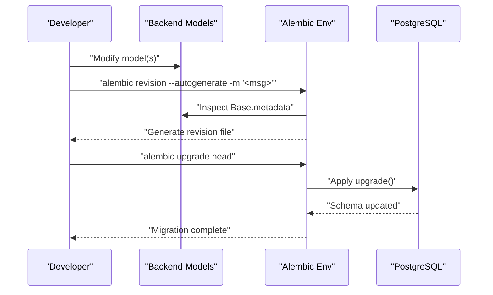
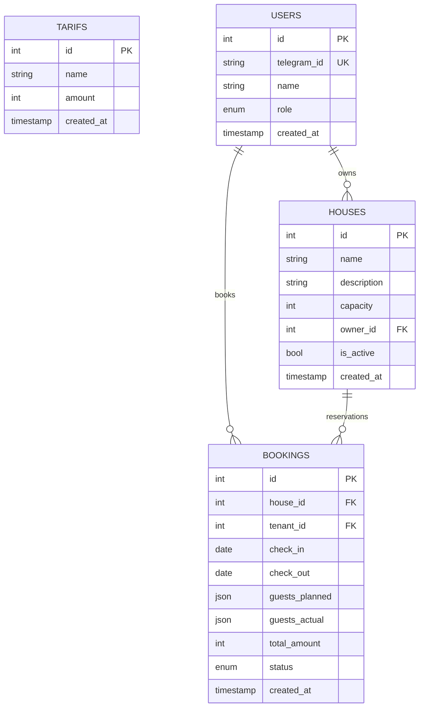
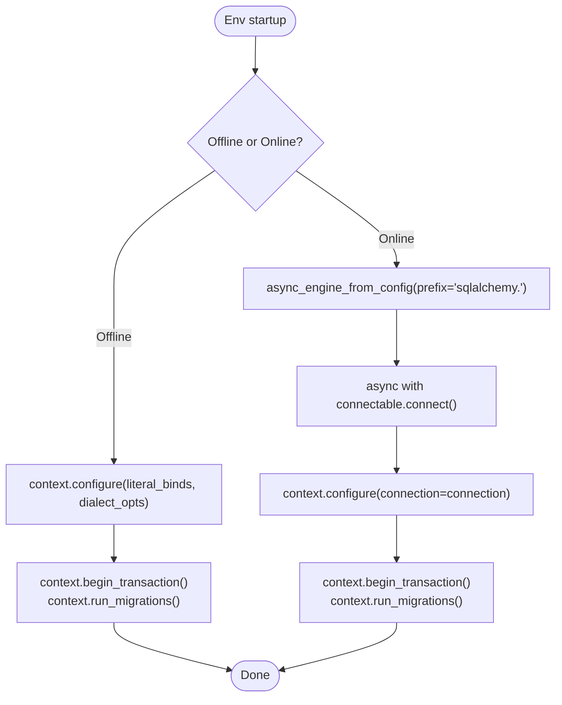
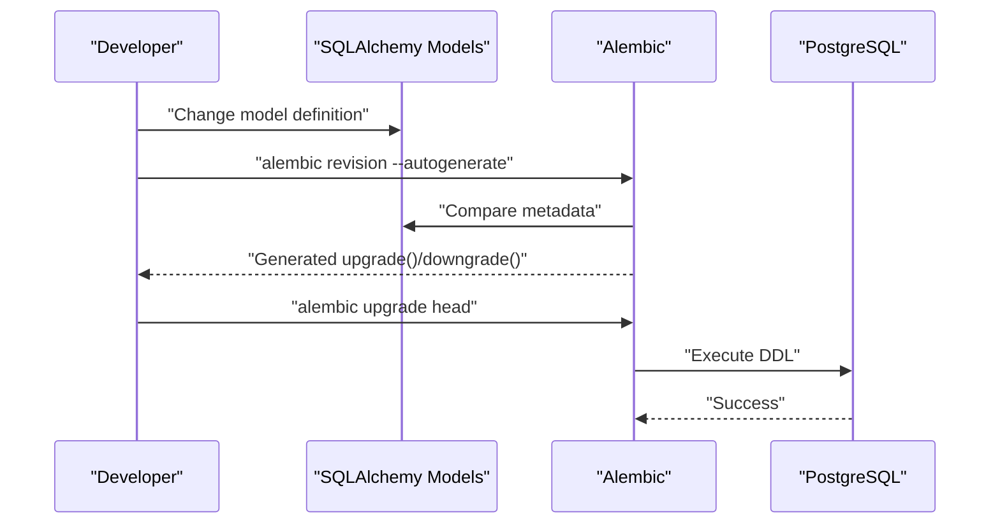
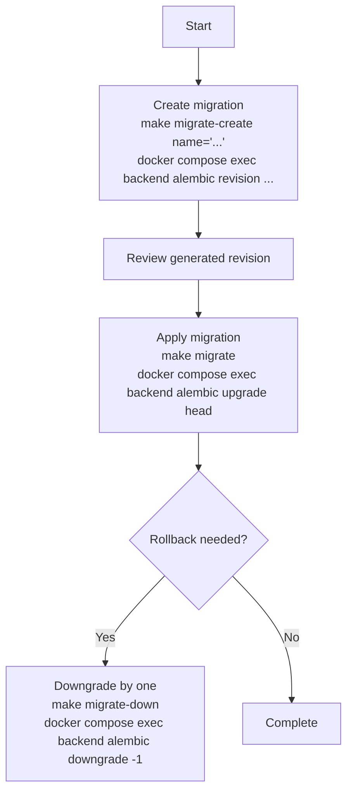
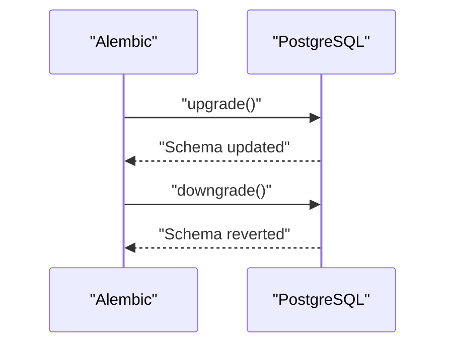
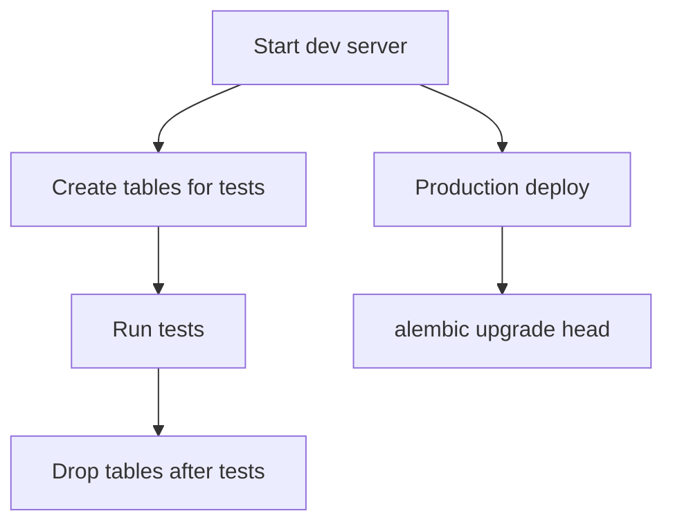
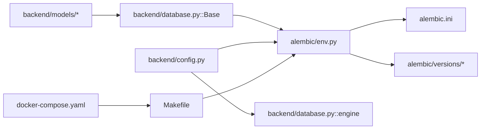

# Database Schema Evolution and Migrations

<cite>
**Referenced Files in This Document**
- [alembic/versions/2a84cf51810b_initial_migration.py](file://alembic/versions/2a84cf51810b_initial_migration.py)
- [alembic/env.py](file://alembic/env.py)
- [alembic/script.py.mako](file://alembic/script.py.mako)
- [alembic.ini](file://alembic.ini)
- [backend/database.py](file://backend/database.py)
- [backend/models/__init__.py](file://backend/models/__init__.py)
- [backend/models/user.py](file://backend/models/user.py)
- [backend/models/house.py](file://backend/models/house.py)
- [backend/models/tariff.py](file://backend/models/tariff.py)
- [backend/models/booking.py](file://backend/models/booking.py)
- [backend/config.py](file://backend/config.py)
- [backend/tests/conftest.py](file://backend/tests/conftest.py)
- [Makefile](file://Makefile)
- [docker-compose.yaml](file://docker-compose.yaml)
</cite>

## Table of Contents
1. [Introduction](#introduction)
2. [Project Structure](#project-structure)
3. [Core Components](#core-components)
4. [Architecture Overview](#architecture-overview)
5. [Detailed Component Analysis](#detailed-component-analysis)
6. [Dependency Analysis](#dependency-analysis)
7. [Performance Considerations](#performance-considerations)
8. [Troubleshooting Guide](#troubleshooting-guide)
9. [Conclusion](#conclusion)
10. [Appendices](#appendices)

## Introduction
This document explains how database schema evolution and Alembic migration management are implemented in the project. It covers the initial migration structure, schema versioning strategy, migration execution workflow, and how model changes relate to database alterations. It also documents dependency management, rollback procedures, production deployment strategies, and testing approaches across environments. Practical guidance is included for creating new migrations, handling data transformations, maintaining backward compatibility, and validating schemas during development and production.

## Project Structure
The migration system is organized around Alembic with asynchronous PostgreSQL connectivity. The backend models define the schema via SQLAlchemy declarative Base, and Alembic’s env module connects these models to the database for migration generation and execution. Docker Compose provisions a Postgres service and mounts Alembic configuration and scripts into the backend container for consistent execution across environments.

**Diagram sources**
- [alembic/env.py:1-95](file://alembic/env.py#L1-L95)
- [alembic/script.py.mako:1-27](file://alembic/script.py.mako#L1-L27)
- [alembic/versions/2a84cf51810b_initial_migration.py:1-84](file://alembic/versions/2a84cf51810b_initial_migration.py#L1-L84)
- [alembic.ini:1-115](file://alembic.ini#L1-L115)
- [backend/database.py:1-41](file://backend/database.py#L1-L41)
- [backend/models/__init__.py:1-16](file://backend/models/__init__.py#L1-L16)
- [backend/config.py:1-25](file://backend/config.py#L1-L25)
- [Makefile:56-64](file://Makefile#L56-L64)
- [docker-compose.yaml:1-43](file://docker-compose.yaml#L1-L43)

**Section sources**
- [alembic/env.py:1-95](file://alembic/env.py#L1-L95)
- [alembic/script.py.mako:1-27](file://alembic/script.py.mako#L1-L27)
- [alembic/versions/2a84cf51810b_initial_migration.py:1-84](file://alembic/versions/2a84cf51810b_initial_migration.py#L1-L84)
- [alembic.ini:1-115](file://alembic.ini#L1-L115)
- [backend/database.py:1-41](file://backend/database.py#L1-L41)
- [backend/models/__init__.py:1-16](file://backend/models/__init__.py#L1-L16)
- [backend/config.py:1-25](file://backend/config.py#L1-L25)
- [Makefile:56-64](file://Makefile#L56-L64)
- [docker-compose.yaml:1-43](file://docker-compose.yaml#L1-L43)

## Core Components
- Initial migration: Defines the baseline schema for tariffs, users, houses, and bookings, including indexes and foreign keys.
- Alembic environment: Configures async PostgreSQL connectivity, loads models, and orchestrates offline/online migration runs.
- Script template: Provides the Mako template for generating revision files with proper metadata and placeholders for upgrade/downgrade steps.
- Backend models: Define tables, columns, enums, and relationships that serve as the source of truth for autogenerate.
- Database configuration: Establishes async engine and Base for ORM metadata discovery.
- Configuration: Supplies database URL consumed by Alembic and runtime.
- Testing harness: Creates/drops test databases and ensures clean state per test.

**Section sources**
- [alembic/versions/2a84cf51810b_initial_migration.py:21-83](file://alembic/versions/2a84cf51810b_initial_migration.py#L21-L83)
- [alembic/env.py:38-94](file://alembic/env.py#L38-L94)
- [alembic/script.py.mako:1-27](file://alembic/script.py.mako#L1-L27)
- [backend/models/user.py:19-32](file://backend/models/user.py#L19-L32)
- [backend/models/house.py:9-24](file://backend/models/house.py#L9-L24)
- [backend/models/tariff.py:9-21](file://backend/models/tariff.py#L9-L21)
- [backend/models/booking.py:20-41](file://backend/models/booking.py#L20-L41)
- [backend/database.py:8-23](file://backend/database.py#L8-L23)
- [backend/config.py:17-18](file://backend/config.py#L17-L18)
- [backend/tests/conftest.py:23-60](file://backend/tests/conftest.py#L23-L60)

## Architecture Overview
The migration pipeline connects backend models to the database through Alembic. During development, models are changed and Alembic generates or applies migrations. In production, migrations are executed against the target database using the same async environment configuration.

**Diagram sources**
- [alembic/env.py:28-35](file://alembic/env.py#L28-L35)
- [alembic/versions/2a84cf51810b_initial_migration.py:21-83](file://alembic/versions/2a84cf51810b_initial_migration.py#L21-L83)
- [backend/models/__init__.py:1-16](file://backend/models/__init__.py#L1-L16)

## Detailed Component Analysis

### Initial Migration: Schema Definition and Constraints
The initial migration creates four tables with primary keys, indexes, and foreign keys. It establishes:
- tariffs: pricing tiers with integer amounts and timestamps.
- users: Telegram-based identity with role enum and unique telegram_id.
- houses: property records linked to users as owners.
- bookings: reservations linking houses and users, with JSON guest payloads and status enum.

Key behaviors:
- Auto-generated indexes on primary keys.
- Unique index on users.telegram_id.
- Foreign keys from houses.owner_id to users.id and from bookings to houses.id and users.id.
- Downgrade drops tables in reverse dependency order to respect foreign keys.

**Diagram sources**
- [alembic/versions/2a84cf51810b_initial_migration.py:23-67](file://alembic/versions/2a84cf51810b_initial_migration.py#L23-L67)
- [backend/models/user.py:19-32](file://backend/models/user.py#L19-L32)
- [backend/models/house.py:9-24](file://backend/models/house.py#L9-L24)
- [backend/models/tariff.py:9-21](file://backend/models/tariff.py#L9-L21)
- [backend/models/booking.py:20-41](file://backend/models/booking.py#L20-L41)

**Section sources**
- [alembic/versions/2a84cf51810b_initial_migration.py:21-83](file://alembic/versions/2a84cf51810b_initial_migration.py#L21-L83)
- [backend/models/user.py:19-32](file://backend/models/user.py#L19-L32)
- [backend/models/house.py:9-24](file://backend/models/house.py#L9-L24)
- [backend/models/tariff.py:9-21](file://backend/models/tariff.py#L9-L21)
- [backend/models/booking.py:20-41](file://backend/models/booking.py#L20-L41)

### Alembic Environment and Async Execution
The Alembic environment:
- Loads settings.database_url to configure the SQLAlchemy URL.
- Exposes Base.metadata for autogenerate support.
- Supports offline mode for generating SQL scripts without a live connection.
- Runs online migrations asynchronously using asyncpg, ensuring compatibility with the backend’s async engine.

**Diagram sources**
- [alembic/env.py:38-94](file://alembic/env.py#L38-L94)
- [alembic.ini:61-61](file://alembic.ini#L61-L61)

**Section sources**
- [alembic/env.py:20-35](file://alembic/env.py#L20-L35)
- [alembic/env.py:38-94](file://alembic/env.py#L38-L94)
- [alembic.ini:61-61](file://alembic.ini#L61-L61)

### Model-to-Migration Mapping
Model changes propagate to the database via Alembic:
- Add/remove tables: reflected in create/drop table statements.
- Add/remove columns: reflected in alter table add/drop statements.
- Change constraints: reflected in create/drop index/unique/fkey statements.
- Enums and JSON columns: preserved as declared in models.

**Diagram sources**
- [alembic/env.py:28-35](file://alembic/env.py#L28-L35)
- [backend/models/__init__.py:1-16](file://backend/models/__init__.py#L1-L16)

**Section sources**
- [alembic/env.py:28-35](file://alembic/env.py#L28-L35)
- [backend/models/__init__.py:1-16](file://backend/models/__init__.py#L1-L16)

### Migration Execution Workflow
- Development: Use Makefile targets to create and apply migrations inside the backend container.
- Production: Apply migrations against the production database using the same async environment configuration.

**Diagram sources**
- [Makefile:57-64](file://Makefile#L57-L64)
- [alembic/env.py:70-84](file://alembic/env.py#L70-L84)

**Section sources**
- [Makefile:57-64](file://Makefile#L57-L64)
- [alembic/env.py:70-84](file://alembic/env.py#L70-L84)

### Migration Dependency Management and Rollbacks
- Revision chain: Each migration declares its down_revision; Alembic tracks the chain to ensure ordered execution.
- Downgrade safety: The initial migration drops tables in reverse dependency order to avoid foreign key violations.
- Backward compatibility: New migrations should provide safe downgrade steps to maintain deployability across environments.

**Diagram sources**
- [alembic/versions/2a84cf51810b_initial_migration.py:21-83](file://alembic/versions/2a84cf51810b_initial_migration.py#L21-L83)

**Section sources**
- [alembic/versions/2a84cf51810b_initial_migration.py:14-18](file://alembic/versions/2a84cf51810b_initial_migration.py#L14-L18)
- [alembic/versions/2a84cf51810b_initial_migration.py:72-83](file://alembic/versions/2a84cf51810b_initial_migration.py#L72-L83)

### Creating New Migrations and Data Transformations
- Autogenerate: Use the Makefile target to generate a revision with autogenerate enabled.
- Manual steps: Edit the generated revision to add explicit data transforms or custom DDL not captured by autogenerate.
- Backward compatibility: Ensure downgrade preserves data or provides safe defaults.

Practical steps:
- Create a new revision with a descriptive message.
- Review and refine the generated upgrade/downgrade blocks.
- Test locally and in CI before applying to production.

**Section sources**
- [Makefile:60-61](file://Makefile#L60-L61)
- [alembic/script.py.mako:21-26](file://alembic/script.py.mako#L21-L26)

### Environment-Specific Deployments
- Local development: Alembic uses settings.database_url loaded from backend configuration.
- Dockerized runtime: docker-compose sets BACKEND_DATABASE_URL for the backend service, ensuring migrations run against the managed Postgres instance.
- CI/CD: Run migrations via the Makefile targets inside the backend container to guarantee consistency.

**Section sources**
- [alembic/env.py:20-21](file://alembic/env.py#L20-L21)
- [backend/config.py:17-18](file://backend/config.py#L17-L18)
- [docker-compose.yaml:25-35](file://docker-compose.yaml#L25-L35)
- [Makefile:57-64](file://Makefile#L57-L64)

### Schema Validation During Development and Production
- Development: Tests create and drop tables per run, ensuring schema alignment with models and enabling quick feedback.
- Production: Use alembic upgrade head to align production schema with the latest migration.

**Diagram sources**
- [backend/tests/conftest.py:50-58](file://backend/tests/conftest.py#L50-L58)
- [Makefile:57-58](file://Makefile#L57-L58)

**Section sources**
- [backend/tests/conftest.py:23-60](file://backend/tests/conftest.py#L23-L60)
- [Makefile:57-58](file://Makefile#L57-L58)

## Dependency Analysis
- Alembic env depends on backend configuration and models to discover metadata for autogenerate.
- Backend models depend on declarative Base for schema reflection.
- Runtime database engine and Base are shared between tests and Alembic for consistency.
- Docker Compose mounts alembic configuration and scripts into the backend container for reproducible migrations.

**Diagram sources**
- [backend/models/__init__.py:1-16](file://backend/models/__init__.py#L1-L16)
- [backend/database.py:22-23](file://backend/database.py#L22-L23)
- [alembic/env.py:12-35](file://alembic/env.py#L12-L35)
- [backend/config.py:17-18](file://backend/config.py#L17-L18)
- [alembic.ini:5-11](file://alembic.ini#L5-L11)
- [alembic/versions/2a84cf51810b_initial_migration.py:1-84](file://alembic/versions/2a84cf51810b_initial_migration.py#L1-L84)
- [docker-compose.yaml:21-40](file://docker-compose.yaml#L21-L40)
- [Makefile:57-64](file://Makefile#L57-L64)

**Section sources**
- [backend/models/__init__.py:1-16](file://backend/models/__init__.py#L1-L16)
- [backend/database.py:22-23](file://backend/database.py#L22-L23)
- [alembic/env.py:12-35](file://alembic/env.py#L12-L35)
- [backend/config.py:17-18](file://backend/config.py#L17-L18)
- [alembic.ini:5-11](file://alembic.ini#L5-L11)
- [docker-compose.yaml:21-40](file://docker-compose.yaml#L21-L40)
- [Makefile:57-64](file://Makefile#L57-L64)

## Performance Considerations
- Prefer batching schema changes in a single migration to minimize downtime.
- Use indexes judiciously; they improve reads but can slow writes.
- Avoid long-running migrations in production; consider background jobs for large data transformations.
- Keep migrations reversible to enable quick rollbacks if performance regressions are detected.

## Troubleshooting Guide
Common issues and resolutions:
- Migration fails due to missing database URL: Verify backend configuration and environment variables are correctly set in both runtime and Alembic contexts.
- Foreign key errors on downgrade: Ensure downgrade order respects referential integrity (as implemented in the initial migration).
- Autogenerate misses changes: Confirm models are imported in Alembic env so Base.metadata includes them.
- Test database conflicts: The test fixture ensures database creation and per-test cleanup; verify the admin connection and TRUNCATE steps are functioning.

**Section sources**
- [alembic/env.py:20-21](file://alembic/env.py#L20-L21)
- [alembic/versions/2a84cf51810b_initial_migration.py:72-83](file://alembic/versions/2a84cf51810b_initial_migration.py#L72-L83)
- [backend/tests/conftest.py:23-60](file://backend/tests/conftest.py#L23-L60)

## Conclusion
The project implements a robust, async-compatible migration system using Alembic and SQLAlchemy models. The initial migration establishes a clear schema with appropriate constraints and indexes. Alembic’s environment integrates seamlessly with backend configuration and Docker Compose, enabling repeatable migrations across environments. By following the documented workflow—creating revisions, reviewing changes, testing locally, and applying upgrades—you can safely evolve the schema while maintaining backward compatibility and operational reliability.

## Appendices

### Appendix A: Quick Reference for Migration Tasks
- Create a new migration: make migrate-create name="..."
- Apply migrations: make migrate
- Rollback one step: make migrate-down
- Inspect current revision: alembic current

**Section sources**
- [Makefile:57-64](file://Makefile#L57-L64)
- [alembic/script.py.mako:1-27](file://alembic/script.py.mako#L1-L27)