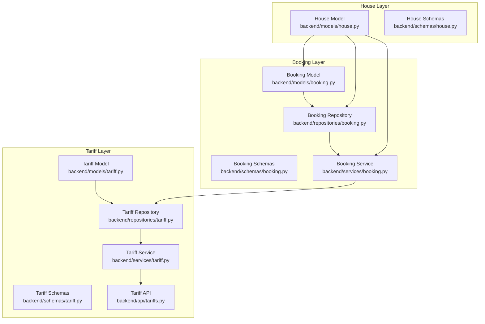
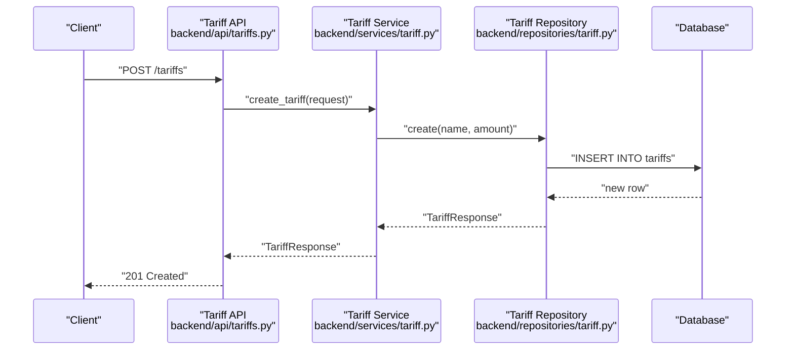
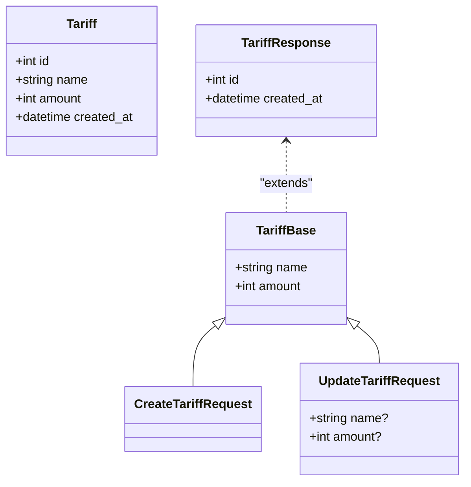
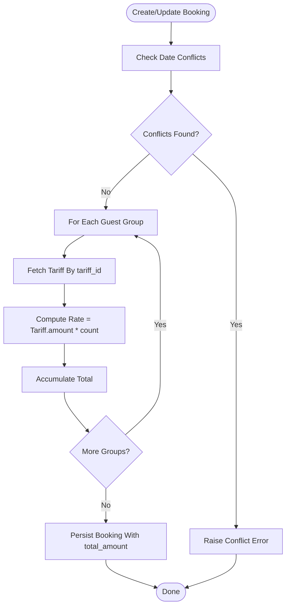
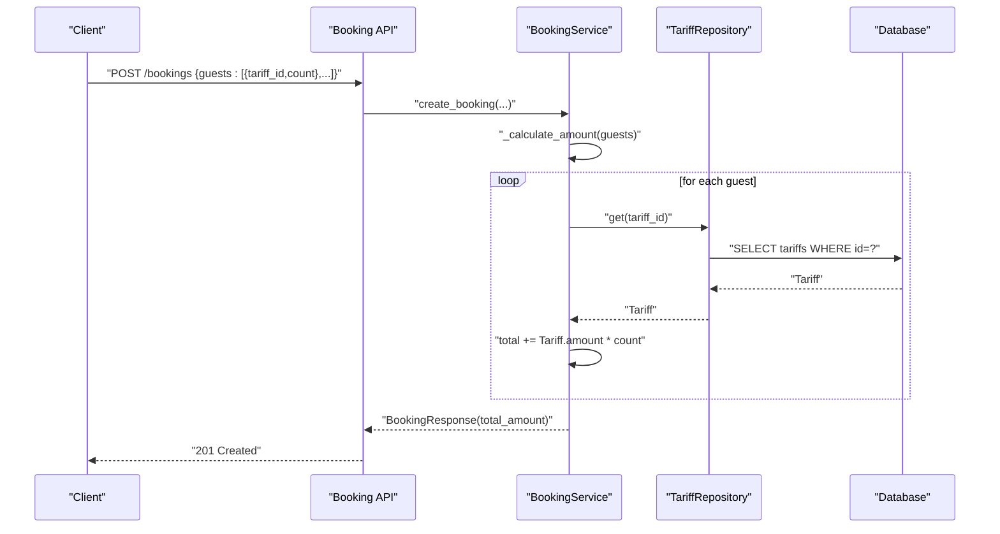
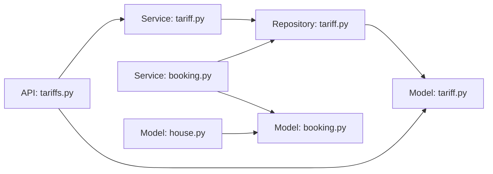

# Pricing and Tariff Models

<cite>
**Referenced Files in This Document**
- [backend/models/tariff.py](file://backend/models/tariff.py)
- [backend/schemas/tariff.py](file://backend/schemas/tariff.py)
- [backend/repositories/tariff.py](file://backend/repositories/tariff.py)
- [backend/services/tariff.py](file://backend/services/tariff.py)
- [backend/api/tariffs.py](file://backend/api/tariffs.py)
- [backend/models/house.py](file://backend/models/house.py)
- [backend/schemas/house.py](file://backend/schemas/house.py)
- [backend/models/booking.py](file://backend/models/booking.py)
- [backend/schemas/booking.py](file://backend/schemas/booking.py)
- [backend/services/booking.py](file://backend/services/booking.py)
- [backend/repositories/booking.py](file://backend/repositories/booking.py)
- [alembic/versions/2a84cf51810b_initial_migration.py](file://alembic/versions/2a84cf51810b_initial_migration.py)
- [docs/data-model.md](file://docs/data-model.md)
- [backend/tests/test_tariffs.py](file://backend/tests/test_tariffs.py)
- [backend/tests/test_bookings.py](file://backend/tests/test_bookings.py)
</cite>

## Table of Contents
1. [Introduction](#introduction)
2. [Project Structure](#project-structure)
3. [Core Components](#core-components)
4. [Architecture Overview](#architecture-overview)
5. [Detailed Component Analysis](#detailed-component-analysis)
6. [Dependency Analysis](#dependency-analysis)
7. [Performance Considerations](#performance-considerations)
8. [Troubleshooting Guide](#troubleshooting-guide)
9. [Conclusion](#conclusion)
10. [Appendices](#appendices)

## Introduction
This document describes the pricing and tariff models implemented in the system. It focuses on the Tariff entity that defines guest pricing tiers, how tariffs relate to Houses and Bookings, and the rate calculation workflow used to compute total booking costs. It also documents the current data model, validation rules, and operational behaviors, and outlines practical examples for creating tariffs, computing rates, validating inputs, and updating pricing.

## Project Structure
The pricing and tariff functionality spans models, schemas, repositories, services, and API layers. Tariffs are stored in the database and referenced by bookings to calculate nightly rates per guest type.

**Diagram sources**
- [backend/models/tariff.py:1-21](file://backend/models/tariff.py#L1-L21)
- [backend/schemas/tariff.py:1-54](file://backend/schemas/tariff.py#L1-L54)
- [backend/repositories/tariff.py:1-151](file://backend/repositories/tariff.py#L1-L151)
- [backend/services/tariff.py:1-144](file://backend/services/tariff.py#L1-L144)
- [backend/api/tariffs.py:1-187](file://backend/api/tariffs.py#L1-L187)
- [backend/models/booking.py:1-41](file://backend/models/booking.py#L1-L41)
- [backend/schemas/booking.py:1-133](file://backend/schemas/booking.py#L1-L133)
- [backend/repositories/booking.py:1-224](file://backend/repositories/booking.py#L1-L224)
- [backend/services/booking.py:1-322](file://backend/services/booking.py#L1-L322)
- [backend/models/house.py:1-24](file://backend/models/house.py#L1-L24)
- [backend/schemas/house.py:1-107](file://backend/schemas/house.py#L1-L107)

**Section sources**
- [backend/models/tariff.py:1-21](file://backend/models/tariff.py#L1-L21)
- [backend/schemas/tariff.py:1-54](file://backend/schemas/tariff.py#L1-L54)
- [backend/repositories/tariff.py:1-151](file://backend/repositories/tariff.py#L1-L151)
- [backend/services/tariff.py:1-144](file://backend/services/tariff.py#L1-L144)
- [backend/api/tariffs.py:1-187](file://backend/api/tariffs.py#L1-L187)
- [backend/models/booking.py:1-41](file://backend/models/booking.py#L1-L41)
- [backend/schemas/booking.py:1-133](file://backend/schemas/booking.py#L1-L133)
- [backend/repositories/booking.py:1-224](file://backend/repositories/booking.py#L1-L224)
- [backend/services/booking.py:1-322](file://backend/services/booking.py#L1-L322)
- [backend/models/house.py:1-24](file://backend/models/house.py#L1-L24)
- [backend/schemas/house.py:1-107](file://backend/schemas/house.py#L1-L107)

## Core Components
- Tariff entity: Defines guest pricing tiers with a name and amount per night.
- Booking entity: Stores planned guest composition by tariff type and calculates total amount based on current tariff rates.
- House entity: Represents rental properties; bookings are associated with houses.
- Validation and constraints: Pydantic schemas enforce field constraints; database migrations define column types and checks.

Key data model fields:
- Tariff: id, name (<= 100 chars), amount (>= 0), created_at
- Booking: house_id, tenant_id, check_in, check_out, guests_planned (JSON array of {tariff_id, count}), guests_actual (JSON), total_amount (>= 0), status, created_at
- House: id, name (<= 100 chars), description (<= 1000), capacity (>= 1), owner_id, is_active, created_at

Relationships:
- Tariffs are referenced by bookings via guests_planned entries.
- Bookings belong to a House and a Tenant (via foreign keys).
- Tariff data is fetched during booking amount calculation.

**Section sources**
- [backend/models/tariff.py:9-21](file://backend/models/tariff.py#L9-L21)
- [backend/schemas/tariff.py:9-22](file://backend/schemas/tariff.py#L9-L22)
- [backend/models/booking.py:20-41](file://backend/models/booking.py#L20-L41)
- [backend/schemas/booking.py:35-67](file://backend/schemas/booking.py#L35-L67)
- [backend/models/house.py:9-24](file://backend/models/house.py#L9-L24)
- [backend/schemas/house.py:9-32](file://backend/schemas/house.py#L9-L32)
- [alembic/versions/2a84cf51810b_initial_migration.py:21-69](file://alembic/versions/2a84cf51810b_initial_migration.py#L21-L69)
- [docs/data-model.md:75-86](file://docs/data-model.md#L75-L86)

## Architecture Overview
The system follows a layered architecture:
- API layer exposes endpoints for tariffs and delegates to services.
- Service layer encapsulates business logic (validation, calculations).
- Repository layer handles database operations.
- Models and schemas define persistence and validation contracts.
- Tariff data is queried during booking creation/update to compute total amounts.

**Diagram sources**
- [backend/api/tariffs.py:101-117](file://backend/api/tariffs.py#L101-L117)
- [backend/services/tariff.py:49-61](file://backend/services/tariff.py#L49-L61)
- [backend/repositories/tariff.py:23-41](file://backend/repositories/tariff.py#L23-L41)

**Section sources**
- [backend/api/tariffs.py:1-187](file://backend/api/tariffs.py#L1-L187)
- [backend/services/tariff.py:1-144](file://backend/services/tariff.py#L1-L144)
- [backend/repositories/tariff.py:1-151](file://backend/repositories/tariff.py#L1-L151)

## Detailed Component Analysis

### Tariff Entity and Data Model
- Purpose: Define guest pricing tiers (e.g., adult, child, regular guest).
- Persistence: SQLAlchemy model with integer primary key, string name, integer amount, and timestamp.
- Validation: Pydantic schema enforces name length and non-negative amount.
- API: CRUD endpoints support creation, retrieval, listing with pagination/sorting, partial updates, and deletion.

**Diagram sources**
- [backend/models/tariff.py:9-21](file://backend/models/tariff.py#L9-L21)
- [backend/schemas/tariff.py:9-54](file://backend/schemas/tariff.py#L9-L54)

**Section sources**
- [backend/models/tariff.py:1-21](file://backend/models/tariff.py#L1-L21)
- [backend/schemas/tariff.py:1-54](file://backend/schemas/tariff.py#L1-L54)
- [backend/repositories/tariff.py:1-151](file://backend/repositories/tariff.py#L1-L151)
- [backend/services/tariff.py:1-144](file://backend/services/tariff.py#L1-L144)
- [backend/api/tariffs.py:1-187](file://backend/api/tariffs.py#L1-L187)

### Rate Calculation Workflow
Tariff-driven rate calculation occurs during booking creation and update when guests are provided or modified. The workflow:
- Validate date conflicts for the house.
- For each guest group in guests_planned, fetch the tariff by tariff_id and multiply amount by count.
- Sum all subtotals to produce total_amount.
- Persist booking with calculated total_amount.

**Diagram sources**
- [backend/services/booking.py:78-126](file://backend/services/booking.py#L78-L126)
- [backend/repositories/booking.py:24-58](file://backend/repositories/booking.py#L24-L58)
- [backend/schemas/booking.py:25-33](file://backend/schemas/booking.py#L25-L33)

**Section sources**
- [backend/services/booking.py:108-126](file://backend/services/booking.py#L108-L126)
- [backend/repositories/booking.py:199-224](file://backend/repositories/booking.py#L199-L224)
- [backend/schemas/booking.py:25-33](file://backend/schemas/booking.py#L25-L33)

### Pricing Validation Rules
- Tariff name: Required, length 1–100.
- Tariff amount: Required, integer >= 0.
- Booking guests_planned: Array of objects with tariff_id and count; both validated by schema.
- Booking check_in/check_out: Must satisfy check_in < check_out.
- Tariff amount updates: Negative values rejected by schema validation.

Examples from tests:
- Creating tariffs with valid and invalid inputs.
- Listing with pagination and sorting.
- Partial updates with validation errors.

**Section sources**
- [backend/schemas/tariff.py:9-22](file://backend/schemas/tariff.py#L9-L22)
- [backend/schemas/booking.py:70-88](file://backend/schemas/booking.py#L70-L88)
- [backend/tests/test_tariffs.py:10-63](file://backend/tests/test_tariffs.py#L10-L63)
- [backend/tests/test_tariffs.py:179-242](file://backend/tests/test_tariffs.py#L179-L242)
- [backend/tests/test_bookings.py:229-263](file://backend/tests/test_bookings.py#L229-L263)

### Tariff Application Logic
- Tariff lookup: During booking creation/update, the service queries tariffs by tariff_id to obtain current rates.
- Composition-based pricing: total_amount reflects the sum of (tariff.amount × guest count) for each guest group.
- Dynamic updates: Changing a tariff’s amount affects future bookings using that tariff_id; past bookings retain their stored total_amount.

**Diagram sources**
- [backend/services/booking.py:108-126](file://backend/services/booking.py#L108-L126)
- [backend/repositories/tariff.py:43-56](file://backend/repositories/tariff.py#L43-L56)

**Section sources**
- [backend/services/booking.py:108-126](file://backend/services/booking.py#L108-L126)
- [backend/repositories/tariff.py:1-151](file://backend/repositories/tariff.py#L1-L151)

### Historical Pricing Tracking
- The system stores total_amount at booking creation/update. This preserves historical pricing even if tariffs change later.
- No separate tariff history table exists; price changes are reflected in future bookings only.

Implications:
- To audit historical rates, rely on booking records’ total_amount and timestamps.
- If detailed audit trails are required, consider adding a tariff_history table and recording effective rates per booking.

**Section sources**
- [backend/models/booking.py:20-41](file://backend/models/booking.py#L20-L41)
- [backend/schemas/booking.py:43-67](file://backend/schemas/booking.py#L43-L67)

### Examples

#### Example 1: Create a Tariff
- Endpoint: POST /tariffs
- Request fields: name (string), amount (integer >= 0)
- Behavior: Creates a new tariff and returns TariffResponse with id and created_at.

Validation:
- Name length and amount constraints enforced by schema.
- Tests demonstrate success for valid inputs and 422 for invalid amount/name.

**Section sources**
- [backend/api/tariffs.py:101-117](file://backend/api/tariffs.py#L101-L117)
- [backend/schemas/tariff.py:9-22](file://backend/schemas/tariff.py#L9-L22)
- [backend/tests/test_tariffs.py:10-25](file://backend/tests/test_tariffs.py#L10-L25)

#### Example 2: Compute Rate for a Booking
- Scenario: guests_planned includes multiple tariff groups.
- Calculation: For each group, multiply tariff.amount by count; sum totals.
- Outcome: total_amount set on booking.

Validation:
- Dates validated to ensure check_in < check_out.
- Tests confirm correct total_amount computation across multiple tariff types.

**Section sources**
- [backend/services/booking.py:108-126](file://backend/services/booking.py#L108-L126)
- [backend/schemas/booking.py:70-88](file://backend/schemas/booking.py#L70-L88)
- [backend/tests/test_bookings.py:229-263](file://backend/tests/test_bookings.py#L229-L263)

#### Example 3: Update Tariff Amount
- Endpoint: PATCH /tariffs/{id}
- Behavior: Partial update supports changing name and/or amount.
- Validation: Negative amount rejected; missing id handled by not-found error.

**Section sources**
- [backend/api/tariffs.py:137-157](file://backend/api/tariffs.py#L137-L157)
- [backend/schemas/tariff.py:46-54](file://backend/schemas/tariff.py#L46-L54)
- [backend/tests/test_tariffs.py:179-242](file://backend/tests/test_tariffs.py#L179-L242)

#### Example 4: Pricing Validation
- Tariff creation rejects negative amounts and empty names.
- Booking creation validates date ordering and computes total_amount.

**Section sources**
- [backend/tests/test_tariffs.py:42-63](file://backend/tests/test_tariffs.py#L42-L63)
- [backend/schemas/booking.py:70-88](file://backend/schemas/booking.py#L70-L88)

#### Example 5: Dynamic Rate Updates
- Updating a tariff’s amount changes future bookings using that tariff_id.
- Past bookings retain their original total_amount.

**Section sources**
- [backend/services/booking.py:108-126](file://backend/services/booking.py#L108-L126)
- [backend/repositories/tariff.py:101-131](file://backend/repositories/tariff.py#L101-L131)

## Dependency Analysis
- Tariff model and schemas define the pricing tier contract.
- Booking service depends on TariffRepository to fetch current rates.
- API routes depend on TariffService for business logic.
- Database schema constraints ensure data integrity for amounts and dates.

**Diagram sources**
- [backend/api/tariffs.py:1-187](file://backend/api/tariffs.py#L1-L187)
- [backend/services/tariff.py:1-144](file://backend/services/tariff.py#L1-L144)
- [backend/repositories/tariff.py:1-151](file://backend/repositories/tariff.py#L1-L151)
- [backend/models/tariff.py:1-21](file://backend/models/tariff.py#L1-L21)
- [backend/services/booking.py:1-322](file://backend/services/booking.py#L1-L322)
- [backend/models/booking.py:1-41](file://backend/models/booking.py#L1-L41)
- [backend/models/house.py:1-24](file://backend/models/house.py#L1-L24)

**Section sources**
- [backend/api/tariffs.py:1-187](file://backend/api/tariffs.py#L1-L187)
- [backend/services/tariff.py:1-144](file://backend/services/tariff.py#L1-L144)
- [backend/repositories/tariff.py:1-151](file://backend/repositories/tariff.py#L1-L151)
- [backend/services/booking.py:1-322](file://backend/services/booking.py#L1-L322)

## Performance Considerations
- Tariff lookups: Each guest group triggers a tariff fetch; batch or cache tariff data if many guests are processed frequently.
- Indexing: Tariff id index exists; ensure queries remain efficient as data grows.
- JSON fields: guests_planned/guests_actual are JSON; consider normalization if complex queries on guest composition become frequent.
- Concurrency: Tariff updates are atomic; rate calculation reads current values, avoiding stale prices.

[No sources needed since this section provides general guidance]

## Troubleshooting Guide
Common issues and resolutions:
- Tariff not found: API returns 404; ensure tariff_id exists before creating/updating bookings.
- Invalid input data: Schema validation returns 422 for out-of-range amounts or empty names.
- Date conflicts: Overlapping bookings raise conflict errors; adjust dates or check house availability.
- Permission errors: Only authorized tenants can update or cancel bookings; verify tenant_id.

**Section sources**
- [backend/services/tariff.py:63-78](file://backend/services/tariff.py#L63-L78)
- [backend/services/booking.py:210-281](file://backend/services/booking.py#L210-L281)
- [backend/tests/test_tariffs.py:88-92](file://backend/tests/test_tariffs.py#L88-L92)
- [backend/tests/test_bookings.py:162-174](file://backend/tests/test_bookings.py#L162-L174)

## Conclusion
The current implementation provides a straightforward, schema-validated tariff system integrated with booking rate calculation. Tariff-driven pricing is simple and explicit, enabling landlords to define guest categories and nightly rates. While the system supports dynamic rate updates and historical preservation via booking total_amount, advanced features such as blackout dates, minimum stay requirements, seasonal adjustments, and occupancy-based pricing are not present in the current codebase and would require extending the data model and business logic accordingly.

[No sources needed since this section summarizes without analyzing specific files]

## Appendices

### Appendix A: Data Model Definitions
- Tariff: id, name (<= 100), amount (>= 0), created_at
- Booking: house_id, tenant_id, check_in, check_out, guests_planned (JSON), guests_actual (JSON), total_amount (>= 0), status, created_at
- House: id, name (<= 100), description (<= 1000), capacity (>= 1), owner_id, is_active, created_at

**Section sources**
- [docs/data-model.md:75-86](file://docs/data-model.md#L75-L86)
- [alembic/versions/2a84cf51810b_initial_migration.py:21-69](file://alembic/versions/2a84cf51810b_initial_migration.py#L21-L69)

### Appendix B: API Endpoints Summary
- Tariffs: GET /tariffs, GET /tariffs/{id}, POST /tariffs, PATCH /tariffs/{id}, DELETE /tariffs/{id}
- Bookings: Creation and update include rate calculation using current tariff amounts

**Section sources**
- [backend/api/tariffs.py:18-187](file://backend/api/tariffs.py#L18-L187)