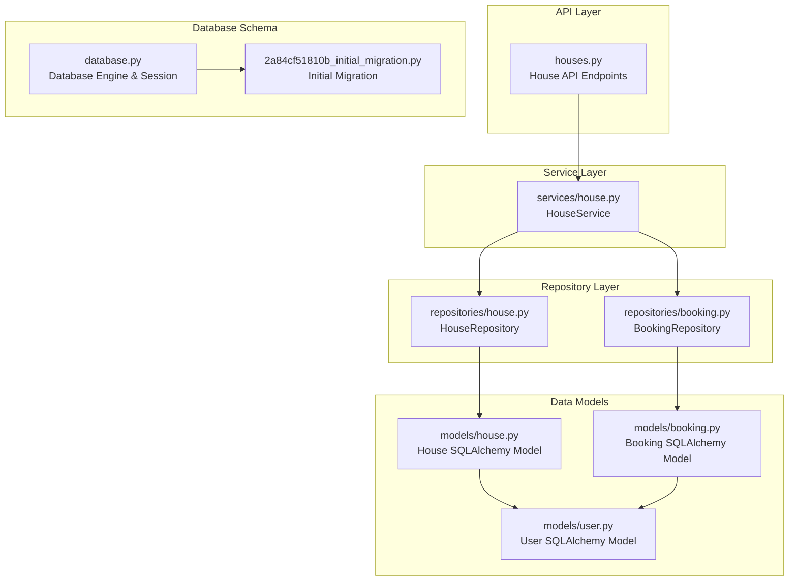
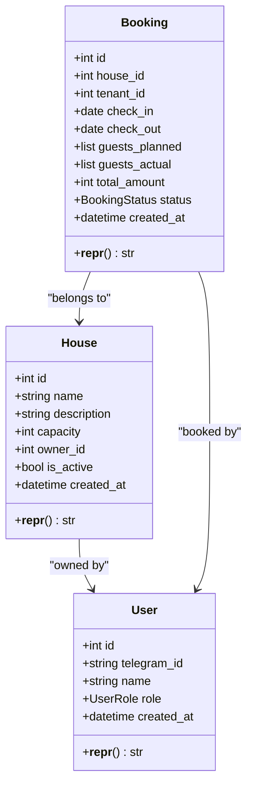
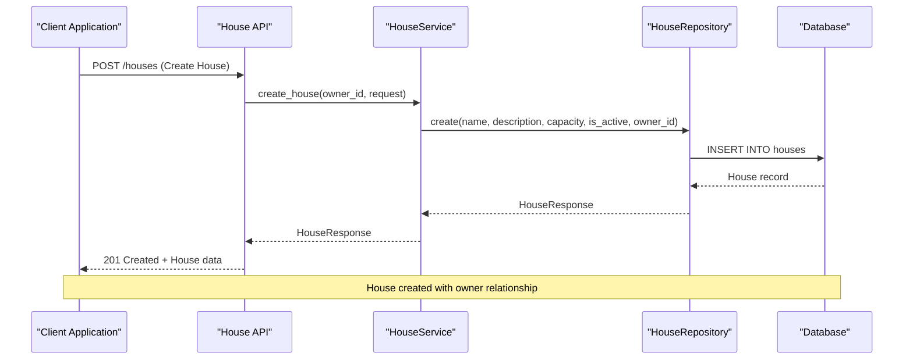
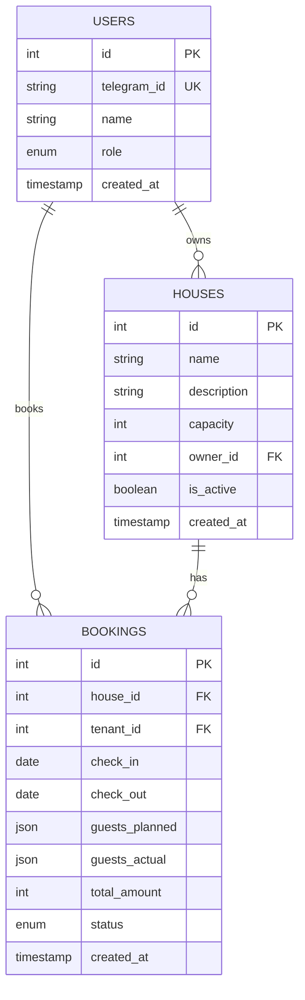
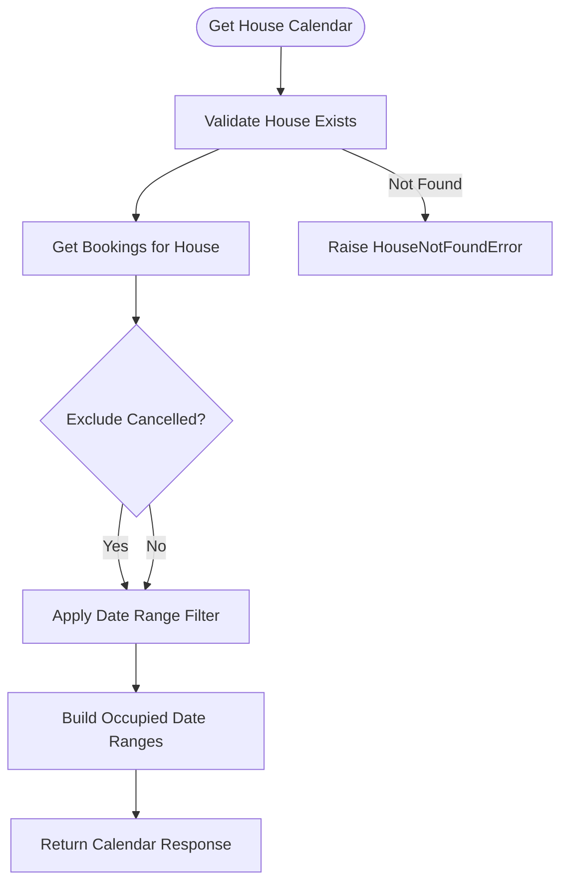
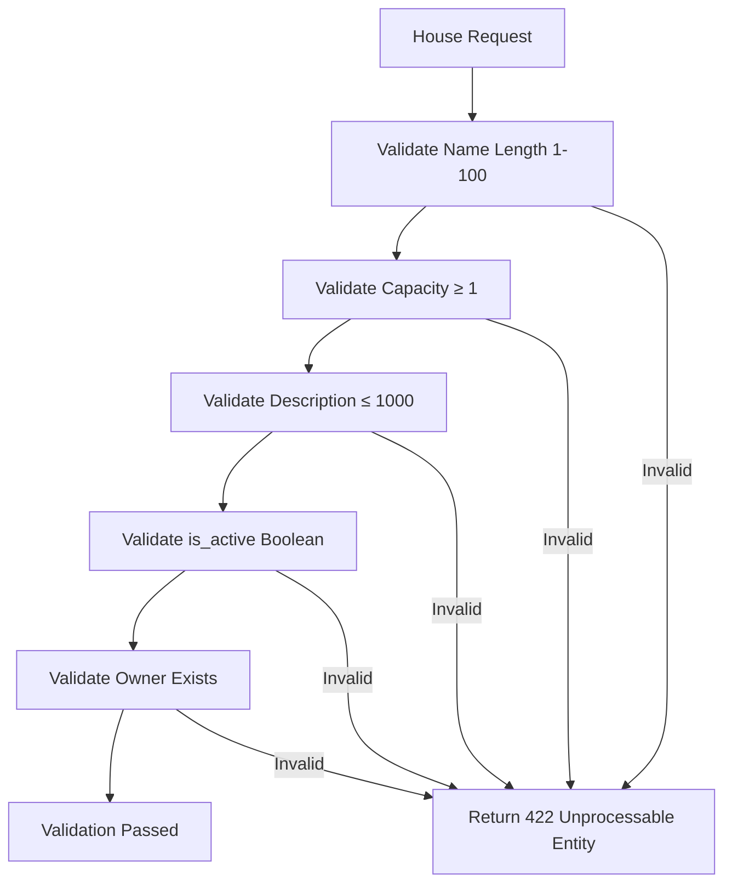
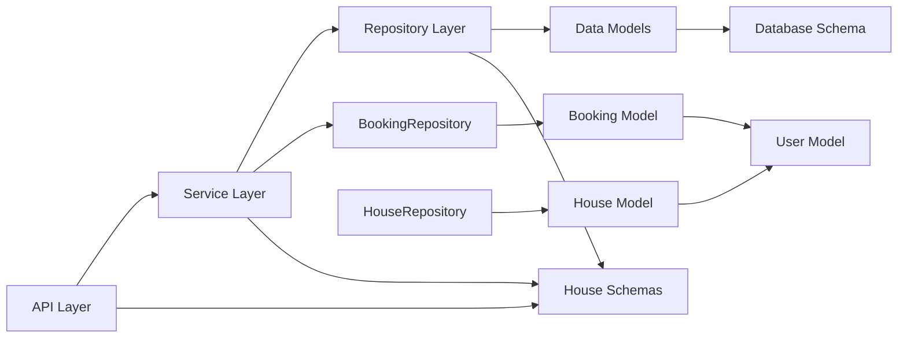

# Property and House Models

<cite>
**Referenced Files in This Document**
- [house.py](file://backend/models/house.py)
- [house.py](file://backend/schemas/house.py)
- [house.py](file://backend/repositories/house.py)
- [house.py](file://backend/services/house.py)
- [houses.py](file://backend/api/houses.py)
- [user.py](file://backend/models/user.py)
- [booking.py](file://backend/models/booking.py)
- [booking.py](file://backend/repositories/booking.py)
- [2a84cf51810b_initial_migration.py](file://alembic/versions/2a84cf51810b_initial_migration.py)
- [database.py](file://backend/database.py)
- [test_houses.py](file://backend/tests/test_houses.py)
</cite>

## Table of Contents
1. [Introduction](#introduction)
2. [Project Structure](#project-structure)
3. [Core Components](#core-components)
4. [Architecture Overview](#architecture-overview)
5. [Detailed Component Analysis](#detailed-component-analysis)
6. [Dependency Analysis](#dependency-analysis)
7. [Performance Considerations](#performance-considerations)
8. [Troubleshooting Guide](#troubleshooting-guide)
9. [Conclusion](#conclusion)

## Introduction
This document provides comprehensive data model documentation for the House entity representing rural properties in the system. It covers the house schema definition, relationships with users (owners), booking associations, and location-based queries. The documentation explains field definitions for property description, capacity management, availability settings, and property attributes. It also details validation rules for property data, capacity constraints, and geographic data handling, along with examples of house creation, availability checking, and property search operations.

## Project Structure
The house-related functionality is organized across multiple layers following a clean architecture pattern:

**Diagram sources**
- [houses.py:1-266](file://backend/api/houses.py#L1-L266)
- [house.py:51-70](file://backend/services/house.py#L51-L70)
- [house.py:12-22](file://backend/repositories/house.py#L12-L22)
- [booking.py:13-22](file://backend/repositories/booking.py#L13-L22)
- [house.py:9-24](file://backend/models/house.py#L9-L24)
- [user.py:19-32](file://backend/models/user.py#L19-L32)
- [booking.py:20-41](file://backend/models/booking.py#L20-L41)
- [2a84cf51810b_initial_migration.py:41-52](file://alembic/versions/2a84cf51810b_initial_migration.py#L41-L52)
- [database.py:8-23](file://backend/database.py#L8-L23)

**Section sources**
- [houses.py:1-266](file://backend/api/houses.py#L1-L266)
- [house.py:51-70](file://backend/services/house.py#L51-L70)
- [house.py:12-22](file://backend/repositories/house.py#L12-L22)
- [booking.py:13-22](file://backend/repositories/booking.py#L13-L22)
- [house.py:9-24](file://backend/models/house.py#L9-L24)
- [user.py:19-32](file://backend/models/user.py#L19-L32)
- [booking.py:20-41](file://backend/models/booking.py#L20-L41)
- [2a84cf51810b_initial_migration.py:41-52](file://alembic/versions/2a84cf51810b_initial_migration.py#L41-L52)
- [database.py:8-23](file://backend/database.py#L8-L23)

## Core Components

### House Data Model
The House entity represents rental properties with the following core attributes:

**Diagram sources**
- [house.py:9-24](file://backend/models/house.py#L9-L24)
- [user.py:19-32](file://backend/models/user.py#L19-L32)
- [booking.py:20-41](file://backend/models/booking.py#L20-L41)

### House Schema Definitions
The house schema defines validation rules and field constraints:

| Field | Type | Constraints | Description |
|-------|------|-------------|-------------|
| id | integer | primary key | Unique house identifier |
| name | string | 1-100 chars, required | House name/description |
| description | string | up to 1000 chars | Detailed property description |
| capacity | integer | ≥ 1, required | Maximum number of guests |
| owner_id | integer | foreign key, required | User ID of property owner |
| is_active | boolean | default: true | Availability for bookings |
| created_at | datetime | server default now() | Creation timestamp |

**Section sources**
- [house.py:14-21](file://backend/models/house.py#L14-L21)
- [house.py:12-27](file://backend/schemas/house.py#L12-L27)
- [2a84cf51810b_initial_migration.py:41-52](file://alembic/versions/2a84cf51810b_initial_migration.py#L41-L52)

## Architecture Overview
The house system follows a layered architecture with clear separation of concerns:

**Diagram sources**
- [houses.py:101-119](file://backend/api/houses.py#L101-L119)
- [house.py:71-91](file://backend/services/house.py#L71-L91)
- [house.py:23-53](file://backend/repositories/house.py#L23-L53)

**Section sources**
- [houses.py:101-119](file://backend/api/houses.py#L101-L119)
- [house.py:71-91](file://backend/services/house.py#L71-L91)
- [house.py:23-53](file://backend/repositories/house.py#L23-L53)

## Detailed Component Analysis

### House Entity Relationships
The house entity maintains relationships with users and bookings:

**Diagram sources**
- [2a84cf51810b_initial_migration.py:31-66](file://alembic/versions/2a84cf51810b_initial_migration.py#L31-L66)
- [user.py:24-28](file://backend/models/user.py#L24-L28)
- [house.py:14-18](file://backend/models/house.py#L14-L18)
- [booking.py:25-34](file://backend/models/booking.py#L25-L34)

### House Availability Calendar
The availability calendar system tracks booking conflicts:

**Diagram sources**
- [house.py:207-252](file://backend/services/house.py#L207-L252)
- [booking.py:199-223](file://backend/repositories/booking.py#L199-L223)

### Property Search and Filtering
The system supports comprehensive property search capabilities:

| Filter Parameter | Type | Description | Validation |
|------------------|------|-------------|------------|
| owner_id | integer | Filter by property owner | Optional |
| is_active | boolean | Filter by availability status | Optional |
| capacity_min | integer | Minimum guest capacity | ≥ 1 |
| capacity_max | integer | Maximum guest capacity | ≥ 1 |
| limit | integer | Results per page | 1-100 |
| offset | integer | Pagination offset | ≥ 0 |
| sort | string | Sort field (prefix - for desc) | Field must exist |

**Section sources**
- [house.py:76-94](file://backend/schemas/house.py#L76-L94)
- [house.py:68-127](file://backend/repositories/house.py#L68-L127)

### Validation Rules and Constraints
The system enforces strict validation rules:

**Diagram sources**
- [house.py:12-27](file://backend/schemas/house.py#L12-L27)
- [house.py:62-65](file://backend/schemas/house.py#L62-L65)

**Section sources**
- [house.py:12-27](file://backend/schemas/house.py#L12-L27)
- [house.py:62-65](file://backend/schemas/house.py#L62-L65)
- [test_houses.py:76-97](file://backend/tests/test_houses.py#L76-L97)

## Dependency Analysis

### Component Dependencies
The house system has the following dependency relationships:

**Diagram sources**
- [houses.py:9-16](file://backend/api/houses.py#L9-L16)
- [house.py:57-69](file://backend/services/house.py#L57-L69)
- [house.py:15-21](file://backend/repositories/house.py#L15-L21)
- [booking.py:16-22](file://backend/repositories/booking.py#L16-L22)

### External Dependencies
- SQLAlchemy 2.0 for ORM operations
- Pydantic for data validation
- FastAPI for API framework
- Alembic for database migrations
- asyncpg for PostgreSQL driver

**Section sources**
- [house.py:9-20](file://backend/services/house.py#L9-L20)
- [database.py:3-23](file://backend/database.py#L3-L23)

## Performance Considerations
The house system is designed with several performance optimizations:

### Database Indexing Strategy
- Primary key indexes on all main tables
- Foreign key indexes for relationship queries
- Composite indexes for common filter combinations
- Unique indexes for telegram_id and other unique fields

### Query Optimization
- Efficient pagination with OFFSET/LIMIT
- Selective field retrieval using Pydantic models
- Batch operations for bulk updates
- Connection pooling with async sessions

### Caching Opportunities
- Calendar data could benefit from caching
- Frequently accessed property lists
- User property ownership queries

## Troubleshooting Guide

### Common Issues and Solutions

#### House Not Found Errors
- **Symptom**: 404 Not Found when accessing house operations
- **Cause**: House ID doesn't exist in database
- **Solution**: Verify house ID exists or create the house first

#### Validation Failures (422 Unprocessable Entity)
- **Name Validation**: Must be 1-100 characters
- **Capacity Validation**: Must be ≥ 1
- **Description Validation**: Must be ≤ 1000 characters
- **Owner Validation**: Owner must exist in users table

#### Availability Conflicts
- **Symptom**: Calendar shows overlapping bookings
- **Cause**: Booking dates overlap with existing reservations
- **Solution**: Adjust booking dates or check property availability

**Section sources**
- [house.py:105-108](file://backend/services/house.py#L105-L108)
- [house.py:12-27](file://backend/schemas/house.py#L12-L27)
- [test_houses.py:76-97](file://backend/tests/test_houses.py#L76-L97)

## Conclusion
The House entity system provides a robust foundation for managing rural property listings with comprehensive validation, filtering, and availability tracking. The clean architecture ensures maintainability while the SQLAlchemy ORM provides efficient database operations. The system supports essential property lifecycle management including creation, updates, deletion, and availability monitoring through the integrated booking system.

Key strengths of the implementation include:
- Clear separation of concerns across architectural layers
- Comprehensive validation at both API and database levels
- Flexible filtering and pagination for property search
- Integrated availability calendar with booking conflict detection
- Strong typing with Pydantic schemas for reliable data handling

The system is well-positioned for extension with additional features like property photos, location-based queries, and advanced pricing calculations while maintaining its current architectural integrity.