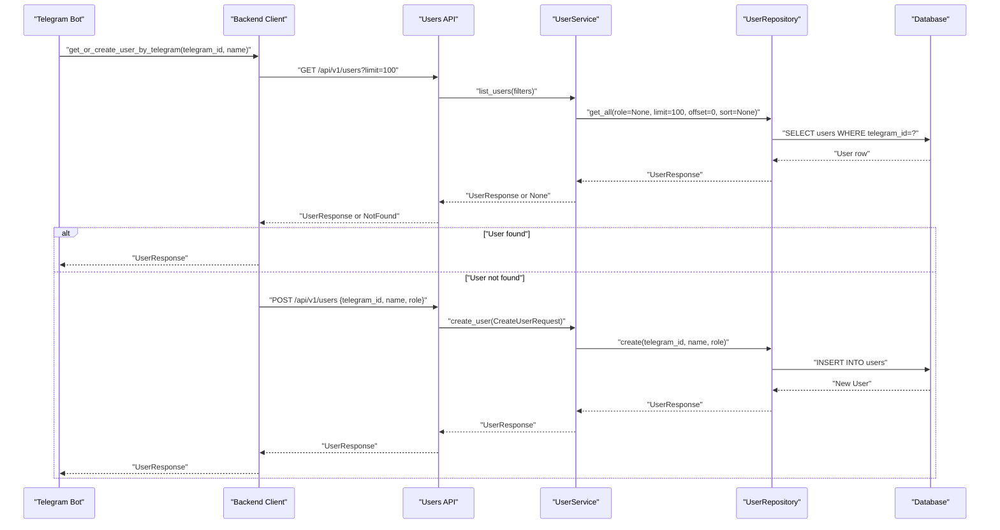
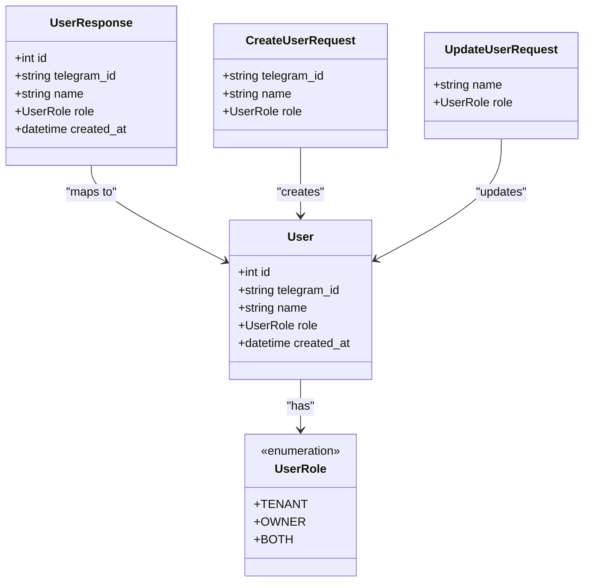
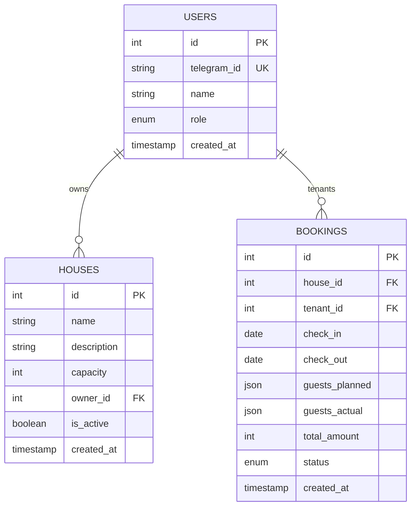
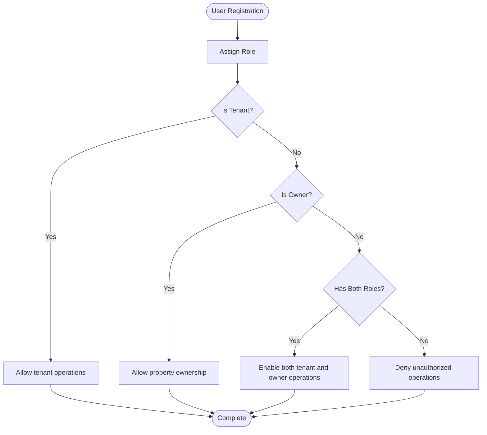
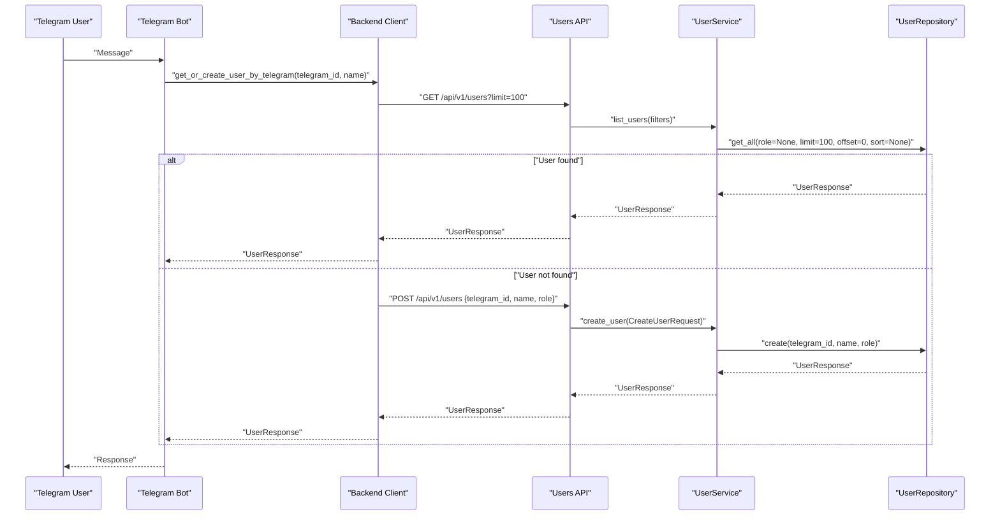
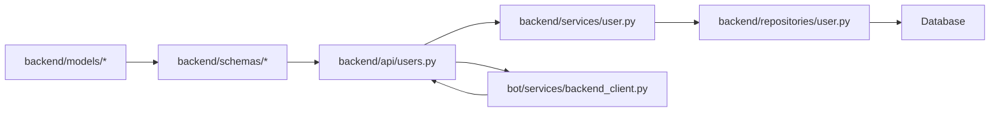

# User and Role Management Models

<cite>
**Referenced Files in This Document**
- [user.py](file://backend/models/user.py)
- [user.py](file://backend/schemas/user.py)
- [initial_migration.py](file://alembic/versions/2a84cf51810b_initial_migration.py)
- [user.py](file://backend/repositories/user.py)
- [user.py](file://backend/services/user.py)
- [users.py](file://backend/api/users.py)
- [message.py](file://bot/handlers/message.py)
- [backend_client.py](file://bot/services/backend_client.py)
- [test_users.py](file://backend/tests/test_users.py)
- [booking.py](file://backend/models/booking.py)
- [house.py](file://backend/models/house.py)
</cite>

## Table of Contents
1. [Introduction](#introduction)
2. [Project Structure](#project-structure)
3. [Core Components](#core-components)
4. [Architecture Overview](#architecture-overview)
5. [Detailed Component Analysis](#detailed-component-analysis)
6. [Dependency Analysis](#dependency-analysis)
7. [Performance Considerations](#performance-considerations)
8. [Troubleshooting Guide](#troubleshooting-guide)
9. [Conclusion](#conclusion)
10. [Appendices](#appendices)

## Introduction
This document provides comprehensive data model documentation for the User entity and role management system. It covers the User model structure, the UserRole enumeration, role-based access patterns, unique constraints, and the relationships between users and their bookings/property ownership. It also documents the user registration flow via Telegram, role assignment patterns, and dual-role scenarios (tenant and owner). Finally, it outlines field definitions, validation rules, indexing strategy, and practical examples for user creation, role updates, and query patterns.

## Project Structure
The User and role management system spans several layers:
- Data models define the User entity and related enumerations.
- Pydantic schemas define request/response validation and serialization.
- Alembic migrations define database schema and constraints.
- Repository encapsulates database operations.
- Service layer implements business logic for user operations.
- API endpoints expose CRUD operations and filtering.
- Bot integration handles Telegram-based user registration and retrieval.

```mermaid
graph TB
subgraph "Models"
M_User["User Model<br/>backend/models/user.py"]
M_Booking["Booking Model<br/>backend/models/booking.py"]
M_House["House Model<br/>backend/models/house.py"]
end
subgraph "Schemas"
S_User["User Schemas<br/>backend/schemas/user.py"]
end
subgraph "Migrations"
Mig["Initial Migration<br/>alembic/versions/.../initial_migration.py"]
end
subgraph "Repository"
Repo["User Repository<br/>backend/repositories/user.py"]
end
subgraph "Service"
Service["User Service<br/>backend/services/user.py"]
end
subgraph "API"
API["Users API<br/>backend/api/users.py"]
end
subgraph "Bot Integration"
Bot_Msg["Message Handler<br/>bot/handlers/message.py"]
Bot_Client["Backend Client<br/>bot/services/backend_client.py"]
end
M_User --> Repo
Repo --> Service
Service --> API
S_User --> API
API --> Bot_Client
Bot_Client --> API
M_House --> M_User
M_Booking --> M_User
Mig --> M_User
```

**Diagram sources**
- [user.py:19-31](file://backend/models/user.py#L19-L31)
- [user.py:10-72](file://backend/schemas/user.py#L10-L72)
- [initial_migration.py:31-40](file://alembic/versions/2a84cf51810b_initial_migration.py#L31-L40)
- [user.py:12-168](file://backend/repositories/user.py#L12-L168)
- [user.py:33-183](file://backend/services/user.py#L33-L183)
- [users.py:16-223](file://backend/api/users.py#L16-L223)
- [message.py:361-436](file://bot/handlers/message.py#L361-L436)
- [backend_client.py:124-152](file://bot/services/backend_client.py#L124-L152)
- [booking.py:20-41](file://backend/models/booking.py#L20-L41)
- [house.py:9-24](file://backend/models/house.py#L9-L24)

**Section sources**
- [user.py:1-32](file://backend/models/user.py#L1-L32)
- [user.py:1-72](file://backend/schemas/user.py#L1-L72)
- [initial_migration.py:31-40](file://alembic/versions/2a84cf51810b_initial_migration.py#L31-L40)
- [user.py:12-168](file://backend/repositories/user.py#L12-L168)
- [user.py:33-183](file://backend/services/user.py#L33-L183)
- [users.py:16-223](file://backend/api/users.py#L16-L223)
- [message.py:361-436](file://bot/handlers/message.py#L361-L436)
- [backend_client.py:124-152](file://bot/services/backend_client.py#L124-L152)
- [booking.py:20-41](file://backend/models/booking.py#L20-L41)
- [house.py:9-24](file://backend/models/house.py#L9-L24)

## Core Components
- User model: Defines the persistent representation of users with telegram_id, name, role, and timestamps.
- UserRole enum: Enumerates allowed roles (tenant, owner, both) used for role-based access control.
- Pydantic schemas: Define validation rules for user creation, updates, and filtering.
- Repository: Encapsulates database operations for user CRUD and filtering.
- Service: Implements business logic for user operations and integrates with repository.
- API: Exposes endpoints for user management with pagination, filtering, and sorting.
- Bot integration: Provides Telegram-based user registration and retrieval.

Key attributes and constraints:
- Unique constraints: telegram_id is unique and indexed.
- Indexes: id and telegram_id are indexed for efficient lookups.
- Default values: role defaults to tenant; created_at uses server-side defaults.
- Relationships: Users own properties (houses) and participate as tenants in bookings.

**Section sources**
- [user.py:19-31](file://backend/models/user.py#L19-L31)
- [user.py:10-72](file://backend/schemas/user.py#L10-L72)
- [initial_migration.py:31-40](file://alembic/versions/2a84cf51810b_initial_migration.py#L31-L40)
- [user.py:12-168](file://backend/repositories/user.py#L12-L168)
- [user.py:33-183](file://backend/services/user.py#L33-L183)
- [users.py:16-223](file://backend/api/users.py#L16-L223)

## Architecture Overview
The system follows a layered architecture:
- Presentation layer: FastAPI routes for user management.
- Business logic layer: UserService orchestrating operations.
- Data access layer: UserRepository performing SQL operations.
- Persistence layer: SQLAlchemy models mapped to database tables.
- Integration layer: Bot communicates with backend via HTTP client.



**Diagram sources**
- [message.py:361-414](file://bot/handlers/message.py#L361-L414)
- [backend_client.py:137-152](file://bot/services/backend_client.py#L137-L152)
- [users.py:19-50](file://backend/api/users.py#L19-L50)
- [user.py:93-110](file://backend/services/user.py#L93-L110)
- [user.py:73-120](file://backend/repositories/user.py#L73-L120)

## Detailed Component Analysis

### User Model and Schema
- Model fields:
  - id: integer, primary key, indexed.
  - telegram_id: string, unique, indexed, not null.
  - name: string up to 100 chars, not null.
  - role: enum (tenant, owner, both), not null, default tenant.
  - created_at: datetime with timezone, server default.
- Pydantic validation:
  - name length constraints (min/max).
  - role constrained to enum values.
  - Optional telegram_id in request schema for creation.
  - Filtering supports role, pagination, and sorting.



**Diagram sources**
- [user.py:19-31](file://backend/models/user.py#L19-L31)
- [user.py:10-72](file://backend/schemas/user.py#L10-L72)

**Section sources**
- [user.py:19-31](file://backend/models/user.py#L19-L31)
- [user.py:18-72](file://backend/schemas/user.py#L18-L72)

### Database Schema and Constraints
- Table: users
  - Columns: id, telegram_id, name, role, created_at.
  - Unique constraint: telegram_id.
  - Indexes: id, telegram_id.
  - Enum type: userrole with values tenant, owner, both.
- Relationships:
  - Houses.owner_id references users.id.
  - Bookings.tenant_id references users.id.



**Diagram sources**
- [initial_migration.py:31-51](file://alembic/versions/2a84cf51810b_initial_migration.py#L31-L51)
- [house.py:14-20](file://backend/models/house.py#L14-L20)
- [booking.py:25-34](file://backend/models/booking.py#L25-L34)

**Section sources**
- [initial_migration.py:31-51](file://alembic/versions/2a84cf51810b_initial_migration.py#L31-L51)
- [house.py:9-24](file://backend/models/house.py#L9-L24)
- [booking.py:20-41](file://backend/models/booking.py#L20-L41)

### Role-Based Access Control and Business Logic
- Role enumeration: tenant, owner, both.
- Default role: tenant.
- Validation: role values are validated against enum in both models and schemas.
- Relationships:
  - Owner role implies property ownership via houses.owner_id.
  - Tenant role implies participation in bookings via bookings.tenant_id.
- Dual-role scenario: a user can have both roles, enabling them to own properties and book others.



**Diagram sources**
- [user.py:11-16](file://backend/models/user.py#L11-L16)
- [user.py:10-16](file://backend/schemas/user.py#L10-L16)
- [house.py:18-20](file://backend/models/house.py#L18-L20)
- [booking.py:27-34](file://backend/models/booking.py#L27-L34)

**Section sources**
- [user.py:11-16](file://backend/models/user.py#L11-L16)
- [user.py:10-16](file://backend/schemas/user.py#L10-L16)
- [house.py:18-20](file://backend/models/house.py#L18-L20)
- [booking.py:27-34](file://backend/models/booking.py#L27-L34)

### User Registration Flow (Telegram)
- Bot receives a message from a user.
- Bot attempts to get or create a user via backend client.
- Backend client searches users by telegram_id; if not found, creates a new user.
- Backend API validates input, persists user, and returns response.
- Bot displays user’s bookings or responds accordingly.



**Diagram sources**
- [message.py:361-414](file://bot/handlers/message.py#L361-L414)
- [backend_client.py:137-152](file://bot/services/backend_client.py#L137-L152)
- [users.py:85-116](file://backend/api/users.py#L85-L116)
- [user.py:50-63](file://backend/services/user.py#L50-L63)
- [user.py:23-44](file://backend/repositories/user.py#L23-L44)

**Section sources**
- [message.py:361-414](file://bot/handlers/message.py#L361-L414)
- [backend_client.py:137-152](file://bot/services/backend_client.py#L137-L152)
- [users.py:85-116](file://backend/api/users.py#L85-L116)
- [user.py:50-63](file://backend/services/user.py#L50-L63)
- [user.py:23-44](file://backend/repositories/user.py#L23-L44)

### User Management Operations and Query Patterns
- Create user:
  - Endpoint: POST /api/v1/users
  - Request: CreateUserRequest with telegram_id, name, optional role (default tenant)
  - Response: UserResponse with generated id and timestamps
- Retrieve user:
  - Endpoint: GET /api/v1/users/{user_id}
  - Response: UserResponse
- List users:
  - Endpoint: GET /api/v1/users
  - Query params: limit (1–100), offset (>=0), sort (field or -field), role (tenant/owner/both)
  - Response: PaginatedResponse[UserResponse]
- Partial update:
  - Endpoint: PATCH /api/v1/users/{user_id}
  - Request: UpdateUserRequest with optional name and role
  - Response: UserResponse
- Full replace:
  - Endpoint: PUT /api/v1/users/{user_id}
  - Request: CreateUserRequest with all fields
  - Response: UserResponse
- Delete user:
  - Endpoint: DELETE /api/v1/users/{user_id}
  - Response: 204 No Content

Examples (paths only):
- Create user: [users.py:85-116](file://backend/api/users.py#L85-L116)
- List users: [users.py:19-50](file://backend/api/users.py#L19-L50)
- Partial update: [users.py:156-194](file://backend/api/users.py#L156-L194)
- Full replace: [users.py:118-154](file://backend/api/users.py#L118-L154)
- Delete user: [users.py:196-223](file://backend/api/users.py#L196-L223)

**Section sources**
- [users.py:19-223](file://backend/api/users.py#L19-L223)
- [user.py:38-72](file://backend/schemas/user.py#L38-L72)
- [user.py:23-168](file://backend/repositories/user.py#L23-L168)
- [user.py:50-183](file://backend/services/user.py#L50-L183)

## Dependency Analysis
- Models depend on SQLAlchemy Base and enum types.
- Schemas depend on Pydantic BaseModel and enum types.
- Repository depends on SQLAlchemy select and async sessions.
- Service depends on repository and raises domain-specific errors.
- API depends on schemas and service.
- Bot client depends on HTTPX and settings.
- Database constraints enforced by Alembic migrations.



**Diagram sources**
- [user.py:1-32](file://backend/models/user.py#L1-L32)
- [user.py:1-72](file://backend/schemas/user.py#L1-L72)
- [users.py:1-223](file://backend/api/users.py#L1-L223)
- [user.py:1-183](file://backend/services/user.py#L1-L183)
- [user.py:1-168](file://backend/repositories/user.py#L1-L168)
- [backend_client.py:1-244](file://bot/services/backend_client.py#L1-L244)

**Section sources**
- [user.py:1-32](file://backend/models/user.py#L1-L32)
- [user.py:1-72](file://backend/schemas/user.py#L1-L72)
- [users.py:1-223](file://backend/api/users.py#L1-L223)
- [user.py:1-183](file://backend/services/user.py#L1-L183)
- [user.py:1-168](file://backend/repositories/user.py#L1-L168)
- [backend_client.py:1-244](file://bot/services/backend_client.py#L1-L244)

## Performance Considerations
- Indexes:
  - Primary key index on id.
  - Unique index on telegram_id for O(1) lookup by telegram_id.
- Pagination and sorting:
  - Use limit/offset for scalable lists.
  - Sorting applies to selected fields; ensure appropriate indexes for frequently sorted columns.
- Enum storage:
  - Enum values stored as strings; keep enum small and stable.
- Relationship joins:
  - Queries involving houses and bookings should leverage foreign key indexes.

[No sources needed since this section provides general guidance]

## Troubleshooting Guide
Common issues and resolutions:
- Duplicate telegram_id:
  - Symptom: IntegrityError on insert/update.
  - Resolution: Ensure unique telegram_id; backend enforces uniqueness.
- Invalid role value:
  - Symptom: 422 validation error.
  - Resolution: Use allowed values: tenant, owner, both.
- User not found:
  - Symptom: 404 Not Found.
  - Resolution: Verify user_id or telegram_id; ensure user exists.
- Pagination limits:
  - Symptom: Unexpected results.
  - Resolution: Respect limit bounds (1–100) and offset semantics.

**Section sources**
- [initial_migration.py:31-40](file://alembic/versions/2a84cf51810b_initial_migration.py#L31-L40)
- [user.py:10-16](file://backend/schemas/user.py#L10-L16)
- [users.py:66-82](file://backend/api/users.py#L66-L82)
- [users.py:19-50](file://backend/api/users.py#L19-L50)

## Conclusion
The User and role management system provides a robust foundation for tenant and owner operations. The User model, combined with the UserRole enum and strict validation, ensures consistent role-based access control. Unique constraints on telegram_id and appropriate indexing support efficient lookups. The layered architecture separates concerns effectively, while the Telegram bot integration streamlines user registration and retrieval. The provided query patterns and examples enable reliable user management across the application.

## Appendices

### Field Definitions and Validation Rules
- telegram_id: string, unique, indexed, required for creation.
- name: string, 1–100 chars, required.
- role: enum (tenant, owner, both), default tenant, required.
- created_at: datetime with timezone, server default.

Validation rules:
- Pydantic constraints enforce min/max lengths and enum membership.
- API endpoints validate inputs and return structured errors.

**Section sources**
- [user.py:24-29](file://backend/models/user.py#L24-L29)
- [user.py:21-22](file://backend/schemas/user.py#L21-L22)
- [user.py:44-44](file://backend/schemas/user.py#L44-L44)
- [user.py:53-54](file://backend/schemas/user.py#L53-L54)

### Indexing Strategy
- users.id: primary key index.
- users.telegram_id: unique index.
- Additional indexes: ix_users_id, ix_users_telegram_id.

**Section sources**
- [initial_migration.py:39-40](file://alembic/versions/2a84cf51810b_initial_migration.py#L39-L40)

### Examples of User Creation, Role Updates, and Query Patterns
- Create user:
  - Endpoint: POST /api/v1/users
  - Example payload: { telegram_id, name, role }
  - Reference: [users.py:85-116](file://backend/api/users.py#L85-L116)
- Update role:
  - Endpoint: PATCH /api/v1/users/{user_id}
  - Example payload: { role }
  - Reference: [users.py:156-194](file://backend/api/users.py#L156-L194)
- List users with filters:
  - Endpoint: GET /api/v1/users
  - Example query: ?role=tenant&limit=20&offset=0&sort=-created_at
  - Reference: [users.py:19-50](file://backend/api/users.py#L19-L50)
- Tests demonstrating behavior:
  - [test_users.py:6-93](file://backend/tests/test_users.py#L6-L93)
  - [test_users.py:126-237](file://backend/tests/test_users.py#L126-L237)
  - [test_users.py:239-314](file://backend/tests/test_users.py#L239-L314)
  - [test_users.py:316-358](file://backend/tests/test_users.py#L316-L358)

**Section sources**
- [users.py:19-223](file://backend/api/users.py#L19-L223)
- [test_users.py:6-386](file://backend/tests/test_users.py#L6-L386)