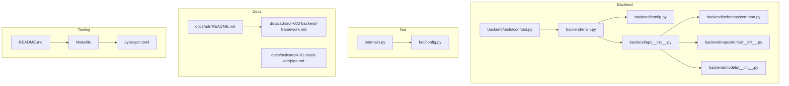
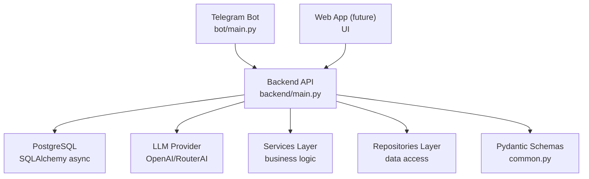
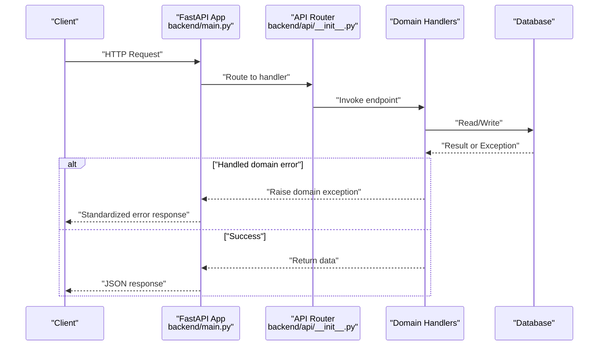
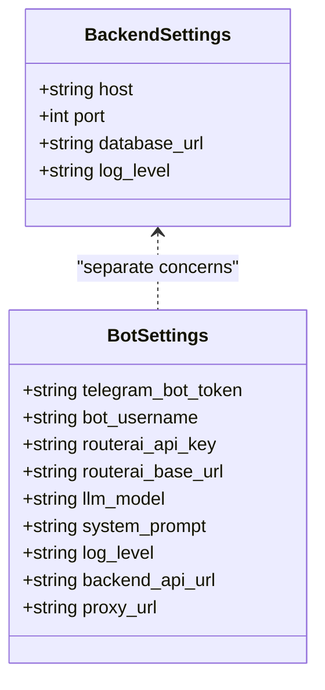
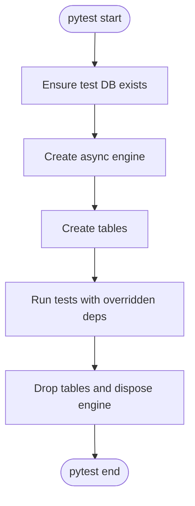
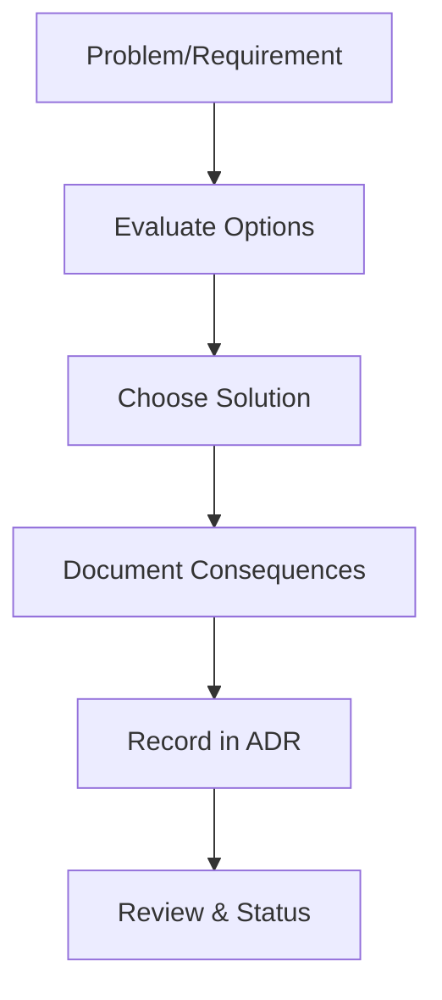
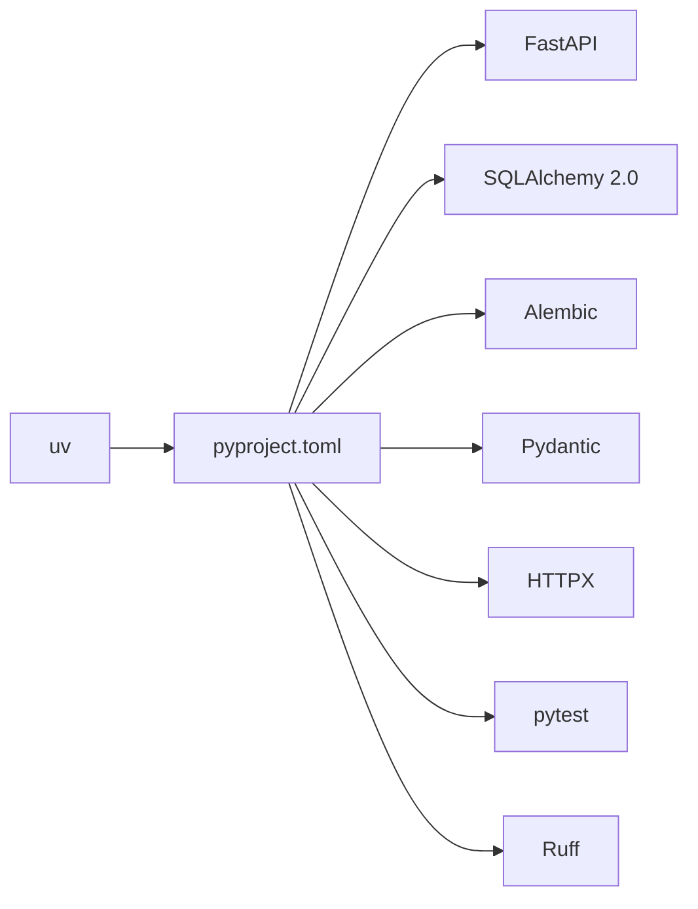

# Development Guidelines and Standards

<cite>
**Referenced Files in This Document**
- [README.md](file://README.md)
- [pyproject.toml](file://pyproject.toml)
- [Makefile](file://Makefile)
- [backend/main.py](file://backend/main.py)
- [backend/config.py](file://backend/config.py)
- [backend/api/__init__.py](file://backend/api/__init__.py)
- [backend/schemas/common.py](file://backend/schemas/common.py)
- [backend/repositories/__init__.py](file://backend/repositories/__init__.py)
- [backend/models/__init__.py](file://backend/models/__init__.py)
- [backend/tests/conftest.py](file://backend/tests/conftest.py)
- [bot/main.py](file://bot/main.py)
- [bot/config.py](file://bot/config.py)
- [docs/adr/README.md](file://docs/adr/README.md)
- [docs/adr/adr-002-backend-framework.md](file://docs/adr/adr-002-backend-framework.md)
- [docs/tasks/task-01-stack-adr/plan.md](file://docs/tasks/task-01-stack-adr/plan.md)
</cite>

## Table of Contents
1. [Introduction](#introduction)
2. [Project Structure](#project-structure)
3. [Core Components](#core-components)
4. [Architecture Overview](#architecture-overview)
5. [Detailed Component Analysis](#detailed-component-analysis)
6. [Dependency Analysis](#dependency-analysis)
7. [Performance Considerations](#performance-considerations)
8. [Troubleshooting Guide](#troubleshooting-guide)
9. [Conclusion](#conclusion)
10. [Appendices](#appendices)

## Introduction
This document defines development guidelines and standards for the fullstack homestation project. It consolidates coding practices, project organization, architectural decision records (ADRs), and development workflows used across the backend, bot, and documentation layers. It also provides practical examples for code organization, commit messaging, pull requests, task management, and quality assurance, ensuring both beginners and experienced contributors can follow consistent patterns.

## Project Structure
The repository follows a clear separation of concerns:
- Backend: FastAPI application with layered architecture (API, schemas, models, services, repositories, tests).
- Bot: Telegram bot built with Aiogram, integrating with the backend via HTTP and an LLM service.
- Docs: ADRs and task artifacts that formalize decisions and track progress.
- Tooling: Makefile targets, Ruff for linting/formatting, Pydantic settings, and Docker Compose for local orchestration.

**Diagram sources**
- [backend/main.py:1-173](file://backend/main.py#L1-L173)
- [backend/config.py:1-25](file://backend/config.py#L1-L25)
- [backend/api/__init__.py:1-15](file://backend/api/__init__.py#L1-L15)
- [backend/schemas/common.py:1-43](file://backend/schemas/common.py#L1-L43)
- [backend/repositories/__init__.py:1-6](file://backend/repositories/__init__.py#L1-L6)
- [backend/models/__init__.py:1-16](file://backend/models/__init__.py#L1-L16)
- [backend/tests/conftest.py:1-150](file://backend/tests/conftest.py#L1-L150)
- [bot/main.py:1-46](file://bot/main.py#L1-L46)
- [bot/config.py:1-67](file://bot/config.py#L1-L67)
- [docs/adr/README.md:1-46](file://docs/adr/README.md#L1-L46)
- [docs/adr/adr-002-backend-framework.md:1-148](file://docs/adr/adr-002-backend-framework.md#L1-L148)
- [docs/tasks/task-01-stack-adr/plan.md:1-130](file://docs/tasks/task-01-stack-adr/plan.md#L1-L130)
- [Makefile:1-71](file://Makefile#L1-L71)
- [pyproject.toml:1-32](file://pyproject.toml#L1-L32)
- [README.md:1-133](file://README.md#L1-L133)

**Section sources**
- [README.md:1-133](file://README.md#L1-L133)
- [Makefile:1-71](file://Makefile#L1-L71)
- [pyproject.toml:1-32](file://pyproject.toml#L1-L32)

## Core Components
- Backend application entrypoint initializes FastAPI, registers routers, sets up CORS, and registers domain-specific exception handlers. It exposes a health endpoint and a standardized error response format.
- Configuration is centralized via Pydantic settings for both backend and bot, enabling environment-driven behavior and optional proxy configuration.
- API composition aggregates route modules under a single router with a versioned prefix.
- Shared schemas define a consistent error and pagination response format across endpoints.
- Tests leverage an async test database, dependency overrides, and fixtures to isolate and streamline integration tests.

Key implementation references:
- Application lifecycle and exception handling: [backend/main.py:31-166](file://backend/main.py#L31-L166)
- Backend settings: [backend/config.py:4-24](file://backend/config.py#L4-L24)
- API router composition: [backend/api/__init__.py:9-14](file://backend/api/__init__.py#L9-L14)
- Common response schemas: [backend/schemas/common.py:16-43](file://backend/schemas/common.py#L16-L43)
- Test fixtures and async database setup: [backend/tests/conftest.py:41-93](file://backend/tests/conftest.py#L41-L93)

**Section sources**
- [backend/main.py:1-173](file://backend/main.py#L1-L173)
- [backend/config.py:1-25](file://backend/config.py#L1-L25)
- [backend/api/__init__.py:1-15](file://backend/api/__init__.py#L1-L15)
- [backend/schemas/common.py:1-43](file://backend/schemas/common.py#L1-L43)
- [backend/tests/conftest.py:1-150](file://backend/tests/conftest.py#L1-L150)

## Architecture Overview
The system is designed as a backend-first architecture:
- Telegram bot is the primary user interface.
- Backend API serves as the central business logic hub and integrates with external LLM providers.
- Database persists entities for users, houses, tariffs, and bookings.
- Web application will integrate with the same backend API in future stages.

**Diagram sources**
- [README.md:11-20](file://README.md#L11-L20)
- [backend/main.py:1-173](file://backend/main.py#L1-L173)
- [bot/main.py:1-46](file://bot/main.py#L1-L46)
- [backend/schemas/common.py:1-43](file://backend/schemas/common.py#L1-L43)

## Detailed Component Analysis

### Backend Application Lifecycle and Error Handling
The backend application defines:
- Lifespan hooks for startup/shutdown logging.
- CORS configuration for flexible client access.
- Centralized exception handlers for domain-specific errors and a global fallback.
- Health endpoint for operational checks.

**Diagram sources**
- [backend/main.py:62-166](file://backend/main.py#L62-L166)
- [backend/api/__init__.py:1-15](file://backend/api/__init__.py#L1-L15)

**Section sources**
- [backend/main.py:31-166](file://backend/main.py#L31-L166)
- [backend/api/__init__.py:1-15](file://backend/api/__init__.py#L1-L15)

### Configuration Management
Both backend and bot use Pydantic settings to load environment variables:
- Backend settings include server host/port, database URL placeholder, and logging level.
- Bot settings include Telegram token, LLM provider credentials, system prompt, optional proxy, and backend API URL.

**Diagram sources**
- [backend/config.py:4-24](file://backend/config.py#L4-L24)
- [bot/config.py:44-66](file://bot/config.py#L44-L66)

**Section sources**
- [backend/config.py:1-25](file://backend/config.py#L1-L25)
- [bot/config.py:1-67](file://bot/config.py#L1-L67)

### Testing Strategy and Async Fixtures
The test suite:
- Creates a dedicated test database and ensures its existence before running tests.
- Uses async SQLAlchemy engine/session factories to manage schema creation/drop and transaction rollbacks.
- Overrides the application’s database dependency during tests to inject the test session.
- Provides reusable fixtures for creating test users, houses, and tariffs via the API.

**Diagram sources**
- [backend/tests/conftest.py:23-61](file://backend/tests/conftest.py#L23-L61)

**Section sources**
- [backend/tests/conftest.py:1-150](file://backend/tests/conftest.py#L1-L150)

### Architectural Decision Records (ADRs)
The project maintains ADRs to document significant architectural choices:
- ADR-002 documents the selection of FastAPI as the backend framework, rationale, structure, and dependencies.
- ADR registry defines process, statuses, and template for ADRs.

**Diagram sources**
- [docs/adr/README.md:1-46](file://docs/adr/README.md#L1-L46)
- [docs/adr/adr-002-backend-framework.md:1-148](file://docs/adr/adr-002-backend-framework.md#L1-L148)

**Section sources**
- [docs/adr/README.md:1-46](file://docs/adr/README.md#L1-L46)
- [docs/adr/adr-002-backend-framework.md:1-148](file://docs/adr/adr-002-backend-framework.md#L1-L148)

### Task Management and Workflow
Tasks are documented with plans and summaries, including:
- Definition of done, artifacts, dependencies, and self-checks.
- References to workflow templates and tasklist templates.

Practical example references:
- Task 01 stack and ADR plan: [docs/tasks/task-01-stack-adr/plan.md:1-130](file://docs/tasks/task-01-stack-adr/plan.md#L1-L130)

**Section sources**
- [docs/tasks/task-01-stack-adr/plan.md:1-130](file://docs/tasks/task-01-stack-adr/plan.md#L1-L130)

## Dependency Analysis
The project’s toolchain and runtime dependencies are declared centrally:
- Python 3.12+ with uv for dependency management.
- FastAPI, Uvicorn, SQLAlchemy 2.0 (async), Alembic, Pydantic, HTTPX, pytest, Ruff, and others.
- Dev dependencies include linters and testing utilities.

**Diagram sources**
- [pyproject.toml:1-32](file://pyproject.toml#L1-L32)

**Section sources**
- [pyproject.toml:1-32](file://pyproject.toml#L1-L32)

## Performance Considerations
- Prefer async patterns for I/O-bound operations (database, HTTP clients, LLM integrations).
- Use dependency overrides in tests to minimize I/O overhead and ensure deterministic runs.
- Keep exception handlers centralized to avoid redundant error handling logic and maintain consistent responses.
- Leverage structured logging with configurable levels to balance observability and performance.

## Troubleshooting Guide
Common issues and resolutions:
- Health check failures: Verify backend is running and reachable; confirm the health endpoint responds.
- Database connectivity: Ensure PostgreSQL is up and migrations applied; check environment variables for database URL.
- Linting/formatting errors: Run the provided Makefile targets to check and fix style issues.
- Test flakiness: Confirm test database initialization and dependency overrides are active; ensure sessions are rolled back after tests.

Operational references:
- Health endpoint and exception handling: [backend/main.py:62-166](file://backend/main.py#L62-L166)
- Makefile targets for backend, database, linting, formatting, and testing: [Makefile:1-71](file://Makefile#L1-L71)
- Environment setup and quick start: [README.md:41-133](file://README.md#L41-L133)

**Section sources**
- [backend/main.py:62-166](file://backend/main.py#L62-L166)
- [Makefile:1-71](file://Makefile#L1-L71)
- [README.md:41-133](file://README.md#L41-L133)

## Conclusion
This document consolidates the project’s development practices, architecture, and operational standards. By following the outlined patterns—layered backend design, Pydantic-driven configuration, standardized error responses, robust testing with async fixtures, and ADR-based decision-making—you can contribute effectively while maintaining consistency and quality across the codebase.

## Appendices

### Coding Standards and Formatting
- Use Ruff for linting and formatting across the repository.
- Adhere to line length limits and target Python version as configured in the project settings.
- Keep imports organized and module boundaries clear.

References:
- Lint/format targets: [Makefile:10-14](file://Makefile#L10-L14)
- Ruff configuration: [pyproject.toml:29-32](file://pyproject.toml#L29-L32)

**Section sources**
- [Makefile:10-14](file://Makefile#L10-L14)
- [pyproject.toml:29-32](file://pyproject.toml#L29-L32)

### Commit Message Standards
Recommended structure for commits:
- Type: feat, fix, chore, docs, refactor, test, perf, build, ci, revert
- Scope: module or subsystem (e.g., backend, bot, docs)
- Subject: concise imperative description of changes
- Body: optional contextual details and rationale
- Footer: references to issues or ADRs

Example:
- feat(backend): add standardized error response schema
- fix(bot): resolve proxy configuration for HTTP session
- docs(adrs): update ADR-002 with dependency versions

### Pull Request Process
- Branch naming: feature/<issue>, fix/<issue>, docs/<area>
- PR checklist:
  - Includes unit/integration tests
  - Passes linting and formatting
  - Updates docs/adrs if architecture changes
  - Adds changelog entries if applicable
- Review: ensure clear descriptions, test coverage, and adherence to patterns

### Development Workflow and Task Management
- Use task plans and summaries to track progress and acceptance criteria.
- Link tasks to ADRs and conventions for traceability.
- Maintain a tasklist for prioritization and visibility.

References:
- Task plan example: [docs/tasks/task-01-stack-adr/plan.md:1-130](file://docs/tasks/task-01-stack-adr/plan.md#L1-L130)
- ADR registry and template: [docs/adr/README.md:1-46](file://docs/adr/README.md#L1-L46), [docs/adr/adr-002-backend-framework.md:19-45](file://docs/adr/adr-002-backend-framework.md#L19-L45)

### Quality Assurance Practices
- Run backend tests with coverage reporting using the provided Makefile target.
- Apply database migrations before starting backend services.
- Use Docker Compose to orchestrate backend, database, and related services for local development.

References:
- Test and coverage target: [Makefile:50-54](file://Makefile#L50-L54)
- Migration commands: [Makefile:57-64](file://Makefile#L57-L64)
- Local setup steps: [README.md:59-80](file://README.md#L59-L80)