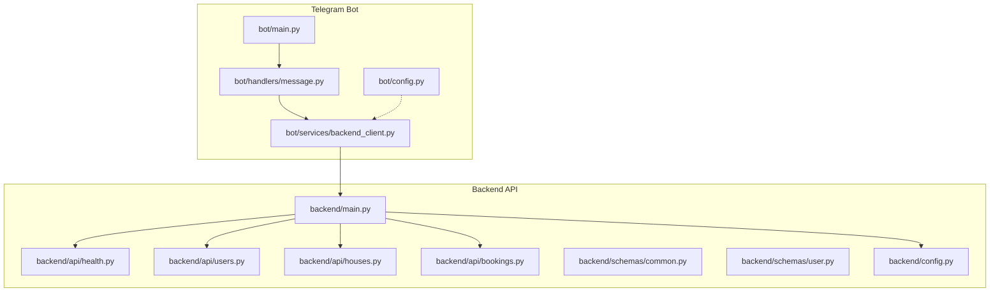
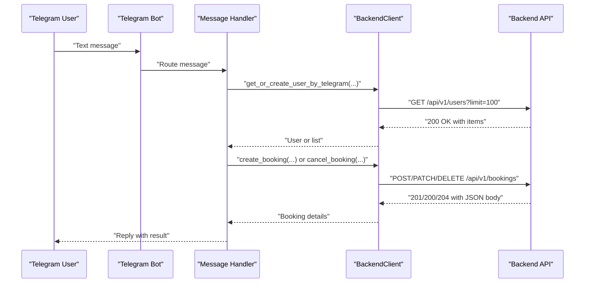
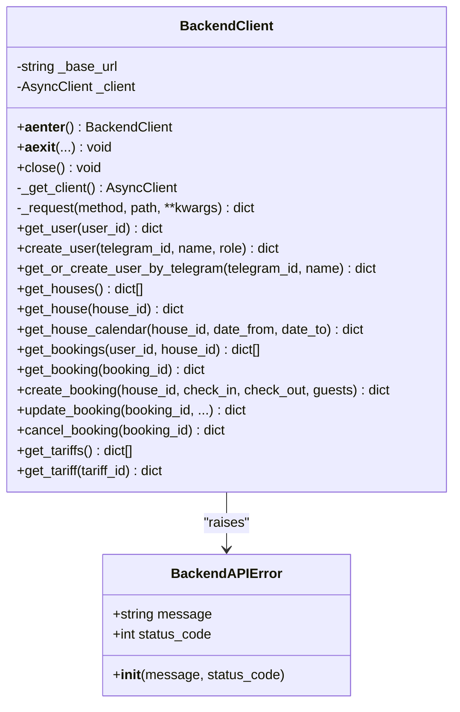
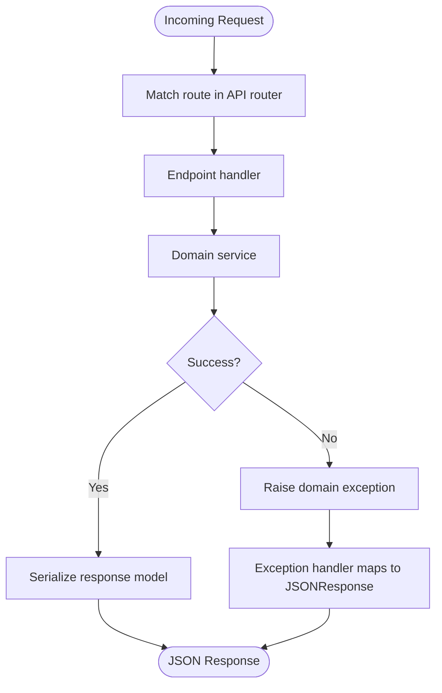
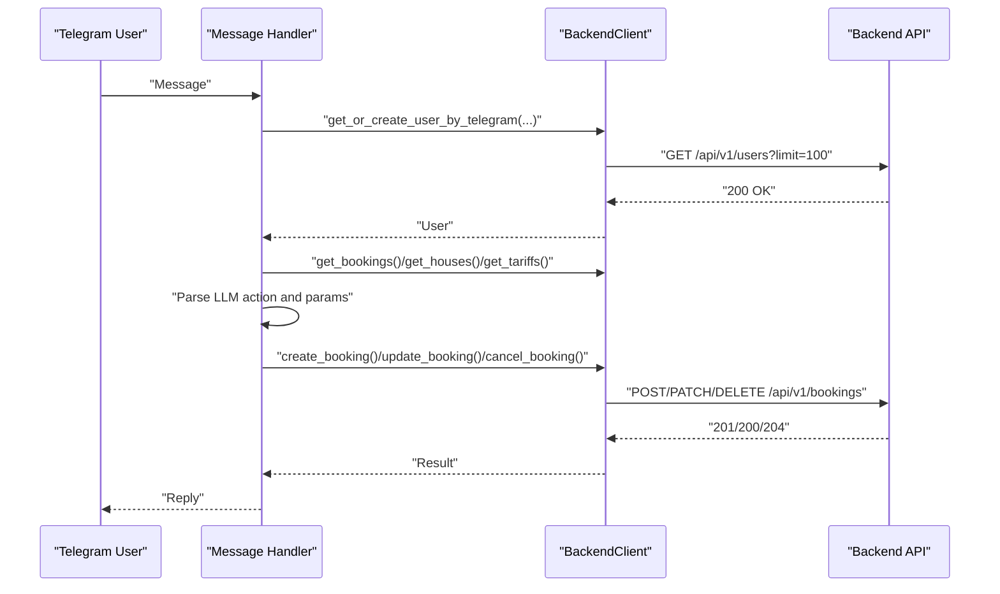
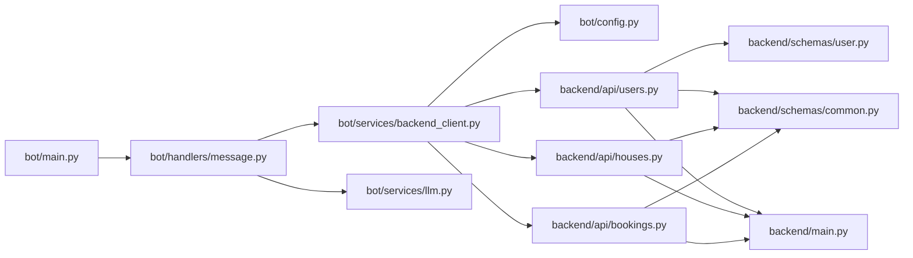

# Backend Service Communication

<cite>
**Referenced Files in This Document**
- [backend_client.py](file://bot/services/backend_client.py)
- [message.py](file://bot/handlers/message.py)
- [main.py](file://backend/main.py)
- [config.py](file://bot/config.py)
- [config.py](file://backend/config.py)
- [integrations.md](file://docs/integrations.md)
- [health.py](file://backend/api/health.py)
- [test_health.py](file://backend/tests/test_health.py)
- [users.py](file://backend/api/users.py)
- [houses.py](file://backend/api/houses.py)
- [bookings.py](file://backend/api/bookings.py)
- [common.py](file://backend/schemas/common.py)
- [user.py](file://backend/schemas/user.py)
- [main.py](file://bot/main.py)
</cite>

## Table of Contents
1. [Introduction](#introduction)
2. [Project Structure](#project-structure)
3. [Core Components](#core-components)
4. [Architecture Overview](#architecture-overview)
5. [Detailed Component Analysis](#detailed-component-analysis)
6. [Dependency Analysis](#dependency-analysis)
7. [Performance Considerations](#performance-considerations)
8. [Troubleshooting Guide](#troubleshooting-guide)
9. [Conclusion](#conclusion)
10. [Appendices](#appendices)

## Introduction
This document explains the backend service communication patterns implemented in the project, focusing on HTTP client usage, REST API workflows, request/response handling, error propagation, and integration architecture. It covers both beginner-friendly concepts and advanced implementation details for building reliable service-to-service communication. The primary integration scenario is the Telegram bot calling the internal backend API over HTTP, with standardized error responses and health checks.

## Project Structure
The integration spans two services:
- Telegram Bot (consumer): Implements an HTTP client to call the backend API and orchestrates actions based on LLM responses.
- Backend API (provider): Exposes REST endpoints under /api/v1 for users, houses, bookings, and health checks.

**Diagram sources**
- [main.py:15-46](file://bot/main.py#L15-L46)
- [message.py:387-436](file://bot/handlers/message.py#L387-L436)
- [backend_client.py:26-118](file://bot/services/backend_client.py#L26-L118)
- [main.py:41-65](file://backend/main.py#L41-L65)
- [health.py:6-8](file://backend/api/health.py#L6-L8)
- [users.py:16-223](file://backend/api/users.py#L16-L223)
- [houses.py:18-266](file://backend/api/houses.py#L18-L266)
- [bookings.py:17-223](file://backend/api/bookings.py#L17-L223)
- [common.py:16-43](file://backend/schemas/common.py#L16-L43)
- [user.py:18-72](file://backend/schemas/user.py#L18-L72)
- [config.py:44-67](file://bot/config.py#L44-L67)
- [config.py:4-25](file://backend/config.py#L4-L25)

**Section sources**
- [main.py:15-46](file://bot/main.py#L15-L46)
- [main.py:41-65](file://backend/main.py#L41-L65)
- [integrations.md:1-69](file://docs/integrations.md#L1-L69)

## Core Components
- HTTP client for backend API:
  - Async client with lazy initialization, configurable timeout, and retry logic.
  - Centralized request method with robust error handling and status-specific behavior.
  - Convenience methods for users, houses, bookings, and tariffs.
- Backend API:
  - FastAPI app with CORS, health endpoint, and domain-specific exception handlers returning standardized error responses.
  - REST endpoints for users, houses, bookings, and health.
- Configuration:
  - Environment-driven settings for bot and backend services.
- Integration orchestration:
  - Bot handler coordinates LLM parsing, user resolution, and dispatches actions to backend endpoints.

Key implementation references:
- [BackendClient:26-118](file://bot/services/backend_client.py#L26-L118)
- [BackendAPIError:17-24](file://bot/services/backend_client.py#L17-L24)
- [BackendClient._request:51-112](file://bot/services/backend_client.py#L51-L112)
- [BackendClient convenience methods:124-244](file://bot/services/backend_client.py#L124-L244)
- [Backend API app and health:41-65](file://backend/main.py#L41-L65)
- [Backend exception handlers:67-166](file://backend/main.py#L67-L166)
- [Bot settings:44-67](file://bot/config.py#L44-L67)
- [Backend settings:4-25](file://backend/config.py#L4-L25)
- [Bot main entrypoint:15-46](file://bot/main.py#L15-L46)

**Section sources**
- [backend_client.py:26-118](file://bot/services/backend_client.py#L26-L118)
- [main.py:41-65](file://backend/main.py#L41-L65)
- [config.py:44-67](file://bot/config.py#L44-L67)
- [config.py:4-25](file://backend/config.py#L4-L25)
- [main.py:15-46](file://bot/main.py#L15-L46)

## Architecture Overview
The bot consumes the backend API via HTTP. The backend exposes REST endpoints under /api/v1 and returns standardized error responses. Health checks are available at /health and /api/v1/health.

**Diagram sources**
- [message.py:387-436](file://bot/handlers/message.py#L387-L436)
- [backend_client.py:124-244](file://bot/services/backend_client.py#L124-L244)
- [main.py:41-65](file://backend/main.py#L41-L65)

## Detailed Component Analysis

### BackendClient: HTTP Client and Retry Logic
The client encapsulates HTTP communication with the backend API:
- Lazy initialization of httpx.AsyncClient with a default timeout.
- Centralized _request method implementing retry-on-error for server-side failures and timeouts.
- Status-specific error mapping to BackendAPIError with preserved status codes.
- Serialization/deserialization helpers for requests and responses.
- Convenience methods for users, houses, bookings, and tariffs.

**Diagram sources**
- [backend_client.py:26-118](file://bot/services/backend_client.py#L26-L118)
- [backend_client.py:17-24](file://bot/services/backend_client.py#L17-L24)

Key behaviors:
- Timeout and retries: [DEFAULT_TIMEOUT](file://bot/services/backend_client.py#L13), [MAX_RETRIES](file://bot/services/backend_client.py#L14), [_request retry loop:62-112](file://bot/services/backend_client.py#L62-L112)
- Error mapping: [HTTPStatusError handling:67-93](file://bot/services/backend_client.py#L67-L93), [timeout/connection handling:94-107](file://bot/services/backend_client.py#L94-L107)
- Convenience methods: [users:124-152](file://bot/services/backend_client.py#L124-L152), [houses:157-177](file://bot/services/backend_client.py#L157-L177), [bookings:183-230](file://bot/services/backend_client.py#L183-L230), [tariffs:236-244](file://bot/services/backend_client.py#L236-L244)

**Section sources**
- [backend_client.py:26-118](file://bot/services/backend_client.py#L26-L118)
- [backend_client.py:51-112](file://bot/services/backend_client.py#L51-L112)

### Backend API: REST Endpoints and Error Responses
The backend API defines:
- Health endpoint at /health and /api/v1/health.
- REST endpoints for users, houses, and bookings with pagination and filtering.
- Standardized error responses via exception handlers.

**Diagram sources**
- [main.py:58-59](file://backend/main.py#L58-L59)
- [users.py:16-223](file://backend/api/users.py#L16-L223)
- [houses.py:18-266](file://backend/api/houses.py#L18-L266)
- [bookings.py:17-223](file://backend/api/bookings.py#L17-L223)
- [common.py:16-43](file://backend/schemas/common.py#L16-L43)

Endpoints and patterns:
- Health: [GET /health:6-8](file://backend/api/health.py#L6-L8), [GET /api/v1/health:62-64](file://backend/main.py#L62-L64)
- Users: [GET /api/v1/users:19-50](file://backend/api/users.py#L19-L50), [GET /api/v1/users/{id}:66-82](file://backend/api/users.py#L66-L82), [POST /api/v1/users:99-115](file://backend/api/users.py#L99-L115)
- Houses: [GET /api/v1/houses:30-52](file://backend/api/houses.py#L30-L52), [GET /api/v1/houses/{id}:68-84](file://backend/api/houses.py#L68-L84), [GET /api/v1/houses/{id}/calendar:242-265](file://backend/api/houses.py#L242-L265)
- Bookings: [GET /api/v1/bookings:29-51](file://backend/api/bookings.py#L29-L51), [GET /api/v1/bookings/{id}:67-83](file://backend/api/bookings.py#L67-L83), [POST /api/v1/bookings:104-126](file://backend/api/bookings.py#L104-L126), [PATCH /api/v1/bookings/{id}:154-177](file://backend/api/bookings.py#L154-L177), [DELETE /api/v1/bookings/{id}:201-222](file://backend/api/bookings.py#L201-L222)
- Error responses: [ErrorResponse:16-27](file://backend/schemas/common.py#L16-L27), [PaginatedResponse:33-43](file://backend/schemas/common.py#L33-L43)

**Section sources**
- [health.py:6-8](file://backend/api/health.py#L6-L8)
- [main.py:62-64](file://backend/main.py#L62-L64)
- [users.py:19-115](file://backend/api/users.py#L19-L115)
- [houses.py:30-265](file://backend/api/houses.py#L30-L265)
- [bookings.py:29-222](file://backend/api/bookings.py#L29-L222)
- [common.py:16-43](file://backend/schemas/common.py#L16-L43)

### Integration Orchestration: Bot Message Flow
The bot’s message handler:
- Resolves or creates a user via backend.
- Builds context from active bookings.
- Calls LLM service and parses structured response.
- Dispatches actions (create/update/cancel booking) to backend endpoints.
- Handles BackendAPIError and other exceptions gracefully.

**Diagram sources**
- [message.py:387-436](file://bot/handlers/message.py#L387-L436)
- [backend_client.py:124-244](file://bot/services/backend_client.py#L124-L244)

**Section sources**
- [message.py:387-436](file://bot/handlers/message.py#L387-L436)
- [backend_client.py:124-244](file://bot/services/backend_client.py#L124-L244)

### Authentication Headers and Request Serialization
- Authentication: The backend currently uses placeholder logic for owner/tenant identity in endpoints. There is no explicit authentication header implementation in the referenced files.
- Request serialization: The client serializes JSON bodies for POST/PATCH requests and converts date fields to ISO format. Query parameters are passed as-is for GET requests.
- Response deserialization: The client expects JSON responses and raises HTTPStatusError for non-2xx statuses.

References:
- [BackendClient._request:51-112](file://bot/services/backend_client.py#L51-L112)
- [BackendClient.create_booking:199-213](file://bot/services/backend_client.py#L199-L213)
- [BackendClient.update_booking:215-226](file://bot/services/backend_client.py#L215-L226)
- [Backend endpoints with request/response models:104-126](file://backend/api/bookings.py#L104-L126)

**Section sources**
- [backend_client.py:51-112](file://bot/services/backend_client.py#L51-L112)
- [backend_client.py:199-226](file://bot/services/backend_client.py#L199-L226)
- [bookings.py:104-126](file://backend/api/bookings.py#L104-L126)

### Health Checks and Availability
- Health endpoints:
  - /health returns a basic status.
  - /api/v1/health returns status and version.
- Tests validate health responses.

References:
- [Health endpoint:6-8](file://backend/api/health.py#L6-L8)
- [API health endpoint:62-64](file://backend/main.py#L62-L64)
- [Health tests:10-21](file://backend/tests/test_health.py#L10-L21)

**Section sources**
- [health.py:6-8](file://backend/api/health.py#L6-L8)
- [main.py:62-64](file://backend/main.py#L62-L64)
- [test_health.py:10-21](file://backend/tests/test_health.py#L10-L21)

### Error Propagation and Handling Patterns
- Backend:
  - Domain exceptions mapped to JSON responses with consistent error shape.
  - Global exception handler ensures unhandled errors return a generic internal error.
- Frontend (Bot):
  - BackendAPIError wraps HTTP errors and preserves status codes.
  - Handlers catch BackendAPIError and surface user-friendly messages.

References:
- [Backend exception handlers:67-166](file://backend/main.py#L67-L166)
- [ErrorResponse schema:16-27](file://backend/schemas/common.py#L16-L27)
- [BackendAPIError:17-24](file://bot/services/backend_client.py#L17-L24)
- [Bot handler catching BackendAPIError:362-370](file://bot/handlers/message.py#L362-L370)

**Section sources**
- [main.py:67-166](file://backend/main.py#L67-L166)
- [common.py:16-27](file://backend/schemas/common.py#L16-L27)
- [backend_client.py:17-24](file://bot/services/backend_client.py#L17-L24)
- [message.py:362-370](file://bot/handlers/message.py#L362-L370)

## Dependency Analysis
- Bot depends on:
  - BackendClient for HTTP calls.
  - LLM service for natural language understanding.
  - Settings for backend base URL and logging.
- Backend depends on:
  - API routers for endpoint registration.
  - Schemas for request/response models.
  - Exception handlers for error mapping.

**Diagram sources**
- [main.py:15-46](file://bot/main.py#L15-L46)
- [message.py:387-436](file://bot/handlers/message.py#L387-L436)
- [backend_client.py:26-118](file://bot/services/backend_client.py#L26-L118)
- [users.py:16-223](file://backend/api/users.py#L16-L223)
- [houses.py:18-266](file://backend/api/houses.py#L18-L266)
- [bookings.py:17-223](file://backend/api/bookings.py#L17-L223)
- [user.py:18-72](file://backend/schemas/user.py#L18-L72)
- [common.py:16-43](file://backend/schemas/common.py#L16-L43)
- [main.py:41-65](file://backend/main.py#L41-L65)

**Section sources**
- [main.py:15-46](file://bot/main.py#L15-L46)
- [message.py:387-436](file://bot/handlers/message.py#L387-L436)
- [backend_client.py:26-118](file://bot/services/backend_client.py#L26-L118)
- [users.py:16-223](file://backend/api/users.py#L16-L223)
- [houses.py:18-266](file://backend/api/houses.py#L18-L266)
- [bookings.py:17-223](file://backend/api/bookings.py#L17-L223)
- [common.py:16-43](file://backend/schemas/common.py#L16-L43)
- [user.py:18-72](file://backend/schemas/user.py#L18-L72)
- [main.py:41-65](file://backend/main.py#L41-L65)

## Performance Considerations
- Timeouts and retries:
  - Default timeout and retry count are defined in the client. Adjust these based on service SLAs and network conditions.
  - Reference: [DEFAULT_TIMEOUT](file://bot/services/backend_client.py#L13), [MAX_RETRIES](file://bot/services/backend_client.py#L14), [_request retry loop:62-112](file://bot/services/backend_client.py#L62-L112)
- Concurrency:
  - httpx.AsyncClient supports concurrent requests; ensure downstream services can handle load.
- Caching:
  - Consider caching frequently accessed resources (e.g., tariffs, house lists) to reduce backend load.
- Logging:
  - Enable structured logging for external calls to diagnose latency and failure patterns.

[No sources needed since this section provides general guidance]

## Troubleshooting Guide
Common issues and resolutions:
- Network failures and timeouts:
  - The client retries on server errors and timeouts; adjust retry count and timeout as needed.
  - References: [_request error handling:94-110](file://bot/services/backend_client.py#L94-L110)
- Backend not reachable:
  - Verify backend base URL and container/service routing.
  - References: [bot settings backend_api_url](file://bot/config.py#L56), [bot main wiring:34-36](file://bot/main.py#L34-L36)
- Health check failures:
  - Confirm health endpoints are accessible and return expected payloads.
  - References: [health endpoint:6-8](file://backend/api/health.py#L6-L8), [API health endpoint:62-64](file://backend/main.py#L62-L64), [health tests:10-21](file://backend/tests/test_health.py#L10-L21)
- API versioning and base path:
  - Ensure the client constructs URLs under /api/v1 and matches backend prefix.
  - References: [BackendClient._request URL construction](file://bot/services/backend_client.py#L58), [API router prefix](file://backend/main.py#L59)
- Authentication and permissions:
  - Current endpoints use placeholder identity; implement proper auth headers and guards as the system evolves.
  - References: [users endpoint placeholder](file://backend/api/users.py#L118), [bookings endpoint placeholders:125-222](file://backend/api/bookings.py#L125-L222)

**Section sources**
- [backend_client.py:58-110](file://bot/services/backend_client.py#L58-L110)
- [config.py](file://bot/config.py#L56)
- [main.py:34-36](file://bot/main.py#L34-L36)
- [health.py:6-8](file://backend/api/health.py#L6-L8)
- [main.py:62-64](file://backend/main.py#L62-L64)
- [test_health.py:10-21](file://backend/tests/test_health.py#L10-L21)
- [users.py](file://backend/api/users.py#L118)
- [bookings.py:125-222](file://backend/api/bookings.py#L125-L222)

## Conclusion
The project implements a clean separation between the Telegram bot and the backend API, with a reusable HTTP client that centralizes retries, timeouts, and error handling. The backend provides REST endpoints with standardized error responses and health checks. As the system evolves, integrating authentication, circuit breakers, and service discovery will further improve reliability and maintainability.

[No sources needed since this section summarizes without analyzing specific files]

## Appendices

### Practical Examples and Patterns
- Calling an API endpoint:
  - Use BackendClient convenience methods for users, houses, and bookings.
  - Reference: [BackendClient convenience methods:124-244](file://bot/services/backend_client.py#L124-L244)
- Handling errors:
  - Catch BackendAPIError in handlers and present user-friendly messages.
  - Reference: [Bot handler error handling:362-370](file://bot/handlers/message.py#L362-L370)
- Retry mechanisms:
  - Rely on built-in retry logic for transient failures.
  - Reference: [_request retry loop:62-112](file://bot/services/backend_client.py#L62-L112)
- Health checks:
  - Verify /health and /api/v1/health endpoints.
  - Reference: [Health endpoints:6-8](file://backend/api/health.py#L6-L8), [API health:62-64](file://backend/main.py#L62-L64)

**Section sources**
- [backend_client.py:124-244](file://bot/services/backend_client.py#L124-L244)
- [message.py:362-370](file://bot/handlers/message.py#L362-L370)
- [backend_client.py:62-112](file://bot/services/backend_client.py#L62-L112)
- [health.py:6-8](file://backend/api/health.py#L6-L8)
- [main.py:62-64](file://backend/main.py#L62-L64)