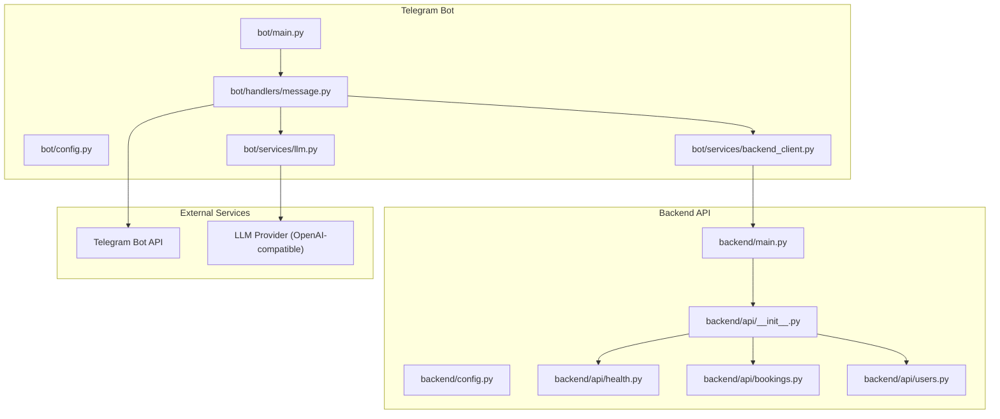
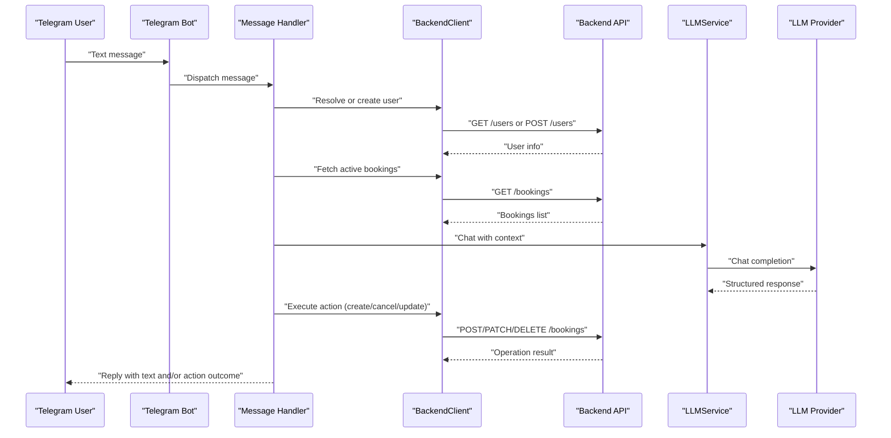
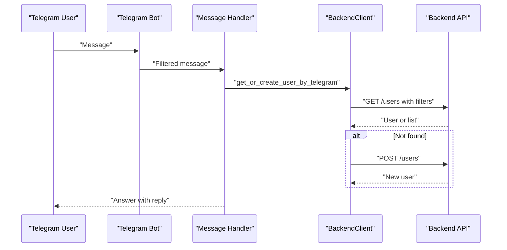
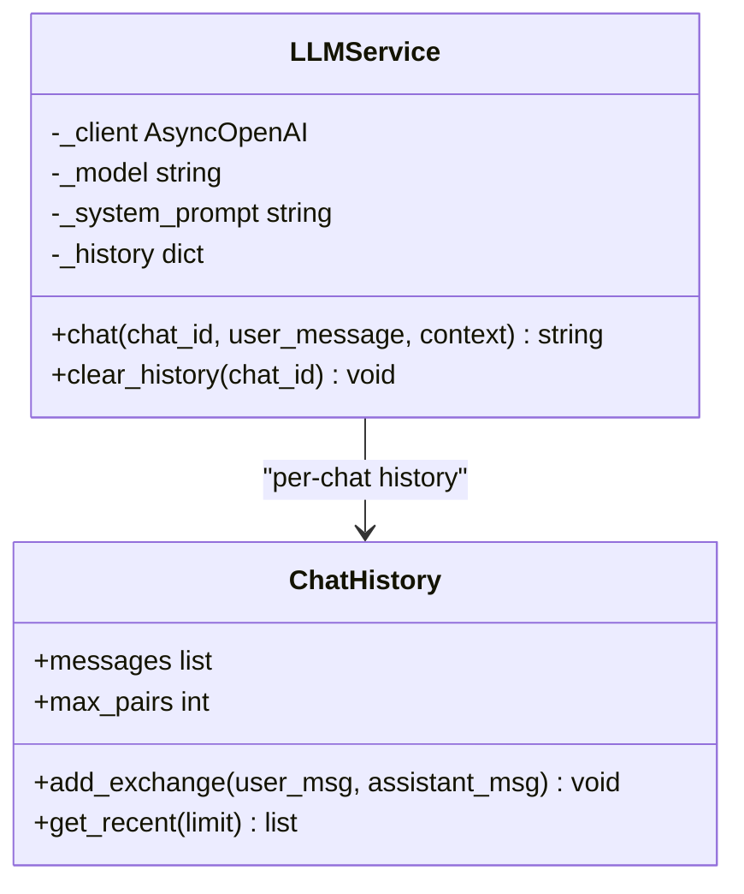
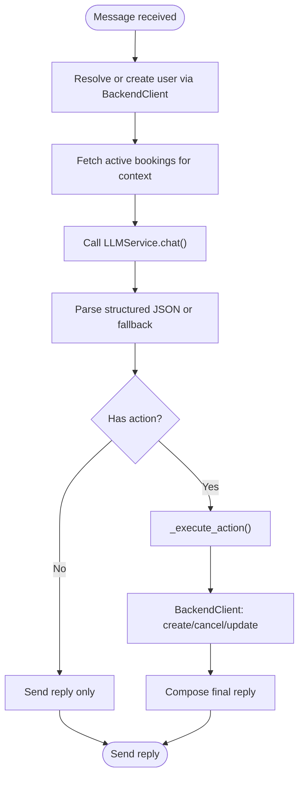
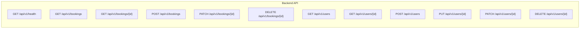
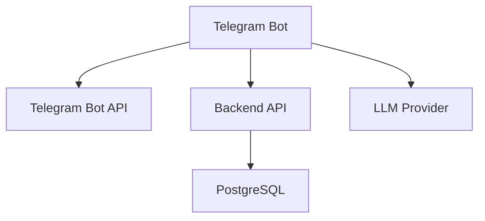

# Integration Documentation

<cite>
**Referenced Files in This Document**
- [README.md](file://README.md)
- [docs/integrations.md](file://docs/integrations.md)
- [docs/how-to-get-tokens.md](file://docs/how-to-get-tokens.md)
- [docker-compose.yaml](file://docker-compose.yaml)
- [bot/main.py](file://bot/main.py)
- [bot/config.py](file://bot/config.py)
- [bot/services/backend_client.py](file://bot/services/backend_client.py)
- [bot/services/llm.py](file://bot/services/llm.py)
- [bot/handlers/message.py](file://bot/handlers/message.py)
- [backend/main.py](file://backend/main.py)
- [backend/config.py](file://backend/config.py)
- [backend/api/__init__.py](file://backend/api/__init__.py)
- [backend/api/health.py](file://backend/api/health.py)
- [backend/api/bookings.py](file://backend/api/bookings.py)
- [backend/api/users.py](file://backend/api/users.py)
</cite>

## Table of Contents
1. [Introduction](#introduction)
2. [Project Structure](#project-structure)
3. [Core Components](#core-components)
4. [Architecture Overview](#architecture-overview)
5. [Detailed Component Analysis](#detailed-component-analysis)
6. [Dependency Analysis](#dependency-analysis)
7. [Performance Considerations](#performance-considerations)
8. [Troubleshooting Guide](#troubleshooting-guide)
9. [Conclusion](#conclusion)
10. [Appendices](#appendices)

## Introduction
This document explains how external services are integrated into the system, focusing on:
- Telegram Bot API connectivity
- LLM provider integration via an OpenAI-compatible API
- Backend service communication patterns between the Telegram bot and the internal REST API

It covers integration points, authentication mechanisms, data exchange protocols, error handling, fallback strategies, token management, rate limiting considerations, and availability safeguards. Both conceptual overviews for beginners and technical details for experienced developers are included.

## Project Structure
The integration spans three primary areas:
- Telegram bot runtime and handlers
- LLM service wrapper around an OpenAI-compatible client
- Backend REST API with health checks and domain endpoints

**Diagram sources**
- [bot/main.py:15-41](file://bot/main.py#L15-L41)
- [bot/handlers/message.py:387-436](file://bot/handlers/message.py#L387-L436)
- [bot/services/backend_client.py:26-118](file://bot/services/backend_client.py#L26-L118)
- [bot/services/llm.py:43-101](file://bot/services/llm.py#L43-L101)
- [backend/main.py:41-64](file://backend/main.py#L41-L64)
- [backend/api/__init__.py:1-15](file://backend/api/__init__.py#L1-L15)
- [backend/api/health.py:6-8](file://backend/api/health.py#L6-L8)
- [backend/api/bookings.py:20-83](file://backend/api/bookings.py#L20-L83)
- [backend/api/users.py:19-82](file://backend/api/users.py#L19-L82)

**Section sources**
- [README.md:11-20](file://README.md#L11-L20)
- [docs/integrations.md:5-20](file://docs/integrations.md#L5-L20)
- [docker-compose.yaml:16-40](file://docker-compose.yaml#L16-L40)

## Core Components
- Telegram Bot runtime initializes configuration, logging, optional proxy, and registers the message handler and service singletons into the dispatcher.
- Message handler filters incoming updates, ensures the bot is addressed, resolves or creates a user via the backend, builds context from active bookings, queries the LLM, parses the structured response, executes actions against the backend, and replies to the user.
- Backend API exposes health checks and domain endpoints under a shared router prefix, with centralized exception handling returning standardized error responses.
- LLM service wraps an OpenAI-compatible client, manages per-chat history with bounded capacity, and returns structured fallback responses on rate limits or API errors.
- Backend HTTP client encapsulates retries, timeouts, and error normalization for all backend API calls.

**Section sources**
- [bot/main.py:15-41](file://bot/main.py#L15-L41)
- [bot/handlers/message.py:387-436](file://bot/handlers/message.py#L387-L436)
- [backend/main.py:62-166](file://backend/main.py#L62-L166)
- [bot/services/llm.py:43-101](file://bot/services/llm.py#L43-L101)
- [bot/services/backend_client.py:26-118](file://bot/services/backend_client.py#L26-L118)

## Architecture Overview
The integration architecture connects the Telegram bot to external services and the internal backend API. The bot communicates with:
- Telegram Bot API for receiving messages and sending replies
- Backend API for user, booking, house, and tariff operations
- LLM provider via an OpenAI-compatible REST API for natural language understanding and action extraction

**Diagram sources**
- [bot/handlers/message.py:387-436](file://bot/handlers/message.py#L387-L436)
- [bot/services/backend_client.py:124-230](file://bot/services/backend_client.py#L124-L230)
- [bot/services/llm.py:80-101](file://bot/services/llm.py#L80-L101)
- [backend/api/bookings.py:86-222](file://backend/api/bookings.py#L86-L222)

## Detailed Component Analysis

### Telegram Bot API Connectivity
- Initialization: The bot is configured with a token and optional proxy session. Logging is set up from settings. The dispatcher stores shared instances of BackendClient and LLMService for handler access.
- Addressing logic: Messages are accepted only when addressed directly (private chat, reply to bot, or mention). Mentions are stripped before processing.
- Reply flow: After processing, the bot sends a text reply to the user.

**Diagram sources**
- [bot/main.py:31-36](file://bot/main.py#L31-L36)
- [bot/handlers/message.py:398-413](file://bot/handlers/message.py#L398-L413)
- [bot/services/backend_client.py:137-151](file://bot/services/backend_client.py#L137-L151)

**Section sources**
- [bot/main.py:15-41](file://bot/main.py#L15-L41)
- [bot/handlers/message.py:26-58](file://bot/handlers/message.py#L26-L58)
- [bot/handlers/message.py:387-436](file://bot/handlers/message.py#L387-L436)
- [bot/services/backend_client.py:124-151](file://bot/services/backend_client.py#L124-L151)

### LLM Provider Integration (OpenAI-Compatible)
- Client configuration: Uses AsyncOpenAI with base URL and API key from settings. Model and system prompt are configurable.
- History management: Maintains bounded chat history per chat ID to keep prompts concise.
- Structured parsing: Expects JSON with keys "action", "params", and "reply". Falls back gracefully on parsing failures or API errors.
- Rate limiting: Returns a friendly rate-limit message; other API errors return a fallback response.

**Diagram sources**
- [bot/services/llm.py:43-101](file://bot/services/llm.py#L43-L101)
- [bot/services/llm.py:21-41](file://bot/services/llm.py#L21-L41)

**Section sources**
- [bot/services/llm.py:43-101](file://bot/services/llm.py#L43-L101)
- [bot/config.py:44-61](file://bot/config.py#L44-L61)
- [docs/integrations.md:41-46](file://docs/integrations.md#L41-L46)

### Backend Service Communication Patterns
- HTTP client: Centralized async client with retry logic, timeouts, and normalized error handling. Provides typed methods for users, houses, bookings, and tariffs.
- Context building: The handler fetches active bookings to enrich the LLM prompt with current reservations.
- Action dispatch: Based on the LLM’s structured response, the handler validates parameters and invokes backend endpoints for create, cancel, or update operations.

**Diagram sources**
- [bot/handlers/message.py:147-157](file://bot/handlers/message.py#L147-L157)
- [bot/handlers/message.py:417-427](file://bot/handlers/message.py#L417-L427)
- [bot/services/backend_client.py:124-230](file://bot/services/backend_client.py#L124-L230)

**Section sources**
- [bot/services/backend_client.py:26-118](file://bot/services/backend_client.py#L26-L118)
- [bot/handlers/message.py:147-157](file://bot/handlers/message.py#L147-L157)
- [bot/handlers/message.py:285-323](file://bot/handlers/message.py#L285-L323)

### Backend API Endpoints and Contracts
- Health endpoint: Lightweight readiness/liveness indicator for monitoring.
- Bookings endpoints: List, retrieve, create, update, and cancel bookings with pagination and filtering.
- Users endpoints: List, retrieve, create, replace, partial update, and delete users.
- Exception handling: Centralized handlers return standardized error responses with consistent structure.

**Diagram sources**
- [backend/api/health.py:6-8](file://backend/api/health.py#L6-L8)
- [backend/api/bookings.py:20-222](file://backend/api/bookings.py#L20-L222)
- [backend/api/users.py:19-222](file://backend/api/users.py#L19-L222)

**Section sources**
- [backend/main.py:62-166](file://backend/main.py#L62-L166)
- [backend/api/__init__.py:1-15](file://backend/api/__init__.py#L1-L15)
- [backend/api/bookings.py:20-222](file://backend/api/bookings.py#L20-L222)
- [backend/api/users.py:19-222](file://backend/api/users.py#L19-L222)

## Dependency Analysis
- Telegram Bot depends on:
  - Telegram Bot API for messaging
  - Backend API for user and booking operations
  - LLM provider for NLU and action extraction
- Backend API depends on:
  - Database (PostgreSQL) for persistence
  - Internal services and schemas for domain logic
- External dependencies:
  - HTTP clients (httpx for bot, OpenAI client for LLM)
  - Environment-driven configuration

**Diagram sources**
- [docs/integrations.md:26-46](file://docs/integrations.md#L26-L46)
- [backend/config.py:17-18](file://backend/config.py#L17-L18)

**Section sources**
- [docs/integrations.md:52-69](file://docs/integrations.md#L52-L69)
- [docker-compose.yaml:2-14](file://docker-compose.yaml#L2-L14)

## Performance Considerations
- Timeouts and retries: The backend client enforces a default timeout and performs a fixed number of retries for transient failures. Tune these values based on observed latency and error rates.
- Rate limiting: The LLM service returns a friendly rate-limit message on quota exhaustion. Consider adding circuit breaker logic and exponential backoff for resilience.
- Payload sizes: Keep LLM prompts concise by bounding chat history and including only necessary context (active bookings).
- Caching: For frequently accessed data (e.g., houses, tariffs), consider caching at the bot or backend layer to reduce external calls.
- Concurrency: The bot uses async HTTP clients; ensure adequate resource limits and avoid blocking operations in handlers.

[No sources needed since this section provides general guidance]

## Troubleshooting Guide
Common integration challenges and solutions:
- Telegram API issues
  - Symptoms: No messages received, rate limits, or delivery failures.
  - Mitigations: Prefer webhooks for production, implement retry/backoff, monitor rate limits, and ensure proper bot token configuration.
- Backend API unavailability
  - Symptoms: 5xx responses, timeouts, or health check failures.
  - Mitigations: Use health endpoints for readiness checks, implement retries with jitter, and degrade gracefully by informing users.
- LLM provider downtime or rate limits
  - Symptoms: API errors, rate limit exceptions, or empty responses.
  - Mitigations: Return fallback responses, cache recent answers, and consider secondary providers or local fallbacks.
- Network timeouts and connectivity
  - Symptoms: Connect errors or slow responses.
  - Mitigations: Increase timeouts, enable retries, configure proxies if required, and monitor latency.
- Authentication and secrets
  - Symptoms: Unauthorized or forbidden responses.
  - Mitigations: Store tokens in environment variables, avoid hardcoding, and rotate keys periodically.

**Section sources**
- [bot/services/backend_client.py:51-112](file://bot/services/backend_client.py#L51-L112)
- [bot/services/llm.py:90-98](file://bot/services/llm.py#L90-L98)
- [backend/main.py:62-64](file://backend/main.py#L62-L64)
- [docs/integrations.md:52-69](file://docs/integrations.md#L52-L69)

## Conclusion
The system integrates external services through a clean separation of concerns:
- Telegram bot handles user interactions and orchestrates calls to backend and LLM services
- Backend API centralizes domain logic and provides a stable contract for clients
- LLM service abstracts provider-specific APIs behind a structured interface

Robust error handling, retries, and fallbacks ensure resilience. Proper configuration management and observability practices further improve reliability.

[No sources needed since this section summarizes without analyzing specific files]

## Appendices

### Authentication Mechanisms
- Telegram Bot Token: Provided by BotFather and stored in environment variables. Used by the Telegram SDK to authenticate requests.
- LLM Provider API Key: Stored in environment variables and passed to the OpenAI-compatible client.
- Backend API: Currently uses placeholder tenant IDs in endpoints; future authentication (e.g., JWT) will be integrated as tasks progress.

**Section sources**
- [docs/how-to-get-tokens.md:3-11](file://docs/how-to-get-tokens.md#L3-L11)
- [docs/how-to-get-tokens.md:15-23](file://docs/how-to-get-tokens.md#L15-L23)
- [backend/api/bookings.py:123-126](file://backend/api/bookings.py#L123-L126)

### Data Exchange Protocols
- Telegram Bot API: HTTPS-based, supports long polling or webhooks. The bot uses polling in this setup.
- Backend API: HTTP REST over HTTPS with JSON payloads and standard HTTP status codes.
- LLM Provider: OpenAI-compatible REST API over HTTPS; expects chat completions with structured JSON responses.

**Section sources**
- [docs/integrations.md:26-46](file://docs/integrations.md#L26-L46)
- [backend/main.py:59](file://backend/main.py#L59)

### Token Management
- Store tokens and secrets in environment variables (.env) and load them via Pydantic settings.
- Avoid committing secrets to version control; the repository includes .env in .gitignore.

**Section sources**
- [bot/config.py:44-61](file://bot/config.py#L44-L61)
- [docs/how-to-get-tokens.md:27-37](file://docs/how-to-get-tokens.md#L27-L37)

### API Rate Limiting and Availability
- Backend client: Implements retry logic and timeout handling to mitigate transient failures.
- LLM service: Handles rate limit errors and API errors with fallback responses.
- Health checks: Backend exposes a /health endpoint for readiness monitoring.

**Section sources**
- [bot/services/backend_client.py:51-112](file://bot/services/backend_client.py#L51-L112)
- [bot/services/llm.py:90-98](file://bot/services/llm.py#L90-L98)
- [backend/api/health.py:6-8](file://backend/api/health.py#L6-L8)

### Practical Integration Scenarios
- New user registration from Telegram: Handler resolves or creates a user via backend, then responds to the user.
- Booking creation from natural language: Handler builds context, queries LLM, parses structured response, validates parameters, and calls backend to create a booking.
- Booking cancellation or update: Similar flow with action dispatch to backend endpoints.

**Section sources**
- [bot/handlers/message.py:361-384](file://bot/handlers/message.py#L361-L384)
- [bot/handlers/message.py:417-427](file://bot/handlers/message.py#L417-L427)
- [bot/services/backend_client.py:199-230](file://bot/services/backend_client.py#L199-L230)