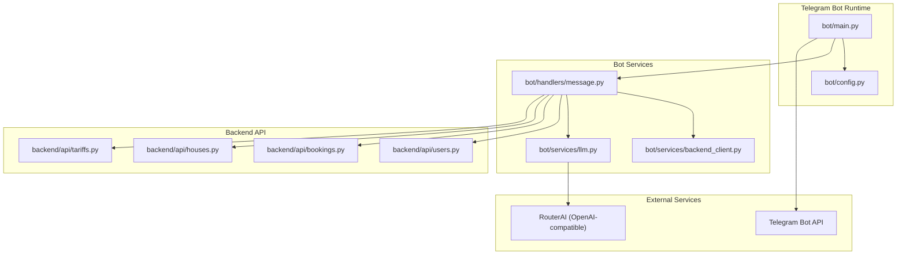
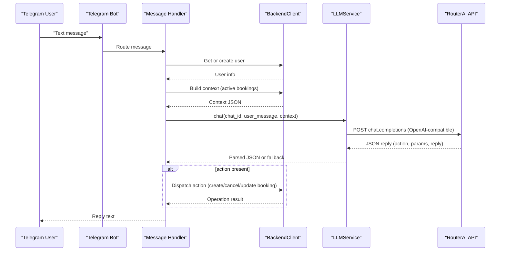
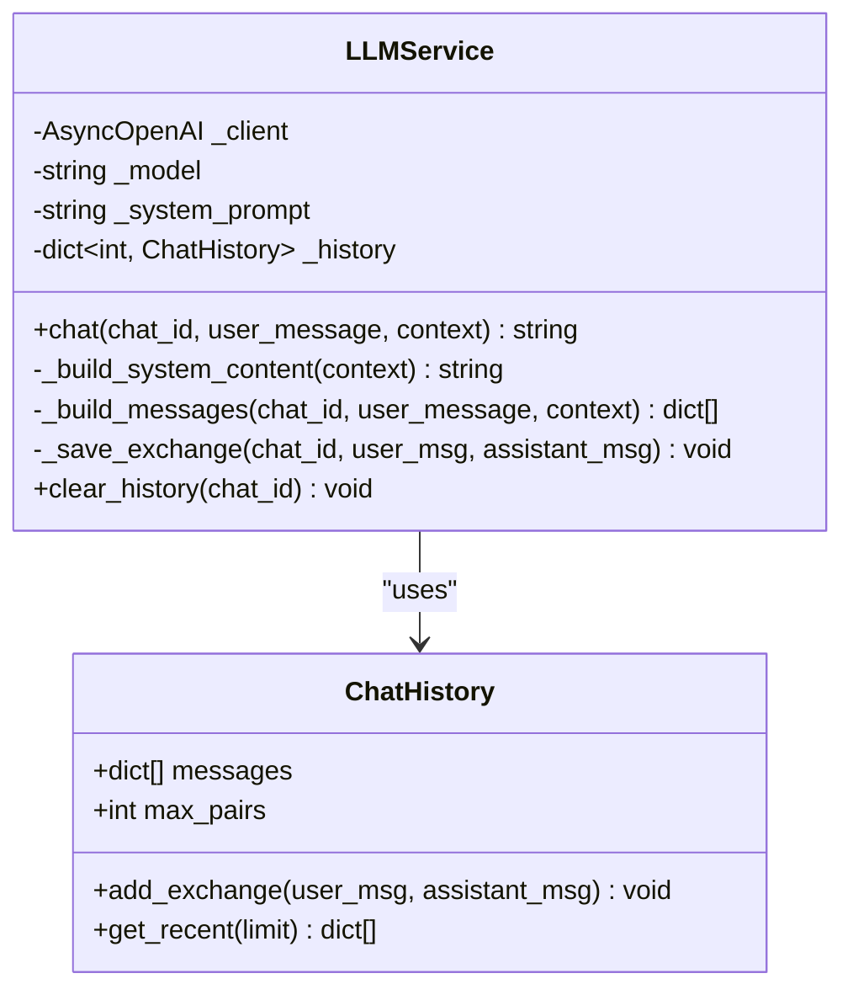
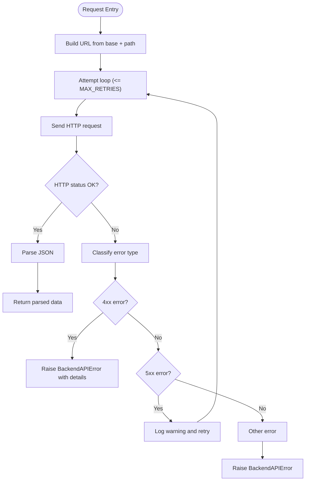
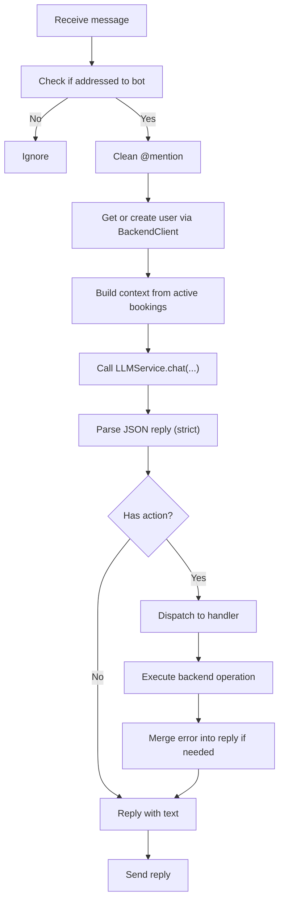
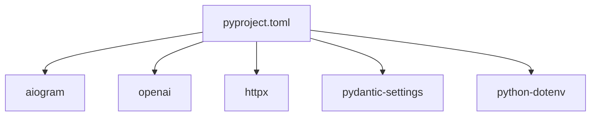

# LLM Provider Integration

<cite>
**Referenced Files in This Document**
- [bot/main.py](file://bot/main.py)
- [bot/config.py](file://bot/config.py)
- [bot/services/llm.py](file://bot/services/llm.py)
- [bot/services/backend_client.py](file://bot/services/backend_client.py)
- [bot/handlers/message.py](file://bot/handlers/message.py)
- [docs/integrations.md](file://docs/integrations.md)
- [docs/how-to-get-tokens.md](file://docs/how-to-get-tokens.md)
- [backend/api/users.py](file://backend/api/users.py)
- [backend/api/bookings.py](file://backend/api/bookings.py)
- [backend/api/houses.py](file://backend/api/houses.py)
- [backend/api/tariffs.py](file://backend/api/tariffs.py)
- [pyproject.toml](file://pyproject.toml)
</cite>

## Table of Contents
1. [Introduction](#introduction)
2. [Project Structure](#project-structure)
3. [Core Components](#core-components)
4. [Architecture Overview](#architecture-overview)
5. [Detailed Component Analysis](#detailed-component-analysis)
6. [Dependency Analysis](#dependency-analysis)
7. [Performance Considerations](#performance-considerations)
8. [Troubleshooting Guide](#troubleshooting-guide)
9. [Conclusion](#conclusion)
10. [Appendices](#appendices)

## Introduction
This document explains the LLM provider integration for the RouterAI service within the Telegram bot. It covers the natural language processing workflow, API communication patterns, and response handling mechanisms. It also documents the integration architecture including authentication tokens, request/response formatting, error handling strategies, and operational considerations such as rate limiting and service availability monitoring. Practical examples demonstrate common NLP scenarios, intent recognition workflows, and fallback mechanisms.

## Project Structure
The integration spans three primary areas:
- Telegram bot runtime and dependency injection
- LLM service that communicates with RouterAI via an OpenAI-compatible API
- Backend HTTP client that interacts with internal FastAPI endpoints for users, bookings, houses, and tariffs

**Diagram sources**
- [bot/main.py:15-41](file://bot/main.py#L15-L41)
- [bot/config.py:44-67](file://bot/config.py#L44-L67)
- [bot/services/llm.py:43-106](file://bot/services/llm.py#L43-L106)
- [bot/services/backend_client.py:26-244](file://bot/services/backend_client.py#L26-L244)
- [bot/handlers/message.py:387-436](file://bot/handlers/message.py#L387-L436)
- [backend/api/users.py:16-223](file://backend/api/users.py#L16-L223)
- [backend/api/bookings.py:17-223](file://backend/api/bookings.py#L17-L223)
- [backend/api/houses.py:18-266](file://backend/api/houses.py#L18-L266)
- [backend/api/tariffs.py:15-187](file://backend/api/tariffs.py#L15-L187)

**Section sources**
- [bot/main.py:15-41](file://bot/main.py#L15-L41)
- [bot/config.py:44-67](file://bot/config.py#L44-L67)
- [docs/integrations.md:5-69](file://docs/integrations.md#L5-L69)

## Core Components
- Settings and configuration: centralizes environment-driven configuration for tokens, base URLs, prompts, and logging.
- LLM service: wraps AsyncOpenAI to send user messages plus contextual system/history messages to RouterAI and parses structured JSON responses.
- Backend HTTP client: async HTTP client with retry/backoff and typed error handling for internal API endpoints.
- Message handler: orchestrates user addressing, user creation, context building, LLM invocation, response parsing, and action dispatching to backend APIs.

Key responsibilities:
- Authentication tokens: Telegram bot token, RouterAI API key, optional proxy.
- Request/response formatting: OpenAI-compatible chat completions payload and JSON-structured replies from LLM.
- Error handling: rate limits, API errors, timeouts, connection failures, and malformed LLM responses.

**Section sources**
- [bot/config.py:44-67](file://bot/config.py#L44-L67)
- [bot/services/llm.py:43-106](file://bot/services/llm.py#L43-L106)
- [bot/services/backend_client.py:26-244](file://bot/services/backend_client.py#L26-L244)
- [bot/handlers/message.py:387-436](file://bot/handlers/message.py#L387-L436)

## Architecture Overview
The system integrates Telegram, a RouterAI LLM endpoint, and an internal backend API. The Telegram bot receives messages, optionally enriches them with current bookings context, queries RouterAI for intent and structured actions, and executes backend operations accordingly.

**Diagram sources**
- [bot/handlers/message.py:387-436](file://bot/handlers/message.py#L387-L436)
- [bot/services/llm.py:80-101](file://bot/services/llm.py#L80-L101)
- [bot/services/backend_client.py:51-112](file://bot/services/backend_client.py#L51-L112)

**Section sources**
- [docs/integrations.md:5-69](file://docs/integrations.md#L5-L69)
- [bot/handlers/message.py:387-436](file://bot/handlers/message.py#L387-L436)

## Detailed Component Analysis

### LLM Service (RouterAI Integration)
The LLM service encapsulates RouterAI communication and maintains per-chat history. It builds a system prompt enriched with today’s date and current bookings context, sends a message array to the OpenAI-compatible API, and returns either the LLM’s JSON or a fallback response.

- Authentication and base URL: configured via settings for RouterAI API key and base URL.
- Request format: OpenAI-compatible chat completion payload with roles: system, user, assistant.
- Response handling: strict JSON parsing; on rate limit, API error, or unexpected error, returns a fallback JSON with a friendly reply.

**Diagram sources**
- [bot/services/llm.py:21-41](file://bot/services/llm.py#L21-L41)
- [bot/services/llm.py:43-106](file://bot/services/llm.py#L43-L106)

**Section sources**
- [bot/services/llm.py:43-106](file://bot/services/llm.py#L43-L106)
- [bot/config.py:51-54](file://bot/config.py#L51-L54)

### Backend HTTP Client
The backend client provides async HTTP access to internal endpoints with robust retry logic and explicit error classification. It supports GET/POST/PATCH/DELETE operations for users, houses, bookings, and tariffs.

- Timeouts and retries: configurable default timeout and retry count.
- Error mapping: distinguishes client errors, server errors, timeouts, and connection errors.
- Endpoint coverage: users, houses, bookings, tariffs.

**Diagram sources**
- [bot/services/backend_client.py:51-112](file://bot/services/backend_client.py#L51-L112)

**Section sources**
- [bot/services/backend_client.py:26-244](file://bot/services/backend_client.py#L26-L244)

### Message Handler (Intent Recognition and Action Dispatch)
The message handler coordinates user addressing, user provisioning, context building, LLM invocation, response parsing, and backend action execution.

- Intent extraction: relies on LLM to return a JSON with action, params, and reply.
- Validation: converts string params to typed values (dates, integers) and validates required fields.
- Fallback behavior: preserves LLM reply while appending backend errors when appropriate.

**Diagram sources**
- [bot/handlers/message.py:387-436](file://bot/handlers/message.py#L387-L436)
- [bot/handlers/message.py:66-89](file://bot/handlers/message.py#L66-L89)
- [bot/handlers/message.py:147-158](file://bot/handlers/message.py#L147-L158)

**Section sources**
- [bot/handlers/message.py:387-436](file://bot/handlers/message.py#L387-L436)
- [bot/handlers/message.py:66-89](file://bot/handlers/message.py#L66-L89)
- [bot/handlers/message.py:147-158](file://bot/handlers/message.py#L147-L158)

### Configuration and Tokens
- Environment-driven configuration via Pydantic settings with caching.
- Required tokens and endpoints:
  - Telegram bot token and username
  - RouterAI API key and base URL
  - Backend API URL
  - Optional proxy URL
- Prompt engineering: system prompt defines character, capabilities, output format, and rules.

**Section sources**
- [bot/config.py:44-67](file://bot/config.py#L44-L67)
- [docs/how-to-get-tokens.md:1-37](file://docs/how-to-get-tokens.md#L1-L37)

### Backend API Contracts (Users, Bookings, Houses, Tariffs)
The bot consumes internal endpoints for user management, booking lifecycle, house availability, and tariff information. These are standard FastAPI routes with typed request/response models and pagination support.

- Users: list, get, create, replace, update, delete
- Bookings: list, get, create, update, cancel
- Houses: list, get, create, replace, update, delete, calendar
- Tariffs: list, get, create, update, delete

**Section sources**
- [backend/api/users.py:16-223](file://backend/api/users.py#L16-L223)
- [backend/api/bookings.py:17-223](file://backend/api/bookings.py#L17-L223)
- [backend/api/houses.py:18-266](file://backend/api/houses.py#L18-L266)
- [backend/api/tariffs.py:15-187](file://backend/api/tariffs.py#L15-L187)

## Dependency Analysis
External and internal dependencies relevant to LLM integration:
- aiogram: Telegram bot framework
- openai: AsyncOpenAI client for RouterAI
- httpx: Async HTTP client for backend
- pydantic-settings: Environment configuration
- python-dotenv: Local environment loading

**Diagram sources**
- [pyproject.toml:6-18](file://pyproject.toml#L6-L18)

**Section sources**
- [pyproject.toml:6-18](file://pyproject.toml#L6-L18)

## Performance Considerations
- Request/response batching: keep recent history bounded to reduce token usage and latency.
- Retry/backoff: tune MAX_RETRIES and DEFAULT_TIMEOUT for backend reliability under load.
- Rate limiting: RouterAI may throttle; implement exponential backoff and circuit breaker patterns.
- Context size: limit active bookings context to concise summaries to fit model constraints.
- Logging overhead: avoid excessive logging in hot paths; use structured logs for observability.

[No sources needed since this section provides general guidance]

## Troubleshooting Guide
Common issues and mitigations:
- Network timeouts and connection errors: backend client retries with warnings; consider increasing timeout or enabling proxy.
- API changes: RouterAI may alter response shape; strict JSON parsing and fallback responses protect downstream logic.
- Service unavailability: fallback reply ensures user feedback; monitor health endpoints and implement circuit breaker.
- Malformed LLM responses: parser extracts first JSON block; otherwise returns raw text as reply.
- Rate limits: dedicated rate limit handling returns user-friendly messages.

Operational tips:
- Monitor logs for frequent rate limit warnings and adjust model or usage patterns.
- Keep RouterAI base URL and API key up to date via environment variables.
- Validate environment variables locally before deployment.

**Section sources**
- [bot/services/llm.py:90-98](file://bot/services/llm.py#L90-L98)
- [bot/services/backend_client.py:94-110](file://bot/services/backend_client.py#L94-L110)
- [bot/handlers/message.py:66-89](file://bot/handlers/message.py#L66-L89)

## Conclusion
The RouterAI integration follows a clean separation of concerns: the Telegram bot handles user interaction, the LLM service manages NLP and structured responses, and the backend client encapsulates internal API access. Robust error handling, retry logic, and fallback responses ensure resilience. By adhering to the documented configuration, request/response formats, and operational practices, teams can implement similar LLM integrations reliably.

[No sources needed since this section summarizes without analyzing specific files]

## Appendices

### Practical Examples and Scenarios
- Intent recognition workflows:
  - Natural language booking request → LLM identifies action and params → Backend creates booking
  - Request to cancel booking → LLM resolves booking ID from context → Backend cancels booking
  - Update booking details → LLM extracts fields → Backend updates booking
- Fallback mechanisms:
  - Rate limit → friendly retry message
  - LLM API error → fallback JSON with apology
  - Malformed LLM response → reply treated as raw text
- Token management:
  - Store RouterAI API key and Telegram bot token in environment variables
  - Use separate keys for development and production
- Rate limiting and availability:
  - Monitor RouterAI quotas and adjust usage
  - Implement circuit breaker and health checks for external services
- Service monitoring:
  - Track LLM latency, error rates, and token consumption
  - Log backend API status codes and retry counts

[No sources needed since this section provides general guidance]