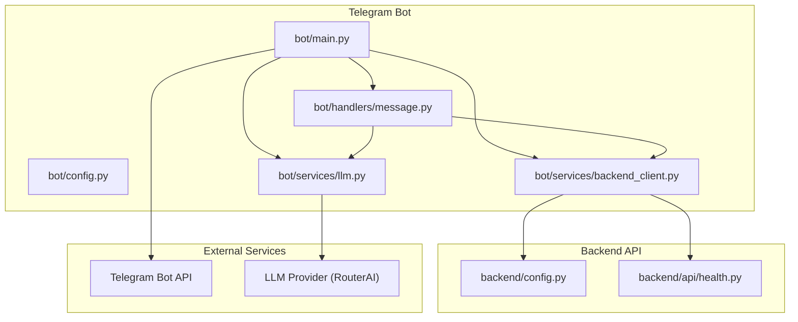
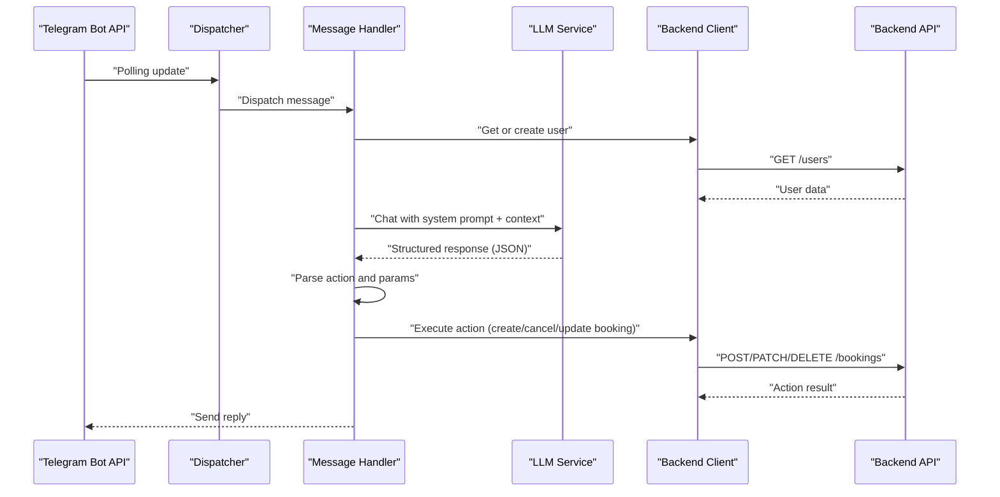
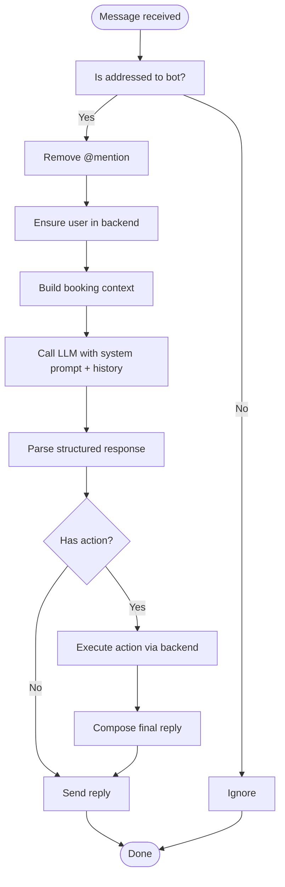
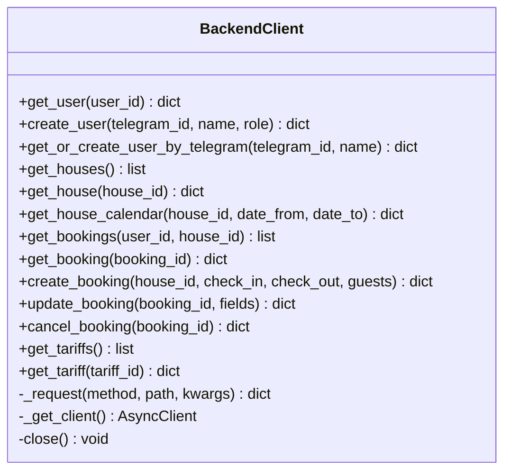
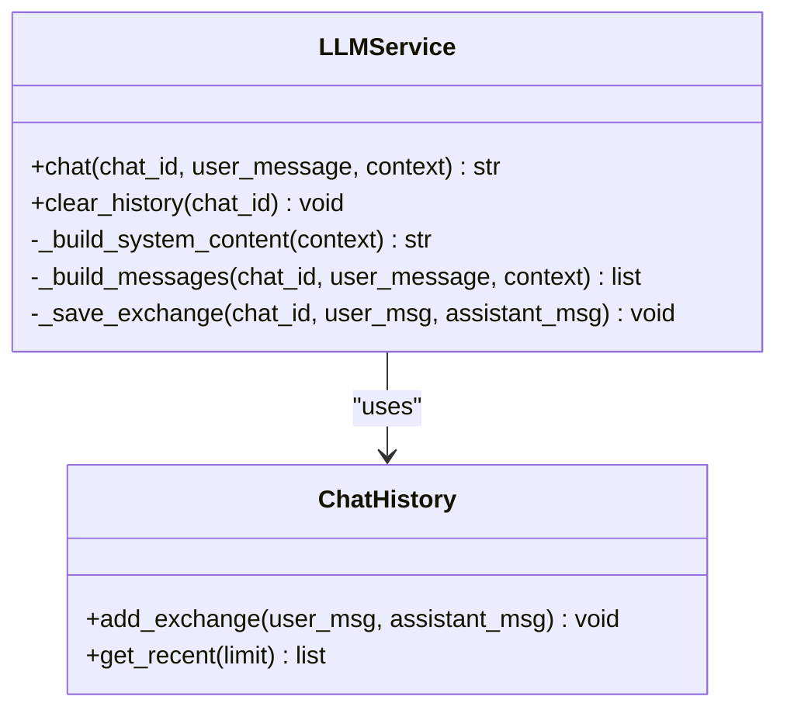
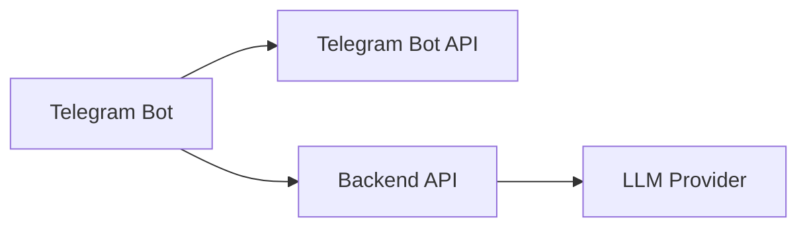

# Telegram API Integration

<cite>
**Referenced Files in This Document**
- [bot/main.py](file://bot/main.py)
- [bot/config.py](file://bot/config.py)
- [bot/handlers/message.py](file://bot/handlers/message.py)
- [bot/services/backend_client.py](file://bot/services/backend_client.py)
- [bot/services/llm.py](file://bot/services/llm.py)
- [backend/config.py](file://backend/config.py)
- [backend/api/health.py](file://backend/api/health.py)
- [docs/integrations.md](file://docs/integrations.md)
- [docs/how-to-get-tokens.md](file://docs/how-to-get-tokens.md)
- [README.md](file://README.md)
</cite>

## Table of Contents
1. [Introduction](#introduction)
2. [Project Structure](#project-structure)
3. [Core Components](#core-components)
4. [Architecture Overview](#architecture-overview)
5. [Detailed Component Analysis](#detailed-component-analysis)
6. [Dependency Analysis](#dependency-analysis)
7. [Performance Considerations](#performance-considerations)
8. [Troubleshooting Guide](#troubleshooting-guide)
9. [Conclusion](#conclusion)
10. [Appendices](#appendices)

## Introduction
This document explains the Telegram API integration for the booking system’s Telegram bot. It covers bidirectional communication patterns, long polling versus webhook approaches, message processing workflows, authentication via bot tokens, message routing, and response delivery. It also documents rate limiting, service availability monitoring, and common integration challenges with mitigation strategies.

The bot is implemented with Aiogram and runs a long polling loop. It integrates with:
- Telegram Bot API for receiving messages and sending replies
- Backend API for user, booking, and house data
- LLM provider (RouterAI) for natural language understanding and structured responses

## Project Structure
The Telegram integration lives under the bot/ package and interacts with backend services and external providers as shown below.

**Diagram sources**
- [bot/main.py:15-41](file://bot/main.py#L15-L41)
- [bot/config.py:44-66](file://bot/config.py#L44-L66)
- [bot/handlers/message.py:387-436](file://bot/handlers/message.py#L387-L436)
- [bot/services/backend_client.py:26-118](file://bot/services/backend_client.py#L26-L118)
- [bot/services/llm.py:43-101](file://bot/services/llm.py#L43-L101)
- [backend/config.py:4-24](file://backend/config.py#L4-L24)
- [backend/api/health.py:6-8](file://backend/api/health.py#L6-L8)

**Section sources**
- [README.md:11-20](file://README.md#L11-L20)
- [docs/integrations.md:5-20](file://docs/integrations.md#L5-L20)

## Core Components
- Bot entrypoint and dispatcher: initializes logging, settings, proxy, Aiogram Bot and Dispatcher, injects shared dependencies, and starts long polling.
- Message handler: filters addressed messages, builds user context, queries LLM, parses structured actions, dispatches actions to backend, and sends replies.
- Backend client: typed HTTP client with retries, timeouts, and error normalization for backend API.
- LLM service: OpenAI-compatible client with chat history per chat, rate limit handling, and fallback responses.

**Section sources**
- [bot/main.py:15-41](file://bot/main.py#L15-L41)
- [bot/handlers/message.py:387-436](file://bot/handlers/message.py#L387-L436)
- [bot/services/backend_client.py:26-118](file://bot/services/backend_client.py#L26-L118)
- [bot/services/llm.py:43-101](file://bot/services/llm.py#L43-L101)

## Architecture Overview
The bot follows a request-response flow with bidirectional interactions:
- Incoming: Telegram Bot API delivers updates to the bot via long polling.
- Processing: The message handler validates context, enriches with user and booking context, queries LLM, and executes actions against the backend.
- Outgoing: The bot sends replies to Telegram.

**Diagram sources**
- [bot/main.py:31-41](file://bot/main.py#L31-L41)
- [bot/handlers/message.py:387-436](file://bot/handlers/message.py#L387-L436)
- [bot/services/llm.py:80-101](file://bot/services/llm.py#L80-L101)
- [bot/services/backend_client.py:137-230](file://bot/services/backend_client.py#L137-L230)

## Detailed Component Analysis

### Bot Entry Point and Long Polling
- Initializes logging and settings.
- Optionally configures an aiohttp proxy for the Telegram session.
- Creates Aiogram Bot and Dispatcher, injects settings, backend client, and LLM service.
- Includes the message router and starts long polling.

Key behaviors:
- Uses dispatcher dependency injection to share settings, backend client, and LLM service across handlers.
- Long polling is started synchronously inside an event loop.

**Section sources**
- [bot/main.py:15-41](file://bot/main.py#L15-L41)

### Message Handler: Addressing, Context, LLM, Actions, Replies
- Filters messages addressed to the bot (private chats, mentions, or replies).
- Normalizes text by removing bot mentions.
- Ensures a user record exists in backend.
- Builds context from active bookings.
- Sends user message to LLM with system prompt and recent history.
- Parses LLM response into a structured action with parameters and a human-readable reply.
- Executes the action against backend and composes the final reply.
- Sends the reply back to Telegram.

**Diagram sources**
- [bot/handlers/message.py:387-436](file://bot/handlers/message.py#L387-L436)
- [bot/services/llm.py:80-101](file://bot/services/llm.py#L80-L101)
- [bot/services/backend_client.py:137-230](file://bot/services/backend_client.py#L137-L230)

**Section sources**
- [bot/handlers/message.py:26-58](file://bot/handlers/message.py#L26-L58)
- [bot/handlers/message.py:66-89](file://bot/handlers/message.py#L66-L89)
- [bot/handlers/message.py:147-158](file://bot/handlers/message.py#L147-L158)
- [bot/handlers/message.py:285-323](file://bot/handlers/message.py#L285-L323)
- [bot/handlers/message.py:387-436](file://bot/handlers/message.py#L387-L436)

### Backend Client: HTTP Abstractions and Retry Logic
- Provides typed async HTTP client with configurable timeout and redirect following.
- Implements retry logic for transient errors (timeouts, connection errors, server errors).
- Normalizes backend errors into a single exception type with status codes.
- Exposes CRUD operations for users, houses, bookings, and tariffs.

**Diagram sources**
- [bot/services/backend_client.py:26-244](file://bot/services/backend_client.py#L26-L244)

**Section sources**
- [bot/services/backend_client.py:26-118](file://bot/services/backend_client.py#L26-L118)
- [bot/services/backend_client.py:137-230](file://bot/services/backend_client.py#L137-L230)

### LLM Service: Structured Responses and History
- Maintains chat history per chat with bounded capacity.
- Builds system prompt with today’s date and current bookings context.
- Calls OpenAI-compatible API and handles rate limits and API errors with fallback responses.
- Saves exchanges to history for context.

**Diagram sources**
- [bot/services/llm.py:21-41](file://bot/services/llm.py#L21-L41)
- [bot/services/llm.py:43-101](file://bot/services/llm.py#L43-L101)

**Section sources**
- [bot/services/llm.py:43-101](file://bot/services/llm.py#L43-L101)

### Authentication and Configuration
- Telegram bot token and bot username are loaded from environment via Pydantic settings.
- LLM API key and base URL are configured; defaults are provided.
- Optional proxy support for the Telegram session.
- Backend API URL defaults to internal Docker hostname.

**Section sources**
- [bot/config.py:44-66](file://bot/config.py#L44-L66)
- [docs/how-to-get-tokens.md:1-37](file://docs/how-to-get-tokens.md#L1-L37)

## Dependency Analysis
The integration depends on:
- Telegram Bot API for incoming updates and outgoing replies
- Backend API for user, booking, and house data
- LLM provider for natural language understanding and structured outputs

**Diagram sources**
- [docs/integrations.md:5-20](file://docs/integrations.md#L5-L20)

**Section sources**
- [docs/integrations.md:24-69](file://docs/integrations.md#L24-L69)

## Performance Considerations
- Long polling: The bot polls Telegram continuously. Consider scaling horizontally or switching to webhooks for production traffic.
- Retry and timeouts: Backend client retries transient errors; tune timeouts and retry counts for reliability.
- LLM rate limits: The LLM service returns fallback responses on rate limit; consider queueing or backoff strategies.
- Chat history: Per-chat history is bounded; ensure prompts remain efficient to reduce latency.

[No sources needed since this section provides general guidance]

## Troubleshooting Guide
Common issues and mitigations:
- Rate limits from Telegram or LLM:
  - The LLM service returns a fallback response on rate limit; consider adding exponential backoff or queuing.
- Backend unavailability:
  - Backend client retries on server errors and timeouts; monitor health endpoint and alert on repeated failures.
- Message delivery failures:
  - Ensure the bot token is valid and the bot is allowed to send messages in the chat.
- Bot blocking:
  - Monitor for user complaints and adjust bot behavior; consider webhook fallback and robust error handling.
- Health monitoring:
  - Use the backend health endpoint to confirm service availability.

**Section sources**
- [bot/services/llm.py:90-98](file://bot/services/llm.py#L90-L98)
- [bot/services/backend_client.py:51-112](file://bot/services/backend_client.py#L51-L112)
- [backend/api/health.py:6-8](file://backend/api/health.py#L6-L8)
- [docs/integrations.md:54-69](file://docs/integrations.md#L54-L69)

## Conclusion
The Telegram integration uses a clean, layered architecture: Aiogram long polling, a message handler that orchestrates LLM and backend interactions, and robust HTTP clients with retry logic. While the current implementation uses long polling, the modular design allows migration to webhooks with minimal changes. The system emphasizes structured LLM responses, per-chat history, and resilient error handling to deliver reliable bot experiences.

[No sources needed since this section summarizes without analyzing specific files]

## Appendices

### Practical Scenarios and Patterns
- Natural language booking requests:
  - The message handler routes user text to LLM, parses structured actions, and executes backend operations.
- Inline keyboard interactions:
  - Not implemented in the current code; consider extending handlers to process callback queries and button presses.
- Error recovery:
  - Backend client normalizes errors; message handler composes user-friendly replies and decides whether to cancel LLM-generated replies based on action-specific errors.

**Section sources**
- [bot/handlers/message.py:387-436](file://bot/handlers/message.py#L387-L436)
- [bot/services/backend_client.py:17-24](file://bot/services/backend_client.py#L17-L24)

### Webhook vs Long Polling
- Current mode: Long polling initiated by the bot entrypoint.
- Migration path: Replace polling with webhook registration and route updates to a FastAPI endpoint; ensure idempotent processing and persistent storage for missed events.

**Section sources**
- [bot/main.py:40-41](file://bot/main.py#L40-L41)
- [docs/integrations.md:29-31](file://docs/integrations.md#L29-L31)

### Rate Limiting and Availability Monitoring
- Telegram and LLM rate limits: The LLM service handles rate limit errors gracefully; consider circuit breaker patterns for LLM.
- Backend availability: Use the health endpoint to monitor service uptime and trigger alerts on failure.

**Section sources**
- [bot/services/llm.py:90-98](file://bot/services/llm.py#L90-L98)
- [backend/api/health.py:6-8](file://backend/api/health.py#L6-L8)
- [docs/integrations.md:54-69](file://docs/integrations.md#L54-L69)