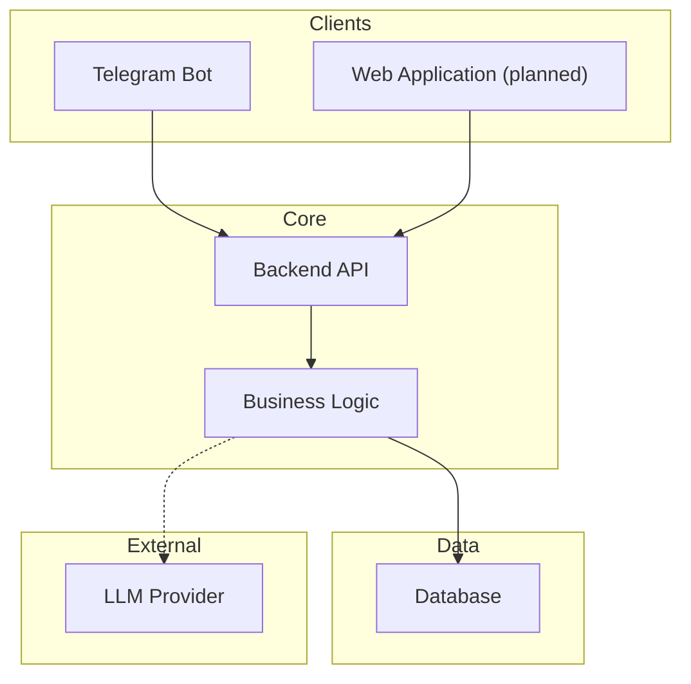
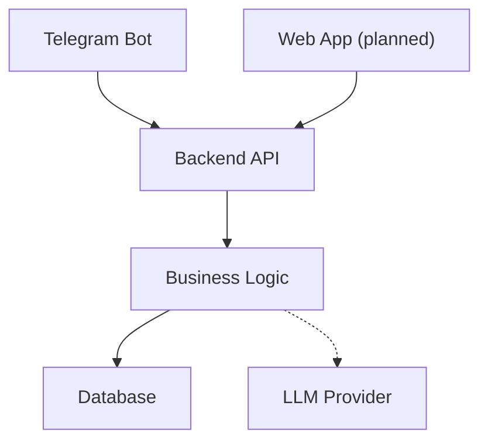
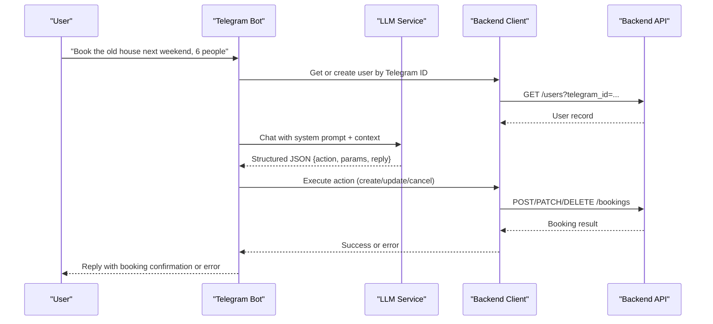
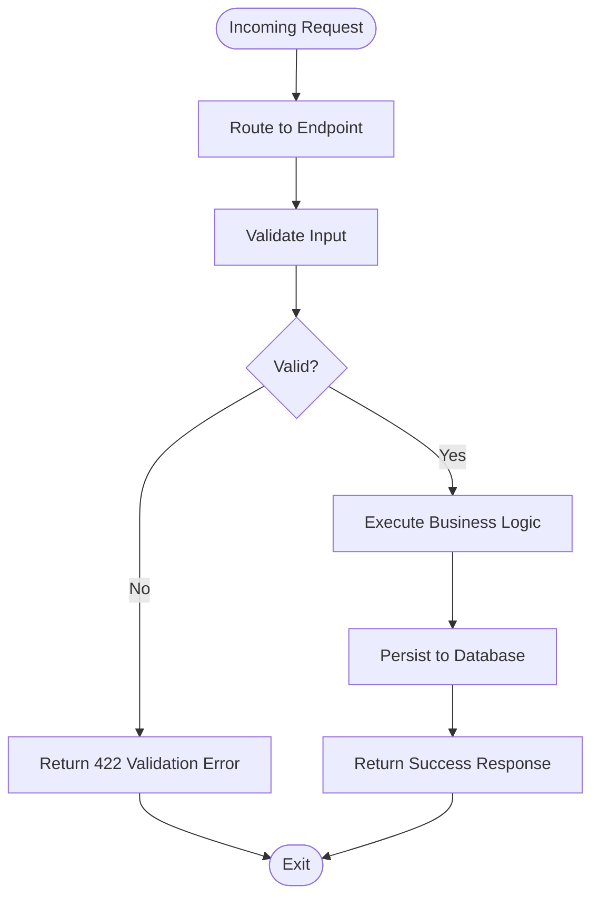
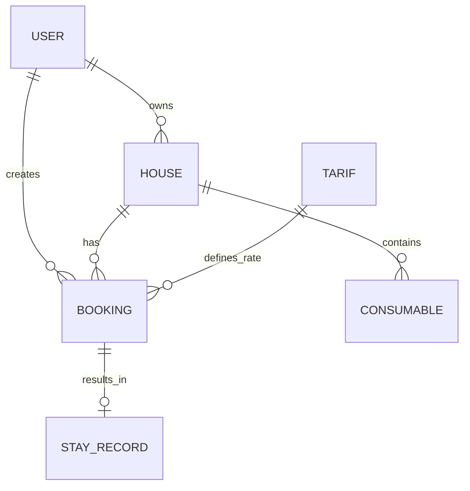
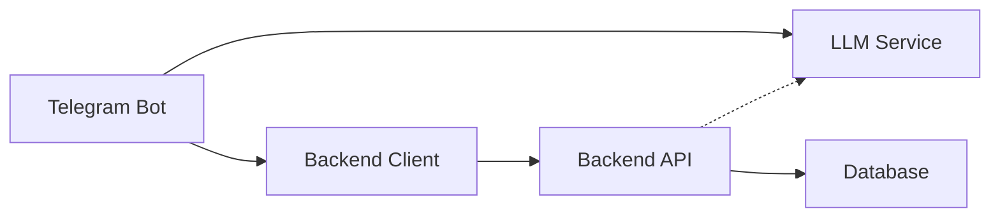

# Introduction and Purpose

<cite>
**Referenced Files in This Document**
- [README.md](file://README.md)
- [docs/vision.md](file://docs/vision.md)
- [docs/idea.md](file://docs/idea.md)
- [docs/data-model.md](file://docs/data-model.md)
- [docs/tech/api-contracts.md](file://docs/tech/api-contracts.md)
- [bot/main.py](file://bot/main.py)
- [bot/handlers/message.py](file://bot/handlers/message.py)
- [bot/services/llm.py](file://bot/services/llm.py)
- [bot/services/backend_client.py](file://bot/services/backend_client.py)
- [bot/config.py](file://bot/config.py)
- [backend/main.py](file://backend/main.py)
- [backend/config.py](file://backend/config.py)
</cite>

## Table of Contents
1. [Introduction](#introduction)
2. [Project Structure](#project-structure)
3. [Core Components](#core-components)
4. [Architecture Overview](#architecture-overview)
5. [Detailed Component Analysis](#detailed-component-analysis)
6. [Dependency Analysis](#dependency-analysis)
7. [Performance Considerations](#performance-considerations)
8. [Troubleshooting Guide](#troubleshooting-guide)
9. [Conclusion](#conclusion)

## Introduction
This project is a rural property booking system designed to revolutionize how people organize weekend getaways and group trips to vacation homes. Instead of juggling spreadsheets and endless chat threads, users can simply talk naturally with a Telegram bot to book stays. The system’s mission is to make booking as effortless as sending a message—turning complex logistics into a friendly conversation.

### Problem It Solves
Traditional booking methods for vacation homes are cumbersome:
- Manual coordination via chat messages and shared spreadsheets
- Difficult scheduling around availability and occupancy limits
- Lack of centralized visibility into upcoming stays
- Time-consuming back-and-forth to confirm dates, guests, and pricing

By replacing these processes with a conversational interface, the system reduces friction, minimizes errors, and accelerates decision-making.

### Target Users
- Tenants: individuals and groups who want to quickly book stays at vacation homes
- Owners: hosts who manage calendars, rates, and house inventory

### Key Value Propositions
- Natural language booking: speak as you would to a friend
- Instant availability checks and conflict detection
- Flexible, per-guest pricing with transparent totals
- Seamless integration with Telegram for instant access
- Centralized booking records and historical insights

### Vision Statement
To become the go-to platform for organizing rural getaways through intuitive, human-like conversations—eliminating the complexity of traditional booking while providing powerful tools for both tenants and owners.

### Business Rationale
- Reduce operational overhead for hosts by automating availability checks and booking workflows
- Improve tenant satisfaction by simplifying the booking process and offering real-time feedback
- Build a scalable foundation that starts with a Telegram bot and evolves into a full-featured web platform
- Leverage AI-driven natural language processing to interpret user requests accurately and consistently

### Transformation From Manual to Conversational Booking
The system transforms typical manual booking workflows into a seamless conversational experience. Below are concrete examples of how users move from spreadsheets and chat threads to a natural dialogue with the bot.

- Example 1: Group planning a weekend getaway
  - Before: “Let’s go to the old house next Saturday-Sunday. Can someone check availability?”
  - After: “Book the old house for next weekend, 6 people.”
  - Outcome: The bot interprets intent, checks availability, confirms dates, and finalizes the booking.

- Example 2: Adjusting plans at the last minute
  - Before: “I need to change my dates. Can we move it to March 1st–3rd?”
  - After: “Change my booking to 1 March – 3 March.”
  - Outcome: The bot locates the booking, validates availability, updates the reservation, and confirms changes.

- Example 3: Canceling a stay
  - Before: “Oops, we can’t make it. Can you cancel?”
  - After: “Cancel my booking.”
  - Outcome: The bot finds the booking, verifies eligibility, cancels it, and informs the user.

These examples illustrate how the system turns complex booking tasks into simple, conversational interactions powered by natural language understanding and backend automation.

**Section sources**
- [README.md:5-10](file://README.md#L5-L10)
- [docs/idea.md:6-18](file://docs/idea.md#L6-L18)
- [docs/vision.md:56-70](file://docs/vision.md#L56-L70)

## Project Structure
The project is organized into two primary components:
- Telegram bot (first-class client for quick start)
- Backend API (centralized business logic and data persistence)

Optional future components include a web application for tenants and owners.

**Diagram sources**
- [docs/vision.md:17-42](file://docs/vision.md#L17-L42)
- [README.md:11-20](file://README.md#L11-L20)

**Section sources**
- [docs/vision.md:100-114](file://docs/vision.md#L100-L114)
- [README.md:11-20](file://README.md#L11-L20)

## Core Components
- Telegram Bot: Handles user messages, interprets intent, and executes actions against the backend
- Backend API: Provides REST endpoints for users, houses, bookings, and tariffs; centralizes business logic
- LLM Service: Processes natural language requests and returns structured actions and responses
- Backend Client: Encapsulates HTTP calls to the backend API with retries and error handling
- Configuration: Centralized settings for tokens, endpoints, and prompts

Key capabilities:
- Natural language parsing and action dispatch
- Booking lifecycle management (create, update, cancel)
- Availability checking and conflict resolution
- Per-guest pricing and flexible tariffs
- User and house management

**Section sources**
- [bot/main.py:15-41](file://bot/main.py#L15-L41)
- [backend/main.py:41-59](file://backend/main.py#L41-L59)
- [bot/services/llm.py:43-101](file://bot/services/llm.py#L43-L101)
- [bot/services/backend_client.py:26-118](file://bot/services/backend_client.py#L26-L118)
- [bot/config.py:44-66](file://bot/config.py#L44-L66)

## Architecture Overview
The system follows a client-core-data pattern:
- Clients (Telegram bot and web app) communicate with the Backend API
- The Backend API encapsulates business logic and integrates with external services (e.g., LLM)
- Data is persisted in a relational database

**Diagram sources**
- [docs/vision.md:17-42](file://docs/vision.md#L17-L42)
- [backend/main.py:41-59](file://backend/main.py#L41-L59)

## Detailed Component Analysis

### Telegram Bot: Conversational Booking Engine
The bot orchestrates the end-to-end booking flow:
- Initializes logging, settings, and service clients
- Sets up routing for commands and message handling
- Processes user messages through LLM, parses structured responses, and executes backend actions

**Diagram sources**
- [bot/main.py:15-41](file://bot/main.py#L15-L41)
- [bot/handlers/message.py:387-436](file://bot/handlers/message.py#L387-L436)
- [bot/services/llm.py:80-101](file://bot/services/llm.py#L80-L101)
- [bot/services/backend_client.py:199-230](file://bot/services/backend_client.py#L199-L230)
- [backend/main.py:62-64](file://backend/main.py#L62-L64)

**Section sources**
- [bot/main.py:15-41](file://bot/main.py#L15-L41)
- [bot/handlers/message.py:387-436](file://bot/handlers/message.py#L387-L436)
- [bot/services/llm.py:43-101](file://bot/services/llm.py#L43-L101)
- [bot/services/backend_client.py:26-118](file://bot/services/backend_client.py#L26-L118)

### Backend API: Centralized Business Logic
The backend exposes REST endpoints for managing users, houses, bookings, and tariffs. It includes health checks, CORS support, and robust error handling.

**Diagram sources**
- [backend/main.py:62-166](file://backend/main.py#L62-L166)
- [docs/tech/api-contracts.md:340-427](file://docs/tech/api-contracts.md#L340-L427)

**Section sources**
- [backend/main.py:41-59](file://backend/main.py#L41-L59)
- [backend/main.py:62-166](file://backend/main.py#L62-L166)
- [docs/tech/api-contracts.md:64-427](file://docs/tech/api-contracts.md#L64-L427)

### Data Model: Entities and Relationships
The system models core entities and their relationships to support booking workflows, user roles, and house management.

**Diagram sources**
- [docs/data-model.md:86-94](file://docs/data-model.md#L86-L94)

**Section sources**
- [docs/data-model.md:5-81](file://docs/data-model.md#L5-L81)

## Dependency Analysis
High-level dependencies:
- Telegram Bot depends on LLM Service and Backend Client
- Backend Client depends on Backend API endpoints
- Backend API depends on business logic and database
- LLM Service depends on external provider configuration

**Diagram sources**
- [bot/services/llm.py:43-101](file://bot/services/llm.py#L43-L101)
- [bot/services/backend_client.py:26-118](file://bot/services/backend_client.py#L26-L118)
- [backend/main.py:41-59](file://backend/main.py#L41-L59)

**Section sources**
- [bot/services/llm.py:43-101](file://bot/services/llm.py#L43-L101)
- [bot/services/backend_client.py:26-118](file://bot/services/backend_client.py#L26-L118)
- [backend/main.py:41-59](file://backend/main.py#L41-L59)

## Performance Considerations
- Minimize round-trips: batch related operations where possible
- Cache frequently accessed data (e.g., house calendars) to reduce latency
- Use pagination for listing endpoints to control payload sizes
- Apply rate limiting and retries for external LLM calls
- Monitor logs and metrics to identify bottlenecks early

## Troubleshooting Guide
Common issues and resolutions:
- LLM rate limits or API errors: The LLM service returns fallback responses and logs warnings; retry later or adjust rate
- Backend connectivity failures: Backend client retries with exponential backoff; verify endpoint URLs and credentials
- Booking conflicts or validation errors: Review input parameters and availability; ensure correct date formats and guest counts
- Unknown actions or missing fields: Confirm the LLM response includes required fields and action type

**Section sources**
- [bot/services/llm.py:80-101](file://bot/services/llm.py#L80-L101)
- [bot/services/backend_client.py:51-112](file://bot/services/backend_client.py#L51-L112)
- [docs/tech/api-contracts.md:55-63](file://docs/tech/api-contracts.md#L55-L63)

## Conclusion
This project reimagines rural property booking by turning it into a natural, conversational experience. By combining a Telegram bot with a robust backend API, it streamlines the entire booking lifecycle—from discovery and availability checks to confirmation and post-stay reporting. The vision is to evolve from a conversational MVP into a full-featured platform that empowers both tenants and owners to manage their getaways with ease.