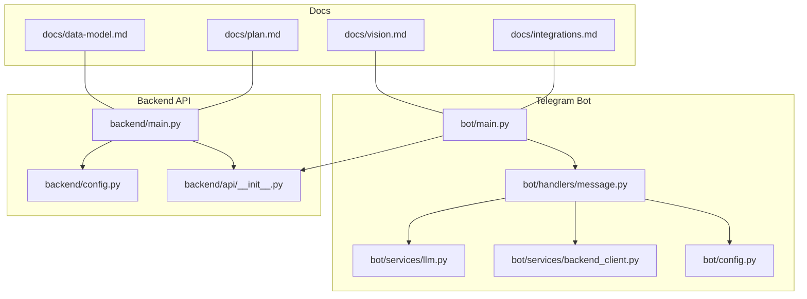
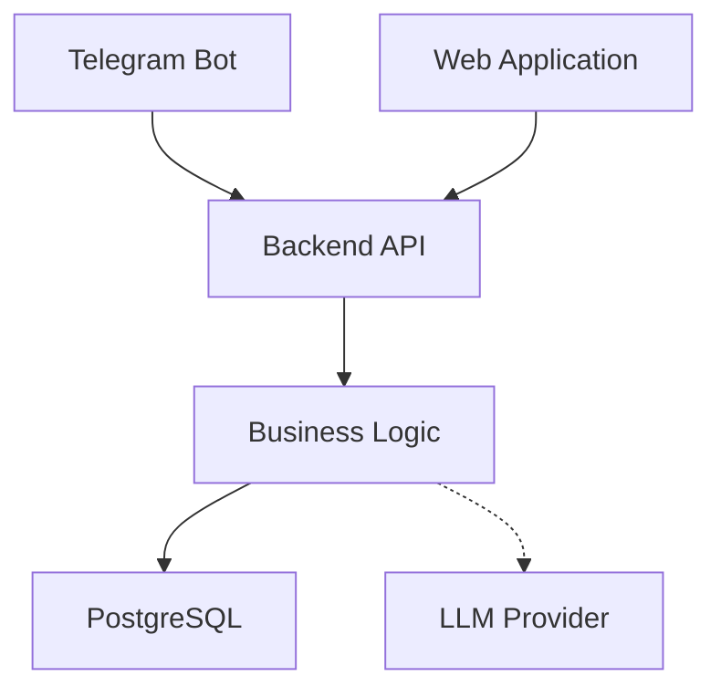
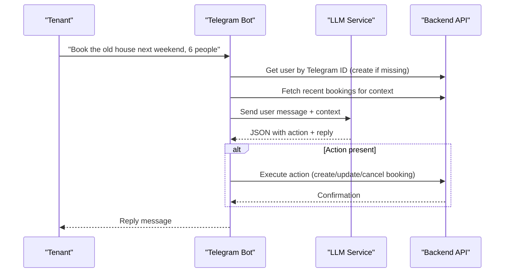
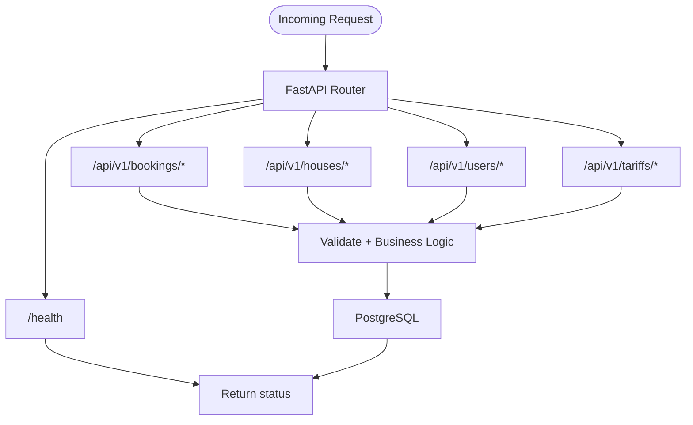
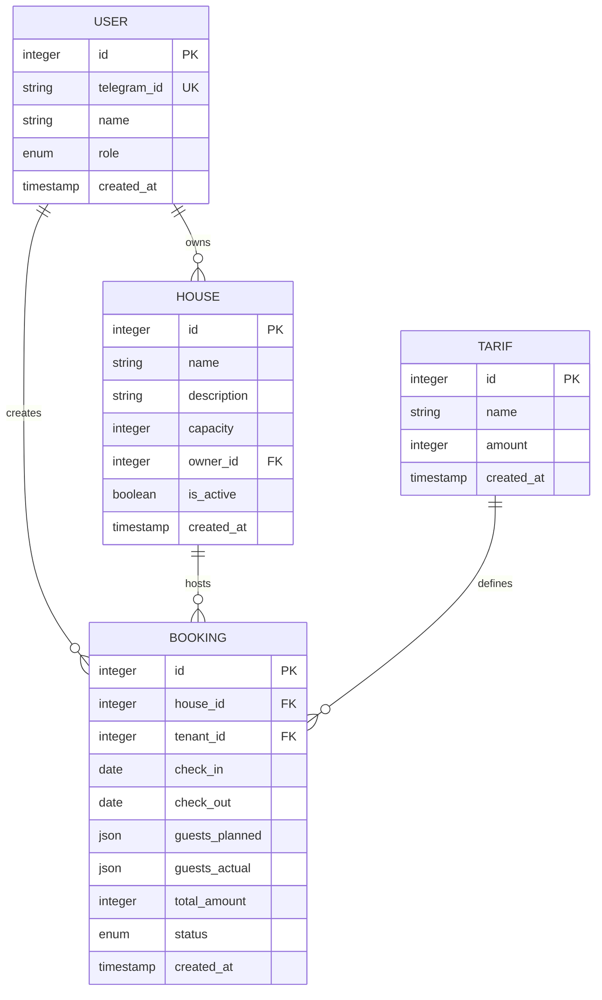
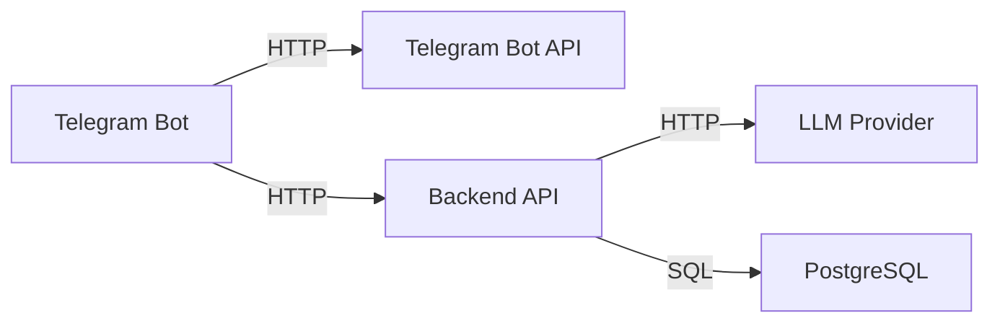

# Project Overview

<cite>
**Referenced Files in This Document**
- [README.md](file://README.md)
- [vision.md](file://docs/vision.md)
- [idea.md](file://docs/idea.md)
- [data-model.md](file://docs/data-model.md)
- [integrations.md](file://docs/integrations.md)
- [plan.md](file://docs/plan.md)
- [bot/main.py](file://bot/main.py)
- [bot/handlers/message.py](file://bot/handlers/message.py)
- [bot/services/llm.py](file://bot/services/llm.py)
- [bot/services/backend_client.py](file://bot/services/backend_client.py)
- [bot/config.py](file://bot/config.py)
- [backend/main.py](file://backend/main.py)
- [backend/config.py](file://backend/config.py)
- [backend/api/__init__.py](file://backend/api/__init__.py)
</cite>

## Table of Contents
1. [Introduction](#introduction)
2. [Project Structure](#project-structure)
3. [Core Components](#core-components)
4. [Architecture Overview](#architecture-overview)
5. [Detailed Component Analysis](#detailed-component-analysis)
6. [Dependency Analysis](#dependency-analysis)
7. [Performance Considerations](#performance-considerations)
8. [Troubleshooting Guide](#troubleshooting-guide)
9. [Conclusion](#conclusion)
10. [Appendices](#appendices)

## Introduction
This project is a natural language booking platform for guest houses. Its core value proposition is replacing traditional booking methods (messengers and spreadsheets) with a conversational interface: users simply describe what they want in everyday language, and the system understands, confirms, and finalizes reservations.

Key stakeholders:
- Tenants: users who book stays at guest houses.
- Owners: hosts who manage calendars, rates, and house inventory.

The system currently consists of:
- A Telegram bot as the first conversational interface.
- A backend API that centralizes business logic, data persistence, and integrations.
- An LLM provider for natural language understanding and response generation.

Practical examples of the natural language booking workflow:
- A tenant says: “Book the old house for next weekend, 6 people.”
- The bot interprets intent, asks clarifying questions if needed, and executes the booking via the backend API.
- The owner receives notifications and can manage availability and rates through the backend.

Current status and roadmap:
- MVP Telegram bot: completed.
- Backend API and persistent storage: completed.
- Upcoming: web applications for tenants and owners, integrations and automation.

**Section sources**
- [README.md:1-133](file://README.md#L1-L133)
- [idea.md:1-55](file://docs/idea.md#L1-L55)
- [vision.md:56-71](file://docs/vision.md#L56-L71)
- [plan.md:29-36](file://docs/plan.md#L29-L36)

## Project Structure
The repository is organized into distinct modules:
- bot/: Telegram bot implementation and LLM integration.
- backend/: FastAPI-based backend with API routes, models, services, and repositories.
- docs/: Product and technical documentation, including architecture, data model, integrations, and roadmap.
- Root-level orchestration files for Docker and local development.

**Diagram sources**
- [bot/main.py:1-46](file://bot/main.py#L1-L46)
- [bot/handlers/message.py:1-436](file://bot/handlers/message.py#L1-L436)
- [bot/services/llm.py:1-106](file://bot/services/llm.py#L1-L106)
- [bot/services/backend_client.py:1-244](file://bot/services/backend_client.py#L1-L244)
- [bot/config.py:1-67](file://bot/config.py#L1-L67)
- [backend/main.py:1-173](file://backend/main.py#L1-L173)
- [backend/config.py:1-25](file://backend/config.py#L1-L25)
- [backend/api/__init__.py:1-15](file://backend/api/__init__.py#L1-L15)
- [docs/vision.md:100-114](file://docs/vision.md#L100-L114)

**Section sources**
- [docs/vision.md:100-114](file://docs/vision.md#L100-L114)
- [README.md:101-124](file://README.md#L101-L124)

## Core Components
- Telegram bot: handles user messages, interacts with LLM, and dispatches actions to the backend API.
- LLM service: orchestrates natural language understanding and response generation with conversation history.
- Backend API: centralized business logic, data access, and REST endpoints for bookings, houses, users, and tariffs.
- Data model: entities and relationships for users, houses, bookings, tariffs, consumables, and stay records.

Key responsibilities:
- Natural language processing and intent extraction via LLM.
- Booking lifecycle management: creation, updates, cancellation, and post-stay recording.
- Persistent storage and retrieval of all domain entities.

**Section sources**
- [bot/handlers/message.py:387-436](file://bot/handlers/message.py#L387-L436)
- [bot/services/llm.py:43-106](file://bot/services/llm.py#L43-L106)
- [backend/main.py:41-65](file://backend/main.py#L41-L65)
- [docs/data-model.md:1-129](file://docs/data-model.md#L1-L129)

## Architecture Overview
The system follows a backend-first architecture:
- Telegram bot and future web clients consume a single backend API.
- Business logic resides in the backend; data is stored in PostgreSQL.
- LLM integration is used for natural language processing.

**Diagram sources**
- [README.md:11-20](file://README.md#L11-L20)
- [vision.md:15-42](file://docs/vision.md#L15-L42)
- [backend/main.py:41-65](file://backend/main.py#L41-L65)

**Section sources**
- [vision.md:15-42](file://docs/vision.md#L15-L42)
- [docs/integrations.md:5-20](file://docs/integrations.md#L5-L20)

## Detailed Component Analysis

### Telegram Bot: Natural Language Booking Flow
The bot processes user messages, builds context, queries the LLM, and executes actions against the backend API.

**Diagram sources**
- [bot/handlers/message.py:387-436](file://bot/handlers/message.py#L387-L436)
- [bot/services/llm.py:80-101](file://bot/services/llm.py#L80-L101)
- [bot/services/backend_client.py:137-151](file://bot/services/backend_client.py#L137-L151)

**Section sources**
- [bot/handlers/message.py:387-436](file://bot/handlers/message.py#L387-L436)
- [bot/services/llm.py:43-106](file://bot/services/llm.py#L43-L106)
- [bot/services/backend_client.py:120-244](file://bot/services/backend_client.py#L120-L244)

### Backend API: REST Endpoints and Lifecycle
The backend exposes REST endpoints under a single router and includes health checks and exception handling.

**Diagram sources**
- [backend/api/__init__.py:1-15](file://backend/api/__init__.py#L1-L15)
- [backend/main.py:41-65](file://backend/main.py#L41-L65)

**Section sources**
- [backend/main.py:41-173](file://backend/main.py#L41-L173)
- [backend/api/__init__.py:1-15](file://backend/api/__init__.py#L1-L15)

### Data Model: Entities and Relationships
The system’s domain model centers around users, houses, bookings, tariffs, and related records.

**Diagram sources**
- [docs/data-model.md:5-129](file://docs/data-model.md#L5-L129)

**Section sources**
- [docs/data-model.md:1-129](file://docs/data-model.md#L1-L129)

## Dependency Analysis
External and internal dependencies:
- Telegram Bot API: bidirectional communication for receiving messages and sending replies.
- Backend API: internal REST API consumed by clients and providers.
- LLM provider (RouterAI): OpenAI-compatible API for natural language processing.
- PostgreSQL: persistent storage for all domain entities.

**Diagram sources**
- [docs/integrations.md:5-20](file://docs/integrations.md#L5-L20)
- [backend/main.py:41-65](file://backend/main.py#L41-L65)

**Section sources**
- [docs/integrations.md:24-69](file://docs/integrations.md#L24-L69)
- [backend/config.py:17-18](file://backend/config.py#L17-L18)

## Performance Considerations
- Conversation history management: limit retained message pairs per chat to control latency and cost.
- Retry and timeout policies: robust error handling for backend and LLM calls.
- Caching and indexing: consider caching calendars and frequently accessed entities to reduce database load.
- Asynchronous processing: keep long-running tasks off the main request thread.

[No sources needed since this section provides general guidance]

## Troubleshooting Guide
Common issues and remedies:
- LLM rate limits or errors: fallback responses and warning logs; verify provider credentials and base URL.
- Backend connectivity: health checks and retry logic; confirm backend URL and network reachability.
- Telegram API problems: webhook vs polling configuration, rate limits, and proxy settings.
- Data consistency: ensure proper date formatting and guest counts; validate booking conflicts before creation.

**Section sources**
- [bot/services/llm.py:80-101](file://bot/services/llm.py#L80-L101)
- [bot/services/backend_client.py:51-112](file://bot/services/backend_client.py#L51-L112)
- [bot/config.py:44-67](file://bot/config.py#L44-L67)
- [backend/main.py:62-167](file://backend/main.py#L62-L167)

## Conclusion
This project delivers a pragmatic, backend-first solution that replaces traditional booking workflows with a conversational Telegram bot powered by an LLM. The backend consolidates business logic and data, enabling future expansion to web clients and integrations. The documented roadmap outlines incremental steps toward a full platform with tenant and owner web apps, plus automated integrations.

[No sources needed since this section summarizes without analyzing specific files]

## Appendices

### Practical Examples: Natural Language Booking Scenarios
- Example 1: “Book the old house for next weekend, 6 people.”
- Example 2: “We are coming March 1st for 3 days, 3 people.”
- Example 3: “Looking for holidays on May Day, 12 people.”

These examples demonstrate how the bot interprets intent, clarifies missing details, and executes bookings through the backend API.

**Section sources**
- [idea.md:11-18](file://docs/idea.md#L11-L18)
- [bot/config.py:7-41](file://bot/config.py#L7-L41)

### Current Status and Roadmap
- Stage 0 (MVP Telegram bot): Done.
- Stage 1 (Backend API and database): Done.
- Stage 2 (Tenant web app): Planned.
- Stage 3 (Owner dashboard): Planned.
- Stage 4 (Integrations and automation): Planned.

**Section sources**
- [plan.md:29-36](file://docs/plan.md#L29-L36)
- [plan.md:41-98](file://docs/plan.md#L41-L98)