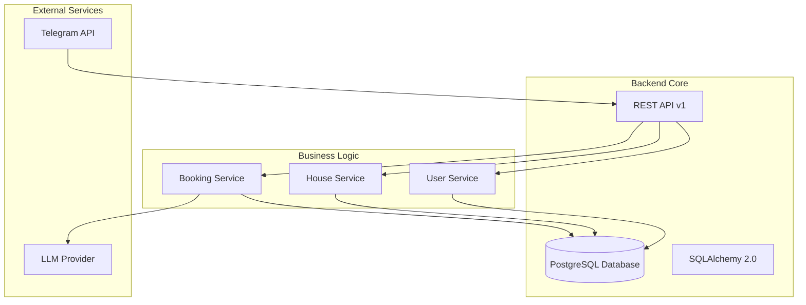
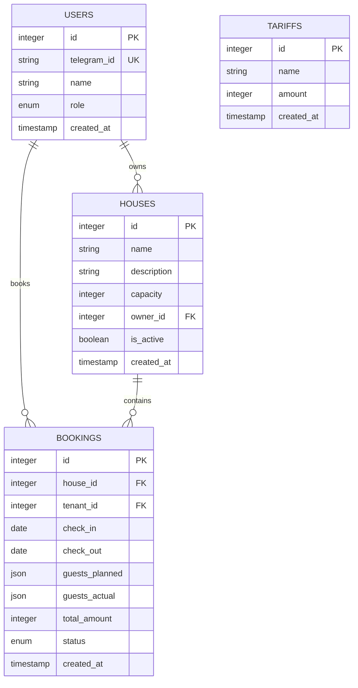
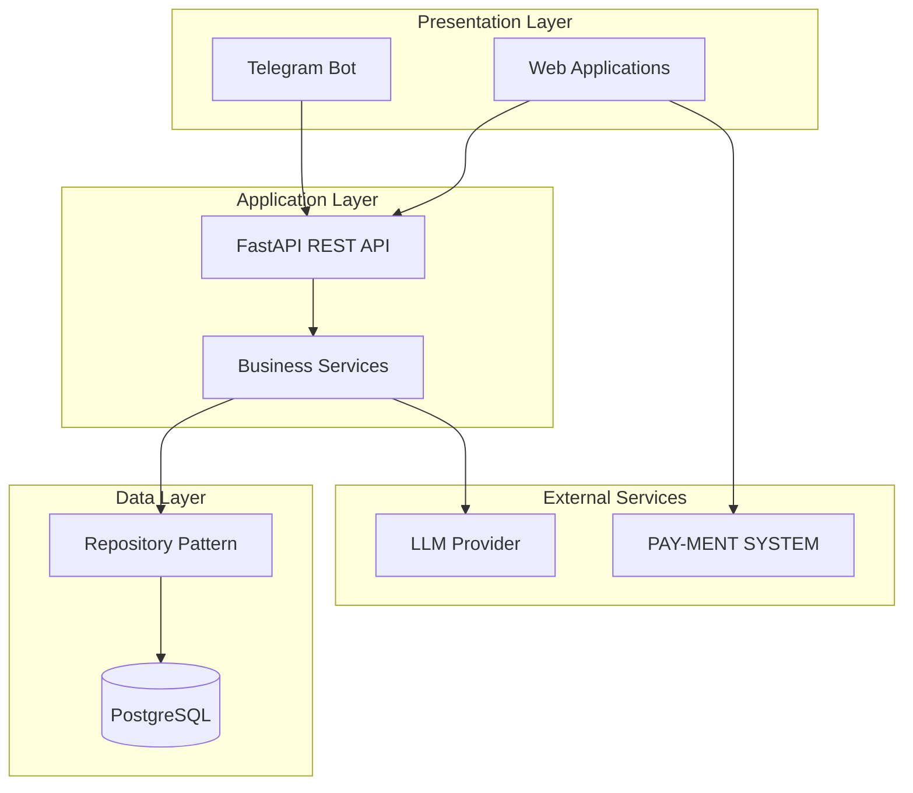

# Project Status and Roadmap

<cite>
**Referenced Files in This Document**
- [README.md](file://README.md)
- [docs/vision.md](file://docs/vision.md)
- [docs/plan.md](file://docs/plan.md)
- [docs/tasks/tasklist-backend.md](file://docs/tasks/tasklist-backend.md)
- [docs/tasks/tasklist-web-tenant.md](file://docs/tasks/tasklist-web-tenant.md)
- [docs/tasks/tasklist-web-owner.md](file://docs/tasks/tasklist-web-owner.md)
- [docs/integrations.md](file://docs/integrations.md)
- [backend/main.py](file://backend/main.py)
- [backend/api/bookings.py](file://backend/api/bookings.py)
- [backend/api/houses.py](file://backend/api/houses.py)
- [backend/api/users.py](file://backend/api/users.py)
- [backend/database.py](file://backend/database.py)
- [backend/models/booking.py](file://backend/models/booking.py)
- [backend/models/house.py](file://backend/models/house.py)
- [backend/models/user.py](file://backend/models/user.py)
- [alembic/versions/2a84cf51810b_initial_migration.py](file://alembic/versions/2a84cf51810b_initial_migration.py)
- [bot/main.py](file://bot/main.py)
</cite>

## Table of Contents
1. [Introduction](#introduction)
2. [Current Development Stage](#current-development-stage)
3. [Milestone Achievements](#milestone-achievements)
4. [Planned Features and Timeline](#planned-features-and-timeline)
5. [Development Methodology](#development-methodology)
6. [Progress Tracking Mechanisms](#progress-tracking-mechanisms)
7. [Task Management Approach](#task-management-approach)
8. [Quality Assurance Processes](#quality-assurance-processes)
9. [Architecture Overview](#architecture-overview)
10. [Current Limitations and Known Issues](#current-limitations-and-known-issues)
11. [Community Contribution Opportunities](#community-contribution-opportunities)
12. [Conclusion](#conclusion)

## Introduction

This document provides a comprehensive overview of the project's current status and future roadmap. The system is a rural property booking platform that enables natural language reservations through a Telegram bot, with a backend API and database serving as the central nervous system. The project follows a structured, incremental development approach with clear milestones and transparent progress tracking.

## Current Development Stage

The project has successfully completed two major development phases:

### Phase 0: MVP Telegram Bot
- **Status**: ✅ Done
- **Achievement**: Working Telegram bot that processes natural language booking requests
- **Key capability**: Users can book rural properties through conversational messages
- **Data storage**: In-memory persistence during MVP phase

### Phase 1: Backend API and Database
- **Status**: ✅ Done  
- **Achievement**: Complete backend API with persistent data storage
- **Core components**: REST API endpoints, PostgreSQL database, SQLAlchemy ORM
- **Integration**: Telegram bot now communicates exclusively through backend API
- **Infrastructure**: Dockerized deployment with proper environment configuration

**Section sources**
- [README.md:22-31](file://README.md#L22-L31)
- [docs/plan.md:29-36](file://docs/plan.md#L29-L36)
- [docs/tasks/tasklist-backend.md:318-378](file://docs/tasks/tasklist-backend.md#L318-L378)

## Milestone Achievements

### Backend Infrastructure Completion
The backend system now provides a robust foundation for all client applications:

**Diagram sources**
- [backend/main.py:41-64](file://backend/main.py#L41-L64)
- [backend/database.py:8-23](file://backend/database.py#L8-L23)
- [docs/integrations.md:5-20](file://docs/integrations.md#L5-L20)

### Database Implementation
The system now features a complete relational database schema with proper relationships:

**Diagram sources**
- [backend/models/user.py:19-32](file://backend/models/user.py#L19-L32)
- [backend/models/house.py:9-24](file://backend/models/house.py#L9-L24)
- [backend/models/booking.py:20-41](file://backend/models/booking.py#L20-L41)
- [alembic/versions/2a84cf51810b_initial_migration.py:21-69](file://alembic/versions/2a84cf51810b_initial_migration.py#L21-L69)

**Section sources**
- [docs/tasks/tasklist-backend.md:318-378](file://docs/tasks/tasklist-backend.md#L318-L378)
- [backend/database.py:1-41](file://backend/database.py#L1-L41)
- [alembic/versions/2a84cf51810b_initial_migration.py:1-84](file://alembic/versions/2a84cf51810b_initial_migration.py#L1-L84)

## Planned Features and Timeline

### Phase 2: Web Application for Tenants
**Status**: 📋 Planned
**Target Completion**: Q2 2025
**Key Features**:
- Personal tenant dashboard
- Property browsing with calendar visualization
- Booking management interface
- Trip history and notes
- Telegram OAuth authentication

### Phase 3: Owner Dashboard
**Status**: 📋 Planned  
**Target Completion**: Q3 2025
**Key Features**:
- Property management interface
- Availability calendar controls
- Tariff management system
- Inventory tracking
- Business analytics dashboard

### Phase 4: Integrations and Automation
**Status**: 📋 Planned
**Target Completion**: Q4 2025
**Key Features**:
- Payment processing integration
- Automated notification system
- Circuit breaker for external services
- Backup LLM provider integration

**Section sources**
- [docs/plan.md:65-98](file://docs/plan.md#L65-L98)
- [docs/tasks/tasklist-web-tenant.md:15-29](file://docs/tasks/tasklist-web-tenant.md#L15-L29)
- [docs/tasks/tasklist-web-owner.md:15-29](file://docs/tasks/tasklist-web-owner.md#L15-L29)

## Development Methodology

### Backend-First Architecture
The project follows a strict backend-first development approach where business logic resides in the central API, with clients (Telegram bot, web applications) acting as presentation layers.

### Incremental Evolution
Each phase delivers a working product increment with measurable value, avoiding large-scale releases in favor of continuous delivery.

### Parallel Development
Backend completion enables simultaneous development of multiple client applications without duplicating business logic.

**Section sources**
- [docs/vision.md:118-125](file://docs/vision.md#L118-L125)
- [docs/plan.md:9-17](file://docs/plan.md#L9-L17)

## Progress Tracking Mechanisms

### Task-Based Progression
Each development phase is broken down into specific tasks with clear completion criteria and deliverables.

### Status Indicators
- **✅ Done**: Criteria met and tested
- **📋 Planned**: Ready for development
- **🚧 In Progress**: Active development
- **🚫 Blocked**: Waiting on external dependencies

### Documentation Integration
Progress is continuously reflected in:
- Task lists with current status
- API documentation updates
- Architecture evolution tracking
- Integration specifications

**Section sources**
- [docs/plan.md:18-26](file://docs/plan.md#L18-L26)
- [docs/tasks/tasklist-backend.md:20-25](file://docs/tasks/tasklist-backend.md#L20-L25)

## Task Management Approach

### Iteration-Based Planning
Each phase contains multiple iterations focusing on specific functional areas with clear acceptance criteria.

### Cross-Functional Coordination
- Backend services development
- Frontend application building  
- Database schema evolution
- Integration setup
- Testing and quality assurance

### Resource Allocation
Tasks are prioritized based on dependency relationships and business value, allowing for optimal resource utilization.

**Section sources**
- [docs/tasks/tasklist-backend.md:11-19](file://docs/tasks/tasklist-backend.md#L11-L19)
- [docs/tasks/tasklist-web-tenant.md:3-5](file://docs/tasks/tasklist-web-tenant.md#L3-L5)
- [docs/tasks/tasklist-web-owner.md:3-5](file://docs/tasks/tasklist-web-owner.md#L3-L5)

## Quality Assurance Processes

### Testing Strategy
- **Unit Testing**: Service-layer testing with comprehensive coverage
- **Integration Testing**: API endpoint validation
- **End-to-End Testing**: Complete workflow verification
- **Database Testing**: Test database with proper fixtures

### Code Quality Standards
- **Linting**: Ruff for Python code formatting and style
- **Type Checking**: MyPy for static type validation
- **Pre-commit Hooks**: Automated quality checks
- **Documentation**: OpenAPI/Swagger for API documentation

### Monitoring and Observability
- **Health Checks**: `/health` endpoint for system status
- **Structured Logging**: Centralized logging with context
- **Metrics Collection**: Prometheus metrics for system monitoring

**Section sources**
- [docs/tasks/tasklist-backend.md:491-517](file://docs/tasks/tasklist-backend.md#L491-L517)
- [backend/main.py:62-166](file://backend/main.py#L62-L166)

## Architecture Overview

The system follows a clean, layered architecture with clear separation of concerns:

**Diagram sources**
- [docs/vision.md:15-42](file://docs/vision.md#L15-L42)
- [backend/main.py:41-59](file://backend/main.py#L41-L59)
- [docs/integrations.md:33-47](file://docs/integrations.md#L33-L47)

## Current Limitations and Known Issues

### Authentication Gaps
- **Temporary Solution**: Hardcoded user IDs in API endpoints
- **Impact**: Limited multi-user support in current implementation
- **Timeline**: Addressed in upcoming authentication implementation

### Development Environment Dependencies
- **External Services**: Requires active Telegram Bot API and LLM provider
- **Network Requirements**: Internet connectivity for full functionality
- **Environment Setup**: Proper `.env` configuration required

### Technical Debt Areas
- **Hardcoded Values**: Temporary placeholders awaiting dynamic configuration
- **Limited Error Handling**: Some edge cases require additional validation
- **Testing Coverage**: Ongoing expansion of test suite

**Section sources**
- [backend/api/bookings.py:123-126](file://backend/api/bookings.py#L123-L126)
- [backend/api/houses.py:117-119](file://backend/api/houses.py#L117-L119)
- [docs/integrations.md:52-69](file://docs/integrations.md#L52-L69)

## Community Contribution Opportunities

### Areas Needing Development
- **Web Application Development**: Tenant and owner dashboards
- **Authentication System**: Secure user management and OAuth integration
- **Payment Integration**: Payment processing system implementation
- **Testing Enhancement**: Expanded test coverage and automation
- **Documentation**: API documentation and developer guides

### Skill Requirements by Area
- **Frontend Development**: React/Vue.js for web applications
- **Backend Development**: Python/FastAPI for API enhancements  
- **DevOps**: Docker containerization and deployment automation
- **Database Design**: Schema optimization and performance tuning
- **Quality Assurance**: Testing framework development

### Contribution Guidelines
- **Code Style**: Follow established Ruff and MyPy standards
- **Documentation**: Update task lists and API documentation
- **Testing**: Include comprehensive test coverage
- **Communication**: Use GitHub Issues for coordination

**Section sources**
- [docs/tasks/tasklist-web-tenant.md:15-29](file://docs/tasks/tasklist-web-tenant.md#L15-L29)
- [docs/tasks/tasklist-web-owner.md:15-29](file://docs/tasks/tasklist-web-owner.md#L15-L29)
- [docs/tasks/tasklist-backend.md:491-517](file://docs/tasks/tasklist-backend.md#L491-L517)

## Conclusion

The project has successfully established a solid foundation with the completion of MVP Telegram bot and backend infrastructure. The clear roadmap with four defined phases provides a structured path toward a complete booking platform. Current limitations are temporary and will be resolved as subsequent phases are completed. The transparent task management approach and comprehensive documentation enable both internal development and community contributions to move the project forward effectively.

The backend-first architecture ensures scalability and maintainability, while the incremental development methodology allows for continuous delivery of value. With proper resource allocation and community engagement, the project is well-positioned to become a comprehensive rural property booking solution.