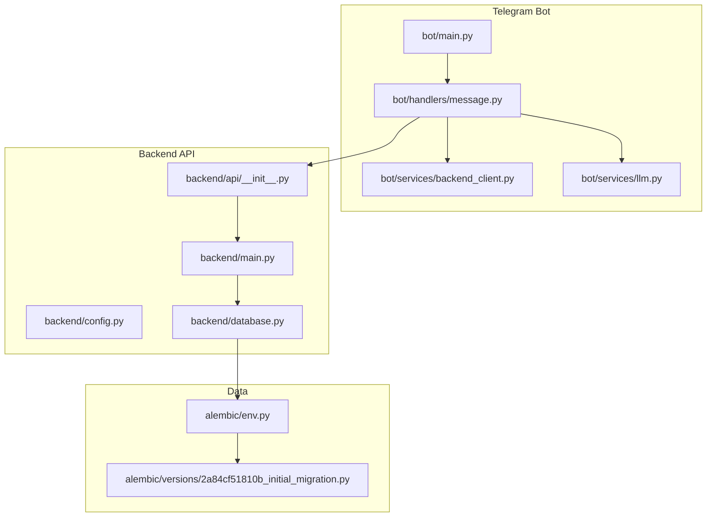
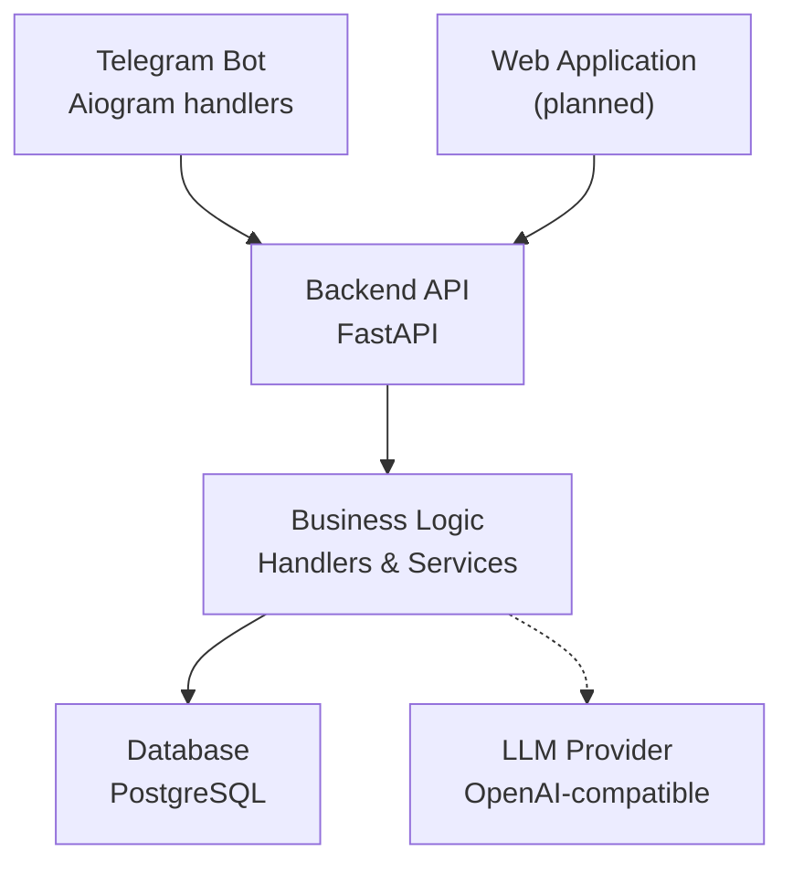
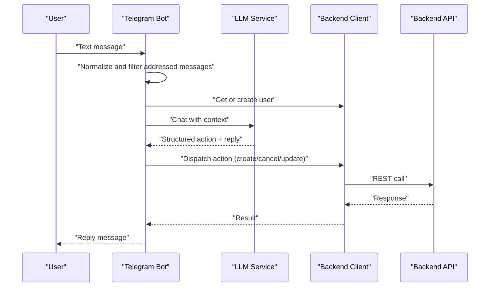
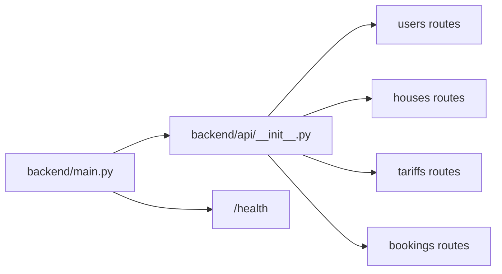
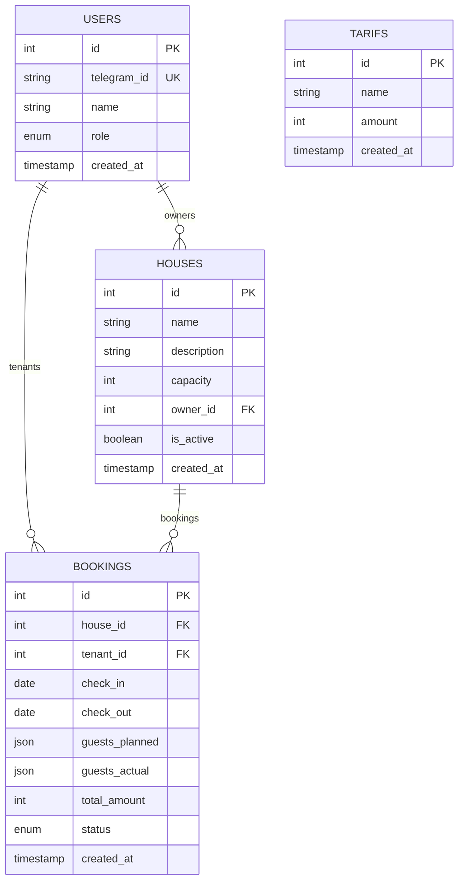
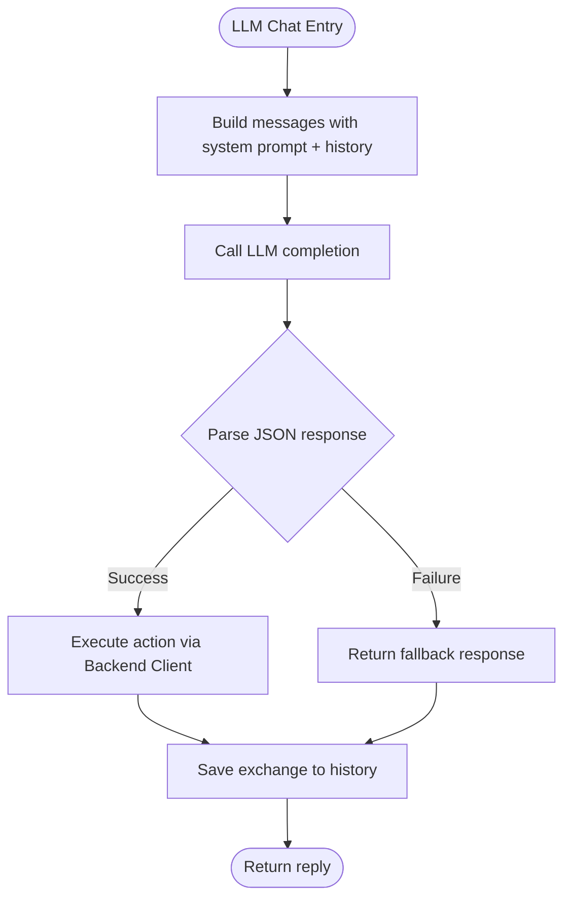
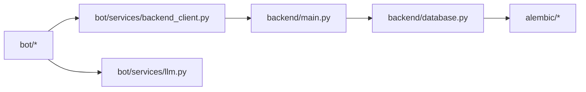
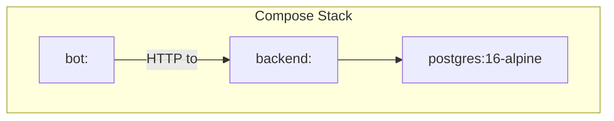

# System Architecture Overview

<cite>
**Referenced Files in This Document**
- [README.md](file://README.md)
- [docker-compose.yaml](file://docker-compose.yaml)
- [Dockerfile](file://Dockerfile)
- [pyproject.toml](file://pyproject.toml)
- [bot/main.py](file://bot/main.py)
- [bot/handlers/message.py](file://bot/handlers/message.py)
- [bot/services/backend_client.py](file://bot/services/backend_client.py)
- [bot/services/llm.py](file://bot/services/llm.py)
- [backend/main.py](file://backend/main.py)
- [backend/config.py](file://backend/config.py)
- [backend/database.py](file://backend/database.py)
- [backend/api/__init__.py](file://backend/api/__init__.py)
- [backend/models/__init__.py](file://backend/models/__init__.py)
- [backend/schemas/__init__.py](file://backend/schemas/__init__.py)
- [alembic/env.py](file://alembic/env.py)
- [alembic/versions/2a84cf51810b_initial_migration.py](file://alembic/versions/2a84cf51810b_initial_migration.py)
</cite>

## Table of Contents
1. [Introduction](#introduction)
2. [Project Structure](#project-structure)
3. [Core Components](#core-components)
4. [Architecture Overview](#architecture-overview)
5. [Detailed Component Analysis](#detailed-component-analysis)
6. [Dependency Analysis](#dependency-analysis)
7. [Performance Considerations](#performance-considerations)
8. [Security Aspects](#security-aspects)
9. [Scalability Considerations](#scalability-considerations)
10. [Deployment Topology](#deployment-topology)
11. [Cross-Cutting Concerns](#cross-cutting-concerns)
12. [Troubleshooting Guide](#troubleshooting-guide)
13. [Conclusion](#conclusion)

## Introduction
This document presents the fullstack architecture of a natural-language booking system for rural houses. The system centers on a Telegram bot that serves as the primary user interface, communicating with a backend API, business logic layer, persistent storage, and an LLM provider. It explains component interactions, data flows, technology stack choices, deployment topology, system boundaries, and operational concerns such as scalability and security.

## Project Structure
The repository is organized into distinct layers:
- Telegram bot: event-driven message handling, LLM orchestration, and backend API client
- Backend API: FastAPI application exposing REST endpoints for users, houses, tariffs, and bookings
- Data layer: SQLAlchemy async ORM with Alembic migrations for PostgreSQL
- Configuration and deployment: Pydantic settings, Docker Compose, and containerization

**Diagram sources**
- [bot/main.py:1-46](file://bot/main.py#L1-L46)
- [bot/handlers/message.py:1-436](file://bot/handlers/message.py#L1-L436)
- [bot/services/backend_client.py:1-244](file://bot/services/backend_client.py#L1-L244)
- [bot/services/llm.py:1-106](file://bot/services/llm.py#L1-L106)
- [backend/main.py:1-173](file://backend/main.py#L1-L173)
- [backend/api/__init__.py:1-15](file://backend/api/__init__.py#L1-L15)
- [backend/config.py:1-25](file://backend/config.py#L1-L25)
- [backend/database.py:1-41](file://backend/database.py#L1-L41)
- [alembic/env.py:1-95](file://alembic/env.py#L1-L95)
- [alembic/versions/2a84cf51810b_initial_migration.py:1-84](file://alembic/versions/2a84cf51810b_initial_migration.py#L1-L84)

**Section sources**
- [README.md:11-20](file://README.md#L11-L20)
- [docker-compose.yaml:1-43](file://docker-compose.yaml#L1-L43)
- [Dockerfile:1-13](file://Dockerfile#L1-L13)
- [pyproject.toml:1-32](file://pyproject.toml#L1-L32)

## Core Components
- Telegram Bot
  - Initializes Aiogram dispatcher, registers handlers, and injects shared services
  - Orchestrates LLM interactions and backend API calls
- Backend API
  - FastAPI app with CORS, health endpoint, and centralized exception handling
  - Aggregates modular routers for users, houses, tariffs, and bookings
- Data Layer
  - Async SQLAlchemy engine and session factory
  - Alembic migrations for schema evolution
- LLM Provider
  - OpenAI-compatible client with chat completions and rate-limit handling
  - Per-chat history management with bounded context

**Section sources**
- [bot/main.py:15-46](file://bot/main.py#L15-L46)
- [bot/handlers/message.py:387-436](file://bot/handlers/message.py#L387-L436)
- [backend/main.py:41-65](file://backend/main.py#L41-L65)
- [backend/main.py:67-167](file://backend/main.py#L67-L167)
- [backend/database.py:8-41](file://backend/database.py#L8-L41)
- [alembic/env.py:70-95](file://alembic/env.py#L70-L95)
- [bot/services/llm.py:43-106](file://bot/services/llm.py#L43-L106)

## Architecture Overview
The system follows a layered architecture:
- Presentation Layer: Telegram bot handles user intent and conversational UX
- Application Layer: Backend API exposes typed endpoints and enforces domain policies
- Business Logic Layer: Handlers parse LLM responses, validate parameters, and dispatch actions
- Data Access Layer: Repositories and schemas mediate persistence and validation
- Persistence Layer: PostgreSQL with Alembic migrations
- AI Integration: LLM provider supplies structured action extraction and contextual replies

**Diagram sources**
- [README.md:13-20](file://README.md#L13-L20)
- [bot/handlers/message.py:387-436](file://bot/handlers/message.py#L387-L436)
- [backend/main.py:41-65](file://backend/main.py#L41-L65)
- [backend/database.py:8-41](file://backend/database.py#L8-L41)
- [bot/services/llm.py:43-106](file://bot/services/llm.py#L43-L106)

## Detailed Component Analysis

### Telegram Bot: Message Flow
The bot processes incoming messages, normalizes user intent via LLM, and executes backend actions.

**Diagram sources**
- [bot/handlers/message.py:387-436](file://bot/handlers/message.py#L387-L436)
- [bot/services/llm.py:80-101](file://bot/services/llm.py#L80-L101)
- [bot/services/backend_client.py:124-231](file://bot/services/backend_client.py#L124-L231)
- [backend/main.py:59](file://backend/main.py#L59)

**Section sources**
- [bot/handlers/message.py:26-58](file://bot/handlers/message.py#L26-L58)
- [bot/handlers/message.py:66-89](file://bot/handlers/message.py#L66-L89)
- [bot/handlers/message.py:147-158](file://bot/handlers/message.py#L147-L158)
- [bot/handlers/message.py:285-323](file://bot/handlers/message.py#L285-L323)

### Backend API: Endpoint Composition
The backend aggregates modular routers and exposes health checks and domain endpoints.

**Diagram sources**
- [backend/main.py:59](file://backend/main.py#L59)
- [backend/api/__init__.py:3-14](file://backend/api/__init__.py#L3-L14)

**Section sources**
- [backend/main.py:41-65](file://backend/main.py#L41-L65)
- [backend/api/__init__.py:1-15](file://backend/api/__init__.py#L1-L15)

### Data Model: Entities and Relationships
The schema defines core entities and their relationships.

**Diagram sources**
- [alembic/versions/2a84cf51810b_initial_migration.py:23-68](file://alembic/versions/2a84cf51810b_initial_migration.py#L23-L68)

**Section sources**
- [alembic/versions/2a84cf51810b_initial_migration.py:21-84](file://alembic/versions/2a84cf51810b_initial_migration.py#L21-L84)
- [backend/models/__init__.py:1-16](file://backend/models/__init__.py#L1-L16)

### LLM Integration: Structured Action Extraction
The LLM service builds a system prompt with today’s date and current bookings context, maintains per-chat history, and returns structured JSON for downstream action dispatch.

**Diagram sources**
- [bot/services/llm.py:55-101](file://bot/services/llm.py#L55-L101)
- [bot/handlers/message.py:147-158](file://bot/handlers/message.py#L147-L158)

**Section sources**
- [bot/services/llm.py:43-106](file://bot/services/llm.py#L43-L106)
- [bot/handlers/message.py:66-89](file://bot/handlers/message.py#L66-L89)

## Dependency Analysis
- Internal dependencies
  - Bot handlers depend on backend client and LLM service
  - Backend main composes routers and applies middleware
  - Database module provides async engine and session factory
- External dependencies
  - Aiogram for Telegram integration
  - FastAPI/Uvicorn for backend API
  - SQLAlchemy asyncpg for database
  - Alembic for migrations
  - OpenAI client for LLM

**Diagram sources**
- [bot/handlers/message.py:387-436](file://bot/handlers/message.py#L387-L436)
- [bot/services/backend_client.py:124-231](file://bot/services/backend_client.py#L124-L231)
- [bot/services/llm.py:43-106](file://bot/services/llm.py#L43-L106)
- [backend/main.py:59](file://backend/main.py#L59)
- [backend/database.py:8-41](file://backend/database.py#L8-L41)
- [alembic/env.py:70-95](file://alembic/env.py#L70-L95)

**Section sources**
- [pyproject.toml:6-18](file://pyproject.toml#L6-L18)
- [backend/database.py:8-41](file://backend/database.py#L8-L41)

## Performance Considerations
- Asynchronous I/O
  - Bot uses async HTTP client and LLM client to avoid blocking I/O
  - Backend employs async SQLAlchemy sessions for concurrent requests
- Caching and context
  - LLM history is bounded per chat to control token usage
  - Backend client retries on transient errors with capped attempts
- Database scaling
  - Asyncpg and async SQLAlchemy enable efficient connection pooling
  - Consider read replicas and connection limits for high concurrency
- API throughput
  - FastAPI’s native async runtime minimizes overhead
  - Add rate limiting and circuit breakers for external LLM calls

[No sources needed since this section provides general guidance]

## Security Aspects
- Secrets management
  - Environment variables for tokens and keys; ensure secrets are not committed
- Transport security
  - HTTPS for API exposure; restrict CORS origins in production
- Authentication and authorization
  - Telegram bot authenticates via token; backend should enforce RBAC for user roles
- Input validation
  - Strict parsing and coercion of dates and integers in handlers
- LLM safety
  - Sanitize prompts and monitor for hallucinations; apply guardrails in system prompt

[No sources needed since this section provides general guidance]

## Scalability Considerations
- Horizontal scaling
  - Backend can be scaled behind a load balancer; stateless design supports multiple replicas
  - Bot can run multiple instances; ensure idempotent booking operations
- Database
  - Use connection pooling and consider read replicas for reporting queries
  - Partition or shard by tenant/house if growth demands
- LLM costs and quotas
  - Implement request throttling and fallback responses
  - Cache frequent queries and reduce context length where possible
- Observability
  - Add metrics, tracing, and structured logs across components

[No sources needed since this section provides general guidance]

## Deployment Topology
The system runs with Docker Compose:
- PostgreSQL service with healthchecks
- Backend service built from Dockerfile.backend, configured via environment variables
- Bot service built from root Dockerfile, running the bot entrypoint

**Diagram sources**
- [docker-compose.yaml:1-43](file://docker-compose.yaml#L1-L43)
- [Dockerfile:1-13](file://Dockerfile#L1-L13)

**Section sources**
- [docker-compose.yaml:16-40](file://docker-compose.yaml#L16-L40)
- [Dockerfile:1-13](file://Dockerfile#L1-L13)

## Cross-Cutting Concerns
- Configuration
  - Pydantic settings with environment prefix for backend
- Logging
  - Centralized logging across bot, handlers, services, and API
- Error handling
  - Dedicated exceptions and JSON error responses in backend
  - Retry and fallback strategies in bot services
- API contracts
  - Typed schemas and paginated responses for robust integrations

**Section sources**
- [backend/config.py:4-25](file://backend/config.py#L4-L25)
- [backend/main.py:67-167](file://backend/main.py#L67-L167)
- [bot/services/backend_client.py:17-24](file://bot/services/backend_client.py#L17-L24)
- [bot/services/llm.py:15-18](file://bot/services/llm.py#L15-L18)

## Troubleshooting Guide
- Health checks
  - Verify backend health endpoint responds successfully
- Database connectivity
  - Confirm PostgreSQL is healthy and migrations applied
- LLM availability
  - Monitor rate limits and fallback responses
- Bot connectivity
  - Check proxy configuration and network reachability

**Section sources**
- [README.md:75-76](file://README.md#L75-L76)
- [docker-compose.yaml:10-14](file://docker-compose.yaml#L10-L14)
- [bot/services/llm.py:90-98](file://bot/services/llm.py#L90-L98)

## Conclusion
The system integrates a Telegram bot, a FastAPI backend, an async data layer, and an LLM provider into a cohesive fullstack solution. Its modular design, asynchronous foundations, and containerized deployment support incremental evolution toward a web application and administrative panels, while maintaining clear separation of concerns and operational simplicity.