# Component Interactions

<cite>
**Referenced Files in This Document**
- [bot/main.py](file://bot/main.py)
- [bot/handlers/message.py](file://bot/handlers/message.py)
- [bot/services/backend_client.py](file://bot/services/backend_client.py)
- [bot/services/llm.py](file://bot/services/llm.py)
- [bot/config.py](file://bot/config.py)
- [backend/main.py](file://backend/main.py)
- [backend/api/__init__.py](file://backend/api/__init__.py)
- [backend/api/bookings.py](file://backend/api/bookings.py)
- [backend/api/users.py](file://backend/api/users.py)
- [backend/api/houses.py](file://backend/api/houses.py)
- [backend/database.py](file://backend/database.py)
- [backend/models/booking.py](file://backend/models/booking.py)
- [backend/schemas/booking.py](file://backend/schemas/booking.py)
- [backend/schemas/user.py](file://backend/schemas/user.py)
</cite>

## Table of Contents
1. [Introduction](#introduction)
2. [Project Structure](#project-structure)
3. [Core Components](#core-components)
4. [Architecture Overview](#architecture-overview)
5. [Detailed Component Analysis](#detailed-component-analysis)
6. [Dependency Analysis](#dependency-analysis)
7. [Performance Considerations](#performance-considerations)
8. [Troubleshooting Guide](#troubleshooting-guide)
9. [Conclusion](#conclusion)

## Introduction
This document explains how the booking system composes its components and orchestrates interactions across the Telegram bot, Large Language Model (LLM) service, backend API, and database layer. It documents the end-to-end message flow from user input through natural language understanding to booking creation, and covers the BackendClient service for HTTP communication, LLM integration patterns, API gateway exposure, asynchronous patterns, and state management.

## Project Structure
The system is organized into two primary applications:
- Telegram Bot: Handles user input, orchestrates LLM interpretation, executes actions via BackendClient, and responds to users.
- Backend API: Exposes REST endpoints for users, houses, tariffs, and bookings; integrates with a database via SQLAlchemy async sessions.

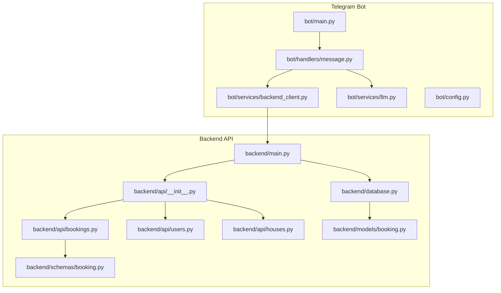

**Diagram sources**
- [bot/main.py:15-41](file://bot/main.py#L15-L41)
- [bot/handlers/message.py:387-436](file://bot/handlers/message.py#L387-L436)
- [bot/services/backend_client.py:26-118](file://bot/services/backend_client.py#L26-L118)
- [bot/services/llm.py:43-101](file://bot/services/llm.py#L43-L101)
- [bot/config.py:44-66](file://bot/config.py#L44-L66)
- [backend/main.py:41-59](file://backend/main.py#L41-L59)
- [backend/api/__init__.py:1-15](file://backend/api/__init__.py#L1-L15)
- [backend/api/bookings.py:17-223](file://backend/api/bookings.py#L17-L223)
- [backend/api/users.py:16-223](file://backend/api/users.py#L16-L223)
- [backend/api/houses.py:18-266](file://backend/api/houses.py#L18-L266)
- [backend/database.py:8-41](file://backend/database.py#L8-L41)
- [backend/models/booking.py:20-41](file://backend/models/booking.py#L20-L41)
- [backend/schemas/booking.py:35-133](file://backend/schemas/booking.py#L35-L133)

**Section sources**
- [bot/main.py:15-41](file://bot/main.py#L15-L41)
- [backend/main.py:41-59](file://backend/main.py#L41-L59)

## Core Components
- Telegram Bot entrypoint initializes logging, Aiogram dispatcher, and injects shared services (BackendClient and LLMService) into the dispatcher context.
- Message handler filters user messages, ensures the bot is addressed, resolves or creates a user, builds contextual information, queries the LLM, parses structured JSON, and dispatches actions to the backend.
- BackendClient encapsulates HTTP communication with the backend API, including retries, timeouts, and typed CRUD operations for users, houses, bookings, and tariffs.
- LLMService wraps an OpenAI-compatible client, maintains per-chat histories, constructs system prompts with current date and booking context, and returns structured JSON responses.
- Backend API exposes REST endpoints under a unified router, with exception handlers and CORS enabled. It depends on services and schemas to enforce validation and response contracts.
- Database layer uses SQLAlchemy async engine and session factory; models define the booking entity and its status enumeration.

**Section sources**
- [bot/main.py:15-41](file://bot/main.py#L15-L41)
- [bot/handlers/message.py:387-436](file://bot/handlers/message.py#L387-L436)
- [bot/services/backend_client.py:26-118](file://bot/services/backend_client.py#L26-L118)
- [bot/services/llm.py:43-101](file://bot/services/llm.py#L43-L101)
- [backend/main.py:41-59](file://backend/main.py#L41-L59)
- [backend/api/__init__.py:1-15](file://backend/api/__init__.py#L1-L15)
- [backend/database.py:8-41](file://backend/database.py#L8-L41)
- [backend/models/booking.py:20-41](file://backend/models/booking.py#L20-L41)

## Architecture Overview
The system follows a layered architecture:
- Presentation Layer: Telegram Bot receives user messages and renders responses.
- Orchestration Layer: Message handler coordinates LLM interpretation and backend action execution.
- Integration Layer: BackendClient abstracts HTTP calls to the backend API.
- API Gateway: FastAPI app aggregates routers and exposes endpoints under /api/v1.
- Persistence Layer: SQLAlchemy async ORM manages bookings and related entities.

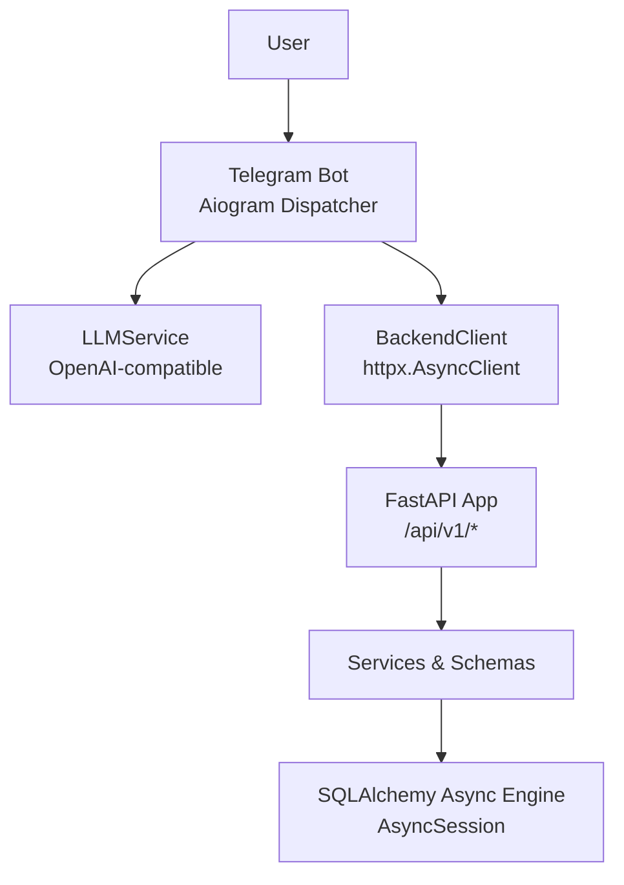

**Diagram sources**
- [bot/handlers/message.py:387-436](file://bot/handlers/message.py#L387-L436)
- [bot/services/backend_client.py:26-118](file://bot/services/backend_client.py#L26-L118)
- [backend/main.py:41-59](file://backend/main.py#L41-L59)
- [backend/api/__init__.py:1-15](file://backend/api/__init__.py#L1-L15)
- [backend/database.py:8-41](file://backend/database.py#L8-L41)

## Detailed Component Analysis

### Telegram Bot: Message Flow and Intent Execution
The bot’s message handler performs:
- Addressing detection (private chat, mention, or reply).
- User resolution: fetch or create a user record via BackendClient.
- Context building: fetch active bookings to inform LLM decisions.
- LLM invocation: send system prompt + chat history + user message.
- Response parsing: extract structured JSON with action and parameters.
- Action dispatch: validate and execute create/cancel/update booking against backend.

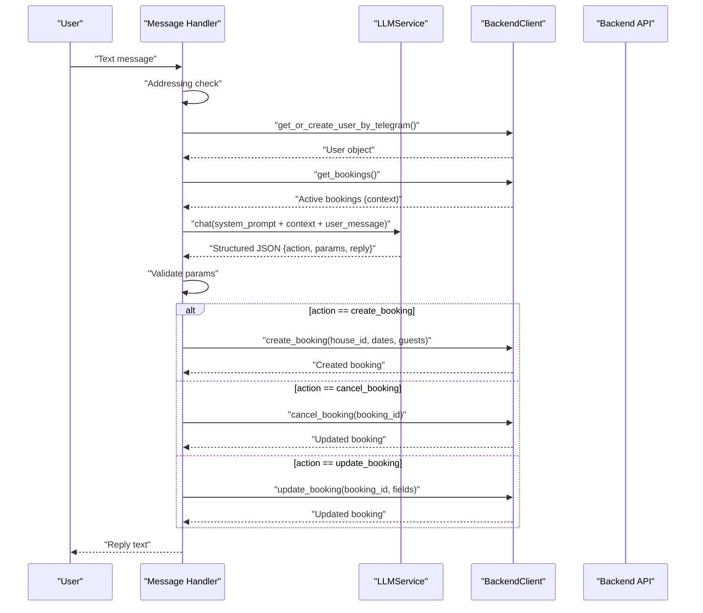

**Diagram sources**
- [bot/handlers/message.py:387-436](file://bot/handlers/message.py#L387-L436)
- [bot/services/llm.py:80-101](file://bot/services/llm.py#L80-L101)
- [bot/services/backend_client.py:137-151](file://bot/services/backend_client.py#L137-L151)
- [bot/services/backend_client.py:199-230](file://bot/services/backend_client.py#L199-L230)

**Section sources**
- [bot/handlers/message.py:387-436](file://bot/handlers/message.py#L387-L436)
- [bot/services/llm.py:80-101](file://bot/services/llm.py#L80-L101)
- [bot/services/backend_client.py:137-151](file://bot/services/backend_client.py#L137-L151)
- [bot/services/backend_client.py:199-230](file://bot/services/backend_client.py#L199-L230)

### BackendClient: HTTP Communication, Retry, and Error Handling
BackendClient centralizes HTTP interactions with the backend API:
- Lazy initialization of httpx.AsyncClient with configurable timeout and redirects.
- Centralized _request method with retry loop (default 3 attempts) for transient failures.
- Typed operations for users, houses, bookings, and tariffs.
- Structured error propagation via BackendAPIError with status-aware handling.

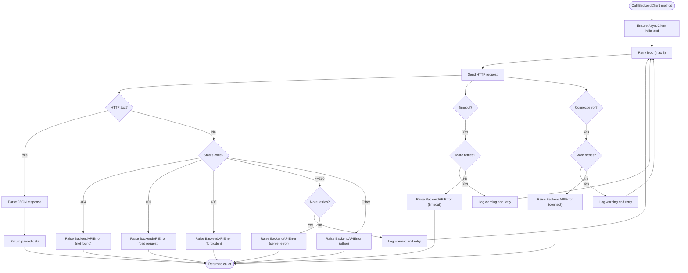

**Diagram sources**
- [bot/services/backend_client.py:51-112](file://bot/services/backend_client.py#L51-L112)

**Section sources**
- [bot/services/backend_client.py:26-118](file://bot/services/backend_client.py#L26-L118)
- [bot/services/backend_client.py:124-151](file://bot/services/backend_client.py#L124-L151)
- [bot/services/backend_client.py:199-230](file://bot/services/backend_client.py#L199-L230)

### LLM Integration: Intent Recognition and Response Generation
LLMService:
- Maintains per-chat history with bounded capacity.
- Builds system prompt enriched with today’s date and current booking context.
- Sends messages to the OpenAI-compatible API and returns structured JSON.
- Provides fallback responses on rate limits or API errors.

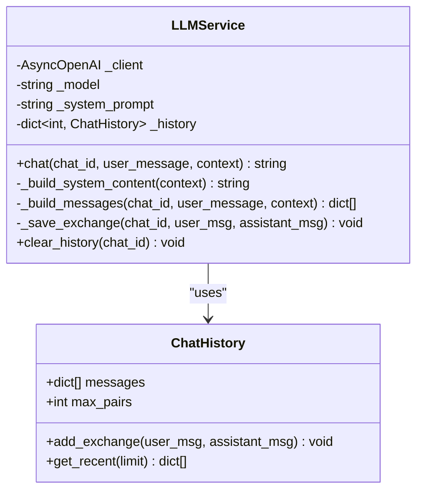

**Diagram sources**
- [bot/services/llm.py:21-41](file://bot/services/llm.py#L21-L41)
- [bot/services/llm.py:43-101](file://bot/services/llm.py#L43-L101)

**Section sources**
- [bot/services/llm.py:43-101](file://bot/services/llm.py#L43-L101)
- [bot/config.py:7-41](file://bot/config.py#L7-L41)

### API Gateway and Service Exposure
The backend FastAPI app:
- Registers routers for health, bookings, houses, users, and tariffs.
- Enables CORS for cross-origin access.
- Defines exception handlers for domain-specific errors and a global handler for unhandled exceptions.
- Exposes endpoints with Pydantic models for request/response validation and pagination.

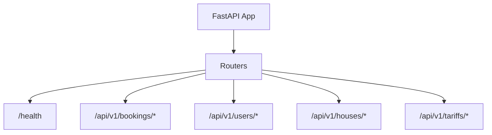

**Diagram sources**
- [backend/main.py:41-59](file://backend/main.py#L41-L59)
- [backend/api/__init__.py:1-15](file://backend/api/__init__.py#L1-L15)

**Section sources**
- [backend/main.py:62-166](file://backend/main.py#L62-L166)
- [backend/api/bookings.py:17-223](file://backend/api/bookings.py#L17-L223)
- [backend/api/users.py:16-223](file://backend/api/users.py#L16-L223)
- [backend/api/houses.py:18-266](file://backend/api/houses.py#L18-L266)

### Data Models and Schemas
- Booking model defines status enumeration and fields for planned/actual guests, dates, totals, and timestamps.
- Booking schemas define request/response models and validation rules for creation and updates.
- User schemas define roles and profile fields.

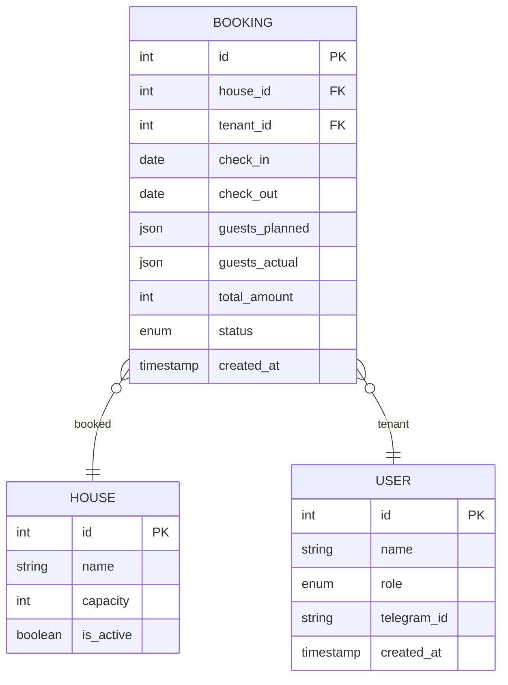

**Diagram sources**
- [backend/models/booking.py:20-41](file://backend/models/booking.py#L20-L41)
- [backend/schemas/booking.py:35-133](file://backend/schemas/booking.py#L35-L133)
- [backend/schemas/user.py:18-72](file://backend/schemas/user.py#L18-L72)

**Section sources**
- [backend/models/booking.py:20-41](file://backend/models/booking.py#L20-L41)
- [backend/schemas/booking.py:35-133](file://backend/schemas/booking.py#L35-L133)
- [backend/schemas/user.py:18-72](file://backend/schemas/user.py#L18-L72)

### Sequence Diagrams

#### Typical Booking Request Flow
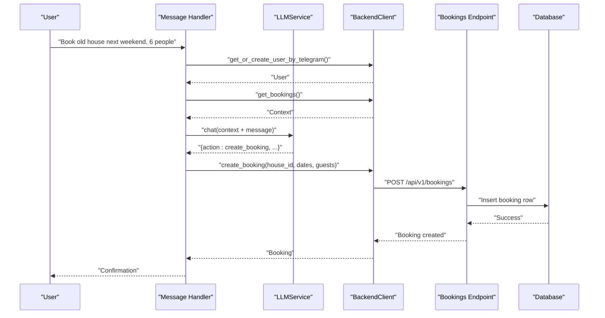

**Diagram sources**
- [bot/handlers/message.py:387-436](file://bot/handlers/message.py#L387-L436)
- [bot/services/llm.py:80-101](file://bot/services/llm.py#L80-L101)
- [bot/services/backend_client.py:137-151](file://bot/services/backend_client.py#L137-L151)
- [bot/services/backend_client.py:199-230](file://bot/services/backend_client.py#L199-L230)
- [backend/api/bookings.py:104-126](file://backend/api/bookings.py#L104-L126)
- [backend/database.py:26-41](file://backend/database.py#L26-L41)

#### User Registration Flow
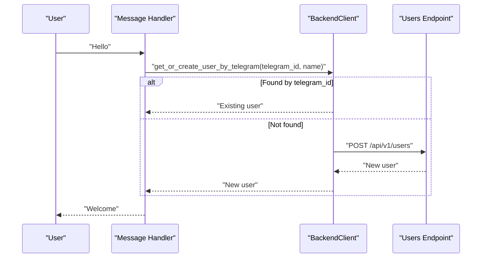

**Diagram sources**
- [bot/handlers/message.py:361-384](file://bot/handlers/message.py#L361-L384)
- [bot/services/backend_client.py:137-151](file://bot/services/backend_client.py#L137-L151)
- [backend/api/users.py:99-115](file://backend/api/users.py#L99-L115)

#### Property Management Flow (Calendar)
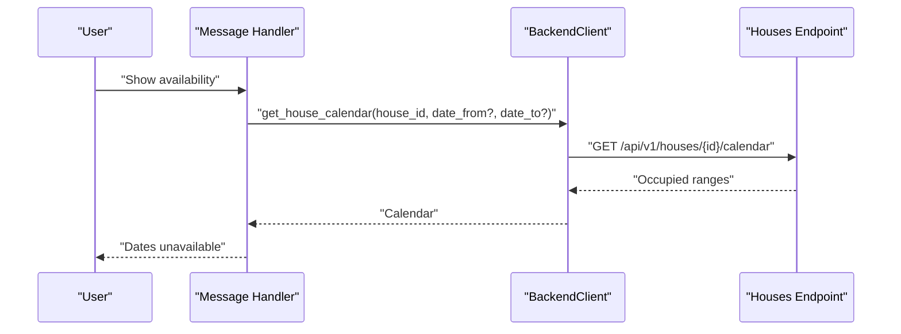

**Diagram sources**
- [bot/services/backend_client.py:166-177](file://bot/services/backend_client.py#L166-L177)
- [backend/api/houses.py:242-265](file://backend/api/houses.py#L242-L265)

## Dependency Analysis
- Bot depends on:
  - Aiogram for routing and polling.
  - BackendClient for HTTP calls.
  - LLMService for natural language interpretation.
  - Settings for configuration and prompts.
- Backend API depends on:
  - Routers aggregating endpoints.
  - Services for business logic.
  - Schemas for validation.
  - Database for persistence.
- BackendClient depends on httpx for HTTP and Settings for base URL and timeouts.
- LLMService depends on AsyncOpenAI and Settings for credentials and model configuration.

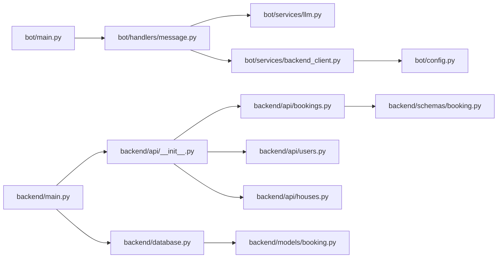

**Diagram sources**
- [bot/main.py:15-41](file://bot/main.py#L15-L41)
- [bot/handlers/message.py:387-436](file://bot/handlers/message.py#L387-L436)
- [bot/services/llm.py:43-101](file://bot/services/llm.py#L43-L101)
- [bot/services/backend_client.py:26-118](file://bot/services/backend_client.py#L26-L118)
- [bot/config.py:44-66](file://bot/config.py#L44-L66)
- [backend/main.py:41-59](file://backend/main.py#L41-L59)
- [backend/api/__init__.py:1-15](file://backend/api/__init__.py#L1-L15)
- [backend/api/bookings.py:17-223](file://backend/api/bookings.py#L17-L223)
- [backend/api/users.py:16-223](file://backend/api/users.py#L16-L223)
- [backend/api/houses.py:18-266](file://backend/api/houses.py#L18-L266)
- [backend/database.py:8-41](file://backend/database.py#L8-L41)
- [backend/schemas/booking.py:35-133](file://backend/schemas/booking.py#L35-L133)
- [backend/models/booking.py:20-41](file://backend/models/booking.py#L20-L41)

**Section sources**
- [bot/main.py:15-41](file://bot/main.py#L15-L41)
- [backend/main.py:41-59](file://backend/main.py#L41-L59)

## Performance Considerations
- Asynchronous I/O: Both the bot and backend use async clients and sessions to minimize blocking and improve throughput.
- Retry and timeouts: BackendClient applies exponential backoff-like retries with capped attempts to handle transient network errors.
- Context trimming: LLMService maintains bounded chat history to control token usage and latency.
- Pagination and filtering: Backend endpoints support pagination and filtering to avoid large payloads.
- Database sessions: Async session factory ensures proper commit/rollback lifecycle and reduces contention.

[No sources needed since this section provides general guidance]

## Troubleshooting Guide
Common issues and resolutions:
- LLM rate limits or API errors: LLMService returns a fallback JSON payload; verify credentials and model configuration in settings.
- Backend connectivity errors: BackendClient raises BackendAPIError with status codes; inspect logs for timeout/connection errors and adjust retry/backoff.
- Validation errors: Backend endpoints return structured ErrorResponse; ensure request payloads conform to schemas.
- Authentication placeholders: Endpoints currently use hardcoded tenant IDs; implement JWT-based auth when ready.
- CORS issues: Backend enables CORS for all origins; confirm frontend origin matches expectations.

**Section sources**
- [bot/services/llm.py:90-101](file://bot/services/llm.py#L90-L101)
- [bot/services/backend_client.py:67-112](file://bot/services/backend_client.py#L67-L112)
- [backend/main.py:67-166](file://backend/main.py#L67-L166)
- [backend/api/bookings.py:104-126](file://backend/api/bookings.py#L104-L126)

## Conclusion
The system integrates a Telegram bot, an LLM for intent understanding, a robust backend API with typed endpoints, and an async database layer. The message handler orchestrates natural language processing and action execution via BackendClient, while the backend enforces validation and exposes a clean API surface. The documented flows and diagrams provide a blueprint for extending functionality, adding authentication, and scaling the system.