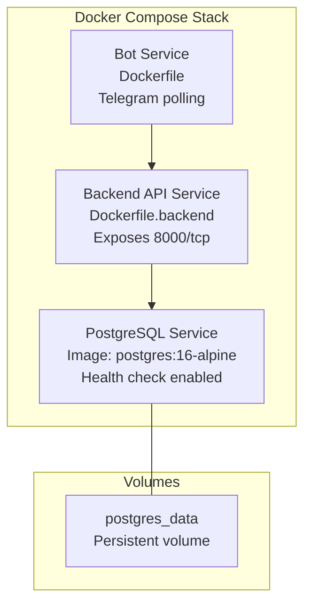
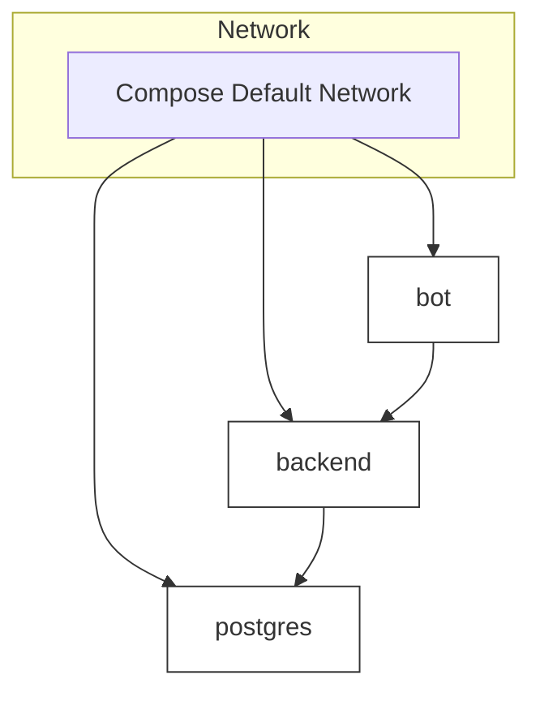
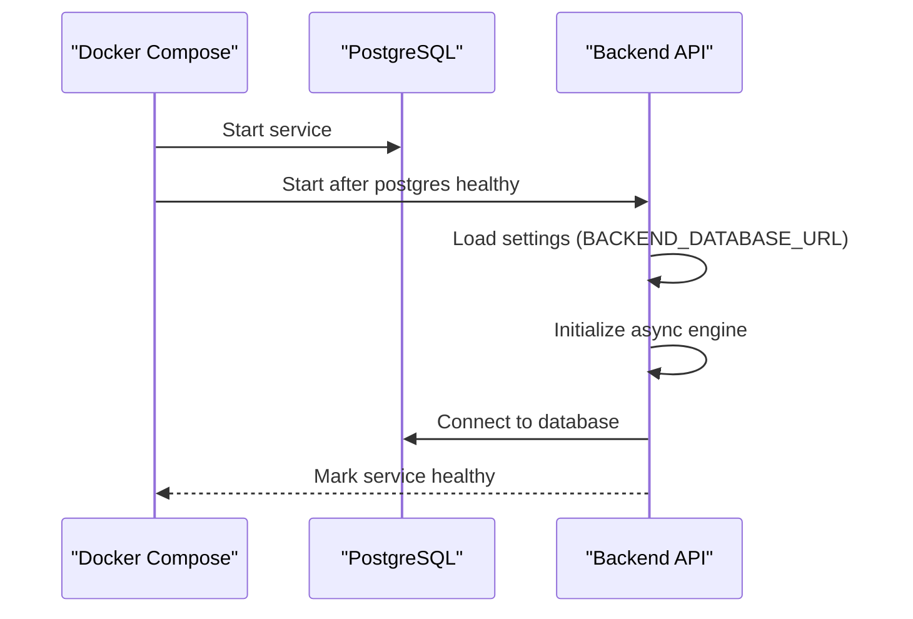
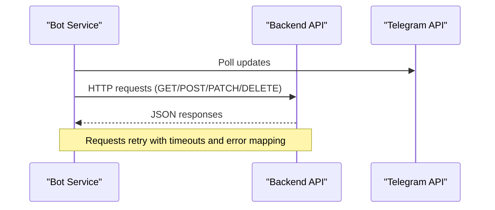
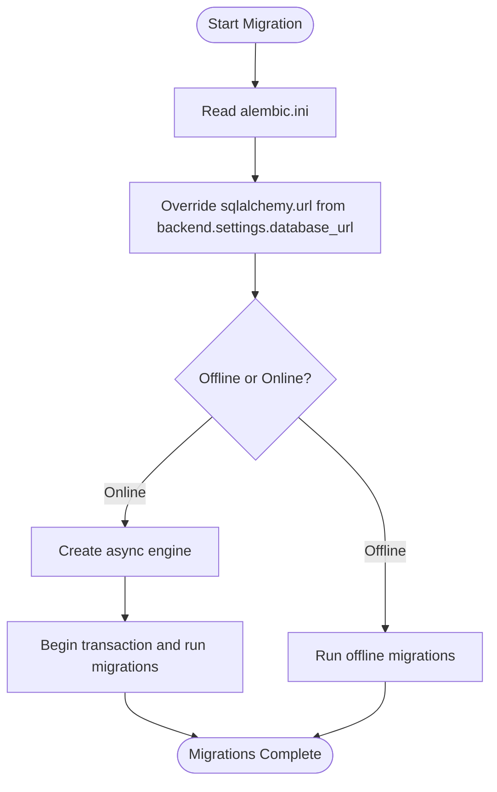
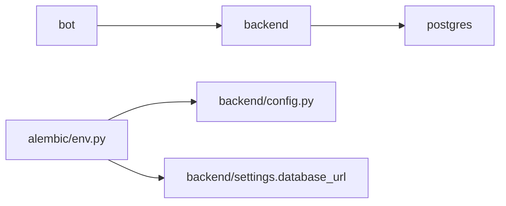

# Deployment Topology

<cite>
**Referenced Files in This Document**
- [docker-compose.yaml](file://docker-compose.yaml)
- [docker-compose.override.yml](file://docker-compose.override.yml)
- [Dockerfile](file://Dockerfile)
- [Dockerfile.backend](file://Dockerfile.backend)
- [Makefile](file://Makefile)
- [alembic.ini](file://alembic.ini)
- [alembic/env.py](file://alembic/env.py)
- [alembic/versions/2a84cf51810b_initial_migration.py](file://alembic/versions/2a84cf51810b_initial_migration.py)
- [backend/config.py](file://backend/config.py)
- [backend/database.py](file://backend/database.py)
- [backend/main.py](file://backend/main.py)
- [bot/main.py](file://bot/main.py)
- [bot/services/backend_client.py](file://bot/services/backend_client.py)
</cite>

## Table of Contents
1. [Introduction](#introduction)
2. [Project Structure](#project-structure)
3. [Core Components](#core-components)
4. [Architecture Overview](#architecture-overview)
5. [Detailed Component Analysis](#detailed-component-analysis)
6. [Dependency Analysis](#dependency-analysis)
7. [Performance Considerations](#performance-considerations)
8. [Troubleshooting Guide](#troubleshooting-guide)
9. [Conclusion](#conclusion)
10. [Appendices](#appendices)

## Introduction
This document describes the deployment topology and container orchestration of the booking system. It explains the Docker-based architecture with three primary containers: a PostgreSQL database, a backend API service, and a Telegram bot service. It documents container networking, volume mounts, service dependencies, health checks, startup ordering, environment configuration across development, staging, and production, and the database migration strategy using Alembic integrated into the deployment workflow. It also outlines scaling, load balancing, high availability patterns, CI/CD integration, troubleshooting, and container management best practices.

## Project Structure
The deployment is orchestrated via Docker Compose with two compose files:
- A base compose file defines the core services and their runtime configuration.
- An override compose file extends the base for local development, including port mapping and specialized networking for the bot.

Key elements:
- Services: postgres, backend, bot
- Volumes: persistent storage for PostgreSQL data
- Health checks: database readiness probe
- Dependencies: backend waits for postgres to be healthy
- Environment: centralized via .env and per-service environment variables
- Migrations: Alembic configured to run against the backend-managed database URL

**Diagram sources**
- [docker-compose.yaml:1-43](file://docker-compose.yaml#L1-L43)
- [Dockerfile.backend:1-20](file://Dockerfile.backend#L1-L20)
- [Dockerfile:1-13](file://Dockerfile#L1-L13)

**Section sources**
- [docker-compose.yaml:1-43](file://docker-compose.yaml#L1-L43)
- [docker-compose.override.yml:1-13](file://docker-compose.override.yml#L1-L13)

## Core Components
- PostgreSQL database
  - Image: postgres:16-alpine
  - Environment: user, password, database name
  - Persistent volume: postgres_data
  - Health check: pg_isready with short intervals and retries
- Backend API service
  - Built from Dockerfile.backend
  - Exposes port 8000
  - Environment: host, port, log level, database URL
  - Depends on postgres being healthy
  - Mounted volumes: backend code and Alembic configuration for migrations
- Bot service
  - Built from root Dockerfile
  - Runs Telegram bot polling
  - Uses env_file for configuration
  - Network override for accessing external APIs in local setups

Environment variables and configuration:
- Backend reads settings via Pydantic Settings with prefix BACKEND_
- Database URL is derived from settings and used by SQLAlchemy async engine
- Alembic reads its database URL from alembic.ini and is overridden by backend settings at runtime

**Section sources**
- [docker-compose.yaml:2-42](file://docker-compose.yaml#L2-L42)
- [backend/config.py:4-24](file://backend/config.py#L4-L24)
- [backend/database.py:9-23](file://backend/database.py#L9-L23)
- [alembic.ini:61](file://alembic.ini#L61)
- [alembic/env.py:20-21](file://alembic/env.py#L20-L21)

## Architecture Overview
The system runs three containers:
- postgres: Provides the relational database with persistence and health monitoring.
- backend: Serves the FastAPI application, exposes health endpoint, and manages database sessions.
- bot: Polls Telegram and communicates with the backend API.

Networking:
- Services share the default Compose network; backend connects to postgres by service name.
- Local development overrides expose backend on a host port and adjust bot networking for external API access.

**Diagram sources**
- [docker-compose.yaml:1-43](file://docker-compose.yaml#L1-L43)
- [docker-compose.override.yml:1-13](file://docker-compose.override.yml#L1-L13)

## Detailed Component Analysis

### PostgreSQL Service
- Image and tag: postgres:16-alpine
- Environment variables: POSTGRES_USER, POSTGRES_PASSWORD, POSTGRES_DB
- Volume mount: postgres_data for persistence
- Health check: CMD-SHELL pg_isready with short interval and retries
- Purpose: Host relational schema managed by Alembic and consumed by backend

Operational notes:
- Health check ensures backend startup waits until database is ready.
- Persistent volume prevents data loss across container recreation.

**Section sources**
- [docker-compose.yaml:2-14](file://docker-compose.yaml#L2-L14)

### Backend API Service
- Build context and Dockerfile: Dockerfile.backend
- Ports: 8000/tcp exposed
- Environment: BACKEND_HOST, BACKEND_PORT, BACKEND_LOG_LEVEL, BACKEND_DATABASE_URL
- Dependencies: depends_on postgres with condition service_healthy
- Volumes: mounts backend and alembic for live development and migrations
- Command: uv run python -m backend.main
- Application entry: FastAPI app with CORS, routers, and health endpoint

Key behaviors:
- Reads settings via Pydantic Settings with BACKEND_ prefix and .env file.
- Uses SQLAlchemy async engine with settings.database_url.
- Includes a health endpoint at /health.

**Diagram sources**
- [docker-compose.yaml:37-39](file://docker-compose.yaml#L37-L39)
- [backend/config.py:17-18](file://backend/config.py#L17-L18)
- [backend/database.py:9-13](file://backend/database.py#L9-L13)
- [backend/main.py:62-64](file://backend/main.py#L62-L64)

**Section sources**
- [docker-compose.yaml:21-40](file://docker-compose.yaml#L21-L40)
- [Dockerfile.backend:17-19](file://Dockerfile.backend#L17-L19)
- [backend/config.py:17-21](file://backend/config.py#L17-L21)
- [backend/database.py:9-23](file://backend/database.py#L9-L23)
- [backend/main.py:62-64](file://backend/main.py#L62-L64)

### Bot Service
- Build: root Dockerfile
- Env file: .env
- Restart policy: unless-stopped
- Networking override in development: shares host network namespace with another container for external API access
- Environment override: BACKEND_API_URL points to host’s loopback address and mapped port

Behavior:
- Initializes logging, optional proxy, Telegram Bot, and Dispatcher.
- Integrates BackendClient for API calls with retry logic and error handling.

**Diagram sources**
- [bot/main.py:15-41](file://bot/main.py#L15-L41)
- [bot/services/backend_client.py:51-112](file://bot/services/backend_client.py#L51-L112)
- [docker-compose.override.yml:6-12](file://docker-compose.override.yml#L6-L12)

**Section sources**
- [docker-compose.yaml:16-19](file://docker-compose.yaml#L16-L19)
- [Dockerfile:1-13](file://Dockerfile#L1-L13)
- [bot/main.py:15-41](file://bot/main.py#L15-L41)
- [bot/services/backend_client.py:26-118](file://bot/services/backend_client.py#L26-L118)
- [docker-compose.override.yml:6-12](file://docker-compose.override.yml#L6-L12)

### Database Migration Strategy with Alembic
- Alembic configuration:
  - script_location: alembic
  - prepend_sys_path: .
  - sqlalchemy.url in alembic.ini is a placeholder for localhost
  - Logging configuration for alembic and sqlalchemy
- Runtime override:
  - Alembic env.py reads settings.database_url and sets alembic config dynamically
  - This ensures migrations target the same database as the backend
- Initial migration:
  - Creates tariffs, users, houses, and bookings tables with appropriate constraints and indexes

Integration with deployment:
- Migrations executed inside the backend container using Alembic CLI
- Makefile provides commands to upgrade/downgrade and create revisions
- Compose mounts alembic and alembic.ini into the backend container for live development

**Diagram sources**
- [alembic/env.py:20-21](file://alembic/env.py#L20-L21)
- [alembic/env.py:70-84](file://alembic/env.py#L70-L84)
- [alembic/versions/2a84cf51810b_initial_migration.py:21-69](file://alembic/versions/2a84cf51810b_initial_migration.py#L21-L69)

**Section sources**
- [alembic.ini:5-13](file://alembic.ini#L5-L13)
- [alembic.ini:61](file://alembic.ini#L61)
- [alembic/env.py:20-21](file://alembic/env.py#L20-L21)
- [alembic/env.py:70-84](file://alembic/env.py#L70-L84)
- [alembic/versions/2a84cf51810b_initial_migration.py:21-69](file://alembic/versions/2a84cf51810b_initial_migration.py#L21-L69)

## Dependency Analysis
- Backend depends on postgres:
  - depends_on with condition service_healthy ensures startup order.
- Backend uses settings.database_url to configure SQLAlchemy async engine.
- Alembic env.py reads backend settings to align migration target with backend database URL.
- Bot depends on backend availability for API calls; development override adjusts bot networking and backend URL.

**Diagram sources**
- [docker-compose.yaml:37-39](file://docker-compose.yaml#L37-L39)
- [backend/config.py:17-18](file://backend/config.py#L17-L18)
- [alembic/env.py:20-21](file://alembic/env.py#L20-L21)

**Section sources**
- [docker-compose.yaml:37-39](file://docker-compose.yaml#L37-L39)
- [backend/config.py:17-18](file://backend/config.py#L17-L18)
- [alembic/env.py:20-21](file://alembic/env.py#L20-L21)

## Performance Considerations
- Database connections:
  - Use async SQLAlchemy to minimize blocking and improve concurrency under load.
- Container resource limits:
  - Add deploy.resources.limits in docker-compose for CPU/memory caps.
- Health checks:
  - Keep postgres health check intervals minimal but not overly aggressive to avoid false positives.
- Backend scaling:
  - Use multiple backend replicas behind a reverse proxy or load balancer.
  - Ensure database connection pooling and proper session lifecycle management.
- Bot scaling:
  - Run multiple bot instances behind a queue or rate-limiting layer to handle bursts.
- Storage:
  - Persist postgres data via named volumes to prevent data loss during upgrades.

[No sources needed since this section provides general guidance]

## Troubleshooting Guide
Common deployment issues and resolutions:
- Backend fails to start due to database unavailability
  - Verify postgres health check passes and backend depends_on condition is met.
  - Confirm BACKEND_DATABASE_URL matches postgres service name and credentials.
- Database migration errors
  - Ensure alembic env.py is overriding sqlalchemy.url from backend settings.
  - Run migrations inside the backend container using provided Makefile targets.
- Port conflicts in development
  - Use docker-compose.override.yml to remap backend port.
- Bot cannot reach backend
  - Adjust BACKEND_API_URL in override to match host IP and mapped port.
- Logs and diagnostics
  - Use docker compose logs for real-time inspection.
  - Use docker compose exec to run Alembic commands or shell into containers.

**Section sources**
- [docker-compose.yaml:37-39](file://docker-compose.yaml#L37-L39)
- [docker-compose.override.yml:3-12](file://docker-compose.override.yml#L3-L12)
- [Makefile:57-71](file://Makefile#L57-L71)

## Conclusion
The booking system employs a straightforward, robust Docker-based deployment topology with explicit service dependencies, health checks, and a clear migration strategy. The backend’s settings-driven database configuration and Alembic’s runtime override ensure migrations align with the active database. Development workflows leverage Compose overrides for port mapping and specialized networking. Scaling and high availability can be achieved by adding replicas and a reverse proxy while maintaining stateful persistence for the database.

[No sources needed since this section summarizes without analyzing specific files]

## Appendices

### Environment Variable Configuration
- Backend settings (prefix BACKEND_)
  - host, port, database_url, log_level
- Database URL
  - Constructed from backend settings and used by SQLAlchemy async engine
- Alembic database URL
  - Placeholder in alembic.ini overridden at runtime by backend settings

**Section sources**
- [backend/config.py:17-21](file://backend/config.py#L17-L21)
- [backend/database.py:9-13](file://backend/database.py#L9-L13)
- [alembic.ini:61](file://alembic.ini#L61)
- [alembic/env.py:20-21](file://alembic/env.py#L20-L21)

### Deployment Commands and Workflows
- Build and run
  - docker compose build
  - docker compose up
- Stop and restart
  - docker compose down
  - docker compose up --build
- Backend-specific tasks
  - docker compose up backend -d
  - docker compose logs backend -f
  - docker compose stop backend
  - docker compose build backend
- Database migrations
  - docker compose exec backend uv run alembic upgrade head
  - docker compose exec backend uv run alembic revision --autogenerate -m "<name>"
  - docker compose exec backend uv run alembic downgrade -1
- PostgreSQL operations
  - docker compose up postgres -d
  - docker compose logs postgres -f

**Section sources**
- [Makefile:16-29](file://Makefile#L16-L29)
- [Makefile:32-51](file://Makefile#L32-L51)
- [Makefile:66-71](file://Makefile#L66-L71)

### Scaling, Load Balancing, and High Availability
- Scale backend replicas behind a reverse proxy or ingress controller.
- Ensure database connection pooling and session management are optimized.
- Persist postgres data using named volumes.
- Use separate networks or external load balancers for production deployments.

[No sources needed since this section provides general guidance]

### CI/CD Pipeline Integration
- Build images with docker compose build.
- Run migrations inside the backend container using Alembic commands.
- Deploy stack with docker compose up and manage rollbacks with Alembic downgrade.
- Automate linting, formatting, and tests via Makefile targets.

**Section sources**
- [Makefile:10-14](file://Makefile#L10-L14)
- [Makefile:44-51](file://Makefile#L44-L51)
- [Makefile:57-64](file://Makefile#L57-L64)