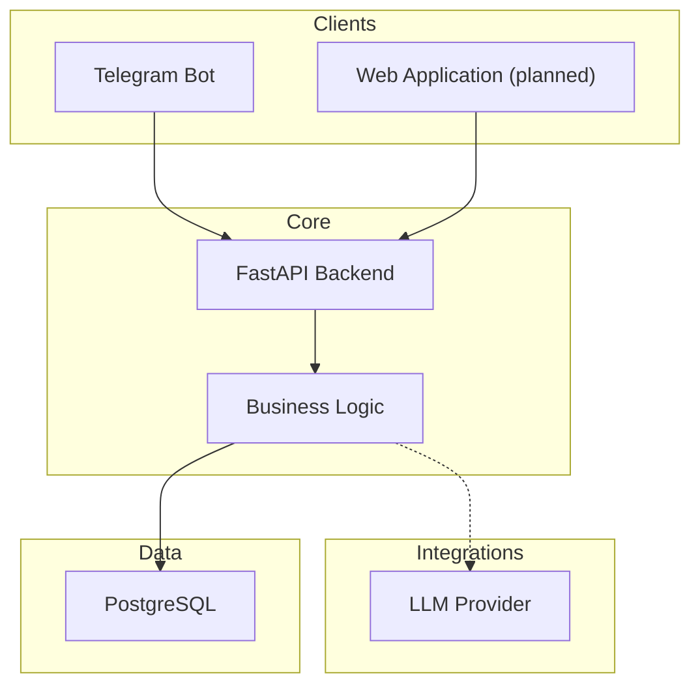
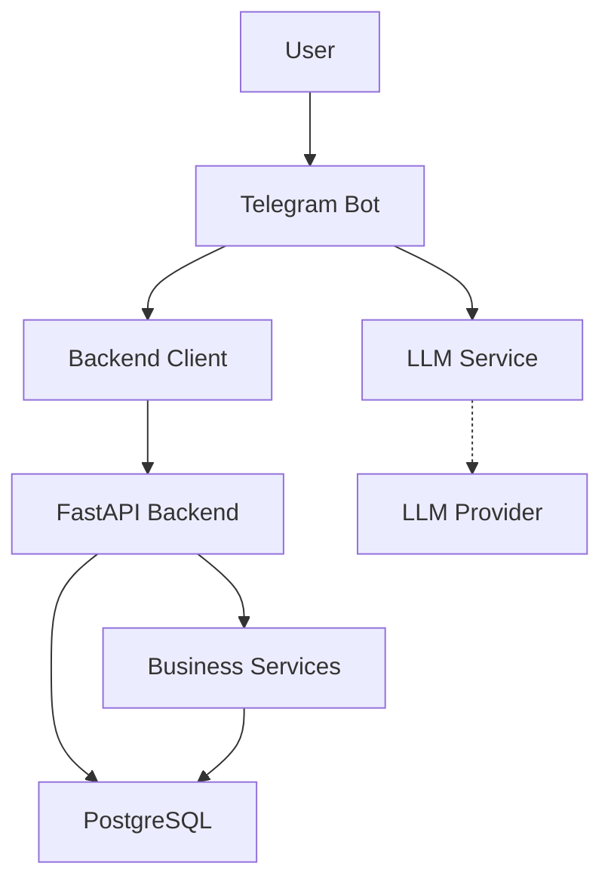
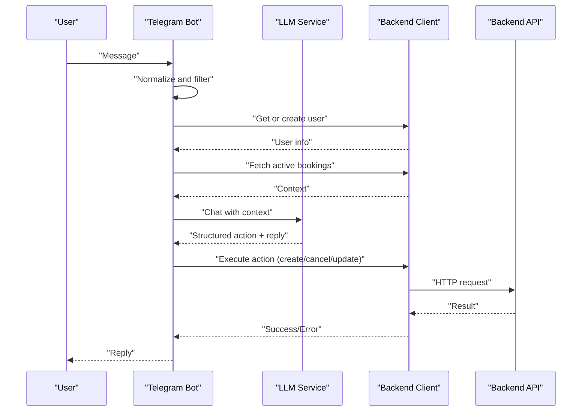
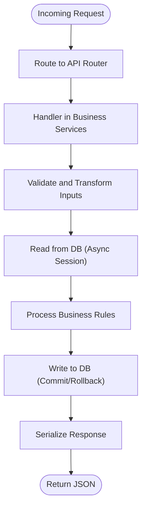
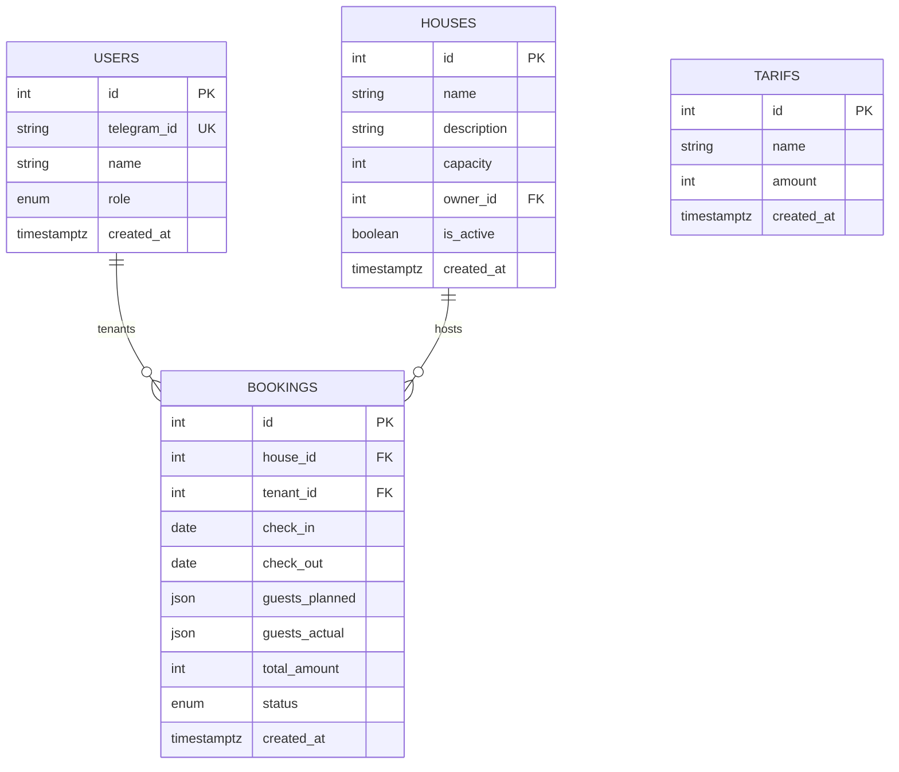
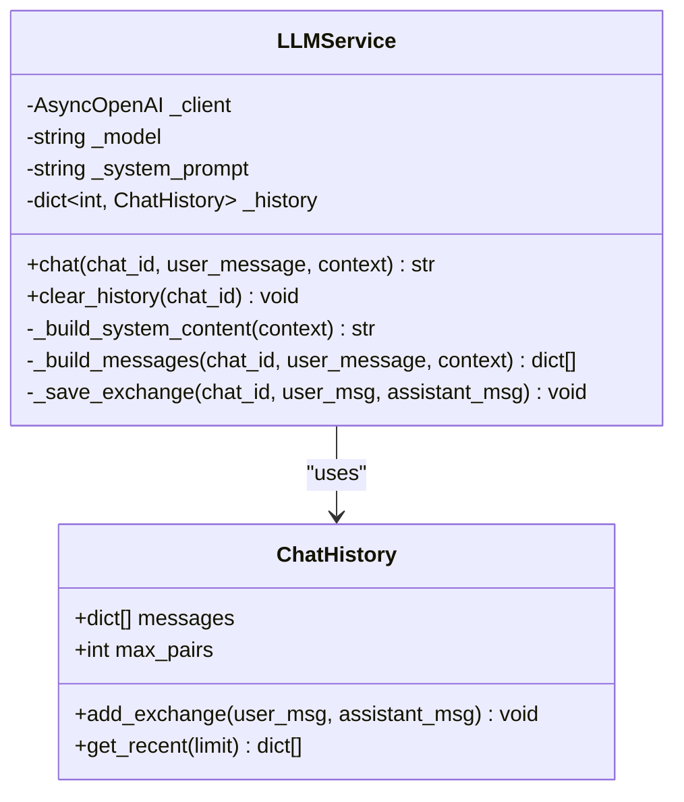
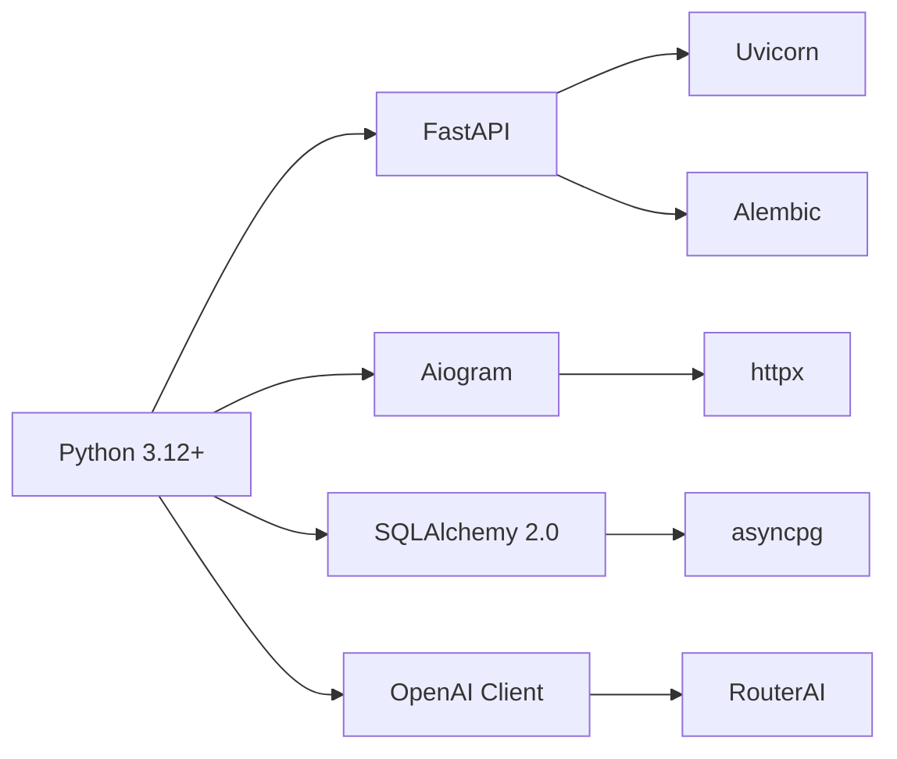

# Overall Architecture Design

<cite>
**Referenced Files in This Document**
- [README.md](file://README.md)
- [vision.md](file://docs/vision.md)
- [pyproject.toml](file://pyproject.toml)
- [docker-compose.yaml](file://docker-compose.yaml)
- [backend/main.py](file://backend/main.py)
- [backend/config.py](file://backend/config.py)
- [backend/database.py](file://backend/database.py)
- [backend/api/__init__.py](file://backend/api/__init__.py)
- [backend/models/booking.py](file://backend/models/booking.py)
- [backend/models/house.py](file://backend/models/house.py)
- [backend/models/user.py](file://backend/models/user.py)
- [backend/models/tariff.py](file://backend/models/tariff.py)
- [bot/main.py](file://bot/main.py)
- [bot/config.py](file://bot/config.py)
- [bot/services/backend_client.py](file://bot/services/backend_client.py)
- [bot/services/llm.py](file://bot/services/llm.py)
- [bot/handlers/message.py](file://bot/handlers/message.py)
</cite>

## Table of Contents
1. [Introduction](#introduction)
2. [Project Structure](#project-structure)
3. [Core Components](#core-components)
4. [Architecture Overview](#architecture-overview)
5. [Detailed Component Analysis](#detailed-component-analysis)
6. [Dependency Analysis](#dependency-analysis)
7. [Performance Considerations](#performance-considerations)
8. [Troubleshooting Guide](#troubleshooting-guide)
9. [Conclusion](#conclusion)

## Introduction
This document describes the overall system architecture for a fullstack booking platform focused on natural language processing, real-time communication, and scalable data management. The system consists of four main layers:
- Telegram bot interface
- Backend API service
- Database layer
- LLM integration

It explains how these layers interact, documents the chosen technologies and their rationale, and illustrates end-to-end data flows from user input to database persistence.

## Project Structure
The repository is organized into distinct modules:
- bot/: Telegram bot implementation and integrations
- backend/: FastAPI-based backend with SQLAlchemy models, repositories, services, and API routes
- docs/: Architectural and product documentation
- docker-compose.yaml and related configuration for containerized deployment

**Diagram sources**
- [vision.md:17-42](file://docs/vision.md#L17-L42)
- [README.md:13-20](file://README.md#L13-L20)

**Section sources**
- [README.md:1-133](file://README.md#L1-L133)
- [vision.md:100-114](file://docs/vision.md#L100-L114)

## Core Components
- Telegram Bot (bot/): Real-time messaging client built with Aiogram, orchestrating user conversations, invoking LLM, and dispatching actions via HTTP to the backend.
- Backend API (backend/): FastAPI application exposing REST endpoints for users, houses, tariffs, and bookings; integrates with PostgreSQL via SQLAlchemy.
- Database Layer: PostgreSQL with asynchronous SQLAlchemy sessions and Alembic migrations.
- LLM Integration: OpenAI-compatible client (RouterAI) embedded in the bot to parse natural language and produce structured actions.

Key implementation anchors:
- Bot entrypoint and DI wiring: [bot/main.py:15-41](file://bot/main.py#L15-L41)
- Backend app bootstrap and exception handling: [backend/main.py:41-173](file://backend/main.py#L41-L173)
- Database configuration and session lifecycle: [backend/database.py:8-41](file://backend/database.py#L8-L41)
- LLM service and chat history: [bot/services/llm.py:43-106](file://bot/services/llm.py#L43-L106)
- Backend HTTP client to API: [bot/services/backend_client.py:26-244](file://bot/services/backend_client.py#L26-L244)
- Message handler pipeline: [bot/handlers/message.py:387-436](file://bot/handlers/message.py#L387-L436)

**Section sources**
- [bot/main.py:15-41](file://bot/main.py#L15-L41)
- [backend/main.py:41-173](file://backend/main.py#L41-L173)
- [backend/database.py:8-41](file://backend/database.py#L8-L41)
- [bot/services/llm.py:43-106](file://bot/services/llm.py#L43-L106)
- [bot/services/backend_client.py:26-244](file://bot/services/backend_client.py#L26-L244)
- [bot/handlers/message.py:387-436](file://bot/handlers/message.py#L387-L436)

## Architecture Overview
The system follows a layered architecture with clear separation of concerns:
- Presentation Layer: Telegram bot handles user input and presents responses.
- Application Layer: Backend FastAPI exposes typed APIs and centralizes business logic.
- Domain Layer: SQLAlchemy models define entities and relationships.
- Infrastructure Layer: PostgreSQL stores persistent state; Alembic manages schema evolution.

Communication patterns:
- Event-driven bot: Aiogram polling reacts to incoming messages and triggers processing.
- Microservice separation: Bot and Backend are separate processes communicating over HTTP.
- LLM-driven NLP: Natural language parsing is delegated to an external LLM provider while the bot maintains conversational context.

**Diagram sources**
- [bot/main.py:31-38](file://bot/main.py#L31-L38)
- [bot/services/llm.py:46-53](file://bot/services/llm.py#L46-L53)
- [bot/services/backend_client.py:29-32](file://bot/services/backend_client.py#L29-L32)
- [backend/main.py:59](file://backend/main.py#L59)
- [backend/database.py:9-23](file://backend/database.py#L9-L23)

## Detailed Component Analysis

### Telegram Bot Interface
Responsibilities:
- Accepts user messages and normalizes input (removes mentions, filters non-addressed messages).
- Builds conversational context from active bookings and passes it to the LLM.
- Parses LLM responses into structured actions and executes them against the backend.
- Manages per-chat history and applies fallback responses on errors.

**Diagram sources**
- [bot/handlers/message.py:387-436](file://bot/handlers/message.py#L387-L436)
- [bot/services/llm.py:80-101](file://bot/services/llm.py#L80-L101)
- [bot/services/backend_client.py:124-230](file://bot/services/backend_client.py#L124-L230)
- [backend/main.py:59](file://backend/main.py#L59)

**Section sources**
- [bot/handlers/message.py:26-58](file://bot/handlers/message.py#L26-L58)
- [bot/handlers/message.py:147-158](file://bot/handlers/message.py#L147-L158)
- [bot/services/llm.py:21-41](file://bot/services/llm.py#L21-L41)
- [bot/services/backend_client.py:124-244](file://bot/services/backend_client.py#L124-L244)

### Backend API Service
Responsibilities:
- Exposes REST endpoints for users, houses, tariffs, and bookings.
- Implements centralized business logic and validation.
- Provides health checks and robust exception handling with typed error responses.
- Manages asynchronous database sessions and transactions.

**Diagram sources**
- [backend/api/__init__.py:9-15](file://backend/api/__init__.py#L9-L15)
- [backend/main.py:62-64](file://backend/main.py#L62-L64)
- [backend/database.py:26-41](file://backend/database.py#L26-L41)

**Section sources**
- [backend/main.py:41-173](file://backend/main.py#L41-L173)
- [backend/api/__init__.py:1-15](file://backend/api/__init__.py#L1-L15)
- [backend/database.py:8-41](file://backend/database.py#L8-L41)

### Database Layer
Responsibilities:
- Asynchronous PostgreSQL connectivity via SQLAlchemy 2.0.
- Centralized session management with commit/rollback semantics.
- Declarative models for users, houses, tariffs, and bookings.

**Diagram sources**
- [backend/models/user.py:19-32](file://backend/models/user.py#L19-L32)
- [backend/models/house.py:9-24](file://backend/models/house.py#L9-L24)
- [backend/models/tariff.py:9-21](file://backend/models/tariff.py#L9-L21)
- [backend/models/booking.py:20-41](file://backend/models/booking.py#L20-L41)

**Section sources**
- [backend/database.py:8-41](file://backend/database.py#L8-L41)
- [backend/models/user.py:19-32](file://backend/models/user.py#L19-L32)
- [backend/models/house.py:9-24](file://backend/models/house.py#L9-L24)
- [backend/models/tariff.py:9-21](file://backend/models/tariff.py#L9-L21)
- [backend/models/booking.py:20-41](file://backend/models/booking.py#L20-L41)

### LLM Integration
Responsibilities:
- Maintains per-chat history with bounded size.
- Constructs system prompts enriched with current date and contextual bookings.
- Calls OpenAI-compatible LLM endpoint and returns structured JSON with action and reply.

**Diagram sources**
- [bot/services/llm.py:21-41](file://bot/services/llm.py#L21-L41)
- [bot/services/llm.py:43-106](file://bot/services/llm.py#L43-L106)

**Section sources**
- [bot/services/llm.py:43-106](file://bot/services/llm.py#L43-L106)
- [bot/config.py:44-67](file://bot/config.py#L44-L67)

## Dependency Analysis
Technology stack and rationale:
- FastAPI: High-performance ASGI framework with automatic OpenAPI/Swagger generation, excellent for building scalable backend APIs.
- Aiogram: Modern Telegram Bot API wrapper supporting async/await and flexible middlewares.
- PostgreSQL + SQLAlchemy 2.0 + asyncpg: Robust, ACID-compliant relational database with async drivers for high concurrency.
- Alembic: Standard migration tooling for schema evolution.
- OpenAI-compatible LLM (RouterAI): Enables natural language understanding and structured action extraction.

**Diagram sources**
- [pyproject.toml:6-18](file://pyproject.toml#L6-L18)
- [backend/main.py:170-173](file://backend/main.py#L170-L173)

**Section sources**
- [pyproject.toml:1-32](file://pyproject.toml#L1-L32)
- [backend/main.py:170-173](file://backend/main.py#L170-L173)

## Performance Considerations
- Asynchronous design: Both bot and backend leverage async I/O to handle concurrent requests efficiently.
- Connection pooling: SQLAlchemy async sessions minimize overhead and improve throughput.
- Retry and timeouts: Backend client implements retry logic and timeouts for resilient API calls.
- LLM rate limiting: Built-in handling for rate limits and fallback responses to maintain responsiveness.
- Containerization: Docker Compose ensures predictable resource allocation and scaling readiness.

[No sources needed since this section provides general guidance]

## Troubleshooting Guide
Common issues and resolutions:
- Health checks: Verify backend availability via the health endpoint.
- Environment configuration: Ensure required tokens and URLs are present in environment variables.
- Database connectivity: Confirm PostgreSQL is healthy and reachable from backend.
- LLM availability: Monitor rate limits and fallback behavior when provider errors occur.
- Bot connectivity: Validate Telegram token and proxy settings if applicable.

Operational anchors:
- Health endpoint: [backend/main.py:62-64](file://backend/main.py#L62-L64)
- Docker Compose services and healthchecks: [docker-compose.yaml:1-43](file://docker-compose.yaml#L1-L43)
- Backend settings and database URL: [backend/config.py:14-18](file://backend/config.py#L14-L18)
- LLM fallback responses: [bot/services/llm.py:15-18](file://bot/services/llm.py#L15-L18)
- Bot proxy configuration: [bot/main.py:25-29](file://bot/main.py#L25-L29)

**Section sources**
- [backend/main.py:62-64](file://backend/main.py#L62-L64)
- [docker-compose.yaml:1-43](file://docker-compose.yaml#L1-L43)
- [backend/config.py:14-18](file://backend/config.py#L14-L18)
- [bot/services/llm.py:15-18](file://bot/services/llm.py#L15-L18)
- [bot/main.py:25-29](file://bot/main.py#L25-L29)

## Conclusion
The system employs a clean layered architecture with clear separation between the Telegram bot, backend API, database, and LLM. FastAPI and Aiogram enable efficient, real-time interactions, while PostgreSQL and Alembic provide reliable persistence and schema evolution. The OpenAI-compatible LLM powers natural language understanding and structured action execution, ensuring a smooth user experience across the booking workflow.

[No sources needed since this section summarizes without analyzing specific files]