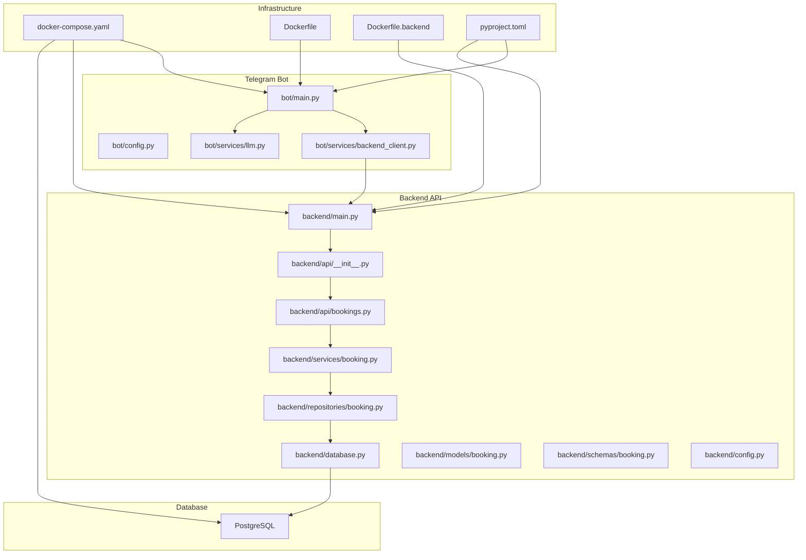
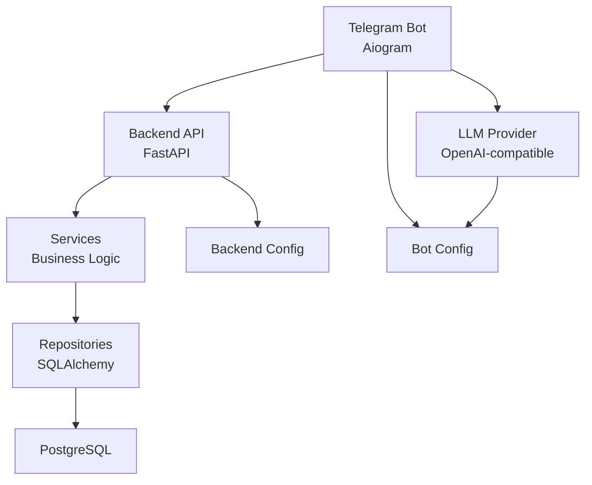
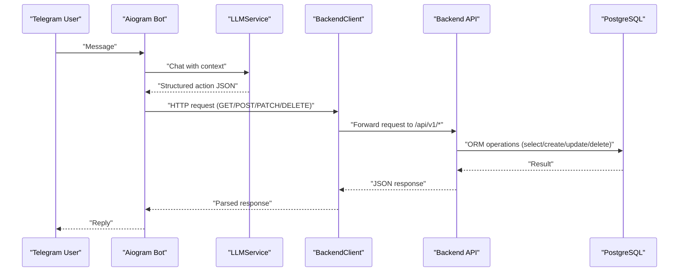
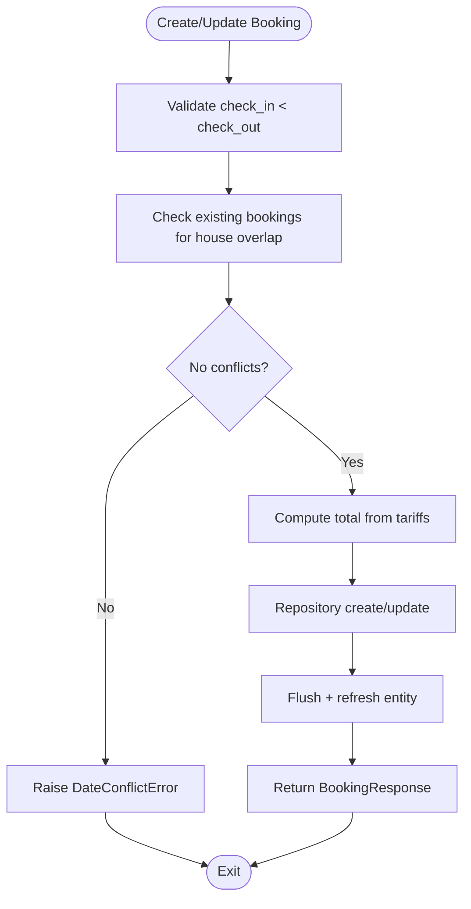
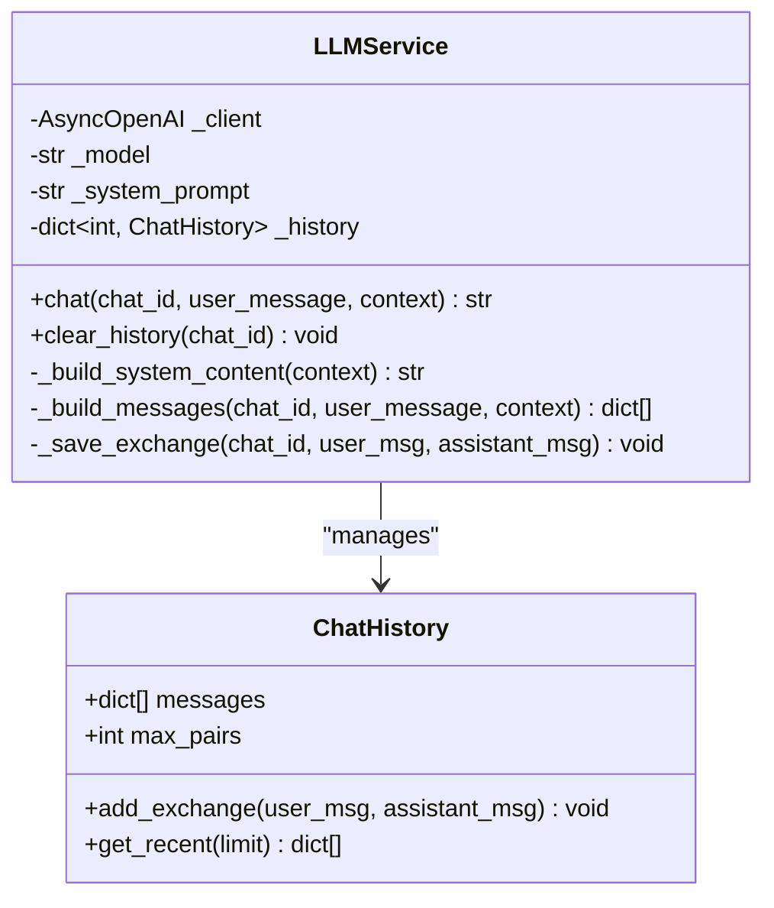
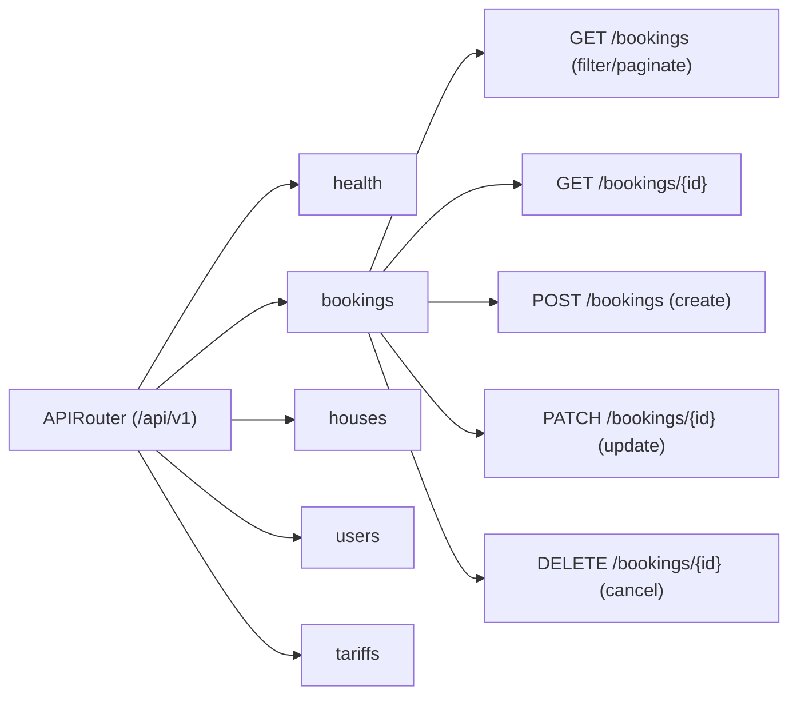
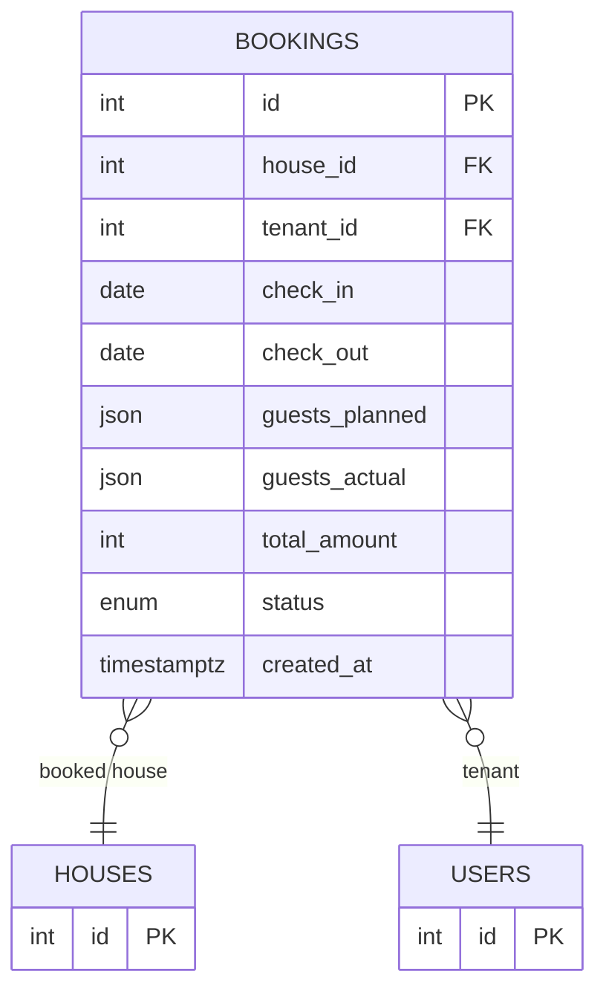
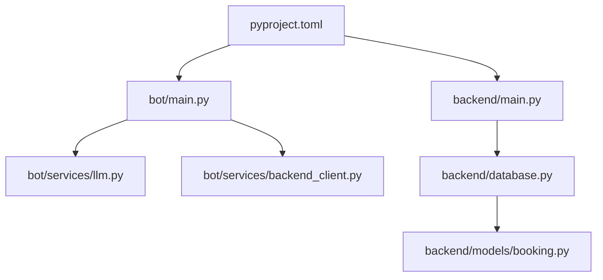

# System Architecture

<cite>
**Referenced Files in This Document**
- [README.md](file://README.md)
- [backend/main.py](file://backend/main.py)
- [backend/api/__init__.py](file://backend/api/__init__.py)
- [backend/api/bookings.py](file://backend/api/bookings.py)
- [backend/services/booking.py](file://backend/services/booking.py)
- [backend/repositories/booking.py](file://backend/repositories/booking.py)
- [backend/models/booking.py](file://backend/models/booking.py)
- [backend/database.py](file://backend/database.py)
- [backend/schemas/booking.py](file://backend/schemas/booking.py)
- [backend/config.py](file://backend/config.py)
- [bot/main.py](file://bot/main.py)
- [bot/config.py](file://bot/config.py)
- [bot/services/backend_client.py](file://bot/services/backend_client.py)
- [bot/services/llm.py](file://bot/services/llm.py)
- [docker-compose.yaml](file://docker-compose.yaml)
- [Dockerfile](file://Dockerfile)
- [Dockerfile.backend](file://Dockerfile.backend)
- [pyproject.toml](file://pyproject.toml)
</cite>

## Table of Contents
1. [Introduction](#introduction)
2. [Project Structure](#project-structure)
3. [Core Components](#core-components)
4. [Architecture Overview](#architecture-overview)
5. [Detailed Component Analysis](#detailed-component-analysis)
6. [Dependency Analysis](#dependency-analysis)
7. [Performance Considerations](#performance-considerations)
8. [Security and Cross-Cutting Concerns](#security-and-cross-cutting-concerns)
9. [Infrastructure and Deployment](#infrastructure-and-deployment)
10. [Troubleshooting Guide](#troubleshooting-guide)
11. [Conclusion](#conclusion)

## Introduction
This document describes the fullstack booking system architecture for a rural house booking platform powered by a Telegram bot. The system integrates a Telegram bot (Aiogram) with a FastAPI backend, an asynchronous SQLAlchemy ORM layer, and a PostgreSQL database. A natural language processing (NLP) capability is integrated via an OpenAI-compatible LLM provider to interpret user intent and extract structured booking actions from conversational messages. The architecture emphasizes separation of concerns, async I/O, and containerized deployment.

## Project Structure
The repository is organized into distinct layers:
- Telegram bot: Aiogram-based bot with handlers, LLM integration, and a backend HTTP client
- Backend API: FastAPI application exposing CRUD endpoints for bookings, houses, tariffs, and users
- Business logic: Services encapsulate domain rules and validations
- Persistence: SQLAlchemy async ORM with Alembic migrations
- Infrastructure: Docker Compose for local development and container images for bot and backend

**Diagram sources**
- [bot/main.py:15-41](file://bot/main.py#L15-L41)
- [bot/services/backend_client.py:26-118](file://bot/services/backend_client.py#L26-L118)
- [bot/services/llm.py:43-101](file://bot/services/llm.py#L43-L101)
- [backend/main.py:41-59](file://backend/main.py#L41-L59)
- [backend/api/__init__.py:9-14](file://backend/api/__init__.py#L9-L14)
- [backend/api/bookings.py:17-222](file://backend/api/bookings.py#L17-L222)
- [backend/services/booking.py:57-321](file://backend/services/booking.py#L57-L321)
- [backend/repositories/booking.py:13-223](file://backend/repositories/booking.py#L13-L223)
- [backend/database.py:8-40](file://backend/database.py#L8-L40)
- [backend/models/booking.py:20-40](file://backend/models/booking.py#L20-L40)
- [backend/config.py:4-24](file://backend/config.py#L4-L24)
- [docker-compose.yaml:1-43](file://docker-compose.yaml#L1-L43)
- [Dockerfile:1-13](file://Dockerfile#L1-L13)
- [Dockerfile.backend:1-20](file://Dockerfile.backend#L1-L20)
- [pyproject.toml:1-32](file://pyproject.toml#L1-L32)

**Section sources**
- [README.md:11-20](file://README.md#L11-L20)
- [docker-compose.yaml:1-43](file://docker-compose.yaml#L1-L43)
- [pyproject.toml:1-32](file://pyproject.toml#L1-L32)

## Core Components
- Telegram Bot (Aiogram)
  - Initializes logging, proxy support, and DI for BackendClient and LLMService
  - Runs long-polling dispatcher
  - References: [bot/main.py:15-41](file://bot/main.py#L15-L41), [bot/config.py:44-66](file://bot/config.py#L44-L66)

- Backend API (FastAPI)
  - Application lifecycle hooks, CORS, router aggregation, health endpoint, and global exception handlers
  - References: [backend/main.py:31-64](file://backend/main.py#L31-L64), [backend/main.py:59-59](file://backend/main.py#L59-L59), [backend/main.py:62-64](file://backend/main.py#L62-L64), [backend/main.py:156-166](file://backend/main.py#L156-L166)

- Booking API Endpoints
  - List, get, create, update, and cancel bookings with filtering and pagination
  - References: [backend/api/bookings.py:17-222](file://backend/api/bookings.py#L17-L222)

- Business Logic (Service Layer)
  - Implements domain rules: date conflict checks, amount calculation, authorization, and status transitions
  - References: [backend/services/booking.py:57-321](file://backend/services/booking.py#L57-L321)

- Persistence (Repository + ORM)
  - SQLAlchemy async engine/session, declarative base, and repository methods for CRUD and queries
  - References: [backend/database.py:8-40](file://backend/database.py#L8-L40), [backend/repositories/booking.py:13-223](file://backend/repositories/booking.py#L13-L223), [backend/models/booking.py:20-40](file://backend/models/booking.py#L20-L40)

- Data Schemas
  - Pydantic models for requests, responses, enums, and filters
  - References: [backend/schemas/booking.py:10-133](file://backend/schemas/booking.py#L10-L133)

- Configuration
  - Environment-driven settings for backend, bot, and LLM
  - References: [backend/config.py:4-24](file://backend/config.py#L4-L24), [bot/config.py:44-66](file://bot/config.py#L44-L66)

- Infrastructure
  - Docker Compose for PostgreSQL, bot, and backend; Dockerfiles for containerization
  - References: [docker-compose.yaml:1-43](file://docker-compose.yaml#L1-L43), [Dockerfile:1-13](file://Dockerfile#L1-L13), [Dockerfile.backend:1-20](file://Dockerfile.backend#L1-L20)

**Section sources**
- [bot/main.py:15-41](file://bot/main.py#L15-L41)
- [backend/main.py:31-64](file://backend/main.py#L31-L64)
- [backend/api/bookings.py:17-222](file://backend/api/bookings.py#L17-L222)
- [backend/services/booking.py:57-321](file://backend/services/booking.py#L57-L321)
- [backend/repositories/booking.py:13-223](file://backend/repositories/booking.py#L13-L223)
- [backend/database.py:8-40](file://backend/database.py#L8-L40)
- [backend/schemas/booking.py:10-133](file://backend/schemas/booking.py#L10-L133)
- [backend/config.py:4-24](file://backend/config.py#L4-L24)
- [bot/config.py:44-66](file://bot/config.py#L44-L66)
- [docker-compose.yaml:1-43](file://docker-compose.yaml#L1-L43)
- [Dockerfile:1-13](file://Dockerfile#L1-L13)
- [Dockerfile.backend:1-20](file://Dockerfile.backend#L1-L20)

## Architecture Overview
High-level system context:
- Telegram Bot interprets user messages via an LLM and translates them into structured actions
- The bot invokes the Backend API over HTTP to manage users, houses, tariffs, and bookings
- The Backend API persists data to PostgreSQL through SQLAlchemy and Alembic-managed migrations
- The system supports local development via Docker Compose and container images

**Diagram sources**
- [README.md:13-20](file://README.md#L13-L20)
- [bot/main.py:31-36](file://bot/main.py#L31-L36)
- [bot/services/llm.py:43-53](file://bot/services/llm.py#L43-L53)
- [backend/main.py:41-59](file://backend/main.py#L41-L59)
- [backend/database.py:8-23](file://backend/database.py#L8-L23)
- [backend/config.py:13-21](file://backend/config.py#L13-L21)
- [bot/config.py:49-60](file://bot/config.py#L49-L60)

## Detailed Component Analysis

### Telegram Bot to Backend API Interaction
The bot initializes Aiogram, injects settings, and wires BackendClient and LLMService into the dispatcher. It then starts long-polling. BackendClient encapsulates HTTP calls to the Backend API with retry logic and typed error handling.

**Diagram sources**
- [bot/main.py:31-41](file://bot/main.py#L31-L41)
- [bot/services/llm.py:80-101](file://bot/services/llm.py#L80-L101)
- [bot/services/backend_client.py:51-112](file://bot/services/backend_client.py#L51-L112)
- [backend/main.py:59-59](file://backend/main.py#L59-L59)
- [backend/database.py:26-40](file://backend/database.py#L26-L40)

**Section sources**
- [bot/main.py:15-41](file://bot/main.py#L15-L41)
- [bot/services/backend_client.py:26-118](file://bot/services/backend_client.py#L26-L118)
- [backend/main.py:59-59](file://backend/main.py#L59-L59)

### Booking Domain Flow
The booking flow validates inputs, checks for date conflicts, calculates totals, and persists changes. It also enforces authorization and status transitions.

**Diagram sources**
- [backend/services/booking.py:127-170](file://backend/services/booking.py#L127-L170)
- [backend/services/booking.py:78-107](file://backend/services/booking.py#L78-L107)
- [backend/repositories/booking.py:24-58](file://backend/repositories/booking.py#L24-L58)

**Section sources**
- [backend/services/booking.py:78-107](file://backend/services/booking.py#L78-L107)
- [backend/repositories/booking.py:24-58](file://backend/repositories/booking.py#L24-L58)

### LLM Integration Pattern
The LLMService builds a system prompt enriched with today’s date and current booking context, maintains per-chat histories, and handles rate limits and API errors gracefully.

**Diagram sources**
- [bot/services/llm.py:21-41](file://bot/services/llm.py#L21-L41)
- [bot/services/llm.py:43-101](file://bot/services/llm.py#L43-L101)

**Section sources**
- [bot/services/llm.py:43-101](file://bot/services/llm.py#L43-L101)

### Backend API Endpoints and Routing
The API router aggregates endpoints for health, bookings, houses, users, and tariffs. The bookings router exposes list, get, create, update, and cancel operations with Pydantic validation and pagination.

**Diagram sources**
- [backend/api/__init__.py:9-14](file://backend/api/__init__.py#L9-L14)
- [backend/api/bookings.py:17-222](file://backend/api/bookings.py#L17-L222)

**Section sources**
- [backend/api/__init__.py:9-14](file://backend/api/__init__.py#L9-L14)
- [backend/api/bookings.py:17-222](file://backend/api/bookings.py#L17-L222)

### Data Model and ORM
The Booking entity defines schema fields, foreign keys, enums, and timestamps. The repository implements CRUD and query methods, while the service applies business rules.

**Diagram sources**
- [backend/models/booking.py:20-40](file://backend/models/booking.py#L20-L40)
- [backend/repositories/booking.py:69-73](file://backend/repositories/booking.py#L69-L73)

**Section sources**
- [backend/models/booking.py:20-40](file://backend/models/booking.py#L20-L40)
- [backend/repositories/booking.py:69-73](file://backend/repositories/booking.py#L69-L73)

## Dependency Analysis
- Language and frameworks
  - Python 3.12+, FastAPI, SQLAlchemy 2.x async, Alembic, Aiogram 3.x, OpenAI client
  - References: [pyproject.toml:6-18](file://pyproject.toml#L6-L18)

- Internal dependencies
  - Bot depends on BackendClient and LLMService
  - Backend API depends on routers, services, repositories, and models
  - References: [bot/main.py:34-36](file://bot/main.py#L34-L36), [backend/api/__init__.py:9-14](file://backend/api/__init__.py#L9-L14)

- External integrations
  - LLM provider via OpenAI-compatible API (RouterAI)
  - PostgreSQL via asyncpg
  - References: [bot/config.py:51-53](file://bot/config.py#L51-L53), [backend/config.py:17-18](file://backend/config.py#L17-L18)

**Diagram sources**
- [pyproject.toml:6-18](file://pyproject.toml#L6-L18)
- [bot/main.py:31-36](file://bot/main.py#L31-L36)
- [backend/main.py:41-59](file://backend/main.py#L41-L59)
- [bot/services/llm.py:47-50](file://bot/services/llm.py#L47-L50)
- [bot/services/backend_client.py:29-31](file://bot/services/backend_client.py#L29-L31)
- [backend/database.py:8-23](file://backend/database.py#L8-L23)
- [backend/models/booking.py:20-40](file://backend/models/booking.py#L20-L40)

**Section sources**
- [pyproject.toml:6-18](file://pyproject.toml#L6-L18)
- [bot/main.py:31-36](file://bot/main.py#L31-L36)
- [backend/main.py:41-59](file://backend/main.py#L41-L59)
- [bot/services/llm.py:47-50](file://bot/services/llm.py#L47-L50)
- [bot/services/backend_client.py:29-31](file://bot/services/backend_client.py#L29-L31)
- [backend/database.py:8-23](file://backend/database.py#L8-L23)
- [backend/models/booking.py:20-40](file://backend/models/booking.py#L20-L40)

## Performance Considerations
- Asynchronous I/O
  - SQLAlchemy async engine and sessions minimize blocking on database operations
  - FastAPI and Aiogram handle concurrency efficiently
  - References: [backend/database.py:8-23](file://backend/database.py#L8-L23), [backend/main.py:41-47](file://backend/main.py#L41-L47)

- HTTP client resilience
  - BackendClient retries transient failures and normalizes error responses
  - References: [bot/services/backend_client.py:51-112](file://bot/services/backend_client.py#L51-L112)

- Pagination and filtering
  - Booking listing supports limit/offset and sorting to control payload sizes
  - References: [backend/api/bookings.py:29-51](file://backend/api/bookings.py#L29-L51), [backend/schemas/booking.py:110-133](file://backend/schemas/booking.py#L110-L133)

- LLM cost and rate control
  - Chat history capped per thread; fallback responses on rate limit/API errors
  - References: [bot/services/llm.py:13-18](file://bot/services/llm.py#L13-L18), [bot/services/llm.py:90-98](file://bot/services/llm.py#L90-L98)

[No sources needed since this section provides general guidance]

## Security and Cross-Cutting Concerns
- Authentication and authorization
  - Current implementation uses placeholder tenant_id; planned JWT integration is noted in comments
  - References: [backend/api/bookings.py:124-126](file://backend/api/bookings.py#L124-L126), [backend/api/bookings.py:175-177](file://backend/api/bookings.py#L175-L177), [backend/api/bookings.py:220-222](file://backend/api/bookings.py#L220-L222)

- CORS and transport
  - CORS middleware configured broadly; production deployments should restrict origins
  - References: [backend/main.py:49-56](file://backend/main.py#L49-L56)

- Error handling
  - Domain-specific exceptions mapped to JSON responses; global handler logs unhandled errors
  - References: [backend/main.py:67-166](file://backend/main.py#L67-L166)

- Secrets and configuration
  - Environment-based settings for tokens and URLs; avoid hardcoding secrets
  - References: [backend/config.py:7-11](file://backend/config.py#L7-L11), [bot/config.py:47-66](file://bot/config.py#L47-L66)

- Monitoring and observability
  - Logging configured at INFO level; consider structured logs and metrics collection
  - References: [backend/main.py:24-28](file://backend/main.py#L24-L28), [bot/main.py:19-23](file://bot/main.py#L19-L23)

- Disaster recovery
  - PostgreSQL managed by Docker Compose with named volume; ensure backups and replication for production
  - References: [docker-compose.yaml:8-9](file://docker-compose.yaml#L8-L9), [docker-compose.yaml:41-42](file://docker-compose.yaml#L41-L42)

**Section sources**
- [backend/api/bookings.py:124-126](file://backend/api/bookings.py#L124-L126)
- [backend/api/bookings.py:175-177](file://backend/api/bookings.py#L175-L177)
- [backend/api/bookings.py:220-222](file://backend/api/bookings.py#L220-L222)
- [backend/main.py:49-56](file://backend/main.py#L49-L56)
- [backend/main.py:67-166](file://backend/main.py#L67-L166)
- [backend/config.py:7-11](file://backend/config.py#L7-L11)
- [bot/config.py:47-66](file://bot/config.py#L47-L66)
- [docker-compose.yaml:8-9](file://docker-compose.yaml#L8-L9)
- [docker-compose.yaml:41-42](file://docker-compose.yaml#L41-L42)

## Infrastructure and Deployment
- Local development
  - Run PostgreSQL, apply migrations, start backend, and launch bot
  - References: [README.md:59-80](file://README.md#L59-L80), [README.md:102-124](file://README.md#L102-L124)

- Containerization
  - Bot image built from root; backend image built from Dockerfile.backend
  - References: [Dockerfile:1-13](file://Dockerfile#L1-L13), [Dockerfile.backend:1-20](file://Dockerfile.backend#L1-L20)

- Orchestration
  - Docker Compose defines services for bot, backend, and PostgreSQL with healthchecks
  - References: [docker-compose.yaml:1-43](file://docker-compose.yaml#L1-L43)

- Technology stack
  - FastAPI, SQLAlchemy, Aiogram, OpenAI client, Docker, Alembic
  - References: [pyproject.toml:6-18](file://pyproject.toml#L6-L18), [README.md:128-132](file://README.md#L128-L132)

**Section sources**
- [README.md:59-80](file://README.md#L59-L80)
- [README.md:102-124](file://README.md#L102-L124)
- [Dockerfile:1-13](file://Dockerfile#L1-L13)
- [Dockerfile.backend:1-20](file://Dockerfile.backend#L1-L20)
- [docker-compose.yaml:1-43](file://docker-compose.yaml#L1-L43)
- [pyproject.toml:6-18](file://pyproject.toml#L6-L18)
- [README.md:128-132](file://README.md#L128-L132)

## Troubleshooting Guide
- Backend health and API
  - Verify health endpoint and API docs URL
  - References: [README.md:75-76](file://README.md#L75-L76), [README.md](file://README.md#L132), [backend/main.py:62-64](file://backend/main.py#L62-L64)

- Database connectivity
  - Confirm database URL and PostgreSQL health status
  - References: [backend/config.py:17-18](file://backend/config.py#L17-L18), [docker-compose.yaml:10-14](file://docker-compose.yaml#L10-L14)

- Bot connectivity
  - Ensure Telegram token and proxy settings are correct
  - References: [bot/config.py:49-60](file://bot/config.py#L49-L60), [bot/main.py:25-29](file://bot/main.py#L25-L29)

- HTTP client errors
  - Inspect BackendClient error mapping and retry behavior
  - References: [bot/services/backend_client.py:67-112](file://bot/services/backend_client.py#L67-L112)

- LLM errors
  - Check rate limit handling and fallback responses
  - References: [bot/services/llm.py:90-98](file://bot/services/llm.py#L90-L98)

**Section sources**
- [README.md:75-76](file://README.md#L75-L76)
- [README.md](file://README.md#L132)
- [backend/main.py:62-64](file://backend/main.py#L62-L64)
- [backend/config.py:17-18](file://backend/config.py#L17-L18)
- [docker-compose.yaml:10-14](file://docker-compose.yaml#L10-L14)
- [bot/config.py:49-60](file://bot/config.py#L49-L60)
- [bot/main.py:25-29](file://bot/main.py#L25-L29)
- [bot/services/backend_client.py:67-112](file://bot/services/backend_client.py#L67-L112)
- [bot/services/llm.py:90-98](file://bot/services/llm.py#L90-L98)

## Conclusion
The system cleanly separates the Telegram bot, backend API, and persistence layers, leveraging async I/O and a layered architecture to support natural language booking requests. The design accommodates future enhancements such as authentication, web application frontends, and expanded integrations. Containerization and Docker Compose streamline local development and deployment, while explicit configuration and error handling improve operability.

[No sources needed since this section summarizes without analyzing specific files]