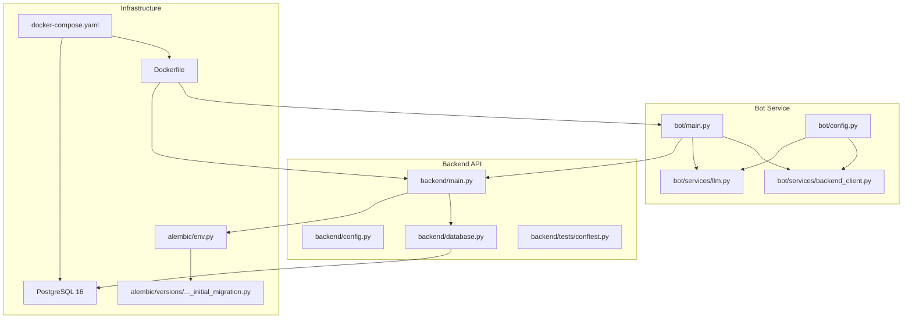
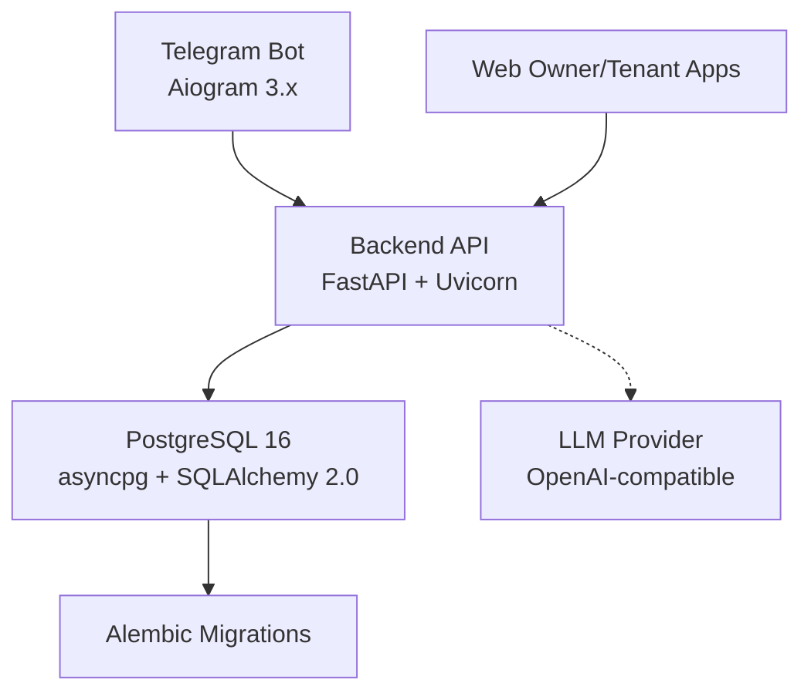
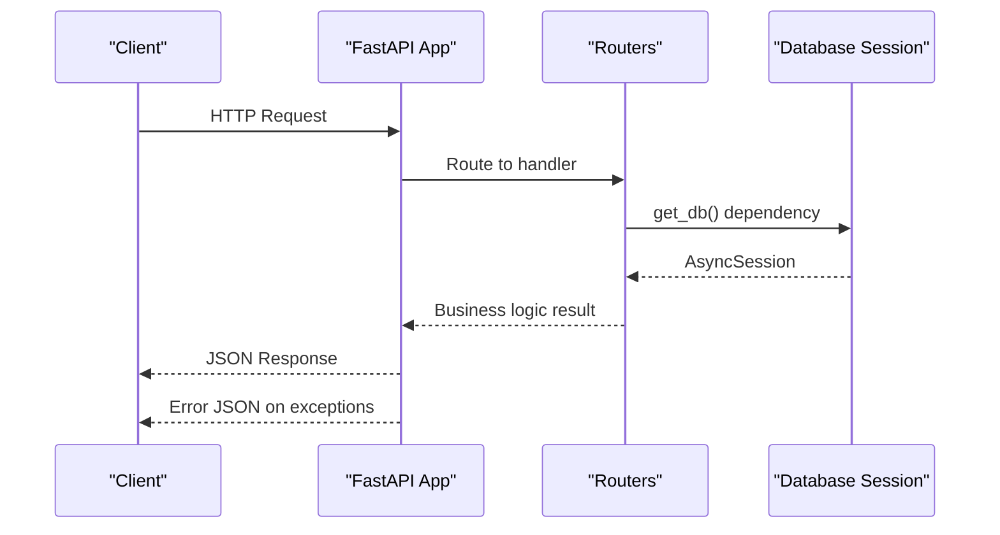
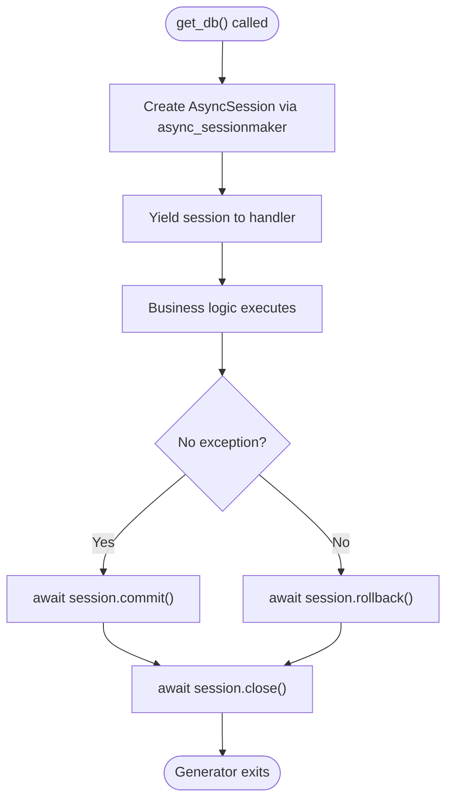
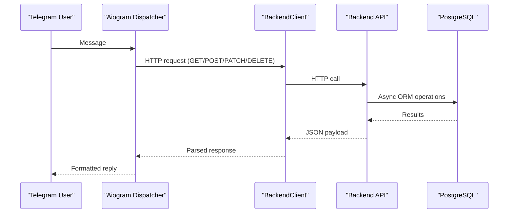
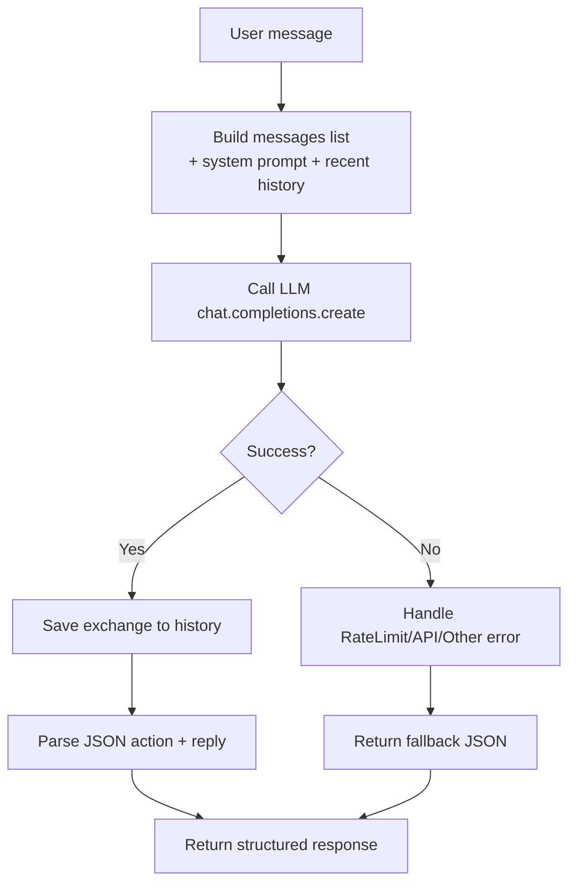
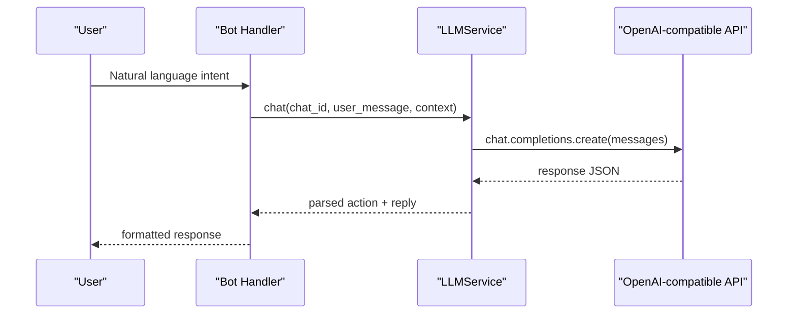

# Technology Stack

<cite>
**Referenced Files in This Document**
- [pyproject.toml](file://pyproject.toml)
- [README.md](file://README.md)
- [Makefile](file://Makefile)
- [Dockerfile](file://Dockerfile)
- [docker-compose.yaml](file://docker-compose.yaml)
- [backend/main.py](file://backend/main.py)
- [backend/config.py](file://backend/config.py)
- [backend/database.py](file://backend/database.py)
- [backend/tests/conftest.py](file://backend/tests/conftest.py)
- [alembic/env.py](file://alembic/env.py)
- [alembic/versions/2a84cf51810b_initial_migration.py](file://alembic/versions/2a84cf51810b_initial_migration.py)
- [bot/main.py](file://bot/main.py)
- [bot/config.py](file://bot/config.py)
- [bot/services/backend_client.py](file://bot/services/backend_client.py)
- [bot/services/llm.py](file://bot/services/llm.py)
</cite>

## Table of Contents
1. [Introduction](#introduction)
2. [Project Structure](#project-structure)
3. [Core Technologies](#core-technologies)
4. [Architecture Overview](#architecture-overview)
5. [Detailed Component Analysis](#detailed-component-analysis)
6. [Development Tools](#development-tools)
7. [AI/LLM Integration](#aillm-integration)
8. [Version Compatibility and Upgrade Paths](#version-compatibility-and-upgrade-paths)
9. [Comparison with Alternatives](#comparison-with-alternatives)
10. [Performance Considerations](#performance-considerations)
11. [Troubleshooting Guide](#troubleshooting-guide)
12. [Conclusion](#conclusion)

## Introduction
This document explains the technology stack and framework selection for the rural property booking system. It covers the backend web framework (FastAPI), Telegram bot development (Aiogram), database ORM and driver (SQLAlchemy 2.0 + asyncpg), PostgreSQL persistence, development toolchain (Ruff, Pytest, Alembic), containerization (Docker), and AI/LLM integration via OpenAI-compatible APIs. It also documents version compatibility, dependency management, upgrade paths, and the trade-offs behind each choice.

## Project Structure
The project is organized into two primary services plus shared infrastructure:
- Backend API service built with FastAPI and hosted via Uvicorn
- Telegram bot service using Aiogram 3.x with an integrated LLM service
- Shared database layer powered by SQLAlchemy 2.0 with asyncpg and managed by Alembic
- Container orchestration via Docker Compose with a PostgreSQL 16 service

**Diagram sources**
- [bot/main.py:1-46](file://bot/main.py#L1-L46)
- [bot/config.py:1-67](file://bot/config.py#L1-L67)
- [bot/services/backend_client.py:1-244](file://bot/services/backend_client.py#L1-L244)
- [bot/services/llm.py:1-106](file://bot/services/llm.py#L1-L106)
- [backend/main.py:1-173](file://backend/main.py#L1-L173)
- [backend/config.py:1-25](file://backend/config.py#L1-L25)
- [backend/database.py:1-41](file://backend/database.py#L1-L41)
- [backend/tests/conftest.py:1-150](file://backend/tests/conftest.py#L1-L150)
- [alembic/env.py:1-95](file://alembic/env.py#L1-L95)
- [alembic/versions/2a84cf51810b_initial_migration.py:1-84](file://alembic/versions/2a84cf51810b_initial_migration.py#L1-L84)
- [Dockerfile:1-13](file://Dockerfile#L1-L13)
- [docker-compose.yaml:1-43](file://docker-compose.yaml#L1-L43)

**Section sources**
- [README.md:1-133](file://README.md#L1-L133)
- [docker-compose.yaml:1-43](file://docker-compose.yaml#L1-L43)
- [Dockerfile:1-13](file://Dockerfile#L1-L13)

## Core Technologies
This section details the core technologies and the rationale behind each selection for the booking system.

- Python 3.12+
  - Requirement: The project targets Python 3.12+ for modern language features, performance improvements, and ecosystem alignment.
  - Evidence: Project metadata and tool configuration specify Python 3.12 as the minimum requirement.
  - Benefits: Strong async/await support, improved type hints, and efficient CPython runtime.

- FastAPI for backend web services
  - Purpose: High-performance ASGI web framework with automatic OpenAPI/Swagger generation and strong Pydantic integration.
  - Evidence: Application instantiation, lifecycle hooks, CORS middleware, router inclusion, and exception handlers are implemented in the backend entrypoint.
  - Benefits: Developer productivity, runtime performance, and excellent tooling for API contracts.

- Aiogram for Telegram bot development
  - Purpose: Modern Telegram Bot API client supporting async workflows and flexible routing.
  - Evidence: Bot initialization, dispatcher setup, dependency injection for backend client and LLM service, and polling startup.
  - Benefits: Async-first design, easy integration with external services, and robust update handling.

- SQLAlchemy 2.0 with asyncpg for database operations
  - Purpose: Asynchronous ORM and database connectivity for PostgreSQL.
  - Evidence: Async engine creation, session factory, declarative base, and dependency-based session provider.
  - Benefits: Type-safe ORM, async I/O for scalable database access, and clear separation of concerns.

- PostgreSQL for data persistence
  - Purpose: ACID-compliant relational database with JSON/JSONB support, enums, and advanced indexing.
  - Evidence: Initial migration defines tables for tariffs, users, houses, and bookings; Docker Compose provisions a PostgreSQL 16 service.
  - Benefits: Mature ecosystem, strong consistency, and extensibility for analytics and reporting.

**Section sources**
- [pyproject.toml:1-32](file://pyproject.toml#L1-L32)
- [backend/main.py:1-173](file://backend/main.py#L1-L173)
- [bot/main.py:1-46](file://bot/main.py#L1-L46)
- [backend/database.py:1-41](file://backend/database.py#L1-L41)
- [alembic/versions/2a84cf51810b_initial_migration.py:1-84](file://alembic/versions/2a84cf51810b_initial_migration.py#L1-L84)
- [docker-compose.yaml:1-43](file://docker-compose.yaml#L1-L43)

## Architecture Overview
The system follows a clear separation of concerns:
- Telegram bot handles user intents and orchestrates requests to the backend API.
- Backend API exposes CRUD and business logic endpoints secured with typed schemas and centralized exception handling.
- Database is accessed asynchronously via SQLAlchemy 2.0 with asyncpg, ensuring non-blocking I/O.
- Alembic manages schema evolution and migrations.
- Docker Compose coordinates services and persistent storage.

**Diagram sources**
- [bot/main.py:1-46](file://bot/main.py#L1-L46)
- [backend/main.py:1-173](file://backend/main.py#L1-L173)
- [backend/database.py:1-41](file://backend/database.py#L1-L41)
- [alembic/env.py:1-95](file://alembic/env.py#L1-L95)
- [docker-compose.yaml:1-43](file://docker-compose.yaml#L1-L43)

## Detailed Component Analysis

### Backend API (FastAPI)
Key characteristics:
- ASGI application with lifespan hooks for startup/shutdown
- CORS enabled for cross-origin requests
- Centralized exception handlers returning structured error responses
- Health endpoint for readiness checks
- Dependency injection pattern for database sessions

**Diagram sources**
- [backend/main.py:1-173](file://backend/main.py#L1-L173)
- [backend/database.py:1-41](file://backend/database.py#L1-L41)

**Section sources**
- [backend/main.py:1-173](file://backend/main.py#L1-L173)
- [backend/config.py:1-25](file://backend/config.py#L1-L25)
- [backend/database.py:1-41](file://backend/database.py#L1-L41)

### Database Layer (SQLAlchemy 2.0 + asyncpg)
Key characteristics:
- Async engine configured with echo and future=True
- Async session factory with explicit commit/rollback semantics
- Dependency provider yields sessions per request
- Alembic environment supports offline/online async migrations

**Diagram sources**
- [backend/database.py:1-41](file://backend/database.py#L1-L41)
- [alembic/env.py:1-95](file://alembic/env.py#L1-L95)

**Section sources**
- [backend/database.py:1-41](file://backend/database.py#L1-L41)
- [alembic/env.py:1-95](file://alembic/env.py#L1-L95)
- [alembic/versions/2a84cf51810b_initial_migration.py:1-84](file://alembic/versions/2a84cf51810b_initial_migration.py#L1-L84)

### Telegram Bot (Aiogram 3.x)
Key characteristics:
- Async bot and dispatcher setup
- Optional proxy configuration via AiohttpSession
- Dependency injection for backend client and LLM service
- Polling-based long-running loop

**Diagram sources**
- [bot/main.py:1-46](file://bot/main.py#L1-L46)
- [bot/services/backend_client.py:1-244](file://bot/services/backend_client.py#L1-L244)
- [backend/main.py:1-173](file://backend/main.py#L1-L173)
- [backend/database.py:1-41](file://backend/database.py#L1-L41)

**Section sources**
- [bot/main.py:1-46](file://bot/main.py#L1-L46)
- [bot/config.py:1-67](file://bot/config.py#L1-L67)
- [bot/services/backend_client.py:1-244](file://bot/services/backend_client.py#L1-L244)

### LLM Integration (OpenAI-compatible)
Key characteristics:
- Async OpenAI client configured with base URL and API key
- Chat history management with bounded window
- Structured JSON action extraction from LLM responses
- Fallback responses for rate limits and API errors

**Diagram sources**
- [bot/services/llm.py:1-106](file://bot/services/llm.py#L1-L106)
- [bot/config.py:1-67](file://bot/config.py#L1-L67)

**Section sources**
- [bot/services/llm.py:1-106](file://bot/services/llm.py#L1-L106)
- [bot/config.py:1-67](file://bot/config.py#L1-L67)

## Development Tools
The development toolchain emphasizes quality, consistency, and reproducible environments.

- Ruff for linting and formatting
  - Configuration targets Python 3.12 and enforces line length limits.
  - Used via Makefile commands for local and Docker-based runs.

- Pytest for testing
  - Async-aware test suite with fixtures for database setup and teardown.
  - Test database provisioning and schema creation/drop in a separate database.

- Alembic for database migrations
  - Async migration environment supporting offline/online modes.
  - Initial migration defines core tables with indexes and foreign keys.

- Docker for containerization
  - Multi-stage build with uv for deterministic installs.
  - Separate Docker Compose service for PostgreSQL 16 with health checks.
  - Makefile commands orchestrate builds, migrations, and logs.

**Section sources**
- [pyproject.toml:1-32](file://pyproject.toml#L1-L32)
- [Makefile:1-71](file://Makefile#L1-L71)
- [backend/tests/conftest.py:1-150](file://backend/tests/conftest.py#L1-L150)
- [alembic/env.py:1-95](file://alembic/env.py#L1-L95)
- [alembic/versions/2a84cf51810b_initial_migration.py:1-84](file://alembic/versions/2a84cf51810b_initial_migration.py#L1-L84)
- [Dockerfile:1-13](file://Dockerfile#L1-L13)
- [docker-compose.yaml:1-43](file://docker-compose.yaml#L1-L43)

## AI/LLM Integration
The bot integrates with an OpenAI-compatible LLM provider to interpret natural language intents and produce structured actions for booking operations. The LLM service:
- Maintains per-chat histories with bounded capacity
- Builds system prompts enriched with current date and contextual booking info
- Parses LLM responses into JSON actions and replies
- Handles rate limits and API errors gracefully with fallback responses

**Diagram sources**
- [bot/services/llm.py:1-106](file://bot/services/llm.py#L1-L106)
- [bot/config.py:1-67](file://bot/config.py#L1-L67)

**Section sources**
- [bot/services/llm.py:1-106](file://bot/services/llm.py#L1-L106)
- [bot/config.py:1-67](file://bot/config.py#L1-L67)

## Version Compatibility and Upgrade Paths
- Python 3.12+
  - Required by project metadata; aligns toolchain and runtime expectations.

- FastAPI and Uvicorn
  - FastAPI version constraints ensure modern ASGI features and OpenAPI generation.
  - Uvicorn provides production-grade ASGI server with hot-reload support.

- SQLAlchemy 2.0 + asyncpg
  - Async engine/session factory and declarative base are used consistently.
  - Upgrade path: follow SQLAlchemy 2.x migration guides; maintain asyncpg compatibility.

- PostgreSQL 16
  - Latest major version ensures performance and feature parity.
  - Migration environment supports async connections for Alembic.

- Aiogram 3.x
  - Async-first design and modern router patterns.
  - Upgrade path: review breaking changes in Aiogram releases and adapt handlers.

- OpenAI client
  - Async client usage and error handling aligned with current SDK patterns.
  - Upgrade path: monitor provider API changes and SDK updates.

- Dependency management
  - uv is used for deterministic installs; lock file ensures reproducibility.
  - Makefile commands encapsulate common tasks for local and CI environments.

**Section sources**
- [pyproject.toml:1-32](file://pyproject.toml#L1-L32)
- [backend/database.py:1-41](file://backend/database.py#L1-L41)
- [alembic/env.py:1-95](file://alembic/env.py#L1-L95)
- [docker-compose.yaml:1-43](file://docker-compose.yaml#L1-L43)
- [Dockerfile:1-13](file://Dockerfile#L1-L13)
- [Makefile:1-71](file://Makefile#L1-L71)

## Comparison with Alternatives
- Web frameworks
  - Alternative: Django REST Framework or Quart
  - Decision: FastAPI offers superior developer ergonomics, automatic documentation, and performance; Quart would require similar async patterns but less integrated tooling.

- Database ORMs
  - Alternative: Tortoise ORM or SQLAlchemy 1.x
  - Decision: SQLAlchemy 2.0 provides mature async support, strong typing, and ecosystem maturity; 1.x lacks async features.

- Database drivers
  - Alternative: psycopg2 (sync) or asyncpg (async)
  - Decision: asyncpg matches SQLAlchemy 2.0 async engine and provides excellent async performance.

- Testing
  - Alternative: unittest or pytest with sync fixtures
  - Decision: Pytest with pytest-asyncio and async fixtures provides robust async test support.

- Linting/formatting
  - Alternative: flake8/black or pylint/ruff
  - Decision: Ruff combines linting and formatting with speed and Python 3.12+ focus.

- Containerization
  - Alternative: Docker Compose or Kubernetes
  - Decision: Docker Compose suits development and small-scale deployments; Kubernetes recommended for production scale.

[No sources needed since this section provides comparative analysis without quoting specific files]

## Performance Considerations
- Async I/O
  - Both bot and backend leverage async patterns to handle concurrent requests efficiently.
  - Database sessions are short-lived and committed/rolled back promptly.

- Database design
  - Enum columns and JSON fields balance normalization and flexibility.
  - Indexes on frequently queried columns improve lookup performance.

- Caching and retries
  - Backend client implements retry logic for transient failures.
  - LLM service caches chat histories to reduce context size and cost.

- Containerization
  - uv-based installation reduces image size and improves cold-start performance.
  - Separate services enable horizontal scaling and independent deployment.

[No sources needed since this section provides general guidance]

## Troubleshooting Guide
Common issues and resolutions:
- Database connectivity
  - Verify environment variables for database URL and credentials.
  - Ensure PostgreSQL service is healthy and reachable from backend container.

- Migration failures
  - Run migrations inside the backend container using Alembic commands.
  - Confirm async migration environment is used for online mode.

- Bot proxy configuration
  - If behind a proxy, set the proxy URL in settings; verify network reachability.

- LLM rate limits
  - Monitor rate limit errors and implement backoff or throttling in upstream systems.

- Test database setup
  - Tests automatically create and drop the test database; ensure permissions are correct.

**Section sources**
- [backend/config.py:1-25](file://backend/config.py#L1-L25)
- [alembic/env.py:1-95](file://alembic/env.py#L1-L95)
- [bot/config.py:1-67](file://bot/config.py#L1-L67)
- [bot/services/llm.py:1-106](file://bot/services/llm.py#L1-L106)
- [backend/tests/conftest.py:1-150](file://backend/tests/conftest.py#L1-L150)

## Conclusion
The technology stack balances developer productivity, system performance, and operational simplicity. FastAPI and SQLAlchemy 2.0 provide a modern, type-safe foundation for the backend; Aiogram delivers robust Telegram integration; PostgreSQL ensures reliable persistence; Alembic streamlines schema evolution; and Docker/uv enable reproducible builds. The LLM integration adds conversational UX while maintaining structured actions for backend operations. Together, these choices support scalability, maintainability, and rapid iteration.