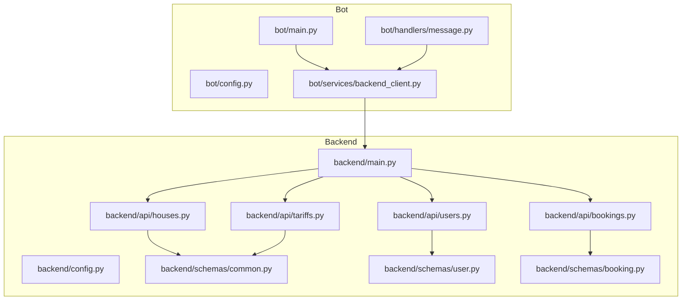
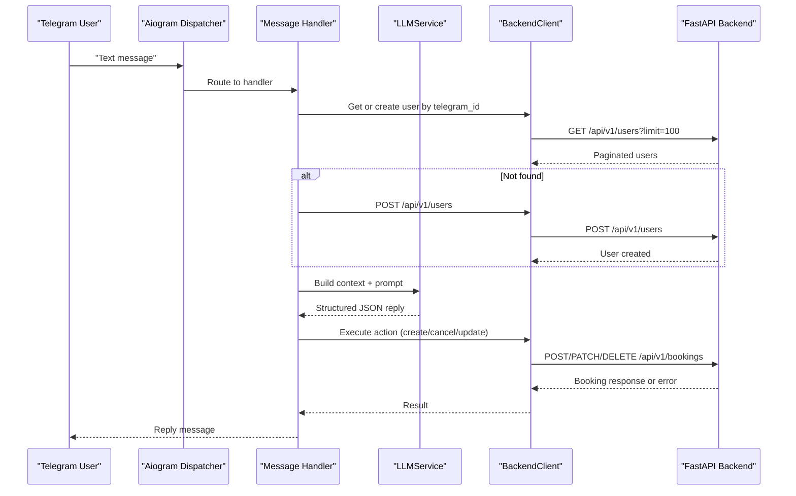
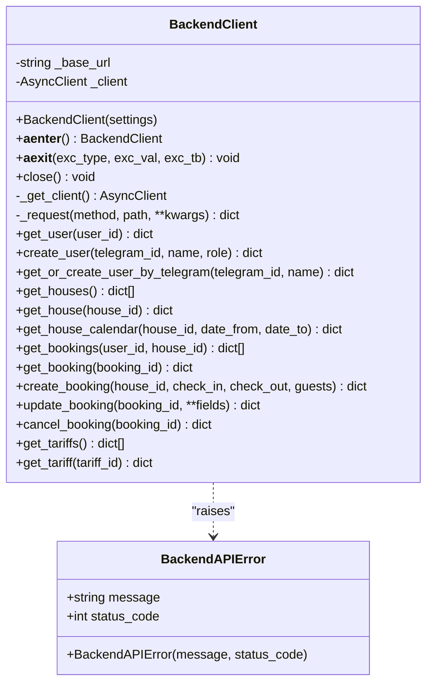
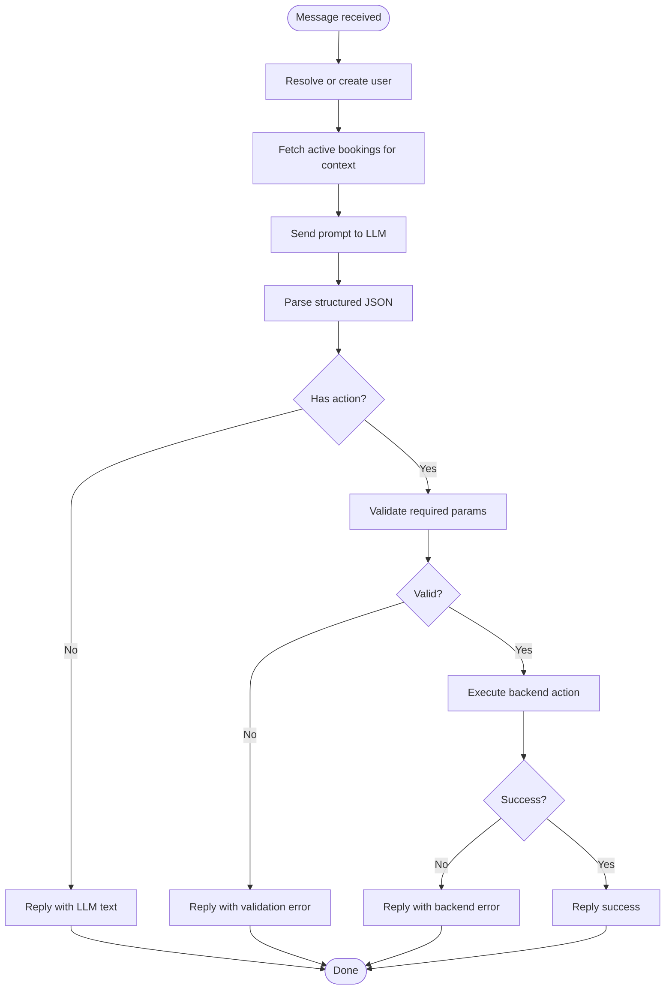
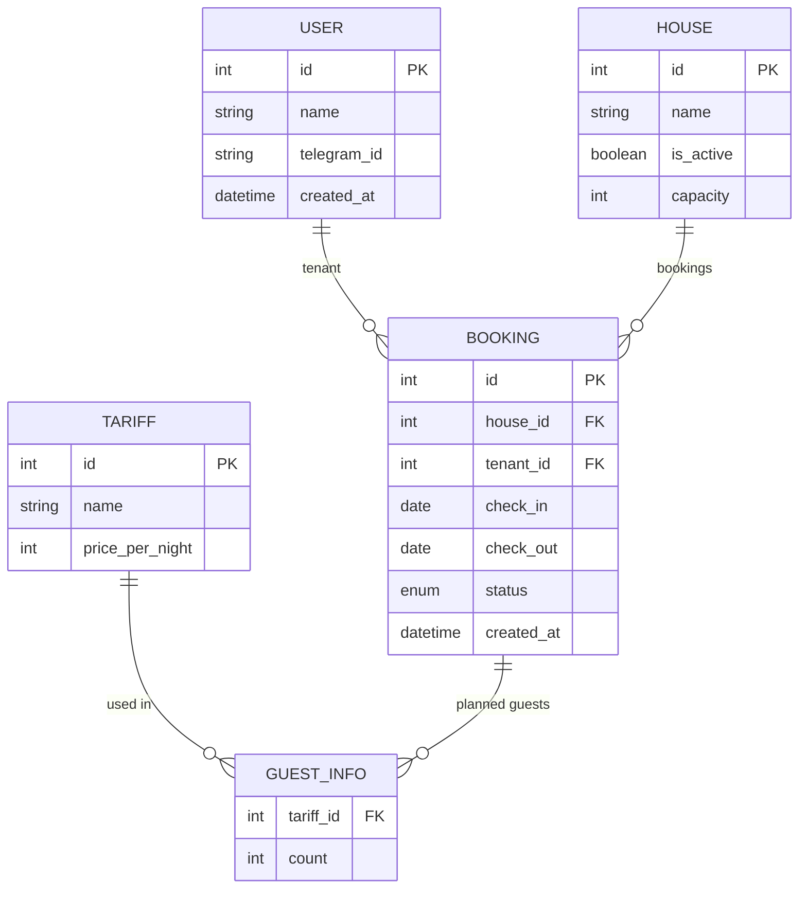
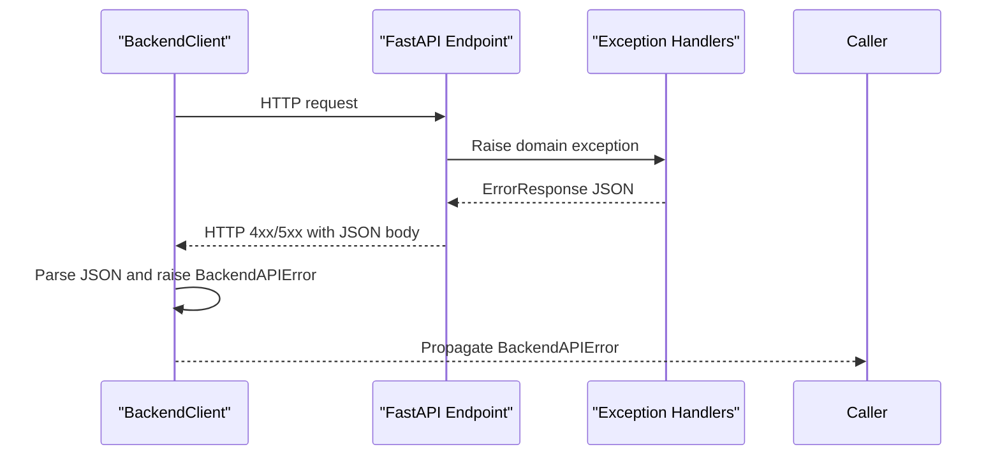
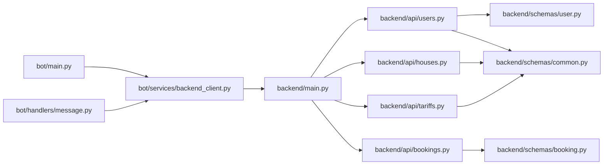

# Backend Communication and API Integration

<cite>
**Referenced Files in This Document**
- [backend_client.py](file://bot/services/backend_client.py)
- [message.py](file://bot/handlers/message.py)
- [main.py](file://bot/main.py)
- [config.py](file://bot/config.py)
- [main.py](file://backend/main.py)
- [config.py](file://backend/config.py)
- [bookings.py](file://backend/api/bookings.py)
- [users.py](file://backend/api/users.py)
- [houses.py](file://backend/api/houses.py)
- [tariffs.py](file://backend/api/tariffs.py)
- [common.py](file://backend/schemas/common.py)
- [user.py](file://backend/schemas/user.py)
- [booking.py](file://backend/schemas/booking.py)
</cite>

## Table of Contents
1. [Introduction](#introduction)
2. [Project Structure](#project-structure)
3. [Core Components](#core-components)
4. [Architecture Overview](#architecture-overview)
5. [Detailed Component Analysis](#detailed-component-analysis)
6. [Dependency Analysis](#dependency-analysis)
7. [Performance Considerations](#performance-considerations)
8. [Troubleshooting Guide](#troubleshooting-guide)
9. [Conclusion](#conclusion)

## Introduction
This document explains how the Telegram bot communicates with the FastAPI backend, focusing on the HTTP client implementation, API endpoint mapping, data serialization patterns, service configuration, authentication handling, and error propagation strategies. It provides both conceptual overviews for beginners and technical details for developers implementing similar client integrations. The bot uses an asynchronous HTTP client to call REST endpoints under a versioned base path, serializes and deserializes payloads using Pydantic models, and retries transient failures with timeouts configured at the client level.

## Project Structure
The integration spans two primary areas:
- Bot-side HTTP client and handler logic that orchestrates LLM prompts, builds context, and dispatches actions to the backend.
- FastAPI backend that exposes versioned endpoints for users, houses, bookings, and tariffs, with standardized error and pagination schemas.

**Diagram sources**
- [main.py:15-41](file://bot/main.py#L15-L41)
- [config.py:44-66](file://bot/config.py#L44-L66)
- [backend_client.py:26-118](file://bot/services/backend_client.py#L26-L118)
- [message.py:387-436](file://bot/handlers/message.py#L387-L436)
- [config.py:4-24](file://backend/config.py#L4-L24)
- [main.py:41-59](file://backend/main.py#L41-L59)
- [users.py:16-222](file://backend/api/users.py#L16-L222)
- [houses.py:18-265](file://backend/api/houses.py#L18-L265)
- [bookings.py:17-222](file://backend/api/bookings.py#L17-L222)
- [tariffs.py:15-186](file://backend/api/tariffs.py#L15-L186)
- [common.py:16-42](file://backend/schemas/common.py#L16-L42)
- [user.py:18-72](file://backend/schemas/user.py#L18-L72)
- [booking.py:10-133](file://backend/schemas/booking.py#L10-L133)

**Section sources**
- [main.py:15-41](file://bot/main.py#L15-L41)
- [config.py:44-66](file://bot/config.py#L44-L66)
- [backend_client.py:26-118](file://bot/services/backend_client.py#L26-L118)
- [message.py:387-436](file://bot/handlers/message.py#L387-L436)
- [config.py:4-24](file://backend/config.py#L4-L24)
- [main.py:41-59](file://backend/main.py#L41-L59)
- [users.py:16-222](file://backend/api/users.py#L16-L222)
- [houses.py:18-265](file://backend/api/houses.py#L18-L265)
- [bookings.py:17-222](file://backend/api/bookings.py#L17-L222)
- [tariffs.py:15-186](file://backend/api/tariffs.py#L15-L186)
- [common.py:16-42](file://backend/schemas/common.py#L16-L42)
- [user.py:18-72](file://backend/schemas/user.py#L18-L72)
- [booking.py:10-133](file://backend/schemas/booking.py#L10-L133)

## Core Components
- Backend HTTP client: Implements an async HTTP client with lazy initialization, configurable timeout, and retry logic for transient failures. Provides typed methods for users, houses, bookings, and tariffs.
- Handler orchestration: Filters incoming messages, resolves user identity via backend, builds contextual state, queries LLM, parses structured output, and dispatches actions to backend endpoints.
- FastAPI backend: Exposes versioned routes under /api/v1 with standardized error and pagination schemas, and domain-specific request/response models.

Key capabilities:
- Endpoint mapping: Users (/users), Houses (/houses), Bookings (/bookings), Tariffs (/tariffs)
- Serialization: Pydantic models define request/response shapes and validation rules
- Error propagation: Backend returns structured ErrorResponse; bot surfaces BackendAPIError to handlers
- Authentication: Endpoints currently accept a placeholder tenant_id; authentication is marked as pending in comments

**Section sources**
- [backend_client.py:26-118](file://bot/services/backend_client.py#L26-L118)
- [message.py:387-436](file://bot/handlers/message.py#L387-L436)
- [main.py:41-59](file://backend/main.py#L41-L59)
- [common.py:16-42](file://backend/schemas/common.py#L16-L42)
- [user.py:18-72](file://backend/schemas/user.py#L18-L72)
- [booking.py:10-133](file://backend/schemas/booking.py#L10-L133)

## Architecture Overview
The bot’s runtime initializes services, injects the BackendClient into the dispatcher, and handles user messages. The flow integrates LLM reasoning with backend API calls.

**Diagram sources**
- [main.py:31-38](file://bot/main.py#L31-L38)
- [message.py:387-436](file://bot/handlers/message.py#L387-L436)
- [backend_client.py:124-230](file://bot/services/backend_client.py#L124-L230)
- [bookings.py:86-222](file://backend/api/bookings.py#L86-L222)
- [users.py:85-115](file://backend/api/users.py#L85-L115)

## Detailed Component Analysis

### Backend HTTP Client
The client encapsulates HTTP communication with the backend:
- Lazy initialization of httpx.AsyncClient with a default timeout and redirect following
- Centralized _request method with retry loop for transient server errors, timeouts, and connection errors
- Typed facade methods for users, houses, bookings, and tariffs
- Automatic serialization/deserialization of JSON payloads
- Propagation of BackendAPIError with optional HTTP status codes

**Diagram sources**
- [backend_client.py:26-118](file://bot/services/backend_client.py#L26-L118)
- [backend_client.py:124-244](file://bot/services/backend_client.py#L124-L244)

Implementation highlights:
- Timeout and retries: Default timeout and fixed retry count are defined at module level; the client retries only server-side errors and transient network conditions
- Error mapping: HTTP 404/400/403 mapped to specific error semantics; 5xx retried; others raised immediately
- Payload conversion: Dates are serialized to ISO format for requests; calendars accept optional date filters

**Section sources**
- [backend_client.py:13-14](file://bot/services/backend_client.py#L13-L14)
- [backend_client.py:33-118](file://bot/services/backend_client.py#L33-L118)
- [backend_client.py:124-244](file://bot/services/backend_client.py#L124-L244)

### Handler Orchestration and Action Dispatch
The message handler:
- Resolves user identity via backend (get-or-create by telegram_id)
- Builds contextual state by fetching active bookings
- Queries LLM for structured JSON response
- Parses and validates action parameters
- Executes actions against backend endpoints (create/cancel/update booking)
- Formats replies and handles errors

**Diagram sources**
- [message.py:387-436](file://bot/handlers/message.py#L387-L436)
- [message.py:147-158](file://bot/handlers/message.py#L147-L158)
- [message.py:185-213](file://bot/handlers/message.py#L185-L213)
- [message.py:215-240](file://bot/handlers/message.py#L215-L240)
- [message.py:255-283](file://bot/handlers/message.py#L255-L283)

**Section sources**
- [message.py:387-436](file://bot/handlers/message.py#L387-L436)
- [message.py:147-158](file://bot/handlers/message.py#L147-L158)
- [message.py:185-213](file://bot/handlers/message.py#L185-L213)
- [message.py:215-240](file://bot/handlers/message.py#L215-L240)
- [message.py:255-283](file://bot/handlers/message.py#L255-L283)

### API Endpoint Mapping and Data Serialization
The backend defines versioned endpoints under /api/v1 with consistent response patterns:
- Users: list, get, create, replace, update, delete
- Houses: list, get, create, replace, update, delete, calendar
- Bookings: list, get, create, update, cancel
- Tariffs: list, get, create, update, delete

Serialization patterns:
- Request/response models defined with Pydantic
- Pagination via generic PaginatedResponse wrapper
- Standardized ErrorResponse for error responses
- Validation enforced via model validators and FastAPI dependencies

**Diagram sources**
- [user.py:18-36](file://backend/schemas/user.py#L18-L36)
- [booking.py:43-68](file://backend/schemas/booking.py#L43-L68)
- [booking.py:25-33](file://backend/schemas/booking.py#L25-L33)
- [tariffs.py:15-186](file://backend/api/tariffs.py#L15-L186)

**Section sources**
- [users.py:16-222](file://backend/api/users.py#L16-L222)
- [houses.py:18-265](file://backend/api/houses.py#L18-L265)
- [bookings.py:17-222](file://backend/api/bookings.py#L17-L222)
- [tariffs.py:15-186](file://backend/api/tariffs.py#L15-L186)
- [common.py:16-42](file://backend/schemas/common.py#L16-L42)
- [user.py:18-72](file://backend/schemas/user.py#L18-L72)
- [booking.py:10-133](file://backend/schemas/booking.py#L10-L133)

### Authentication Handling
- Endpoints currently accept a placeholder tenant_id in route handlers (marked as TODO for future JWT integration)
- No explicit authentication middleware is configured in the backend app initialization
- Bot relies on backend-provided user identity resolution via telegram_id

Recommendation:
- Integrate JWT-based authentication in backend and propagate tokens via Authorization headers
- Add token refresh and error handling for unauthorized responses

**Section sources**
- [bookings.py:123-126](file://backend/api/bookings.py#L123-L126)
- [bookings.py:175-177](file://backend/api/bookings.py#L175-L177)
- [bookings.py:220-222](file://backend/api/bookings.py#L220-L222)
- [users.py:99-115](file://backend/api/users.py#L99-L115)
- [main.py:41-59](file://backend/main.py#L41-L59)

### Error Propagation Strategies
- Backend returns standardized ErrorResponse with error code and human-readable message
- Domain-specific exceptions mapped to appropriate HTTP status codes
- Global exception handler ensures unhandled errors return internal_error
- Bot wraps HTTP errors into BackendAPIError and propagates to handlers for user-facing messaging

**Diagram sources**
- [main.py:67-166](file://backend/main.py#L67-L166)
- [common.py:16-27](file://backend/schemas/common.py#L16-L27)
- [backend_client.py:67-110](file://bot/services/backend_client.py#L67-L110)

**Section sources**
- [main.py:67-166](file://backend/main.py#L67-L166)
- [common.py:16-27](file://backend/schemas/common.py#L16-L27)
- [backend_client.py:67-110](file://bot/services/backend_client.py#L67-L110)

### Practical Examples
Common API calls and flows:
- Create user from Telegram: POST /api/v1/users with telegram_id, name, role
- Get or create user by telegram_id: GET /api/v1/users?limit=100 then POST /api/v1/users fallback
- List bookings with filters: GET /api/v1/bookings?limit=100&user_id={id}
- Create booking: POST /api/v1/bookings with house_id, check_in, check_out, guests
- Update booking: PATCH /api/v1/bookings/{id} with fields like check_in/check_out/guests/status
- Cancel booking: DELETE /api/v1/bookings/{id}

Error scenarios:
- Validation errors: 422 with ErrorResponse
- Not found: 404 with ErrorResponse
- Permission denied: 403 with ErrorResponse
- Server errors: 500 with ErrorResponse; client retries transparently

**Section sources**
- [backend_client.py:128-151](file://bot/services/backend_client.py#L128-L151)
- [backend_client.py:199-230](file://bot/services/backend_client.py#L199-L230)
- [users.py:85-115](file://backend/api/users.py#L85-L115)
- [bookings.py:86-222](file://backend/api/bookings.py#L86-L222)
- [main.py:67-166](file://backend/main.py#L67-L166)

## Dependency Analysis
The bot depends on the BackendClient for all backend interactions. The handler uses the client to resolve users, fetch context, and execute actions. The backend exposes versioned routes and enforces request/response schemas.

**Diagram sources**
- [main.py:31-38](file://bot/main.py#L31-L38)
- [message.py:387-436](file://bot/handlers/message.py#L387-L436)
- [backend_client.py:26-118](file://bot/services/backend_client.py#L26-L118)
- [main.py:41-59](file://backend/main.py#L41-L59)
- [users.py:16-222](file://backend/api/users.py#L16-L222)
- [houses.py:18-265](file://backend/api/houses.py#L18-L265)
- [bookings.py:17-222](file://backend/api/bookings.py#L17-L222)
- [tariffs.py:15-186](file://backend/api/tariffs.py#L15-L186)
- [user.py:18-72](file://backend/schemas/user.py#L18-L72)
- [booking.py:10-133](file://backend/schemas/booking.py#L10-L133)
- [common.py:16-42](file://backend/schemas/common.py#L16-L42)

**Section sources**
- [main.py:31-38](file://bot/main.py#L31-L38)
- [message.py:387-436](file://bot/handlers/message.py#L387-L436)
- [backend_client.py:26-118](file://bot/services/backend_client.py#L26-L118)
- [main.py:41-59](file://backend/main.py#L41-L59)
- [users.py:16-222](file://backend/api/users.py#L16-L222)
- [houses.py:18-265](file://backend/api/houses.py#L18-L265)
- [bookings.py:17-222](file://backend/api/bookings.py#L17-L222)
- [tariffs.py:15-186](file://backend/api/tariffs.py#L15-L186)
- [user.py:18-72](file://backend/schemas/user.py#L18-L72)
- [booking.py:10-133](file://backend/schemas/booking.py#L10-L133)
- [common.py:16-42](file://backend/schemas/common.py#L16-L42)

## Performance Considerations
- Connection reuse: The client lazily creates a single httpx.AsyncClient instance; reuse reduces overhead
- Timeouts: Default timeout applied to all requests; tune based on expected latency and SLAs
- Retries: Limited retry count for server errors; avoid retry storms by backing off or using jitter in production
- Pagination: Use limit/offset consistently to avoid large payloads
- Serialization: Pydantic validation occurs on both ends; keep payloads minimal and typed
- Caching: Consider caching non-sensitive data (e.g., tariffs, house lists) at the handler level to reduce round-trips

[No sources needed since this section provides general guidance]

## Troubleshooting Guide
Common issues and resolutions:
- Network connectivity
  - Symptoms: ConnectError or TimeoutException
  - Actions: Verify backend URL, firewall, DNS, and container networking; confirm backend is healthy at /health
- API versioning
  - Symptoms: 404 on /api/v1 endpoints
  - Actions: Ensure backend includes router with prefix /api/v1 and that clients use matching base URL
- Authentication
  - Symptoms: 403 responses despite valid credentials
  - Actions: Implement JWT middleware and propagate Authorization headers; verify token scopes
- Validation errors
  - Symptoms: 422 with ErrorResponse
  - Actions: Inspect details field for field-level validation messages; align payload with Pydantic models
- Rate limiting or LLM errors
  - Symptoms: LLM fallback responses or rate limit warnings
  - Actions: Back off and retry; adjust model or reduce payload size
- Context building failures
  - Symptoms: Handler logs warnings when fetching bookings for context
  - Actions: Retry logic in handler; surface user-friendly messages

**Section sources**
- [backend_client.py:94-110](file://bot/services/backend_client.py#L94-L110)
- [main.py:62-64](file://backend/main.py#L62-L64)
- [main.py:41-59](file://backend/main.py#L41-L59)
- [common.py:16-27](file://backend/schemas/common.py#L16-L27)
- [llm.py:90-101](file://bot/services/llm.py#L90-L101)
- [message.py:147-158](file://bot/handlers/message.py#L147-L158)

## Conclusion
The bot integrates with the FastAPI backend through a robust async HTTP client that handles retries, timeouts, and structured error propagation. The backend provides versioned, strongly-typed endpoints with standardized responses, enabling reliable automation of user, house, booking, and tariff operations. For production, add JWT authentication, connection pooling, and observability; monitor retries and latency; and refine context building to improve accuracy and performance.