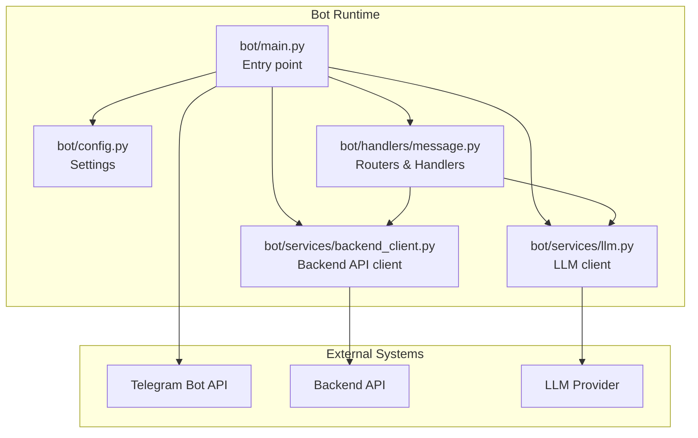
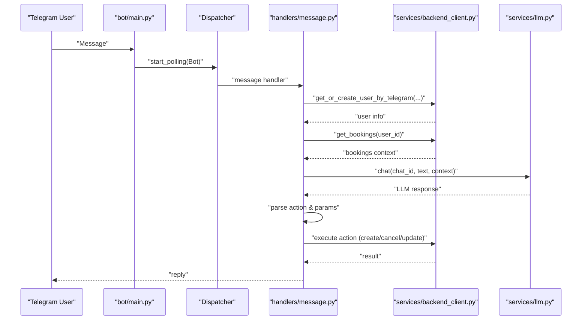
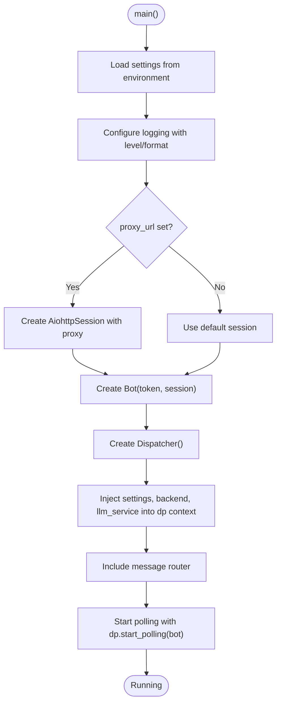
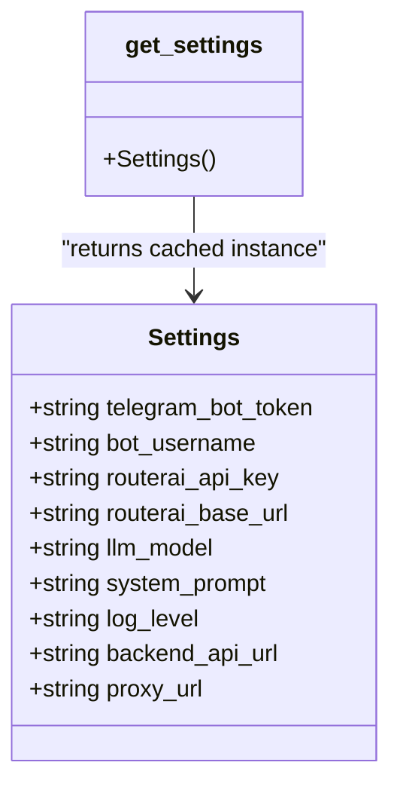
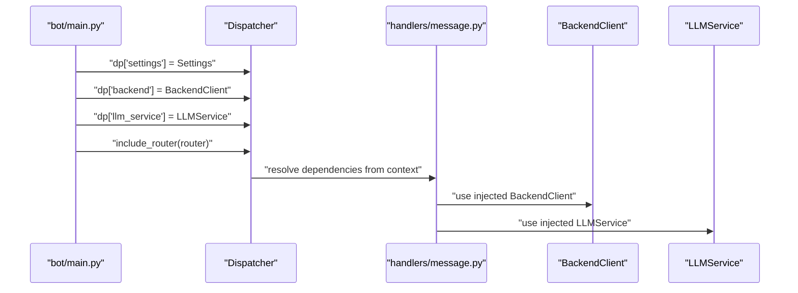
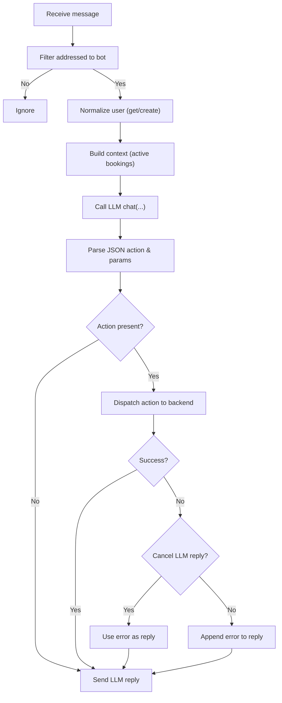
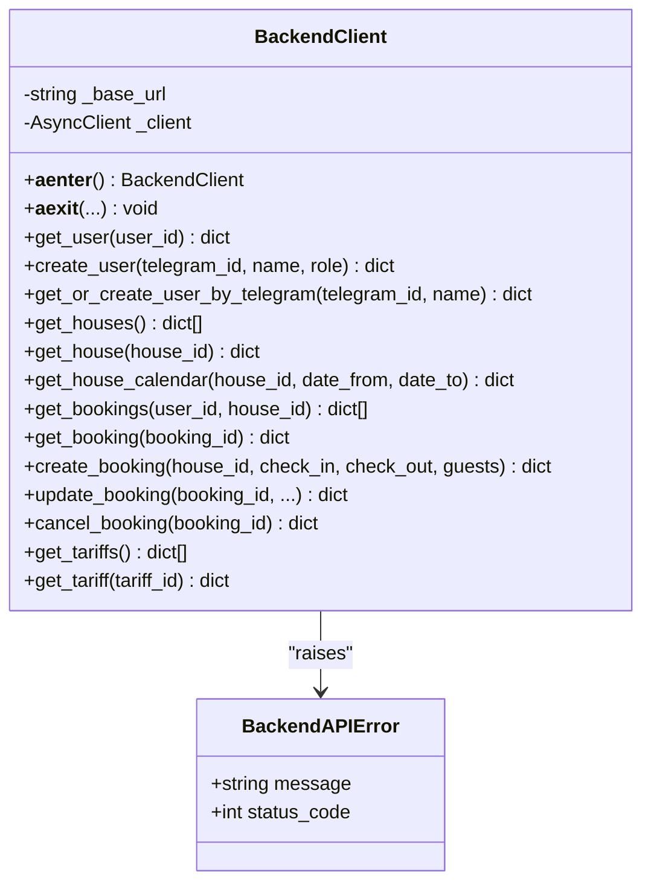
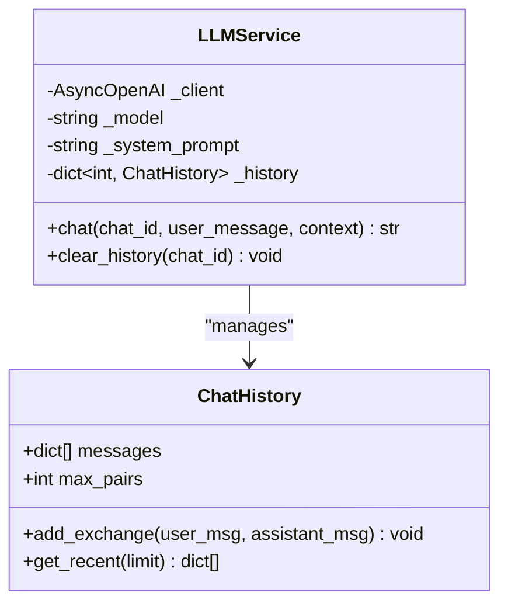
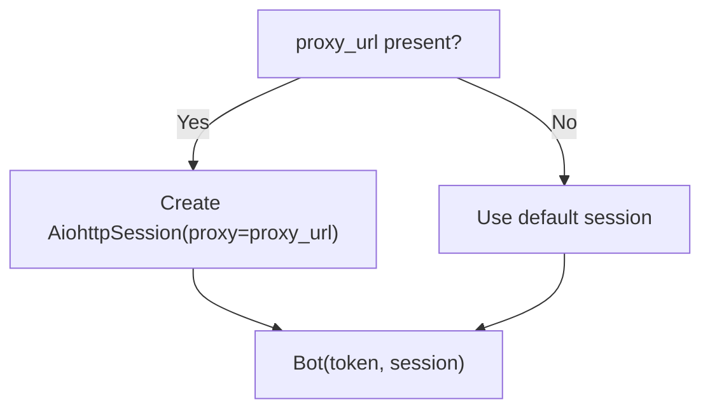
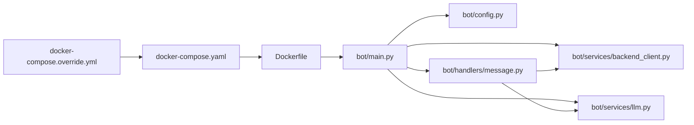

# Bot Architecture and Setup

<cite>
**Referenced Files in This Document**
- [bot/main.py](file://bot/main.py)
- [bot/config.py](file://bot/config.py)
- [bot/handlers/message.py](file://bot/handlers/message.py)
- [bot/services/backend_client.py](file://bot/services/backend_client.py)
- [bot/services/llm.py](file://bot/services/llm.py)
- [backend/config.py](file://backend/config.py)
- [backend/main.py](file://backend/main.py)
- [docker-compose.yaml](file://docker-compose.yaml)
- [docker-compose.override.yml](file://docker-compose.override.yml)
- [Dockerfile](file://Dockerfile)
- [pyproject.toml](file://pyproject.toml)
</cite>

## Table of Contents
1. [Introduction](#introduction)
2. [Project Structure](#project-structure)
3. [Core Components](#core-components)
4. [Architecture Overview](#architecture-overview)
5. [Detailed Component Analysis](#detailed-component-analysis)
6. [Dependency Analysis](#dependency-analysis)
7. [Performance Considerations](#performance-considerations)
8. [Troubleshooting Guide](#troubleshooting-guide)
9. [Conclusion](#conclusion)
10. [Appendices](#appendices)

## Introduction
This document explains the Telegram bot architecture and setup, focusing on initialization, dependency injection, configuration management, logging, and session configuration including proxy support. It documents the main entry point, how the Dispatcher and Bot instance are configured, and how service dependencies are wired. It also covers the settings management system, environment variable handling, and the startup sequence. Finally, it clarifies the relationship between the main application file and handler modules, and provides practical guidance for common configuration issues, proxy setup across environments, and logging configuration options.

## Project Structure
The bot is organized into modules that separate concerns:
- Application entry point initializes logging, builds the session, creates the Bot and Dispatcher, injects dependencies, and starts polling.
- Handlers define routes and orchestrate user interactions, delegating to services.
- Services encapsulate external integrations (LLM and Backend API) with robust error handling and retry logic.
- Configuration is centralized via Pydantic settings loaded from environment variables.

**Diagram sources**
- [bot/main.py:15-46](file://bot/main.py#L15-L46)
- [bot/config.py:44-67](file://bot/config.py#L44-L67)
- [bot/handlers/message.py:1-436](file://bot/handlers/message.py#L1-L436)
- [bot/services/backend_client.py:26-244](file://bot/services/backend_client.py#L26-L244)
- [bot/services/llm.py:43-106](file://bot/services/llm.py#L43-L106)

**Section sources**
- [bot/main.py:15-46](file://bot/main.py#L15-L46)
- [bot/config.py:44-67](file://bot/config.py#L44-L67)
- [bot/handlers/message.py:1-436](file://bot/handlers/message.py#L1-L436)
- [bot/services/backend_client.py:26-244](file://bot/services/backend_client.py#L26-L244)
- [bot/services/llm.py:43-106](file://bot/services/llm.py#L43-L106)

## Core Components
- Entry point and lifecycle
  - Initializes logging with level and format from settings.
  - Builds an optional AiohttpSession with proxy support.
  - Creates the Bot and Dispatcher instances.
  - Injects settings and service dependencies into the Dispatcher context.
  - Includes the message router and starts polling.
- Settings and configuration
  - Centralized via Pydantic Settings with environment loading.
  - Supports optional proxy configuration for outbound requests.
  - Provides defaults for LLM base URL, model, system prompt, and backend API URL.
- Dependency injection pattern
  - Uses Dispatcher context to share settings and services across handlers.
  - Handlers receive injected dependencies via type hints.
- Handler orchestration
  - Filters addressed messages, normalizes input, interacts with BackendClient and LLMService, parses actions, and executes them against the backend.
- Service layer
  - BackendClient: async HTTP client with retry/backoff, structured error types, and resource lifecycle management.
  - LLMService: maintains per-chat history, composes system/user messages, and handles provider errors with fallback responses.

**Section sources**
- [bot/main.py:15-46](file://bot/main.py#L15-L46)
- [bot/config.py:44-67](file://bot/config.py#L44-L67)
- [bot/handlers/message.py:387-436](file://bot/handlers/message.py#L387-L436)
- [bot/services/backend_client.py:26-244](file://bot/services/backend_client.py#L26-L244)
- [bot/services/llm.py:43-106](file://bot/services/llm.py#L43-L106)

## Architecture Overview
The runtime architecture ties together the Telegram Bot API, the internal dispatcher, handlers, and external services.

**Diagram sources**
- [bot/main.py:31-41](file://bot/main.py#L31-L41)
- [bot/handlers/message.py:387-436](file://bot/handlers/message.py#L387-L436)
- [bot/services/backend_client.py:137-151](file://bot/services/backend_client.py#L137-L151)
- [bot/services/llm.py:80-101](file://bot/services/llm.py#L80-L101)

## Detailed Component Analysis

### Entry Point and Initialization
- Logging setup
  - Reads log level from settings and configures basic logging with a standard format.
- Session configuration
  - Creates an AiohttpSession only if a proxy URL is present; otherwise uses the default session.
- Bot and Dispatcher creation
  - Constructs the Bot with the Telegram token and optional session.
  - Creates a Dispatcher and injects shared dependencies into its context.
- Router inclusion
  - Includes the message router so handlers are registered.
- Startup sequence
  - Starts long polling using the Dispatcher’s event loop.

**Diagram sources**
- [bot/main.py:15-41](file://bot/main.py#L15-L41)

**Section sources**
- [bot/main.py:15-41](file://bot/main.py#L15-L41)

### Settings Management and Environment Variables
- Settings class
  - Defines typed fields for Telegram token, bot username, LLM credentials and endpoints, logging level, backend API URL, and optional proxy URL.
  - Uses Pydantic Settings with environment loading from a .env file.
- Defaults
  - Provides sensible defaults for LLM base URL, model, system prompt, and backend API URL.
- Caching
  - get_settings() is cached to ensure a single Settings instance across the app.

**Diagram sources**
- [bot/config.py:44-67](file://bot/config.py#L44-L67)
- [bot/config.py:63-67](file://bot/config.py#L63-L67)

**Section sources**
- [bot/config.py:44-67](file://bot/config.py#L44-L67)
- [bot/config.py:63-67](file://bot/config.py#L63-L67)

### Dependency Injection Pattern
- Dispatcher context
  - The main entry point injects settings and service instances into the Dispatcher’s context dictionary.
- Handler resolution
  - Handlers declare dependencies via type hints; Aiogram resolves them from the Dispatcher context.
- Example injections
  - settings: Settings
  - backend: BackendClient
  - llm_service: LLMService

**Diagram sources**
- [bot/main.py:34-38](file://bot/main.py#L34-L38)
- [bot/handlers/message.py:390-393](file://bot/handlers/message.py#L390-L393)

**Section sources**
- [bot/main.py:34-38](file://bot/main.py#L34-L38)
- [bot/handlers/message.py:390-393](file://bot/handlers/message.py#L390-L393)

### Handler Orchestration and Action Dispatch
- Message filtering
  - Determines if the message is addressed to the bot (private chat, mention, or reply).
- User normalization
  - Ensures a backend user record exists for the Telegram user.
- Context building
  - Gathers active bookings to enrich LLM prompts.
- LLM interaction
  - Sends composed messages to the LLM and parses structured JSON.
- Action dispatch
  - Executes create/cancel/update actions against the backend with strict parameter coercion and validation.
- Reply composition
  - Combines LLM reply with action outcomes, optionally cancelling the LLM reply depending on the action error type.

**Diagram sources**
- [bot/handlers/message.py:387-436](file://bot/handlers/message.py#L387-L436)
- [bot/handlers/message.py:285-323](file://bot/handlers/message.py#L285-L323)
- [bot/handlers/message.py:147-158](file://bot/handlers/message.py#L147-L158)

**Section sources**
- [bot/handlers/message.py:387-436](file://bot/handlers/message.py#L387-L436)
- [bot/handlers/message.py:285-323](file://bot/handlers/message.py#L285-L323)
- [bot/handlers/message.py:147-158](file://bot/handlers/message.py#L147-L158)

### Backend Client Service
- Async HTTP client
  - Lazy initialization of httpx.AsyncClient with configurable timeout and redirect following.
- Retry and error handling
  - Implements retry logic with bounded attempts for server errors and timeouts.
  - Raises structured BackendAPIError with status codes and messages.
- Resource lifecycle
  - Supports async context manager entry/exit to manage client lifetime.
- API surface
  - Methods for users, houses, bookings, and tariffs with safe parsing and fallbacks.

**Diagram sources**
- [bot/services/backend_client.py:26-244](file://bot/services/backend_client.py#L26-L244)

**Section sources**
- [bot/services/backend_client.py:26-244](file://bot/services/backend_client.py#L26-L244)

### LLM Service
- Client initialization
  - Uses AsyncOpenAI with API key and base URL from settings.
- History management
  - Maintains per-chat history with bounded size and recent slices.
- Prompt construction
  - Composes system content with today’s date and current bookings context.
- Error handling
  - Handles rate limits and API errors with fallback responses; logs unexpected errors.

**Diagram sources**
- [bot/services/llm.py:43-106](file://bot/services/llm.py#L43-L106)

**Section sources**
- [bot/services/llm.py:43-106](file://bot/services/llm.py#L43-L106)

### Logging Configuration Options
- Bot logging
  - Level and format are taken from settings; applied at entry point.
- Backend logging
  - Similar pattern in backend main with level from backend settings.
- Best practices
  - Keep log levels consistent across services.
  - Use structured logging and include correlation IDs in production deployments.

**Section sources**
- [bot/main.py:19-22](file://bot/main.py#L19-L22)
- [backend/main.py:23-28](file://backend/main.py#L23-L28)

### Session Configuration and Proxy Support
- Proxy configuration
  - Optional proxy URL enables an AiohttpSession passed to the Bot constructor.
  - Useful for environments where outbound traffic must traverse proxies.
- Network mode in containers
  - The compose override demonstrates using a container network mode and overriding backend URL for local development.

**Diagram sources**
- [bot/main.py:25-31](file://bot/main.py#L25-L31)

**Section sources**
- [bot/main.py:25-31](file://bot/main.py#L25-L31)
- [docker-compose.override.yml:6-12](file://docker-compose.override.yml#L6-L12)

## Dependency Analysis
- Internal dependencies
  - bot/main.py depends on bot/config.py, bot/handlers/message.py, bot/services/backend_client.py, and bot/services/llm.py.
  - Handlers depend on BackendClient and LLMService via Dispatcher context.
- External dependencies
  - Aiogram for Telegram integration.
  - httpx for async HTTP requests.
  - openai for LLM integration.
  - Pydantic settings for configuration.
- Containerization and environment
  - Dockerfile runs the bot module entry point.
  - docker-compose defines services and environment overrides for development.

**Diagram sources**
- [bot/main.py:15-46](file://bot/main.py#L15-L46)
- [bot/config.py:44-67](file://bot/config.py#L44-L67)
- [bot/handlers/message.py:1-436](file://bot/handlers/message.py#L1-L436)
- [bot/services/backend_client.py:26-244](file://bot/services/backend_client.py#L26-L244)
- [bot/services/llm.py:43-106](file://bot/services/llm.py#L43-L106)
- [Dockerfile:12](file://Dockerfile#L12)
- [docker-compose.yaml:16-20](file://docker-compose.yaml#L16-L20)
- [docker-compose.override.yml:6-12](file://docker-compose.override.yml#L6-L12)

**Section sources**
- [bot/main.py:15-46](file://bot/main.py#L15-L46)
- [Dockerfile:12](file://Dockerfile#L12)
- [docker-compose.yaml:16-20](file://docker-compose.yaml#L16-L20)
- [docker-compose.override.yml:6-12](file://docker-compose.override.yml#L6-L12)

## Performance Considerations
- Async I/O
  - Both BackendClient and LLMService are async-first, minimizing blocking and enabling concurrency.
- Retry strategy
  - BackendClient retries transient server errors and timeouts with bounded attempts.
- History limits
  - LLMService caps chat history to reduce payload sizes and improve responsiveness.
- Polling overhead
  - Long polling is efficient for moderate traffic; consider webhooks for high-volume scenarios.

[No sources needed since this section provides general guidance]

## Troubleshooting Guide
- Missing environment variables
  - Ensure required settings (Telegram token, bot username, LLM keys, backend URL) are present in the .env file.
- Proxy connectivity
  - Verify proxy URL format and reachability; confirm the session is constructed only when proxy_url is set.
- Backend API errors
  - Inspect BackendAPIError messages and status codes; check network connectivity and endpoint availability.
- LLM rate limits or failures
  - Expect fallback responses on rate limits or API errors; monitor logs for repeated failures.
- Logging visibility
  - Confirm log level is set appropriately; adjust settings to capture debug-level traces when needed.

**Section sources**
- [bot/config.py:49-60](file://bot/config.py#L49-L60)
- [bot/main.py:25-31](file://bot/main.py#L25-L31)
- [bot/services/backend_client.py:67-112](file://bot/services/backend_client.py#L67-L112)
- [bot/services/llm.py:90-101](file://bot/services/llm.py#L90-L101)
- [bot/main.py:19-22](file://bot/main.py#L19-L22)

## Conclusion
The bot architecture cleanly separates concerns across entry point, configuration, handlers, and services. Dependency injection via the Dispatcher simplifies handler composition and testing. Robust error handling and retry logic in the backend client ensure resilience. Logging and proxy support enable flexible deployment across environments. Together, these patterns provide a scalable foundation for extending the bot with new commands, services, and integrations.

[No sources needed since this section summarizes without analyzing specific files]

## Appendices

### Environment Variable Reference
- Required
  - TELEGRAM_BOT_TOKEN: Telegram bot token
  - BOT_USERNAME: Bot’s username
  - ROUTERAI_API_KEY: LLM provider API key
- Optional
  - ROUTERAI_BASE_URL: LLM base URL (default included)
  - LLM_MODEL: Model identifier (default included)
  - SYSTEM_PROMPT: Custom system prompt (default included)
  - LOG_LEVEL: Logging level (default INFO)
  - BACKEND_API_URL: Backend API base URL (default included)
  - PROXY_URL: Proxy URL for outbound sessions (optional)

**Section sources**
- [bot/config.py:49-60](file://bot/config.py#L49-L60)

### Startup Sequence Summary
- Load settings from .env
- Configure logging
- Optionally create AiohttpSession with proxy
- Create Bot and Dispatcher
- Inject settings and services into Dispatcher context
- Include message router
- Start polling

**Section sources**
- [bot/main.py:15-41](file://bot/main.py#L15-L41)

### Container and Compose Notes
- The bot runs as a Python module inside a container built from the project.
- docker-compose defines services for bot and backend, with environment overrides for development networking and proxy scenarios.

**Section sources**
- [Dockerfile:12](file://Dockerfile#L12)
- [docker-compose.yaml:16-20](file://docker-compose.yaml#L16-L20)
- [docker-compose.override.yml:6-12](file://docker-compose.override.yml#L6-L12)